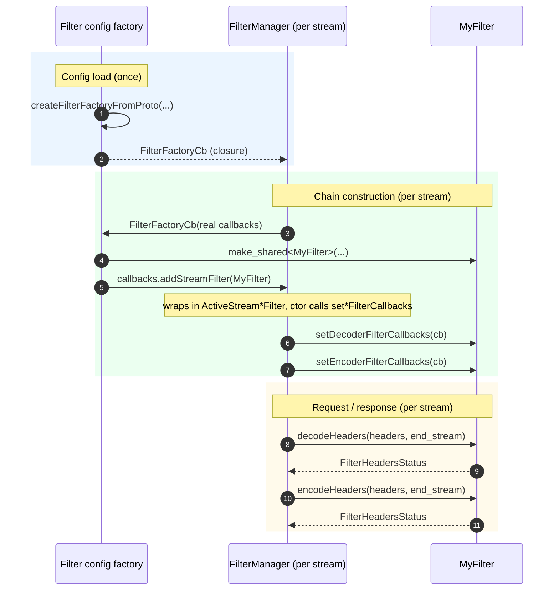
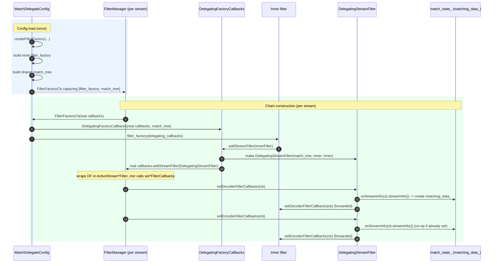
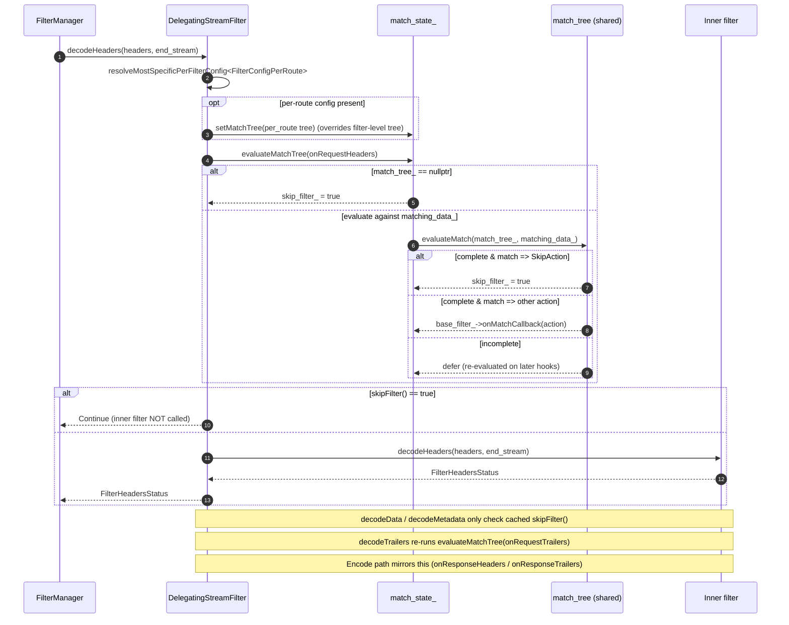

# Filter Sequence: Regular vs. Match-Delegate

Most of the confusion comes from two unrelated things both called "callbacks":

- **`FilterChainFactoryCallbacks`** — used *at chain-construction time* so a filter can register
  itself into the chain (`addStreamDecoderFilter`, `addStreamEncoderFilter`, `addStreamFilter`).
- **`Stream{Decoder,Encoder}FilterCallbacks`** — used *at runtime* by a filter to drive the stream
  (`streamInfo()`, `continueDecoding()`, `sendLocalReply()`, ...). These are pushed into the filter
  via `set{Decoder,Encoder}FilterCallbacks`.

match-delegate wraps the **first** kind (to insert a wrapper filter) and merely **forwards** the
second kind.

Two timing facts that the diagrams depend on (verified in code):

- The `FilterFactoryCb` and the filter-level `match_tree` are built **once at config load**; the
  `match_tree` is **shared** across all streams.
- `set{Decoder,Encoder}FilterCallbacks` is called **synchronously while the chain is being built**
  — the `ActiveStreamDecoderFilter`/`ActiveStreamEncoderFilter` constructor calls it immediately
  (`filter_manager.h:252`, `:342`). For match-delegate that is where `matching_data_` is created
  (`onStreamInfo`), so it exists before any `decodeHeaders`.

---

## 1. Regular filter

A normal filter's config factory returns a `FilterFactoryCb`. Per stream the filter manager runs
it with the real `FilterChainFactoryCallbacks`, and the filter registers **itself**. The manager
wraps it in an `ActiveStream*Filter`, whose constructor immediately hands back the runtime callbacks.

The object in the chain **is** `MyFilter`; it uses the runtime callbacks directly.

---

## 2. Match-delegate filter

The config factory builds the inner filter's factory **and** the shared `match_tree` once. Its
`FilterFactoryCb` wraps the real callbacks in `DelegatingFactoryCallbacks`, so when the inner filter
registers itself the wrapper substitutes a `DelegatingStreamFilter(match_tree, inner)`. At runtime
the delegate evaluates the match tree and either **skips** the inner filter or **delegates** to it.

### 2a. Config load + chain construction

### 2b. Request processing (decode path)

---

## Side-by-side

| Aspect | Regular filter | Match-delegate |
| --- | --- | --- |
| Built once at config load | `FilterFactoryCb` | `FilterFactoryCb` + shared `match_tree` + inner `filter_factory` |
| Factory callbacks | real, used directly | wrapped in `DelegatingFactoryCallbacks` to intercept registration |
| Object added to chain | the filter itself | `DelegatingStreamFilter` wrapping the inner filter |
| `set*FilterCallbacks` | consumed by the filter | consumed by delegate: creates `matching_data_` (`onStreamInfo`), then forwarded to inner |
| Per-stream allocations | one filter | one inner filter + one `DelegatingStreamFilter` |
| Per-request extra logic | none | evaluate `match_tree` → skip or delegate each hook |
| Match evaluation | n/a | evaluated + cached (`match_tree_evaluated_`); re-tried on trailers if incomplete |

## Code references

- Delegate factory + per-stream wrapping closure: `comparison/v1_config.cc:213-246`.
- `DelegatingFactoryCallbacks` (registration interception): `comparison/v1_config.h:88-116`.
- `DelegatingStreamFilter` hooks (skip vs delegate): `comparison/v1_config.cc:97-195`.
  - `decodeHeaders` (per-route resolve + evaluate): `:97-111`.
  - `set{Decoder,Encoder}FilterCallbacks` (`onStreamInfo` creates `matching_data_`): `:141-145`, `:191-195`.
- `evaluateMatchTree` (feed data, evaluate, cache, skip/`onMatchCallback`): `comparison/v1_config.cc:56-84`.
- Runtime callbacks pushed during chain build: `source/common/http/filter_manager.h:252`, `:342`,
  `addStream*Filter` at `:999-1019`.
