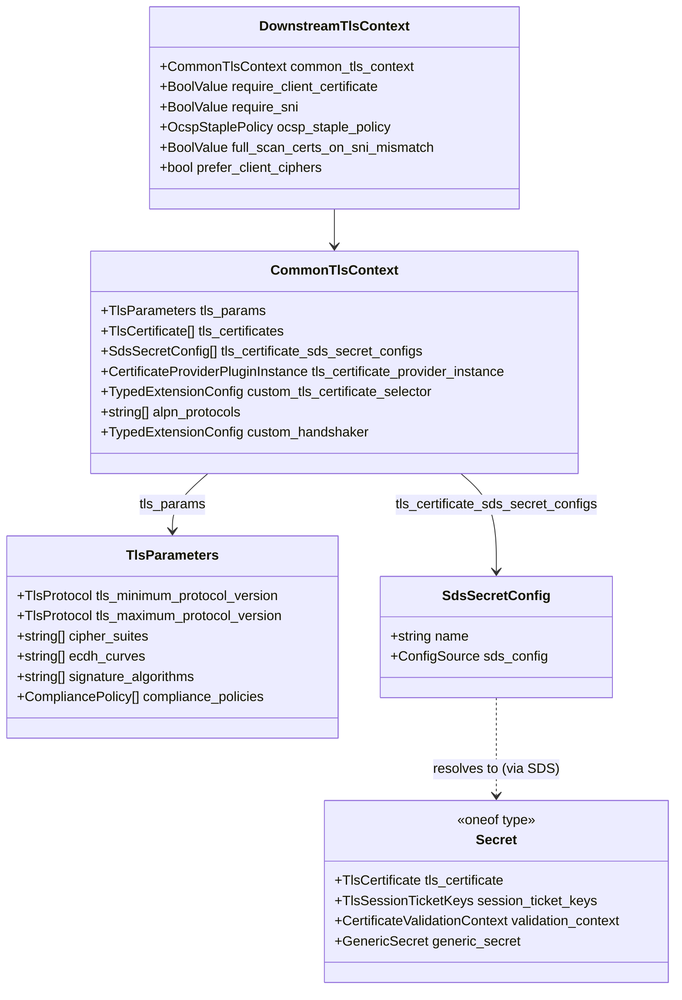
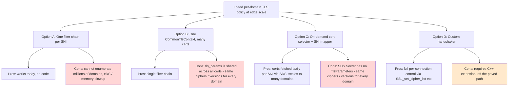
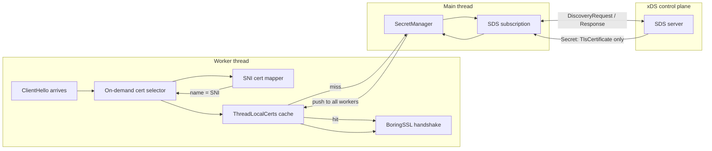
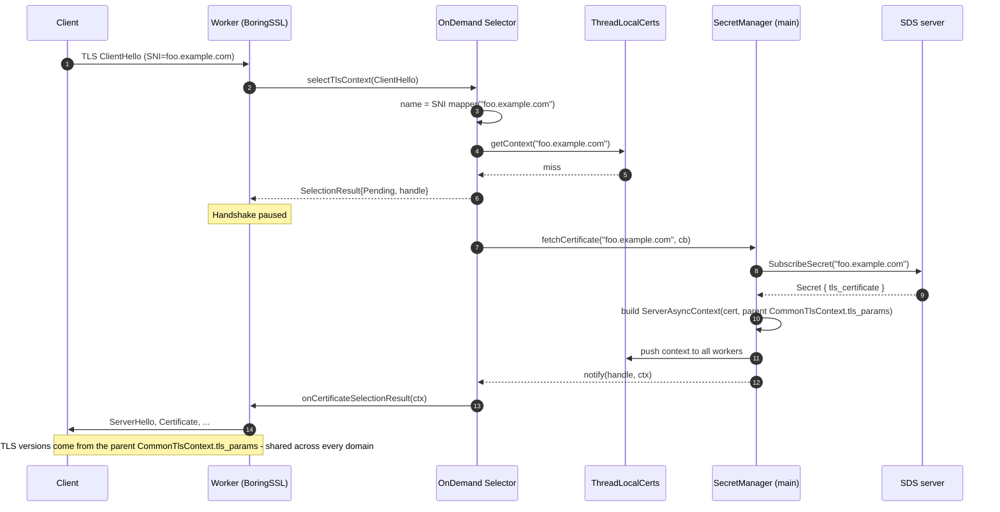
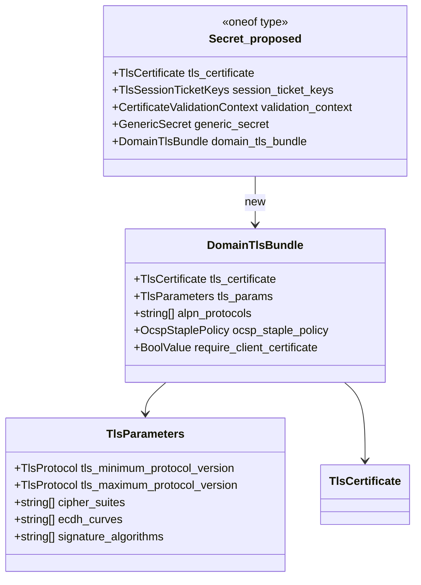
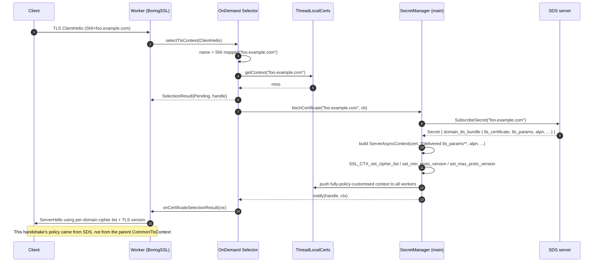
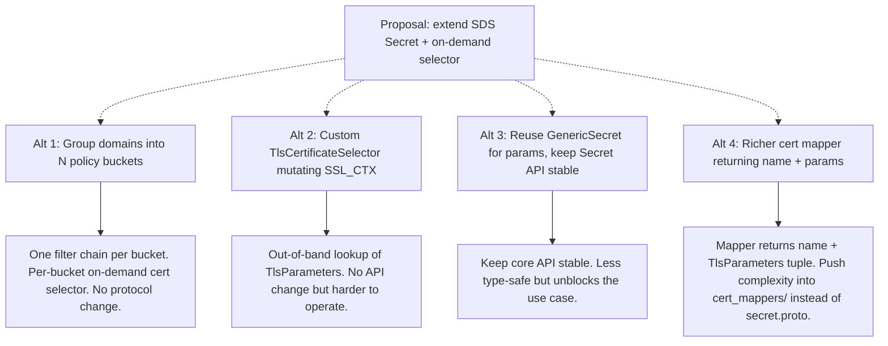

# Per‑Domain TLS Configuration at the Edge

> Tracks upstream issue: [envoyproxy/envoy#44021 — domain specific TLS Configuration](https://github.com/envoyproxy/envoy/issues/44021)
>
> Author of the issue: Rama Chavali. This document summarises the problem, the existing Envoy machinery that gets you partway, the proposal in #44021, and the alternative shapes worth considering.

---

## 1. Problem statement

When Envoy runs as an **edge proxy** terminating TLS for a very large number of public domains, operators need to vary TLS *policy* per domain — not just the certificate. Concretely they want per‑domain:

- `cipher_suites`
- `tls_minimum_protocol_version` / `tls_maximum_protocol_version`
- `ecdh_curves`
- ALPN, OCSP stapling policy, client‑cert requirements, etc.

Today this is structurally possible only by **enumerating every domain in the static / xDS config** (one filter chain or one `CommonTlsContext` entry per policy), which does not scale to tens or hundreds of thousands of domains.

The key constraint:

> **`TlsParameters` lives on `CommonTlsContext`. SDS only delivers certs / validation context / session tickets / generic secrets — it cannot deliver `TlsParameters`.**

So today you can fetch a *cert* per SNI on demand, but you cannot fetch a *cipher list* per SNI on demand.

---

## 2. Where TLS knobs live today (proto map)

The thing to notice: `TlsParameters` has exactly **one** instance per `CommonTlsContext` (i.e. per filter chain). There is no path from an SDS `Secret` back to `TlsParameters`.

Field references in this repo:

- `api/envoy/extensions/transport_sockets/tls/v3/common.proto:28-123` — `TlsParameters`
- `api/envoy/extensions/transport_sockets/tls/v3/tls.proto:89-172` — `DownstreamTlsContext`
- `api/envoy/extensions/transport_sockets/tls/v3/tls.proto:189-370` — `CommonTlsContext`
- `api/envoy/extensions/transport_sockets/tls/v3/secret.proto:34-61` — `SdsSecretConfig`, `Secret`

---

## 3. Existing options for per‑domain TLS (and why they fall short)

Quick summary of each option:

| Option | Per‑domain cert? | Per‑domain TLS params? | Scales to N domains? |
|---|---|---|---|
| A. Filter‑chain per SNI | yes | yes | no — config blowup |
| B. Multiple `tls_certificates[]` in one `CommonTlsContext` | yes (by SNI / sig alg) | no — single `tls_params` | yes for certs only |
| C. On‑demand cert selector + SNI mapper | yes (lazy via SDS) | no — single `tls_params` | yes for certs only |
| D. Custom `handshaker` | yes (via code) | yes (via code) | yes but custom code |

Option C is where the issue starts, because it already solves the cert side of the problem. The proposal is to extend it to cover the policy side too.

---

## 4. How the on‑demand cert selector works today

This is the machinery Rama proposes to extend. The code lives at:

- `source/extensions/transport_sockets/tls/cert_selectors/on_demand/` — the selector
- `source/extensions/transport_sockets/tls/cert_mappers/sni/` — derives a name from the ClientHello (the SNI value)
- Plugged in via `CommonTlsContext.custom_tls_certificate_selector` (`tls.proto:299-308`)

### 4.1 Component view

### 4.2 Handshake sequence (cache miss)

The "limitation" arrow at the bottom is the whole point: the per‑connection `SSL_CTX` inherits ciphers / versions from the parent `CommonTlsContext.tls_params`, because SDS gave us *only* a cert.

---

## 5. Rama's proposal

> "Extend the on‑demand cert selector and expand SDS for Per‑Domain TLS Properties and when SDS delivers with certs + TLS properties, we can build new context also set cipher suites etc along with certs."

This is two coordinated changes — one API change, one extension change.

### 5.1 API change: SDS `Secret` carries TLS properties

A new `oneof` variant in `Secret` (or a new field inside `TlsCertificate`'s parent) so a single SDS push delivers both the cert and its policy:

Exact field name / oneof shape is a design call; the substance is: **make `TlsParameters` (and ideally ALPN / OCSP / client‑cert) part of a single SDS resource keyed by the same name the cert mapper produces.**

### 5.2 Extension change: on‑demand selector builds a fresh `SSL_CTX`

In `source/extensions/transport_sockets/tls/cert_selectors/on_demand/config.cc`, `ServerAsyncContext` today specialises `ServerContextImpl` for "one cert, parent params". After the change it specialises for "one cert, **one delivered set of `TlsParameters`**" — i.e. the selector calls the equivalent of `SSL_CTX_set_cipher_list`, `SSL_CTX_set_min_proto_version`, `SSL_CTX_set_max_proto_version`, etc. using the per‑domain payload from SDS.

### 5.3 Updated handshake sequence (proposed)

### 5.4 Why this fits the existing design

The on‑demand selector already has all the hard machinery:

- A `SecretManager` that owns SDS subscriptions and lifecycles them.
- A worker‑local `ThreadLocalCerts` cache so steady‑state handshakes are lock‑free.
- A `runOnAllThreads` push from main to workers when SDS updates a secret.
- A pending‑handle list so handshakes waiting on a miss are resumed exactly once.
- A removal path so dropping an SDS secret aborts in‑flight handshakes cleanly.

All of that is reusable verbatim. The only delta is **the shape of what gets cached**: today a `TlsContext` built with parent params, tomorrow a `TlsContext` built with delivered params.

### 5.5 Subtleties worth calling out in the issue

- **Validation context.** If the proposal is "one SDS resource per domain", the bundle should probably also carry (or reference) a per‑domain `CertificateValidationContext` and `require_client_certificate`, otherwise mTLS per domain becomes a second pass.
- **ALPN.** Per‑domain ALPN selection is interesting because ALPN is decided during the same handshake — the proposal will need to make sure the delivered ALPN list is applied **before** `SSL_CTX_set_alpn_select_cb` runs, which the on‑demand path can already do since cert selection happens in the ClientHello callback.
- **Session resumption.** The on‑demand selector today already forbids stateful and stateless session resumption (`source/extensions/transport_sockets/tls/cert_selectors/on_demand/README.md`, `config.cc:320`) because session IDs are keyed by the parent context's certs. That restriction transfers cleanly to the proposal.
- **QUIC.** Same caveat — today the on‑demand selector rejects QUIC listeners. The proposal inherits that limit unless a new code path is added.
- **Cache key.** Today the cache key is the cert mapper's name (SNI). If two domains share a cert but want different ciphers, they need distinct cache keys, which means the cert mapper (or SDS resource naming) needs to capture *policy identity*, not just *cert identity*. Worth deciding explicitly.

---

## 6. Alternatives worth considering before changing the API

| Alt | API change? | Operational complexity | Type safety |
|---|---|---|---|
| Proposal | yes (`Secret` oneof) | low | high |
| Alt 1 (policy buckets) | no | low | high |
| Alt 2 (custom selector) | no | medium | medium |
| Alt 3 (GenericSecret) | no | medium | low |
| Alt 4 (richer mapper) | yes (mapper interface) | medium | high |

In practice most edge deployments have a *small* number of distinct cipher/version policies ("modern", "intermediate", "legacy"), so **Alt 1** is the cheapest answer and may be enough — pair an on‑demand cert selector *inside* each bucketed filter chain. The proposal is the right answer only if policies are genuinely per‑domain and unbounded in cardinality.

---

## 7. Where this would land in the tree

If the proposal goes through, expect changes here:

- `api/envoy/extensions/transport_sockets/tls/v3/secret.proto` — new oneof variant on `Secret` (or new message imported by it).
- `api/envoy/extensions/transport_sockets/tls/cert_selectors/on_demand_secret/v3/` — possibly a new field on the selector `Config` to opt into the richer secret shape (back‑compat).
- `source/extensions/transport_sockets/tls/cert_selectors/on_demand/config.{h,cc}` — `ServerAsyncContext` / `AsyncContextConfig::loadCert` learn to apply delivered `TlsParameters` to the per‑domain `SSL_CTX`.
- `source/common/tls/context_impl.{h,cc}` — small refactor so the cipher / version setters can be driven from a per‑context config, not only the parent `CommonTlsContext`.
- Docs: `source/extensions/transport_sockets/tls/cert_selectors/on_demand/README.md` updated lifecycle section.

---

## 8. TL;DR

- Today `TlsParameters` is per filter chain, and SDS cannot deliver it. So per‑domain ciphers / TLS versions at edge scale is unsolvable without enumerating domains in config.
- The on‑demand cert selector + SNI cert mapper already solves per‑domain **certs** at scale.
- Rama proposes extending SDS so the same SDS resource that carries the cert also carries the domain's `TlsParameters` (and ideally ALPN / OCSP / client‑cert policy), and extending the on‑demand selector to apply those parameters to the per‑domain `SSL_CTX`.
- The on‑demand selector's existing subscription, worker‑local cache, push‑to‑all‑threads, and removal machinery are reusable as‑is.
- Before changing the API, the smallest viable alternative is to group domains into a handful of policy buckets and keep on‑demand certs *inside* each bucket.
