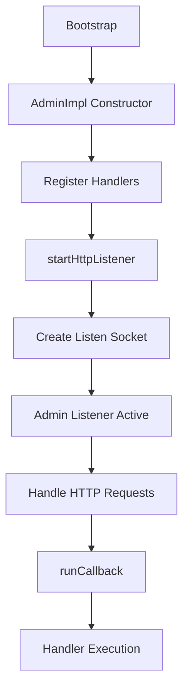

# Admin Interface and Endpoints

## Overview

Envoy's admin interface provides HTTP endpoints for runtime inspection, configuration, and management. The admin server runs on a separate socket from the main proxy and exposes powerful debugging and operational tools.

## Architecture

### Admin Implementation

**Key Components**:
- `AdminImpl` (`source/server/admin/admin.h`, `admin.cc`) - Main admin interface implementation
- Specialized handlers in `source/server/admin/*_handler.h` - Domain-specific endpoint logic
- HTTP connection manager integration for request handling
- Access log support for audit trails

**Design Principles**:
- Read-only by default (most endpoints don't mutate state)
- Some endpoints marked as `mutates_server_state` require caution
- Thread-safe access to server state
- Support for both text and structured (JSON) output formats

### Admin Server Lifecycle



## Core Admin Endpoints

### Server Information

#### `/server_info`
**Purpose**: Print server version and status information  
**Method**: GET  
**Output**: JSON or text with:
- Envoy version
- Build information (commit SHA, build type)
- Server state (LIVE, DRAINING, etc.)
- Uptime
- Hot restart version

**Example**:
```bash
curl http://localhost:9901/server_info
```

**Output**:
```json
{
  "version": "1.29.0/Clean/RELEASE/BoringSSL",
  "state": "LIVE",
  "hot_restart_version": "11.104",
  "command_line_options": {...},
  "uptime_current_epoch": "152s",
  "uptime_all_epochs": "152s"
}
```

#### `/ready`
**Purpose**: Health check endpoint for readiness  
**Method**: GET  
**Returns**:
- `200 OK` if server state is LIVE
- `503 Service Unavailable` otherwise

**Use Case**: Kubernetes readiness probes

#### `/memory`
**Purpose**: Print current memory allocation and heap usage  
**Method**: GET  
**Output**: Memory statistics including:
- Total physical memory
- Allocated memory
- Heap size (if using tcmalloc)

#### `/memory/tcmalloc`
**Purpose**: Print detailed TCMalloc statistics  
**Method**: GET  
**Output**: TCMalloc heap profiler stats (if enabled)

### Configuration Management

#### `/config_dump`
**Purpose**: Dump current Envoy configuration (bootstrap + dynamic xDS)  
**Method**: GET  
**Parameters**:
- `resource` (string, optional) - Specific resource type to dump (e.g., "listeners", "clusters", "routes")
- `mask` (string, optional) - Protobuf FieldMask to limit fields returned
- `name_regex` (string, optional) - Filter resources by name pattern
- `include_eds` (boolean, optional) - Include EDS (endpoint) configuration

**Example**:
```bash
# Dump all configuration
curl http://localhost:9901/config_dump

# Dump only listeners
curl http://localhost:9901/config_dump?resource=listeners

# Dump clusters with name filtering
curl http://localhost:9901/config_dump?resource=clusters&name_regex=^outbound
```

**Output**: JSON with versioned configuration including:
- `bootstrap` - Static bootstrap config
- `clusters` - Cluster (CDS) configuration
- `listeners` - Listener (LDS) configuration
- `routes` - Route (RDS) configuration
- `scoped_routes` - Scoped route configuration
- `secrets` - Secret (SDS) configuration

**Key Fields**:
- `version_info` - xDS version string for each resource
- `last_updated` - Timestamp of last update
- `static_resources` vs `dynamic_resources`

#### `/init_dump`
**Purpose**: Dump Envoy init manager information (shows initialization state)  
**Method**: GET  
**Parameters**:
- `mask` (string, optional) - Component to dump (e.g., "listener")

**Use Case**: Debug why Envoy is not ready (stuck in initialization)

### Cluster Management

#### `/clusters`
**Purpose**: Show upstream cluster status and health  
**Method**: GET  
**Parameters**:
- `filter` (string, optional) - Regex (Google re2) for filtering clusters by name

**Output**: Detailed cluster information including:
- Cluster health status
- Host health (healthy/unhealthy/degraded)
- Active connections, requests
- Circuit breaker stats (open/closed)
- Outlier detection status
- Load balancing stats
- Per-host endpoint information

**Example**:
```bash
curl http://localhost:9901/clusters
```

**Output**:
```
outbound|8080||productpage.default.svc.cluster.local::observability_name::outbound|8080||productpage
outbound|8080||productpage.default.svc.cluster.local::default_priority::max_connections::1024
outbound|8080||productpage.default.svc.cluster.local::default_priority::max_pending_requests::1024
outbound|8080||productpage.default.svc.cluster.local::default_priority::max_requests::1024
outbound|8080||productpage.default.svc.cluster.local::default_priority::max_retries::3
outbound|8080||productpage.default.svc.cluster.local::high_priority::max_connections::1024
...
outbound|8080||productpage.default.svc.cluster.local::10.244.0.5:8080::health_flags::healthy
outbound|8080||productpage.default.svc.cluster.local::10.244.0.5:8080::weight::1
outbound|8080||productpage.default.svc.cluster.local::10.244.0.5:8080::cx_active::0
outbound|8080||productpage.default.svc.cluster.local::10.244.0.5:8080::rq_active::0
```

### Listener Management

#### `/listeners`
**Purpose**: Print listener information  
**Method**: GET  
**Parameters**:
- `format` (enum, optional) - Output format: "text" or "json" (default: text)

**Output**:
- Listener addresses
- Filter chain configuration
- Connection limits
- Active connections
- Per-listener stats

**Example**:
```bash
curl http://localhost:9901/listeners?format=json
```

#### `/drain_listeners`
**Purpose**: Drain listeners (graceful shutdown of connections)  
**Method**: POST  
**Mutates State**: YES  
**Parameters**:
- `graceful` (boolean, optional) - Enter graceful drain period before closing
- `skip_exit` (boolean, optional) - Don't exit after drain (must use with graceful)
- `inboundonly` (boolean, optional) - Drain only inbound listeners

**Use Case**: Rolling deployments, graceful shutdowns

**Flow**:
1. Stop accepting new connections
2. (If graceful) Wait for drain period
3. Close existing connections
4. (Unless skip_exit) Terminate process

### Statistics

#### `/stats`
**Purpose**: Print server statistics  
**Method**: GET  
**Parameters**:
- `filter` (string, optional) - Regex to filter stats by name
- `format` (enum, optional) - "prometheus", "json", or "text"
- `usedonly` (boolean, optional) - Only include stats that have been written

**Output**: All Envoy statistics including:
- Cluster stats (upstream_rq_*, upstream_cx_*)
- Listener stats (downstream_rq_*, downstream_cx_*)
- HTTP stats (http.*.rq_*, http.*.rq_time)
- Server stats (server.*, runtime.*)

**Example**:
```bash
# All stats
curl http://localhost:9901/stats

# Filter to cluster stats
curl http://localhost:9901/stats?filter=cluster\..*

# JSON format
curl http://localhost:9901/stats?format=json
```

#### `/stats/prometheus`
**Purpose**: Export stats in Prometheus format  
**Method**: GET  
**Parameters**:
- `usedonly` (boolean, optional) - Only used stats
- `text_readouts` (boolean, optional) - Render text readouts as gauges
- `filter` (string, optional) - Filter stats by regex
- `histogram_buckets` (enum, optional) - "cumulative" or "summary"

**Use Case**: Prometheus scraping

#### `/reset_counters`
**Purpose**: Reset all counter statistics to zero  
**Method**: POST  
**Mutates State**: YES  

**Use Case**: Testing, debugging

#### `/stats/recentlookups`
**Purpose**: Show recent stat-name lookups  
**Method**: GET  
**Use Case**: Debug performance issues with stat lookup

#### `/stats/recentlookups/enable`
**Purpose**: Enable recording of stat-name lookups  
**Method**: POST

#### `/stats/recentlookups/disable`
**Purpose**: Disable recording of stat-name lookups  
**Method**: POST

#### `/stats/recentlookups/clear`
**Purpose**: Clear lookup tracking  
**Method**: POST

### Runtime Configuration

#### `/runtime`
**Purpose**: Print current runtime configuration values  
**Method**: GET  
**Output**: All runtime flags and their values

**Example**:
```bash
curl http://localhost:9901/runtime
```

**Output**:
```json
{
  "layers": [
    {
      "name": "static_layer",
      "values": {
        "health_check.min_interval": "1000",
        "upstream.healthy_panic_threshold": "50"
      }
    },
    {
      "name": "admin",
      "values": {
        "some.override": "value"
      }
    }
  ]
}
```

#### `/runtime_modify`
**Purpose**: Modify runtime values dynamically  
**Method**: POST  
**Mutates State**: YES  
**Parameters**: Query parameters as key-value pairs

**Example**:
```bash
# Set runtime values
curl -X POST "http://localhost:9901/runtime_modify?health_check.min_interval=5000&upstream.healthy_panic_threshold=40"

# Delete an override (empty value)
curl -X POST "http://localhost:9901/runtime_modify?some.override="
```

**Notes**:
- Only adds/modifies runtime overrides (admin layer)
- Cannot delete values from static/file layers
- Overrides persist until process restart

### Logging

#### `/logging`
**Purpose**: Query or change logging levels  
**Method**: POST  
**Mutates State**: YES  
**Parameters**:
- `paths` (string, optional) - Change multiple loggers: "logger1:level1,logger2:level2"
- `level` (enum, optional) - Change all loggers to this level (trace, debug, info, warn, error, critical, off)

**Example**:
```bash
# Set all loggers to debug
curl -X POST "http://localhost:9901/logging?level=debug"

# Set specific loggers
curl -X POST "http://localhost:9901/logging?paths=connection:debug,router:trace"

# Reset to default
curl -X POST "http://localhost:9901/logging?level=info"
```

#### `/reopen_logs`
**Purpose**: Reopen access log files  
**Method**: POST  
**Mutates State**: YES  

**Use Case**: Log rotation (after external log file rotation)

### Health Checks

#### `/healthcheck/fail`
**Purpose**: Cause server to fail health checks  
**Method**: POST  
**Mutates State**: YES  

**Use Case**: Remove instance from load balancer for maintenance

#### `/healthcheck/ok`
**Purpose**: Restore server to pass health checks  
**Method**: POST  
**Mutates State**: YES

### Profiling

#### `/cpuprofiler`
**Purpose**: Enable/disable CPU profiler  
**Method**: POST  
**Mutates State**: YES  
**Parameters**:
- `enable` (enum) - "y" or "n"

**Requirements**: Envoy built with gperftools

#### `/heapprofiler`
**Purpose**: Enable/disable heap profiler  
**Method**: POST  
**Parameters**:
- `enable` (enum) - "y" or "n"

#### `/heap_dump`
**Purpose**: Dump current heap  
**Method**: GET  
**Requirements**: TCMalloc

#### `/allocprofiler`
**Purpose**: Enable/disable allocation profiler  
**Method**: POST  
**Parameters**:
- `enable` (enum) - "y" or "n"

#### `/contention`
**Purpose**: Dump mutex contention stats  
**Method**: GET  
**Requirements**: Mutex tracing enabled at compile time

### Process Management

#### `/quitquitquit`
**Purpose**: Exit the Envoy process  
**Method**: POST  
**Mutates State**: YES  

**Use Case**: Graceful shutdown via admin interface

**Warning**: This immediately terminates Envoy. Use `/drain_listeners` for graceful shutdown.

#### `/hot_restart_version`
**Purpose**: Print hot restart compatibility version  
**Method**: GET  
**Output**: Hot restart epoch and version

### Certificates

#### `/certs`
**Purpose**: Print certificates on machine  
**Method**: GET  
**Output**: All loaded TLS certificates including:
- Certificate chain
- Expiration dates
- Subject/issuer information
- Serial numbers

**Example**:
```bash
curl http://localhost:9901/certs
```

### Help

#### `/help`
**Purpose**: Print list of all admin commands  
**Method**: GET  
**Output**: All registered endpoints with descriptions and parameters

#### `/`
**Purpose**: Admin home page  
**Method**: GET  
**Output**: HTML page with links to all endpoints

## Configuration

### Bootstrap Configuration

```yaml
admin:
  access_log:
    - name: envoy.access_loggers.file
      typed_config:
        "@type": type.googleapis.com/envoy.extensions.access_loggers.file.v3.FileAccessLog
        path: /var/log/envoy/admin_access.log
  profile_path: /var/log/envoy/envoy.prof
  address:
    socket_address:
      address: 0.0.0.0
      port_value: 9901
```

**Key Fields**:
- `address` - Socket address for admin interface
- `access_log` - Access logging for admin requests (audit trail)
- `profile_path` - Path for profiler output
- `socket_options` - Socket-level options (reuse, buffer sizes, etc.)

### Security Considerations

**Admin Interface Security**:
1. **Network Isolation**: Bind to localhost or internal network only
   ```yaml
   address:
     socket_address:
       address: 127.0.0.1  # Localhost only
       port_value: 9901
   ```

2. **Firewall Rules**: Block external access to admin port

3. **Access Logging**: Enable audit trail
   ```yaml
   access_log:
     - name: envoy.access_loggers.file
       typed_config:
         "@type": type.googleapis.com/envoy.extensions.access_loggers.file.v3.FileAccessLog
         path: /var/log/envoy/admin_access.log
         format: "[%START_TIME%] \"%REQ(:METHOD)% %REQ(X-ENVOY-ORIGINAL-PATH?:PATH)% %PROTOCOL%\" %RESPONSE_CODE% %RESPONSE_FLAGS% %BYTES_RECEIVED% %BYTES_SENT% %DURATION%\n"
   ```

4. **Authentication**: Use sidecar pattern (admin interface + auth proxy)

5. **Read-Only Operations**: Prefer read-only endpoints in production

6. **Mutating Endpoints**: Restrict access to:
   - `/runtime_modify`
   - `/drain_listeners`
   - `/healthcheck/fail`
   - `/healthcheck/ok`
   - `/quitquitquit`
   - `/reset_counters`
   - `/logging`
   - `/reopen_logs`

## Implementation Details

### Handler Registration

**File**: `source/server/admin/admin.cc:101-190`

Handlers registered in `AdminImpl` constructor using `makeHandler`:

```cpp
makeHandler(
  "/endpoint",              // URL prefix
  "Description",            // Help text
  MAKE_ADMIN_HANDLER(fn),  // Callback
  false,                    // Removable?
  false,                    // Mutates server state?
  {{Type, "param", "desc"}} // Parameters
)
```

### Request Processing

**Flow**:
1. HTTP request arrives on admin socket
2. `AdminImpl::runCallback` dispatches to registered handler
3. Handler executes and populates response buffer
4. HTTP response sent to client

### Custom Handlers

Extensions can register custom admin handlers:

```cpp
server.admin().addHandler(
  "/my_custom_endpoint",
  "My custom endpoint",
  [](Http::HeaderMap&, Buffer::Instance& response, AdminStream&) {
    response.add("Hello from custom endpoint\n");
    return Http::Code::OK;
  },
  true,   // removable
  false   // doesn't mutate state
);
```

## Common Use Cases

### Debugging Connection Issues

```bash
# Check cluster health
curl http://localhost:9901/clusters | grep health_flags

# Check listener status
curl http://localhost:9901/listeners

# Check active connections
curl http://localhost:9901/stats | grep cx_active
```

### Configuration Validation

```bash
# Dump and verify listener config
curl http://localhost:9901/config_dump?resource=listeners | jq .

# Check what routes are configured
curl http://localhost:9901/config_dump?resource=routes | jq .
```

### Performance Monitoring

```bash
# Check request rates
curl http://localhost:9901/stats | grep rq_total

# Check latency
curl http://localhost:9901/stats | grep rq_time

# Prometheus export
curl http://localhost:9901/stats/prometheus
```

### Graceful Shutdown

```bash
# Drain listeners with grace period
curl -X POST http://localhost:9901/drain_listeners?graceful=true

# Immediate shutdown
curl -X POST http://localhost:9901/quitquitquit
```

### Runtime Tuning

```bash
# Check current runtime values
curl http://localhost:9901/runtime

# Adjust circuit breaker threshold
curl -X POST "http://localhost:9901/runtime_modify?upstream.healthy_panic_threshold=30"
```

## Related Files

- `source/server/admin/admin.h` - AdminImpl class definition
- `source/server/admin/admin.cc` - Main implementation and handler registration
- `source/server/admin/*_handler.{h,cc}` - Specialized handlers
- `envoy/server/admin.h` - Admin interface definition
