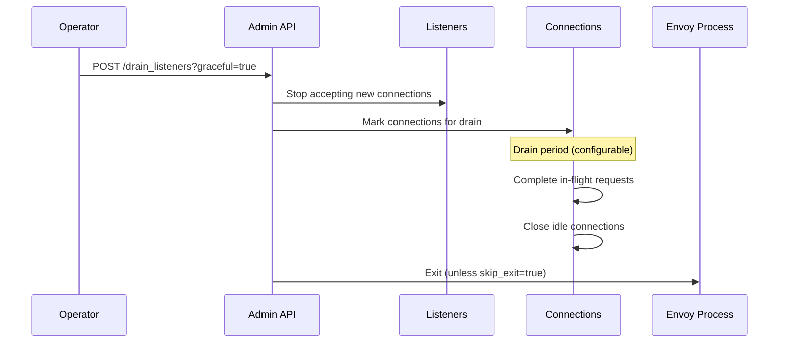

# Operational Procedures

## Graceful Shutdown and Draining

### Overview

Envoy supports graceful shutdown to avoid dropping in-flight requests during deployments or maintenance.

### Drain Process



### Drain Modes

#### Immediate Drain (Non-Graceful)

```bash
curl -X POST http://localhost:9901/drain_listeners
```

**Behavior**:
1. Stop accepting new connections immediately
2. Close existing connections immediately
3. Exit process

**Use Case**: Emergency shutdown, testing

#### Graceful Drain

```bash
curl -X POST "http://localhost:9901/drain_listeners?graceful=true"
```

**Behavior**:
1. Stop accepting new connections
2. Enter drain period (default: from `--drain-time-s` CLI flag or config)
3. Allow in-flight requests to complete
4. Send `Connection: close` header on HTTP/1.1 responses
5. Send GOAWAY on HTTP/2 connections
6. Wait for drain period
7. Force close remaining connections
8. Exit process

**Configuration**:
```bash
# Set drain time via CLI (30 seconds)
envoy --drain-time-s 30 --config-path /etc/envoy/envoy.yaml
```

Or in bootstrap:
```yaml
static_resources:
  listeners:
    - drain_type: MODIFY_ONLY  # or DEFAULT
```

#### Graceful Drain Without Exit

```bash
curl -X POST "http://localhost:9901/drain_listeners?graceful=true&skip_exit=true"
```

**Behavior**:
- Same as graceful drain but **doesn't exit**
- Listeners remain closed (no new connections)
- Useful for manual testing or orchestration

**Use Case**: Custom shutdown orchestration

#### Inbound-Only Drain

```bash
curl -X POST "http://localhost:9901/drain_listeners?inboundonly=true&graceful=true"
```

**Behavior**:
- Only drains inbound listeners (traffic_direction: INBOUND)
- Outbound listeners remain active
- Useful in service mesh sidecar scenarios

**Use Case**: Drain server traffic while keeping egress active

### Drain Strategies

#### Rolling Update Strategy

**Kubernetes Example**:
```yaml
apiVersion: v1
kind: Pod
metadata:
  name: my-service
spec:
  containers:
    - name: envoy
      image: envoyproxy/envoy:v1.29
      lifecycle:
        preStop:
          exec:
            command: [
              "/bin/sh",
              "-c",
              "curl -X POST http://localhost:9901/drain_listeners?graceful=true"
            ]
  terminationGracePeriodSeconds: 60  # Must be > drain time
```

**Flow**:
1. Kubernetes sends SIGTERM
2. preStop hook drains listeners
3. Envoy completes in-flight requests
4. Pod terminates after grace period

#### Load Balancer Drain Pattern

**For instances behind load balancer**:
```bash
# Step 1: Fail health checks (LB removes instance)
curl -X POST http://localhost:9901/healthcheck/fail

# Step 2: Wait for LB to remove instance (30-60s typically)
sleep 60

# Step 3: Drain listeners gracefully
curl -X POST "http://localhost:9901/drain_listeners?graceful=true"
```

#### Hot Restart Drain

Envoy hot restart automatically handles draining:
```bash
# New Envoy process takes over listeners
# Old process enters drain mode automatically
# Old process exits after drain period
```

No manual drain needed.

## Hot Restart

### Overview

Hot restart allows updating Envoy binary or configuration without dropping connections.

### Architecture

```
┌─────────────────────┐
│   Parent Process    │  (Old Envoy)
│   - Draining        │
│   - Closes after    │
│     drain period    │
└──────────┬──────────┘
           │ Shared Memory
           │ + Unix Domain Socket
┌──────────▼──────────┐
│   Child Process     │  (New Envoy)
│   - Inherits FDs    │
│   - Takes over      │
│     listening       │
└─────────────────────┘
```

### How It Works

1. **Start Child**: New Envoy starts with `--restart-epoch N`
2. **Socket Passing**: Child receives listening sockets from parent via UDS
3. **Shared Stats**: Stats shared via shared memory
4. **Parent Drains**: Parent enters drain mode
5. **Parent Exits**: After drain period, parent terminates
6. **Child Active**: Child handles all new connections

### Performing Hot Restart

#### Manual Hot Restart

```bash
# Get current process info
CURRENT_EPOCH=$(curl -s http://localhost:9901/server_info | jq -r .command_line_options.restart_epoch)
NEXT_EPOCH=$((CURRENT_EPOCH + 1))

# Start new Envoy process
envoy --config-path /etc/envoy/envoy.yaml \
      --restart-epoch $NEXT_EPOCH \
      --base-id $BASE_ID  # Must match parent
```

#### Systemd Integration

```ini
# /etc/systemd/system/envoy.service
[Unit]
Description=Envoy Proxy
After=network.target

[Service]
Type=notify
ExecStart=/usr/local/bin/envoy -c /etc/envoy/envoy.yaml --base-id 0
ExecReload=/bin/kill -HUP $MAINPID
Restart=on-failure
RestartSec=5s

[Install]
WantedBy=multi-user.target
```

Reload:
```bash
sudo systemctl reload envoy
```

#### Docker/Kubernetes Hot Restart

**Not commonly used** because:
- Containers are ephemeral (restart means new container)
- Rolling updates achieve similar goal
- xDS provides config updates without restart

**Exception**: Binary updates within long-running containers

### Hot Restart Limitations

1. **Configuration Changes**: Some changes still require restart:
   - Bootstrap config changes (admin address, stats config)
   - Core listener socket changes (address, port)
   
2. **Overhead**: Brief CPU spike during takeover

3. **Shared Memory**: Requires shared memory support (Unix-like systems)

4. **Windows**: Not supported on Windows

### Hot Restart vs xDS

| Aspect | Hot Restart | xDS |
|--------|-------------|-----|
| **Config Updates** | Bootstrap + dynamic | Dynamic only |
| **Binary Updates** | Yes | No |
| **Downtime** | None (seamless) | None (seamless) |
| **Connection Drop** | No | No |
| **Complexity** | Medium | Low |
| **Use Case** | Binary/bootstrap updates | Config updates |

**Recommendation**: Use xDS for most config changes, hot restart for binary updates.

## Health Check Management

### Health Check States

Envoy maintains internal health state separate from upstream health checks:

```
         ┌────────┐
         │ HEALTHY│  (Default state)
         └───┬────┘
             │
    /healthcheck/fail
             │
         ┌───▼────┐
         │ FAILED │
         └───┬────┘
             │
    /healthcheck/ok
             │
         ┌───▼────┐
         │ HEALTHY│
         └────────┘
```

### Failing Health Checks

```bash
curl -X POST http://localhost:9901/healthcheck/fail
```

**Effects**:
- `/ready` endpoint returns 503
- Load balancer health checks fail
- Instance removed from rotation

**Use Cases**:
- Planned maintenance
- Manual traffic migration
- Debugging/testing

### Restoring Health

```bash
curl -X POST http://localhost:9901/healthcheck/ok
```

**Effects**:
- `/ready` endpoint returns 200
- Load balancer health checks pass
- Instance added back to rotation

### Health Check Endpoints

#### `/ready`
**Purpose**: Readiness probe (for load balancers/orchestrators)

```bash
curl http://localhost:9901/ready
```

**Returns**:
- `200 OK` with "LIVE" if healthy
- `503 Service Unavailable` otherwise

#### `/server_info`
**Purpose**: Detailed state information

```bash
curl http://localhost:9901/server_info | jq .state
```

**States**:
- `LIVE` - Accepting traffic
- `DRAINING` - In drain mode
- `PRE_INITIALIZING` - Starting up
- `INITIALIZING` - Loading config

### Maintenance Window Pattern

```bash
#!/bin/bash
# Pre-maintenance: Drain traffic gracefully

# 1. Fail health checks (LB removes instance)
curl -X POST http://localhost:9901/healthcheck/fail
echo "Health checks failed, waiting for LB..."

# 2. Wait for load balancer to detect and remove
sleep 60

# 3. Drain existing connections
curl -X POST "http://localhost:9901/drain_listeners?graceful=true&skip_exit=true"
echo "Draining connections..."

# 4. Wait for drain to complete
sleep 30

# Perform maintenance here
echo "Instance is now safe for maintenance"

# Post-maintenance: Restore traffic

# 5. Start accepting connections again (if needed)
# Manual restart or restore listeners

# 6. Restore health checks
curl -X POST http://localhost:9901/healthcheck/ok
echo "Health checks restored, LB will add instance back"
```

## Log Management

### Log Rotation

#### External Rotation (Recommended)

Use logrotate or similar tool:

```
# /etc/logrotate.d/envoy
/var/log/envoy/*.log {
    daily
    rotate 7
    compress
    delaycompress
    notifempty
    sharedscripts
    postrotate
        curl -X POST http://localhost:9901/reopen_logs
    endscript
}
```

**Flow**:
1. Logrotate moves log file
2. Logrotate calls `/reopen_logs`
3. Envoy reopens log files

#### Reopening Logs

```bash
curl -X POST http://localhost:9901/reopen_logs
```

**Effect**: Envoy closes and reopens all access log files

### Log Level Adjustment

#### Query Current Levels

```bash
curl http://localhost:9901/logging
```

#### Change All Loggers

```bash
# Set all to debug
curl -X POST "http://localhost:9901/logging?level=debug"

# Set all to info (default)
curl -X POST "http://localhost:9901/logging?level=info"

# Set all to warning
curl -X POST "http://localhost:9901/logging?level=warning"
```

**Levels**: trace, debug, info, warning, error, critical, off

#### Change Specific Loggers

```bash
# Enable debug for specific components
curl -X POST "http://localhost:9901/logging?paths=connection:debug,router:trace,http:debug"

# Reset specific logger
curl -X POST "http://localhost:9901/logging?paths=connection:info"
```

**Common Logger Names**:
- `connection` - Connection management
- `router` - Routing decisions
- `http` - HTTP processing
- `upstream` - Upstream cluster/host management
- `filter` - Filter execution
- `config` - Configuration updates
- `admin` - Admin interface

#### Glob Patterns (if fine-grain logging enabled)

```bash
curl -X POST "http://localhost:9901/logging?paths=source/common*:debug"
```

### Debugging Traffic Issues

```bash
# Enable verbose logging for debugging
curl -X POST "http://localhost:9901/logging?paths=router:trace,upstream:debug,connection:debug,http:debug"

# Reproduce issue

# Reset to normal levels
curl -X POST "http://localhost:9901/logging?level=info"
```

## Statistics Management

### Collecting Stats

#### Text Format

```bash
curl http://localhost:9901/stats
```

#### JSON Format

```bash
curl "http://localhost:9901/stats?format=json" | jq .
```

#### Prometheus Format

```bash
curl http://localhost:9901/stats/prometheus
```

**Prometheus Scrape Config**:
```yaml
scrape_configs:
  - job_name: 'envoy'
    static_configs:
      - targets: ['envoy-host:9901']
    metrics_path: /stats/prometheus
```

### Filtering Stats

```bash
# Filter by regex
curl "http://localhost:9901/stats?filter=cluster\..*\.upstream_rq_total"

# Get only used stats
curl "http://localhost:9901/stats?usedonly=true"
```

### Resetting Counters

```bash
curl -X POST http://localhost:9901/reset_counters
```

**Effect**: Resets all counter stats to 0

**Use Cases**:
- Testing
- Benchmarking
- Debugging

**Note**: Gauge stats (current values) are not affected

### Stats Sinks

For production monitoring, configure stats sinks in bootstrap:

```yaml
stats_sinks:
  - name: envoy.stat_sinks.statsd
    typed_config:
      "@type": type.googleapis.com/envoy.config.metrics.v3.StatsdSink
      address:
        socket_address:
          address: 127.0.0.1
          port_value: 8125
```

**Common Sinks**:
- StatsD
- DogStatsD (Datadog)
- Hystrix
- Metrics Service (gRPC)

## Configuration Management

### Dumping Configuration

#### Full Config Dump

```bash
curl http://localhost:9901/config_dump > config_dump.json
```

#### Resource-Specific Dump

```bash
# Dump only listeners
curl "http://localhost:9901/config_dump?resource=listeners" | jq .

# Dump only clusters
curl "http://localhost:9901/config_dump?resource=clusters" | jq .

# Dump only routes
curl "http://localhost:9901/config_dump?resource=routes" | jq .
```

#### Filtered Dump

```bash
# Filter by name regex
curl "http://localhost:9901/config_dump?resource=clusters&name_regex=^outbound" | jq .

# With field mask (limit fields)
curl "http://localhost:9901/config_dump?resource=clusters&mask=cluster.name,cluster.type" | jq .
```

### Configuration Validation

#### Pre-Deployment Validation

```bash
# Validate config file
envoy --mode validate -c /etc/envoy/envoy.yaml

# Output:
# configuration '/etc/envoy/envoy.yaml' OK
```

**Exit Codes**:
- 0: Valid
- 1: Invalid

#### Comparing Configs

```bash
# Dump current config
curl -s http://localhost:9901/config_dump > current.json

# After xDS update, dump again
curl -s http://localhost:9901/config_dump > new.json

# Compare
diff <(jq -S . current.json) <(jq -S . new.json)
```

### xDS Configuration Updates

Check version and status:

```bash
curl http://localhost:9901/config_dump | jq '.configs[] | {
  config_type: ."@type",
  version: .version_info,
  last_updated: .last_updated
}'
```

## Monitoring and Alerting

### Key Metrics to Monitor

#### Connection Metrics
- `downstream_cx_total` - Total downstream connections
- `downstream_cx_active` - Active downstream connections
- `upstream_cx_total` - Total upstream connections
- `upstream_cx_active` - Active upstream connections

#### Request Metrics
- `downstream_rq_total` - Total requests received
- `downstream_rq_completed` - Completed requests
- `upstream_rq_total` - Total upstream requests
- `upstream_rq_pending_active` - Pending requests

#### Error Metrics
- `upstream_rq_5xx` - 5xx responses from upstream
- `upstream_rq_timeout` - Upstream request timeouts
- `upstream_cx_connect_fail` - Connection failures
- `upstream_cx_connect_timeout` - Connection timeouts

#### Health Metrics
- `membership_healthy` - Healthy hosts per cluster
- `membership_total` - Total hosts per cluster
- `health_check.failure` - Health check failures

### Alert Examples

#### High Error Rate

```promql
# Alert if 5xx rate > 5%
(
  rate(envoy_cluster_upstream_rq_xx{envoy_response_code_class="5"}[5m])
  /
  rate(envoy_cluster_upstream_rq_total[5m])
) > 0.05
```

#### Connection Pool Exhaustion

```promql
# Alert if pending requests > 100
envoy_cluster_upstream_rq_pending_active > 100
```

#### Unhealthy Hosts

```promql
# Alert if < 50% hosts healthy
(
  envoy_cluster_membership_healthy
  /
  envoy_cluster_membership_total
) < 0.5
```

## Troubleshooting Operations

### Connection Issues

```bash
# Check cluster health
curl http://localhost:9901/clusters | grep health_flags

# Check active connections
curl http://localhost:9901/stats | grep -E 'cx_active|cx_total'

# Check listener status
curl http://localhost:9901/listeners?format=json | jq .
```

### Performance Issues

```bash
# Check request rates and latencies
curl http://localhost:9901/stats | grep -E 'rq_total|rq_time'

# Check connection pool stats
curl http://localhost:9901/stats | grep -E 'upstream_cx|upstream_rq_pending'

# Enable detailed logging temporarily
curl -X POST "http://localhost:9901/logging?paths=router:trace"
```

### Configuration Issues

```bash
# Verify config was applied
curl http://localhost:9901/config_dump?resource=listeners | jq '.configs[0].version_info'

# Check init manager (if not ready)
curl http://localhost:9901/init_dump | jq .
```

## Best Practices

### Operational Checklists

#### Deployment Checklist
- [ ] Validate new config (`envoy --mode validate`)
- [ ] Test in staging environment
- [ ] Perform rolling update (not all-at-once)
- [ ] Monitor error rates during rollout
- [ ] Have rollback plan ready

#### Maintenance Checklist
- [ ] Notify stakeholders
- [ ] Fail health checks
- [ ] Wait for LB to drain traffic
- [ ] Drain listeners gracefully
- [ ] Perform maintenance
- [ ] Restore health checks
- [ ] Monitor post-maintenance

#### Incident Response Checklist
- [ ] Check `/server_info` for state
- [ ] Review error metrics (`/stats`)
- [ ] Check cluster health (`/clusters`)
- [ ] Review recent config changes (`/config_dump`)
- [ ] Enable debug logging if needed
- [ ] Check upstream service health

### Safety Guidelines

1. **Never force-quit** during active traffic
2. **Always use graceful drain** for shutdowns
3. **Test runtime changes** in non-prod first
4. **Monitor metrics** after changes
5. **Keep rollback plan** accessible
6. **Document emergency procedures**
7. **Use admin access logging** for audit

### Automation

**Example: Automated Drain on Termination**
```yaml
# Kubernetes lifecycle hook
lifecycle:
  preStop:
    exec:
      command: ["/bin/sh", "-c", "curl -X POST http://localhost:9901/drain_listeners?graceful=true; sleep 25"]
```

**Example: Automated Health Check Management**
```bash
#!/bin/bash
# Remove from rotation before deployment
curl -X POST http://localhost:9901/healthcheck/fail
sleep 60  # Wait for LB
# Deploy...
curl -X POST http://localhost:9901/healthcheck/ok
```

## Related Files

- `source/server/admin/server_cmd_handler.h` - Shutdown/health commands
- `source/server/admin/listeners_handler.h` - Listener drain logic
- `source/server/server.cc` - Hot restart implementation
- `source/common/common/logger.h` - Logging infrastructure
