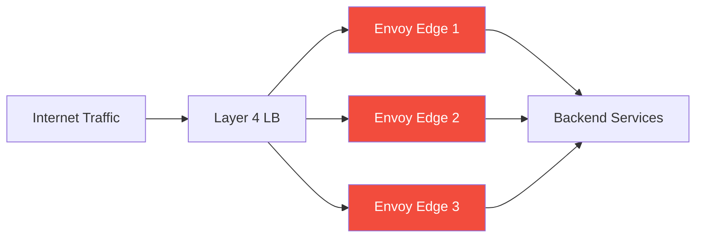
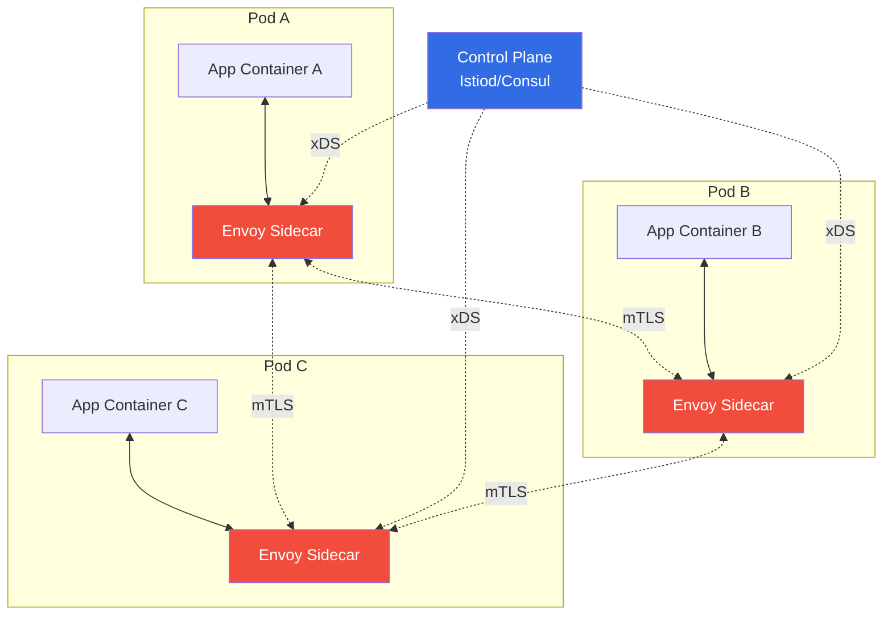
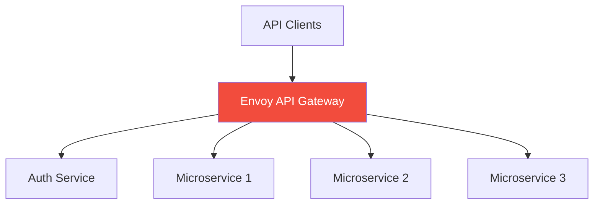

# Deployment Patterns

This document covers common deployment patterns for Envoy, with practical examples and configuration snippets for each use case.

## Table of Contents

1. [Edge Proxy](#edge-proxy)
2. [Service Mesh Sidecar](#service-mesh-sidecar)
3. [API Gateway](#api-gateway)
4. [Internal Load Balancer](#internal-load-balancer)
5. [Ingress Controller](#ingress-controller)
6. [Pattern Comparison](#pattern-comparison)

---

## Edge Proxy

### Overview

Deploy Envoy as an internet-facing edge proxy that terminates TLS, performs load balancing, and routes traffic to backend services.



### Use Cases

- Internet-facing load balancer
- TLS termination
- Geographic routing
- DDoS protection (rate limiting)
- Request authentication/authorization
- Response caching

### Example Configuration

```yaml
# edge-proxy.yaml
static_resources:
  listeners:
  - name: https_listener
    address:
      socket_address:
        address: 0.0.0.0
        port_value: 443
    
    filter_chains:
    - filters:
      - name: envoy.filters.network.http_connection_manager
        typed_config:
          "@type": type.googleapis.com/envoy.extensions.filters.network.http_connection_manager.v3.HttpConnectionManager
          stat_prefix: edge_ingress
          codec_type: AUTO
          
          # Access logging
          access_log:
          - name: envoy.access_loggers.file
            typed_config:
              "@type": type.googleapis.com/envoy.extensions.access_loggers.file.v3.FileAccessLog
              path: /var/log/envoy/access.log
              format: "[%START_TIME%] \"%REQ(:METHOD)% %REQ(X-ENVOY-ORIGINAL-PATH?:PATH)% %PROTOCOL%\" %RESPONSE_CODE% %RESPONSE_FLAGS% %BYTES_RECEIVED% %BYTES_SENT% %DURATION% %RESP(X-ENVOY-UPSTREAM-SERVICE-TIME)% \"%REQ(X-FORWARDED-FOR)%\" \"%REQ(USER-AGENT)%\" \"%REQ(X-REQUEST-ID)%\" \"%REQ(:AUTHORITY)%\" \"%UPSTREAM_HOST%\"\n"
          
          # HTTP filters
          http_filters:
          # Rate limiting
          - name: envoy.filters.http.ratelimit
            typed_config:
              "@type": type.googleapis.com/envoy.extensions.filters.http.ratelimit.v3.RateLimit
              domain: edge_rate_limit
              failure_mode_deny: false
              rate_limit_service:
                grpc_service:
                  envoy_grpc:
                    cluster_name: ratelimit_service
          
          # CORS
          - name: envoy.filters.http.cors
            typed_config:
              "@type": type.googleapis.com/envoy.extensions.filters.http.cors.v3.Cors
          
          # Router (must be last)
          - name: envoy.filters.http.router
            typed_config:
              "@type": type.googleapis.com/envoy.extensions.filters.http.router.v3.Router
          
          # Route configuration
          route_config:
            name: edge_routes
            virtual_hosts:
            - name: api_backend
              domains: ["api.example.com"]
              
              # CORS policy
              cors:
                allow_origin_string_match:
                - safe_regex:
                    regex: "https://.*\\.example\\.com"
                allow_methods: "GET, POST, PUT, DELETE, OPTIONS"
                allow_headers: "Content-Type, Authorization"
                max_age: "86400"
              
              # Rate limit policy
              rate_limits:
              - actions:
                - request_headers:
                    header_name: ":path"
                    descriptor_key: "path"
              
              routes:
              - match:
                  prefix: "/api/v1"
                route:
                  cluster: backend_api_v1
                  timeout: 30s
                  retry_policy:
                    retry_on: "5xx"
                    num_retries: 3
                    per_try_timeout: 10s
              
              - match:
                  prefix: "/api/v2"
                route:
                  cluster: backend_api_v2
                  timeout: 30s
      
      # TLS configuration
      transport_socket:
        name: envoy.transport_sockets.tls
        typed_config:
          "@type": type.googleapis.com/envoy.extensions.transport_sockets.tls.v3.DownstreamTlsContext
          common_tls_context:
            tls_certificates:
            - certificate_chain:
                filename: /etc/envoy/certs/server-cert.pem
              private_key:
                filename: /etc/envoy/certs/server-key.pem
            alpn_protocols: ["h2", "http/1.1"]
  
  # Backend clusters
  clusters:
  - name: backend_api_v1
    type: STRICT_DNS
    lb_policy: ROUND_ROBIN
    load_assignment:
      cluster_name: backend_api_v1
      endpoints:
      - lb_endpoints:
        - endpoint:
            address:
              socket_address:
                address: api-v1.internal.example.com
                port_value: 8080
    
    # Health checking
    health_checks:
    - timeout: 5s
      interval: 10s
      unhealthy_threshold: 3
      healthy_threshold: 2
      http_health_check:
        path: /healthz
    
    # Circuit breaker
    circuit_breakers:
      thresholds:
      - priority: DEFAULT
        max_connections: 1000
        max_pending_requests: 100
        max_requests: 1000
        max_retries: 3
  
  - name: backend_api_v2
    type: STRICT_DNS
    lb_policy: LEAST_REQUEST
    load_assignment:
      cluster_name: backend_api_v2
      endpoints:
      - lb_endpoints:
        - endpoint:
            address:
              socket_address:
                address: api-v2.internal.example.com
                port_value: 8080
    
    health_checks:
    - timeout: 5s
      interval: 10s
      unhealthy_threshold: 3
      healthy_threshold: 2
      http_health_check:
        path: /healthz
  
  - name: ratelimit_service
    type: STRICT_DNS
    lb_policy: ROUND_ROBIN
    load_assignment:
      cluster_name: ratelimit_service
      endpoints:
      - lb_endpoints:
        - endpoint:
            address:
              socket_address:
                address: ratelimit.internal.example.com
                port_value: 8081

# Admin interface
admin:
  address:
    socket_address:
      address: 127.0.0.1
      port_value: 9901
```

### Key Features

- **TLS Termination**: Handles SSL/TLS encryption at the edge
- **Rate Limiting**: Protects backends from overload
- **Health Checks**: Automatic removal of unhealthy backends
- **Circuit Breaking**: Prevents cascade failures
- **Retry Logic**: Automatic retry on transient failures

---

## Service Mesh Sidecar

### Overview

Deploy Envoy as a sidecar container alongside each application instance, intercepting and managing all network traffic.



### Use Cases

- Service-to-service communication in microservices
- Mutual TLS (mTLS) between services
- Traffic shifting (canary deployments)
- Observability (tracing, metrics)
- Circuit breaking and outlier detection

### Example Configuration (Istio Sidecar)

```yaml
# Kubernetes deployment with Istio sidecar injection
apiVersion: apps/v1
kind: Deployment
metadata:
  name: my-service
  namespace: production
spec:
  replicas: 3
  selector:
    matchLabels:
      app: my-service
  template:
    metadata:
      labels:
        app: my-service
        version: v1
      annotations:
        # Enable Istio sidecar injection
        sidecar.istio.io/inject: "true"
        
        # Sidecar resource limits
        sidecar.istio.io/proxyCPU: "100m"
        sidecar.istio.io/proxyMemory: "128Mi"
        
        # Custom sidecar config
        proxy.istio.io/config: |
          concurrency: 2
          tracing:
            zipkin:
              address: zipkin.istio-system:9411
    spec:
      containers:
      - name: my-service
        image: my-service:v1
        ports:
        - containerPort: 8080
          name: http
          protocol: TCP
        
        # Application resources
        resources:
          requests:
            cpu: 200m
            memory: 256Mi
          limits:
            cpu: 1000m
            memory: 512Mi
        
        # Health checks
        livenessProbe:
          httpGet:
            path: /healthz/live
            port: 8080
          initialDelaySeconds: 10
          periodSeconds: 10
        
        readinessProbe:
          httpGet:
            path: /healthz/ready
            port: 8080
          initialDelaySeconds: 5
          periodSeconds: 5
---
# Istio VirtualService for traffic routing
apiVersion: networking.istio.io/v1beta1
kind: VirtualService
metadata:
  name: my-service
  namespace: production
spec:
  hosts:
  - my-service
  http:
  # Canary deployment: 90% to v1, 10% to v2
  - match:
    - headers:
        x-canary:
          exact: "true"
    route:
    - destination:
        host: my-service
        subset: v2
  
  - route:
    - destination:
        host: my-service
        subset: v1
      weight: 90
    - destination:
        host: my-service
        subset: v2
      weight: 10
    
    # Retry policy
    retries:
      attempts: 3
      perTryTimeout: 2s
      retryOn: "5xx,reset,connect-failure"
    
    # Request timeout
    timeout: 10s
---
# Istio DestinationRule for load balancing and circuit breaking
apiVersion: networking.istio.io/v1beta1
kind: DestinationRule
metadata:
  name: my-service
  namespace: production
spec:
  host: my-service
  
  # mTLS mode
  trafficPolicy:
    tls:
      mode: ISTIO_MUTUAL
    
    # Load balancer settings
    loadBalancer:
      consistentHash:
        httpHeaderName: x-user-id
    
    # Connection pool settings
    connectionPool:
      tcp:
        maxConnections: 100
      http:
        http1MaxPendingRequests: 50
        http2MaxRequests: 100
        maxRequestsPerConnection: 2
    
    # Circuit breaker
    outlierDetection:
      consecutiveErrors: 5
      interval: 30s
      baseEjectionTime: 30s
      maxEjectionPercent: 50
      minHealthPercent: 40
  
  # Subsets for versioning
  subsets:
  - name: v1
    labels:
      version: v1
  - name: v2
    labels:
      version: v2
```

### Bootstrap Configuration (Envoy Sidecar)

```yaml
# envoy-sidecar-bootstrap.yaml (simplified Istio bootstrap)
node:
  id: my-service-v1-abc123
  cluster: my-service.production
  metadata:
    NAMESPACE: production
    APP: my-service
    VERSION: v1

admin:
  address:
    socket_address:
      address: 127.0.0.1
      port_value: 15000

dynamic_resources:
  # xDS configuration from Istiod
  ads_config:
    api_type: GRPC
    transport_api_version: V3
    grpc_services:
    - envoy_grpc:
        cluster_name: xds-grpc
  
  cds_config:
    ads: {}
    resource_api_version: V3
  
  lds_config:
    ads: {}
    resource_api_version: V3

static_resources:
  clusters:
  # xDS control plane connection
  - name: xds-grpc
    type: STRICT_DNS
    http2_protocol_options: {}
    load_assignment:
      cluster_name: xds-grpc
      endpoints:
      - lb_endpoints:
        - endpoint:
            address:
              socket_address:
                address: istiod.istio-system.svc.cluster.local
                port_value: 15012
    
    transport_socket:
      name: envoy.transport_sockets.tls
      typed_config:
        "@type": type.googleapis.com/envoy.extensions.transport_sockets.tls.v3.UpstreamTlsContext
        common_tls_context:
          tls_certificates:
          - certificate_chain:
              filename: /etc/certs/cert-chain.pem
            private_key:
              filename: /etc/certs/key.pem
          validation_context:
            trusted_ca:
              filename: /etc/certs/root-cert.pem
  
  # Prometheus metrics
  - name: prometheus_stats
    type: STATIC
    connect_timeout: 0.25s
    load_assignment:
      cluster_name: prometheus_stats
      endpoints:
      - lb_endpoints:
        - endpoint:
            address:
              socket_address:
                address: 127.0.0.1
                port_value: 15000

  listeners:
  # Metrics endpoint
  - name: prometheus_listener
    address:
      socket_address:
        address: 0.0.0.0
        port_value: 15090
    filter_chains:
    - filters:
      - name: envoy.filters.network.http_connection_manager
        typed_config:
          "@type": type.googleapis.com/envoy.extensions.filters.network.http_connection_manager.v3.HttpConnectionManager
          stat_prefix: prometheus
          codec_type: AUTO
          route_config:
            name: prometheus_route
            virtual_hosts:
            - name: prometheus
              domains: ["*"]
              routes:
              - match:
                  prefix: "/stats/prometheus"
                route:
                  cluster: prometheus_stats
          http_filters:
          - name: envoy.filters.http.router
            typed_config:
              "@type": type.googleapis.com/envoy.extensions.filters.http.router.v3.Router

# Tracing configuration
tracing:
  http:
    name: envoy.tracers.zipkin
    typed_config:
      "@type": type.googleapis.com/envoy.config.trace.v3.ZipkinConfig
      collector_cluster: zipkin
      collector_endpoint: "/api/v2/spans"
      collector_endpoint_version: HTTP_JSON

# Stats sinks
stats_sinks:
- name: envoy.stat_sinks.statsd
  typed_config:
    "@type": type.googleapis.com/envoy.config.metrics.v3.StatsdSink
    tcp_cluster_name: statsd
```

---

## API Gateway

### Overview

Deploy Envoy as a centralized API gateway providing authentication, rate limiting, request transformation, and API composition.



### Example Configuration

```yaml
# api-gateway.yaml
static_resources:
  listeners:
  - name: api_gateway_listener
    address:
      socket_address:
        address: 0.0.0.0
        port_value: 8443
    
    filter_chains:
    - filters:
      - name: envoy.filters.network.http_connection_manager
        typed_config:
          "@type": type.googleapis.com/envoy.extensions.filters.network.http_connection_manager.v3.HttpConnectionManager
          stat_prefix: api_gateway
          codec_type: AUTO
          
          http_filters:
          # JWT authentication
          - name: envoy.filters.http.jwt_authn
            typed_config:
              "@type": type.googleapis.com/envoy.extensions.filters.http.jwt_authn.v3.JwtAuthentication
              providers:
                auth0_provider:
                  issuer: "https://your-tenant.auth0.com/"
                  audiences:
                  - "https://api.example.com"
                  remote_jwks:
                    http_uri:
                      uri: "https://your-tenant.auth0.com/.well-known/jwks.json"
                      cluster: auth0_jwks
                      timeout: 5s
                    cache_duration:
                      seconds: 300
              rules:
              - match:
                  prefix: "/api"
                requires:
                  provider_name: "auth0_provider"
          
          # External authorization (e.g., OPA)
          - name: envoy.filters.http.ext_authz
            typed_config:
              "@type": type.googleapis.com/envoy.extensions.filters.http.ext_authz.v3.ExtAuthz
              grpc_service:
                envoy_grpc:
                  cluster_name: ext_authz
                timeout: 0.5s
              failure_mode_allow: false
              with_request_body:
                max_request_bytes: 8192
                allow_partial_message: true
          
          # Rate limiting
          - name: envoy.filters.http.ratelimit
            typed_config:
              "@type": type.googleapis.com/envoy.extensions.filters.http.ratelimit.v3.RateLimit
              domain: api_gateway_ratelimit
              failure_mode_deny: true
              rate_limit_service:
                grpc_service:
                  envoy_grpc:
                    cluster_name: ratelimit_service
          
          # Request transformation (Lua)
          - name: envoy.filters.http.lua
            typed_config:
              "@type": type.googleapis.com/envoy.extensions.filters.http.lua.v3.Lua
              inline_code: |
                function envoy_on_request(request_handle)
                  -- Add custom headers
                  request_handle:headers():add("x-gateway-timestamp", os.time())
                  
                  -- Extract JWT claims and add as headers
                  local jwt_payload = request_handle:streamInfo():dynamicMetadata():get("envoy.filters.http.jwt_authn")
                  if jwt_payload then
                    local sub = jwt_payload["sub"]
                    if sub then
                      request_handle:headers():add("x-user-id", sub)
                    end
                  end
                end
                
                function envoy_on_response(response_handle)
                  -- Add CORS headers
                  response_handle:headers():add("Access-Control-Allow-Origin", "*")
                end
          
          # Router
          - name: envoy.filters.http.router
            typed_config:
              "@type": type.googleapis.com/envoy.extensions.filters.http.router.v3.Router
          
          route_config:
            name: api_routes
            virtual_hosts:
            - name: api_gateway
              domains: ["*"]
              
              rate_limits:
              # Global rate limit
              - actions:
                - remote_address: {}
              
              # Per-user rate limit (from JWT)
              - actions:
                - metadata:
                    descriptor_key: "user_id"
                    metadata_key:
                      key: "envoy.filters.http.jwt_authn"
                      path:
                      - key: "sub"
              
              routes:
              # Users API
              - match:
                  prefix: "/api/users"
                route:
                  cluster: users_service
                  timeout: 15s
                  prefix_rewrite: "/v1/users"
              
              # Orders API
              - match:
                  prefix: "/api/orders"
                route:
                  cluster: orders_service
                  timeout: 30s
                  prefix_rewrite: "/v1/orders"
                  retry_policy:
                    retry_on: "5xx,reset"
                    num_retries: 2
              
              # Products API (with weighted routing for canary)
              - match:
                  prefix: "/api/products"
                route:
                  weighted_clusters:
                    clusters:
                    - name: products_service_v1
                      weight: 95
                    - name: products_service_v2
                      weight: 5
                  timeout: 10s
      
      transport_socket:
        name: envoy.transport_sockets.tls
        typed_config:
          "@type": type.googleapis.com/envoy.extensions.transport_sockets.tls.v3.DownstreamTlsContext
          common_tls_context:
            tls_certificates:
            - certificate_chain:
                filename: /etc/envoy/certs/gateway-cert.pem
              private_key:
                filename: /etc/envoy/certs/gateway-key.pem
  
  clusters:
  - name: auth0_jwks
    type: STRICT_DNS
    lb_policy: ROUND_ROBIN
    load_assignment:
      cluster_name: auth0_jwks
      endpoints:
      - lb_endpoints:
        - endpoint:
            address:
              socket_address:
                address: your-tenant.auth0.com
                port_value: 443
    transport_socket:
      name: envoy.transport_sockets.tls
      typed_config:
        "@type": type.googleapis.com/envoy.extensions.transport_sockets.tls.v3.UpstreamTlsContext
        sni: your-tenant.auth0.com
  
  - name: ext_authz
    type: STRICT_DNS
    lb_policy: ROUND_ROBIN
    load_assignment:
      cluster_name: ext_authz
      endpoints:
      - lb_endpoints:
        - endpoint:
            address:
              socket_address:
                address: opa.internal.example.com
                port_value: 9191
  
  - name: ratelimit_service
    type: STRICT_DNS
    lb_policy: ROUND_ROBIN
    load_assignment:
      cluster_name: ratelimit_service
      endpoints:
      - lb_endpoints:
        - endpoint:
            address:
              socket_address:
                address: ratelimit.internal.example.com
                port_value: 8081
  
  - name: users_service
    type: STRICT_DNS
    lb_policy: ROUND_ROBIN
    load_assignment:
      cluster_name: users_service
      endpoints:
      - lb_endpoints:
        - endpoint:
            address:
              socket_address:
                address: users.internal.example.com
                port_value: 8080
  
  - name: orders_service
    type: STRICT_DNS
    lb_policy: ROUND_ROBIN
    load_assignment:
      cluster_name: orders_service
      endpoints:
      - lb_endpoints:
        - endpoint:
            address:
              socket_address:
                address: orders.internal.example.com
                port_value: 8080
  
  - name: products_service_v1
    type: STRICT_DNS
    lb_policy: ROUND_ROBIN
    load_assignment:
      cluster_name: products_service_v1
      endpoints:
      - lb_endpoints:
        - endpoint:
            address:
              socket_address:
                address: products-v1.internal.example.com
                port_value: 8080
  
  - name: products_service_v2
    type: STRICT_DNS
    lb_policy: ROUND_ROBIN
    load_assignment:
      cluster_name: products_service_v2
      endpoints:
      - lb_endpoints:
        - endpoint:
            address:
              socket_address:
                address: products-v2.internal.example.com
                port_value: 8080

admin:
  address:
    socket_address:
      address: 127.0.0.1
      port_value: 9901
```

---

## Internal Load Balancer

### Overview

Deploy Envoy as an internal load balancer for east-west traffic within a data center or VPC.

### Example Configuration

```yaml
# internal-lb.yaml
static_resources:
  listeners:
  - name: internal_lb_listener
    address:
      socket_address:
        address: 0.0.0.0
        port_value: 80
    
    filter_chains:
    - filters:
      - name: envoy.filters.network.http_connection_manager
        typed_config:
          "@type": type.googleapis.com/envoy.extensions.filters.network.http_connection_manager.v3.HttpConnectionManager
          stat_prefix: internal_lb
          codec_type: AUTO
          
          http_filters:
          - name: envoy.filters.http.router
            typed_config:
              "@type": type.googleapis.com/envoy.extensions.filters.http.router.v3.Router
          
          route_config:
            name: local_route
            virtual_hosts:
            - name: backend
              domains: ["*"]
              routes:
              - match:
                  prefix: "/"
                route:
                  cluster: backend_service
                  timeout: 30s
  
  clusters:
  - name: backend_service
    type: STRICT_DNS
    
    # Advanced load balancing: least request with slow start
    lb_policy: LEAST_REQUEST
    least_request_lb_config:
      choice_count: 2
    
    # Slow start configuration
    common_lb_config:
      slow_start_config:
        slow_start_window:
          seconds: 60
    
    load_assignment:
      cluster_name: backend_service
      endpoints:
      - lb_endpoints:
        - endpoint:
            address:
              socket_address:
                address: backend-1.internal
                port_value: 8080
        - endpoint:
            address:
              socket_address:
                address: backend-2.internal
                port_value: 8080
        - endpoint:
            address:
              socket_address:
                address: backend-3.internal
                port_value: 8080
    
    # Active health checking
    health_checks:
    - timeout: 3s
      interval: 5s
      unhealthy_threshold: 2
      healthy_threshold: 2
      http_health_check:
        path: /healthz
        expected_statuses:
        - start: 200
          end: 299
    
    # Outlier detection (passive health checking)
    outlier_detection:
      consecutive_5xx: 5
      interval:
        seconds: 10
      base_ejection_time:
        seconds: 30
      max_ejection_percent: 50
      enforcing_consecutive_5xx: 100
      success_rate_minimum_hosts: 5
      success_rate_request_volume: 100
      success_rate_stdev_factor: 1900

admin:
  address:
    socket_address:
      address: 127.0.0.1
      port_value: 9901
```

---

## Ingress Controller

### Overview

Deploy Envoy as a Kubernetes Ingress controller, managing external access to services in the cluster.

### Kubernetes Deployment

```yaml
# envoy-ingress-controller.yaml
apiVersion: v1
kind: Namespace
metadata:
  name: envoy-ingress
---
apiVersion: v1
kind: ConfigMap
metadata:
  name: envoy-config
  namespace: envoy-ingress
data:
  envoy.yaml: |
    admin:
      address:
        socket_address:
          address: 0.0.0.0
          port_value: 9901
    
    dynamic_resources:
      cds_config:
        path: /etc/envoy/cds.yaml
      lds_config:
        path: /etc/envoy/lds.yaml
    
    static_resources:
      clusters:
      - name: xds_cluster
        type: STATIC
        connect_timeout: 1s
        load_assignment:
          cluster_name: xds_cluster
          endpoints:
          - lb_endpoints:
            - endpoint:
                address:
                  socket_address:
                    address: 127.0.0.1
                    port_value: 8001
---
apiVersion: apps/v1
kind: Deployment
metadata:
  name: envoy-ingress
  namespace: envoy-ingress
  labels:
    app: envoy-ingress
spec:
  replicas: 3
  selector:
    matchLabels:
      app: envoy-ingress
  template:
    metadata:
      labels:
        app: envoy-ingress
    spec:
      serviceAccountName: envoy-ingress
      
      containers:
      # Envoy proxy
      - name: envoy
        image: envoyproxy/envoy:v1.28-latest
        command:
        - /usr/local/bin/envoy
        args:
        - --config-path
        - /etc/envoy/envoy.yaml
        - --log-level
        - info
        
        ports:
        - name: http
          containerPort: 80
          protocol: TCP
        - name: https
          containerPort: 443
          protocol: TCP
        - name: admin
          containerPort: 9901
          protocol: TCP
        
        resources:
          requests:
            cpu: 200m
            memory: 256Mi
          limits:
            cpu: 2000m
            memory: 1Gi
        
        volumeMounts:
        - name: envoy-config
          mountPath: /etc/envoy
        - name: tls-certs
          mountPath: /etc/envoy/certs
          readOnly: true
        
        livenessProbe:
          httpGet:
            path: /ready
            port: 9901
          initialDelaySeconds: 10
          periodSeconds: 10
        
        readinessProbe:
          httpGet:
            path: /ready
            port: 9901
          initialDelaySeconds: 5
          periodSeconds: 5
      
      # Ingress controller (watches Kubernetes Ingress resources)
      - name: controller
        image: envoyproxy/envoy-ingress-controller:latest
        args:
        - --ingress-class=envoy
        - --envoy-admin-url=http://localhost:9901
        
        resources:
          requests:
            cpu: 100m
            memory: 128Mi
          limits:
            cpu: 500m
            memory: 256Mi
      
      volumes:
      - name: envoy-config
        configMap:
          name: envoy-config
      - name: tls-certs
        secret:
          secretName: envoy-tls-certs
---
apiVersion: v1
kind: Service
metadata:
  name: envoy-ingress
  namespace: envoy-ingress
spec:
  type: LoadBalancer
  selector:
    app: envoy-ingress
  ports:
  - name: http
    port: 80
    targetPort: 80
    protocol: TCP
  - name: https
    port: 443
    targetPort: 443
    protocol: TCP
---
apiVersion: v1
kind: ServiceAccount
metadata:
  name: envoy-ingress
  namespace: envoy-ingress
---
apiVersion: rbac.authorization.k8s.io/v1
kind: ClusterRole
metadata:
  name: envoy-ingress
rules:
- apiGroups: [""]
  resources: ["services", "endpoints", "secrets"]
  verbs: ["get", "list", "watch"]
- apiGroups: ["networking.k8s.io"]
  resources: ["ingresses", "ingressclasses"]
  verbs: ["get", "list", "watch"]
- apiGroups: ["networking.k8s.io"]
  resources: ["ingresses/status"]
  verbs: ["update"]
---
apiVersion: rbac.authorization.k8s.io/v1
kind: ClusterRoleBinding
metadata:
  name: envoy-ingress
roleRef:
  apiGroup: rbac.authorization.k8s.io
  kind: ClusterRole
  name: envoy-ingress
subjects:
- kind: ServiceAccount
  name: envoy-ingress
  namespace: envoy-ingress
---
# Example Ingress resource
apiVersion: networking.k8s.io/v1
kind: Ingress
metadata:
  name: example-ingress
  namespace: default
  annotations:
    kubernetes.io/ingress.class: envoy
    # Envoy-specific annotations
    envoy.ingress.kubernetes.io/request-timeout: "30s"
    envoy.ingress.kubernetes.io/retry-on: "5xx,reset"
    envoy.ingress.kubernetes.io/num-retries: "3"
spec:
  tls:
  - hosts:
    - example.com
    secretName: example-tls
  rules:
  - host: example.com
    http:
      paths:
      - path: /api
        pathType: Prefix
        backend:
          service:
            name: api-service
            port:
              number: 8080
      - path: /
        pathType: Prefix
        backend:
          service:
            name: web-service
            port:
              number: 80
```

---

## Pattern Comparison

| Pattern | Use Case | Complexity | TLS | Auth | Rate Limit | Observability |
|---------|----------|------------|-----|------|------------|---------------|
| **Edge Proxy** | Internet-facing LB | Medium | Termination | Optional | Yes | High |
| **Service Mesh Sidecar** | Service-to-service | High | mTLS | Service identity | Per-service | Very High |
| **API Gateway** | API management | High | Termination | JWT/OAuth | Per-user | High |
| **Internal LB** | East-west traffic | Low | Optional | No | Optional | Medium |
| **Ingress Controller** | K8s cluster entry | Medium | Termination | Optional | Yes | High |

### Choosing a Pattern

**Use Edge Proxy when:**
- You need internet-facing load balancing
- TLS termination at the edge
- DDoS protection and rate limiting
- Geographic routing

**Use Service Mesh Sidecar when:**
- You have many microservices
- You need mTLS between services
- You want advanced traffic management (canary, A/B testing)
- You need detailed observability

**Use API Gateway when:**
- You're exposing APIs to external consumers
- You need centralized authentication/authorization
- You need request/response transformation
- You need API composition and aggregation

**Use Internal LB when:**
- You need simple load balancing for internal services
- You don't need advanced features
- You want minimal overhead

**Use Ingress Controller when:**
- You're running Kubernetes
- You need native integration with K8s resources
- You want automated configuration from Ingress resources

---

## Best Practices

### All Patterns

1. **Enable health checks**: Always configure active health checking
2. **Configure timeouts**: Set appropriate request and connection timeouts
3. **Enable access logs**: Log all requests for debugging and auditing
4. **Monitor metrics**: Export metrics to Prometheus or StatsD
5. **Use circuit breakers**: Prevent cascade failures
6. **Enable retries**: Retry transient failures automatically

### Edge Proxy Specific

- Use multiple availability zones
- Configure DDoS protection (rate limiting, connection limits)
- Enable CORS policies
- Use CDN for static content
- Implement geographic routing

### Service Mesh Specific

- Use mTLS for all service-to-service communication
- Configure appropriate traffic policies (retries, timeouts)
- Use outlier detection for automatic instance removal
- Enable distributed tracing
- Use traffic shifting for canary deployments

### API Gateway Specific

- Implement strong authentication (JWT, OAuth2)
- Use per-user rate limiting
- Version your APIs
- Implement request/response transformation
- Enable API analytics

---

## Related Documentation

- [Hot Restart](02-hot-restart.md) - Zero-downtime updates
- [Container Deployment](03-container-deployment.md) - Docker and Kubernetes deployment
- [Production Hardening](04-production-hardening.md) - Security and reliability
