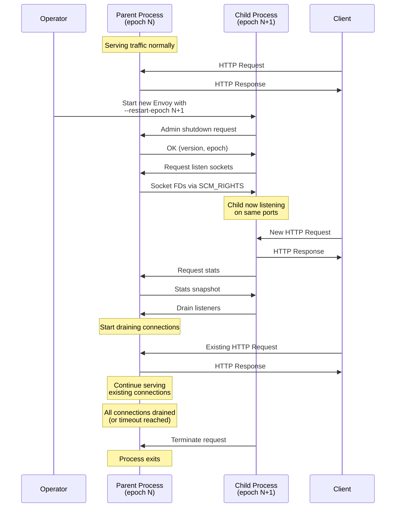
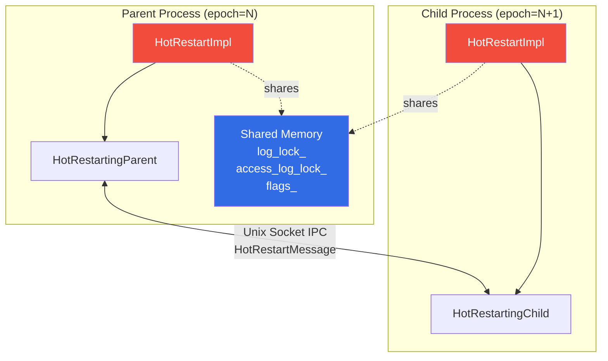
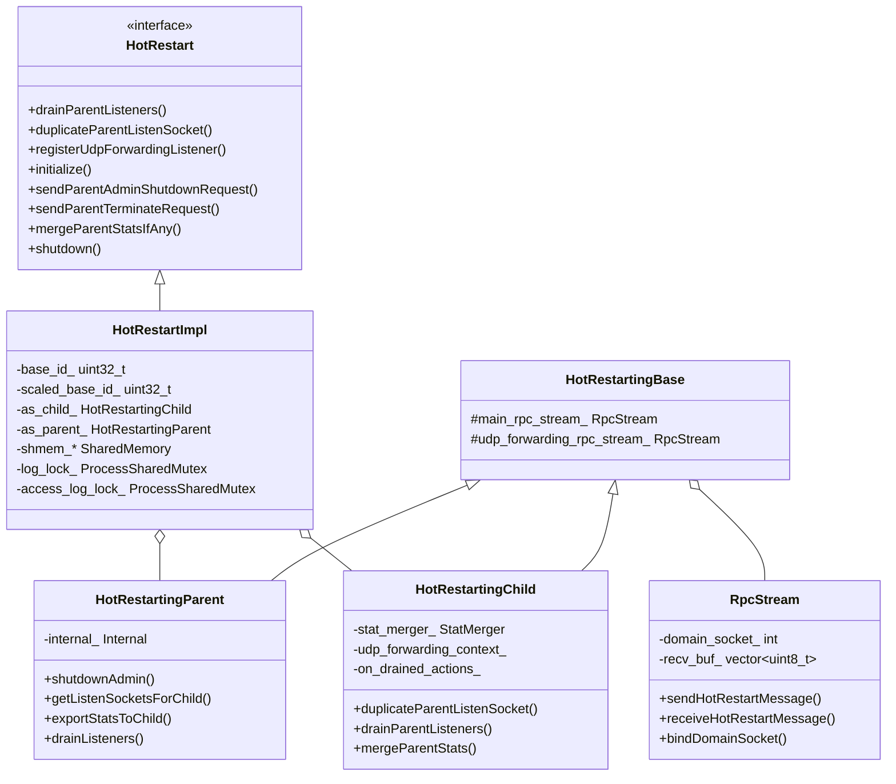
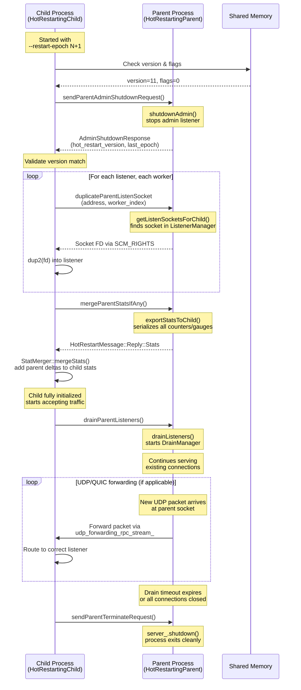
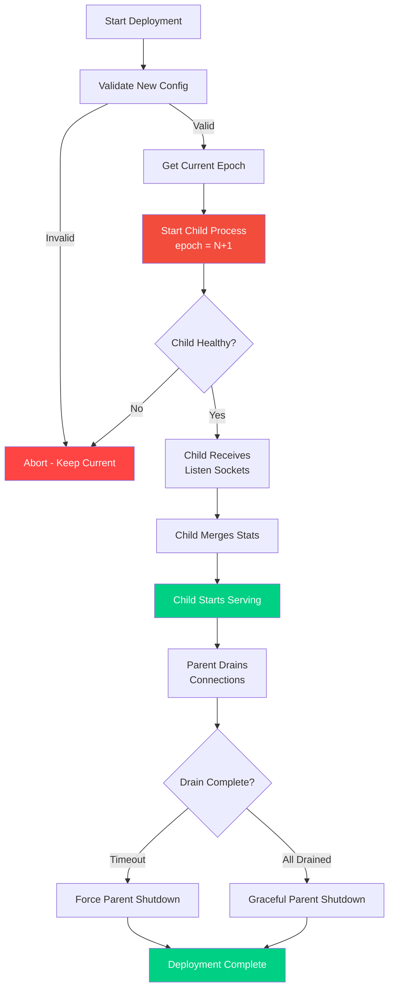

# Hot Restart

This document provides a comprehensive guide to Envoy's hot restart mechanism, which enables zero-downtime binary and configuration updates.

## Table of Contents

1. [Overview](#overview)
2. [Architecture](#architecture)
3. [Implementation Details](#implementation-details)
4. [Performing Hot Restart](#performing-hot-restart)
5. [Systemd Integration](#systemd-integration)
6. [Limitations and Gotchas](#limitations-and-gotchas)
7. [Troubleshooting](#troubleshooting)

---

## Overview

Hot restart allows Envoy to upgrade its binary or configuration with **zero dropped connections**. The old ("parent") process hands open listening sockets to the new ("child") process via file descriptor passing, drains its connections, then exits—all while both processes serve traffic simultaneously.

### Key Benefits

- **Zero downtime**: No connection drops during updates
- **Gradual drain**: Parent process drains connections over time (configurable, typically 10-15 minutes)
- **Rollback capability**: If child fails to start, parent continues serving
- **Stat continuity**: Metrics are merged from parent to child

### How It Works (High Level)



---

## Architecture

### Process Topology



### Components

**Source Files:**
- `source/server/hot_restart_impl.h` - Main implementation, shared memory
- `source/server/hot_restarting_base.h` - RPC protocol base class
- `source/server/hot_restarting_parent.h` - Parent-side logic
- `source/server/hot_restarting_child.h` - Child-side logic
- `source/server/hot_restart.proto` - IPC message definitions

### Shared Memory Segment

```cpp
// From source/server/hot_restart_impl.h
struct SharedMemory {
    uint64_t size_;                    // Sanity check on segment size
    uint64_t version_;                 // HOT_RESTART_VERSION (currently 11)
    pthread_mutex_t log_lock_;         // Cross-process log serialization
    pthread_mutex_t access_log_lock_;  // Cross-process access log serialization
    std::atomic<uint64_t> flags_;      // SHMEM_FLAGS_INITIALIZING = 0x1
};
```

**Location:** `/dev/shm/envoy_shared_memory_<base_id>`

The shared memory segment is created via `shm_open()` + `mmap()` and persists across process generations. It provides:

1. **Process-shared mutexes**: Serialize log writes across parent and child
2. **Version checking**: Ensures parent and child are compatible
3. **Initialization flag**: Child can detect if parent is still initializing

### RPC Protocol (Unix Domain Sockets)

```
Wire Format:
┌──────────────┬────────────────────────────────────────────┐
│ 8 bytes      │ N bytes                                    │
│ uint64 (BE)  │ serialized HotRestartMessage protobuf      │
│ = length N   │ (may span multiple datagrams)              │
└──────────────┴────────────────────────────────────────────┘
```

**Socket Path:** `/tmp/envoy_domain_socket_<base_id>_<restart_epoch>`

**Key Properties:**
- **SOCK_DGRAM** Unix domain socket
- Child initiates all exchanges (blocking request-reply pattern)
- File descriptors passed via `SCM_RIGHTS` ancillary data
- Max datagram: 4096 bytes (large messages are fragmented)
- Two independent streams:
  - `main_rpc_stream_` - Admin, sockets, stats, drain
  - `udp_forwarding_rpc_stream_` - QUIC/UDP packet forwarding

---

## Implementation Details

### Class Hierarchy



### Hot Restart Sequence (Detailed)



### Parent-Side Operations (`HotRestartingParent::Internal`)

| Method | Triggered By | Action |
|--------|--------------|--------|
| `shutdownAdmin()` | Child's admin shutdown request | Calls `server_.shutdownAdmin()`, returns `hot_restart_version` and `last_epoch` |
| `getListenSocketsForChild(request)` | Child's socket duplication request | Calls `server_.getListenerManager().getSocketForWorker(address, worker_index)`, passes FD via `SCM_RIGHTS` |
| `exportStatsToChild(stats_proto)` | Child's stats merge request | Iterates all counters/gauges, serializes values into `HotRestartMessage::Reply::Stats` |
| `drainListeners()` | Child's drain request | Calls `server_.drainListeners()` to initiate connection draining |

### Child-Side Operations (`HotRestartingChild`)

**Socket Duplication:**
```cpp
// Simplified from source/server/hot_restarting_child.cc
int HotRestartingChild::duplicateParentListenSocket(
    const std::string& address, 
    uint32_t worker_index,
    absl::string_view network_namespace) {
  
  // Build request protobuf
  envoy::HotRestartMessage request;
  request.mutable_request()->mutable_pass_listen_socket()->set_address(address);
  request.mutable_request()->mutable_pass_listen_socket()->set_worker_index(worker_index);
  
  // Send to parent, blocking until reply
  std::unique_ptr<envoy::HotRestartMessage> reply = 
      main_rpc_stream_.sendHotRestartMessage(parent_address_, request);
  
  // Extract file descriptor from ancillary data
  return reply->reply().pass_listen_socket().fd();
}
```

**Stat Merging:**

The `StatMerger` class merges parent statistics into the child:

- **Counters**: Adds parent's counter value (delta) to child's counter
- **Gauges**: 
  - `Accumulate` mode: Takes parent's gauge value
  - `NeverImport` mode: Ignores parent's value
- **Histograms**: Not merged (child starts fresh)

```cpp
// Pseudocode from StatMerger
void mergeStats(const StatsProto& parent_stats) {
  for (const auto& [name, value] : parent_stats.counters()) {
    Counter& counter = store.counter(name);
    counter.add(value);  // Add parent's delta
  }
  
  for (const auto& [name, value] : parent_stats.gauges()) {
    Gauge& gauge = store.gauge(name);
    if (gauge.importMode() == Gauge::ImportMode::Accumulate) {
      gauge.set(value);  // Take parent's absolute value
    }
  }
  
  // Increment generation counter
  hot_restart_generation_++;
}
```

### UDP/QUIC Forwarding

During the overlap period, new UDP packets (e.g., QUIC connections) arrive at the parent's socket. The parent forwards these to the child via `udp_forwarding_rpc_stream_`.

**`UdpForwardingContext`** maintains:
- Map of listener addresses to `UdpListenerConfig`
- Allows child to route forwarded packets to correct listener

**Parent-drained callbacks:**
- `HotRestartingChild` implements `Network::ParentDrainedCallbackRegistrar`
- QUIC listeners register callbacks to be notified when parent finishes draining
- Multiple callbacks per address (one per worker)
- All invoked when parent terminates or is already dead

### ProcessSharedMutex

```cpp
// From source/server/hot_restart_impl.h
class ProcessSharedMutex : public Thread::BasicLockable {
public:
  ProcessSharedMutex(pthread_mutex_t& mutex) : mutex_(mutex) {}
  
  void lock() override {
    int rc = pthread_mutex_lock(&mutex_);
    ASSERT(rc == 0 || rc == EOWNERDEAD);
    
    // Handle parent dying with lock held
    if (rc == EOWNERDEAD) {
      pthread_mutex_consistent(&mutex_);
    }
  }
  
  void unlock() override {
    int rc = pthread_mutex_unlock(&mutex_);
    ASSERT(rc == 0);
  }
  
private:
  pthread_mutex_t& mutex_;  // PTHREAD_PROCESS_SHARED mutex
};
```

The mutex uses `PTHREAD_PROCESS_SHARED` attribute and robust mutex semantics:
- If parent crashes while holding lock, child gets `EOWNERDEAD`
- Child calls `pthread_mutex_consistent()` to make lock usable again
- Prevents deadlock when parent dies unexpectedly

---

## Performing Hot Restart

### Prerequisites

1. **New binary or configuration** ready to deploy
2. **Compatible version**: `HOT_RESTART_VERSION` must match (currently 11)
3. **Same base ID**: Parent and child must use same `--base-id`
4. **Sufficient resources**: Both processes run simultaneously during drain

### Command Line

```bash
# Start initial Envoy
envoy -c /etc/envoy/envoy.yaml \
  --base-id 0 \
  --restart-epoch 0 \
  --log-path /var/log/envoy/envoy.log

# Perform hot restart (from orchestration script)
envoy -c /etc/envoy/envoy-new.yaml \
  --base-id 0 \
  --restart-epoch 1 \
  --log-path /var/log/envoy/envoy.log \
  --drain-time-s 600 \
  --parent-shutdown-time-s 900
```

### Key Flags

| Flag | Description | Default |
|------|-------------|---------|
| `--base-id` | Shared memory segment ID (0-99) | 0 |
| `--restart-epoch` | Monotonically increasing epoch | 0 |
| `--drain-time-s` | How long to drain parent connections | 600s (10 min) |
| `--parent-shutdown-time-s` | Max time before forcefully killing parent | 900s (15 min) |
| `--socket-path` | Base path for domain sockets | `/tmp` |
| `--socket-mode` | File mode for domain socket | 0600 |

### Orchestration Script

```bash
#!/bin/bash
# hot-restart-envoy.sh

set -euo pipefail

ENVOY_BIN="${ENVOY_BIN:-/usr/local/bin/envoy}"
ENVOY_CONFIG="${ENVOY_CONFIG:-/etc/envoy/envoy.yaml}"
ENVOY_BASE_ID="${ENVOY_BASE_ID:-0}"
ENVOY_LOG="${ENVOY_LOG:-/var/log/envoy/envoy.log}"
DRAIN_TIME="${DRAIN_TIME:-600}"
PARENT_SHUTDOWN_TIME="${PARENT_SHUTDOWN_TIME:-900}"

# Find current epoch by checking for running Envoy processes
get_current_epoch() {
  # Look for existing Envoy process with same base-id
  local pid_file="/var/run/envoy-${ENVOY_BASE_ID}.pid"
  
  if [[ -f "$pid_file" ]]; then
    local pid=$(cat "$pid_file")
    if ps -p "$pid" > /dev/null 2>&1; then
      # Extract epoch from process arguments
      local epoch=$(ps -p "$pid" -o args= | grep -oP '(?<=--restart-epoch )\d+' || echo "0")
      echo "$epoch"
      return
    fi
  fi
  
  echo "0"
}

# Validate configuration before restarting
validate_config() {
  echo "Validating new configuration..."
  "$ENVOY_BIN" --mode validate -c "$ENVOY_CONFIG" || {
    echo "Configuration validation failed!"
    exit 1
  }
  echo "Configuration valid."
}

# Perform hot restart
perform_restart() {
  local current_epoch=$(get_current_epoch)
  local next_epoch=$((current_epoch + 1))
  
  echo "Current epoch: $current_epoch"
  echo "Next epoch: $next_epoch"
  
  # Check hot restart version compatibility
  local current_version=$("$ENVOY_BIN" --hot-restart-version 2>/dev/null || echo "unknown")
  echo "Hot restart version: $current_version"
  
  # Start new Envoy process
  echo "Starting new Envoy process (epoch $next_epoch)..."
  "$ENVOY_BIN" \
    -c "$ENVOY_CONFIG" \
    --base-id "$ENVOY_BASE_ID" \
    --restart-epoch "$next_epoch" \
    --log-path "$ENVOY_LOG" \
    --drain-time-s "$DRAIN_TIME" \
    --parent-shutdown-time-s "$PARENT_SHUTDOWN_TIME" \
    &
  
  local new_pid=$!
  echo "$new_pid" > "/var/run/envoy-${ENVOY_BASE_ID}.pid"
  
  echo "New Envoy started with PID $new_pid"
  echo "Parent will drain for ${DRAIN_TIME}s, then shut down"
  
  # Monitor new process
  sleep 5
  if ! ps -p "$new_pid" > /dev/null 2>&1; then
    echo "ERROR: New Envoy process died immediately!"
    exit 1
  fi
  
  echo "Hot restart initiated successfully"
}

# Main
main() {
  validate_config
  perform_restart
}

main "$@"
```

### Zero-Downtime Deployment Process



---

## Systemd Integration

### Service Unit File

```ini
# /etc/systemd/system/envoy.service
[Unit]
Description=Envoy Proxy
Documentation=https://www.envoyproxy.io/docs/envoy/latest/
After=network-online.target
Wants=network-online.target

[Service]
Type=simple
User=envoy
Group=envoy

# Environment
Environment="ENVOY_BASE_ID=0"
EnvironmentFile=-/etc/default/envoy

# Calculate restart epoch from journal
ExecStartPre=/usr/local/bin/envoy-calculate-epoch.sh

# Start Envoy with dynamically calculated epoch
ExecStart=/usr/local/bin/envoy \
  -c /etc/envoy/envoy.yaml \
  --base-id ${ENVOY_BASE_ID} \
  --restart-epoch ${RESTART_EPOCH} \
  --log-path /var/log/envoy/envoy.log \
  --drain-time-s 600 \
  --parent-shutdown-time-s 900

# Reload = hot restart
ExecReload=/bin/kill -HUP $MAINPID

# Resource limits
LimitNOFILE=1048576
LimitNPROC=512

# Security hardening
NoNewPrivileges=yes
PrivateTmp=yes
ProtectSystem=strict
ProtectHome=yes
ReadWritePaths=/var/log/envoy /var/run/envoy /dev/shm

# Restart policy
Restart=on-failure
RestartSec=5s

[Install]
WantedBy=multi-user.target
```

### Epoch Calculation Script

```bash
#!/bin/bash
# /usr/local/bin/envoy-calculate-epoch.sh

set -euo pipefail

ENVOY_BASE_ID="${ENVOY_BASE_ID:-0}"
PID_FILE="/var/run/envoy/envoy-${ENVOY_BASE_ID}.pid"
EPOCH_FILE="/var/run/envoy/envoy-${ENVOY_BASE_ID}.epoch"

# Initialize epoch to 0 if no existing process
RESTART_EPOCH=0

if [[ -f "$EPOCH_FILE" ]]; then
  RESTART_EPOCH=$(cat "$EPOCH_FILE")
fi

# Check if parent process is still running
if [[ -f "$PID_FILE" ]]; then
  PARENT_PID=$(cat "$PID_FILE")
  if ps -p "$PARENT_PID" > /dev/null 2>&1; then
    # Parent still running, increment epoch
    RESTART_EPOCH=$((RESTART_EPOCH + 1))
  fi
fi

# Save new epoch
echo "$RESTART_EPOCH" > "$EPOCH_FILE"

# Export for systemd
echo "RESTART_EPOCH=$RESTART_EPOCH"
```

### Systemd Commands

```bash
# Initial start
sudo systemctl start envoy

# Hot restart (reload)
sudo systemctl reload envoy

# Check status
sudo systemctl status envoy

# View logs
sudo journalctl -u envoy -f

# Check hot restart version
envoy --hot-restart-version
```

### Alternative: Envoy Restarter Wrapper

For simpler systemd integration, use Envoy's built-in restart wrapper:

```bash
# Use envoy's built-in hot restart wrapper
/usr/local/bin/envoy --restart-wrapper \
  -c /etc/envoy/envoy.yaml \
  --base-id 0 \
  --log-path /var/log/envoy/envoy.log
```

The `--restart-wrapper` flag makes Envoy manage its own restarts:
- Parent process becomes a wrapper that monitors child
- Send `SIGHUP` to parent to initiate hot restart
- Wrapper handles epoch management automatically

---

## Limitations and Gotchas

### Version Compatibility

**HOT_RESTART_VERSION must match** between parent and child:

```cpp
// From source/server/hot_restart_impl.h
const uint64_t HOT_RESTART_VERSION = 11;
```

If versions don't match, hot restart is **not possible** and you must do a cold restart:
- Stop old Envoy
- Start new Envoy
- Expect connection drops

**Version Incrementing Reasons:**
- Shared memory layout changes
- RPC protocol changes
- Incompatible stat names or types

### Platform Limitations

**Hot restart only works on Linux:**
- Requires `SCM_RIGHTS` file descriptor passing
- Requires `shm_open()` and process-shared mutexes
- Not supported on macOS, Windows, or FreeBSD

On unsupported platforms:
- Envoy compiles with `HotRestartNopImpl` (no-op implementation)
- Hot restart flags are ignored
- Must use cold restart or graceful drain strategies

### Concurrency Limits

**Maximum concurrent processes:**

```cpp
// Maximum number of concurrent hot restarts
constexpr uint32_t MaxConcurrentProcesses = 100;
```

The `--base-id` must be in range `[0, 99]`. This limits you to 100 different Envoy instances on the same machine.

### Drain Timeout Considerations

**Parent shutdown timing:**
- `--drain-time-s`: How long to wait for connections to drain naturally
- `--parent-shutdown-time-s`: Hard timeout before forcefully killing parent

If parent has long-lived connections:
- WebSocket connections
- gRPC streaming
- HTTP/2 long polls

**Options:**
1. Increase drain timeout (may delay deployment)
2. Implement client-side reconnect logic
3. Use connection draining filters
4. Accept brief connection drops for extremely long-lived connections

### Stats Continuity

**Counter merging edge case:**

If a counter increments in the parent **after** stats are exported but **before** parent terminates, that increment is **lost** in the child.

```
Parent: counter = 1000
├─ Child starts, parent exports stats (1000)
├─ Parent increments counter to 1005
└─ Parent terminates

Child: counter = 1000 (lost 5 increments)
```

**Mitigation:**
- Accept small stats discrepancies during hot restart
- Use external metrics aggregation (Prometheus, StatsD) for accurate totals
- Enable `--skip-parent-stats` if stat continuity is not important

### Filesystem Dependencies

**Shared memory and socket paths must be writable:**

```
/dev/shm/envoy_shared_memory_<base_id>     # Shared memory
/tmp/envoy_domain_socket_<base_id>_<epoch>  # Unix sockets
```

**Common issues:**
- `/dev/shm` not mounted or full
- `/tmp` mounted with `noexec`
- Insufficient permissions

**Solutions:**
- Ensure `/dev/shm` is available and has space
- Use `--socket-path` to specify alternative location
- Set correct ownership and permissions

### Admin Interface Shutdown

**The parent's admin interface is shut down** during hot restart:
- Admin API becomes unavailable on parent
- Health checks via admin will fail
- Monitoring may report parent as unhealthy

**Mitigation:**
- Use separate health check endpoint (not admin)
- Configure monitoring to handle transient admin failures
- Use child's admin interface for operations

---

## Troubleshooting

### Hot Restart Failed: Version Mismatch

**Symptom:**
```
[critical][main] Failed to hot restart: version mismatch
```

**Cause:** Parent and child have different `HOT_RESTART_VERSION`

**Solution:**
- Check versions: `envoy --hot-restart-version`
- Perform cold restart instead (stop parent, then start child)
- Ensure binaries are from compatible versions

### Socket Already in Use

**Symptom:**
```
[critical][main] Failed to bind socket: address already in use
```

**Cause:** 
- Multiple Envoy processes with same `--base-id`
- Child started without incrementing `--restart-epoch`
- Orphaned Envoy process

**Solution:**
```bash
# Find Envoy processes
ps aux | grep envoy

# Check domain sockets
ls -la /tmp/envoy_domain_socket_*

# Kill orphaned processes
pkill -9 envoy

# Clean up stale sockets
rm /tmp/envoy_domain_socket_*
```

### Shared Memory Issues

**Symptom:**
```
[critical][main] Failed to create shared memory segment
```

**Cause:**
- `/dev/shm` full or not mounted
- Insufficient permissions

**Solution:**
```bash
# Check /dev/shm
df -h /dev/shm
ls -la /dev/shm/envoy_shared_memory_*

# Clean up old segments
rm /dev/shm/envoy_shared_memory_*

# Increase /dev/shm size (if needed)
sudo mount -o remount,size=512M /dev/shm
```

### Child Process Dies Immediately

**Symptom:** New Envoy process exits right after starting

**Debugging Steps:**

```bash
# Check configuration validity
envoy --mode validate -c /etc/envoy/envoy.yaml

# Run child in foreground with debug logging
envoy -c /etc/envoy/envoy.yaml \
  --base-id 0 \
  --restart-epoch 1 \
  --log-level debug

# Check for port conflicts
netstat -tlnp | grep :443

# Check for missing certificates
ls -la /etc/envoy/certs/
```

### Parent Not Draining

**Symptom:** Parent process continues serving traffic indefinitely

**Possible Causes:**
- Long-lived connections (WebSocket, gRPC streaming)
- Client not respecting connection: close header
- Drain timeout too short

**Debugging:**
```bash
# Check active connections
envoy admin: http://localhost:9901/stats/prometheus | grep downstream_cx_active

# Check drain status
curl http://localhost:9901/server_info

# Force parent shutdown (if necessary)
kill -TERM <parent_pid>
```

### Stats Not Merged

**Symptom:** Child starts with counters at 0

**Debugging:**
```bash
# Check if stats were exported
# (look for stat merge in child logs)
journalctl -u envoy -f | grep "stat"

# Verify parent stats before shutdown
curl http://localhost:9901/stats/prometheus

# Check child stats after merge
curl http://localhost:9902/stats/prometheus
```

**Potential Causes:**
- `--skip-parent-stats` flag set
- Parent crashed before exporting stats
- Stats format incompatibility

### Debugging RPC Communication

**Enable trace logging:**
```bash
envoy -c /etc/envoy/envoy.yaml \
  --base-id 0 \
  --restart-epoch 1 \
  --log-level trace \
  --component-log-level hot_restart:trace
```

**Check socket communication:**
```bash
# Monitor Unix socket traffic
strace -e sendmsg,recvmsg -p <envoy_pid>

# Check socket permissions
ls -la /tmp/envoy_domain_socket_*
```

---

## Best Practices

### 1. Automate Hot Restarts

- Use orchestration scripts (Ansible, Chef, Puppet)
- Integrate with CI/CD pipelines
- Validate configuration before restart

### 2. Monitor Hot Restart Health

- Track `hot_restart_generation` gauge
- Alert on hot restart failures
- Monitor drain time duration

### 3. Set Appropriate Timeouts

- Match drain timeout to connection patterns
- Allow extra time for long-lived connections
- Test timeouts in staging environment

### 4. Handle Rollbacks

- Keep previous binary available
- Have rollback procedure ready
- Monitor error rates after restart

### 5. Test Regularly

- Perform hot restarts in staging
- Simulate failure scenarios
- Verify stats continuity

---

## Related Documentation

- [Container Deployment](03-container-deployment.md) - Kubernetes rolling updates with hot restart
- [Production Hardening](04-production-hardening.md) - Deployment best practices
- [Admin Interface](../admin-operations/01-admin-interface.md) - Admin API for diagnostics

## Further Reading

- Envoy docs: [Hot restart](https://www.envoyproxy.io/docs/envoy/latest/intro/arch_overview/operations/hot_restart)
- Source code: `source/server/hot_restart_impl.h`
- RPC protocol: `source/server/hot_restart.proto`
