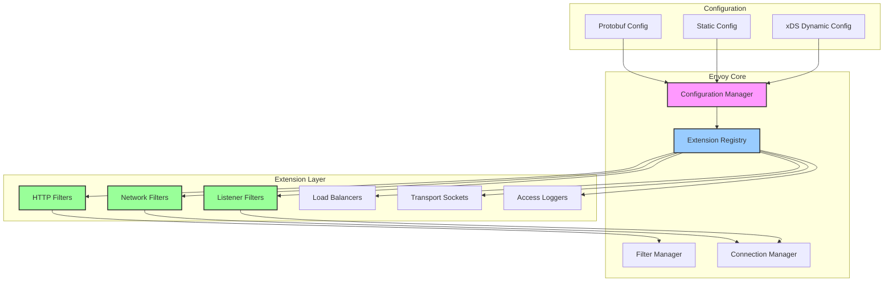
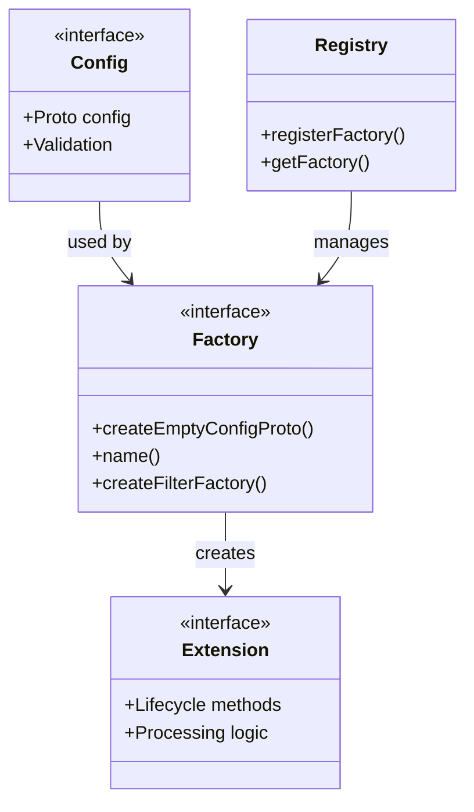
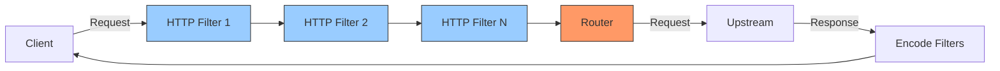
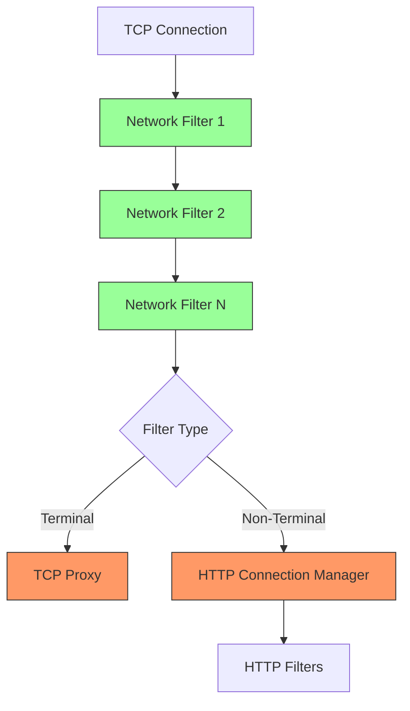
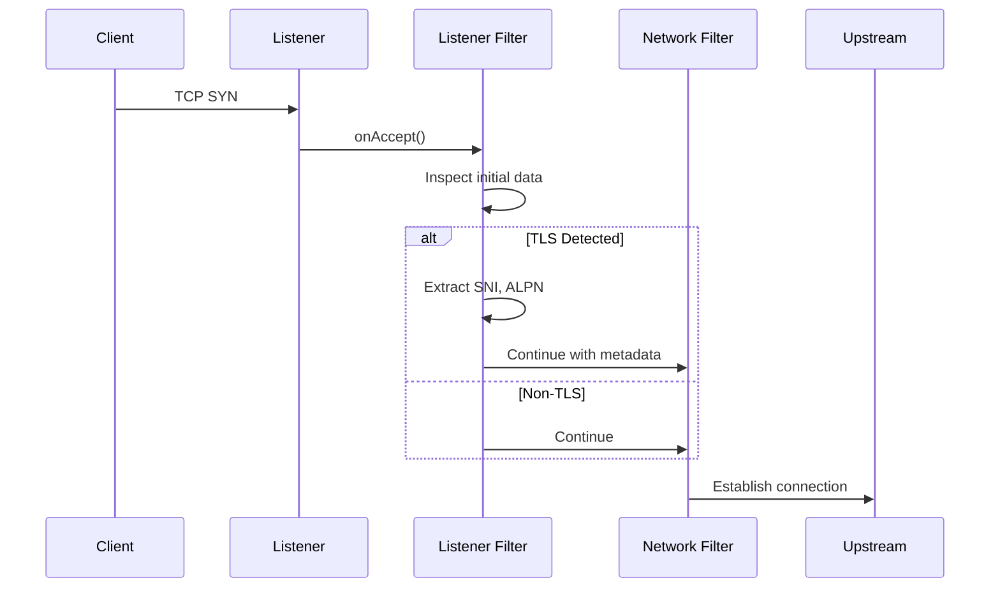
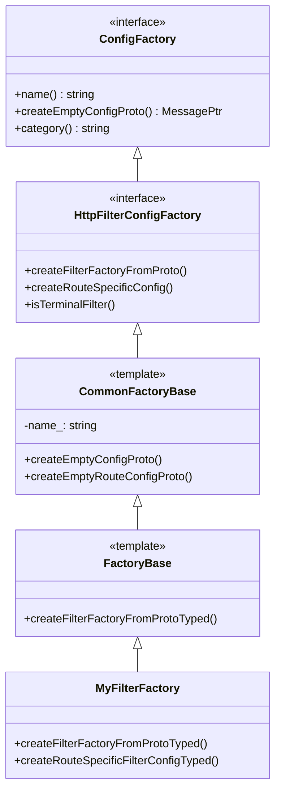
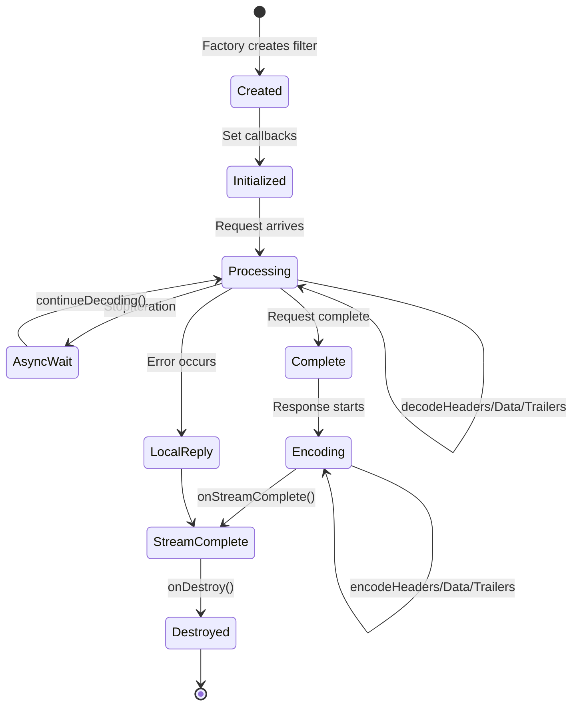
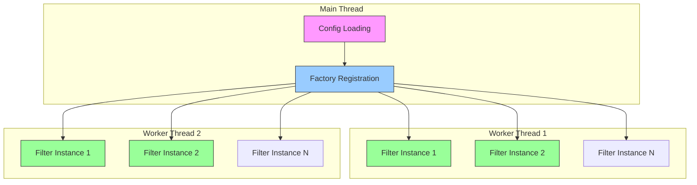
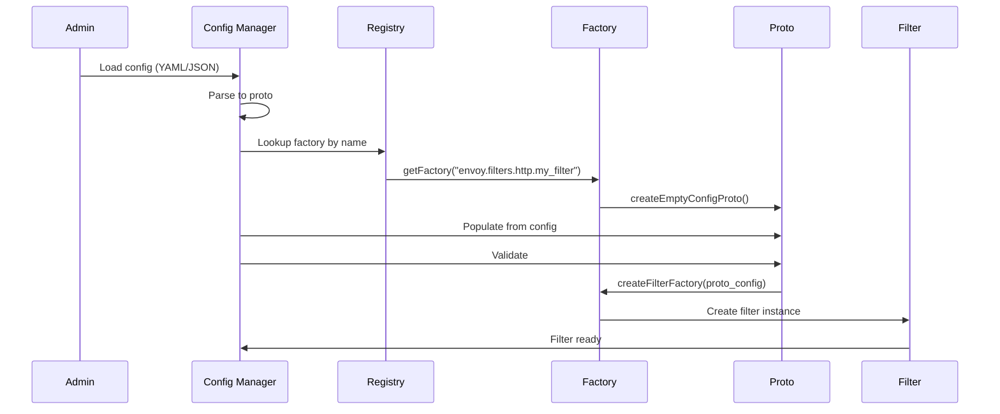

# Extension System Overview

This document provides a comprehensive overview of Envoy's extension system, including architecture, design principles, extension types, and the factory pattern.

## Table of Contents

- [Introduction](#introduction)
- [Extension Architecture](#extension-architecture)
- [Extension Types](#extension-types)
- [Factory Pattern](#factory-pattern)
- [Extension Lifecycle](#extension-lifecycle)
- [Configuration System](#configuration-system)
- [Best Practices](#best-practices)

## Introduction

Envoy's extensibility is one of its core strengths. The extension system allows you to add custom functionality without modifying Envoy's core code. Extensions are dynamically loaded and configured through protobuf-based configuration.

### Why Extensions?

- **Modularity**: Keep core small, add features via extensions
- **Maintainability**: Extensions are isolated and independently testable
- **Flexibility**: Mix and match extensions for your use case
- **Community**: Share extensions with the Envoy community
- **Safety**: Extensions run in the same process but are logically isolated

## Extension Architecture

### High-Level Architecture



### Component Hierarchy



## Extension Types

Envoy supports multiple extension points across different layers of the network stack.

### 1. HTTP Filters

Process HTTP requests and responses at the application layer.



**Key Interfaces:**
- `StreamDecoderFilter` - Process request (decode path)
- `StreamEncoderFilter` - Process response (encode path)
- `StreamFilter` - Process both request and response

**Examples:**
- Authentication: `jwt_authn`, `ext_authz`, `basic_auth`
- Authorization: `rbac`, `ext_authz`
- Rate Limiting: `ratelimit`, `local_ratelimit`
- Traffic Control: `router`, `fault`, `buffer`, `cors`
- Transformation: `grpc_json_transcoder`, `lua`

**File Location:** `source/extensions/filters/http/`

### 2. Network Filters

Process data at the TCP layer, protocol-agnostic.



**Key Interfaces:**
- `ReadFilter` - Process inbound data
- `WriteFilter` - Process outbound data
- `Filter` - Process both directions

**Examples:**
- Protocol Handlers: `http_connection_manager`, `mongo_proxy`, `redis_proxy`
- Proxying: `tcp_proxy`, `direct_response`
- Rate Limiting: `local_ratelimit`, `connection_limit`
- Security: `rbac`, `client_ssl_auth`

**File Location:** `source/extensions/filters/network/`

### 3. Listener Filters

Run before connection creation, inspect initial packets.



**Key Interfaces:**
- `ListenerFilter` - TCP listener filter
- `QuicListenerFilter` - QUIC-specific listener filter

**Examples:**
- Protocol Detection: `tls_inspector`, `http_inspector`
- Network Info: `original_dst`, `original_src`, `proxy_protocol`
- Rate Limiting: `local_ratelimit`

**File Location:** `source/extensions/filters/listener/`

### 4. Load Balancers

Custom load balancing algorithms for upstream selection.

**Key Interfaces:**
- `LoadBalancer` - Main load balancing interface
- `LoadBalancerFactory` - Factory for creating load balancers

**Examples:**
- `round_robin` - Distribute requests evenly
- `least_request` - Choose least loaded host
- `ring_hash` - Consistent hashing
- `maglev` - Maglev consistent hashing
- `random` - Random selection

**File Location:** `source/extensions/load_balancing_policies/`

### 5. Transport Sockets

Custom transport layer encryption and framing.

**Key Interfaces:**
- `TransportSocket` - Main transport interface
- `TransportSocketFactory` - Factory for creating sockets

**Examples:**
- `tls` - TLS/SSL encryption
- `quic` - QUIC transport
- `alts` - Application Layer Transport Security
- `raw_buffer` - Unencrypted transport
- `starttls` - Opportunistic TLS

**File Location:** `source/extensions/transport_sockets/`

### 6. Access Loggers

Custom access log formats and destinations.

**Key Interfaces:**
- `AccessLog::Instance` - Access log interface
- `AccessLog::InstanceFactory` - Factory for access loggers

**Examples:**
- `file` - Log to file
- `grpc` - Log to gRPC service
- `stdout` - Log to stdout
- `wasm` - Custom WASM-based logging

**File Location:** `source/extensions/access_loggers/`

### 7. Other Extension Types

| Type | Purpose | Location |
|------|---------|----------|
| Health Checkers | Custom health check protocols | `source/extensions/health_checkers/` |
| Retry Policies | Custom retry logic | `source/extensions/retry/` |
| Stats Sinks | Metrics export | `source/extensions/stat_sinks/` |
| Tracers | Distributed tracing | `source/extensions/tracers/` |
| Clusters | Custom cluster types | `source/extensions/clusters/` |
| Compression | Compression algorithms | `source/extensions/compression/` |
| Formatters | Custom log formatters | `source/extensions/formatter/` |

## Factory Pattern

Envoy uses the factory pattern extensively for extension instantiation. This provides:
- **Type Safety**: Compile-time type checking
- **Configuration**: Proto-based configuration validation
- **Lifecycle**: Controlled extension creation and destruction
- **Registration**: Automatic discovery of extensions

### Factory Architecture



### Factory Implementation Pattern

```cpp
// 1. Define configuration proto (in .proto file)
syntax = "proto3";
package envoy.extensions.filters.http.my_filter.v3;

message MyFilter {
  string setting = 1;
  google.protobuf.Duration timeout = 2;
}

// 2. Implement filter factory
class MyFilterFactory 
    : public Common::FactoryBase<
        envoy::extensions::filters::http::my_filter::v3::MyFilter> {
public:
  MyFilterFactory() : FactoryBase("envoy.filters.http.my_filter") {}

private:
  // Create filter factory callback
  Http::FilterFactoryCb createFilterFactoryFromProtoTyped(
      const envoy::extensions::filters::http::my_filter::v3::MyFilter& config,
      const std::string& stats_prefix,
      Server::Configuration::FactoryContext& context) override {
    
    // Create shared config object
    auto filter_config = std::make_shared<FilterConfig>(
        config, stats_prefix, context.scope());
    
    // Return lambda that creates filter instances per request
    return [filter_config](Http::FilterChainFactoryCallbacks& callbacks) {
      callbacks.addStreamFilter(
          std::make_shared<MyFilter>(filter_config));
    };
  }

  // Optional: Create route-specific config
  absl::StatusOr<Router::RouteSpecificFilterConfigConstSharedPtr>
  createRouteSpecificFilterConfigTyped(
      const envoy::extensions::filters::http::my_filter::v3::MyFilter& config,
      Server::Configuration::ServerFactoryContext& context,
      ProtobufMessage::ValidationVisitor& validator) override {
    
    return std::make_shared<RouteFilterConfig>(config);
  }
};

// 3. Register factory
REGISTER_FACTORY(MyFilterFactory, 
                 Server::Configuration::NamedHttpFilterConfigFactory);
```

### Factory Base Classes

#### HTTP Filters

```cpp
// Basic factory
template <class ConfigProto, class RouteConfigProto = ConfigProto>
class FactoryBase : public CommonFactoryBase<ConfigProto, RouteConfigProto>,
                     public Server::Configuration::NamedHttpFilterConfigFactory {
  // Implement createFilterFactoryFromProtoTyped()
};

// Exception-free factory (returns StatusOr)
template <class ConfigProto, class RouteConfigProto = ConfigProto>
class ExceptionFreeFactoryBase { /* ... */ };

// Dual factory (works as both downstream and upstream filter)
template <class ConfigProto, class RouteConfigProto = ConfigProto>
class DualFactoryBase { /* ... */ };
```

#### Network Filters

```cpp
class NetworkFilterConfigFactory : public Config::UntypedFactory {
public:
  virtual Network::FilterFactoryCb 
  createFilterFactoryFromProto(
      const Protobuf::Message& config,
      Server::Configuration::FactoryContext& context) PURE;
};
```

#### Listener Filters

```cpp
class ListenerFilterConfigFactory : public Config::UntypedFactory {
public:
  virtual Network::ListenerFilterFactoryCb 
  createListenerFilterFactoryFromProto(
      const Protobuf::Message& config,
      const Network::ListenerFilterMatcherSharedPtr& matcher,
      Server::Configuration::ListenerFactoryContext& context) PURE;
};
```

## Extension Lifecycle

### Filter Instance Lifecycle



### Lifecycle Methods

#### HTTP Filters

```cpp
class StreamFilter {
  // 1. Construction (via factory)
  MyFilter(ConfigSharedPtr config);
  
  // 2. Initialization (set callbacks)
  void setDecoderFilterCallbacks(StreamDecoderFilterCallbacks& callbacks);
  void setEncoderFilterCallbacks(StreamEncoderFilterCallbacks& callbacks);
  
  // 3. Request Processing
  FilterHeadersStatus decodeHeaders(RequestHeaderMap& headers, bool end_stream);
  FilterDataStatus decodeData(Buffer::Instance& data, bool end_stream);
  FilterTrailersStatus decodeTrailers(RequestTrailerMap& trailers);
  void decodeComplete();
  
  // 4. Response Processing
  Filter1xxHeadersStatus encode1xxHeaders(ResponseHeaderMap& headers);
  FilterHeadersStatus encodeHeaders(ResponseHeaderMap& headers, bool end_stream);
  FilterDataStatus encodeData(Buffer::Instance& data, bool end_stream);
  FilterTrailersStatus encodeTrailers(ResponseTrailerMap& trailers);
  void encodeComplete();
  
  // 5. Error Handling
  LocalErrorStatus onLocalReply(const LocalReplyData& data);
  
  // 6. Completion
  void onStreamComplete();
  
  // 7. Destruction
  void onDestroy();
  ~MyFilter();
};
```

#### Network Filters

```cpp
class Filter : public ReadFilter, public WriteFilter {
  // 1. Construction
  MyFilter(ConfigSharedPtr config);
  
  // 2. Initialization
  void initializeReadFilterCallbacks(ReadFilterCallbacks& callbacks);
  void initializeWriteFilterCallbacks(WriteFilterCallbacks& callbacks);
  
  // 3. Connection Establishment
  FilterStatus onNewConnection();
  
  // 4. Data Processing
  FilterStatus onData(Buffer::Instance& data, bool end_stream);
  FilterStatus onWrite(Buffer::Instance& data, bool end_stream);
  
  // 5. Destruction (handled by connection close)
  ~MyFilter();
};
```

#### Listener Filters

```cpp
class ListenerFilter {
  // 1. Construction
  MyListenerFilter(ConfigSharedPtr config);
  
  // 2. Connection Acceptance
  FilterStatus onAccept(ListenerFilterCallbacks& cb);
  
  // 3. Data Inspection
  FilterStatus onData(ListenerFilterBuffer& buffer);
  size_t maxReadBytes() const;
  
  // 4. Completion or Closure
  void onClose();
  
  // 5. Destruction
  ~MyListenerFilter();
};
```

### Thread Model



**Key Points:**
- **Factory**: Created once per worker thread
- **Filter Instance**: One per connection/stream
- **No Sharing**: Filter instances are never shared between threads
- **Thread Local**: Use `ThreadLocal::Slot` for shared state
- **Lock-Free**: Avoid locks in the data path

## Configuration System

### Configuration Flow



### Configuration Proto Best Practices

```protobuf
syntax = "proto3";

package envoy.extensions.filters.http.my_filter.v3;

import "google/protobuf/duration.proto";
import "google/protobuf/wrappers.proto";
import "udpa/annotations/status.proto";
import "validate/validate.proto";

option java_package = "io.envoyproxy.envoy.extensions.filters.http.my_filter.v3";
option java_outer_classname = "MyFilterProto";
option java_multiple_files = true;
option go_package = "github.com/envoyproxy/go-control-plane/envoy/extensions/filters/http/my_filter/v3;my_filterv3";

// [#protodoc-title: My Filter]
// [#extension: envoy.filters.http.my_filter]

// Configuration for My Filter
message MyFilter {
  option (udpa.annotations.status).package_version_status = ACTIVE;

  // Required setting (use validate annotations)
  string required_field = 1 [(validate.rules).string.min_len = 1];
  
  // Optional setting with default
  google.protobuf.UInt32Value optional_field = 2;
  
  // Duration with validation
  google.protobuf.Duration timeout = 3 [
    (validate.rules).duration = {
      gte: {seconds: 0}
      lte: {seconds: 300}
    }
  ];
  
  // Enum for controlled values
  enum Mode {
    DEFAULT = 0;
    STRICT = 1;
    PERMISSIVE = 2;
  }
  Mode mode = 4;
  
  // Nested message
  message AdvancedSettings {
    bool enabled = 1;
    repeated string allowed_values = 2;
  }
  AdvancedSettings advanced = 5;
}
```

### YAML Configuration

```yaml
name: envoy.filters.http.my_filter
typed_config:
  "@type": type.googleapis.com/envoy.extensions.filters.http.my_filter.v3.MyFilter
  required_field: "my_value"
  optional_field: 42
  timeout: 30s
  mode: STRICT
  advanced:
    enabled: true
    allowed_values:
      - "value1"
      - "value2"
```

## Best Practices

### 1. Design Principles

**Single Responsibility**
```cpp
// GOOD: Filter does one thing well
class AuthFilter : public Http::StreamDecoderFilter {
  // Only handles authentication
};

// BAD: Filter does too much
class SuperFilter : public Http::StreamFilter {
  // Authentication, rate limiting, transformation, logging...
};
```

**Fail Fast**
```cpp
// Validate configuration at startup
MyFilterFactory::createFilterFactoryFromProtoTyped(
    const MyFilterProto& config, ...) {
  
  // Validate early
  if (config.required_field().empty()) {
    throw EnvoyException("required_field must be set");
  }
  
  // Return factory callback
  return [config](...) { /* ... */ };
}
```

### 2. Performance

**Minimize Allocations**
```cpp
// GOOD: Reuse buffers
class MyFilter {
  Buffer::OwnedImpl buffer_;  // Reused across requests
  
  FilterDataStatus decodeData(Buffer::Instance& data, bool) {
    buffer_.move(data);  // Move, don't copy
    return FilterDataStatus::Continue;
  }
};

// BAD: Allocate per request
FilterDataStatus decodeData(Buffer::Instance& data, bool) {
  auto buffer = std::make_unique<Buffer::OwnedImpl>();  // Wasteful!
  buffer->add(data);
  return FilterDataStatus::Continue;
}
```

**Avoid Blocking**
```cpp
// GOOD: Async I/O
void makeAsyncCall() {
  client_->makeRequest(request, [this](Response response) {
    processResponse(response);
    decoder_callbacks_->continueDecoding();
  });
}

// BAD: Blocking I/O
void makeBlockingCall() {
  auto response = client_->makeRequestBlocking(request);  // BLOCKS WORKER!
  processResponse(response);
}
```

### 3. Error Handling

**Graceful Degradation**
```cpp
FilterHeadersStatus decodeHeaders(RequestHeaderMap& headers, bool) {
  try {
    processHeaders(headers);
    return FilterHeadersStatus::Continue;
  } catch (const std::exception& e) {
    ENVOY_LOG(error, "Error processing headers: {}", e.what());
    stats_.errors_.inc();
    
    // Fail open or closed based on configuration
    if (config_->failClosed()) {
      decoder_callbacks_->sendLocalReply(
          Http::Code::InternalServerError,
          "Internal filter error", nullptr, absl::nullopt, "");
      return FilterHeadersStatus::StopIteration;
    }
    return FilterHeadersStatus::Continue;
  }
}
```

### 4. Resource Management

**Clean Up in onDestroy()**
```cpp
void onDestroy() override {
  // Cancel pending callbacks
  if (timer_) {
    timer_->disableTimer();
    timer_.reset();
  }
  
  // Cancel async requests
  if (active_request_) {
    active_request_->cancel();
    active_request_.reset();
  }
  
  // Release resources
  buffer_.drain(buffer_.length());
}
```

### 5. Testing

**Comprehensive Unit Tests**
```cpp
TEST_F(MyFilterTest, BasicRequestFlow) {
  // Setup
  MyFilter filter(config_);
  filter.setDecoderFilterCallbacks(decoder_callbacks_);
  
  // Test headers
  Http::TestRequestHeaderMapImpl headers{{":path", "/test"}};
  EXPECT_EQ(Http::FilterHeadersStatus::Continue,
            filter.decodeHeaders(headers, false));
  
  // Test data
  Buffer::OwnedImpl data("test data");
  EXPECT_EQ(Http::FilterDataStatus::Continue,
            filter.decodeData(data, false));
  
  // Test trailers
  Http::TestRequestTrailerMapImpl trailers{{"trailer", "value"}};
  EXPECT_EQ(Http::FilterTrailersStatus::Continue,
            filter.decodeTrailers(trailers));
  
  // Verify behavior
  EXPECT_EQ(1, stats_.requests_.value());
}
```

### 6. Documentation

Document configuration, behavior, and limitations clearly:

```cpp
/**
 * MyFilter performs authentication based on custom headers.
 * 
 * Configuration:
 * - required_field: Identifies the authentication source
 * - timeout: Maximum time for auth check (default: 30s)
 * - mode: STRICT (reject on error) or PERMISSIVE (allow on error)
 * 
 * Behavior:
 * - Extracts auth token from X-Auth-Token header
 * - Makes async call to validation service
 * - Stops filter chain until validation completes
 * - Sets dynamic metadata with user information
 * 
 * Limitations:
 * - Does not support streaming requests (buffers full body)
 * - Maximum request size: 1MB
 * - Timeout range: 1s - 300s
 * 
 * Statistics:
 * - my_filter.requests: Total requests processed
 * - my_filter.allowed: Requests allowed
 * - my_filter.denied: Requests denied
 * - my_filter.errors: Validation errors
 * - my_filter.timeouts: Validation timeouts
 */
class MyFilter : public Http::StreamDecoderFilter { /* ... */ };
```

## Next Steps

- **[02-http-filter-development.md](02-http-filter-development.md)** - Detailed HTTP filter development guide
- **[03-network-filter-development.md](03-network-filter-development.md)** - Network filter development guide
- **[04-listener-filter-development.md](04-listener-filter-development.md)** - Listener filter development guide
- **[05-extension-registration.md](05-extension-registration.md)** - Build system and registration details

---

*Last Updated: 2026-04-26*  
*Envoy Version: Latest (4.x)*
