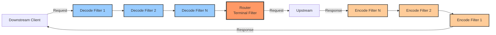

# HTTP Filter Development Guide

This comprehensive guide covers everything you need to know to develop production-ready HTTP filters for Envoy.

## Table of Contents

- [Introduction](#introduction)
- [Filter Interfaces](#filter-interfaces)
- [Filter Lifecycle](#filter-lifecycle)
- [Filter Callbacks](#filter-callbacks)
- [Configuration and Factory](#configuration-and-factory)
- [Route-Specific Configuration](#route-specific-configuration)
- [Common Patterns](#common-patterns)
- [Testing](#testing)
- [Best Practices](#best-practices)
- [Examples](#examples)

## Introduction

HTTP filters are the most common type of Envoy extension. They process HTTP requests and responses in a configurable pipeline, allowing you to implement authentication, authorization, rate limiting, transformation, and more.

### When to Use HTTP Filters

Use HTTP filters when you need to:
- Inspect or modify HTTP headers, body, or trailers
- Make authorization decisions
- Enforce rate limits or quotas
- Transform request/response data
- Add observability or telemetry
- Implement custom routing logic

### Filter Chain Architecture



## Filter Interfaces

Envoy provides three primary filter interfaces, defined in `envoy/http/filter.h`:

### 1. StreamDecoderFilter

Processes request data (decode path, client to upstream).

```cpp
class StreamDecoderFilter : public virtual StreamFilterBase {
public:
  virtual ~StreamDecoderFilter() = default;

  // Process request headers
  virtual FilterHeadersStatus decodeHeaders(
      RequestHeaderMap& headers, 
      bool end_stream) PURE;

  // Process request body data
  virtual FilterDataStatus decodeData(
      Buffer::Instance& data, 
      bool end_stream) PURE;

  // Process request trailers
  virtual FilterTrailersStatus decodeTrailers(
      RequestTrailerMap& trailers) PURE;

  // Process request metadata (optional)
  virtual FilterMetadataStatus decodeMetadata(
      MetadataMap& metadata_map);

  // Called when request is complete
  virtual void decodeComplete();

  // Set callbacks for interacting with filter manager
  virtual void setDecoderFilterCallbacks(
      StreamDecoderFilterCallbacks& callbacks) PURE;
};
```

### 2. StreamEncoderFilter

Processes response data (encode path, upstream to client).

```cpp
class StreamEncoderFilter : public virtual StreamFilterBase {
public:
  virtual ~StreamEncoderFilter() = default;

  // Process 1xx informational headers
  virtual Filter1xxHeadersStatus encode1xxHeaders(
      ResponseHeaderMap& headers) PURE;

  // Process response headers
  virtual FilterHeadersStatus encodeHeaders(
      ResponseHeaderMap& headers, 
      bool end_stream) PURE;

  // Process response body data
  virtual FilterDataStatus encodeData(
      Buffer::Instance& data, 
      bool end_stream) PURE;

  // Process response trailers
  virtual FilterTrailersStatus encodeTrailers(
      ResponseTrailerMap& trailers) PURE;

  // Process response metadata
  virtual FilterMetadataStatus encodeMetadata(
      MetadataMap& metadata_map) PURE;

  // Called when response is complete
  virtual void encodeComplete();

  // Set callbacks for interacting with filter manager
  virtual void setEncoderFilterCallbacks(
      StreamEncoderFilterCallbacks& callbacks) PURE;
};
```

### 3. StreamFilter

Bidirectional filter that processes both requests and responses.

```cpp
class StreamFilter : public virtual StreamDecoderFilter,
                      public virtual StreamEncoderFilter {
  // Inherits all methods from both decoder and encoder interfaces
};
```

### 4. StreamFilterBase

Base interface with lifecycle methods common to all filters.

```cpp
class StreamFilterBase {
public:
  virtual ~StreamFilterBase() = default;

  // Called before final access log
  virtual void onStreamComplete();

  // Called before filter destruction
  virtual void onDestroy() PURE;

  // Called when local reply is sent
  virtual LocalErrorStatus onLocalReply(
      const LocalReplyData& data);

  // Called when matcher action occurs
  virtual void onMatchCallback(const Matcher::Action& action);
};
```

### Return Status Codes

#### FilterHeadersStatus

```cpp
enum class FilterHeadersStatus {
  // Continue to next filter
  Continue,
  
  // Stop iteration, wait for continueDecoding()/continueEncoding()
  StopIteration,
  
  // Continue headers but delay end_stream
  ContinueAndDontEndStream,
  
  // Stop and buffer all data
  StopAllIterationAndBuffer,
  
  // Stop and apply backpressure
  StopAllIterationAndWatermark
};
```

#### FilterDataStatus

```cpp
enum class FilterDataStatus {
  // Continue to next filter
  Continue,
  
  // Stop and buffer data
  StopIterationAndBuffer,
  
  // Stop and apply backpressure
  StopIterationAndWatermark,
  
  // Stop without buffering
  StopIterationNoBuffer
};
```

#### FilterTrailersStatus

```cpp
enum class FilterTrailersStatus {
  // Continue to next filter
  Continue,
  
  // Stop iteration
  StopIteration
};
```

## Filter Lifecycle

### Complete Lifecycle Flow

```mermaid
stateDiagram-v2
    [*] --> FactoryCreated: Config loaded
    FactoryCreated --> FilterCreated: Per-stream
    FilterCreated --> CallbacksSet: setDecoderFilterCallbacks()
    CallbacksSet --> DecodeHeaders: Request arrives
    
    state DecodeHeaders {
        [*] --> ProcessHeaders
        ProcessHeaders --> Continue: Continue
        ProcessHeaders --> StopIteration: StopIteration
        StopIteration --> AsyncWork: Async operation
        AsyncWork --> ContinueDecoding: continueDecoding()
        ContinueDecoding --> Continue
        Continue --> [*]
    }
    
    DecodeHeaders --> DecodeData: If body present
    
    state DecodeData {
        [*] --> ProcessData
        ProcessData --> ContinueData: Continue
        ProcessData --> StopAndBuffer: StopIterationAndBuffer
        StopAndBuffer --> BufferMore: More data
        BufferMore --> StopAndBuffer
        StopAndBuffer --> ContinueData: continueDecoding()
        ContinueData --> [*]
    }
    
    DecodeData --> DecodeTrailers: If trailers present
    DecodeTrailers --> DecodeComplete
    DecodeComplete --> EncodeHeaders: Response arrives
    
    state EncodeHeaders {
        [*] --> ProcessRespHeaders
        ProcessRespHeaders --> ContinueResp: Continue
        ProcessRespHeaders --> StopResp: StopIteration
        StopResp --> ContinueEncoding: continueEncoding()
        ContinueEncoding --> ContinueResp
        ContinueResp --> [*]
    }
    
    EncodeHeaders --> EncodeData: If response body
    EncodeData --> EncodeTrailers: If trailers
    EncodeTrailers --> EncodeComplete
    EncodeComplete --> OnStreamComplete
    OnStreamComplete --> OnDestroy
    OnDestroy --> [*]
    
    DecodeHeaders --> LocalReply: Error / sendLocalReply()
    DecodeData --> LocalReply
    LocalReply --> OnLocalReply
    OnLocalReply --> OnStreamComplete
```



### Lifecycle Methods Execution Order

```cpp
// 1. Filter Creation (once per stream)
auto filter = std::make_shared<MyFilter>(config);

// 2. Callback Registration
filter->setDecoderFilterCallbacks(decoder_callbacks);
filter->setEncoderFilterCallbacks(encoder_callbacks);

// 3. Request Processing
filter->decodeHeaders(request_headers, end_stream);
if (!end_stream) {
  filter->decodeData(body_data, end_stream);
  if (has_trailers) {
    filter->decodeTrailers(request_trailers);
  }
}
filter->decodeComplete();

// 4. Response Processing
filter->encode1xxHeaders(informational_headers);  // Optional
filter->encodeHeaders(response_headers, end_stream);
if (!end_stream) {
  filter->encodeData(response_data, end_stream);
  if (has_trailers) {
    filter->encodeTrailers(response_trailers);
  }
}
filter->encodeComplete();

// 5. Stream Completion
filter->onStreamComplete();

// 6. Cleanup
filter->onDestroy();
// filter destructor called after deferred deletion
```

## Filter Callbacks

### StreamDecoderFilterCallbacks

Key methods for request processing:

```cpp
class StreamDecoderFilterCallbacks : public StreamFilterCallbacks {
  // Continue filter chain after StopIteration
  virtual void continueDecoding() PURE;

  // Access buffered data
  virtual const Buffer::Instance* decodingBuffer() PURE;
  virtual void modifyDecodingBuffer(
      std::function<void(Buffer::Instance&)> callback) PURE;

  // Add/inject data
  virtual void addDecodedData(Buffer::Instance& data, 
                               bool streaming_filter) PURE;
  virtual void injectDecodedDataToFilterChain(Buffer::Instance& data,
                                               bool end_stream) PURE;

  // Add trailers
  virtual RequestTrailerMap& addDecodedTrailers() PURE;

  // Send local reply
  virtual void sendLocalReply(
      Code response_code,
      absl::string_view body_text,
      std::function<void(ResponseHeaderMap& headers)> modify_headers,
      const absl::optional<Grpc::Status::GrpcStatus> grpc_status,
      absl::string_view details) PURE;

  // Encode response from decoder
  virtual void encode1xxHeaders(ResponseHeaderMapPtr&& headers) PURE;
  virtual void encodeHeaders(ResponseHeaderMapPtr&& headers, 
                              bool end_stream, 
                              absl:string_view details) PURE;
  virtual void encodeData(Buffer::Instance& data, bool end_stream) PURE;
  virtual void encodeTrailers(ResponseTrailerMapPtr&& trailers) PURE;

  // Routing
  virtual void clearRouteCache() PURE;
  virtual OptRef<const Router::Route> route(
      const Router::RouteCallback& cb) PURE;

  // Recreate stream
  virtual bool recreateStream(
      const ResponseHeaderMap* original_response_headers) PURE;

  // Upstream host override
  virtual void setUpstreamOverrideHost(
      Upstream::LoadBalancerContext::OverrideHost host) PURE;
};
```

### StreamEncoderFilterCallbacks

Key methods for response processing:

```cpp
class StreamEncoderFilterCallbacks : public StreamFilterCallbacks {
  // Continue filter chain after StopIteration
  virtual void continueEncoding() PURE;

  // Access buffered data
  virtual const Buffer::Instance* encodingBuffer() PURE;
  virtual void modifyEncodingBuffer(
      std::function<void(Buffer::Instance&)> callback) PURE;

  // Add/inject data
  virtual void addEncodedData(Buffer::Instance& data,
                               bool streaming_filter) PURE;
  virtual void injectEncodedDataToFilterChain(Buffer::Instance& data,
                                               bool end_stream) PURE;

  // Add trailers
  virtual ResponseTrailerMap& addEncodedTrailers() PURE;

  // Send local reply (overrides current response)
  virtual void sendLocalReply(
      Code response_code,
      absl::string_view body_text,
      std::function<void(ResponseHeaderMap& headers)> modify_headers,
      const absl::optional<Grpc::Status::GrpcStatus> grpc_status,
      absl::string_view details) PURE;
};
```

### StreamFilterCallbacks (Common)

Methods available to both decoder and encoder:

```cpp
class StreamFilterCallbacks {
  // Connection info
  virtual OptRef<const Network::Connection> connection() PURE;
  virtual Event::Dispatcher& dispatcher() PURE;

  // Stream info and tracing
  virtual StreamInfo::StreamInfo& streamInfo() PURE;
  virtual Tracing::Span& activeSpan() PURE;
  virtual OptRef<const Tracing::Config> tracingConfig() const PURE;

  // Routing
  virtual OptRef<const Router::Route> route() PURE;
  virtual Router::RouteConstSharedPtr routeSharedPtr() PURE;
  virtual OptRef<const Upstream::ClusterInfo> clusterInfo() PURE;

  // Stream management
  virtual void resetStream(
      Http::StreamResetReason reset_reason,
      absl::string_view transport_failure_reason) PURE;
  virtual void resetIdleTimer() PURE;
  virtual uint64_t streamId() const PURE;

  // Configuration
  virtual const Router::RouteSpecificFilterConfig*
      mostSpecificPerFilterConfig() const PURE;
  virtual Router::RouteSpecificFilterConfigs 
      perFilterConfigs() const PURE;

  // Buffer limits
  virtual void setBufferLimit(uint64_t limit) PURE;
  virtual uint64_t bufferLimit() PURE;

  // Headers access
  virtual RequestHeaderMapOptRef requestHeaders() PURE;
  virtual RequestTrailerMapOptRef requestTrailers() PURE;
  virtual ResponseHeaderMapOptRef responseHeaders() PURE;
  virtual ResponseTrailerMapOptRef responseTrailers() PURE;
};
```

## Configuration and Factory

### Step 1: Define Proto Configuration

Create `envoy/extensions/filters/http/my_filter/v3/my_filter.proto`:

```protobuf
syntax = "proto3";

package envoy.extensions.filters.http.my_filter.v3;

import "google/protobuf/duration.proto";
import "google/protobuf/wrappers.proto";
import "udpa/annotations/status.proto";
import "udpa/annotations/versioning.proto";
import "validate/validate.proto";

option java_package = "io.envoyproxy.envoy.extensions.filters.http.my_filter.v3";
option java_outer_classname = "MyFilterProto";
option java_multiple_files = true;
option go_package = "github.com/envoyproxy/go-control-plane/envoy/extensions/filters/http/my_filter/v3;my_filterv3";

// [#protodoc-title: My Filter]
// [#extension: envoy.filters.http.my_filter]

// My Filter configuration
message MyFilter {
  option (udpa.annotations.versioning).previous_message_type =
      "envoy.config.filter.http.my_filter.v2.MyFilter";

  // Enable the filter
  bool enabled = 1;

  // Timeout for async operations
  google.protobuf.Duration timeout = 2 [(validate.rules).duration = {
    gte: {seconds: 0}
    lte: {seconds: 300}
  }];

  // Required header name
  string header_name = 3 [(validate.rules).string = {
    min_len: 1
    max_len: 256
  }];

  // Optional settings
  message Settings {
    bool allow_missing = 1;
    repeated string allowed_values = 2;
  }
  Settings settings = 4;
}
```

### Step 2: Implement Configuration Class

Create `source/extensions/filters/http/my_filter/config.h`:

```cpp
#pragma once

#include "envoy/extensions/filters/http/my_filter/v3/my_filter.pb.h"
#include "envoy/extensions/filters/http/my_filter/v3/my_filter.pb.validate.h"

#include "source/common/common/logger.h"

namespace Envoy {
namespace Extensions {
namespace HttpFilters {
namespace MyFilter {

// Filter configuration (shared across filter instances)
class FilterConfig : public Logger::Loggable<Logger::Id::filter> {
public:
  FilterConfig(
      const envoy::extensions::filters::http::my_filter::v3::MyFilter& config,
      const std::string& stats_prefix,
      Stats::Scope& scope);

  bool enabled() const { return enabled_; }
  std::chrono::milliseconds timeout() const { return timeout_; }
  const std::string& headerName() const { return header_name_; }
  bool allowMissing() const { return allow_missing_; }
  const absl::flat_hash_set<std::string>& allowedValues() const {
    return allowed_values_;
  }

  // Stats
  struct Stats {
    ALL_MY_FILTER_STATS(GENERATE_COUNTER_STRUCT, GENERATE_HISTOGRAM_STRUCT)
  };
  Stats& stats() { return stats_; }

private:
  const bool enabled_;
  const std::chrono::milliseconds timeout_;
  const std::string header_name_;
  const bool allow_missing_;
  const absl::flat_hash_set<std::string> allowed_values_;
  Stats stats_;
};

using FilterConfigSharedPtr = std::shared_ptr<FilterConfig>;

// Define stats
#define ALL_MY_FILTER_STATS(COUNTER, HISTOGRAM) \
  COUNTER(requests_total)                        \
  COUNTER(requests_allowed)                      \
  COUNTER(requests_denied)                       \
  COUNTER(errors)                                \
  HISTOGRAM(processing_duration_ms, Milliseconds)

} // namespace MyFilter
} // namespace HttpFilters
} // namespace Extensions
} // namespace Envoy
```

### Step 3: Implement Filter Class

Create `source/extensions/filters/http/my_filter/my_filter.h`:

```cpp
#pragma once

#include "envoy/http/filter.h"

#include "source/extensions/filters/http/common/pass_through_filter.h"
#include "source/extensions/filters/http/my_filter/config.h"

namespace Envoy {
namespace Extensions {
namespace HttpFilters {
namespace MyFilter {

// Main filter implementation
class MyFilter : public Http::PassThroughFilter,
                 public Logger::Loggable<Logger::Id::filter> {
public:
  MyFilter(FilterConfigSharedPtr config);
  ~MyFilter() override = default;

  // StreamDecoderFilter
  Http::FilterHeadersStatus decodeHeaders(Http::RequestHeaderMap& headers,
                                           bool end_stream) override;
  Http::FilterDataStatus decodeData(Buffer::Instance& data,
                                     bool end_stream) override;
  Http::FilterTrailersStatus decodeTrailers(
      Http::RequestTrailerMap& trailers) override;

  // StreamEncoderFilter
  Http::FilterHeadersStatus encodeHeaders(Http::ResponseHeaderMap& headers,
                                           bool end_stream) override;

  // StreamFilterBase
  void onDestroy() override;
  void onStreamComplete() override;
  Http::LocalErrorStatus onLocalReply(
      const Http::StreamFilterBase::LocalReplyData& data) override;

private:
  // Helper methods
  bool isAllowed(const std::string& value);
  void onTimeout();
  void processAsync();

  // Configuration
  const FilterConfigSharedPtr config_;

  // State
  Event::TimerPtr timer_;
  bool request_complete_{false};
};

} // namespace MyFilter
} // namespace HttpFilters
} // namespace Extensions
} // namespace Envoy
```

### Step 4: Implement Filter Factory

Create `source/extensions/filters/http/my_filter/factory.h`:

```cpp
#pragma once

#include "envoy/extensions/filters/http/my_filter/v3/my_filter.pb.h"
#include "envoy/extensions/filters/http/my_filter/v3/my_filter.pb.validate.h"

#include "source/extensions/filters/http/common/factory_base.h"

namespace Envoy {
namespace Extensions {
namespace HttpFilters {
namespace MyFilter {

// Filter name constant
inline constexpr absl::string_view FilterName = 
    "envoy.filters.http.my_filter";

// Filter factory
class MyFilterFactory
    : public Common::FactoryBase<
          envoy::extensions::filters::http::my_filter::v3::MyFilter> {
public:
  MyFilterFactory() : FactoryBase(std::string(FilterName)) {}

private:
  // Create filter factory callback
  Http::FilterFactoryCb createFilterFactoryFromProtoTyped(
      const envoy::extensions::filters::http::my_filter::v3::MyFilter& config,
      const std::string& stats_prefix,
      Server::Configuration::FactoryContext& context) override;

  // Optional: Create route-specific config
  absl::StatusOr<Router::RouteSpecificFilterConfigConstSharedPtr>
  createRouteSpecificFilterConfigTyped(
      const envoy::extensions::filters::http::my_filter::v3::MyFilter& config,
      Server::Configuration::ServerFactoryContext& context,
      ProtobufMessage::ValidationVisitor& validator) override;

  // Optional: Check if filter is terminal
  bool isTerminalFilterByProtoTyped(
      const envoy::extensions::filters::http::my_filter::v3::MyFilter& config,
      Server::Configuration::ServerFactoryContext& context) override;
};

} // namespace MyFilter
} // namespace HttpFilters
} // namespace Extensions
} // namespace Envoy
```

### Step 5: Implement Factory Methods

Create `source/extensions/filters/http/my_filter/factory.cc`:

```cpp
#include "source/extensions/filters/http/my_filter/factory.h"
#include "source/extensions/filters/http/my_filter/my_filter.h"
#include "source/extensions/filters/http/my_filter/config.h"

namespace Envoy {
namespace Extensions {
namespace HttpFilters {
namespace MyFilter {

Http::FilterFactoryCb MyFilterFactory::createFilterFactoryFromProtoTyped(
    const envoy::extensions::filters::http::my_filter::v3::MyFilter& proto_config,
    const std::string& stats_prefix,
    Server::Configuration::FactoryContext& context) {

  // Create shared configuration object
  auto filter_config = std::make_shared<FilterConfig>(
      proto_config, stats_prefix, context.scope());

  // Return lambda that creates filter instances per stream
  return [filter_config](Http::FilterChainFactoryCallbacks& callbacks) -> void {
    // Create filter instance
    auto filter = std::make_shared<MyFilter>(filter_config);
    
    // Add to filter chain (bidirectional filter)
    callbacks.addStreamFilter(filter);
  };
}

absl::StatusOr<Router::RouteSpecificFilterConfigConstSharedPtr>
MyFilterFactory::createRouteSpecificFilterConfigTyped(
    const envoy::extensions::filters::http::my_filter::v3::MyFilter& proto_config,
    Server::Configuration::ServerFactoryContext&,
    ProtobufMessage::ValidationVisitor&) {
  
  // Create route-specific config (optional)
  return std::make_shared<RouteFilterConfig>(proto_config);
}

bool MyFilterFactory::isTerminalFilterByProtoTyped(
    const envoy::extensions::filters::http::my_filter::v3::MyFilter&,
    Server::Configuration::ServerFactoryContext&) {
  // Return true if filter can terminate filter chain
  return false;
}

// Register factory
REGISTER_FACTORY(MyFilterFactory, 
                 Server::Configuration::NamedHttpFilterConfigFactory);

} // namespace MyFilter
} // namespace HttpFilters
} // namespace Extensions
} // namespace Envoy
```

### Step 6: Implement Filter Logic

Create `source/extensions/filters/http/my_filter/my_filter.cc`:

```cpp
#include "source/extensions/filters/http/my_filter/my_filter.h"

#include "source/common/http/utility.h"

namespace Envoy {
namespace Extensions {
namespace HttpFilters {
namespace MyFilter {

MyFilter::MyFilter(FilterConfigSharedPtr config)
    : config_(std::move(config)) {}

Http::FilterHeadersStatus MyFilter::decodeHeaders(
    Http::RequestHeaderMap& headers, bool end_stream) {
  
  // Check if filter is enabled
  if (!config_->enabled()) {
    return Http::FilterHeadersStatus::Continue;
  }

  // Increment stats
  config_->stats().requests_total_.inc();

  // Get required header
  const auto header_value = headers.get(
      Http::LowerCaseString(config_->headerName()));

  // Check if header is present
  if (header_value.empty()) {
    if (config_->allowMissing()) {
      ENVOY_LOG(debug, "Header missing but allowed");
      config_->stats().requests_allowed_.inc();
      return Http::FilterHeadersStatus::Continue;
    }

    ENVOY_LOG(warn, "Required header missing: {}", 
              config_->headerName());
    config_->stats().requests_denied_.inc();
    
    decoder_callbacks_->sendLocalReply(
        Http::Code::BadRequest,
        "Missing required header",
        nullptr,
        absl::nullopt,
        "my_filter_missing_header");
    
    return Http::FilterHeadersStatus::StopIteration;
  }

  // Validate header value
  const std::string value = std::string(header_value[0]->value().getStringView());
  if (!isAllowed(value)) {
    ENVOY_LOG(warn, "Header value not allowed: {}", value);
    config_->stats().requests_denied_.inc();
    
    decoder_callbacks_->sendLocalReply(
        Http::Code::Forbidden,
        "Header value not allowed",
        nullptr,
        absl::nullopt,
        "my_filter_invalid_value");
    
    return Http::FilterHeadersStatus::StopIteration;
  }

  // Store value in dynamic metadata
  ProtobufWkt::Struct metadata;
  (*metadata.mutable_fields())["header_value"] = 
      ValueUtil::stringValue(value);
  decoder_callbacks_->streamInfo().setDynamicMetadata(
      "envoy.filters.http.my_filter", metadata);

  ENVOY_LOG(debug, "Request allowed with value: {}", value);
  config_->stats().requests_allowed_.inc();
  
  return Http::FilterHeadersStatus::Continue;
}

Http::FilterDataStatus MyFilter::decodeData(
    Buffer::Instance& data, bool end_stream) {
  // Pass through data
  return Http::FilterDataStatus::Continue;
}

Http::FilterTrailersStatus MyFilter::decodeTrailers(
    Http::RequestTrailerMap&) {
  return Http::FilterTrailersStatus::Continue;
}

Http::FilterHeadersStatus MyFilter::encodeHeaders(
    Http::ResponseHeaderMap& headers, bool end_stream) {
  // Add response header
  headers.addCopy(Http::LowerCaseString("x-my-filter"), "processed");
  return Http::FilterHeadersStatus::Continue;
}

void MyFilter::onDestroy() {
  // Clean up resources
  if (timer_) {
    timer_->disableTimer();
    timer_.reset();
  }
}

void MyFilter::onStreamComplete() {
  request_complete_ = true;
}

Http::LocalErrorStatus MyFilter::onLocalReply(
    const Http::StreamFilterBase::LocalReplyData& data) {
  ENVOY_LOG(debug, "Local reply: code={}, details={}", 
            static_cast<int>(data.code_), data.details_);
  return Http::LocalErrorStatus::Continue;
}

bool MyFilter::isAllowed(const std::string& value) {
  const auto& allowed = config_->allowedValues();
  if (allowed.empty()) {
    return true;  // No restrictions
  }
  return allowed.contains(value);
}

} // namespace MyFilter
} // namespace HttpFilters
} // namespace Extensions
} // namespace Envoy
```

## Route-Specific Configuration

Route-specific configuration allows different filter behavior per route.

### Define Route Configuration

```protobuf
// In my_filter.proto
message MyFilter {
  // ... global config ...
}

// Route-specific overrides
message MyFilterPerRoute {
  bool disabled = 1;
  Settings settings = 2;
}
```

### Implement Route Config Class

```cpp
class RouteFilterConfig : public Router::RouteSpecificFilterConfig {
public:
  RouteFilterConfig(
      const envoy::extensions::filters::http::my_filter::v3::MyFilterPerRoute& config)
      : disabled_(config.disabled()) {}

  bool disabled() const { return disabled_; }

private:
  const bool disabled_;
};
```

### Use Route Config in Filter

```cpp
Http::FilterHeadersStatus MyFilter::decodeHeaders(
    Http::RequestHeaderMap& headers, bool end_stream) {

  // Get route-specific config
  const auto* route_config = 
      Http::Utility::resolveMostSpecificPerFilterConfig<RouteFilterConfig>(
          decoder_callbacks_);

  // Check if filter is disabled for this route
  if (route_config && route_config->disabled()) {
    ENVOY_LOG(debug, "Filter disabled for this route");
    return Http::FilterHeadersStatus::Continue;
  }

  // Normal processing...
  return processRequest(headers, end_stream);
}
```

### Configure Per-Route

```yaml
routes:
  - match:
      prefix: "/api"
    route:
      cluster: api_cluster
    typed_per_filter_config:
      envoy.filters.http.my_filter:
        "@type": type.googleapis.com/envoy.extensions.filters.http.my_filter.v3.MyFilterPerRoute
        disabled: true
```

## Common Patterns

### Pattern 1: Simple Inspection Filter

```cpp
class InspectorFilter : public Http::PassThroughFilter {
  Http::FilterHeadersStatus decodeHeaders(
      Http::RequestHeaderMap& headers, bool) override {
    // Log request info
    ENVOY_LOG(info, "Request: method={}, path={}, host={}",
              headers.getMethodValue(),
              headers.getPathValue(),
              headers.getHostValue());
    
    // Increment counter
    stats_.requests_total_.inc();
    
    // Continue to next filter
    return Http::FilterHeadersStatus::Continue;
  }
};
```

### Pattern 2: Header Modification

```cpp
Http::FilterHeadersStatus decodeHeaders(
    Http::RequestHeaderMap& headers, bool) override {
  // Add header
  headers.addCopy(Http::LowerCaseString("x-custom-header"), "value");
  
  // Modify existing header
  if (auto user_agent = headers.UserAgent()) {
    headers.setUserAgent("ModifiedUserAgent");
  }
  
  // Remove header
  headers.remove(Http::LowerCaseString("x-unwanted-header"));
  
  return Http::FilterHeadersStatus::Continue;
}
```

### Pattern 3: Buffering Complete Request

```cpp
Http::FilterHeadersStatus decodeHeaders(
    Http::RequestHeaderMap& headers, bool end_stream) override {
  if (end_stream) {
    // No body, process immediately
    return processRequest(headers);
  }
  
  // Need to buffer body
  return Http::FilterHeadersStatus::StopIteration;
}

Http::FilterDataStatus decodeData(
    Buffer::Instance& data, bool end_stream) override {
  if (!end_stream) {
    // Keep buffering
    return Http::FilterDataStatus::StopIterationAndBuffer;
  }
  
  // All data received, process
  const auto* buffer = decoder_callbacks_->decodingBuffer();
  processRequestBody(*buffer);
  
  // Continue filter chain
  decoder_callbacks_->continueDecoding();
  return Http::FilterDataStatus::Continue;
}
```

### Pattern 4: Async External Call

```cpp
Http::FilterHeadersStatus decodeHeaders(
    Http::RequestHeaderMap& headers, bool) override {
  // Make async external call
  client_->makeRequest(
      request,
      [this, &headers](Response response) {
        if (response.allowed) {
          // Allow request
          decoder_callbacks_->continueDecoding();
        } else {
          // Deny request
          decoder_callbacks_->sendLocalReply(
              Http::Code::Forbidden,
              "Access denied",
              nullptr,
              absl::nullopt,
              "auth_denied");
        }
      });
  
  // Stop filter chain until async call completes
  return Http::FilterHeadersStatus::StopIteration;
}
```

### Pattern 5: Request/Response Transformation

```cpp
Http::FilterHeadersStatus encodeHeaders(
    Http::ResponseHeaderMap& headers, bool end_stream) override {
  // Transform response based on request
  const auto accept = decoder_callbacks_->requestHeaders()->get(
      Http::CustomHeaders::get().Accept);
  
  if (!accept.empty() && accept[0]->value() == "application/json") {
    // Will transform to JSON in encodeData
    headers.setContentType("application/json");
    return Http::FilterHeadersStatus::StopIteration;
  }
  
  return Http::FilterHeadersStatus::Continue;
}

Http::FilterDataStatus encodeData(
    Buffer::Instance& data, bool end_stream) override {
  if (!end_stream) {
    return Http::FilterDataStatus::StopIterationAndBuffer;
  }
  
  // Transform buffered data
  const auto* buffer = encoder_callbacks_->encodingBuffer();
  auto json_data = transformToJson(*buffer);
  
  // Replace buffer contents
  encoder_callbacks_->modifyEncodingBuffer([&](Buffer::Instance& buf) {
    buf.drain(buf.length());
    buf.add(json_data);
  });
  
  encoder_callbacks_->continueEncoding();
  return Http::FilterDataStatus::Continue;
}
```

### Pattern 6: Dynamic Metadata

```cpp
Http::FilterHeadersStatus decodeHeaders(
    Http::RequestHeaderMap& headers, bool) override {
  // Extract user info
  const auto user_id = extractUserId(headers);
  const auto user_tier = extractUserTier(headers);
  
  // Set dynamic metadata for use by other filters
  ProtobufWkt::Struct metadata;
  auto* fields = metadata.mutable_fields();
  (*fields)["user_id"] = ValueUtil::stringValue(user_id);
  (*fields)["user_tier"] = ValueUtil::stringValue(user_tier);
  (*fields)["timestamp"] = ValueUtil::numberValue(
      std::chrono::system_clock::now().time_since_epoch().count());
  
  decoder_callbacks_->streamInfo().setDynamicMetadata(
      "envoy.filters.http.my_filter", metadata);
  
  return Http::FilterHeadersStatus::Continue;
}
```

## Testing

### Unit Test Structure

Create `test/extensions/filters/http/my_filter/my_filter_test.cc`:

```cpp
#include "test/mocks/http/mocks.h"
#include "test/mocks/server/factory_context.h"
#include "test/test_common/utility.h"

#include "source/extensions/filters/http/my_filter/my_filter.h"

#include "gmock/gmock.h"
#include "gtest/gtest.h"

using testing::_;
using testing::Return;
using testing::NiceMock;

namespace Envoy {
namespace Extensions {
namespace HttpFilters {
namespace MyFilter {
namespace {

class MyFilterTest : public testing::Test {
protected:
  void SetUp() override {
    // Setup default config
    envoy::extensions::filters::http::my_filter::v3::MyFilter config;
    config.set_enabled(true);
    config.set_header_name("x-custom-header");
    config.mutable_timeout()->set_seconds(30);
    
    config_ = std::make_shared<FilterConfig>(
        config, "stats", factory_context_.scope());
    
    filter_ = std::make_shared<MyFilter>(config_);
    filter_->setDecoderFilterCallbacks(decoder_callbacks_);
    filter_->setEncoderFilterCallbacks(encoder_callbacks_);
  }

  NiceMock<Server::Configuration::MockFactoryContext> factory_context_;
  NiceMock<Http::MockStreamDecoderFilterCallbacks> decoder_callbacks_;
  NiceMock<Http::MockStreamEncoderFilterCallbacks> encoder_callbacks_;
  FilterConfigSharedPtr config_;
  std::shared_ptr<MyFilter> filter_;
};

TEST_F(MyFilterTest, AllowsRequestWithValidHeader) {
  Http::TestRequestHeaderMapImpl headers{
      {":method", "GET"},
      {":path", "/test"},
      {":authority", "host"},
      {"x-custom-header", "allowed-value"}};

  EXPECT_EQ(Http::FilterHeadersStatus::Continue,
            filter_->decodeHeaders(headers, true));
  
  EXPECT_EQ(1, config_->stats().requests_total_.value());
  EXPECT_EQ(1, config_->stats().requests_allowed_.value());
}

TEST_F(MyFilterTest, DeniesRequestWithMissingHeader) {
  Http::TestRequestHeaderMapImpl headers{
      {":method", "GET"},
      {":path", "/test"},
      {":authority", "host"}};

  EXPECT_CALL(decoder_callbacks_, 
              sendLocalReply(Http::Code::BadRequest, _, _, _, _));

  EXPECT_EQ(Http::FilterHeadersStatus::StopIteration,
            filter_->decodeHeaders(headers, true));
  
  EXPECT_EQ(1, config_->stats().requests_denied_.value());
}

TEST_F(MyFilterTest, BuffersRequestBody) {
  // Headers without end_stream
  Http::TestRequestHeaderMapImpl headers{
      {":method", "POST"},
      {":path", "/test"},
      {":authority", "host"},
      {"x-custom-header", "value"}};

  EXPECT_EQ(Http::FilterHeadersStatus::Continue,
            filter_->decodeHeaders(headers, false));

  // First chunk of body
  Buffer::OwnedImpl data1("chunk1");
  EXPECT_EQ(Http::FilterDataStatus::StopIterationAndBuffer,
            filter_->decodeData(data1, false));

  // Second chunk with end_stream
  Buffer::OwnedImpl data2("chunk2");
  EXPECT_CALL(decoder_callbacks_, continueDecoding());
  EXPECT_EQ(Http::FilterDataStatus::Continue,
            filter_->decodeData(data2, true));
}

TEST_F(MyFilterTest, AddsResponseHeader) {
  Http::TestResponseHeaderMapImpl headers{
      {":status", "200"},
      {"content-type", "application/json"}};

  EXPECT_EQ(Http::FilterHeadersStatus::Continue,
            filter_->encodeHeaders(headers, true));

  // Verify header was added
  EXPECT_EQ("processed", 
            headers.get(Http::LowerCaseString("x-my-filter"))[0]
                ->value().getStringView());
}

TEST_F(MyFilterTest, CleansUpOnDestroy) {
  // Setup some state
  Http::TestRequestHeaderMapImpl headers{{":path", "/test"}};
  filter_->decodeHeaders(headers, false);

  // Destroy should clean up
  EXPECT_NO_THROW(filter_->onDestroy());
}

} // namespace
} // namespace MyFilter
} // namespace HttpFilters
} // namespace Extensions
} // namespace Envoy
```

### Integration Test

```cpp
#include "test/integration/http_integration.h"

namespace Envoy {
namespace {

class MyFilterIntegrationTest : public HttpIntegrationTest,
                                 public testing::TestWithParam<Network::Address::IpVersion> {
public:
  MyFilterIntegrationTest()
      : HttpIntegrationTest(Http::CodecClient::Type::HTTP1, GetParam()) {}

  void initialize() override {
    config_helper_.addFilter(R"EOF(
      name: envoy.filters.http.my_filter
      typed_config:
        "@type": type.googleapis.com/envoy.extensions.filters.http.my_filter.v3.MyFilter
        enabled: true
        header_name: x-custom-header
        timeout: 30s
    )EOF");
    HttpIntegrationTest::initialize();
  }
};

INSTANTIATE_TEST_SUITE_P(IpVersions, MyFilterIntegrationTest,
                         testing::ValuesIn(TestEnvironment::getIpVersionsForTest()));

TEST_P(MyFilterIntegrationTest, AllowsValidRequest) {
  initialize();

  codec_client_ = makeHttpConnection(lookupPort("http"));
  auto response = codec_client_->makeHeaderOnlyRequest(
      Http::TestRequestHeaderMapImpl{{":method", "GET"},
                                      {":path", "/test"},
                                      {":scheme", "http"},
                                      {":authority", "host"},
                                      {"x-custom-header", "value"}});

  waitForNextUpstreamRequest();
  upstream_request_->encodeHeaders(
      Http::TestResponseHeaderMapImpl{{":status", "200"}}, true);

  response->waitForEndStream();
  EXPECT_TRUE(response->complete());
  EXPECT_EQ("200", response->headers().getStatusValue());
  
  // Check for added response header
  EXPECT_EQ("processed",
            response->headers()
                .get(Http::LowerCaseString("x-my-filter"))[0]
                ->value().getStringView());
}

TEST_P(MyFilterIntegrationTest, DeniesInvalidRequest) {
  initialize();

  codec_client_ = makeHttpConnection(lookupPort("http"));
  auto response = codec_client_->makeHeaderOnlyRequest(
      Http::TestRequestHeaderMapImpl{{":method", "GET"},
                                      {":path", "/test"},
                                      {":scheme", "http"},
                                      {":authority", "host"}});
                                      // Missing required header

  response->waitForEndStream();
  EXPECT_TRUE(response->complete());
  EXPECT_EQ("400", response->headers().getStatusValue());
}

} // namespace
} // namespace Envoy
```

## Best Practices

### 1. Performance

- Minimize allocations in hot path
- Use object pooling for frequent objects
- Avoid unnecessary string copies
- Return `Continue` quickly when possible
- Use `StopIterationNoBuffer` when you don't need data

### 2. Error Handling

- Always validate configuration at factory creation
- Handle missing headers/data gracefully
- Log errors with appropriate levels
- Increment error stats
- Fail closed by default for security filters

### 3. Resource Management

- Clean up in `onDestroy()`
- Cancel timers and async operations
- Release buffer memory
- Clear callbacks

### 4. Thread Safety

- Filter instances are per-stream, no sharing
- Use thread-local storage for shared state
- Avoid locks in data path
- Be careful with callbacks after `onDestroy()`

### 5. Testing

- Test all return status paths
- Test with and without body/trailers
- Test error conditions
- Test resource cleanup
- Integration tests for end-to-end behavior

## Examples

### Real-World Examples in Codebase

| Filter | Complexity | Key Features |
|--------|-----------|--------------|
| `health_check` | Simple | Early termination, pass-through |
| `cors` | Simple | Header manipulation, per-route config |
| `buffer` | Medium | Request buffering, watermarks |
| `jwt_authn` | Medium | Async JWKS fetch, caching |
| `ext_authz` | Complex | External gRPC/HTTP calls, body buffering |
| `rbac` | Complex | Policy evaluation, multiple matchers |
| `router` | Very Complex | Terminal filter, upstream connection |

### Recommended Reading Order

1. `source/extensions/filters/http/health_check/` - Simplest example
2. `source/extensions/filters/http/cors/` - Header manipulation
3. `source/extensions/filters/http/buffer/` - Buffering pattern
4. `source/extensions/filters/http/custom_response/` - Pass-through with callbacks
5. `source/extensions/filters/http/ext_authz/` - Async external calls

## Next Steps

- **[03-network-filter-development.md](03-network-filter-development.md)** - Network filter guide
- **[04-listener-filter-development.md](04-listener-filter-development.md)** - Listener filter guide
- **[05-extension-registration.md](05-extension-registration.md)** - Build and registration

---

*Last Updated: 2026-04-26*  
*Envoy Version: Latest (4.x)*
