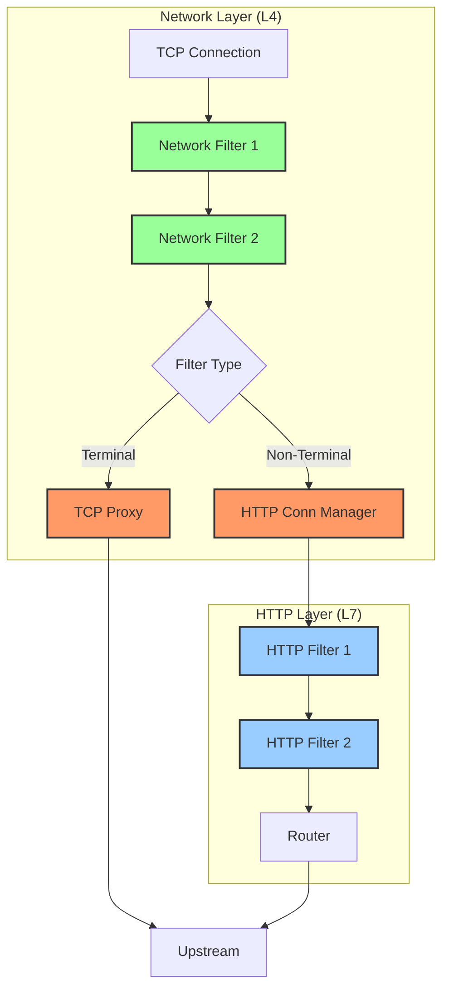

# Network Filter Development Guide

This guide covers developing TCP/network-layer filters for Envoy, which operate below the HTTP layer and are protocol-agnostic.

## Table of Contents

- [Introduction](#introduction)
- [Filter Interfaces](#filter-interfaces)
- [Filter Lifecycle](#filter-lifecycle)
- [Configuration and Factory](#configuration-and-factory)
- [Common Patterns](#common-patterns)
- [Testing](#testing)
- [Best Practices](#best-practices)
- [Examples](#examples)

## Introduction

Network filters operate at the TCP layer and process raw byte streams. They are protocol-agnostic and can be used for:
- Protocol detection and parsing (MongoDB, Redis, MySQL)
- TCP proxying and connection management
- Rate limiting at connection level
- Custom protocol implementation
- Traffic inspection and modification

### Network Filter vs HTTP Filter



## Filter Interfaces

Network filters are defined in `envoy/network/filter.h`.

### 1. ReadFilter

Processes inbound data from downstream.

```cpp
class ReadFilter {
public:
  virtual ~ReadFilter() = default;

  // Called when data is read from the connection
  virtual FilterStatus onData(Buffer::Instance& data, 
                               bool end_stream) PURE;

  // Called when a connection is first established
  virtual FilterStatus onNewConnection() PURE;

  // Initialize read filter callbacks
  virtual void initializeReadFilterCallbacks(
      ReadFilterCallbacks& callbacks) PURE;

  // Optional: Start upstream secure transport
  virtual bool startUpstreamSecureTransport() { return false; }
};
```

### 2. WriteFilter

Processes outbound data to downstream.

```cpp
class WriteFilter {
public:
  virtual ~WriteFilter() = default;

  // Called when data is to be written on the connection
  virtual FilterStatus onWrite(Buffer::Instance& data, 
                                bool end_stream) PURE;

  // Initialize write filter callbacks
  virtual void initializeWriteFilterCallbacks(
      WriteFilterCallbacks& callbacks) {}
};
```

### 3. Filter (Bidirectional)

Processes both read and write data.

```cpp
class Filter : public WriteFilter, public ReadFilter {
  // Inherits from both ReadFilter and WriteFilter
};
```

### FilterStatus Return Values

```cpp
enum class FilterStatus {
  // Continue to further filters
  Continue,
  
  // Stop executing further filters
  StopIteration
};
```

## Filter Lifecycle

### Lifecycle Flow

```mermaid
stateDiagram-v2
    [*] --> Created: Connection accepted
    Created --> Initialized: initializeReadFilterCallbacks()
    Initialized --> NewConnection: onNewConnection()
    
    state NewConnection {
        [*] --> Processing
        Processing --> Continue: FilterStatus::Continue
        Processing --> StopIteration: FilterStatus::StopIteration
        StopIteration --> Continue: continueReading()
        Continue --> [*]
    }
    
    NewConnection --> DataProcessing: Data arrives
    
    state DataProcessing {
        [*] --> OnData
        OnData --> ContinueRead: FilterStatus::Continue
        OnData --> StopRead: FilterStatus::StopIteration
        StopRead --> ContinueRead: continueReading()
        ContinueRead --> [*]
    }
    
    DataProcessing --> DataProcessing: More data
    DataProcessing --> WriteProcessing: Response data
    
    state WriteProcessing {
        [*] --> OnWrite
        OnWrite --> ContinueWrite: FilterStatus::Continue
        OnWrite --> StopWrite: FilterStatus::StopIteration
        ContinueWrite --> [*]
    }
    
    WriteProcessing --> Closed: Connection closed
    Closed --> [*]
```

### Execution Order

```cpp
// 1. Filter creation (when connection is accepted)
auto filter = std::make_shared<MyFilter>(config);

// 2. Initialize callbacks
filter->initializeReadFilterCallbacks(read_callbacks);
filter->initializeWriteFilterCallbacks(write_callbacks);

// 3. New connection event
FilterStatus status = filter->onNewConnection();
if (status == FilterStatus::StopIteration) {
  // Filter stopped iteration, waiting for async operation
  // Filter will call continueReading() when ready
}

// 4. Process incoming data
while (data_available) {
  FilterStatus status = filter->onData(buffer, end_stream);
  if (status == FilterStatus::StopIteration) {
    // Stop processing, filter is buffering or waiting
    break;
  }
}

// 5. Process outgoing data
FilterStatus status = filter->onWrite(response_buffer, end_stream);

// 6. Connection closes, filter is destroyed
filter.reset();
```

## Filter Callbacks

### ReadFilterCallbacks

```cpp
class ReadFilterCallbacks : public virtual NetworkFilterCallbacks {
  // Continue reading after StopIteration
  virtual void continueReading() PURE;

  // Inject data directly to subsequent filters
  virtual void injectReadDataToFilterChain(Buffer::Instance& data,
                                            bool end_stream) PURE;

  // Upstream host management
  virtual Upstream::HostDescriptionConstSharedPtr upstreamHost() PURE;
  virtual void upstreamHost(
      Upstream::HostDescriptionConstSharedPtr host) PURE;

  // Start secure transport (TLS)
  virtual bool startUpstreamSecureTransport() PURE;

  // Control connection closure
  virtual void disableClose(bool disabled) PURE;
};
```

### WriteFilterCallbacks

```cpp
class WriteFilterCallbacks : public virtual NetworkFilterCallbacks {
  // Inject data to subsequent write filters
  virtual void injectWriteDataToFilterChain(Buffer::Instance& data,
                                             bool end_stream) PURE;

  // Control connection closure
  virtual void disableClose(bool disabled) PURE;
};
```

### NetworkFilterCallbacks (Common)

```cpp
class NetworkFilterCallbacks {
  // Get the connection
  virtual Connection& connection() PURE;

  // Get the socket
  virtual const ConnectionSocket& socket() PURE;
};
```

## Configuration and Factory

### Step 1: Define Proto Configuration

Create `envoy/extensions/filters/network/my_filter/v3/my_filter.proto`:

```protobuf
syntax = "proto3";

package envoy.extensions.filters.network.my_filter.v3;

import "google/protobuf/duration.proto";
import "udpa/annotations/status.proto";
import "validate/validate.proto";

option java_package = "io.envoyproxy.envoy.extensions.filters.network.my_filter.v3";
option java_outer_classname = "MyFilterProto";
option java_multiple_files = true;

// [#protodoc-title: My Network Filter]
// [#extension: envoy.filters.network.my_filter]

message MyFilter {
  option (udpa.annotations.status).package_version_status = ACTIVE;

  // Connection timeout
  google.protobuf.Duration connection_timeout = 1 
      [(validate.rules).duration.gte = {seconds: 0}];

  // Maximum connections
  uint32 max_connections = 2 [(validate.rules).uint32.gte = 1];

  // Stat prefix
  string stat_prefix = 3 [(validate.rules).string.min_len = 1];
}
```

### Step 2: Implement Configuration Class

Create `source/extensions/filters/network/my_filter/config.h`:

```cpp
#pragma once

#include "envoy/extensions/filters/network/my_filter/v3/my_filter.pb.h"
#include "envoy/network/filter.h"

#include "source/common/common/logger.h"

namespace Envoy {
namespace Extensions {
namespace NetworkFilters {
namespace MyFilter {

// Stats macros
#define ALL_MY_FILTER_STATS(COUNTER, GAUGE, HISTOGRAM)  \
  COUNTER(connections_total)                             \
  COUNTER(connections_closed)                            \
  GAUGE(connections_active, Accumulate)                  \
  COUNTER(bytes_received)                                \
  COUNTER(bytes_sent)                                    \
  HISTOGRAM(connection_duration_ms, Milliseconds)

// Stats struct
struct MyFilterStats {
  ALL_MY_FILTER_STATS(GENERATE_COUNTER_STRUCT, GENERATE_GAUGE_STRUCT,
                       GENERATE_HISTOGRAM_STRUCT)
};

// Configuration
class Config : public Logger::Loggable<Logger::Id::filter> {
public:
  Config(const envoy::extensions::filters::network::my_filter::v3::MyFilter& config,
         Stats::Scope& scope);

  std::chrono::milliseconds connectionTimeout() const { 
    return connection_timeout_; 
  }
  uint32_t maxConnections() const { return max_connections_; }
  MyFilterStats& stats() { return stats_; }

private:
  const std::chrono::milliseconds connection_timeout_;
  const uint32_t max_connections_;
  MyFilterStats stats_;
};

using ConfigSharedPtr = std::shared_ptr<Config>;

} // namespace MyFilter
} // namespace NetworkFilters
} // namespace Extensions
} // namespace Envoy
```

### Step 3: Implement Filter Class

Create `source/extensions/filters/network/my_filter/my_filter.h`:

```cpp
#pragma once

#include "envoy/network/filter.h"
#include "envoy/event/timer.h"

#include "source/common/common/logger.h"
#include "source/extensions/filters/network/my_filter/config.h"

namespace Envoy {
namespace Extensions {
namespace NetworkFilters {
namespace MyFilter {

class MyFilter : public Network::Filter,
                 public Logger::Loggable<Logger::Id::filter> {
public:
  MyFilter(ConfigSharedPtr config, Event::Dispatcher& dispatcher);
  ~MyFilter() override;

  // Network::ReadFilter
  Network::FilterStatus onData(Buffer::Instance& data, 
                                bool end_stream) override;
  Network::FilterStatus onNewConnection() override;
  void initializeReadFilterCallbacks(
      Network::ReadFilterCallbacks& callbacks) override;

  // Network::WriteFilter
  Network::FilterStatus onWrite(Buffer::Instance& data, 
                                 bool end_stream) override;
  void initializeWriteFilterCallbacks(
      Network::WriteFilterCallbacks& callbacks) override;

private:
  // Helper methods
  void onTimeout();
  void closeConnection();
  Network::FilterStatus processData(Buffer::Instance& data);

  // Configuration
  const ConfigSharedPtr config_;
  Event::Dispatcher& dispatcher_;

  // Callbacks
  Network::ReadFilterCallbacks* read_callbacks_{nullptr};
  Network::WriteFilterCallbacks* write_callbacks_{nullptr};

  // State
  Event::TimerPtr timeout_timer_;
  TimeSource& time_source_;
  MonotonicTime connection_start_time_;
  uint64_t bytes_received_{0};
  uint64_t bytes_sent_{0};
};

} // namespace MyFilter
} // namespace NetworkFilters
} // namespace Extensions
} // namespace Envoy
```

### Step 4: Implement Factory

Create `source/extensions/filters/network/my_filter/config.h` (factory):

```cpp
#pragma once

#include "envoy/extensions/filters/network/my_filter/v3/my_filter.pb.h"
#include "envoy/server/filter_config.h"

namespace Envoy {
namespace Extensions {
namespace NetworkFilters {
namespace MyFilter {

class MyFilterConfigFactory
    : public Server::Configuration::NamedNetworkFilterConfigFactory {
public:
  // NamedNetworkFilterConfigFactory
  Network::FilterFactoryCb createFilterFactoryFromProto(
      const Protobuf::Message& proto_config,
      Server::Configuration::FactoryContext& context) override;

  ProtobufTypes::MessagePtr createEmptyConfigProto() override;

  std::string name() const override { 
    return "envoy.filters.network.my_filter"; 
  }
};

} // namespace MyFilter
} // namespace NetworkFilters
} // namespace Extensions
} // namespace Envoy
```

### Step 5: Implement Factory Methods

Create `source/extensions/filters/network/my_filter/config.cc`:

```cpp
#include "source/extensions/filters/network/my_filter/config.h"
#include "source/extensions/filters/network/my_filter/my_filter.h"

#include "envoy/registry/registry.h"
#include "envoy/server/filter_config.h"

namespace Envoy {
namespace Extensions {
namespace NetworkFilters {
namespace MyFilter {

Network::FilterFactoryCb MyFilterConfigFactory::createFilterFactoryFromProto(
    const Protobuf::Message& proto_config,
    Server::Configuration::FactoryContext& context) {

  const auto& config = MessageUtil::downcastAndValidate<
      const envoy::extensions::filters::network::my_filter::v3::MyFilter&>(
      proto_config, context.messageValidationVisitor());

  // Create shared configuration
  auto filter_config = std::make_shared<Config>(config, context.scope());

  // Return factory callback
  return [filter_config, &context](Network::FilterManager& filter_manager) -> void {
    // Create filter instance per connection
    filter_manager.addReadFilter(std::make_shared<MyFilter>(
        filter_config, context.mainThreadDispatcher()));
  };
}

ProtobufTypes::MessagePtr MyFilterConfigFactory::createEmptyConfigProto() {
  return std::make_unique<
      envoy::extensions::filters::network::my_filter::v3::MyFilter>();
}

// Register factory
REGISTER_FACTORY(MyFilterConfigFactory,
                 Server::Configuration::NamedNetworkFilterConfigFactory);

} // namespace MyFilter
} // namespace NetworkFilters
} // namespace Extensions
} // namespace Envoy
```

### Step 6: Implement Filter Logic

Create `source/extensions/filters/network/my_filter/my_filter.cc`:

```cpp
#include "source/extensions/filters/network/my_filter/my_filter.h"

namespace Envoy {
namespace Extensions {
namespace NetworkFilters {
namespace MyFilter {

MyFilter::MyFilter(ConfigSharedPtr config, Event::Dispatcher& dispatcher)
    : config_(std::move(config)), 
      dispatcher_(dispatcher),
      time_source_(dispatcher.timeSource()),
      connection_start_time_(time_source_.monotonicTime()) {
  
  config_->stats().connections_total_.inc();
  config_->stats().connections_active_.inc();
}

MyFilter::~MyFilter() {
  config_->stats().connections_active_.dec();
  config_->stats().connections_closed_.inc();

  // Record connection duration
  const auto duration = std::chrono::duration_cast<std::chrono::milliseconds>(
      time_source_.monotonicTime() - connection_start_time_);
  config_->stats().connection_duration_ms_.recordValue(duration.count());

  // Clean up timer
  if (timeout_timer_) {
    timeout_timer_->disableTimer();
  }
}

Network::FilterStatus MyFilter::onNewConnection() {
  ENVOY_LOG(debug, "New connection from {}",
            read_callbacks_->connection()
                .connectionInfoProvider()
                .remoteAddress()
                ->asString());

  // Start timeout timer if configured
  if (config_->connectionTimeout().count() > 0) {
    timeout_timer_ = dispatcher_.createTimer([this]() { onTimeout(); });
    timeout_timer_->enableTimer(config_->connectionTimeout());
  }

  return Network::FilterStatus::Continue;
}

Network::FilterStatus MyFilter::onData(Buffer::Instance& data, 
                                        bool end_stream) {
  const uint64_t num_bytes = data.length();
  bytes_received_ += num_bytes;
  config_->stats().bytes_received_.add(num_bytes);

  ENVOY_LOG(trace, "Received {} bytes, total: {}", 
            num_bytes, bytes_received_);

  // Process the data
  Network::FilterStatus status = processData(data);

  if (end_stream) {
    ENVOY_LOG(debug, "Connection end_stream, received {} total bytes",
              bytes_received_);
  }

  return status;
}

Network::FilterStatus MyFilter::processData(Buffer::Instance& data) {
  // Example: Simple echo protocol
  // In real filter, you would parse protocol, maintain state, etc.
  
  // Echo data back
  Buffer::OwnedImpl response;
  response.add(data);
  read_callbacks_->connection().write(response, false);

  return Network::FilterStatus::Continue;
}

Network::FilterStatus MyFilter::onWrite(Buffer::Instance& data,
                                         bool end_stream) {
  const uint64_t num_bytes = data.length();
  bytes_sent_ += num_bytes;
  config_->stats().bytes_sent_.add(num_bytes);

  ENVOY_LOG(trace, "Sending {} bytes, total: {}", 
            num_bytes, bytes_sent_);

  return Network::FilterStatus::Continue;
}

void MyFilter::initializeReadFilterCallbacks(
    Network::ReadFilterCallbacks& callbacks) {
  read_callbacks_ = &callbacks;
}

void MyFilter::initializeWriteFilterCallbacks(
    Network::WriteFilterCallbacks& callbacks) {
  write_callbacks_ = &callbacks;
}

void MyFilter::onTimeout() {
  ENVOY_LOG(warn, "Connection timeout after {}ms",
            config_->connectionTimeout().count());
  closeConnection();
}

void MyFilter::closeConnection() {
  read_callbacks_->connection().close(
      Network::ConnectionCloseType::NoFlush);
}

} // namespace MyFilter
} // namespace NetworkFilters
} // namespace Extensions
} // namespace Envoy
```

## Common Patterns

### Pattern 1: Protocol Detection

```cpp
Network::FilterStatus onData(Buffer::Instance& data, bool end_stream) {
  // Need minimum bytes to detect protocol
  if (data.length() < MIN_DETECTION_BYTES && !end_stream) {
    // Wait for more data
    return Network::FilterStatus::StopIteration;
  }

  // Peek at data without consuming
  const void* peek_data = data.linearize(MIN_DETECTION_BYTES);
  
  // Detect protocol
  if (isTLS(peek_data)) {
    ENVOY_LOG(debug, "Detected TLS protocol");
    setDynamicMetadata("protocol", "tls");
  } else if (isHTTP(peek_data)) {
    ENVOY_LOG(debug, "Detected HTTP protocol");
    setDynamicMetadata("protocol", "http");
  }

  // Continue to next filter
  read_callbacks_->continueReading();
  return Network::FilterStatus::Continue;
}
```

### Pattern 2: Connection Rate Limiting

```cpp
Network::FilterStatus onNewConnection() {
  // Check current connection count
  if (config_->stats().connections_active_.value() >= 
      config_->maxConnections()) {
    ENVOY_LOG(warn, "Connection limit reached, rejecting");
    config_->stats().connections_rejected_.inc();
    read_callbacks_->connection().close(
        Network::ConnectionCloseType::NoFlush);
    return Network::FilterStatus::StopIteration;
  }

  return Network::FilterStatus::Continue;
}
```

### Pattern 3: Protocol Parsing (Redis Example)

```cpp
Network::FilterStatus onData(Buffer::Instance& data, bool end_stream) {
  // Parse Redis protocol (RESP)
  while (data.length() > 0) {
    // Try to parse one command
    auto result = parser_.parse(data);
    
    if (result == ParseResult::NeedMoreData) {
      // Wait for more data
      return Network::FilterStatus::StopIteration;
    }
    
    if (result == ParseResult::Error) {
      ENVOY_LOG(error, "Protocol parse error");
      closeConnection();
      return Network::FilterStatus::StopIteration;
    }
    
    // Successfully parsed command
    processCommand(parser_.command());
  }

  return Network::FilterStatus::Continue;
}
```

### Pattern 4: TCP Proxy with Modification

```cpp
Network::FilterStatus onData(Buffer::Instance& data, bool end_stream) {
  // Modify data before proxying
  modifyBuffer(data);
  
  // Forward to upstream
  if (upstream_connection_) {
    upstream_connection_->write(data, end_stream);
  }

  return Network::FilterStatus::Continue;
}

void modifyBuffer(Buffer::Instance& data) {
  // Example: Replace specific byte sequence
  Buffer::OwnedImpl modified;
  
  // Read and modify data
  while (data.length() > 0) {
    uint8_t byte = data.peekInt<uint8_t>();
    data.drain(1);
    
    // Transform byte
    if (byte == OLD_MARKER) {
      modified.writeByte(NEW_MARKER);
    } else {
      modified.writeByte(byte);
    }
  }
  
  // Replace original with modified
  data.move(modified);
}
```

### Pattern 5: Async Operation

```cpp
Network::FilterStatus onNewConnection() {
  // Start async lookup
  client_->lookup(
      read_callbacks_->connection().connectionInfoProvider().remoteAddress(),
      [this](LookupResult result) {
        if (result.allowed) {
          ENVOY_LOG(debug, "Connection allowed");
          read_callbacks_->continueReading();
        } else {
          ENVOY_LOG(warn, "Connection denied");
          read_callbacks_->connection().close(
              Network::ConnectionCloseType::NoFlush);
        }
      });

  // Stop iteration until async operation completes
  return Network::FilterStatus::StopIteration;
}
```

## Testing

### Unit Test

Create `test/extensions/filters/network/my_filter/my_filter_test.cc`:

```cpp
#include "test/mocks/network/mocks.h"
#include "test/mocks/server/factory_context.h"
#include "test/test_common/utility.h"

#include "source/extensions/filters/network/my_filter/my_filter.h"

#include "gmock/gmock.h"
#include "gtest/gtest.h"

using testing::_;
using testing::NiceMock;
using testing::Return;

namespace Envoy {
namespace Extensions {
namespace NetworkFilters {
namespace MyFilter {
namespace {

class MyFilterTest : public testing::Test {
protected:
  void SetUp() override {
    envoy::extensions::filters::network::my_filter::v3::MyFilter config;
    config.set_stat_prefix("test");
    config.mutable_connection_timeout()->set_seconds(30);
    config.set_max_connections(100);

    config_ = std::make_shared<Config>(config, factory_context_.scope());
    filter_ = std::make_shared<MyFilter>(config_, dispatcher_);
    filter_->initializeReadFilterCallbacks(read_callbacks_);
    filter_->initializeWriteFilterCallbacks(write_callbacks_);

    EXPECT_CALL(read_callbacks_, connection())
        .WillRepeatedly(ReturnRef(connection_));
  }

  NiceMock<Server::Configuration::MockFactoryContext> factory_context_;
  NiceMock<Event::MockDispatcher> dispatcher_;
  NiceMock<Network::MockReadFilterCallbacks> read_callbacks_;
  NiceMock<Network::MockWriteFilterCallbacks> write_callbacks_;
  NiceMock<Network::MockConnection> connection_;
  ConfigSharedPtr config_;
  std::shared_ptr<MyFilter> filter_;
};

TEST_F(MyFilterTest, NewConnection) {
  EXPECT_EQ(Network::FilterStatus::Continue, 
            filter_->onNewConnection());
  EXPECT_EQ(1, config_->stats().connections_total_.value());
  EXPECT_EQ(1, config_->stats().connections_active_.value());
}

TEST_F(MyFilterTest, ProcessData) {
  filter_->onNewConnection();

  Buffer::OwnedImpl data("test data");
  EXPECT_EQ(Network::FilterStatus::Continue,
            filter_->onData(data, false));

  EXPECT_EQ(9, config_->stats().bytes_received_.value());
}

TEST_F(MyFilterTest, ConnectionTimeout) {
  Event::MockTimer* timeout_timer = new Event::MockTimer(&dispatcher_);
  EXPECT_CALL(dispatcher_, createTimer(_))
      .WillOnce(Invoke([timeout_timer](Event::TimerCb cb) {
        timeout_timer->callback_ = cb;
        return timeout_timer;
      }));

  EXPECT_CALL(*timeout_timer, enableTimer(_, _));
  filter_->onNewConnection();

  // Trigger timeout
  EXPECT_CALL(connection_, close(Network::ConnectionCloseType::NoFlush));
  timeout_timer->invokeCallback();
}

TEST_F(MyFilterTest, EndStream) {
  filter_->onNewConnection();

  Buffer::OwnedImpl data("final data");
  EXPECT_EQ(Network::FilterStatus::Continue,
            filter_->onData(data, true));  // end_stream = true
}

} // namespace
} // namespace MyFilter
} // namespace NetworkFilters
} // namespace Extensions
} // namespace Envoy
```

### Integration Test

```cpp
#include "test/integration/integration.h"

namespace Envoy {
namespace {

class MyFilterIntegrationTest
    : public testing::TestWithParam<Network::Address::IpVersion>,
      public BaseIntegrationTest {
public:
  MyFilterIntegrationTest()
      : BaseIntegrationTest(GetParam(), ConfigHelper::baseConfig()) {}

  void initialize() override {
    config_helper_.addNetworkFilter(R"EOF(
      name: envoy.filters.network.my_filter
      typed_config:
        "@type": type.googleapis.com/envoy.extensions.filters.network.my_filter.v3.MyFilter
        stat_prefix: test
        connection_timeout: 30s
        max_connections: 100
    )EOF");
    BaseIntegrationTest::initialize();
  }
};

INSTANTIATE_TEST_SUITE_P(IpVersions, MyFilterIntegrationTest,
                         testing::ValuesIn(TestEnvironment::getIpVersionsForTest()));

TEST_P(MyFilterIntegrationTest, BasicFlow) {
  initialize();

  IntegrationTcpClientPtr tcp_client = 
      makeTcpConnection(lookupPort("listener_0"));
  
  ASSERT_TRUE(tcp_client->write("test data"));
  tcp_client->waitForData("test data");  // Echo
  
  tcp_client->close();
  ASSERT_TRUE(tcp_client->waitForDisconnect());
}

} // namespace
} // namespace Envoy
```

## Best Practices

### 1. Performance
- Minimize data copies - use move semantics
- Avoid buffering when possible
- Process data incrementally
- Use efficient parsing techniques

### 2. State Management
- Clean up state on connection close
- Handle half-closed connections
- Be careful with buffer ownership

### 3. Error Handling
- Validate protocol compliance
- Handle malformed data gracefully
- Close connections on unrecoverable errors
- Log errors with context

### 4. Resource Management
- Cancel timers in destructor
- Release buffer memory
- Clean up upstream connections

## Examples

### Real-World Examples in Codebase

| Filter | Purpose | Complexity |
|--------|---------|-----------|
| `echo` | Simple echo server | Very Simple |
| `tcp_proxy` | TCP proxying | Medium |
| `mongo_proxy` | MongoDB protocol | Complex |
| `redis_proxy` | Redis protocol | Complex |
| `http_connection_manager` | HTTP protocol | Very Complex |

### Recommended Reading Order

1. `source/extensions/filters/network/echo/` - Simplest example
2. `source/extensions/filters/network/connection_limit/` - Connection management
3. `source/extensions/filters/network/local_ratelimit/` - Rate limiting
4. `source/extensions/filters/network/tcp_proxy/` - Terminal filter
5. `source/extensions/filters/network/mongo_proxy/` - Protocol parsing

## Next Steps

- **[04-listener-filter-development.md](04-listener-filter-development.md)** - Listener filter guide
- **[05-extension-registration.md](05-extension-registration.md)** - Build and registration

---

*Last Updated: 2026-04-26*  
*Envoy Version: Latest (4.x)*
