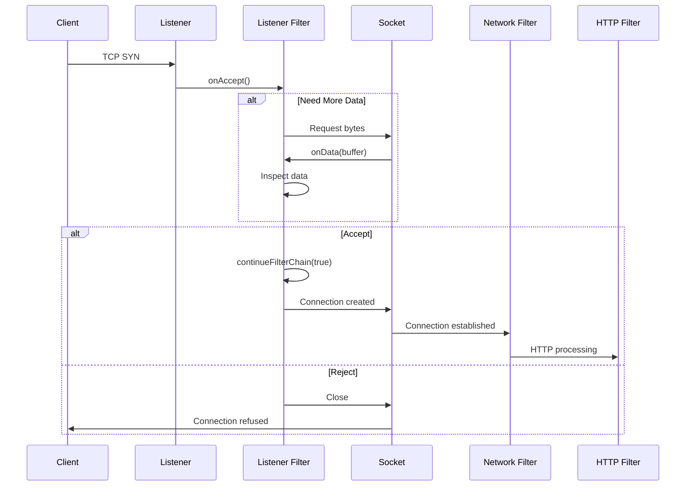
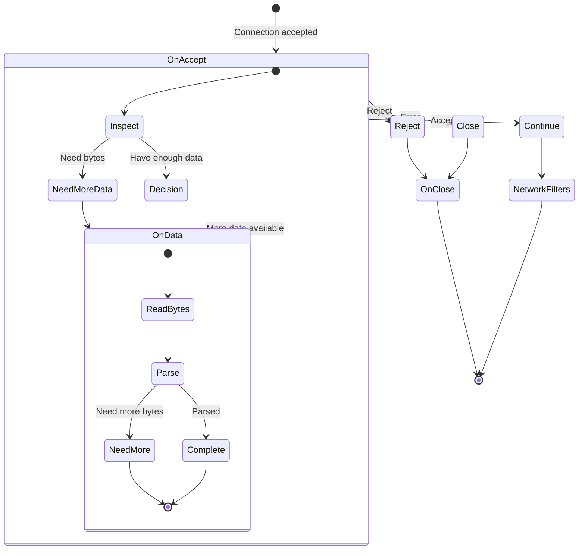

# Listener Filter Development Guide

This guide covers developing listener filters for Envoy, which run before connection creation and can inspect initial data to make decisions about connection handling.

## Table of Contents

- [Introduction](#introduction)
- [Filter Interfaces](#filter-interfaces)
- [Filter Lifecycle](#filter-lifecycle)
- [Configuration and Factory](#configuration-and-factory)
- [Common Patterns](#common-patterns)
- [Testing](#testing)
- [Best Practices](#best-practices)
- [Examples](#examples)

## Introduction

Listener filters operate at the earliest stage of connection processing, before a full connection is established. They can:
- Inspect TLS ClientHello for SNI/ALPN
- Detect protocols (HTTP, TLS, custom protocols)
- Recover original destination addresses
- Parse proxy protocol headers
- Make early accept/reject decisions
- Set metadata for use by later filters

### Listener Filter Position



## Filter Interfaces

Listener filters are defined in `envoy/network/filter.h`.

### ListenerFilter

TCP listener filter interface.

```cpp
class ListenerFilter {
public:
  virtual ~ListenerFilter() = default;

  // Called when a new connection is accepted
  virtual FilterStatus onAccept(ListenerFilterCallbacks& cb) PURE;

  // Called when data is available for inspection
  virtual FilterStatus onData(Network::ListenerFilterBuffer& buffer) PURE;

  // Called when the connection is closed
  virtual void onClose() {};

  // Maximum number of bytes the filter wants to inspect
  virtual size_t maxReadBytes() const PURE;
};
```

### QuicListenerFilter

QUIC-specific listener filter interface.

```cpp
class QuicListenerFilter {
public:
  virtual ~QuicListenerFilter() = default;

  // Called when a new QUIC connection is accepted
  virtual FilterStatus onAccept(ListenerFilterCallbacks& cb) PURE;

  // Check compatibility with server preferred address
  virtual bool isCompatibleWithServerPreferredAddress(
      const quiche::QuicheSocketAddress& server_preferred_address) const PURE;

  // Called when peer address changes (connection migration)
  virtual FilterStatus onPeerAddressChanged(
      const quiche::QuicheSocketAddress& new_address,
      Connection& connection) PURE;

  // Called when first packet is received
  virtual FilterStatus onFirstPacketReceived(
      const quic::QuicReceivedPacket& packet) PURE;
};
```

### FilterStatus

```cpp
enum class FilterStatus {
  // Continue to next filter
  Continue,
  
  // Stop iteration (waiting for more data or async operation)
  StopIteration
};
```

### ListenerFilterCallbacks

```cpp
class ListenerFilterCallbacks {
  // Get the socket being processed
  virtual ConnectionSocket& socket() PURE;

  // Set dynamic metadata
  virtual void setDynamicMetadata(
      const std::string& name, 
      const Protobuf::Struct& value) PURE;
  virtual void setDynamicTypedMetadata(
      const std::string& name,
      const Protobuf::Any& value) PURE;

  // Access dynamic metadata
  virtual envoy::config::core::v3::Metadata& dynamicMetadata() PURE;
  virtual const envoy::config::core::v3::Metadata& dynamicMetadata() const PURE;

  // Access filter state
  virtual StreamInfo::FilterState& filterState() PURE;

  // Get dispatcher
  virtual Event::Dispatcher& dispatcher() PURE;

  // Continue filter chain
  virtual void continueFilterChain(bool success) PURE;

  // Set use original destination
  virtual void useOriginalDst(bool use_original_dst) PURE;

  // Get stream info
  virtual StreamInfo::StreamInfo& streamInfo() PURE;
};
```

## Filter Lifecycle

### Lifecycle Flow



### Execution Order

```cpp
// 1. Connection accepted by listener
// Listener filter is created

// 2. onAccept() is called immediately
FilterStatus status = filter->onAccept(callbacks);

if (status == FilterStatus::Continue) {
  // Filter is done, continue to next filter or create connection
  callbacks.continueFilterChain(true);
} else {
  // Filter needs data
  size_t max_bytes = filter->maxReadBytes();
  
  // Read initial data (up to maxReadBytes)
  if (data_available) {
    // 3. onData() is called when data arrives
    status = filter->onData(buffer);
    
    if (status == FilterStatus::Continue) {
      // Filter is done
      callbacks.continueFilterChain(true);
    }
  }
}

// 4. If connection is closed before completion
filter->onClose();

// 5. Filter is destroyed
delete filter;
```

## Configuration and Factory

### Step 1: Define Proto Configuration

Create `envoy/extensions/filters/listener/my_filter/v3/my_filter.proto`:

```protobuf
syntax = "proto3";

package envoy.extensions.filters.listener.my_filter.v3;

import "udpa/annotations/status.proto";
import "validate/validate.proto";

option java_package = "io.envoyproxy.envoy.extensions.filters.listener.my_filter.v3";
option java_outer_classname = "MyFilterProto";
option java_multiple_files = true;

// [#protodoc-title: My Listener Filter]
// [#extension: envoy.filters.listener.my_filter]

message MyListenerFilter {
  option (udpa.annotations.status).package_version_status = ACTIVE;

  // Maximum bytes to read for inspection
  uint32 max_read_bytes = 1 [(validate.rules).uint32 = {
    gte: 1
    lte: 65536
  }];

  // Enable detailed logging
  bool debug_logging = 2;
}
```

### Step 2: Implement Configuration Class

Create `source/extensions/filters/listener/my_filter/config.h`:

```cpp
#pragma once

#include "envoy/extensions/filters/listener/my_filter/v3/my_filter.pb.h"
#include "envoy/stats/scope.h"

namespace Envoy {
namespace Extensions {
namespace ListenerFilters {
namespace MyFilter {

// Stats
#define ALL_MY_FILTER_STATS(COUNTER)  \
  COUNTER(connections_inspected)       \
  COUNTER(protocol_detected)           \
  COUNTER(protocol_unknown)            \
  COUNTER(errors)

struct MyFilterStats {
  ALL_MY_FILTER_STATS(GENERATE_COUNTER_STRUCT)
};

// Configuration
class Config {
public:
  Config(
      const envoy::extensions::filters::listener::my_filter::v3::MyListenerFilter& config,
      Stats::Scope& scope);

  uint32_t maxReadBytes() const { return max_read_bytes_; }
  bool debugLogging() const { return debug_logging_; }
  MyFilterStats& stats() { return stats_; }

private:
  const uint32_t max_read_bytes_;
  const bool debug_logging_;
  MyFilterStats stats_;
};

using ConfigSharedPtr = std::shared_ptr<Config>;

} // namespace MyFilter
} // namespace ListenerFilters
} // namespace Extensions
} // namespace Envoy
```

### Step 3: Implement Filter Class

Create `source/extensions/filters/listener/my_filter/my_filter.h`:

```cpp
#pragma once

#include "envoy/network/filter.h"

#include "source/common/common/logger.h"
#include "source/extensions/filters/listener/my_filter/config.h"

namespace Envoy {
namespace Extensions {
namespace ListenerFilters {
namespace MyFilter {

class MyListenerFilter : public Network::ListenerFilter,
                         public Logger::Loggable<Logger::Id::filter> {
public:
  MyListenerFilter(ConfigSharedPtr config);

  // Network::ListenerFilter
  Network::FilterStatus onAccept(
      Network::ListenerFilterCallbacks& cb) override;
  Network::FilterStatus onData(
      Network::ListenerFilterBuffer& buffer) override;
  void onClose() override;
  size_t maxReadBytes() const override;

private:
  // Helper methods
  enum class Protocol {
    Unknown,
    TLS,
    HTTP,
    CustomProtocol
  };

  Protocol detectProtocol(const uint8_t* data, size_t len);
  void setMetadata(Protocol protocol);

  // Configuration
  const ConfigSharedPtr config_;

  // State
  Network::ListenerFilterCallbacks* cb_{nullptr};
  uint64_t bytes_processed_{0};
  bool done_{false};
};

} // namespace MyFilter
} // namespace ListenerFilters
} // namespace Extensions
} // namespace Envoy
```

### Step 4: Implement Factory

Create `source/extensions/filters/listener/my_filter/config.h` (factory):

```cpp
#pragma once

#include "envoy/extensions/filters/listener/my_filter/v3/my_filter.pb.h"
#include "envoy/server/filter_config.h"

namespace Envoy {
namespace Extensions {
namespace ListenerFilters {
namespace MyFilter {

class MyListenerFilterConfigFactory
    : public Server::Configuration::NamedListenerFilterConfigFactory {
public:
  // NamedListenerFilterConfigFactory
  Network::ListenerFilterFactoryCb createListenerFilterFactoryFromProto(
      const Protobuf::Message& message,
      const Network::ListenerFilterMatcherSharedPtr& listener_filter_matcher,
      Server::Configuration::ListenerFactoryContext& context) override;

  ProtobufTypes::MessagePtr createEmptyConfigProto() override;

  std::string name() const override {
    return "envoy.filters.listener.my_filter";
  }
};

} // namespace MyFilter
} // namespace ListenerFilters
} // namespace Extensions
} // namespace Envoy
```

### Step 5: Implement Factory Methods

Create `source/extensions/filters/listener/my_filter/config.cc`:

```cpp
#include "source/extensions/filters/listener/my_filter/config.h"
#include "source/extensions/filters/listener/my_filter/my_filter.h"

#include "envoy/registry/registry.h"
#include "envoy/server/filter_config.h"

namespace Envoy {
namespace Extensions {
namespace ListenerFilters {
namespace MyFilter {

Network::ListenerFilterFactoryCb
MyListenerFilterConfigFactory::createListenerFilterFactoryFromProto(
    const Protobuf::Message& message,
    const Network::ListenerFilterMatcherSharedPtr&,
    Server::Configuration::ListenerFactoryContext& context) {

  const auto& proto_config = MessageUtil::downcastAndValidate<
      const envoy::extensions::filters::listener::my_filter::v3::MyListenerFilter&>(
      message, context.messageValidationVisitor());

  // Create shared config
  auto config = std::make_shared<Config>(proto_config, context.scope());

  // Return factory callback
  return [config](Network::ListenerFilterManager& filter_manager) -> void {
    filter_manager.addAcceptFilter(
        nullptr,  // matcher
        std::make_unique<MyListenerFilter>(config));
  };
}

ProtobufTypes::MessagePtr
MyListenerFilterConfigFactory::createEmptyConfigProto() {
  return std::make_unique<
      envoy::extensions::filters::listener::my_filter::v3::MyListenerFilter>();
}

// Register factory
REGISTER_FACTORY(MyListenerFilterConfigFactory,
                 Server::Configuration::NamedListenerFilterConfigFactory);

} // namespace MyFilter
} // namespace ListenerFilters
} // namespace Extensions
} // namespace Envoy
```

### Step 6: Implement Filter Logic

Create `source/extensions/filters/listener/my_filter/my_filter.cc`:

```cpp
#include "source/extensions/filters/listener/my_filter/my_filter.h"

namespace Envoy {
namespace Extensions {
namespace ListenerFilters {
namespace MyFilter {

MyListenerFilter::MyListenerFilter(ConfigSharedPtr config)
    : config_(std::move(config)) {
  config_->stats().connections_inspected_.inc();
}

Network::FilterStatus MyListenerFilter::onAccept(
    Network::ListenerFilterCallbacks& cb) {
  cb_ = &cb;

  ENVOY_LOG(debug, "Inspecting new connection from {}",
            cb_->socket().connectionInfoProvider().remoteAddress()->asString());

  // Return StopIteration to request data
  return Network::FilterStatus::StopIteration;
}

Network::FilterStatus MyListenerFilter::onData(
    Network::ListenerFilterBuffer& buffer) {
  if (done_) {
    return Network::FilterStatus::Continue;
  }

  // Get available data
  const size_t len = std::min(buffer.rawSlice().len_, 
                               config_->maxReadBytes() - bytes_processed_);
  if (len == 0) {
    done_ = true;
    cb_->continueFilterChain(true);
    return Network::FilterStatus::Continue;
  }

  const uint8_t* data = static_cast<const uint8_t*>(buffer.rawSlice().mem_);
  bytes_processed_ += len;

  if (config_->debugLogging()) {
    ENVOY_LOG(debug, "Processing {} bytes (total: {})", 
              len, bytes_processed_);
  }

  // Detect protocol
  Protocol protocol = detectProtocol(data, len);

  if (protocol != Protocol::Unknown) {
    // Protocol detected
    setMetadata(protocol);
    config_->stats().protocol_detected_.inc();
    done_ = true;
    cb_->continueFilterChain(true);
    return Network::FilterStatus::Continue;
  }

  // Need more data or reached limit
  if (bytes_processed_ >= config_->maxReadBytes()) {
    ENVOY_LOG(warn, "Could not detect protocol after {} bytes",
              bytes_processed_);
    config_->stats().protocol_unknown_.inc();
    done_ = true;
    cb_->continueFilterChain(true);
    return Network::FilterStatus::Continue;
  }

  // Need more data
  return Network::FilterStatus::StopIteration;
}

void MyListenerFilter::onClose() {
  if (!done_) {
    ENVOY_LOG(debug, "Connection closed before protocol detection");
  }
}

size_t MyListenerFilter::maxReadBytes() const {
  return config_->maxReadBytes() - bytes_processed_;
}

MyListenerFilter::Protocol MyListenerFilter::detectProtocol(
    const uint8_t* data, size_t len) {
  
  if (len < 3) {
    return Protocol::Unknown;
  }

  // Check for TLS ClientHello
  if (data[0] == 0x16 && data[1] == 0x03 && 
      (data[2] >= 0x01 && data[2] <= 0x04)) {
    ENVOY_LOG(debug, "Detected TLS protocol");
    return Protocol::TLS;
  }

  // Check for HTTP
  if (len >= 4) {
    if (memcmp(data, "GET ", 4) == 0 ||
        memcmp(data, "POST", 4) == 0 ||
        memcmp(data, "PUT ", 4) == 0 ||
        memcmp(data, "HEAD", 4) == 0) {
      ENVOY_LOG(debug, "Detected HTTP protocol");
      return Protocol::HTTP;
    }
  }

  // Check for custom protocol
  if (data[0] == 0xCA && data[1] == 0xFE) {
    ENVOY_LOG(debug, "Detected custom protocol");
    return Protocol::CustomProtocol;
  }

  return Protocol::Unknown;
}

void MyListenerFilter::setMetadata(Protocol protocol) {
  // Set dynamic metadata for use by network filters
  ProtobufWkt::Struct metadata;
  auto* fields = metadata.mutable_fields();

  switch (protocol) {
  case Protocol::TLS:
    (*fields)["protocol"] = ValueUtil::stringValue("tls");
    break;
  case Protocol::HTTP:
    (*fields)["protocol"] = ValueUtil::stringValue("http");
    break;
  case Protocol::CustomProtocol:
    (*fields)["protocol"] = ValueUtil::stringValue("custom");
    break;
  default:
    (*fields)["protocol"] = ValueUtil::stringValue("unknown");
  }

  cb_->setDynamicMetadata("envoy.filters.listener.my_filter", metadata);
}

} // namespace MyFilter
} // namespace ListenerFilters
} // namespace Extensions
} // namespace Envoy
```

## Common Patterns

### Pattern 1: TLS SNI Inspection

```cpp
// Simplified TLS inspector pattern
Network::FilterStatus onData(Network::ListenerFilterBuffer& buffer) {
  // Need at least TLS record header (5 bytes)
  if (buffer.rawSlice().len_ < 5) {
    return Network::FilterStatus::StopIteration;
  }

  const uint8_t* data = static_cast<const uint8_t*>(buffer.rawSlice().mem_);
  
  // Check if TLS ClientHello
  if (data[0] != 0x16 || data[1] != 0x03) {
    cb_->continueFilterChain(true);
    return Network::FilterStatus::Continue;
  }

  // Parse ClientHello to extract SNI
  std::string sni = parseSNI(data, buffer.rawSlice().len_);
  
  if (!sni.empty()) {
    // Set SNI in socket options
    cb_->socket().setRequestedServerName(sni);
    
    // Set metadata
    ProtobufWkt::Struct metadata;
    (*metadata.mutable_fields())["sni"] = ValueUtil::stringValue(sni);
    cb_->setDynamicMetadata("envoy.filters.listener.tls_inspector", metadata);
  }

  cb_->continueFilterChain(true);
  return Network::FilterStatus::Continue;
}
```

### Pattern 2: Original Destination Recovery

```cpp
Network::FilterStatus onAccept(Network::ListenerFilterCallbacks& cb) {
  cb_ = &cb;

  // Get original destination from socket options (iptables REDIRECT/TPROXY)
  Network::Address::InstanceConstSharedPtr original_dst =
      cb_->socket().addressProvider().localAddress();

  if (original_dst) {
    // Set original destination for routing
    cb_->socket().connectionInfoProvider().restoreLocalAddress(original_dst);
    
    ENVOY_LOG(debug, "Recovered original destination: {}",
              original_dst->asString());
  }

  cb_->continueFilterChain(true);
  return Network::FilterStatus::Continue;
}
```

### Pattern 3: Proxy Protocol Parsing

```cpp
Network::FilterStatus onData(Network::ListenerFilterBuffer& buffer) {
  // Parse PROXY protocol v1 header
  // Format: "PROXY TCP4 192.168.1.1 10.0.0.1 12345 80\r\n"
  
  const char* data = static_cast<const char*>(buffer.rawSlice().mem_);
  size_t len = buffer.rawSlice().len_;

  // Look for end of header
  const char* end = static_cast<const char*>(memchr(data, '\n', len));
  if (!end) {
    // Need more data
    return Network::FilterStatus::StopIteration;
  }

  // Parse header
  ProxyProtocolHeader header;
  if (!parseProxyProtocol(data, end - data, header)) {
    ENVOY_LOG(error, "Invalid PROXY protocol header");
    cb_->socket().close();
    cb_->continueFilterChain(false);
    return Network::FilterStatus::StopIteration;
  }

  // Set source address
  cb_->socket().connectionInfoProvider().restoreLocalAddress(
      header.local_address);
  cb_->socket().connectionInfoProvider().setRemoteAddress(
      header.remote_address);

  // Drain PROXY protocol header from buffer
  buffer.drain(end - data + 1);

  cb_->continueFilterChain(true);
  return Network::FilterStatus::Continue;
}
```

### Pattern 4: Early Connection Rejection

```cpp
Network::FilterStatus onAccept(Network::ListenerFilterCallbacks& cb) {
  cb_ = &cb;

  // Check if source IP is blocked
  const auto& remote_addr = 
      cb_->socket().connectionInfoProvider().remoteAddress();

  if (isBlocked(remote_addr)) {
    ENVOY_LOG(warn, "Rejecting connection from blocked IP: {}",
              remote_addr->asString());
    
    stats_.connections_blocked_.inc();
    
    // Close connection
    cb_->socket().close();
    cb_->continueFilterChain(false);
    return Network::FilterStatus::StopIteration;
  }

  cb_->continueFilterChain(true);
  return Network::FilterStatus::Continue;
}
```

### Pattern 5: Dynamic Routing Based on Inspection

```cpp
Network::FilterStatus onData(Network::ListenerFilterBuffer& buffer) {
  // Inspect data to determine routing
  const uint8_t* data = static_cast<const uint8_t*>(buffer.rawSlice().mem_);
  size_t len = buffer.rawSlice().len_;

  if (len < 10) {
    return Network::FilterStatus::StopIteration;
  }

  // Parse custom protocol header
  uint32_t tenant_id = parseUint32(data);
  uint16_t version = parseUint16(data + 4);

  // Set filter state for routing decisions
  cb_->filterState().setData(
      "tenant_id",
      std::make_unique<StreamInfo::UInt32Accessor>(tenant_id),
      StreamInfo::FilterState::StateType::ReadOnly);

  cb_->filterState().setData(
      "protocol_version",
      std::make_unique<StreamInfo::UInt32Accessor>(version),
      StreamInfo::FilterState::StateType::ReadOnly);

  // Set metadata
  ProtobufWkt::Struct metadata;
  (*metadata.mutable_fields())["tenant_id"] = ValueUtil::numberValue(tenant_id);
  (*metadata.mutable_fields())["version"] = ValueUtil::numberValue(version);
  cb_->setDynamicMetadata("envoy.filters.listener.my_filter", metadata);

  cb_->continueFilterChain(true);
  return Network::FilterStatus::Continue;
}
```

## Testing

### Unit Test

Create `test/extensions/filters/listener/my_filter/my_filter_test.cc`:

```cpp
#include "test/mocks/network/mocks.h"
#include "test/test_common/utility.h"

#include "source/extensions/filters/listener/my_filter/my_filter.h"

#include "gmock/gmock.h"
#include "gtest/gtest.h"

using testing::_;
using testing::NiceMock;
using testing::Return;

namespace Envoy {
namespace Extensions {
namespace ListenerFilters {
namespace MyFilter {
namespace {

class MyListenerFilterTest : public testing::Test {
protected:
  void SetUp() override {
    envoy::extensions::filters::listener::my_filter::v3::MyListenerFilter config;
    config.set_max_read_bytes(1024);
    config.set_debug_logging(true);

    config_ = std::make_shared<Config>(config, server_factory_context_.scope());
    filter_ = std::make_unique<MyListenerFilter>(config_);
  }

  NiceMock<Server::Configuration::MockServerFactoryContext> server_factory_context_;
  NiceMock<Network::MockListenerFilterCallbacks> callbacks_;
  NiceMock<Network::MockConnectionSocket> socket_;
  ConfigSharedPtr config_;
  std::unique_ptr<MyListenerFilter> filter_;
};

TEST_F(MyListenerFilterTest, DetectsTLS) {
  EXPECT_CALL(callbacks_, socket()).WillRepeatedly(ReturnRef(socket_));
  
  // onAccept returns StopIteration to request data
  EXPECT_EQ(Network::FilterStatus::StopIteration,
            filter_->onAccept(callbacks_));

  // Provide TLS ClientHello data
  uint8_t tls_data[] = {0x16, 0x03, 0x01, 0x00, 0x05};
  Buffer::RawSlice slice{tls_data, sizeof(tls_data)};
  Network::MockListenerFilterBuffer buffer;
  EXPECT_CALL(buffer, rawSlice()).WillOnce(Return(slice));

  EXPECT_CALL(callbacks_, continueFilterChain(true));
  EXPECT_EQ(Network::FilterStatus::Continue,
            filter_->onData(buffer));

  EXPECT_EQ(1, config_->stats().protocol_detected_.value());
}

TEST_F(MyListenerFilterTest, DetectsHTTP) {
  EXPECT_CALL(callbacks_, socket()).WillRepeatedly(ReturnRef(socket_));
  
  EXPECT_EQ(Network::FilterStatus::StopIteration,
            filter_->onAccept(callbacks_));

  // Provide HTTP request data
  const char* http_data = "GET / HTTP/1.1\r\n";
  Buffer::RawSlice slice{const_cast<char*>(http_data), strlen(http_data)};
  Network::MockListenerFilterBuffer buffer;
  EXPECT_CALL(buffer, rawSlice()).WillOnce(Return(slice));

  EXPECT_CALL(callbacks_, continueFilterChain(true));
  EXPECT_EQ(Network::FilterStatus::Continue,
            filter_->onData(buffer));

  EXPECT_EQ(1, config_->stats().protocol_detected_.value());
}

TEST_F(MyListenerFilterTest, UnknownProtocol) {
  EXPECT_CALL(callbacks_, socket()).WillRepeatedly(ReturnRef(socket_));
  
  EXPECT_EQ(Network::FilterStatus::StopIteration,
            filter_->onAccept(callbacks_));

  // Provide unknown data up to max bytes
  std::vector<uint8_t> unknown_data(1024, 0xFF);
  Buffer::RawSlice slice{unknown_data.data(), unknown_data.size()};
  Network::MockListenerFilterBuffer buffer;
  EXPECT_CALL(buffer, rawSlice()).WillRepeatedly(Return(slice));

  EXPECT_CALL(callbacks_, continueFilterChain(true));
  EXPECT_EQ(Network::FilterStatus::Continue,
            filter_->onData(buffer));

  EXPECT_EQ(1, config_->stats().protocol_unknown_.value());
}

} // namespace
} // namespace MyFilter
} // namespace ListenerFilters
} // namespace Extensions
} // namespace Envoy
```

## Best Practices

### 1. Keep It Fast
- Listener filters run on the accept path
- Minimize processing time
- Only request necessary data
- Return quickly

### 2. Limit Data Inspection
- Set reasonable maxReadBytes()
- Don't buffer indefinitely
- Handle cases where protocol can't be detected

### 3. Error Handling
- Handle malformed data gracefully
- Close connections on errors
- Don't crash the listener

### 4. Metadata and State
- Use dynamic metadata to pass info to network/HTTP filters
- Use filter state for structured data
- Document metadata keys

## Examples

### Real-World Examples in Codebase

| Filter | Purpose | Complexity |
|--------|---------|-----------|
| `original_dst` | Original destination recovery | Simple |
| `proxy_protocol` | Parse PROXY protocol | Medium |
| `http_inspector` | Detect HTTP protocol | Medium |
| `tls_inspector` | Parse TLS ClientHello, extract SNI/ALPN | Complex |

### Recommended Reading Order

1. `source/extensions/filters/listener/original_dst/` - Simplest example
2. `source/extensions/filters/listener/proxy_protocol/` - Protocol parsing
3. `source/extensions/filters/listener/http_inspector/` - Protocol detection
4. `source/extensions/filters/listener/tls_inspector/` - Complex TLS parsing

## Next Steps

- **[05-extension-registration.md](05-extension-registration.md)** - Build system and registration
- **[02-http-filter-development.md](02-http-filter-development.md)** - HTTP filter guide
- **[03-network-filter-development.md](03-network-filter-development.md)** - Network filter guide

---

*Last Updated: 2026-04-26*  
*Envoy Version: Latest (4.x)*
