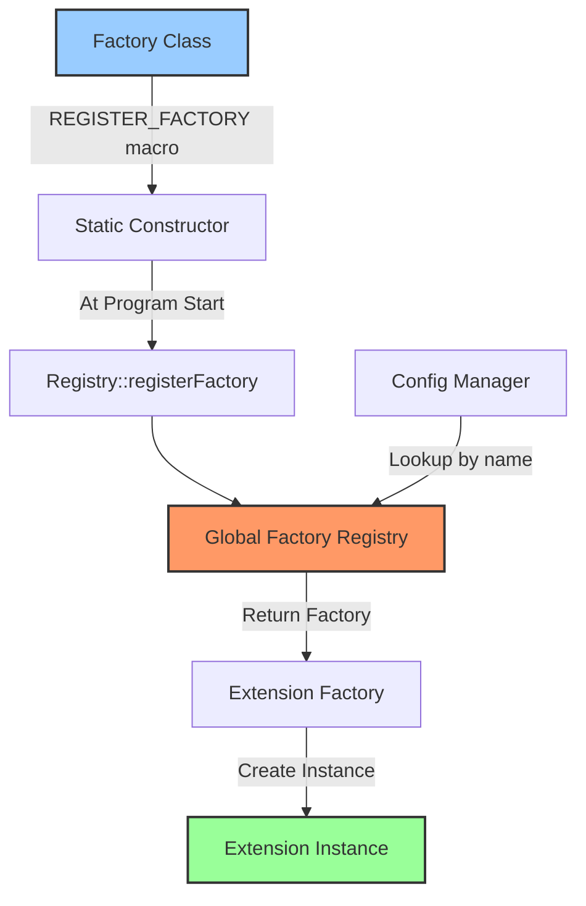

# Extension Registration and Build Integration

This guide covers how to register extensions with Envoy and integrate them into the Bazel build system.

## Table of Contents

- [Introduction](#introduction)
- [Extension Registry](#extension-registry)
- [Build System Integration](#build-system-integration)
- [Protocol Buffer Setup](#protocol-buffer-setup)
- [Static vs Dynamic Registration](#static-vs-dynamic-registration)
- [Extension Metadata](#extension-metadata)
- [Testing Build Files](#testing-build-files)
- [Common Issues](#common-issues)

## Introduction

Envoy uses a combination of compile-time and runtime mechanisms to discover and load extensions:
- **Factory Registration**: Compile-time registration using macros
- **Extension Registry**: Runtime lookup of factories by name
- **Bazel Build System**: Dependency management and compilation
- **Protocol Buffers**: Type-safe configuration

## Extension Registry

### Registration Macros

Envoy provides registration macros for different extension types.

#### HTTP Filter Registration

```cpp
// In your factory.cc file
#include "envoy/registry/registry.h"

REGISTER_FACTORY(MyFilterFactory, 
                 Server::Configuration::NamedHttpFilterConfigFactory);
```

#### Network Filter Registration

```cpp
REGISTER_FACTORY(MyNetworkFilterFactory,
                 Server::Configuration::NamedNetworkFilterConfigFactory);
```

#### Listener Filter Registration

```cpp
REGISTER_FACTORY(MyListenerFilterFactory,
                 Server::Configuration::NamedListenerFilterConfigFactory);
```

#### Generic Extension Registration

```cpp
// For other extension types
REGISTER_FACTORY(MyExtensionFactory, MyExtensionFactoryCategory);
```

### How Registration Works



### Registry Implementation

```cpp
// Simplified registry implementation
template <class Base>
class Registry {
public:
  // Register a factory
  static void registerFactory(Base& factory, const std::string& name) {
    auto result = factories().emplace(name, &factory);
    if (!result.second) {
      throw EnvoyException("Duplicate factory: " + name);
    }
  }

  // Get a factory by name
  static Base* getFactory(const std::string& name) {
    auto it = factories().find(name);
    if (it != factories().end()) {
      return it->second;
    }
    return nullptr;
  }

private:
  static std::unordered_map<std::string, Base*>& factories() {
    static std::unordered_map<std::string, Base*> factories;
    return factories;
  }
};
```

## Build System Integration

Envoy uses Bazel as its build system. Understanding Bazel is essential for extension development.

### Directory Structure

```
source/extensions/filters/http/my_filter/
├── BUILD                          # Bazel build file
├── config.h                       # Configuration class header
├── config.cc                      # Configuration implementation
├── my_filter.h                    # Filter class header
├── my_filter.cc                   # Filter implementation
├── factory.h                      # Factory header
└── factory.cc                     # Factory implementation with registration

test/extensions/filters/http/my_filter/
├── BUILD                          # Test build file
├── my_filter_test.cc              # Unit tests
├── my_filter_integration_test.cc # Integration tests
└── my_filter_fuzz_test.cc         # Fuzz tests (optional)
```

### BUILD File Structure

Create `source/extensions/filters/http/my_filter/BUILD`:

```python
load(
    "//bazel:envoy_build_system.bzl",
    "envoy_cc_extension",
    "envoy_cc_library",
    "envoy_extension_package",
)

# Mark this as an extension package
envoy_extension_package()

# Configuration and filter implementation library
envoy_cc_library(
    name = "my_filter_lib",
    srcs = [
        "config.cc",
        "my_filter.cc",
    ],
    hdrs = [
        "config.h",
        "my_filter.h",
    ],
    deps = [
        "//envoy/http:filter_interface",
        "//envoy/server:filter_config_interface",
        "//source/common/http:header_map_lib",
        "//source/common/http:utility_lib",
        "//source/extensions/filters/http/common:factory_base_lib",
        "//source/extensions/filters/http/common:pass_through_filter_lib",
        "@envoy_api//envoy/extensions/filters/http/my_filter/v3:pkg_cc_proto",
    ],
)

# Extension with factory registration
envoy_cc_extension(
    name = "config",
    srcs = ["factory.cc"],
    hdrs = ["factory.h"],
    deps = [
        ":my_filter_lib",
        "//envoy/registry",
        "//source/extensions/filters/http/common:factory_base_lib",
        "@envoy_api//envoy/extensions/filters/http/my_filter/v3:pkg_cc_proto",
    ],
)
```

### Key Bazel Rules

#### envoy_cc_library

Standard C++ library without registration.

```python
envoy_cc_library(
    name = "my_library",
    srcs = ["my_library.cc"],
    hdrs = ["my_library.h"],
    deps = [
        # Dependencies
    ],
)
```

#### envoy_cc_extension

Extension with factory registration. This rule ensures the extension is linked into the final binary.

```python
envoy_cc_extension(
    name = "config",
    srcs = ["factory.cc"],
    hdrs = ["factory.h"],
    deps = [
        ":my_library",
        # Other dependencies
    ],
)
```

#### envoy_extension_package

Marks the directory as an extension package.

```python
envoy_extension_package()
```

### Common Dependencies

#### HTTP Filters

```python
deps = [
    "//envoy/http:filter_interface",
    "//envoy/server:filter_config_interface",
    "//source/common/http:header_map_lib",
    "//source/common/http:headers_lib",
    "//source/common/http:utility_lib",
    "//source/extensions/filters/http/common:factory_base_lib",
    "//source/extensions/filters/http/common:pass_through_filter_lib",
    "@envoy_api//envoy/extensions/filters/http/my_filter/v3:pkg_cc_proto",
]
```

#### Network Filters

```python
deps = [
    "//envoy/network:filter_interface",
    "//envoy/server:filter_config_interface",
    "//source/common/buffer:buffer_lib",
    "//source/common/network:filter_lib",
    "@envoy_api//envoy/extensions/filters/network/my_filter/v3:pkg_cc_proto",
]
```

#### Listener Filters

```python
deps = [
    "//envoy/network:filter_interface",
    "//envoy/network:listen_socket_interface",
    "//envoy/server:filter_config_interface",
    "//source/common/buffer:buffer_lib",
    "@envoy_api//envoy/extensions/filters/listener/my_filter/v3:pkg_cc_proto",
]
```

## Protocol Buffer Setup

### Proto File Location

Protocol buffer definitions go in the `envoy-api` repository:

```
api/envoy/extensions/filters/http/my_filter/v3/
└── my_filter.proto
```

### Proto BUILD File

Create `api/envoy/extensions/filters/http/my_filter/v3/BUILD.bazel`:

```python
load("@envoy_api//bazel:api_build_system.bzl", "api_proto_package")

licenses(["notice"])  # Apache 2

api_proto_package(
    deps = [
        # Proto dependencies
        "@com_github_cncf_udpa//udpa/annotations:pkg",
    ],
)
```

### Proto File Template

```protobuf
syntax = "proto3";

package envoy.extensions.filters.http.my_filter.v3;

import "google/protobuf/duration.proto";
import "google/protobuf/wrappers.proto";

import "udpa/annotations/status.proto";
import "udpa/annotations/versioning.proto";

import "validate/validate.proto";

option java_package = "io.envoyproxy.envoy.extensions.filters.http.my_filter.v3";
option java_outer_classname = "MyFilterProto";
option java_multiple_files = true;
option go_package = "github.com/envoyproxy/go-control-plane/envoy/extensions/filters/http/my_filter/v3;my_filterv3";
option (udpa.annotations.file_status).package_version_status = ACTIVE;

// [#protodoc-title: My Filter]
// [#extension: envoy.filters.http.my_filter]

message MyFilter {
  option (udpa.annotations.versioning).previous_message_type =
      "envoy.config.filter.http.my_filter.v2.MyFilter";

  // Filter configuration fields
  bool enabled = 1;
  
  google.protobuf.Duration timeout = 2 [(validate.rules).duration = {
    gte: {seconds: 0}
    lte: {seconds: 300}
  }];
  
  string required_field = 3 [(validate.rules).string.min_len = 1];
}
```

### Using Proto in C++

```cpp
#include "envoy/extensions/filters/http/my_filter/v3/my_filter.pb.h"
#include "envoy/extensions/filters/http/my_filter/v3/my_filter.pb.validate.h"

// Access proto fields
void processConfig(
    const envoy::extensions::filters::http::my_filter::v3::MyFilter& config) {
  
  bool enabled = config.enabled();
  auto timeout = config.timeout();
  std::string required = config.required_field();
  
  // Validation is automatic via .pb.validate.h
}
```

## Static vs Dynamic Registration

### Static Registration (Default)

Extensions are compiled into the Envoy binary.

**Pros:**
- Better performance (no dynamic loading overhead)
- Type safety at compile time
- Easier debugging

**Cons:**
- Requires recompilation to add/remove extensions
- Larger binary size with all extensions

**Build Configuration:**

```python
# In source/extensions/extensions_build_config.bzl
EXTENSIONS = {
    "envoy.filters.http.my_filter": "//source/extensions/filters/http/my_filter:config",
}
```

### Dynamic Registration (Advanced)

Extensions loaded as shared libraries at runtime.

**Pros:**
- Add extensions without recompiling Envoy
- Smaller base binary
- Faster iteration during development

**Cons:**
- Runtime overhead
- More complex deployment
- ABI compatibility concerns

**Not commonly used in production.**

## Extension Metadata

### Extension Metadata YAML

Extensions must be registered in `source/extensions/extensions_metadata.yaml`:

```yaml
envoy.filters.http.my_filter:
  categories:
  - envoy.filters.http
  security_posture: robust_to_untrusted_downstream
  status: stable
  type_urls:
  - envoy.extensions.filters.http.my_filter.v3.MyFilter
```

### Metadata Fields

| Field | Description | Values |
|-------|-------------|--------|
| categories | Extension categories | `envoy.filters.http`, `envoy.filters.network`, etc. |
| security_posture | Security assessment | `robust_to_untrusted_downstream`, `requires_trusted_downstream`, `data_plane_agnostic` |
| status | Maturity level | `alpha`, `wip`, `stable` |
| type_urls | Proto message types | Fully qualified proto type URLs |

### Extension Build Config

Register in `source/extensions/extensions_build_config.bzl`:

```python
# Core extensions (always compiled)
EXTENSIONS = {
    "envoy.filters.http.router": "//source/extensions/filters/http/router:config",
    "envoy.filters.http.my_filter": "//source/extensions/filters/http/my_filter:config",
}

# Contrib extensions (opt-in)
CONTRIB_EXTENSIONS = {
    "envoy.filters.http.experimental": "//contrib/filters/http/experimental/source:config",
}
```

## Testing Build Files

### Unit Test BUILD

Create `test/extensions/filters/http/my_filter/BUILD`:

```python
load(
    "//bazel:envoy_build_system.bzl",
    "envoy_cc_test",
    "envoy_cc_test_library",
    "envoy_extension_package",
)

envoy_extension_package()

# Unit tests
envoy_cc_test(
    name = "my_filter_test",
    srcs = ["my_filter_test.cc"],
    deps = [
        "//source/extensions/filters/http/my_filter:my_filter_lib",
        "//test/mocks/http:http_mocks",
        "//test/mocks/server:factory_context_mocks",
        "//test/test_common:utility_lib",
        "@envoy_api//envoy/extensions/filters/http/my_filter/v3:pkg_cc_proto",
    ],
)

# Integration tests
envoy_cc_test(
    name = "my_filter_integration_test",
    srcs = ["my_filter_integration_test.cc"],
    deps = [
        "//source/extensions/filters/http/my_filter:config",
        "//test/integration:http_integration_lib",
        "//test/test_common:utility_lib",
    ],
)

# Config test (validates factory)
envoy_cc_test(
    name = "config_test",
    srcs = ["config_test.cc"],
    deps = [
        "//source/extensions/filters/http/my_filter:config",
        "//test/mocks/server:factory_context_mocks",
        "//test/test_common:utility_lib",
    ],
)
```

### Test Common Patterns

#### Config Test

```cpp
TEST(MyFilterConfigTest, ValidConfig) {
  const std::string yaml = R"EOF(
    enabled: true
    timeout: 30s
    required_field: "value"
  )EOF";

  envoy::extensions::filters::http::my_filter::v3::MyFilter proto_config;
  TestUtility::loadFromYaml(yaml, proto_config);

  NiceMock<Server::Configuration::MockFactoryContext> context;
  MyFilterFactory factory;
  
  auto callback = factory.createFilterFactoryFromProto(
      proto_config, "stats", context);
  
  EXPECT_TRUE(callback);
}

TEST(MyFilterConfigTest, InvalidConfigThrows) {
  const std::string yaml = R"EOF(
    enabled: true
    # Missing required_field
  )EOF";

  envoy::extensions::filters::http::my_filter::v3::MyFilter proto_config;
  TestUtility::loadFromYaml(yaml, proto_config);

  NiceMock<Server::Configuration::MockFactoryContext> context;
  MyFilterFactory factory;
  
  EXPECT_THROW(
      factory.createFilterFactoryFromProto(proto_config, "stats", context),
      EnvoyException);
}
```

## Common Issues

### Issue 1: Undefined Reference to Factory

**Error:**
```
undefined reference to 'Envoy::Extensions::HttpFilters::MyFilter::MyFilterFactory::MyFilterFactory()'
```

**Solution:**
- Ensure factory is implemented in `.cc` file
- Check that REGISTER_FACTORY macro is present
- Verify BUILD file includes factory.cc

### Issue 2: Factory Not Found at Runtime

**Error:**
```
Didn't find a registered implementation for name: 'envoy.filters.http.my_filter'
```

**Solution:**
- Verify REGISTER_FACTORY macro is called
- Check factory name matches config
- Ensure extension is in extensions_build_config.bzl
- Verify envoy_cc_extension rule (not envoy_cc_library)

### Issue 3: Proto Not Found

**Error:**
```
fatal error: envoy/extensions/filters/http/my_filter/v3/my_filter.pb.h: No such file or directory
```

**Solution:**
- Create proto file in api/ repository
- Add proto BUILD.bazel file
- Add proto dependency to BUILD file:
  ```python
  "@envoy_api//envoy/extensions/filters/http/my_filter/v3:pkg_cc_proto"
  ```

### Issue 4: Validation Errors

**Error:**
```
ValidationException: .required_field: value length must be at least 1 characters
```

**Solution:**
- Check proto validation rules
- Ensure configuration provides required fields
- Validate proto at factory creation time

### Issue 5: Missing Symbol at Link Time

**Error:**
```
undefined reference to 'vtable for Envoy::Http::PassThroughFilter'
```

**Solution:**
- Add missing dependency to BUILD file:
  ```python
  "//source/extensions/filters/http/common:pass_through_filter_lib"
  ```

### Issue 6: Circular Dependency

**Error:**
```
ERROR: Dependency cycle detected
```

**Solution:**
- Break dependency cycle by:
  - Moving shared code to separate library
  - Using forward declarations
  - Restructuring dependencies

## Building and Testing

### Build Extension

```bash
# Build the extension
bazel build //source/extensions/filters/http/my_filter:config

# Build with debug symbols
bazel build -c dbg //source/extensions/filters/http/my_filter:config

# Build entire Envoy with your extension
bazel build //source/exe:envoy-static
```

### Run Tests

```bash
# Run unit tests
bazel test //test/extensions/filters/http/my_filter:my_filter_test

# Run integration tests
bazel test //test/extensions/filters/http/my_filter:my_filter_integration_test

# Run all tests for your extension
bazel test //test/extensions/filters/http/my_filter/...

# Run with verbose output
bazel test //test/extensions/filters/http/my_filter:my_filter_test --test_output=all
```

### Build with Custom Extensions Only

```bash
# Build minimal Envoy with only specific extensions
bazel build //source/exe:envoy-static \
  --define=envoy_extensions=my_filter,router,health_check
```

## Deployment

### Static Binary

Build and deploy Envoy binary with your extension:

```bash
bazel build -c opt //source/exe:envoy-static
./bazel-bin/source/exe/envoy-static --config-path envoy.yaml
```

### Docker Image

```dockerfile
FROM envoyproxy/envoy-build-ubuntu:latest AS build

WORKDIR /envoy
COPY . /envoy

RUN bazel build -c opt //source/exe:envoy-static

FROM ubuntu:20.04
COPY --from=build /envoy/bazel-bin/source/exe/envoy-static /usr/local/bin/envoy
ENTRYPOINT ["/usr/local/bin/envoy"]
```

### Configuration

```yaml
static_resources:
  listeners:
  - name: listener_0
    address:
      socket_address:
        address: 0.0.0.0
        port_value: 10000
    filter_chains:
    - filters:
      - name: envoy.filters.network.http_connection_manager
        typed_config:
          "@type": type.googleapis.com/envoy.extensions.filters.network.http_connection_manager.v3.HttpConnectionManager
          stat_prefix: ingress_http
          http_filters:
          - name: envoy.filters.http.my_filter
            typed_config:
              "@type": type.googleapis.com/envoy.extensions.filters.http.my_filter.v3.MyFilter
              enabled: true
              timeout: 30s
              required_field: "value"
          - name: envoy.filters.http.router
```

## Best Practices

### 1. Dependency Management
- Keep dependencies minimal
- Use interface dependencies when possible
- Avoid circular dependencies
- Document why each dependency is needed

### 2. Proto Design
- Use semantic versioning (v3, v4, etc.)
- Add validation rules
- Document all fields clearly
- Provide defaults when appropriate

### 3. Testing
- Test factory creation
- Test with valid and invalid configs
- Include integration tests
- Add fuzz tests for protocol parsing

### 4. Documentation
- Document extension in extensions_metadata.yaml
- Add configuration examples
- Document all proto fields
- Provide migration guides for version changes

### 5. Performance
- Profile extension impact
- Benchmark critical paths
- Minimize allocations
- Test under load

## Quick Reference

### File Checklist

- [ ] Proto definition in api/
- [ ] Proto BUILD file
- [ ] Filter header (.h)
- [ ] Filter implementation (.cc)
- [ ] Config header (.h)
- [ ] Config implementation (.cc)
- [ ] Factory header (.h)
- [ ] Factory implementation with REGISTER_FACTORY (.cc)
- [ ] BUILD file
- [ ] Unit tests
- [ ] Integration tests
- [ ] Entry in extensions_metadata.yaml
- [ ] Entry in extensions_build_config.bzl

### Common Commands

```bash
# Format code
./ci/run_envoy_docker.sh 'ci/do_ci.sh fix_format'

# Run clang-tidy
./ci/run_envoy_docker.sh 'ci/do_ci.sh check_format'

# Build
bazel build //source/extensions/filters/http/my_filter:config

# Test
bazel test //test/extensions/filters/http/my_filter/...

# Coverage
bazel coverage //test/extensions/filters/http/my_filter/...
```

---

*Last Updated: 2026-04-26*  
*Envoy Version: Latest (4.x)*
