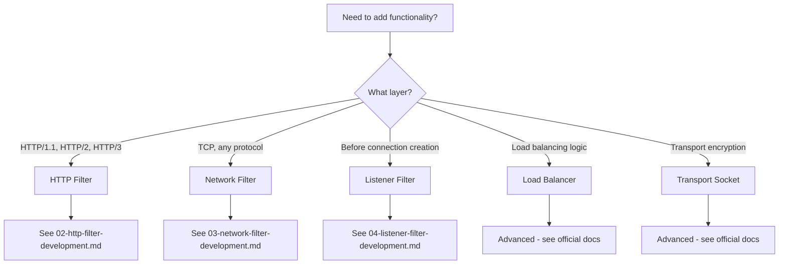
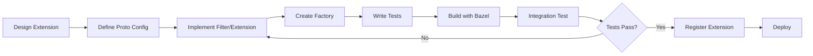

# Envoy Extension Development Guide

This directory contains comprehensive documentation for developing Envoy extensions, including filters, load balancers, transport sockets, and other extension points.

## Overview

Envoy is designed to be highly extensible. Extensions allow you to add custom functionality without modifying Envoy's core code. This guide covers the architecture, patterns, and best practices for building production-ready Envoy extensions.

## Documentation Index

### Getting Started
- **[01-overview.md](01-overview.md)** - Extension System Overview
  - Extension architecture and design principles
  - Types of extensions (filters, load balancers, transport sockets, etc.)
  - Factory pattern and registration
  - Extension lifecycle

### Filter Development
- **[02-http-filter-development.md](02-http-filter-development.md)** - HTTP Filter Development
  - StreamDecoderFilter, StreamEncoderFilter, StreamFilter interfaces
  - Filter callbacks and lifecycle
  - Configuration and factory patterns
  - Route-specific configuration
  - Testing patterns and examples

- **[03-network-filter-development.md](03-network-filter-development.md)** - Network Filter Development
  - ReadFilter, WriteFilter, Filter interfaces
  - Network filter lifecycle
  - Configuration and registration
  - TCP/UDP filter examples

- **[04-listener-filter-development.md](04-listener-filter-development.md)** - Listener Filter Development
  - ListenerFilter interface
  - Connection acceptance and early data inspection
  - TLS/SNI inspection patterns
  - QUIC listener filters

### Build and Registration
- **[05-extension-registration.md](05-extension-registration.md)** - Extension Registration and Build Integration
  - Bazel build system integration
  - Extension registry patterns
  - Configuration proto generation
  - Static and dynamic registration

## Quick Start

### 1. Choose Your Extension Type



### 2. Understand the Factory Pattern

All Envoy extensions use the factory pattern:

```cpp
// Your filter implementation
class MyFilter : public Http::StreamFilter {
  // Filter logic here
};

// Factory to create filter instances
class MyFilterFactory : public Common::FactoryBase<MyFilterProto> {
  Http::FilterFactoryCb createFilterFactoryFromProtoTyped(
      const MyFilterProto& config,
      const std::string& stats_prefix,
      Server::Configuration::FactoryContext& context) override {
    
    // Return a lambda that creates filter instances
    return [config](Http::FilterChainFactoryCallbacks& callbacks) {
      callbacks.addStreamFilter(
          std::make_shared<MyFilter>(config));
    };
  }
};

// Register the factory
REGISTER_FACTORY(MyFilterFactory, Server::Configuration::NamedHttpFilterConfigFactory);
```

### 3. Define Configuration Protocol Buffers

```protobuf
syntax = "proto3";

package envoy.extensions.filters.http.my_filter.v3;

message MyFilter {
  // Your configuration fields
  string my_setting = 1;
  uint32 timeout_ms = 2;
}
```

### 4. Implement the Filter

```cpp
class MyFilter : public Http::PassThroughFilter {
public:
  Http::FilterHeadersStatus decodeHeaders(
      Http::RequestHeaderMap& headers, bool end_stream) override {
    // Your request processing logic
    return Http::FilterHeadersStatus::Continue;
  }
  
  Http::FilterHeadersStatus encodeHeaders(
      Http::ResponseHeaderMap& headers, bool end_stream) override {
    // Your response processing logic
    return Http::FilterHeadersStatus::Continue;
  }
};
```

### 5. Build with Bazel

```python
# BUILD file
load("//bazel:envoy_build_system.bzl", "envoy_cc_extension")

envoy_cc_extension(
    name = "config",
    srcs = ["my_filter.cc"],
    hdrs = ["my_filter.h"],
    deps = [
        "//source/extensions/filters/http/common:factory_base_lib",
        "//source/extensions/filters/http/common:pass_through_filter_lib",
        "@envoy_api//envoy/extensions/filters/http/my_filter/v3:pkg_cc_proto",
    ],
)
```

### 6. Register and Test

```cpp
// Register in factory.cc
REGISTER_FACTORY(MyFilterFactory, 
                 Server::Configuration::NamedHttpFilterConfigFactory);

// Test in my_filter_test.cc
TEST_F(MyFilterTest, BasicFlow) {
  MyFilter filter(config_);
  
  Http::TestRequestHeaderMapImpl headers{
      {":method", "GET"},
      {":path", "/test"}};
  
  EXPECT_EQ(Http::FilterHeadersStatus::Continue,
            filter.decodeHeaders(headers, true));
}
```

## Extension Types

### HTTP Filters
Process HTTP requests and responses at the application layer.

**Use Cases:**
- Authentication and authorization
- Rate limiting
- Request/response transformation
- Custom routing logic
- Caching

**Examples:** `ext_authz`, `jwt_authn`, `rbac`, `ratelimit`, `cors`

### Network Filters
Process data at the TCP layer, protocol-agnostic.

**Use Cases:**
- Protocol detection
- TCP proxying
- MongoDB/Redis protocol parsing
- Custom protocol implementation
- Connection rate limiting

**Examples:** `tcp_proxy`, `http_connection_manager`, `mongo_proxy`, `redis_proxy`

### Listener Filters
Run before connection creation, inspect initial data.

**Use Cases:**
- TLS/SNI inspection
- Protocol detection
- Original destination recovery
- Connection filtering
- Early rate limiting

**Examples:** `tls_inspector`, `http_inspector`, `original_dst`, `proxy_protocol`

### Other Extension Points

| Extension Type | Purpose | Examples |
|---------------|---------|----------|
| Load Balancers | Custom load balancing algorithms | `round_robin`, `least_request`, `ring_hash` |
| Transport Sockets | Custom transport encryption | `tls`, `quic`, `alts` |
| Access Loggers | Custom access log formats | `file`, `grpc`, `stdout` |
| Health Checkers | Custom health check protocols | `http`, `tcp`, `grpc`, `redis` |
| Retry Policies | Custom retry logic | `retry_budget`, `previous_hosts` |
| Stats Sinks | Custom metrics export | `statsd`, `prometheus`, `dog_statsd` |

## Development Workflow



## Best Practices

### 1. Design Principles
- **Single Responsibility**: Each extension should do one thing well
- **Composability**: Design to work with other extensions
- **Performance**: Minimize latency and memory overhead
- **Configuration**: Use proto3 for type-safe configuration
- **Error Handling**: Fail gracefully, log meaningful errors

### 2. Threading Model
- Envoy uses a thread-per-core model
- Filter instances are not shared across threads
- Use thread-local storage via `ThreadLocal::Slot`
- Avoid locks in the data path

### 3. Memory Management
- Use smart pointers (`std::shared_ptr`, `std::unique_ptr`)
- Be careful with buffer ownership
- Clean up resources in `onDestroy()`
- Watch for circular references

### 4. Async Operations
- Use callbacks for async work
- Return `StopIteration` to pause filter chain
- Call `continueDecoding()/continueEncoding()` to resume
- Set appropriate timeouts

### 5. Testing
- Unit tests for filter logic
- Integration tests for full pipeline
- Use mocks for external dependencies
- Test error conditions and edge cases
- Benchmark performance impact

### 6. Documentation
- Document configuration options
- Provide example configurations
- Explain use cases and limitations
- Document statistics and metrics

## Common Patterns

### Pattern 1: Pass-Through Filter
Simple filter that inspects but doesn't modify data.

```cpp
class InspectorFilter : public Http::PassThroughFilter {
  Http::FilterHeadersStatus decodeHeaders(
      Http::RequestHeaderMap& headers, bool) override {
    // Inspect headers
    LOG_DEBUG("Processing request to: {}", headers.getPathValue());
    return Http::FilterHeadersStatus::Continue;
  }
};
```

### Pattern 2: Buffering Filter
Buffers data before processing.

```cpp
Http::FilterHeadersStatus decodeHeaders(
    Http::RequestHeaderMap& headers, bool end_stream) override {
  if (!end_stream) {
    // Need to see body, stop iteration
    return Http::FilterHeadersStatus::StopIteration;
  }
  return processRequest(headers);
}

Http::FilterDataStatus decodeData(
    Buffer::Instance& data, bool end_stream) override {
  if (!end_stream) {
    // Keep buffering
    return Http::FilterDataStatus::StopIterationAndBuffer;
  }
  // Process complete request
  return processBody(data);
}
```

### Pattern 3: Async External Call
Makes external service call, pauses chain.

```cpp
Http::FilterHeadersStatus decodeHeaders(
    Http::RequestHeaderMap& headers, bool) override {
  // Make async call
  makeExternalCall([this](bool allowed) {
    if (allowed) {
      decoder_callbacks_->continueDecoding();
    } else {
      decoder_callbacks_->sendLocalReply(
          Http::Code::Forbidden, "Access denied", nullptr, absl::nullopt, "");
    }
  });
  
  // Pause filter chain
  return Http::FilterHeadersStatus::StopIteration;
}
```

### Pattern 4: Route-Specific Configuration
Different config per route.

```cpp
Http::FilterHeadersStatus decodeHeaders(
    Http::RequestHeaderMap& headers, bool) override {
  // Get route-specific config
  const auto* route_config = Http::Utility::resolveMostSpecificPerFilterConfig<
      MyRouteConfig>(decoder_callbacks_);
  
  if (route_config && route_config->enabled()) {
    return processWithConfig(route_config);
  }
  
  return Http::FilterHeadersStatus::Continue;
}
```

## Performance Considerations

### Latency Impact
- **Target**: <1ms added latency per filter
- **Measure**: Use Envoy's built-in tracing
- **Optimize**: 
  - Avoid unnecessary buffering
  - Cache expensive computations
  - Use async I/O for external calls
  - Minimize allocations

### Memory Impact
- **Target**: Minimal per-connection memory
- **Monitor**: Connection memory stats
- **Optimize**:
  - Release buffers promptly
  - Use object pools for frequent allocations
  - Avoid unbounded buffering
  - Clean up in `onDestroy()`

### CPU Impact
- **Target**: <5% CPU overhead per filter
- **Profile**: Use CPU profilers
- **Optimize**:
  - Avoid expensive operations in hot path
  - Use efficient data structures
  - Minimize string copies
  - Cache regex compilations

## Debugging Extensions

### Enable Debug Logging
```cpp
ENVOY_LOG(debug, "Processing request: path={}", headers.getPathValue());
ENVOY_LOG(trace, "Detailed trace information");
```

### Use Admin Interface
```bash
# Change log level at runtime
curl -X POST http://localhost:9901/logging?filter=debug
curl -X POST http://localhost:9901/logging?my_filter=trace

# View stats
curl http://localhost:9901/stats | grep my_filter

# Dump config
curl http://localhost:9901/config_dump
```

### Common Issues

| Issue | Cause | Solution |
|-------|-------|----------|
| Crash on destroy | Dangling callback | Call `continueDecoding()` before destroy |
| Memory leak | Circular references | Use weak_ptr for callbacks |
| Deadlock | Lock in data path | Remove locks, use thread-local |
| Slow requests | Blocking I/O | Use async APIs |
| Config errors | Proto validation | Add validation in factory |

## Additional Resources

### Documentation
- [Envoy Filter Development](https://www.envoyproxy.io/docs/envoy/latest/extending/extending)
- [Envoy API Reference](https://www.envoyproxy.io/docs/envoy/latest/api-v3/api)
- [HTTP Filter Interface](../../envoy/http/filter.h)
- [Network Filter Interface](../../envoy/network/filter.h)

### Examples in Codebase
- Simple: `source/extensions/filters/http/health_check/`
- Medium: `source/extensions/filters/http/cors/`
- Complex: `source/extensions/filters/http/ext_authz/`

### Community
- [Envoy Slack](https://envoyproxy.slack.com) - #envoy-dev channel
- [GitHub Discussions](https://github.com/envoyproxy/envoy/discussions)
- [Mailing List](https://groups.google.com/forum/#!forum/envoy-dev)

## Contributing

When contributing extensions to Envoy:

1. Follow the [Envoy Style Guide](https://github.com/envoyproxy/envoy/blob/main/STYLE.md)
2. Add comprehensive tests (>90% coverage)
3. Document configuration options
4. Add to extension metadata
5. Update API documentation
6. Consider security implications

---

*Last Updated: 2026-04-26*  
*Envoy Version: Latest (4.x)*
