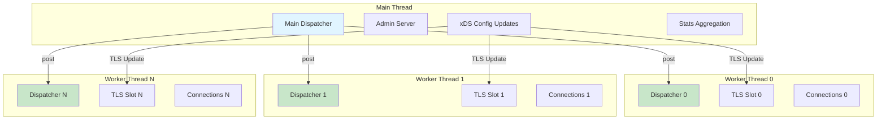
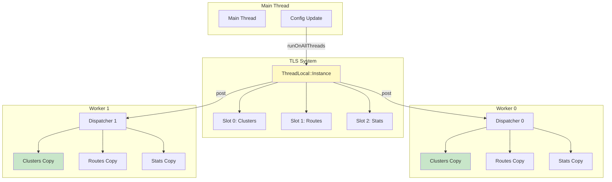
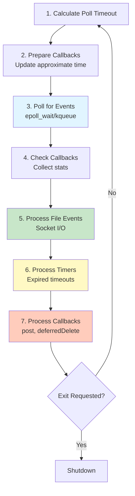

# Envoy Threading Model

## Overview

Envoy uses a **multi-threaded, event-driven architecture** with strict thread isolation. Each thread runs its own event loop (dispatcher) and manages its own set of connections. This design provides excellent scalability while avoiding the complexity of fine-grained locking.

### Key Principles

1. **One dispatcher per thread** - Each worker thread has exactly one event loop
2. **Thread Local Storage (TLS)** - Shared data is replicated per-thread to avoid locks
3. **Libevent-based event loops** - Asynchronous I/O with epoll/kqueue
4. **Post for cross-thread communication** - Minimal synchronization points
5. **No connection migration** - Connections stay on the thread that accepted them



---

## Thread Types

### Main Thread

The main thread is responsible for:

- **Process lifecycle** - Startup, shutdown, signal handling
- **Admin interface** - `/stats`, `/config_dump`, `/clusters`, etc.
- **Configuration updates** - xDS (ADS, CDS, LDS, RDS, EDS, SDS)
- **TLS coordination** - Distributing updates to worker threads
- **Stats aggregation** - Collecting per-worker stats
- **Health checks** (optional) - Can run on main thread or dedicated threads

```cpp
// source/server/server.cc
void InstanceImpl::initialize() {
  // Main thread dispatcher
  main_thread_dispatcher_ = api_->allocateDispatcher("main_thread");
  
  // Initialize TLS system
  thread_local_ = std::make_unique<ThreadLocal::InstanceImpl>();
  
  // Register worker threads
  for (uint32_t i = 0; i < options_.concurrency(); i++) {
    worker_factory_.createWorker(i, thread_local_);
  }
}
```

### Worker Threads

Worker threads handle all client/upstream connections:

- **Accept new connections** - Each worker listens on the same socket (SO_REUSEPORT)
- **Process requests** - Run filter chains for HTTP/TCP
- **Upstream connections** - Connection pooling to backends
- **Local stats** - Per-worker counters, gauges, histograms
- **No shared state** - Everything is thread-local

```cpp
// source/server/worker_impl.cc
void WorkerImpl::threadRoutine(Server::GuardDog& guard_dog) {
  // Create this worker's dispatcher
  dispatcher_ = api_.allocateDispatcher("worker_" + std::to_string(index_));
  
  // Register with TLS system
  tls_.registerThread(*dispatcher_, false);
  
  // Initialize listeners
  handler_->initialize(*dispatcher_);
  
  // Run event loop indefinitely
  dispatcher_->run(Event::Dispatcher::RunType::RunUntilExit);
}
```

**Worker Thread Count:**

```cpp
// Default: number of hardware threads
concurrency: 4

// Can be overridden in bootstrap config:
static_resources:
  listeners: [...]
  
node:
  metadata:
    envoy.config.bootstrap.concurrency: 8
```

---

## Thread Local Storage (TLS)

### Why TLS?

**Problem**: Workers need access to shared data (cluster config, route tables, stats) but locking kills performance.

**Solution**: Replicate the data on each worker thread. Updates happen via cross-thread post().

### TLS Architecture



### TLS Implementation

```cpp
// include/envoy/thread_local/thread_local.h
class Instance {
public:
  // Allocate a TLS slot (done once on main thread)
  virtual SlotPtr allocateSlot() PURE;
};

class Slot {
public:
  // Get thread-local object for this slot
  virtual ThreadLocalObjectSharedPtr get() PURE;
  
  // Set thread-local data (called on each thread)
  virtual void set(InitializeCb cb) PURE;
  
  // Update all threads
  virtual void runOnAllThreads(const UpdateCb& cb) PURE;
  virtual void runOnAllThreads(const UpdateCb& cb, 
                               const std::function<void()>& complete_cb) PURE;
};
```

### TLS Usage Pattern

```cpp
// Cluster manager uses TLS to replicate cluster state
class ClusterManagerImpl {
  ClusterManagerImpl() {
    // Allocate TLS slot on main thread
    tls_slot_ = tls_.allocateSlot();
    
    // Initialize on all worker threads
    tls_slot_->set([this](Event::Dispatcher&) {
      return std::make_shared<ThreadLocalClusterManagerImpl>(*this);
    });
  }
  
  void updateCluster(ClusterSharedPtr cluster) {
    // Update happens on main thread
    clusters_[cluster->name()] = cluster;
    
    // Propagate to all workers
    tls_slot_->runOnAllThreads([cluster](ThreadLocalObjectSharedPtr obj) {
      auto tls_cluster_manager = 
        std::dynamic_pointer_cast<ThreadLocalClusterManagerImpl>(obj);
      tls_cluster_manager->updateCluster(cluster);
    });
  }
  
  // Fast path: no locks, just thread-local access
  ClusterInfoConstSharedPtr findCluster(absl::string_view name) {
    auto tls_clusters = tls_slot_->get();
    return tls_clusters->findCluster(name);
  }

private:
  ThreadLocal::SlotPtr tls_slot_;
  ThreadLocal::Instance& tls_;
  ClusterMap clusters_;  // Main thread copy
};
```

### TLS Internals

```cpp
// source/common/thread_local/thread_local_impl.h
class InstanceImpl : public Instance {
private:
  struct SlotImpl : public Slot {
    ThreadLocalObjectSharedPtr get() override {
      return getWorker(index_);
    }
    
    static ThreadLocalObjectSharedPtr getWorker(uint32_t index) {
      // No locks! Direct access to thread_local storage
      return thread_local_data_.data_[index];
    }
    
    void runOnAllThreads(const UpdateCb& cb) override {
      for (auto& dispatcher : parent_.registered_threads_) {
        dispatcher.get().post([index = index_, cb]() {
          // Runs on each worker thread
          auto obj = getWorker(index);
          cb(obj);
        });
      }
    }
    
    InstanceImpl& parent_;
    uint32_t index_;  // Slot index in TLS array
  };
  
  // Thread-local storage (one per thread)
  static thread_local ThreadLocalData thread_local_data_;
  
  struct ThreadLocalData {
    Event::Dispatcher* dispatcher_;
    std::vector<ThreadLocalObjectSharedPtr> data_;
  };
};
```

---

## Event Loop (Dispatcher)

### Dispatcher Responsibilities

Each thread's dispatcher manages:

1. **File descriptor events** - Socket read/write readiness
2. **Timers** - Timeouts, retries, periodic tasks
3. **Deferred deletion** - Safe object cleanup
4. **Cross-thread callbacks** - post() from other threads
5. **Connection lifecycle** - Accept, process, close

### Event Loop Cycle



See [Event Loop Architecture](../source-common/EVENT_LOOP_ARCHITECTURE.md) for detailed documentation.

---

## Thread-Safe Design Patterns

### Pattern 1: Thread-Local Data Access (No Locks)

```cpp
// FAST: No locks, each thread accesses its own copy
class HttpConnectionManager {
  RouteConstSharedPtr findRoute(const Http::RequestHeaderMap& headers) {
    // Get thread-local route table (no lock!)
    auto config = config_->get();
    return config->routeConfig().route(headers);
  }
  
private:
  ThreadLocal::TypedSlotPtr<ConfigType> config_;
};
```

### Pattern 2: Cross-Thread Communication (post)

```cpp
// Main thread updates config, notifies workers
class ConfigManager {
  void updateConfig(ConfigSharedPtr new_config) {
    // Validate on main thread
    new_config->validate();
    
    // Atomically update each worker
    for (auto& worker : workers_) {
      worker.dispatcher().post([new_config]() {
        // Runs on worker thread
        applyConfig(new_config);
      });
    }
  }
};
```

### Pattern 3: Stats Aggregation

```cpp
// Workers maintain local stats, main thread aggregates
class StatsImpl {
  // Worker: increment local counter (no lock)
  void incrementCounter(const std::string& name) {
    auto& counter = thread_local_stats_.counter(name);
    counter.inc();  // Atomic increment
  }
  
  // Main thread: aggregate across all workers
  uint64_t getCounterValue(const std::string& name) {
    uint64_t total = 0;
    for (auto& worker : workers_) {
      worker.dispatcher().post([&total, name]() {
        total += thread_local_stats_.counter(name).value();
      });
    }
    return total;
  }
};
```

### Pattern 4: Deferred Deletion

```cpp
// Safe object deletion in callbacks
class Connection {
  void onTimeout() {
    ENVOY_LOG(debug, "Connection timeout");
    
    // BAD: delete this; // Crash!
    
    // GOOD: Defer deletion until after call stack unwinds
    dispatcher_.deferredDelete(DeferredDeletablePtr(this));
    
    // Safe to continue executing
    stats_.timeouts_.inc();
  }
};
```

### Pattern 5: Connection Pinning

```cpp
// Connections never migrate between threads
class Listener {
  void onAccept(Network::ConnectionSocketPtr&& socket) {
    // Connection is created on current worker thread
    auto connection = dispatcher_.createServerConnection(
      std::move(socket), transport_socket_, stream_info);
    
    // This connection will ALWAYS run on this thread
    // No locks needed for connection state!
    connections_.emplace_back(std::move(connection));
  }
};
```

---

## Thread Synchronization

### Minimal Synchronization Points

Envoy minimizes synchronization to these specific areas:

1. **post() callbacks** - Mutex-protected queue per dispatcher
2. **TLS updates** - Coordination via runOnAllThreads
3. **Stats aggregation** - Periodic collection from workers
4. **Admin queries** - Main thread queries worker state

### Post Implementation

```cpp
// source/common/event/dispatcher_impl.cc
void DispatcherImpl::post(PostCb callback) {
  bool do_post;
  {
    // ONLY synchronization point!
    Thread::LockGuard lock(post_lock_);
    do_post = post_callbacks_.empty();
    post_callbacks_.emplace_back(std::move(callback));
  }
  
  // Schedule execution (thread-safe via libevent)
  if (do_post) {
    post_cb_->scheduleCallbackCurrentIteration();
  }
}

void DispatcherImpl::runPostCallbacks() {
  // Move callbacks out of shared queue
  std::list<PostCb> callbacks;
  {
    Thread::LockGuard lock(post_lock_);
    callbacks = std::move(post_callbacks_);
  }
  
  // Execute without holding lock
  for (const PostCb& cb : callbacks) {
    cb();
  }
}
```

### Thread Safety Validation

```cpp
// Runtime thread safety checks
bool DispatcherImpl::isThreadSafe() const {
  // Empty run_tid_ means run() hasn't been called (tests)
  return run_tid_.isEmpty() || 
         run_tid_ == thread_factory_.currentThreadId();
}

// Used in assertions throughout codebase
void Connection::write(Buffer::Instance& data) {
  ASSERT(dispatcher_.isThreadSafe(), "Wrong thread!");
  doWrite(data);
}
```

---

## Threading Model Trade-offs

### Advantages

1. **Excellent scalability** - Linear scaling with CPU cores
2. **Simple reasoning** - No complex locking logic
3. **Cache-friendly** - Thread-local data stays in L1/L2 cache
4. **Low latency** - No lock contention on hot path
5. **Fault isolation** - Thread crash doesn't affect others

### Disadvantages

1. **Memory overhead** - Data replicated per-thread
2. **Update latency** - TLS updates require cross-thread post
3. **Connection affinity** - Can't migrate connections between threads
4. **Load imbalancing** - One thread can be overloaded while others idle

### Memory Trade-off Example

```cpp
// Single cluster with 1000 hosts
// Per-worker overhead: ~1 KB per host
// With 32 workers: 32 KB * 1000 hosts = 32 MB

// 100 clusters with 100 hosts each
// With 32 workers: 32 KB * 10,000 hosts = 320 MB

// This is acceptable trade-off for:
// - Zero-lock data access
// - Better CPU cache utilization
// - Linear scalability
```

---

## Configuration and Tuning

### Worker Thread Count

```yaml
# bootstrap.yaml
# Option 1: Explicit concurrency
static_resources:
  listeners: [...]

node:
  metadata:
    envoy.config.bootstrap.concurrency: 8

# Option 2: Auto-detect (default)
# Uses std::thread::hardware_concurrency()
```

```bash
# Override via command line
envoy --concurrency 16 -c envoy.yaml

# Recommended: 1 worker per physical core
# Avoid: workers > physical cores (causes contention)
```

### Connection Balancing

```yaml
# SO_REUSEPORT for better load balancing
listener:
  enable_reuse_port: true  # Default: true on Linux
  
# Connection handler balancing
connection_balance_config:
  exact_balance: {}  # Default: kernel balancing
```

### Thread Priorities

```cpp
// Set worker thread priority (Linux)
// Requires CAP_SYS_NICE capability
static_resources:
  listeners:
  - name: listener_0
    address:
      socket_address:
        address: 0.0.0.0
        port_value: 10000
    
    # Worker thread affinity
    bind_to_port: true
```

---

## Performance Monitoring

### Per-Thread Stats

```bash
# Get stats for each worker thread
curl localhost:9901/stats?filter=worker

# Example output:
worker_0.watchdog_miss: 0
worker_0.watchdog_mega_miss: 0
worker_1.watchdog_miss: 0
worker_1.watchdog_mega_miss: 0
```

### Thread Contention

```cpp
// Monitor post() queue length
dispatcher_stats.post_callbacks_queued: 15
dispatcher_stats.post_callbacks_processed: 10234

// High queue length indicates:
// - Too many cross-thread updates
// - Worker threads overloaded
// - Consider reducing update frequency
```

### TLS Update Latency

```cpp
// Time to propagate update to all workers
tls.slot_0.update_duration_ms: 5
tls.slot_0.update_attempts: 100

// High latency indicates:
// - Workers too busy to process post() callbacks
// - Update callback doing too much work
// - Consider batching updates
```

---

## Debugging Threading Issues

### Common Issues

**Issue 1: Wrong Thread Access**

```cpp
// WRONG: Accessing connection from different thread
worker_0.dispatcher().post([connection]() {
  connection->write(data);  // Crash! connection is on worker_1
});

// RIGHT: Use connection's own dispatcher
connection.dispatcher().post([connection]() {
  connection->write(data);  // Safe
});
```

**Issue 2: Data Race**

```cpp
// WRONG: Shared mutable state
static int connection_count = 0;
void onConnection() {
  connection_count++;  // Data race!
}

// RIGHT: Thread-local or atomic
static std::atomic<int> connection_count{0};
void onConnection() {
  connection_count.fetch_add(1, std::memory_order_relaxed);
}
```

**Issue 3: Deadlock**

```cpp
// WRONG: Circular post dependency
worker_0.dispatcher().post([&]() {
  worker_1.dispatcher().post([&]() {
    worker_0.dispatcher().post([&]() {  // Deadlock!
      doWork();
    });
  });
});

// RIGHT: Avoid circular dependencies
```

### Debug Tools

```bash
# Thread dump
curl localhost:9901/threads

# Watchdog stats
curl localhost:9901/stats?filter=watchdog

# Enable thread-safety assertions
envoy --mode validate -c envoy.yaml
```

---

## Summary

Envoy's threading model provides:

1. **Main thread** - Configuration, admin, coordination
2. **Worker threads** - Connection handling, request processing
3. **TLS** - Lock-free data access via replication
4. **Dispatcher** - Event loop per thread
5. **post()** - Minimal cross-thread synchronization

**Key Principles:**
- Thread isolation for scalability
- Data replication over locking
- Connection thread affinity
- Explicit synchronization points

**When to Use:**
- High-throughput workloads (thousands of connections)
- Multi-core systems
- Latency-sensitive applications

**Alternatives:**
- Single-threaded mode (--concurrency 1) for debugging
- External load balancer for connection distribution
