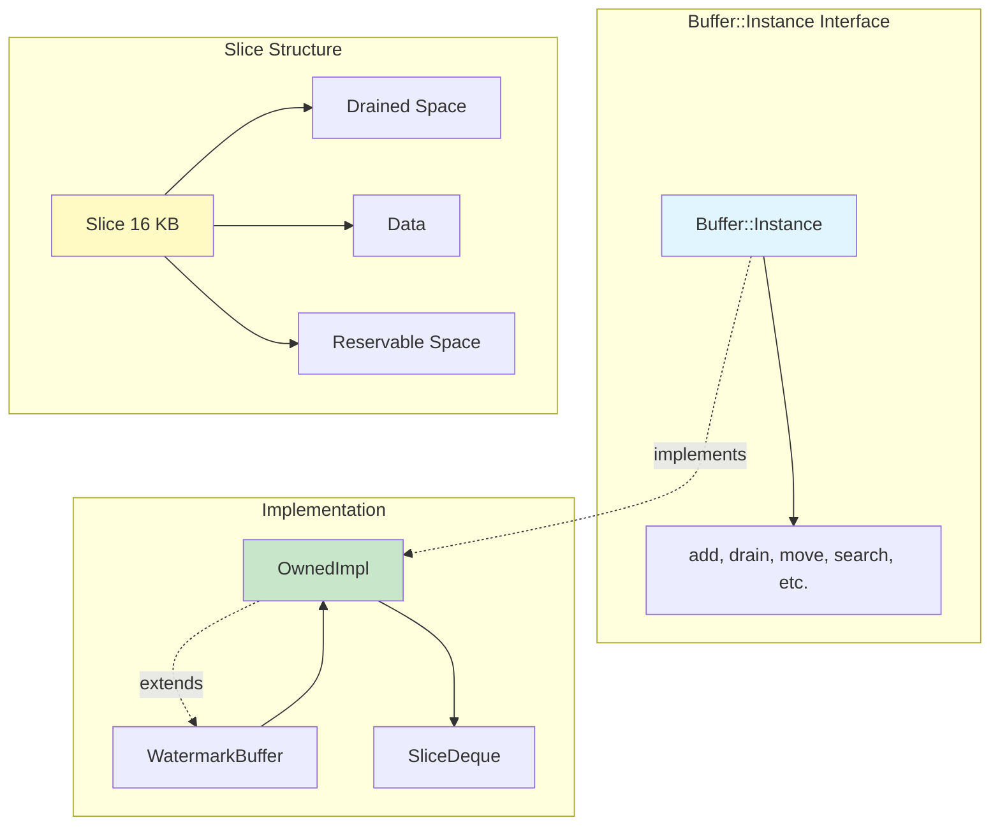
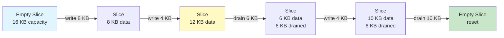
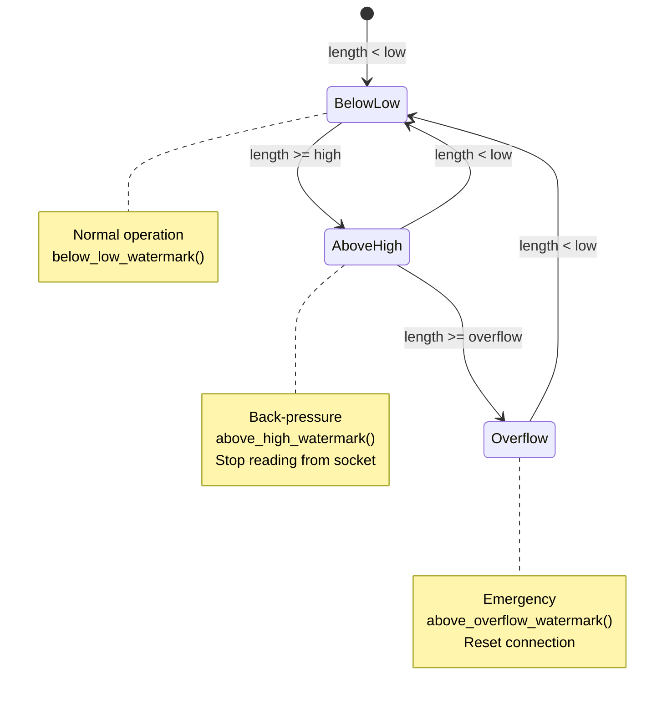

# Envoy Buffer Management

## Overview

Envoy's buffer system is a high-performance, zero-copy capable data structure for managing byte streams. It's used throughout the codebase for reading, writing, and transforming data between network sockets, filters, and upstream connections.

### Key Features

1. **Zero-copy data transfer** - Move data between buffers without copying
2. **Slice-based architecture** - Efficient memory management with 16 KB slices
3. **Watermark tracking** - Flow control and back-pressure
4. **Memory accounting** - Track and limit per-stream memory usage
5. **External buffer fragments** - Reference external data without copying



---

## Buffer::Instance Interface

The core buffer interface used throughout Envoy:

```cpp
// include/envoy/buffer/buffer.h
class Instance {
public:
  // Add data
  virtual void add(const void* data, uint64_t size) PURE;
  virtual void add(absl::string_view data) PURE;
  virtual void add(const Instance& data) PURE;
  virtual void addBufferFragment(BufferFragment& fragment) PURE;
  
  // Remove data
  virtual void drain(uint64_t size) PURE;
  
  // Move data (zero-copy when possible)
  virtual void move(Instance& rhs) PURE;
  virtual void move(Instance& rhs, uint64_t length) PURE;
  
  // Read data
  virtual void copyOut(size_t start, uint64_t size, void* data) const PURE;
  virtual RawSliceVector getRawSlices(
    absl::optional<uint64_t> max_slices = absl::nullopt) const PURE;
  virtual RawSlice frontSlice() const PURE;
  
  // Search
  virtual ssize_t search(const void* data, uint64_t size, 
                         size_t start, size_t length) const PURE;
  virtual bool startsWith(absl::string_view data) const PURE;
  
  // Reservation (for efficient writes)
  virtual Reservation reserveForRead() PURE;
  virtual ReservationSingleSlice reserveSingleSlice(
    uint64_t length, bool separate_slice = false) PURE;
  
  // Metadata
  virtual uint64_t length() const PURE;
  virtual std::string toString() const PURE;
  
  // Watermarks (for flow control)
  virtual void setWatermarks(uint64_t high_watermark, 
                            uint32_t overflow_watermark = 0) PURE;
  virtual bool highWatermarkTriggered() const PURE;
  
  // Memory accounting
  virtual void bindAccount(BufferMemoryAccountSharedPtr account) PURE;
};
```

---

## Slice Architecture

### Slice Structure

A slice manages a contiguous block of memory divided into three sections:

```
|<- Drained ->|<- Data ->|<- Reservable ->|
+-------------+----------+----------------+
| Unused      | Valid    | Available for  |
| (formerly   | content  | new writes     |
| data)       |          |                |
+-------------+----------+----------------+
^             ^          ^                ^
base_         base_+     base_+           base_+
              data_      reservable_      capacity_
```

```cpp
// source/common/buffer/buffer_impl.h
class Slice {
public:
  // Create empty mutable slice
  Slice(uint64_t min_capacity, const BufferMemoryAccountSharedPtr& account);
  
  // Create immutable slice from external fragment
  Slice(BufferFragment& fragment);
  
  // Data access
  const uint8_t* data() const { return base_ + data_; }
  uint64_t dataSize() const { return reservable_ - data_; }
  
  // Remove data from front (O(1))
  void drain(uint64_t size);
  
  // Reserve space for writing
  Reservation reserve(uint64_t size);
  bool commit(const Reservation& reservation);
  
  // Append data
  uint64_t append(const void* data, uint64_t size);
  uint64_t prepend(const void* data, uint64_t size);
  
  // Properties
  bool isMutable() const { return storage_ != nullptr; }
  bool canCoalesce() const { return storage_ != nullptr; }
  uint64_t reservableSize() const { return capacity_ - reservable_; }
  
  static constexpr uint32_t default_slice_size_ = 16384;  // 16 KB

private:
  uint64_t capacity_;           // Total slice size
  StoragePtr storage_;          // Owned memory (if mutable)
  uint8_t* base_;               // Start of slice
  uint64_t data_;               // Offset to data start
  uint64_t reservable_;         // Offset to reservable start
  BufferMemoryAccountSharedPtr account_;  // Memory tracking
};
```

### Slice Allocation

Slices are allocated in 4 KB-aligned chunks:

```cpp
static uint64_t sliceSize(uint64_t data_size) {
  static constexpr uint64_t PageSize = 4096;
  const uint64_t num_pages = (data_size + PageSize - 1) / PageSize;
  return num_pages * PageSize;
}

// Example allocations:
// Request 1 byte    → 4 KB slice
// Request 5000 bytes → 8 KB slice
// Request 16000 bytes → 16 KB slice (default)
// Request 20000 bytes → 20 KB slice
```

### Slice Lifecycle



---

## OwnedImpl - Core Buffer Implementation

### Internal Structure

```cpp
class OwnedImpl : public LibEventInstance {
private:
  SliceDeque slices_;                   // Ring buffer of slices
  OverflowDetectingUInt64 length_;      // Total data size
  BufferMemoryAccountSharedPtr account_;  // Memory tracking
  
  // Slice storage cache (thread-local)
  static thread_local absl::InlinedVector<
    Slice::StoragePtr, Reservation::MAX_SLICES_> free_list_;
};
```

### SliceDeque - Efficient Ring Buffer

```cpp
class SliceDeque {
private:
  static constexpr size_t InlineRingCapacity = 8;
  
  Slice inline_ring_[InlineRingCapacity];    // Inline storage (avoid allocation)
  std::unique_ptr<Slice[]> external_ring_;   // Heap storage (if needed)
  Slice* ring_;                              // Points to active ring
  size_t start_{0};                          // Ring buffer start index
  size_t size_{0};                           // Number of slices
  size_t capacity_;                          // Ring buffer capacity
  
public:
  void emplace_back(Slice&& slice);    // Add to back
  void emplace_front(Slice&& slice);   // Add to front
  void pop_front();                    // Remove from front
  void pop_back();                     // Remove from back
  
  Slice& front();
  Slice& back();
  Slice& operator[](size_t i);
};
```

**Optimization**: Small buffers (< 8 slices) use inline storage, avoiding heap allocation.

---

## Common Buffer Operations

### Adding Data

```cpp
// Method 1: Copy from memory
void OwnedImpl::add(const void* data, uint64_t size) {
  if (size == 0) return;
  
  // Try to append to last slice
  uint64_t bytes_copied = 0;
  if (!slices_.empty()) {
    bytes_copied = slices_.back().append(data, size);
  }
  
  // Create new slices for remaining data
  while (bytes_copied < size) {
    Slice slice(Slice::default_slice_size_, account_);
    uint64_t copy_size = slice.append(
      static_cast<const uint8_t*>(data) + bytes_copied,
      size - bytes_copied
    );
    bytes_copied += copy_size;
    slices_.emplace_back(std::move(slice));
  }
  
  length_ += size;
}

// Method 2: Add string
buffer.add("Hello, World!");

// Method 3: Add from another buffer
buffer.add(other_buffer);
```

### Draining Data

```cpp
void OwnedImpl::drain(uint64_t size) {
  uint64_t size_to_drain = std::min(size, length_);
  length_ -= size_to_drain;
  
  while (size_to_drain > 0) {
    if (slices_.empty()) break;
    
    uint64_t slice_size = slices_.front().dataSize();
    if (slice_size <= size_to_drain) {
      // Drain entire slice
      slices_.pop_front();
      size_to_drain -= slice_size;
    } else {
      // Partial drain
      slices_.front().drain(size_to_drain);
      size_to_drain = 0;
    }
  }
}

// Usage
buffer.drain(100);  // Remove first 100 bytes
```

### Moving Data (Zero-Copy)

```cpp
void OwnedImpl::move(Instance& rhs, uint64_t length) {
  // Fast path: move entire buffer
  if (length >= rhs.length()) {
    move(rhs);
    return;
  }
  
  // Partial move: transfer slices
  auto& rhs_impl = dynamic_cast<OwnedImpl&>(rhs);
  uint64_t bytes_to_move = length;
  
  while (bytes_to_move > 0 && !rhs_impl.slices_.empty()) {
    Slice& source_slice = rhs_impl.slices_.front();
    uint64_t slice_size = source_slice.dataSize();
    
    if (slice_size <= bytes_to_move) {
      // Move entire slice (no copy!)
      coalesceOrAddSlice(std::move(source_slice));
      rhs_impl.slices_.pop_front();
      bytes_to_move -= slice_size;
      length_ += slice_size;
      rhs_impl.length_ -= slice_size;
    } else {
      // Partial slice: must copy
      uint64_t bytes = std::min(bytes_to_move, slice_size);
      add(source_slice.data(), bytes);
      source_slice.drain(bytes);
      bytes_to_move -= bytes;
      rhs_impl.length_ -= bytes;
    }
  }
}

// Usage
downstream_buffer.move(upstream_buffer, 1024);  // Move 1 KB
```

### Coalescing Slices

```cpp
void OwnedImpl::coalesceOrAddSlice(Slice&& other_slice) {
  // Try to coalesce into last slice
  if (!slices_.empty() && 
      slices_.back().canCoalesce() && 
      other_slice.canCoalesce()) {
    
    Slice& last_slice = slices_.back();
    uint64_t copy_size = last_slice.append(
      other_slice.data(), 
      other_slice.dataSize()
    );
    
    if (copy_size == other_slice.dataSize()) {
      // Full coalesce successful
      other_slice.transferDrainTrackersTo(last_slice);
      return;
    }
  }
  
  // Can't coalesce, add as new slice
  slices_.emplace_back(std::move(other_slice));
}
```

---

## Reservation API (Zero-Copy Writes)

### Why Reservations?

**Problem**: Traditional API requires two copies:
1. Read from socket into temporary buffer
2. Copy from temporary buffer into Envoy buffer

**Solution**: Reserve space directly in buffer, read into it:

```cpp
// OLD WAY (2 copies)
uint8_t temp[8192];
ssize_t rc = read(fd, temp, sizeof(temp));
buffer.add(temp, rc);  // Copy!

// NEW WAY (1 copy)
Buffer::Reservation reservation = buffer.reserveForRead();
ssize_t rc = read(fd, reservation.slices_[0].mem_, 
                 reservation.slices_[0].len_);
reservation.commit(rc);  // No copy!
```

### Reservation Implementation

```cpp
class Reservation {
public:
  static constexpr uint32_t MAX_SLICES_ = 16;
  
  struct Slice {
    void* mem_;      // Pointer to reserved memory
    size_t len_;     // Size of reservation
  };
  
  absl::InlinedVector<Slice, 2> slices_;  // Reserved slices
  uint64_t length() const;                 // Total reserved bytes
  void commit();                           // Commit all slices
  void commit(uint64_t actual_size);      // Commit partial
};

Buffer::Reservation OwnedImpl::reserveForRead() {
  return reserveWithMaxLength(default_read_reservation_size_);
}

Buffer::Reservation OwnedImpl::reserveWithMaxLength(uint64_t max_length) {
  Reservation reservation;
  uint64_t remaining = max_length;
  
  // Try to reserve in last slice
  if (!slices_.empty()) {
    Slice& last_slice = slices_.back();
    auto slice_reservation = last_slice.reserve(remaining);
    if (slice_reservation.len_ > 0) {
      reservation.slices_.push_back(slice_reservation);
      remaining -= slice_reservation.len_;
    }
  }
  
  // Create new slices for remaining space
  while (remaining > 0 && 
         reservation.slices_.size() < Reservation::MAX_SLICES_) {
    Slice slice(Slice::default_slice_size_, account_);
    auto slice_reservation = slice.reserve(remaining);
    reservation.slices_.push_back(slice_reservation);
    slices_.emplace_back(std::move(slice));
    remaining -= slice_reservation.len_;
  }
  
  return reservation;
}
```

### Usage Example

```cpp
// Connection read path
void ConnectionImpl::onRead(uint64_t bytes_to_read) {
  // Reserve space in read buffer
  Buffer::Reservation reservation = read_buffer_->reserveForRead();
  
  // Read directly into reserved space
  Api::IoCallUint64Result result = ioHandle().read(
    reservation.slices_[0].mem_,
    reservation.slices_[0].len_
  );
  
  if (result.ok()) {
    // Commit only the bytes actually read
    reservation.commit(result.return_value_);
    
    // Process data
    filter_manager_.onRead();
  }
}
```

---

## Buffer Fragments (External References)

### Zero-Copy for External Data

```cpp
class BufferFragment {
public:
  virtual const void* data() const PURE;
  virtual size_t size() const PURE;
  virtual void done() PURE;  // Called when no longer needed
};

// Example: Reference external memory
class ExternalBufferFragment : public BufferFragment {
public:
  ExternalBufferFragment(const void* data, size_t size, 
                        std::function<void()> releasor)
    : data_(data), size_(size), releasor_(releasor) {}
  
  const void* data() const override { return data_; }
  size_t size() const override { return size_; }
  void done() override { releasor_(); }

private:
  const void* data_;
  size_t size_;
  std::function<void()> releasor_;
};

// Usage
auto fragment = std::make_unique<ExternalBufferFragment>(
  external_data, external_size,
  [external_data]() { free(external_data); }
);
buffer.addBufferFragment(*fragment);
```

---

## Watermarks (Flow Control)

### WatermarkBuffer

```cpp
class WatermarkBuffer : public OwnedImpl {
public:
  WatermarkBuffer(
    std::function<void()> below_low_watermark,
    std::function<void()> above_high_watermark,
    std::function<void()> above_overflow_watermark
  );
  
  void setWatermarks(uint64_t high_watermark, 
                    uint32_t overflow_watermark = 0) override;
  
  bool highWatermarkTriggered() const override;

private:
  uint64_t high_watermark_{0};
  uint64_t low_watermark_{0};          // high_watermark / 2
  uint64_t overflow_watermark_{0};
  bool above_high_watermark_called_{false};
  bool above_overflow_watermark_called_{false};
};
```

### Watermark State Machine



### Usage Example

```cpp
class ConnectionImpl {
  void setupWatermarks() {
    read_buffer_ = std::make_unique<WatermarkBuffer>(
      // Below low watermark: resume reading
      [this]() {
        if (read_disable_count_ == 0) {
          ioHandle().enableRead();
        }
      },
      
      // Above high watermark: stop reading
      [this]() {
        ioHandle().disableRead();
      },
      
      // Above overflow: kill connection
      [this]() {
        ENVOY_CONN_LOG(error, connection, 
                      "Buffer overflow, closing connection");
        close(ConnectionCloseType::FloodProtection);
      }
    );
    
    // Set limits: 1 MB high watermark, 10 MB overflow
    read_buffer_->setWatermarks(1024 * 1024, 10 * 1024 * 1024);
  }
};
```

---

## Memory Accounting

### BufferMemoryAccount

```cpp
class BufferMemoryAccount {
public:
  virtual void charge(uint64_t amount) PURE;  // Account memory allocation
  virtual void credit(uint64_t amount) PURE;  // Account memory release
  virtual void clearDownstream() PURE;        // Prepare for destruction
  virtual void resetDownstream() PURE;        // Reset stream on overflow
};

class BufferMemoryAccountImpl : public BufferMemoryAccount {
public:
  void charge(uint64_t amount) override {
    buffer_memory_allocated_ += amount;
    updateAccountClass();
    
    // Check if over limit
    if (factory_->shouldResetStream(buffer_memory_allocated_)) {
      resetDownstream();
    }
  }
  
  void credit(uint64_t amount) override {
    buffer_memory_allocated_ -= amount;
    updateAccountClass();
  }
  
  void resetDownstream() override {
    if (reset_handler_.has_value()) {
      reset_handler_->resetStream(
        Http::StreamResetReason::OverloadManager
      );
    }
  }

private:
  uint64_t buffer_memory_allocated_{0};
  WatermarkBufferFactory* factory_;
  OptRef<Http::StreamResetHandler> reset_handler_;
};
```

### Memory Classes

The factory tracks accounts in power-of-two memory classes:

```
Class 0: [1 MB,  2 MB)
Class 1: [2 MB,  4 MB)
Class 2: [4 MB,  8 MB)
Class 3: [8 MB, 16 MB)
...
```

When overloaded, the factory can selectively reset streams in higher memory classes.

---

## Performance Optimizations

### 1. Slice Storage Caching

```cpp
// Thread-local cache of freed slice storage
static thread_local absl::InlinedVector<
  Slice::StoragePtr, Reservation::MAX_SLICES_> free_list_;

Slice::SizedStorage OwnedImpl::OwnedImplReservationSlicesOwnerMultiple::newStorage() {
  Slice::SizedStorage storage{nullptr, Slice::default_slice_size_};
  
  // Reuse from cache
  if (!free_list_ref_.empty()) {
    storage.mem_ = std::move(free_list_ref_.back());
    free_list_ref_.pop_back();
  } else {
    // Allocate new
    storage.mem_.reset(new uint8_t[Slice::default_slice_size_]);
  }
  
  return storage;
}
```

### 2. Inline Ring Buffer

```cpp
// Small buffers avoid heap allocation
Slice inline_ring_[8];  // 8 slices = 128 KB of data

// Only allocate on heap if > 8 slices
if (size_ >= capacity_) {
  external_ring_ = std::make_unique<Slice[]>(capacity_ * 2);
}
```

### 3. Move Semantics

```cpp
// Zero-copy move between buffers
upstream_buffer.move(downstream_buffer);  // No memcpy!

// Move entire slices when possible
slices_.emplace_back(std::move(other_slice));
```

### 4. Efficient Drain

```cpp
// Draining is O(1) per slice
void Slice::drain(uint64_t size) {
  data_ += size;
  if (data_ == reservable_) {
    // Reset slice for reuse
    data_ = 0;
    reservable_ = 0;
  }
}
```

---

## Common Patterns

### Pattern 1: HTTP Body Buffering

```cpp
void HttpConnectionManager::decodeData(Buffer::Instance& data, bool end_stream) {
  if (require_complete_request_) {
    // Buffer entire request
    request_buffer_.move(data);
    
    if (end_stream) {
      // Process complete request
      processRequest(request_buffer_);
    }
  } else {
    // Stream processing
    processData(data);
  }
}
```

### Pattern 2: Protocol Framing

```cpp
void RedisDecoder::decode(Buffer::Instance& data) {
  while (data.length() > 0) {
    // Search for delimiter
    ssize_t pos = data.search("\r\n", 2, 0, data.length());
    if (pos == -1) {
      // Incomplete frame, wait for more data
      return;
    }
    
    // Extract frame
    std::string frame = data.toString().substr(0, pos);
    data.drain(pos + 2);
    
    // Process frame
    processFrame(frame);
  }
}
```

### Pattern 3: Zero-Copy Proxy

```cpp
void TcpProxy::onUpstreamData(Buffer::Instance& data, bool end_stream) {
  // Move data from upstream to downstream (zero-copy!)
  downstream_connection_.write(data, end_stream);
  ASSERT(data.length() == 0);
}
```

---

## Summary

Envoy's buffer system provides:

1. **Efficient memory management** - 16 KB slices with caching
2. **Zero-copy operations** - Move between buffers without copying
3. **Flow control** - Watermarks for back-pressure
4. **Memory accounting** - Track and limit per-stream usage
5. **External references** - Buffer fragments for zero-copy

**Key Classes:**
- `Buffer::Instance` - Core interface
- `Buffer::OwnedImpl` - Main implementation
- `Buffer::WatermarkBuffer` - Flow control
- `Buffer::Slice` - Memory block (16 KB default)

**Performance Tips:**
- Use `move()` instead of `add()` when possible
- Use reservations for socket reads
- Enable watermarks to prevent unbounded growth
- Monitor slice count and buffer length
