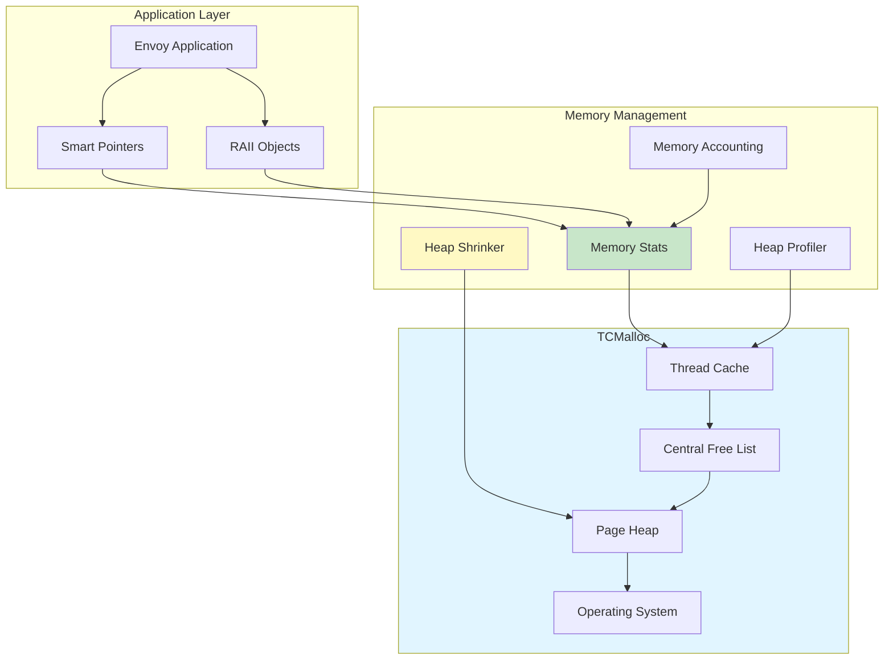
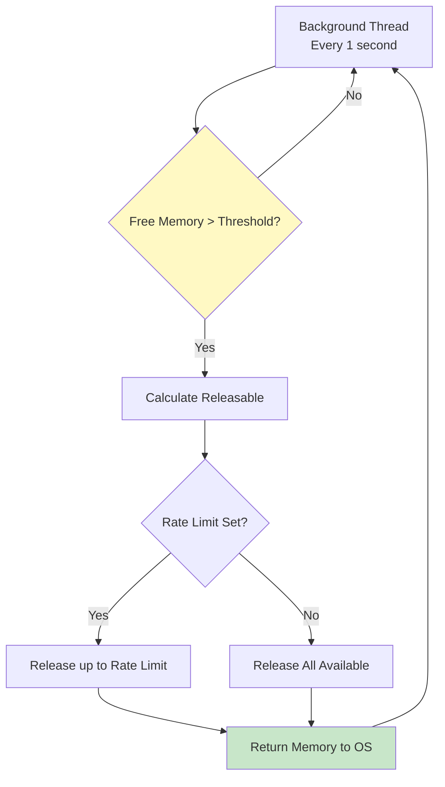

# Envoy Memory Management

## Overview

Envoy uses **TCMalloc** (Thread-Caching Malloc) as its memory allocator, providing excellent performance for multi-threaded workloads. The memory management system includes allocation tracking, heap profiling, leak detection, and automatic memory release.

### Key Components

1. **TCMalloc** - High-performance thread-caching allocator
2. **Memory stats** - Runtime allocation tracking
3. **Heap profiler** - Memory usage profiling
4. **Heap shrinker** - Automatic memory release
5. **Smart pointers** - RAII-based memory safety



---

## TCMalloc Integration

### Why TCMalloc?

**Problems with glibc malloc:**
- Lock contention in multi-threaded workloads
- Poor cache locality
- Fragmentation over time
- No detailed memory profiling

**TCMalloc advantages:**
- Per-thread caches (no locking for small allocations)
- Size-class based allocation (reduces fragmentation)
- Detailed heap profiling
- Configurable memory release policies

### TCMalloc Architecture

```mermaid
graph TB
    subgraph "Thread 1"
        T1[malloc/free]
        TC1[Thread Cache<br/>Small objects]
    end
    
    subgraph "Thread 2"
        T2[malloc/free]
        TC2[Thread Cache<br/>Small objects]
    end
    
    subgraph "Central Heap"
        TF[Transfer Cache<br/>Medium objects]
        CFL[Central Free List<br/>Per size-class]
        PH[Page Heap<br/>Large objects]
    end
    
    subgraph "OS"
        OS[Operating System<br/>mmap/sbrk]
    end
    
    T1 -->|fast path| TC1
    T2 -->|fast path| TC2
    
    TC1 -->|slow path| TF
    TC2 -->|slow path| TF
    
    TF --> CFL
    CFL --> PH
    PH --> OS
    
    style TC1 fill:#c8e6c9
    style TC2 fill:#c8e6c9
    style PH fill:#fff9c4
```

### Size Classes

TCMalloc organizes allocations into size classes:

```cpp
// Small object size classes (8 byte granularity)
8, 16, 24, 32, 40, 48, 56, 64, 72, 80, ...

// Medium object size classes (128 byte granularity)
1024, 1152, 1280, 1408, 1536, ...

// Large objects (> 256 KB)
Allocated directly from page heap
```

---

## Memory Statistics

### Stats Interface

```cpp
// source/common/memory/stats.h
class Stats {
public:
  // Current allocations
  static uint64_t totalCurrentlyAllocated();
  
  // Total heap size (including free memory)
  static uint64_t totalCurrentlyReserved();
  
  // Thread cache size
  static uint64_t totalThreadCacheBytes();
  
  // Free memory (unmapped)
  static uint64_t totalPageHeapUnmapped();
  
  // Free memory (mapped)
  static uint64_t totalPageHeapFree();
  
  // Physical memory usage estimate
  static uint64_t totalPhysicalBytes();
  
  // Detailed stats dump
  static void dumpStatsToLog();
  static absl::optional<std::string> dumpStats();
};
```

### Implementation (TCMalloc)

```cpp
// source/common/memory/stats.cc
#ifdef TCMALLOC

uint64_t Stats::totalCurrentlyAllocated() {
  size_t value;
  MallocExtension_Internal_GetNumericProperty(
    "generic.current_allocated_bytes", &value);
  return value;
}

uint64_t Stats::totalCurrentlyReserved() {
  size_t value;
  MallocExtension_Internal_GetNumericProperty(
    "generic.heap_size", &value);
  return value;
}

uint64_t Stats::totalThreadCacheBytes() {
  size_t value;
  MallocExtension_Internal_GetNumericProperty(
    "tcmalloc.current_total_thread_cache_bytes", &value);
  return value;
}

#endif
```

### Admin Interface

```bash
# Get memory statistics
curl localhost:9901/memory

# Example output:
{
  "allocated": 524288000,        # 500 MB
  "heap_size": 629145600,        # 600 MB
  "thread_cache": 10485760,      # 10 MB
  "pageheap_free": 104857600,    # 100 MB
  "pageheap_unmapped": 0,
  "physical_bytes": 524288000
}
```

---

## Heap Profiler

### Enabling Heap Profiling

```bash
# Option 1: Environment variables
export HEAPPROFILE=/tmp/envoy.heap
export HEAP_PROFILE_ALLOCATION_INTERVAL=104857600  # 100 MB

# Start Envoy
envoy -c envoy.yaml

# Profiles written to:
# /tmp/envoy.heap.0000.heap
# /tmp/envoy.heap.0001.heap
# ...
```

```yaml
# Option 2: Admin interface (live profiling)
# Start heap profiling
curl -X POST localhost:9901/heap_dump
# Returns: heap profile dumped to /tmp/envoy.1234.heap

# Get current heap profile
curl localhost:9901/heap_dump?format=json
```

### Analyzing Heap Profiles

```bash
# Install pprof
go install github.com/google/pprof@latest

# Analyze profile
pprof -http=:8080 /tmp/envoy.heap.0001.heap

# Common views:
# - Top allocations (by function)
# - Flame graph (call tree)
# - Source view (line-by-line attribution)
```

### Example Heap Profile Output

```
Total: 524.3 MB

   156.8 MB (29.9%) @ 0x7f8a2c3d1234  Envoy::Buffer::OwnedImpl::add
    78.4 MB (15.0%) @ 0x7f8a2c3d5678  Envoy::Http::CodecClient::newStream
    52.3 MB (10.0%) @ 0x7f8a2c3d9abc  Envoy::Router::FilterImpl::retry
    47.1 MB ( 9.0%) @ 0x7f8a2c3ddef0  Envoy::Network::ConnectionImpl
    ...
```

### Heap Profile Triggers

```cpp
// source/common/memory/stats.cc
// Automatic profiling every N bytes allocated
HEAP_PROFILE_ALLOCATION_INTERVAL=100MB

// Manual trigger via admin
POST /heap_dump

// Periodic snapshots
// Use cron or external monitoring to curl /heap_dump
```

---

## Heap Shrinker (Memory Release)

### AllocatorManager

The AllocatorManager handles automatic memory release back to the OS:

```cpp
// source/common/memory/stats.h
class AllocatorManager {
public:
  AllocatorManager(Api::Api& api, 
                  const envoy::config::bootstrap::v3::MemoryAllocatorManager& config);
  ~AllocatorManager();

private:
  void configureBackgroundMemoryRelease();
  void configureTcmallocOptions(
    const envoy::config::bootstrap::v3::MemoryAllocatorManager& config);
  
  const uint64_t bytes_to_release_;
  const std::chrono::milliseconds memory_release_interval_msec_;
  const size_t background_release_rate_bytes_per_second_;
  Thread::ThreadPtr tcmalloc_thread_;
};
```

### Configuration

```yaml
# bootstrap.yaml
memory_allocator_manager:
  # Threshold for triggering memory release
  # Default: 100 MB
  bytes_to_release: 104857600
  
  # How often to check for releasable memory
  # Default: 1000 ms
  memory_release_interval_msec: 1000
  
  # Rate to release memory (bytes per second)
  # Default: 0 (release all available memory)
  background_release_rate_bytes_per_second: 10485760  # 10 MB/s
  
  # TCMalloc options
  tcmalloc_options:
    # Soft memory limit (triggers aggressive release)
    max_total_thread_cache_bytes: 10485760  # 10 MB
    
    # Per-CPU cache size
    per_cpu_cache_size: 1048576  # 1 MB
```

### Memory Release Strategy



### Implementation

```cpp
// source/common/memory/stats.cc
void AllocatorManager::configureBackgroundMemoryRelease() {
  if (background_release_rate_bytes_per_second_ > 0) {
    // Create dedicated thread for memory release
    tcmalloc_thread_ = api_.threadFactory().createThread([this]() {
      while (!shutdown_) {
        // Sleep for interval
        std::this_thread::sleep_for(memory_release_interval_msec_);
        
        // Run TCMalloc background actions
        // - Per-CPU cache reclamation
        // - Size class resizing
        // - Memory release to OS
        MallocExtension_Internal_ProcessBackgroundActions();
      }
    });
  }
}

// Manual memory release
uint64_t maxUnfreedMemoryBytes() {
  return max_unfreed_memory_bytes_;
}

void setMaxUnfreedMemoryBytes(uint64_t value) {
  max_unfreed_memory_bytes_ = value;
}

// Try to shrink heap
void tryShrinkHeap() {
  uint64_t free_bytes = Stats::totalPageHeapFree();
  uint64_t unfreed_threshold = maxUnfreedMemoryBytes();
  
  if (free_bytes > unfreed_threshold) {
    MallocExtension_ReleaseMemoryToSystem(free_bytes - unfreed_threshold);
  }
}
```

---

## Memory Accounting

### Buffer Memory Accounting

Per-stream memory tracking to prevent unbounded growth:

```cpp
// source/common/buffer/watermark_buffer.h
class BufferMemoryAccountImpl : public BufferMemoryAccount {
public:
  void charge(uint64_t amount) override {
    buffer_memory_allocated_ += amount;
    updateAccountClass();
    
    // Check limits
    if (shouldResetStream()) {
      resetDownstream();
    }
  }
  
  void credit(uint64_t amount) override {
    ASSERT(buffer_memory_allocated_ >= amount);
    buffer_memory_allocated_ -= amount;
    updateAccountClass();
  }
  
  void resetDownstream() override {
    if (reset_handler_.has_value()) {
      reset_handler_->resetStream(
        Http::StreamResetReason::OverloadManager
      );
    }
  }

private:
  uint64_t buffer_memory_allocated_{0};
  WatermarkBufferFactory* factory_;
  OptRef<Http::StreamResetHandler> reset_handler_;
};
```

### Memory Classes

```cpp
// Accounts are grouped into power-of-two memory classes
static constexpr uint32_t NUM_MEMORY_CLASSES_ = 8;

// Example classes (with 1 MB minimum):
// Class 0: [1 MB,   2 MB)
// Class 1: [2 MB,   4 MB)
// Class 2: [4 MB,   8 MB)
// Class 3: [8 MB,  16 MB)
// Class 4: [16 MB, 32 MB)
// Class 5: [32 MB, 64 MB)
// Class 6: [64 MB, 128 MB)
// Class 7: [128 MB, ∞)

absl::optional<uint32_t> balanceToClassIndex() {
  if (buffer_memory_allocated_ < minimum_account_to_track_) {
    return absl::nullopt;  // Too small to track
  }
  
  // Calculate class index
  uint32_t shifted = buffer_memory_allocated_ >> bitshift_;
  uint32_t class_idx = 0;
  while (shifted > 1 && class_idx < NUM_MEMORY_CLASSES_ - 1) {
    shifted >>= 1;
    class_idx++;
  }
  
  return class_idx;
}
```

### Overload Management

```cpp
// source/common/buffer/watermark_buffer.h
class WatermarkBufferFactory {
public:
  uint64_t resetAccountsGivenPressure(float pressure) override {
    // pressure: 0.0 (no pressure) to 1.0 (max pressure)
    
    // Calculate which memory classes to reset
    uint32_t classes_to_reset = std::ceil(
      pressure * NUM_MEMORY_CLASSES_
    );
    
    uint64_t streams_reset = 0;
    
    // Reset streams in highest memory classes first
    for (int i = NUM_MEMORY_CLASSES_ - 1; 
         i >= 0 && classes_to_reset > 0; 
         i--, classes_to_reset--) {
      
      for (auto& account : size_class_account_sets_[i]) {
        account->resetDownstream();
        streams_reset++;
      }
    }
    
    return streams_reset;
  }
};
```

---

## Smart Pointer Usage

### Standard Smart Pointers

```cpp
// Use std::unique_ptr for exclusive ownership
std::unique_ptr<Connection> connection = 
  std::make_unique<ConnectionImpl>(socket, dispatcher);

// Use std::shared_ptr for shared ownership
std::shared_ptr<Cluster> cluster = 
  std::make_shared<ClusterImpl>(config);

// Use weak_ptr to break circular references
std::weak_ptr<Upstream> upstream_weak = upstream_shared;
```

### Custom Deleters

```cpp
// File descriptor with custom deleter
struct FdDeleter {
  void operator()(int* fd) const {
    if (fd && *fd >= 0) {
      ::close(*fd);
    }
    delete fd;
  }
};

using UniqueFd = std::unique_ptr<int, FdDeleter>;

UniqueFd fd(new int(socket(AF_INET, SOCK_STREAM, 0)));
```

### Deferred Deletion Pattern

```cpp
// For objects that must be deleted in event loop context
class DeferredDeletable {
public:
  virtual ~DeferredDeletable() = default;
};

// Usage
class Connection : public DeferredDeletable {
  void close() {
    dispatcher_.deferredDelete(DeferredDeletablePtr(this));
  }
};
```

---

## Memory Leak Detection

### Sanitizers

```bash
# Build with AddressSanitizer (ASan)
bazel build --config=asan //source/exe:envoy-static

# Run with leak detection
ASAN_OPTIONS=detect_leaks=1 ./bazel-bin/source/exe/envoy-static -c envoy.yaml

# Build with LeakSanitizer (LSan)
bazel build --config=lsan //source/exe:envoy-static
```

### TCMalloc Leak Checker

```bash
# Enable heap checker
export HEAPCHECK=normal
envoy -c envoy.yaml

# On exit, heap checker will report leaks:
# Leak of 1024 bytes in 1 objects allocated from:
#   @ 0x7f8a2c3d1234  Envoy::Buffer::OwnedImpl::add
#   @ 0x7f8a2c3d5678  Envoy::Http::CodecClient::newStream
```

### Common Leak Patterns to Avoid

```cpp
// BAD: Circular reference with shared_ptr
class Connection {
  std::shared_ptr<Filter> filter_;  // Filter holds shared_ptr to Connection
};

// GOOD: Break cycle with weak_ptr
class Connection {
  std::shared_ptr<Filter> filter_;
};

class Filter {
  std::weak_ptr<Connection> connection_;  // Weak reference
};

// BAD: Forgot to delete in destructor
class Manager {
  Connection* connection_;
  ~Manager() {}  // Leak!
};

// GOOD: Use smart pointer or delete in destructor
class Manager {
  std::unique_ptr<Connection> connection_;
  ~Manager() = default;  // Automatically deletes
};
```

---

## Memory Profiling Workflow

### Step 1: Baseline Profile

```bash
# Start Envoy with heap profiling
HEAPPROFILE=/tmp/baseline envoy -c envoy.yaml

# Generate traffic
ab -n 100000 -c 100 http://localhost:10000/

# Stop Envoy (triggers final heap dump)
kill -SIGTERM <envoy-pid>

# Analyze baseline
pprof -http=:8080 /tmp/baseline.0001.heap
```

### Step 2: Identify Hot Spots

```bash
# Top allocations
pprof -top /tmp/baseline.0001.heap

# Flame graph
pprof -http=:8080 /tmp/baseline.0001.heap
# Navigate to "Flame Graph" view

# Focus on specific component
pprof -focus=Envoy::Buffer -http=:8080 /tmp/baseline.0001.heap
```

### Step 3: Compare Profiles

```bash
# Take second profile after changes
HEAPPROFILE=/tmp/optimized envoy -c envoy.yaml
# Run same load test
ab -n 100000 -c 100 http://localhost:10000/

# Compare profiles
pprof -base=/tmp/baseline.0001.heap \
      -http=:8080 \
      /tmp/optimized.0001.heap

# Shows delta (increase/decrease) in allocations
```

### Step 4: Continuous Monitoring

```bash
# Periodically dump heap
while true; do
  curl -X POST localhost:9901/heap_dump
  sleep 300  # Every 5 minutes
done

# Monitor memory metrics
curl localhost:9901/stats | grep "memory\."
```

---

## Configuration Examples

### Minimal Memory Footprint

```yaml
# bootstrap.yaml
memory_allocator_manager:
  # Aggressive memory release
  bytes_to_release: 10485760  # 10 MB
  memory_release_interval_msec: 1000
  background_release_rate_bytes_per_second: 5242880  # 5 MB/s
  
  tcmalloc_options:
    # Small thread caches
    max_total_thread_cache_bytes: 1048576  # 1 MB
    per_cpu_cache_size: 262144  # 256 KB

# Small buffer limits
static_resources:
  listeners:
  - per_connection_buffer_limit_bytes: 32768  # 32 KB
    filters:
    - name: envoy.filters.network.http_connection_manager
      typed_config:
        "@type": type.googleapis.com/envoy.extensions.filters.network.http_connection_manager.v3.HttpConnectionManager
        codec_type: AUTO
        stat_prefix: ingress_http
        
        # Small HTTP buffers
        max_request_headers_kb: 60  # Default: 60 KB
        stream_idle_timeout: 300s
        request_timeout: 300s
```

### High-Throughput Configuration

```yaml
memory_allocator_manager:
  # Relaxed memory release
  bytes_to_release: 209715200  # 200 MB
  memory_release_interval_msec: 5000
  
  tcmalloc_options:
    # Large thread caches
    max_total_thread_cache_bytes: 52428800  # 50 MB
    per_cpu_cache_size: 4194304  # 4 MB

static_resources:
  listeners:
  - per_connection_buffer_limit_bytes: 1048576  # 1 MB
```

---

## Debugging Memory Issues

### Issue 1: Memory Leak

**Symptoms:**
```bash
$ curl localhost:9901/memory
{
  "allocated": 2147483648,  # 2 GB and growing
  "heap_size": 2684354560   # 2.5 GB
}
```

**Investigation:**
```bash
# Enable heap profiling
HEAPPROFILE=/tmp/leak envoy -c envoy.yaml

# Compare early vs late profiles
pprof -base=/tmp/leak.0001.heap \
      -http=:8080 \
      /tmp/leak.0010.heap

# Look for allocations that only grow
```

### Issue 2: High Memory Fragmentation

**Symptoms:**
```bash
$ curl localhost:9901/memory
{
  "allocated": 524288000,     # 500 MB
  "heap_size": 1073741824,    # 1 GB (lots of free space!)
  "pageheap_free": 549453824  # 524 MB free but not released
}
```

**Solution:**
```yaml
memory_allocator_manager:
  # More aggressive memory release
  bytes_to_release: 52428800  # 50 MB
  memory_release_interval_msec: 1000
```

### Issue 3: Per-Stream Memory Explosion

**Symptoms:**
```bash
# Many connections with large buffers
$ curl localhost:9901/stats | grep "buffer.*bytes"
http.ingress.downstream_cx_buffer_bytes_allocated: 104857600  # 100 MB
```

**Solution:**
```yaml
# Enable per-stream accounting
overload_manager:
  refresh_interval: 0.25s
  resource_monitors:
  - name: envoy.resource_monitors.fixed_heap
    typed_config:
      "@type": type.googleapis.com/envoy.extensions.resource_monitors.fixed_heap.v3.FixedHeapConfig
      max_heap_size_bytes: 2147483648  # 2 GB
  
  actions:
  - name: envoy.overload_actions.reset_high_memory_streams
    triggers:
    - name: envoy.resource_monitors.fixed_heap
      threshold:
        value: 0.95  # Reset at 95% memory usage
```

---

## Summary

Envoy's memory management provides:

1. **TCMalloc** - High-performance thread-caching allocator
2. **Memory stats** - Runtime tracking and monitoring
3. **Heap profiler** - Detailed allocation analysis
4. **Heap shrinker** - Automatic memory release
5. **Smart pointers** - RAII-based safety
6. **Memory accounting** - Per-stream tracking and limits

**Key Tools:**
- `/memory` admin endpoint - Real-time stats
- `/heap_dump` admin endpoint - Heap profiling
- `pprof` - Profile analysis
- ASan/LSan - Leak detection

**Performance Tips:**
- Configure appropriate buffer limits
- Enable memory release for long-running processes
- Monitor memory metrics continuously
- Profile memory usage under load
- Use smart pointers consistently
