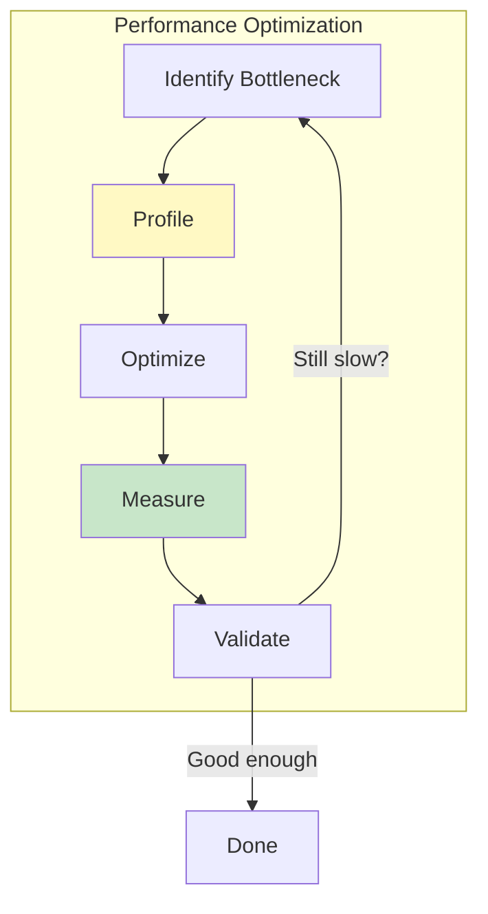

# Envoy Performance Optimization

## Overview

This guide covers performance optimization techniques, profiling tools, and best practices for building high-performance Envoy filters and extensions.

### Performance Principles

1. **Lock-free design** - Avoid contention with thread-local data
2. **Zero-copy operations** - Minimize data copying
3. **Cache-friendly code** - Optimize for CPU cache
4. **Efficient allocations** - Minimize and batch allocations
5. **Profile-guided optimization** - Measure, don't guess



---

## Lock-Free Patterns

### Pattern 1: Thread-Local Storage

**Problem:** Shared data requires synchronization (locks kill performance).

**Solution:** Replicate data per-thread using TLS.

```cpp
// BAD: Shared state with lock
class StatsCollector {
  void increment(const std::string& key) {
    absl::MutexLock lock(&mutex_);  // Contention!
    counters_[key]++;
  }

private:
  absl::Mutex mutex_;
  std::unordered_map<std::string, uint64_t> counters_;
};

// GOOD: Thread-local state
class StatsCollector {
  void increment(const std::string& key) {
    // No lock! Each thread has its own copy
    thread_local_counters_->get()->increment(key);
  }
  
  uint64_t read(const std::string& key) {
    // Aggregate across all threads (rare operation)
    uint64_t total = 0;
    tls_.runOnAllThreads([&](ThreadLocalCounters& counters) {
      total += counters.get(key);
    });
    return total;
  }

private:
  ThreadLocal::SlotPtr thread_local_counters_;
};
```

### Pattern 2: Atomic Operations

**Use atomics for simple shared state:**

```cpp
// Counter shared across threads
std::atomic<uint64_t> total_requests_{0};

void onRequest() {
  // Lock-free increment
  total_requests_.fetch_add(1, std::memory_order_relaxed);
}

// Guidelines:
// - memory_order_relaxed: No ordering guarantees (fastest)
// - memory_order_acquire/release: Synchronize with other atomics
// - memory_order_seq_cst: Full sequential consistency (slowest)
```

### Pattern 3: Read-Copy-Update (RCU)

**For infrequent updates to shared read-heavy data:**

```cpp
class ConfigManager {
public:
  // Read path: fast, no locks
  ConfigConstSharedPtr getConfig() {
    return std::atomic_load(&current_config_);
  }
  
  // Write path: infrequent, creates new copy
  void updateConfig(ConfigSharedPtr new_config) {
    // Validate on main thread
    new_config->validate();
    
    // Atomic swap
    std::atomic_store(&current_config_, new_config);
    
    // Old config automatically deleted when refcount hits zero
  }

private:
  std::shared_ptr<const Config> current_config_;
};
```

### Pattern 4: Lock-Free Queues

**For cross-thread communication:**

```cpp
// Envoy's post() mechanism is lock-free from caller's perspective
worker_dispatcher.post([data]() {
  // Runs on worker thread
  processData(data);
});

// Under the hood:
// 1. Lock-free enqueue to dispatcher's queue
// 2. Signal event loop (via eventfd on Linux)
// 3. Event loop dequeues and executes
```

---

## Zero-Copy Patterns

### Pattern 1: Buffer Move

```cpp
// BAD: Copy data
void proxy(Buffer::Instance& upstream_data) {
  downstream_buffer_.add(upstream_data);  // Copies all slices!
}

// GOOD: Move data
void proxy(Buffer::Instance& upstream_data) {
  downstream_buffer_.move(upstream_data);  // Zero-copy!
  ASSERT(upstream_data.length() == 0);
}
```

### Pattern 2: Buffer Reservation

```cpp
// BAD: Read into temporary buffer, then copy
uint8_t temp[8192];
ssize_t rc = read(fd, temp, sizeof(temp));
buffer.add(temp, rc);  // Copy!

// GOOD: Read directly into buffer
Buffer::Reservation reservation = buffer.reserveForRead();
ssize_t rc = read(fd, reservation.slices_[0].mem_, 
                 reservation.slices_[0].len_);
reservation.commit(rc);  // No copy!
```

### Pattern 3: Buffer Fragments

```cpp
// Zero-copy reference to external data
class ExternalDataFragment : public Buffer::BufferFragment {
public:
  ExternalDataFragment(const void* data, size_t size, 
                      std::function<void()> done)
    : data_(data), size_(size), done_(done) {}
  
  const void* data() const override { return data_; }
  size_t size() const override { return size_; }
  void done() override { done_(); }

private:
  const void* data_;
  size_t size_;
  std::function<void()> done_;
};

// Usage
auto fragment = std::make_unique<ExternalDataFragment>(
  external_memory, size,
  [external_memory]() { release(external_memory); }
);
buffer.addBufferFragment(*fragment);
```

### Pattern 4: String View

```cpp
// BAD: Create temporary string
void processHeader(const std::string& header) {
  std::string lower = absl::AsciiStrToLower(header);  // Allocation!
  if (lower == "content-type") {
    // ...
  }
}

// GOOD: Use string_view and case-insensitive comparison
void processHeader(absl::string_view header) {
  if (absl::EqualsIgnoreCase(header, "content-type")) {
    // ...
  }
}
```

---

## Cache-Friendly Code

### Principle 1: Data Locality

```cpp
// BAD: Poor cache locality
struct Connection {
  std::unique_ptr<Stats> stats;           // Pointer chase
  std::unique_ptr<FilterChain> filters;   // Pointer chase
  std::unique_ptr<StreamInfo> stream_info; // Pointer chase
  // Each access = potential cache miss
};

// GOOD: Inline hot data
struct Connection {
  Stats stats;           // Inline, same cache line
  uint64_t bytes_sent;   // Inline
  uint64_t bytes_recv;   // Inline
  
  // Cold data can be behind pointers
  std::unique_ptr<FilterChain> filters;
};
```

### Principle 2: Sequential Access

```cpp
// BAD: Random access pattern
void processConnections(std::map<int, Connection*>& connections) {
  for (auto& [fd, conn] : connections) {
    conn->process();  // Random memory access
  }
}

// GOOD: Sequential access
void processConnections(std::vector<Connection*>& connections) {
  for (Connection* conn : connections) {
    conn->process();  // Sequential memory access
  }
}
```

### Principle 3: Struct Layout

```cpp
// BAD: Poor alignment, wasted space
struct Request {
  bool keep_alive;        // 1 byte + 7 bytes padding
  uint64_t request_id;    // 8 bytes
  bool is_grpc;           // 1 byte + 7 bytes padding
  uint64_t timestamp;     // 8 bytes
  // Total: 32 bytes (14 bytes wasted)
};

// GOOD: Optimal alignment
struct Request {
  uint64_t request_id;    // 8 bytes
  uint64_t timestamp;     // 8 bytes
  bool keep_alive;        // 1 byte
  bool is_grpc;           // 1 byte
  // Total: 18 bytes (+ 6 bytes padding) = 24 bytes
};

// Even better: Bitfields for booleans
struct Request {
  uint64_t request_id;
  uint64_t timestamp;
  uint8_t flags;  // keep_alive=1, is_grpc=2, etc.
  // Total: 17 bytes (+ 7 bytes padding) = 24 bytes
};
```

### Principle 4: Hot/Cold Splitting

```cpp
// BAD: Mix hot and cold data
struct Connection {
  // Hot path (accessed on every packet)
  uint64_t bytes_sent;
  uint64_t bytes_recv;
  
  // Cold path (rarely accessed)
  std::string remote_address_str;  // Rarely used
  std::string protocol_version;     // Rarely used
  StreamInfo::StreamInfo stream_info;  // Large, rarely accessed
};

// GOOD: Split hot and cold
struct Connection {
  // Hot data (inline, cache-friendly)
  uint64_t bytes_sent;
  uint64_t bytes_recv;
  uint32_t state;
  
  // Cold data (behind pointer, lazy-allocated)
  std::unique_ptr<ColdConnectionData> cold_data_;
};

struct ColdConnectionData {
  std::string remote_address_str;
  std::string protocol_version;
  StreamInfo::StreamInfo stream_info;
};
```

---

## Efficient Allocations

### Pattern 1: Object Pooling

```cpp
class BufferPool {
public:
  Buffer::InstancePtr allocate() {
    if (!pool_.empty()) {
      auto buffer = std::move(pool_.back());
      pool_.pop_back();
      return buffer;
    }
    return std::make_unique<Buffer::OwnedImpl>();
  }
  
  void release(Buffer::InstancePtr&& buffer) {
    buffer->drain(buffer->length());  // Clear
    if (pool_.size() < max_pool_size_) {
      pool_.emplace_back(std::move(buffer));
    }
  }

private:
  std::vector<Buffer::InstancePtr> pool_;
  static constexpr size_t max_pool_size_ = 100;
};
```

### Pattern 2: Small String Optimization

```cpp
// Use absl::InlinedVector for small collections
absl::InlinedVector<std::string, 4> headers;  // 4 inline, no heap allocation

// Use folly::small_vector or boost::small_vector
folly::small_vector<int, 16> values;  // 16 ints inline

// For strings, consider:
// - absl::string_view (no allocation, reference only)
// - std::string with SSO (Small String Optimization)
// - Custom fixed-size buffer for known-size strings
```

### Pattern 3: Arena Allocation

```cpp
// Allocate many small objects from single arena
class RequestContext {
public:
  RequestContext() : arena_(1024) {}  // 1 KB arena
  
  template<typename T, typename... Args>
  T* create(Args&&... args) {
    void* mem = arena_.allocate(sizeof(T), alignof(T));
    return new (mem) T(std::forward<Args>(args)...);
  }
  
  // All objects freed at once when context destroyed
  ~RequestContext() = default;

private:
  Arena arena_;
};

// Usage
auto ctx = std::make_unique<RequestContext>();
auto* header = ctx->create<Header>("content-type", "application/json");
auto* body = ctx->create<Body>(data, size);
// All freed when ctx destroyed
```

### Pattern 4: Batch Allocation

```cpp
// BAD: Allocate one at a time
for (const auto& item : items) {
  auto obj = std::make_unique<Object>(item);
  objects.push_back(std::move(obj));
}

// GOOD: Reserve capacity upfront
objects.reserve(items.size());  // Single allocation
for (const auto& item : items) {
  auto obj = std::make_unique<Object>(item);
  objects.push_back(std::move(obj));
}

// EVEN BETTER: Allocate in bulk
std::vector<Object> objects;
objects.reserve(items.size());
for (const auto& item : items) {
  objects.emplace_back(item);  // Construct in-place
}
```

---

## Profiling Tools

### CPU Profiling with pprof

```bash
# Option 1: Build with profiling enabled
bazel build -c opt --define=enable_profiling=yes //source/exe:envoy-static

# Option 2: Environment variable
export CPUPROFILE=/tmp/envoy.prof
export CPUPROFILE_FREQUENCY=1000  # Samples per second

# Run Envoy
./envoy -c envoy.yaml

# Generate profile
pprof --http=:8080 ./envoy /tmp/envoy.prof
```

**Profile Views:**
- **Top** - Hottest functions
- **Flame Graph** - Call tree visualization
- **Source** - Line-by-line attribution
- **Disassembly** - Assembly-level view

### Admin Interface Profiling

```bash
# Start CPU profiling (30 seconds)
curl -X POST localhost:9901/cpuprofiler?enable=y

# Generate load
ab -n 100000 -c 100 http://localhost:10000/

# Stop profiling and get results
curl localhost:9901/cpuprofiler?enable=n > /tmp/envoy.prof

# Analyze
pprof --http=:8080 ./envoy /tmp/envoy.prof
```

### Heap Profiling

```bash
# Enable heap profiling
export HEAPPROFILE=/tmp/envoy.heap
export HEAP_PROFILE_ALLOCATION_INTERVAL=104857600  # 100 MB

# Run Envoy
./envoy -c envoy.yaml

# Analyze
pprof --http=:8080 ./envoy /tmp/envoy.heap.0001.heap

# Or via admin interface
curl -X POST localhost:9901/heap_dump
pprof --http=:8080 ./envoy /tmp/envoy.<pid>.heap
```

### perf (Linux)

```bash
# Record CPU events
perf record -F 99 -p $(pgrep envoy) -g -- sleep 30

# Generate flame graph
perf script | stackcollapse-perf.pl | flamegraph.pl > envoy.svg

# Interactive analysis
perf report

# Cache miss analysis
perf stat -e cache-misses,cache-references -p $(pgrep envoy) -- sleep 30
```

### Benchmark Testing

```cpp
// test/benchmark/benchmark_test.cc
#include "benchmark/benchmark.h"

static void BM_BufferAdd(benchmark::State& state) {
  Buffer::OwnedImpl buffer;
  std::string data(state.range(0), 'a');
  
  for (auto _ : state) {
    buffer.add(data);
    buffer.drain(data.size());
  }
  
  state.SetBytesProcessed(state.iterations() * state.range(0));
}

BENCHMARK(BM_BufferAdd)->Range(8, 8<<10);  // 8 bytes to 8 KB

static void BM_BufferMove(benchmark::State& state) {
  Buffer::OwnedImpl src;
  Buffer::OwnedImpl dst;
  src.add(std::string(state.range(0), 'a'));
  
  for (auto _ : state) {
    dst.move(src);
    src.move(dst);
  }
  
  state.SetBytesProcessed(state.iterations() * state.range(0) * 2);
}

BENCHMARK(BM_BufferMove)->Range(8, 8<<10);
```

```bash
# Run benchmarks
bazel test //test/benchmark:benchmark_test --test_output=all

# Example output:
# BM_BufferAdd/8         1000000    1234 ns/op   6.48 MB/s
# BM_BufferAdd/64        1000000    2345 ns/op  27.29 MB/s
# BM_BufferAdd/512       500000     4567 ns/op 112.10 MB/s
# BM_BufferMove/8        5000000     234 ns/op  34.19 MB/s
# BM_BufferMove/64       5000000     456 ns/op 140.35 MB/s
```

---

## Optimization Workflow

### Step 1: Establish Baseline

```bash
# Benchmark before optimization
bazel test //test/benchmark:my_benchmark --test_output=all > baseline.txt

# Load test
ab -n 100000 -c 100 http://localhost:10000/ > baseline_load.txt

# Profile
export CPUPROFILE=/tmp/baseline.prof
./envoy -c envoy.yaml
# ... generate load ...
pprof --text ./envoy /tmp/baseline.prof > baseline_profile.txt
```

### Step 2: Identify Bottleneck

```bash
# Top CPU consumers
pprof --top20 ./envoy /tmp/baseline.prof

# Flame graph for visual analysis
pprof --http=:8080 ./envoy /tmp/baseline.prof
```

**Common Bottlenecks:**
- Buffer copying (look for `Buffer::add`, `memcpy`)
- Lock contention (look for `pthread_mutex_lock`)
- Memory allocation (look for `operator new`, `malloc`)
- Hash table lookups (look for `std::unordered_map::find`)
- String operations (look for `std::string::operator+`)

### Step 3: Optimize

**Example: Buffer copying bottleneck**

```cpp
// BEFORE (from profile):
// 45.2% - Buffer::OwnedImpl::add
// 30.1% - memcpy

void proxy(Buffer::Instance& data) {
  downstream_buffer_.add(data);  // Expensive copy!
}

// AFTER:
void proxy(Buffer::Instance& data) {
  downstream_buffer_.move(data);  // Zero-copy!
}
```

### Step 4: Measure Improvement

```bash
# Re-run benchmark
bazel test //test/benchmark:my_benchmark --test_output=all > optimized.txt

# Compare
diff baseline.txt optimized.txt

# Profile again
export CPUPROFILE=/tmp/optimized.prof
./envoy -c envoy.yaml
# ... generate load ...

# Compare profiles
pprof --base=/tmp/baseline.prof --text ./envoy /tmp/optimized.prof
```

### Step 5: Validate Correctness

```bash
# Run full test suite
bazel test //test/...

# Integration tests
bazel test //test/integration/...

# Manual testing
./test_scenarios.sh
```

---

## Performance Best Practices

### DO: Thread-Local Data

```cpp
// Fast path: no synchronization
class HttpConnectionManager {
  RouteConfigConstSharedPtr getRouteConfig() {
    return config_->get();  // Thread-local access
  }
};
```

### DON'T: Locks on Hot Path

```cpp
// AVOID: Lock on every request
class StatsCollector {
  void recordRequest() {
    absl::MutexLock lock(&mutex_);  // Contention!
    request_count_++;
  }
};

// PREFER: Atomic or thread-local
std::atomic<uint64_t> request_count_{0};
void recordRequest() {
  request_count_.fetch_add(1, std::memory_order_relaxed);
}
```

### DO: Reserve Capacity

```cpp
// Avoid repeated reallocations
std::vector<std::string> headers;
headers.reserve(expected_count);

std::string result;
result.reserve(expected_size);
```

### DON'T: Allocate in Loops

```cpp
// BAD: Allocate on every iteration
for (int i = 0; i < 1000000; i++) {
  auto buffer = std::make_unique<Buffer::OwnedImpl>();
  buffer->add(data);
  process(buffer.get());
}

// GOOD: Reuse buffer
auto buffer = std::make_unique<Buffer::OwnedImpl>();
for (int i = 0; i < 1000000; i++) {
  buffer->add(data);
  process(buffer.get());
  buffer->drain(buffer->length());
}
```

### DO: Inline Hot Functions

```cpp
// Mark hot functions inline
inline uint64_t fastHash(absl::string_view str) {
  return absl::Hash<absl::string_view>{}(str);
}

// Or use ALWAYS_INLINE for critical paths
ALWAYS_INLINE void hotPathFunction() {
  // ...
}
```

### DON'T: Virtual Calls in Hot Loops

```cpp
// SLOW: Virtual dispatch on every iteration
for (auto& filter : filters) {
  filter->process(data);  // Virtual call
}

// FASTER: Cache concrete type if possible
auto* concrete_filter = dynamic_cast<ConcreteFilter*>(filter);
if (concrete_filter) {
  for (int i = 0; i < count; i++) {
    concrete_filter->fastProcess(data);  // Direct call
  }
}
```

### DO: Use string_view

```cpp
// Avoid string copies
void processHeader(absl::string_view name, absl::string_view value) {
  if (name == "content-type") {
    // No allocation, no copy
  }
}
```

### DON'T: Create Temporary Strings

```cpp
// BAD: Temporary allocations
std::string lower = absl::AsciiStrToLower(header);
if (lower == "content-type") { ... }

// GOOD: Case-insensitive comparison
if (absl::EqualsIgnoreCase(header, "content-type")) { ... }
```

---

## Compiler Optimizations

### Build Flags

```bash
# Optimized release build
bazel build -c opt //source/exe:envoy-static

# Aggressive optimization
bazel build -c opt --copt=-O3 //source/exe:envoy-static

# Link-time optimization (LTO)
bazel build -c opt --copt=-flto --linkopt=-flto //source/exe:envoy-static

# Profile-guided optimization (PGO)
# Step 1: Build instrumented binary
bazel build -c opt --copt=-fprofile-generate //source/exe:envoy-static

# Step 2: Run workload to collect profiles
./envoy -c envoy.yaml
# ... generate representative load ...

# Step 3: Build optimized binary
bazel build -c opt --copt=-fprofile-use //source/exe:envoy-static
```

### Branch Prediction Hints

```cpp
// Hint for likely branch
if (ENVOY_LIKELY(connection_active)) {
  processData();
}

// Hint for unlikely branch
if (ENVOY_UNLIKELY(error_occurred)) {
  handleError();
}

// Macros expand to:
// ENVOY_LIKELY(x)   -> __builtin_expect(!!(x), 1)
// ENVOY_UNLIKELY(x) -> __builtin_expect(!!(x), 0)
```

---

## Monitoring Performance

### Key Metrics

```bash
# Request rate
curl localhost:9901/stats | grep "http.ingress.downstream_rq_total"

# Latency percentiles
curl localhost:9901/stats | grep "http.ingress.downstream_rq_time"

# Memory usage
curl localhost:9901/stats | grep "memory"

# Connection stats
curl localhost:9901/stats | grep "downstream_cx"

# Buffer usage
curl localhost:9901/stats | grep "buffer"
```

### Performance Dashboards

```yaml
# Prometheus metrics
metrics:
  - name: envoy_http_downstream_rq_total
  - name: envoy_http_downstream_rq_time_bucket
  - name: envoy_server_memory_allocated
  - name: envoy_cluster_upstream_rq_time_bucket

# Grafana dashboard queries
rate(envoy_http_downstream_rq_total[5m])
histogram_quantile(0.99, rate(envoy_http_downstream_rq_time_bucket[5m]))
```

---

## Summary

**Performance Optimization Checklist:**

1. **Profile first** - Don't guess, measure
2. **Optimize hot paths** - 90% of time in 10% of code
3. **Avoid locks** - Use thread-local data
4. **Minimize copying** - Use move semantics
5. **Cache-friendly** - Sequential access, inline hot data
6. **Efficient allocation** - Pool, reserve, reuse
7. **Benchmark continuously** - Prevent regressions

**Key Tools:**
- `pprof` - CPU and heap profiling
- `perf` - Linux performance analysis
- Google Benchmark - Microbenchmarking
- Admin interface - Real-time metrics

**Optimization Priorities:**
1. Correctness (always)
2. Profile to find bottlenecks
3. Optimize hot paths only
4. Measure improvement
5. Avoid premature optimization
