# SSL vs TLS Folders: Deep Dive Architecture

This document provides an in-depth analysis of Envoy's SSL and TLS subsystems, explaining the architectural separation between configuration (`ssl/`) and implementation (`tls/`), their interaction patterns, and the design decisions behind this structure.

---

## Table of Contents

1. [Executive Summary](#executive-summary)
2. [Architectural Overview](#architectural-overview)
3. [The ssl/ Folder - Configuration Layer](#the-ssl-folder---configuration-layer)
4. [The tls/ Folder - Implementation Layer](#the-tls-folder---implementation-layer)
5. [Interaction Patterns](#interaction-patterns)
6. [Complete Code Flows](#complete-code-flows)
7. [Advanced Topics](#advanced-topics)
8. [Design Rationale](#design-rationale)
9. [Performance Considerations](#performance-considerations)
10. [Testing Strategies](#testing-strategies)

---

## Executive Summary

Envoy's TLS subsystem is split into two distinct layers:

| Layer | Folder | Namespace | Purpose | Files |
|-------|--------|-----------|---------|-------|
| **Configuration** | `ssl/` | `Envoy::Ssl` | Parse, validate, and store TLS configuration | 6 files |
| **Implementation** | `tls/` | `Envoy::Tls` | Execute TLS operations using OpenSSL/BoringSSL | 46 files |

**Key Insight:** The `ssl/` folder contains **immutable configuration objects**, while the `tls/` folder contains **runtime state machines** that perform actual cryptographic operations.

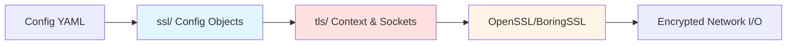
```mermaid
graph LR
    A[Config YAML] --> B[ssl/ Config Objects]
    B --> C[tls/ Context & Sockets]
    C --> D[OpenSSL/BoringSSL]
    D --> E[Encrypted Network I/O]
    
    style B fill:#e1f5ff
    style C fill:#ffe1e1
    style D fill:#fff4e6
```

---

## Architectural Overview

### High-Level System Design

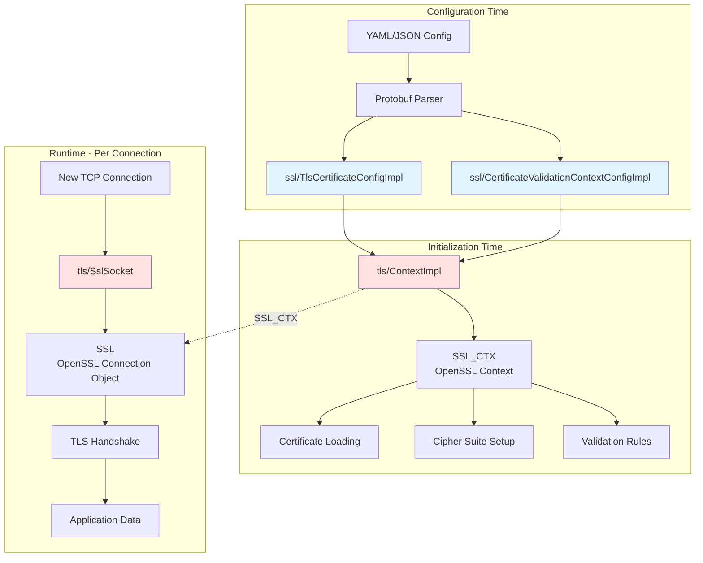
```mermaid
graph TB
    subgraph "Configuration Time"
        A[YAML/JSON Config] --> B[Protobuf Parser]
        B --> C[ssl/TlsCertificateConfigImpl]
        B --> D[ssl/CertificateValidationContextConfigImpl]
    end
    
    subgraph "Initialization Time"
        C --> E[tls/ContextImpl]
        D --> E
        E --> F[SSL_CTX<br/>OpenSSL Context]
        F --> G[Certificate Loading]
        F --> H[Cipher Suite Setup]
        F --> I[Validation Rules]
    end
    
    subgraph "Runtime - Per Connection"
        J[New TCP Connection] --> K[tls/SslSocket]
        K --> L[SSL<br/>OpenSSL Connection Object]
        E -.SSL_CTX.-> L
        
        L --> M[TLS Handshake]
        M --> N[Application Data]
    end
    
    style C fill:#e1f5ff
    style D fill:#e1f5ff
    style E fill:#ffe1e1
    style K fill:#ffe1e1
```

### Layer Responsibilities

#### Configuration Layer (`ssl/`)
```
┌────────────────────────────────────────────┐
│  Configuration Layer (Immutable)           │
├────────────────────────────────────────────┤
│  • Parse protobuf configuration            │
│  • Validate certificate paths/data         │
│  • Store certificate chains                │
│  • Store private keys (or references)      │
│  • Define validation rules                 │
│  • Certificate matching logic              │
│  • NO cryptographic operations             │
│  • NO OpenSSL API calls                    │
└────────────────────────────────────────────┘
```

#### Implementation Layer (`tls/`)
```
┌────────────────────────────────────────────┐
│  Implementation Layer (Stateful)           │
├────────────────────────────────────────────┤
│  • Wrap OpenSSL/BoringSSL APIs             │
│  • Manage SSL_CTX lifecycle                │
│  • Execute TLS handshakes                  │
│  • Perform encryption/decryption           │
│  • Certificate selection (SNI/ALPN)        │
│  • Session management                      │
│  • OCSP stapling                           │
│  • All cryptographic operations            │
└────────────────────────────────────────────┘
```

---

## The ssl/ Folder - Configuration Layer

### Directory Structure

```
ssl/
├── BUILD
├── SSL_CONFIG_ARCHITECTURE.md          # Documentation
├── tls_certificate_config_impl.h       # Certificate configuration
├── tls_certificate_config_impl.cc
├── certificate_validation_context_config_impl.h  # Validation configuration
├── certificate_validation_context_config_impl.cc
└── matching/                            # Certificate matching
    ├── subject_matcher.h
    ├── san_matcher.h
    └── ...
```

### Core Classes

#### 1. TlsCertificateConfigImpl

**Purpose:** Represents a TLS certificate + private key pair.

**Class Hierarchy:**
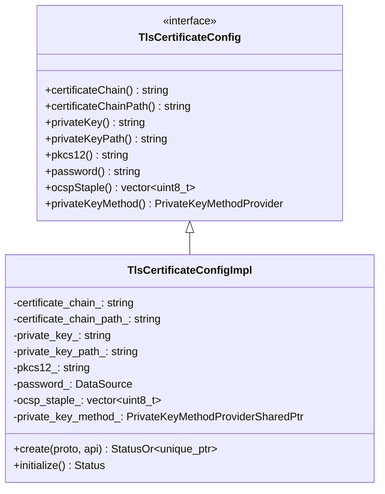
```mermaid
classDiagram
    class TlsCertificateConfig {
        <<interface>>
        +certificateChain() string
        +certificateChainPath() string
        +privateKey() string
        +privateKeyPath() string
        +pkcs12() string
        +password() string
        +ocspStaple() vector~uint8_t~
        +privateKeyMethod() PrivateKeyMethodProvider
    }
    
    class TlsCertificateConfigImpl {
        -certificate_chain_: string
        -certificate_chain_path_: string
        -private_key_: string
        -private_key_path_: string
        -pkcs12_: string
        -password_: DataSource
        -ocsp_staple_: vector~uint8_t~
        -private_key_method_: PrivateKeyMethodProviderSharedPtr
        +create(proto, api) StatusOr~unique_ptr~
        +initialize() Status
    }
    
    TlsCertificateConfig <|-- TlsCertificateConfigImpl
```

**Implementation Details:**

```cpp
// source/common/ssl/tls_certificate_config_impl.h
namespace Ssl {

class TlsCertificateConfigImpl : public TlsCertificateConfig {
public:
    // Factory method - creates and validates config
    static absl::StatusOr<std::unique_ptr<TlsCertificateConfigImpl>> 
    create(const envoy::extensions::transport_sockets::tls::v3::TlsCertificate& config,
           Api::Api& api);

    // Initialize - loads certificate data
    absl::Status initialize();

    // Accessors for certificate data
    const std::string& certificateChain() const override { return certificate_chain_; }
    const std::string& certificateChainPath() const override { return certificate_chain_path_; }
    
    // Accessors for private key
    const std::string& privateKey() const override { return private_key_; }
    const std::string& privateKeyPath() const override { return private_key_path_; }
    
    // PKCS12 bundle (alternative to separate cert+key)
    const std::string& pkcs12() const override { return pkcs12_; }
    const std::string& password() const override;
    
    // OCSP stapling response
    const std::vector<uint8_t>& ocspStaple() const override { return ocsp_staple_; }
    
    // Private key provider (HSM, KMS, etc.)
    Ssl::PrivateKeyMethodProviderSharedPtr privateKeyMethod() const override {
        return private_key_method_;
    }

private:
    TlsCertificateConfigImpl(
        const envoy::extensions::transport_sockets::tls::v3::TlsCertificate& config,
        Api::Api& api);

    // Certificate chain (PEM encoded)
    std::string certificate_chain_;
    std::string certificate_chain_path_;
    
    // Private key (PEM or PKCS8 encoded)
    std::string private_key_;
    std::string private_key_path_;
    
    // Alternative: PKCS12 bundle
    std::string pkcs12_;
    Config::DataSource::RemoteAsyncDataProviderPtr password_;
    
    // OCSP stapling
    std::vector<uint8_t> ocsp_staple_;
    
    // Private key provider for HSM/KMS
    Ssl::PrivateKeyMethodProviderSharedPtr private_key_method_;
    
    Api::Api& api_;
};

} // namespace Ssl
```

**Configuration Flow:**

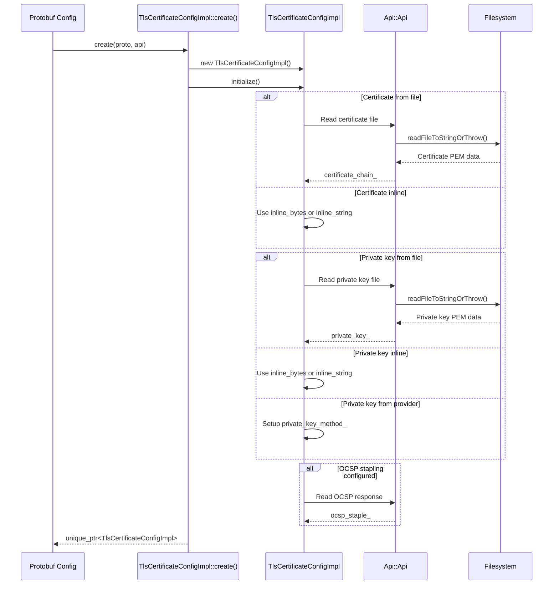
```mermaid
sequenceDiagram
    participant Config as Protobuf Config
    participant Factory as TlsCertificateConfigImpl::create()
    participant Impl as TlsCertificateConfigImpl
    participant API as Api::Api
    participant FS as Filesystem
    
    Config->>Factory: create(proto, api)
    Factory->>Impl: new TlsCertificateConfigImpl()
    
    Factory->>Impl: initialize()
    
    alt Certificate from file
        Impl->>API: Read certificate file
        API->>FS: readFileToStringOrThrow()
        FS-->>API: Certificate PEM data
        API-->>Impl: certificate_chain_
    else Certificate inline
        Impl->>Impl: Use inline_bytes or inline_string
    end
    
    alt Private key from file
        Impl->>API: Read private key file
        API->>FS: readFileToStringOrThrow()
        FS-->>API: Private key PEM data
        API-->>Impl: private_key_
    else Private key inline
        Impl->>Impl: Use inline_bytes or inline_string
    else Private key from provider
        Impl->>Impl: Setup private_key_method_
    end
    
    alt OCSP stapling configured
        Impl->>API: Read OCSP response
        API-->>Impl: ocsp_staple_
    end
    
    Factory-->>Config: unique_ptr<TlsCertificateConfigImpl>
```

---

#### 2. CertificateValidationContextConfigImpl

**Purpose:** Defines how to validate peer certificates.

**Class Hierarchy:**
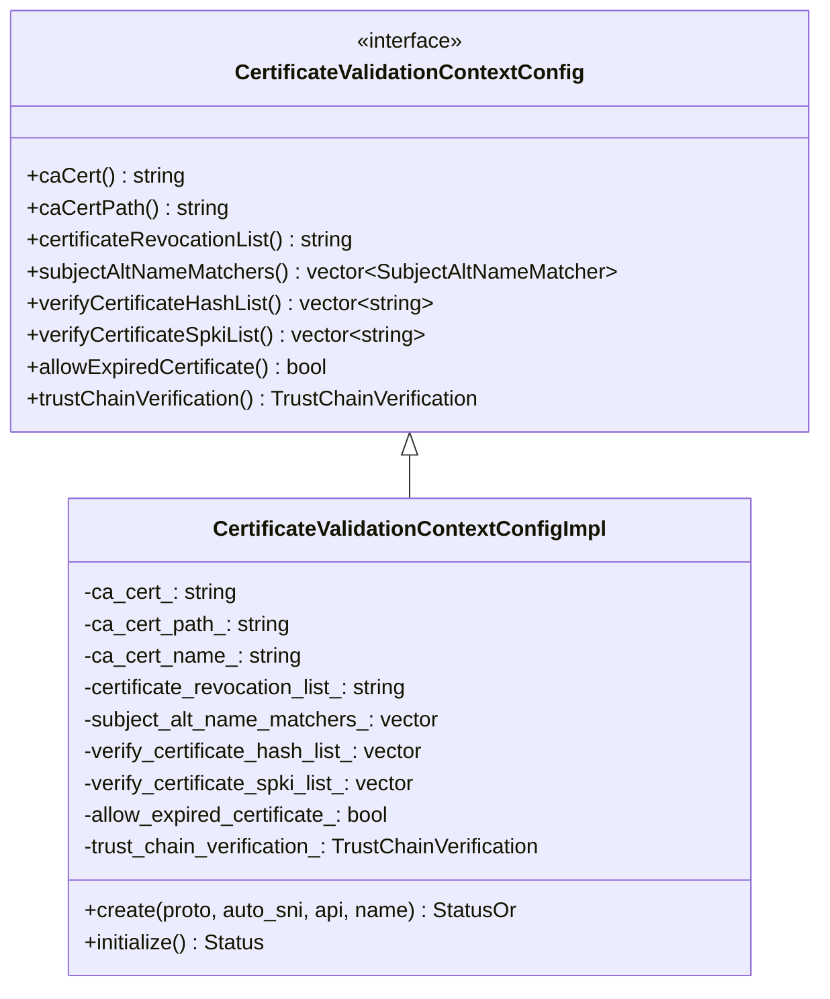
```mermaid
classDiagram
    class CertificateValidationContextConfig {
        <<interface>>
        +caCert() string
        +caCertPath() string
        +certificateRevocationList() string
        +subjectAltNameMatchers() vector~SubjectAltNameMatcher~
        +verifyCertificateHashList() vector~string~
        +verifyCertificateSpkiList() vector~string~
        +allowExpiredCertificate() bool
        +trustChainVerification() TrustChainVerification
    }
    
    class CertificateValidationContextConfigImpl {
        -ca_cert_: string
        -ca_cert_path_: string
        -ca_cert_name_: string
        -certificate_revocation_list_: string
        -subject_alt_name_matchers_: vector
        -verify_certificate_hash_list_: vector
        -verify_certificate_spki_list_: vector
        -allow_expired_certificate_: bool
        -trust_chain_verification_: TrustChainVerification
        +create(proto, auto_sni, api, name) StatusOr
        +initialize() Status
    }
    
    CertificateValidationContextConfig <|-- CertificateValidationContextConfigImpl
```

**Implementation Details:**

```cpp
// source/common/ssl/certificate_validation_context_config_impl.h
namespace Ssl {

class CertificateValidationContextConfigImpl 
    : public CertificateValidationContextConfig {
public:
    // Factory method
    static absl::StatusOr<std::unique_ptr<CertificateValidationContextConfigImpl>> 
    create(
        const envoy::extensions::transport_sockets::tls::v3::CertificateValidationContext& config,
        bool auto_sni_san_match,
        Api::Api& api,
        const std::string& ca_cert_name);

    absl::Status initialize();

    // Trusted CA certificates
    const std::string& caCert() const override { return ca_cert_; }
    const std::string& caCertPath() const override { return ca_cert_path_; }
    const std::string& caCertName() const override { return ca_cert_name_; }
    
    // Certificate Revocation List
    const std::string& certificateRevocationList() const override {
        return certificate_revocation_list_;
    }
    const std::string& certificateRevocationListPath() const override {
        return certificate_revocation_list_path_;
    }
    
    // Subject Alternative Name matching
    const std::vector<envoy::extensions::transport_sockets::tls::v3::SubjectAltNameMatcher>&
    subjectAltNameMatchers() const override {
        return subject_alt_name_matchers_;
    }
    
    // Certificate pinning (hash-based)
    const std::vector<std::string>& verifyCertificateHashList() const override {
        return verify_certificate_hash_list_;
    }
    
    // Certificate pinning (SPKI-based)
    const std::vector<std::string>& verifyCertificateSpkiList() const override {
        return verify_certificate_spki_list_;
    }
    
    // Verification options
    bool allowExpiredCertificate() const override {
        return allow_expired_certificate_;
    }
    
    TrustChainVerification trustChainVerification() const override {
        return trust_chain_verification_;
    }
    
    // Custom certificate validator
    const std::string& customValidatorConfig() const override {
        return custom_validator_config_;
    }

private:
    CertificateValidationContextConfigImpl(
        const envoy::extensions::transport_sockets::tls::v3::CertificateValidationContext& config,
        bool auto_sni_san_match,
        Api::Api& api,
        const std::string& ca_cert_name);

    // CA certificates (trust anchors)
    std::string ca_cert_;
    std::string ca_cert_path_;
    std::string ca_cert_name_;
    
    // CRL (Certificate Revocation List)
    std::string certificate_revocation_list_;
    std::string certificate_revocation_list_path_;
    
    // SAN matchers (for hostname verification)
    std::vector<envoy::extensions::transport_sockets::tls::v3::SubjectAltNameMatcher>
        subject_alt_name_matchers_;
    
    // Certificate pinning
    std::vector<std::string> verify_certificate_hash_list_;  // SHA-256 hashes
    std::vector<std::string> verify_certificate_spki_list_;  // SPKI hashes
    
    // Validation options
    bool allow_expired_certificate_{false};
    TrustChainVerification trust_chain_verification_;
    
    // Custom validator configuration
    std::string custom_validator_config_;
    
    bool auto_sni_san_match_;
    Api::Api& api_;
};

} // namespace Ssl
```

**Validation Rules Flow:**

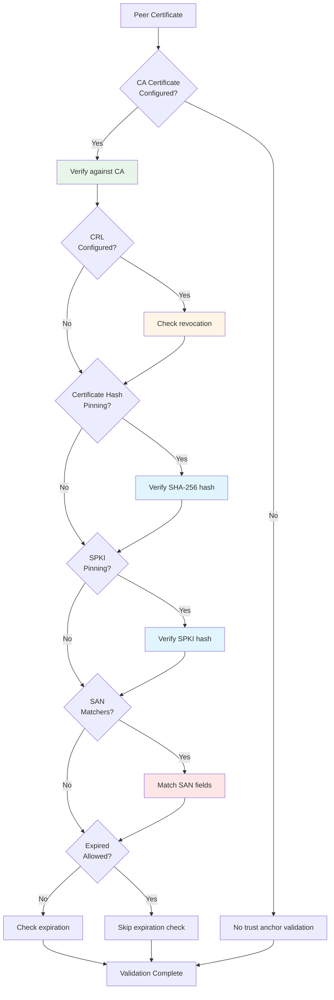
```mermaid
graph TD
    A[Peer Certificate] --> B{CA Certificate<br/>Configured?}
    B -->|Yes| C[Verify against CA]
    B -->|No| D[No trust anchor validation]
    
    C --> E{CRL<br/>Configured?}
    E -->|Yes| F[Check revocation]
    E -->|No| G{Certificate Hash<br/>Pinning?}
    
    F --> G
    G -->|Yes| H[Verify SHA-256 hash]
    G -->|No| I{SPKI<br/>Pinning?}
    
    H --> I
    I -->|Yes| J[Verify SPKI hash]
    I -->|No| K{SAN<br/>Matchers?}
    
    J --> K
    K -->|Yes| L[Match SAN fields]
    K -->|No| M{Expired<br/>Allowed?}
    
    L --> M
    M -->|No| N[Check expiration]
    M -->|Yes| O[Skip expiration check]
    
    N --> P[Validation Complete]
    O --> P
    D --> P
    
    style C fill:#e8f5e9
    style F fill:#fff4e6
    style H fill:#e1f5ff
    style J fill:#e1f5ff
    style L fill:#ffe6e6
```

---

### Certificate Matching System

**Location:** `ssl/matching/`

The matching subsystem allows dynamic certificate selection based on connection properties.

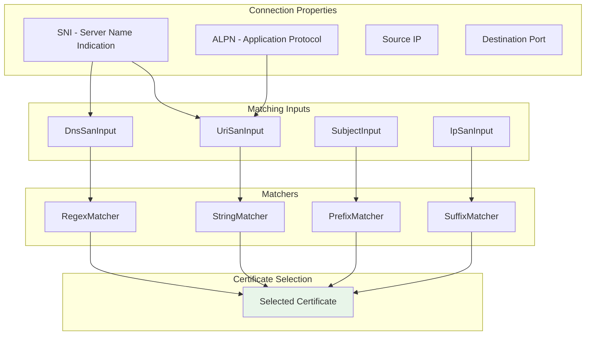
```mermaid
graph TB
    subgraph "Connection Properties"
        A[SNI - Server Name Indication]
        B[ALPN - Application Protocol]
        C[Source IP]
        D[Destination Port]
    end
    
    subgraph "Matching Inputs"
        E[UriSanInput]
        F[DnsSanInput]
        G[SubjectInput]
        H[IpSanInput]
    end
    
    subgraph "Matchers"
        I[StringMatcher]
        J[RegexMatcher]
        K[PrefixMatcher]
        L[SuffixMatcher]
    end
    
    subgraph "Certificate Selection"
        M[Selected Certificate]
    end
    
    A --> E
    A --> F
    B --> E
    
    E --> I
    F --> J
    G --> K
    H --> L
    
    I --> M
    J --> M
    K --> M
    L --> M
    
    style M fill:#e8f5e9
```

**Example Matching Config:**

```yaml
tls_certificates:
- certificate_chain:
    filename: /certs/example.com.crt
  private_key:
    filename: /certs/example.com.key
  # This cert matches *.example.com
  
- certificate_chain:
    filename: /certs/api.example.com.crt
  private_key:
    filename: /certs/api.example.com.key
  # This cert matches api.example.com specifically
```

---

## The tls/ Folder - Implementation Layer

### Directory Structure

```
tls/
├── BUILD
├── context_impl.h/cc                    # Core TLS context (SSL_CTX wrapper)
├── context_manager_impl.h/cc            # Context lifecycle management
├── client_context_impl.h/cc             # Client-side TLS context
├── server_context_impl.h/cc             # Server-side TLS context
├── ssl_socket.h/cc                      # TLS transport socket
├── client_ssl_socket.h/cc               # Client TLS socket
├── server_ssl_socket.h/cc               # Server TLS socket
├── connection_info_impl_base.h/cc       # SSL connection information
├── io_handle_bio.h/cc                   # OpenSSL BIO integration
├── cert_compression.h/cc                # Certificate compression
├── default_tls_certificate_selector.h/cc # Certificate selection
├── context_config_impl.h/cc             # Context configuration wrapper
├── stats.h                              # TLS statistics
├── utility.h/cc                         # TLS utilities
├── cert_validator/                      # Certificate validation plugins
│   ├── default_validator.h/cc
│   ├── spiffe_validator.h/cc
│   └── factory.h
├── private_key/                         # Private key providers
│   ├── private_key_manager.h/cc
│   └── ...
└── ocsp/                                # OCSP implementation
    └── ...
```

### Core Classes

#### 1. ContextImpl - TLS Context

**Purpose:** Wraps OpenSSL's `SSL_CTX`, manages TLS context lifecycle.

**Class Hierarchy:**

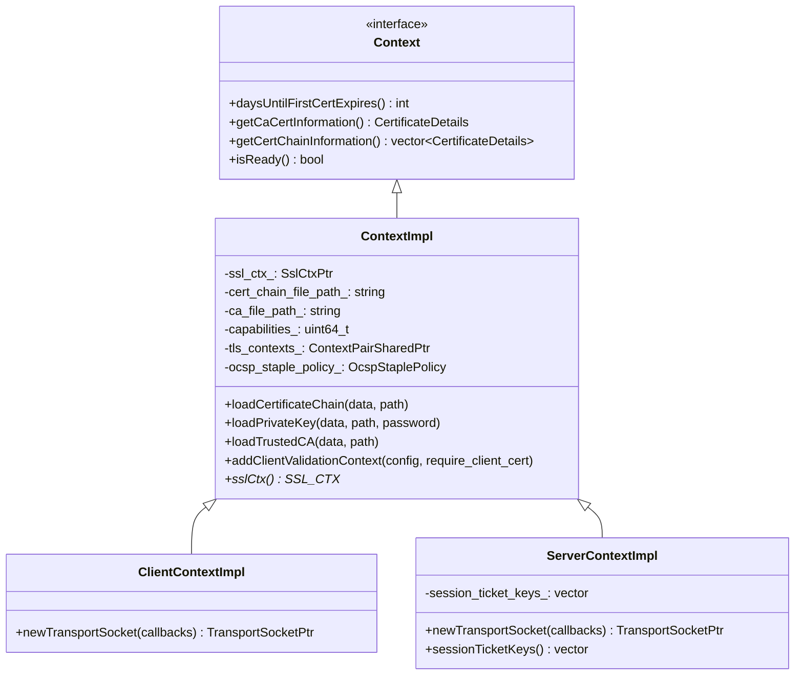
```mermaid
classDiagram
    class Context {
        <<interface>>
        +daysUntilFirstCertExpires() int
        +getCaCertInformation() CertificateDetails
        +getCertChainInformation() vector~CertificateDetails~
        +isReady() bool
    }
    
    class ContextImpl {
        -ssl_ctx_: SslCtxPtr
        -cert_chain_file_path_: string
        -ca_file_path_: string
        -capabilities_: uint64_t
        -tls_contexts_: ContextPairSharedPtr
        -ocsp_staple_policy_: OcspStaplePolicy
        +loadCertificateChain(data, path)
        +loadPrivateKey(data, path, password)
        +loadTrustedCA(data, path)
        +addClientValidationContext(config, require_client_cert)
        +sslCtx() SSL_CTX*
    }
    
    class ClientContextImpl {
        +newTransportSocket(callbacks) TransportSocketPtr
    }
    
    class ServerContextImpl {
        -session_ticket_keys_: vector
        +newTransportSocket(callbacks) TransportSocketPtr
        +sessionTicketKeys() vector
    }
    
    Context <|-- ContextImpl
    ContextImpl <|-- ClientContextImpl
    ContextImpl <|-- ServerContextImpl
```

**Implementation Details:**

```cpp
// source/common/tls/context_impl.h
namespace Tls {

class ContextImpl : public virtual Envoy::Ssl::Context,
                     protected Logger::Loggable<Logger::Id::connection> {
public:
    // Configuration and stats
    virtual size_t daysUntilFirstCertExpires() const;
    virtual absl::optional<uint32_t> secondsUntilFirstOcspResponseExpires() const;
    virtual std::string getCaFileName() const { return ca_file_path_; }
    
    // OpenSSL context accessor
    SSL_CTX* sslCtx() { return ssl_ctx_.get(); }
    
    // Capabilities (ALPN, etc.)
    virtual uint64_t capabilities() const { return capabilities_; }

protected:
    ContextImpl(Stats::Scope& scope,
                const Envoy::Ssl::ContextConfig& config,
                TimeSource& time_source);

    /**
     * Load certificate chain from data or file.
     * @param data PEM-encoded certificate chain
     * @param data_path Path to certificate file (for logging)
     */
    void loadCertificateChain(const std::string& data, const std::string& data_path);

    /**
     * Load private key.
     * @param data PEM or PKCS8-encoded private key
     * @param data_path Path to key file
     * @param password Optional password for encrypted keys
     */
    void loadPrivateKey(const std::string& data, 
                        const std::string& data_path,
                        const std::string& password);

    /**
     * Load trusted CA certificates.
     */
    void loadTrustedCA(const std::string& data, const std::string& data_path);

    /**
     * Add client certificate validation context.
     */
    void addClientValidationContext(
        const Envoy::Ssl::CertificateValidationContextConfig& config,
        bool require_client_cert);

    /**
     * Configure cipher suites.
     */
    void configureCipherSuites(const std::string& ciphers);

    /**
     * Configure ECDH curves.
     */
    void configureEcdhCurves(const std::string& curves);

    /**
     * Setup ALPN (Application-Layer Protocol Negotiation).
     */
    void setupAlpn(const std::vector<std::string>& alpn_protocols);

    // OpenSSL context
    struct SslCtxDeleter {
        void operator()(SSL_CTX* ctx) const { SSL_CTX_free(ctx); }
    };
    using SslCtxPtr = std::unique_ptr<SSL_CTX, SslCtxDeleter>;
    SslCtxPtr ssl_ctx_;

    // Certificate info
    std::string cert_chain_file_path_;
    std::string ca_file_path_;
    
    // Capabilities bitmask
    uint64_t capabilities_{0};
    
    // TLS version info
    unsigned tls_max_version_;
    
    // OCSP
    Ssl::OcspStaplePolicy ocsp_staple_policy_;
    
    // Stats
    Stats::Scope& scope_;
    ContextStatsSharedPtr stats_;
    
    TimeSource& time_source_;
};

} // namespace Tls
```

**Context Creation Flow:**

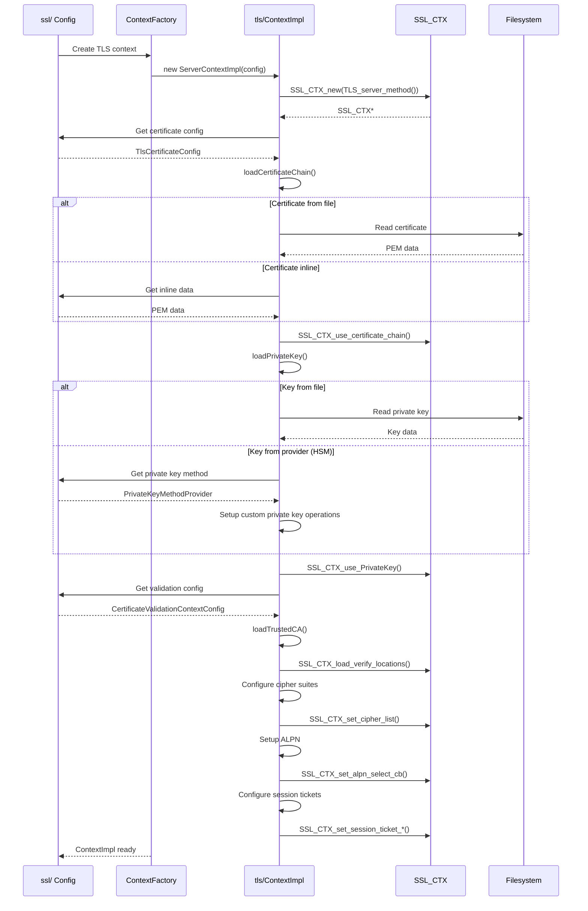
```mermaid
sequenceDiagram
    participant Config as ssl/ Config
    participant Factory as ContextFactory
    participant Context as tls/ContextImpl
    participant OpenSSL as SSL_CTX
    participant FS as Filesystem
    
    Config->>Factory: Create TLS context
    Factory->>Context: new ServerContextImpl(config)
    
    Context->>OpenSSL: SSL_CTX_new(TLS_server_method())
    OpenSSL-->>Context: SSL_CTX*
    
    Context->>Config: Get certificate config
    Config-->>Context: TlsCertificateConfig
    
    Context->>Context: loadCertificateChain()
    alt Certificate from file
        Context->>FS: Read certificate
        FS-->>Context: PEM data
    else Certificate inline
        Context->>Config: Get inline data
        Config-->>Context: PEM data
    end
    
    Context->>OpenSSL: SSL_CTX_use_certificate_chain()
    
    Context->>Context: loadPrivateKey()
    alt Key from file
        Context->>FS: Read private key
        FS-->>Context: Key data
    else Key from provider (HSM)
        Context->>Config: Get private key method
        Config-->>Context: PrivateKeyMethodProvider
        Context->>Context: Setup custom private key operations
    end
    
    Context->>OpenSSL: SSL_CTX_use_PrivateKey()
    
    Context->>Config: Get validation config
    Config-->>Context: CertificateValidationContextConfig
    
    Context->>Context: loadTrustedCA()
    Context->>OpenSSL: SSL_CTX_load_verify_locations()
    
    Context->>Context: Configure cipher suites
    Context->>OpenSSL: SSL_CTX_set_cipher_list()
    
    Context->>Context: Setup ALPN
    Context->>OpenSSL: SSL_CTX_set_alpn_select_cb()
    
    Context->>Context: Configure session tickets
    Context->>OpenSSL: SSL_CTX_set_session_ticket_*()
    
    Factory-->>Config: ContextImpl ready
```

---

#### 2. SslSocket - TLS Transport Socket

**Purpose:** Per-connection TLS state machine, wraps OpenSSL's `SSL` object.

**Class Hierarchy:**

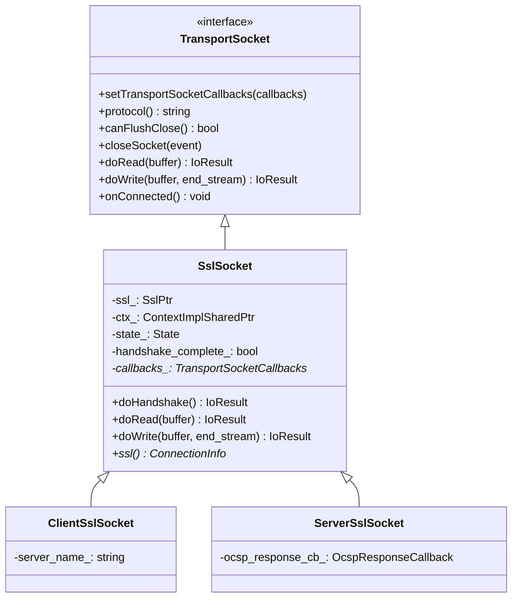
```mermaid
classDiagram
    class TransportSocket {
        <<interface>>
        +setTransportSocketCallbacks(callbacks)
        +protocol() string
        +canFlushClose() bool
        +closeSocket(event)
        +doRead(buffer) IoResult
        +doWrite(buffer, end_stream) IoResult
        +onConnected() void
    }
    
    class SslSocket {
        -ssl_: SslPtr
        -ctx_: ContextImplSharedPtr
        -state_: State
        -handshake_complete_: bool
        -callbacks_: TransportSocketCallbacks*
        +doHandshake() IoResult
        +doRead(buffer) IoResult
        +doWrite(buffer, end_stream) IoResult
        +ssl() ConnectionInfo*
    }
    
    class ClientSslSocket {
        -server_name_: string
    }
    
    class ServerSslSocket {
        -ocsp_response_cb_: OcspResponseCallback
    }
    
    TransportSocket <|-- SslSocket
    SslSocket <|-- ClientSslSocket
    SslSocket <|-- ServerSslSocket
```

**Implementation Details:**

```cpp
// source/common/tls/ssl_socket.h
namespace Tls {

class SslSocket : public Network::TransportSocket,
                   protected Logger::Loggable<Logger::Id::connection> {
public:
    SslSocket(Envoy::Ssl::ContextSharedPtr ctx,
              InitialState state,
              Network::TransportSocketCallbacks& callbacks,
              Ssl::OcspResponseCallbackPtr ocsp_response_callback);

    ~SslSocket() override;

    // TransportSocket interface
    void setTransportSocketCallbacks(Network::TransportSocketCallbacks& callbacks) override;
    std::string protocol() const override;
    absl::string_view failureReason() const override;
    bool canFlushClose() override { return handshake_complete_; }
    
    void closeSocket(Network::ConnectionEvent event) override;
    
    Network::IoResult doRead(Buffer::Instance& buffer) override;
    Network::IoResult doWrite(Buffer::Instance& buffer, bool end_stream) override;
    
    void onConnected() override;
    
    // SSL-specific
    Ssl::ConnectionInfoConstSharedPtr ssl() const override;
    
    // Handshake state
    bool peerCertificatePresented() const;
    bool peerCertificateValidated() const;

protected:
    /**
     * Perform TLS handshake.
     * @return IoResult indicating:
     *   - Action::Continue: Handshake in progress, need more I/O
     *   - Action::Close: Handshake failed
     *   - bytes_processed > 0: Handshake complete
     */
    Network::IoResult doHandshake();

    /**
     * Read encrypted data from socket, decrypt, write to buffer.
     */
    Network::IoResult readFromSocket(Buffer::Instance& buffer);

    /**
     * Read plaintext from buffer, encrypt, write to socket.
     */
    Network::IoResult writeToSocket(Buffer::Instance& buffer);

    // OpenSSL SSL object
    struct SslDeleter {
        void operator()(SSL* ssl) const { SSL_free(ssl); }
    };
    using SslPtr = std::unique_ptr<SSL, SslDeleter>;
    SslPtr ssl_;

    // TLS context (shared across connections)
    Envoy::Ssl::ContextSharedPtr ctx_;

    // Connection state
    enum class State {
        PreHandshake,      // Before TLS handshake
        HandshakeInProgress,
        HandshakeComplete,
        ShutdownSent,      // SSL_shutdown() called
        Closed
    };
    State state_{State::PreHandshake};
    
    bool handshake_complete_{false};
    
    // Connection info
    mutable Ssl::ConnectionInfoImplSharedPtr info_;
    
    // Callbacks to network layer
    Network::TransportSocketCallbacks* callbacks_{nullptr};
    
    // OCSP response callback (server-side)
    Ssl::OcspResponseCallbackPtr ocsp_response_callback_;
    
    // Failure reason (if handshake fails)
    absl::string_view failure_reason_;
};

} // namespace Tls
```

**TLS Handshake State Machine:**

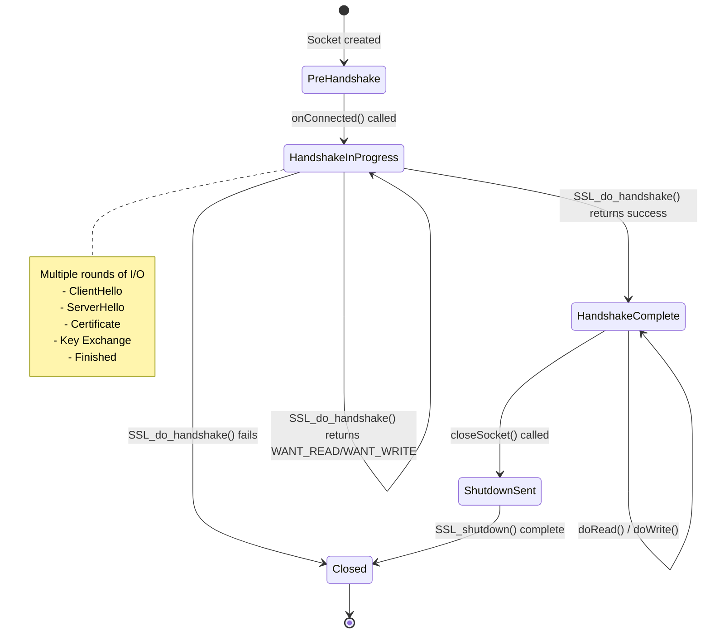
```mermaid
stateDiagram-v2
    [*] --> PreHandshake: Socket created
    
    PreHandshake --> HandshakeInProgress: onConnected() called
    
    HandshakeInProgress --> HandshakeInProgress: SSL_do_handshake() returns WANT_READ/WANT_WRITE
    HandshakeInProgress --> HandshakeComplete: SSL_do_handshake() returns success
    HandshakeInProgress --> Closed: SSL_do_handshake() fails
    
    HandshakeComplete --> HandshakeComplete: doRead() / doWrite()
    HandshakeComplete --> ShutdownSent: closeSocket() called
    
    ShutdownSent --> Closed: SSL_shutdown() complete
    
    Closed --> [*]
    
    note right of HandshakeInProgress
        Multiple rounds of I/O
        - ClientHello
        - ServerHello
        - Certificate
        - Key Exchange
        - Finished
    end note
```

**Complete Handshake Flow:**

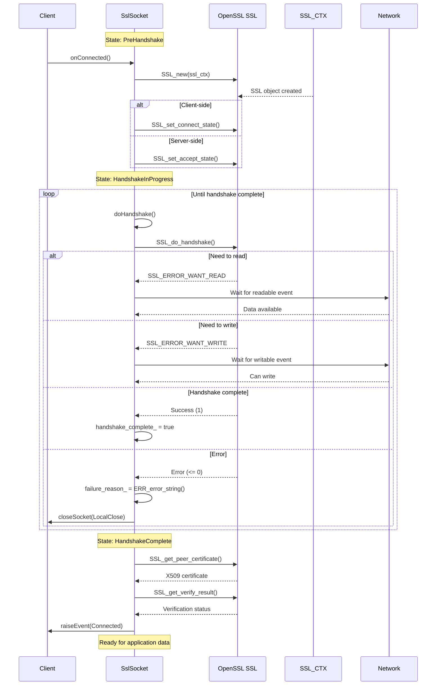
```mermaid
sequenceDiagram
    participant Client
    participant Socket as SslSocket
    participant SSL as OpenSSL SSL
    participant CTX as SSL_CTX
    participant Network
    
    Note over Socket: State: PreHandshake
    
    Client->>Socket: onConnected()
    Socket->>SSL: SSL_new(ssl_ctx)
    CTX-->>SSL: SSL object created
    
    alt Client-side
        Socket->>SSL: SSL_set_connect_state()
    else Server-side
        Socket->>SSL: SSL_set_accept_state()
    end
    
    Note over Socket: State: HandshakeInProgress
    
    loop Until handshake complete
        Socket->>Socket: doHandshake()
        Socket->>SSL: SSL_do_handshake()
        
        alt Need to read
            SSL-->>Socket: SSL_ERROR_WANT_READ
            Socket->>Network: Wait for readable event
            Network-->>Socket: Data available
        else Need to write
            SSL-->>Socket: SSL_ERROR_WANT_WRITE
            Socket->>Network: Wait for writable event
            Network-->>Socket: Can write
        else Handshake complete
            SSL-->>Socket: Success (1)
            Socket->>Socket: handshake_complete_ = true
        else Error
            SSL-->>Socket: Error (<= 0)
            Socket->>Socket: failure_reason_ = ERR_error_string()
            Socket->>Client: closeSocket(LocalClose)
        end
    end
    
    Note over Socket: State: HandshakeComplete
    
    Socket->>SSL: SSL_get_peer_certificate()
    SSL-->>Socket: X509 certificate
    
    Socket->>SSL: SSL_get_verify_result()
    SSL-->>Socket: Verification status
    
    Socket->>Client: raiseEvent(Connected)
    
    Note over Socket: Ready for application data
```

---

#### 3. ClientContextImpl & ServerContextImpl

**Client Context:**

```cpp
// source/common/tls/client_context_impl.h
namespace Tls {

class ClientContextImpl : public ContextImpl, public Envoy::Ssl::ClientContext {
public:
    ClientContextImpl(Stats::Scope& scope,
                      const Envoy::Ssl::ClientContextConfig& config,
                      TimeSource& time_source);

    // Create client SSL socket
    Network::TransportSocketPtr createTransportSocket(
        Network::TransportSocketOptionsConstSharedPtr options,
        Upstream::HostDescriptionConstSharedPtr host) const override;

private:
    // Client-specific initialization
    void setupClientContext();
    
    // Session resumption
    void setupSessionResumption();
    
    // Maximum certificate chain depth
    uint32_t max_verify_depth_;
};

} // namespace Tls
```

**Server Context:**

```cpp
// source/common/tls/server_context_impl.h
namespace Tls {

class ServerContextImpl : public ContextImpl, public Envoy::Ssl::ServerContext {
public:
    ServerContextImpl(Stats::Scope& scope,
                      const Envoy::Ssl::ServerContextConfig& config,
                      const std::vector<std::string>& server_names,
                      TimeSource& time_source);

    // Create server SSL socket
    Network::TransportSocketPtr createTransportSocket(
        Network::TransportSocketOptionsConstSharedPtr options,
        Upstream::HostDescriptionConstSharedPtr host) const override;
    
    // Session ticket keys (for session resumption)
    const std::vector<Ssl::ServerContextConfig::SessionTicketKey>&
    sessionTicketKeys() const override {
        return session_ticket_keys_;
    }

private:
    // Server-specific initialization
    void setupServerContext();
    
    // Session tickets
    void setupSessionTickets();
    
    // SNI callback
    static int serverNameCallback(SSL* ssl, int* out_alert, void* arg);
    
    // ALPN callback
    static int alpnSelectCallback(SSL* ssl,
                                  const unsigned char** out,
                                  unsigned char* outlen,
                                  const unsigned char* in,
                                  unsigned int inlen,
                                  void* arg);
    
    // Session ticket keys
    std::vector<Ssl::ServerContextConfig::SessionTicketKey> session_ticket_keys_;
    
    // Server names (for SNI)
    std::vector<std::string> server_names_;
};

} // namespace Tls
```

---

## Interaction Patterns

### Pattern 1: Downstream (Server-Side) TLS

**Complete Flow from Config to Runtime:**

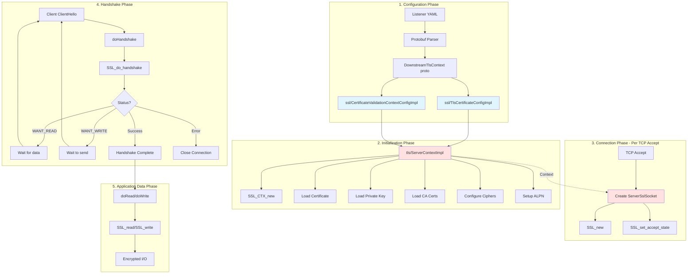
```mermaid
graph TB
    subgraph "1. Configuration Phase"
        A[Listener YAML] --> B[Protobuf Parser]
        B --> C[DownstreamTlsContext proto]
        
        C --> D[ssl/TlsCertificateConfigImpl]
        C --> E[ssl/CertificateValidationContextConfigImpl]
    end
    
    subgraph "2. Initialization Phase"
        D --> F[tls/ServerContextImpl]
        E --> F
        
        F --> G[SSL_CTX_new]
        F --> H[Load Certificate]
        F --> I[Load Private Key]
        F --> J[Load CA Certs]
        F --> K[Configure Ciphers]
        F --> L[Setup ALPN]
    end
    
    subgraph "3. Connection Phase - Per TCP Accept"
        M[TCP Accept] --> N[Create ServerSslSocket]
        F -.Context.-> N
        
        N --> O[SSL_new]
        N --> P[SSL_set_accept_state]
    end
    
    subgraph "4. Handshake Phase"
        Q[Client ClientHello] --> R[doHandshake]
        R --> S[SSL_do_handshake]
        S --> T{Status?}
        T -->|WANT_READ| U[Wait for data]
        T -->|WANT_WRITE| V[Wait to send]
        T -->|Success| W[Handshake Complete]
        T -->|Error| X[Close Connection]
        
        U --> Q
        V --> Q
    end
    
    subgraph "5. Application Data Phase"
        W --> Y[doRead/doWrite]
        Y --> Z[SSL_read/SSL_write]
        Z --> AA[Encrypted I/O]
    end
    
    style D fill:#e1f5ff
    style E fill:#e1f5ff
    style F fill:#ffe1e1
    style N fill:#ffe1e1
```

### Pattern 2: Upstream (Client-Side) TLS

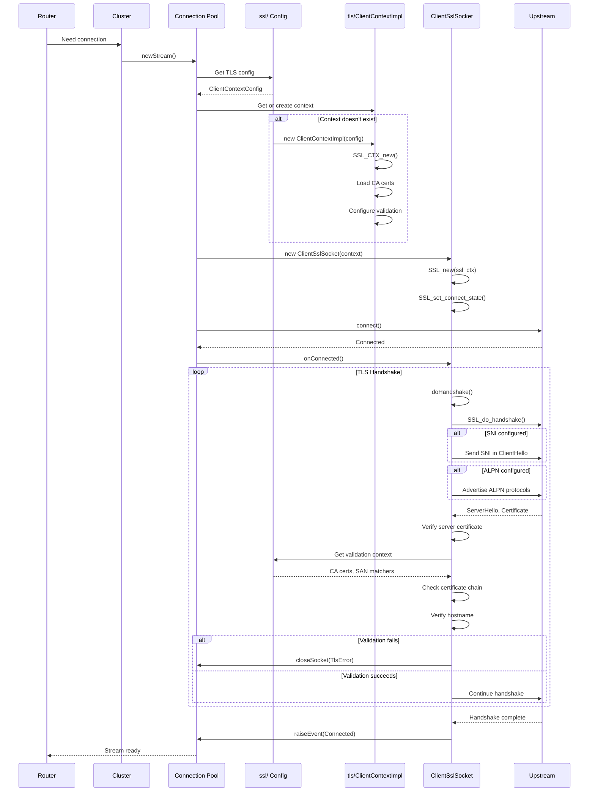
```mermaid
sequenceDiagram
    participant Router
    participant Cluster
    participant Pool as Connection Pool
    participant Config as ssl/ Config
    participant Context as tls/ClientContextImpl
    participant Socket as ClientSslSocket
    participant Upstream
    
    Router->>Cluster: Need connection
    Cluster->>Pool: newStream()
    
    Pool->>Config: Get TLS config
    Config-->>Pool: ClientContextConfig
    
    Pool->>Context: Get or create context
    alt Context doesn't exist
        Config->>Context: new ClientContextImpl(config)
        Context->>Context: SSL_CTX_new()
        Context->>Context: Load CA certs
        Context->>Context: Configure validation
    end
    
    Pool->>Socket: new ClientSslSocket(context)
    Socket->>Socket: SSL_new(ssl_ctx)
    Socket->>Socket: SSL_set_connect_state()
    
    Pool->>Upstream: connect()
    Upstream-->>Pool: Connected
    
    Pool->>Socket: onConnected()
    
    loop TLS Handshake
        Socket->>Socket: doHandshake()
        Socket->>Upstream: SSL_do_handshake()
        
        alt SNI configured
            Socket->>Upstream: Send SNI in ClientHello
        end
        
        alt ALPN configured
            Socket->>Upstream: Advertise ALPN protocols
        end
        
        Upstream-->>Socket: ServerHello, Certificate
        
        Socket->>Socket: Verify server certificate
        Socket->>Config: Get validation context
        Config-->>Socket: CA certs, SAN matchers
        
        Socket->>Socket: Check certificate chain
        Socket->>Socket: Verify hostname
        
        alt Validation fails
            Socket->>Pool: closeSocket(TlsError)
        else Validation succeeds
            Socket->>Upstream: Continue handshake
        end
    end
    
    Upstream-->>Socket: Handshake complete
    Socket->>Pool: raiseEvent(Connected)
    
    Pool-->>Router: Stream ready
```

### Pattern 3: Mutual TLS (mTLS)

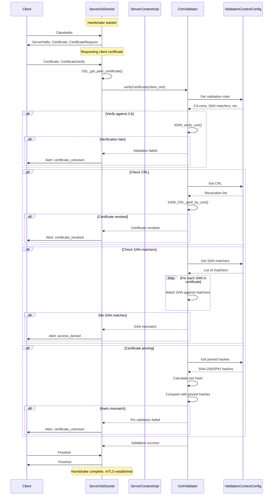
```mermaid
sequenceDiagram
    participant Client
    participant Server as ServerSslSocket
    participant CTX as ServerContextImpl
    participant Validator as CertValidator
    participant Config as ValidationContextConfig
    
    Note over Server: Handshake started
    
    Client->>Server: ClientHello
    Server->>Client: ServerHello, Certificate, CertificateRequest
    
    Note over Server: Requesting client certificate
    
    Client->>Server: Certificate, CertificateVerify
    
    Server->>Server: SSL_get_peer_certificate()
    Server->>Validator: verifyCertificate(client_cert)
    
    Validator->>Config: Get validation rules
    Config-->>Validator: CA certs, SAN matchers, etc.
    
    alt Verify against CA
        Validator->>Validator: X509_verify_cert()
        alt Verification fails
            Validator-->>Server: Validation failed
            Server->>Client: Alert: certificate_unknown
        end
    end
    
    alt Check CRL
        Validator->>Config: Get CRL
        Config-->>Validator: Revocation list
        Validator->>Validator: X509_CRL_get0_by_cert()
        alt Certificate revoked
            Validator-->>Server: Certificate revoked
            Server->>Client: Alert: certificate_revoked
        end
    end
    
    alt Check SAN matchers
        Validator->>Config: Get SAN matchers
        Config-->>Validator: List of matchers
        
        loop For each SAN in certificate
            Validator->>Validator: Match SAN against matchers
        end
        
        alt No SAN matches
            Validator-->>Server: SAN mismatch
            Server->>Client: Alert: access_denied
        end
    end
    
    alt Certificate pinning
        Validator->>Config: Get pinned hashes
        Config-->>Validator: SHA-256/SPKI hashes
        
        Validator->>Validator: Calculate cert hash
        Validator->>Validator: Compare with pinned hashes
        
        alt Hash mismatch
            Validator-->>Server: Pin validation failed
            Server->>Client: Alert: certificate_unknown
        end
    end
    
    Validator-->>Server: Validation success
    
    Client->>Server: Finished
    Server->>Client: Finished
    
    Note over Server: Handshake complete, mTLS established
```

---

## Complete Code Flows

### Flow 1: Server Certificate Loading

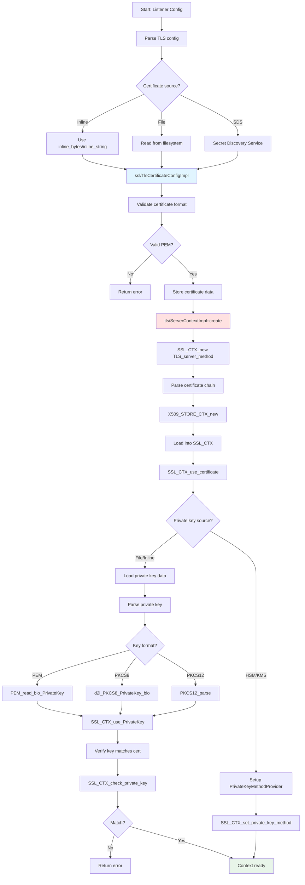
```mermaid
graph TD
    A[Start: Listener Config] --> B[Parse TLS config]
    B --> C{Certificate source?}
    
    C -->|Inline| D[Use inline_bytes/inline_string]
    C -->|File| E[Read from filesystem]
    C -->|SDS| F[Secret Discovery Service]
    
    D --> G[ssl/TlsCertificateConfigImpl]
    E --> G
    F --> G
    
    G --> H[Validate certificate format]
    H --> I{Valid PEM?}
    I -->|No| J[Return error]
    I -->|Yes| K[Store certificate data]
    
    K --> L[tls/ServerContextImpl::create]
    L --> M[SSL_CTX_new TLS_server_method]
    
    M --> N[Parse certificate chain]
    N --> O[X509_STORE_CTX_new]
    O --> P[Load into SSL_CTX]
    P --> Q[SSL_CTX_use_certificate]
    
    Q --> R{Private key source?}
    R -->|File/Inline| S[Load private key data]
    R -->|HSM/KMS| T[Setup PrivateKeyMethodProvider]
    
    S --> U[Parse private key]
    U --> V{Key format?}
    V -->|PEM| W[PEM_read_bio_PrivateKey]
    V -->|PKCS8| X[d2i_PKCS8_PrivateKey_bio]
    V -->|PKCS12| Y[PKCS12_parse]
    
    W --> Z[SSL_CTX_use_PrivateKey]
    X --> Z
    Y --> Z
    
    T --> AA[SSL_CTX_set_private_key_method]
    
    Z --> AB[Verify key matches cert]
    AB --> AC[SSL_CTX_check_private_key]
    
    AC --> AD{Match?}
    AD -->|No| AE[Return error]
    AD -->|Yes| AF[Context ready]
    
    AA --> AF
    
    style G fill:#e1f5ff
    style L fill:#ffe1e1
    style AF fill:#e8f5e9
```

### Flow 2: TLS Handshake - Detailed

```cpp
// Pseudo-code for TLS handshake flow

Network::IoResult SslSocket::doHandshake() {
    ASSERT(state_ == State::HandshakeInProgress);
    
    // Call OpenSSL handshake
    int rc = SSL_do_handshake(ssl_.get());
    
    if (rc == 1) {
        // Handshake succeeded
        handshake_complete_ = true;
        state_ = State::HandshakeComplete;
        
        // Get peer certificate
        X509* peer_cert = SSL_get_peer_certificate(ssl_.get());
        
        // Get verification result
        long verify_result = SSL_get_verify_result(ssl_.get());
        
        if (verify_result != X509_V_OK) {
            failure_reason_ = X509_verify_cert_error_string(verify_result);
            return {PostIoAction::Close, 0, false};
        }
        
        // Extract connection info
        info_ = std::make_shared<ConnectionInfoImpl>(ssl_.get());
        
        // Notify callbacks
        callbacks_->raiseEvent(Network::ConnectionEvent::Connected);
        
        return {PostIoAction::KeepOpen, 0, false};
    }
    
    // Get error
    int ssl_error = SSL_get_error(ssl_.get(), rc);
    
    switch (ssl_error) {
    case SSL_ERROR_WANT_READ:
        // Need more data from network
        return {PostIoAction::KeepOpen, 0, false};
        
    case SSL_ERROR_WANT_WRITE:
        // Need to send data to network
        return {PostIoAction::KeepOpen, 0, false};
        
    case SSL_ERROR_WANT_PRIVATE_KEY_OPERATION:
        // Async private key operation in progress (HSM/KMS)
        return {PostIoAction::KeepOpen, 0, false};
        
    default:
        // Handshake failed
        failure_reason_ = getSSLError();
        state_ = State::Closed;
        return {PostIoAction::Close, 0, false};
    }
}
```

### Flow 3: Certificate Selection (SNI)

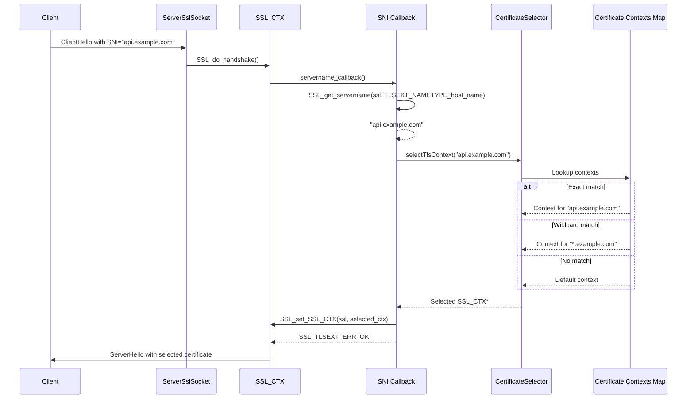
```mermaid
sequenceDiagram
    participant Client
    participant Socket as ServerSslSocket
    participant OpenSSL as SSL_CTX
    participant Callback as SNI Callback
    participant Selector as CertificateSelector
    participant Contexts as Certificate Contexts Map
    
    Client->>Socket: ClientHello with SNI="api.example.com"
    Socket->>OpenSSL: SSL_do_handshake()
    
    OpenSSL->>Callback: servername_callback()
    
    Callback->>Callback: SSL_get_servername(ssl, TLSEXT_NAMETYPE_host_name)
    Callback-->>Callback: "api.example.com"
    
    Callback->>Selector: selectTlsContext("api.example.com")
    
    Selector->>Contexts: Lookup contexts
    
    alt Exact match
        Contexts-->>Selector: Context for "api.example.com"
    else Wildcard match
        Contexts-->>Selector: Context for "*.example.com"
    else No match
        Contexts-->>Selector: Default context
    end
    
    Selector-->>Callback: Selected SSL_CTX*
    
    Callback->>OpenSSL: SSL_set_SSL_CTX(ssl, selected_ctx)
    
    Callback-->>OpenSSL: SSL_TLSEXT_ERR_OK
    
    OpenSSL->>Client: ServerHello with selected certificate
```

---

## Advanced Topics

### Topic 1: Private Key Providers (HSM/KMS)

**Architecture:**

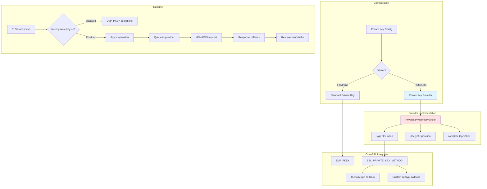
```mermaid
graph TB
    subgraph "Configuration"
        A[Private Key Config] --> B{Source?}
        B -->|File/Inline| C[Standard Private Key]
        B -->|HSM/KMS| D[Private Key Provider]
    end
    
    subgraph "Provider Implementation"
        D --> E[PrivateKeyMethodProvider]
        E --> F[sign Operation]
        E --> G[decrypt Operation]
        E --> H[complete Operation]
    end
    
    subgraph "OpenSSL Integration"
        C --> I[EVP_PKEY]
        F --> J[SSL_PRIVATE_KEY_METHOD]
        J --> K[Custom sign callback]
        J --> L[Custom decrypt callback]
    end
    
    subgraph "Runtime"
        M[TLS Handshake] --> N{Need private key op?}
        N -->|Standard| O[EVP_PKEY operations]
        N -->|Provider| P[Async operation]
        
        P --> Q[Queue to provider]
        Q --> R[HSM/KMS request]
        R --> S[Response callback]
        S --> T[Resume handshake]
    end
    
    style D fill:#e1f5ff
    style E fill:#ffe1e1
```

**Implementation Example:**

```cpp
// Custom private key provider
class KmsPrivateKeyMethodProvider : public Ssl::PrivateKeyMethodProvider {
public:
    // Sign operation (RSA/ECDSA)
    void sign(SSL* ssl,
              uint8_t* out, size_t* out_len, size_t max_out,
              uint16_t signature_algorithm,
              const uint8_t* in, size_t in_len) override {
        
        // Prepare KMS request
        auto request = prepareKmsSignRequest(signature_algorithm, in, in_len);
        
        // Async call to KMS
        kms_client_->signAsync(request, [ssl, out, out_len, this](auto response) {
            // Copy signature to output
            memcpy(out, response.signature.data(), response.signature.size());
            *out_len = response.signature.size();
            
            // Resume TLS handshake
            SSL_do_handshake(ssl);
        });
        
        // Return pending
        throw Ssl::PrivateKeyOperationPending();
    }
    
    // Decrypt operation (RSA)
    void decrypt(SSL* ssl,
                 uint8_t* out, size_t* out_len, size_t max_out,
                 const uint8_t* in, size_t in_len) override {
        // Similar async KMS decrypt
    }
};
```

---

### Topic 2: OCSP Stapling

**Flow:**

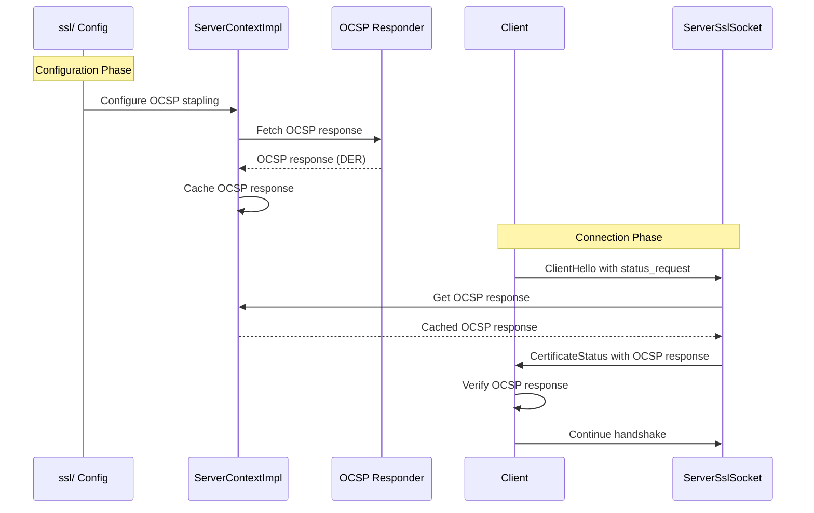
```mermaid
sequenceDiagram
    participant Config as ssl/ Config
    participant Server as ServerContextImpl
    participant OCSP as OCSP Responder
    participant Client
    participant Socket as ServerSslSocket
    
    Note over Config: Configuration Phase
    Config->>Server: Configure OCSP stapling
    Server->>OCSP: Fetch OCSP response
    OCSP-->>Server: OCSP response (DER)
    Server->>Server: Cache OCSP response
    
    Note over Client,Socket: Connection Phase
    Client->>Socket: ClientHello with status_request
    Socket->>Server: Get OCSP response
    Server-->>Socket: Cached OCSP response
    Socket->>Client: CertificateStatus with OCSP response
    Client->>Client: Verify OCSP response
    Client->>Socket: Continue handshake
```

**Configuration:**

```yaml
tls_certificates:
- certificate_chain:
    filename: /certs/server.crt
  private_key:
    filename: /certs/server.key
  ocsp_staple:
    filename: /certs/server.ocsp
    # Or use dynamic fetching
```

---

### Topic 3: Certificate Validation Plugins

**Architecture:**

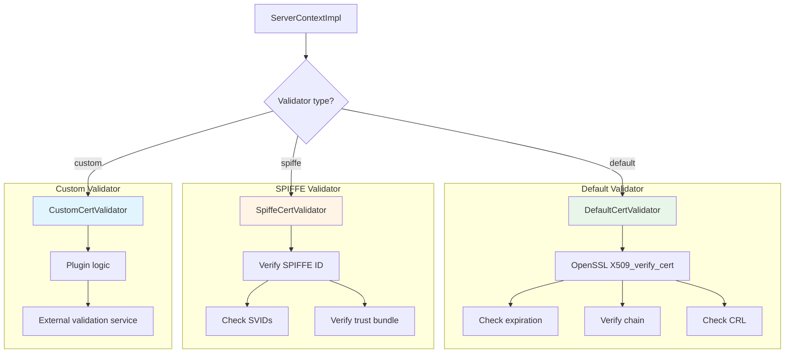
```mermaid
graph TB
    subgraph "Default Validator"
        A[DefaultCertValidator] --> B[OpenSSL X509_verify_cert]
        B --> C[Check expiration]
        B --> D[Verify chain]
        B --> E[Check CRL]
    end
    
    subgraph "SPIFFE Validator"
        F[SpiffeCertValidator] --> G[Verify SPIFFE ID]
        G --> H[Check SVIDs]
        G --> I[Verify trust bundle]
    end
    
    subgraph "Custom Validator"
        J[CustomCertValidator] --> K[Plugin logic]
        K --> L[External validation service]
    end
    
    M[ServerContextImpl] --> N{Validator type?}
    N -->|default| A
    N -->|spiffe| F
    N -->|custom| J
    
    style A fill:#e8f5e9
    style F fill:#fff4e6
    style J fill:#e1f5ff
```

**Plugin Interface:**

```cpp
// source/common/tls/cert_validator/cert_validator.h
class CertValidator {
public:
    virtual ~CertValidator() = default;
    
    /**
     * Validate certificate.
     * @param cert Certificate to validate
     * @param context Additional validation context
     * @return ValidationResult (success, error, or async pending)
     */
    virtual ValidationResults doVerifyCert(
        X509* cert,
        const std::vector<std::string>& verify_san_list,
        const ValidationContext& context) PURE;
    
    /**
     * Update validation context (e.g., new CRL).
     */
    virtual void updateContext(const ValidationContext& context) PURE;
};
```

---

### Topic 4: Session Resumption

**Session Tickets (Stateless):**

```mermaid
sequenceDiagram
    participant Client1 as Client (1st connection)
    participant Server
    participant Client2 as Client (2nd connection)
    
    Note over Client1,Server: Initial Connection
    Client1->>Server: ClientHello
    Server->>Client1: ServerHello, Certificate, ...
    Client1->>Server: Key Exchange
    
    Note over Server: Generate session ticket
    Server->>Server: Encrypt session state with ticket key
    Server->>Client1: NewSessionTicket
    Client1->>Client1: Store session ticket
    
    Note over Client1,Server: Full handshake complete
    
    Note over Client2,Server: Resumed Connection
    Client2->>Server: ClientHello + session ticket
    Server->>Server: Decrypt session ticket
    Server->>Server: Verify ticket validity
    
    alt Ticket valid
        Server->>Client2: ServerHello (abbreviated handshake)
        Server->>Client2: ChangeCipherSpec, Finished
        Client2->>Server: ChangeCipherSpec, Finished
        Note over Client2,Server: Handshake resumed (no cert exchange)
    else Ticket invalid
        Server->>Client2: Full handshake
    end
```

**Session IDs (Stateful):**

```cpp
// Session cache in ServerContextImpl
class ServerContextImpl {
private:
    // Session cache
    SSL_SESSION_ID_CACHE* session_cache_;
    
    // Session ticket keys
    std::vector<SessionTicketKey> session_ticket_keys_;
    
    // Rotate session ticket keys
    void rotateSessionTicketKeys() {
        // Generate new key
        SessionTicketKey new_key = generateSessionTicketKey();
        
        // Add to front (for encryption)
        session_ticket_keys_.insert(session_ticket_keys_.begin(), new_key);
        
        // Keep last N keys (for decryption of old tickets)
        if (session_ticket_keys_.size() > MAX_KEYS) {
            session_ticket_keys_.resize(MAX_KEYS);
        }
        
        // Update SSL_CTX
        SSL_CTX_set_tlsext_ticket_keys(ssl_ctx_.get(), ...);
    }
};
```

---

## Design Rationale

### Why Separate ssl/ and tls/?

#### 1. **Separation of Concerns**

```
Configuration (ssl/)         Implementation (tls/)
    ↓                              ↓
What to do                    How to do it
    ↓                              ↓
Parse & validate              Execute & manage
    ↓                              ↓
Immutable state               Mutable state
    ↓                              ↓
Config-time                   Runtime
```

#### 2. **Testability**

```cpp
// Testing certificate configuration (ssl/)
TEST(TlsCertificateConfigTest, LoadFromFile) {
    // Mock filesystem
    NiceMock<Api::MockApi> api;
    EXPECT_CALL(api.file_system_, fileReadToEnd(_))
        .WillOnce(Return(cert_pem_data));
    
    // Test config parsing - no OpenSSL needed!
    auto config = TlsCertificateConfigImpl::create(proto, api).value();
    EXPECT_EQ(config->certificateChain(), cert_pem_data);
}

// Testing TLS operations (tls/)
TEST(SslSocketTest, Handshake) {
    // Need actual OpenSSL context and SSL objects
    auto context = createTestContext();
    auto socket = std::make_unique<SslSocket>(context, ...);
    
    // Perform handshake
    auto result = socket->doHandshake();
    EXPECT_EQ(result.action_, PostIoAction::KeepOpen);
}
```

#### 3. **Compilation Speed**

```
ssl/ files:
  - #include protobuf headers
  - No OpenSSL headers
  - Fast compilation

tls/ files:
  - #include OpenSSL headers (slow)
  - Complex template instantiations
  - Slower compilation
```

#### 4. **Clear Interfaces**

```cpp
// Interface boundary (in envoy/ssl/)
class TlsCertificateConfig {  // Interface
    virtual const std::string& certificateChain() const PURE;
    virtual const std::string& privateKey() const PURE;
};

// Config implementation (in source/common/ssl/)
class TlsCertificateConfigImpl : public TlsCertificateConfig {
    // Parse and store config
};

// Runtime implementation (in source/common/tls/)
class ContextImpl {
    // Uses TlsCertificateConfig interface
    void loadCertificateChain(const TlsCertificateConfig& config);
};
```

#### 5. **Flexibility**

```
Could potentially swap out:
- OpenSSL → BoringSSL → WolfSSL
- Only tls/ would change
- ssl/ config layer remains same
```

---

## Performance Considerations

### 1. Context Caching

**Problem:** Creating SSL_CTX is expensive (100-500ms).

**Solution:** Cache contexts, reuse across connections.

```cpp
class ContextManagerImpl {
private:
    // Cache by context config hash
    std::unordered_map<std::string, ContextSharedPtr> contexts_;
    
public:
    ContextSharedPtr getContext(const ContextConfig& config) {
        auto hash = computeHash(config);
        
        auto it = contexts_.find(hash);
        if (it != contexts_.end()) {
            return it->second;  // Reuse cached context
        }
        
        // Create new context
        auto context = std::make_shared<ServerContextImpl>(config);
        contexts_[hash] = context;
        return context;
    }
};
```

### 2. Session Resumption Impact

| Metric | Full Handshake | Resumed Session |
|--------|----------------|-----------------|
| Round trips | 2-3 | 1 |
| CPU (server) | 100% | ~5% |
| CPU (client) | 100% | ~5% |
| Latency | 100-300ms | 1-10ms |

**Recommendation:** Always enable session tickets for public-facing services.

### 3. Certificate Chain Length

```
Chain length impact:
- 1 cert (self-signed):      10KB, 50ms parse
- 2 certs (intermediate):    20KB, 80ms parse
- 3+ certs (full chain):     30KB+, 120ms+ parse

Recommendation: Use shortest valid chain
```

### 4. Private Key Operations

| Operation | RSA 2048 | RSA 4096 | ECDSA P-256 | ECDSA P-384 |
|-----------|----------|----------|-------------|-------------|
| Sign | 1.5ms | 8ms | 0.2ms | 0.3ms |
| Verify | 0.05ms | 0.1ms | 0.5ms | 0.7ms |

**Recommendation:** Prefer ECDSA for better performance.

---

## Testing Strategies

### 1. Configuration Testing (ssl/)

```cpp
class TlsCertificateConfigTest : public testing::Test {
protected:
    // Test certificate loading from file
    void testLoadFromFile() {
        // Mock API
        NiceMock<Api::MockApi> api;
        
        // Test valid certificate
        auto config = TlsCertificateConfigImpl::create(valid_proto, api);
        ASSERT_TRUE(config.ok());
        
        // Verify fields
        EXPECT_FALSE(config->certificateChain().empty());
        EXPECT_FALSE(config->privateKey().empty());
    }
    
    // Test validation errors
    void testInvalidConfig() {
        // Missing certificate
        auto config = TlsCertificateConfigImpl::create(invalid_proto, api);
        ASSERT_FALSE(config.ok());
        EXPECT_THAT(config.status().message(), HasSubstr("certificate_chain"));
    }
};
```

### 2. TLS Handshake Testing (tls/)

```cpp
class SslSocketTest : public testing::Test {
protected:
    // Setup test certificates
    void SetUp() override {
        server_ctx_ = createTestServerContext();
        client_ctx_ = createTestClientContext();
    }
    
    // Test successful handshake
    void testHandshakeSuccess() {
        auto server = createServerSocket(server_ctx_);
        auto client = createClientSocket(client_ctx_);
        
        // Simulate handshake
        performHandshake(server, client);
        
        // Verify handshake succeeded
        EXPECT_TRUE(server->handshakeComplete());
        EXPECT_TRUE(client->handshakeComplete());
        
        // Verify connection info
        auto info = server->ssl();
        EXPECT_EQ(info->tlsVersion(), "TLSv1.3");
    }
    
    // Test certificate validation failure
    void testValidationFailure() {
        auto server = createServerSocket(server_ctx_);
        auto client = createClientSocket(client_ctx_with_strict_validation);
        
        // Use self-signed cert (should fail)
        performHandshake(server, client);
        
        EXPECT_FALSE(client->handshakeComplete());
        EXPECT_THAT(client->failureReason(), HasSubstr("certificate verify failed"));
    }
};
```

### 3. Integration Testing

```cpp
class TlsIntegrationTest : public BaseIntegrationTest {
public:
    // Test full request/response with TLS
    void testHttpsRequest() {
        // Setup listener with TLS
        config_helper_.addConfigModifier([](envoy::config::bootstrap::v3::Bootstrap& bootstrap) {
            auto* listener = bootstrap.mutable_static_resources()->mutable_listeners(0);
            auto* filter_chain = listener->mutable_filter_chains(0);
            
            // Add TLS transport socket
            auto* tls_context = filter_chain->mutable_transport_socket()
                ->mutable_typed_config()
                ->mutable_value();
            // ... configure TLS ...
        });
        
        initialize();
        
        // Make HTTPS request
        codec_client_ = makeHttpsConnection(lookupPort("https"));
        auto response = codec_client_->makeHeaderOnlyRequest(default_request_headers_);
        
        ASSERT_TRUE(response->waitForEndStream());
        EXPECT_EQ("200", response->headers().Status()->value().getStringView());
    }
};
```

---

## Summary

### Key Takeaways

1. **`ssl/` is Configuration, `tls/` is Implementation**
   - `ssl/` parses protobuf, stores config, no crypto
   - `tls/` wraps OpenSSL, performs crypto operations

2. **Layered Architecture**
   - Clear separation enables testability
   - Config layer is immutable, implementation is stateful
   - Interface boundaries allow flexibility

3. **Lifecycle**
   - Config objects created at initialization
   - Contexts created per listener/cluster
   - Sockets created per connection

4. **Performance**
   - Context caching is critical
   - Session resumption provides 10-20x improvement
   - ECDSA is faster than RSA

5. **Extensibility**
   - Private key providers for HSM/KMS
   - Certificate validators for custom logic
   - Pluggable architecture

### Directory Quick Reference

```
ssl/                                    tls/
├── Configuration layer                ├── Implementation layer
├── 6 files                           ├── 46 files
├── Namespace: Envoy::Ssl             ├── Namespace: Envoy::Tls
├── No OpenSSL dependencies           ├── Heavy OpenSSL usage
├── Immutable config objects          ├── Stateful runtime objects
└── Parse & validate                  └── Execute & manage

Common pattern:
ssl/ Config → tls/ Context → tls/ Socket → OpenSSL → Network I/O
```

This architecture enables Envoy to provide a flexible, performant, and secure TLS implementation that can adapt to various deployment scenarios while maintaining clean separation of concerns. 🔒
