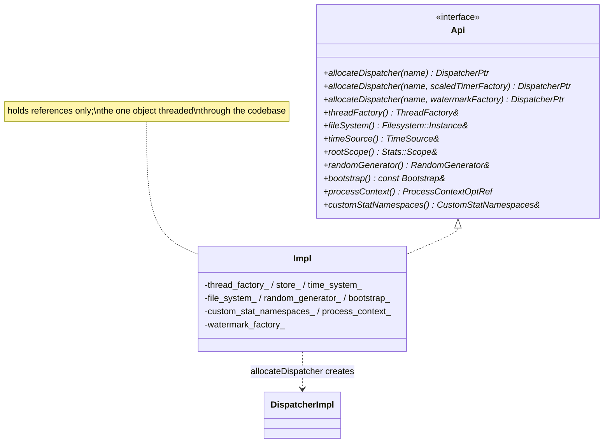
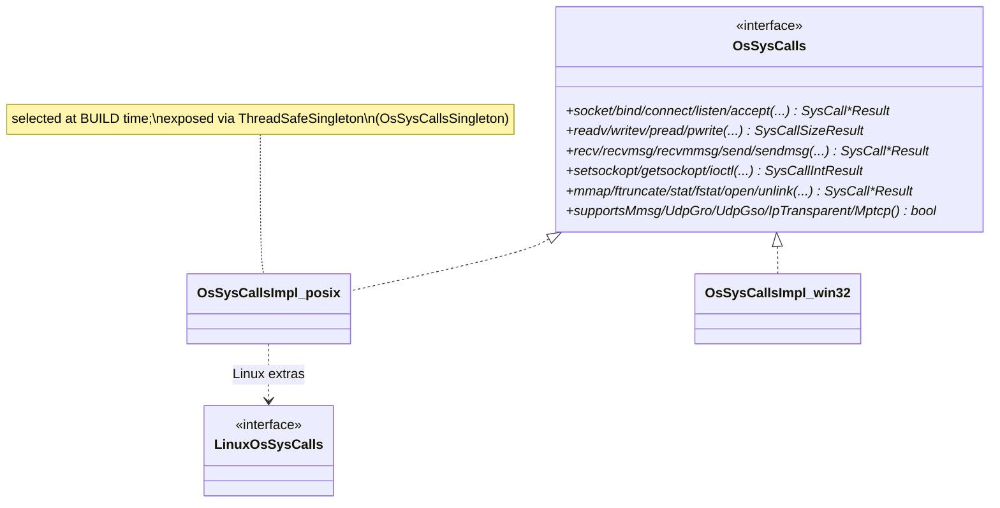
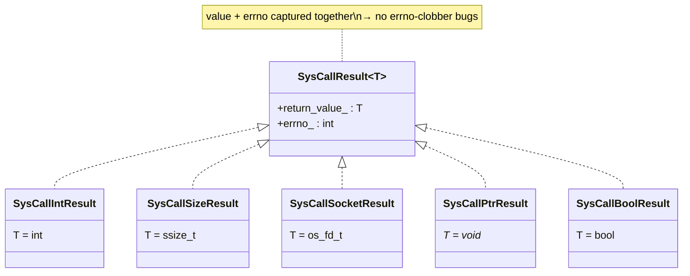

# Api — class hierarchy (UML)

UML-style Mermaid for the `Api::Api` facade and the `OsSysCalls` wrapper. See [`OVERVIEW.md`](OVERVIEW.md) for
behavior.

---

## The capability facade

---

## The OS syscall wrapper

---

## The result type

---

## Relationship summary

| Relationship | Type | Meaning |
|---|---|---|
| `Impl` → `Api` | implements | The concrete facade. |
| `Impl` → `DispatcherImpl` | factory | `allocateDispatcher` builds per-thread loops. |
| `OsSysCallsImpl_*` → `OsSysCalls` | implements | Per-platform syscall bindings (build-time selected). |
| `OsSysCallsImpl_posix` → `LinuxOsSysCalls` | extends | Linux-only syscalls. |
| `SysCall*Result` → `SysCallResult<T>` | alias | Typed result carrying value + errno. |
| `OsSysCallsSingleton` → `OsSysCallsImpl` | singleton | Global access point (swappable in tests). |
