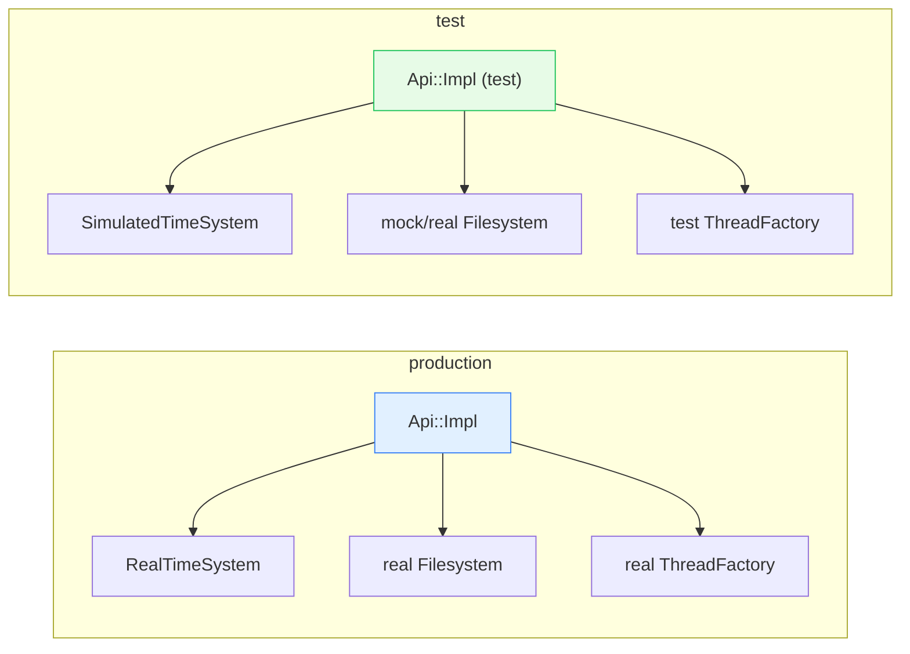
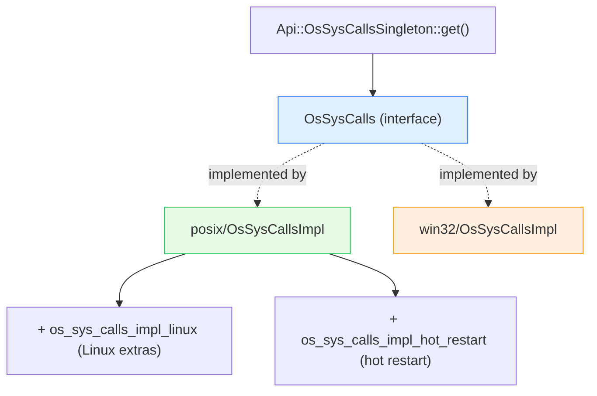

# Api — architecture & design

Two layers — the `Api::Api` capability facade and the `OsSysCalls` syscall wrapper — and how each achieves
portability and testability. Read [`README.md`](README.md) first.

---

## Part 1 — `Api::Impl`, the capability facade

`Api::Impl` is a thin holder of references plus a dispatcher factory. It holds **no** logic; its value is
*indirection*.

```cpp
Impl(ThreadFactory&, Stats::Store&, Event::TimeSystem&, Filesystem::Instance&,
     Random::RandomGenerator&, const Bootstrap&, ProcessContextOptRef = {},
     Buffer::WatermarkFactorySharedPtr = nullptr);
```

The only methods that *do* something beyond returning a reference are the `allocateDispatcher` overloads:

```cpp
DispatcherPtr Impl::allocateDispatcher(const std::string& name) {
  return std::make_unique<Event::DispatcherImpl>(name, *this, time_system_, watermark_factory_);
}
```

Note it passes `*this` — the dispatcher itself takes an `Api::Api&`, so the dispatcher can in turn reach the
thread factory, filesystem, and time source it needs (see `DispatcherImpl`'s constructors in
[`../event/`](../event/OVERVIEW.md)). Three overloads let callers customize the **scaled-timer factory** (for
overload control) or the **watermark buffer factory** (for flow control) per dispatcher.

### Why a facade at all?



A component takes `Api::Api&` and never knows whether the clock is real or fast-forwarded, whether the filesystem
is a real disk or a memory fake. This is **the** lever that makes Envoy's time-dependent and I/O-dependent code
unit-testable without sleeping or touching disk. `Api::createApiForTest(...)` is the common test helper.

---

## Part 2 — `OsSysCalls`, the syscall wrapper

Every raw OS call Envoy makes goes through the `OsSysCalls` interface. A representative slice:

```
bind, connect, listen, accept, socket, socketpair, shutdown, close,
writev, readv, pwrite, pread, send, recv, recvmsg, recvmmsg, sendmsg,
setsockopt, getsockopt, getsockname, getpeername, ioctl,
mmap, ftruncate, stat, fstat, open, unlink, linkat, mkstemp, chmod,
gethostname, socketTcpInfo, getifaddrs, supportsMmsg/UdpGro/UdpGso/IpTransparent/Mptcp …
```

### The result type: value + errno together

Raw syscalls set the global `errno`, which is fragile across abstraction boundaries (anything could clobber it
before you read it). So every wrapper returns a **`SysCallResult<T>`** that captures both atomically:

```cpp
template <typename T> struct SysCallResult {
  T   return_value_;   // the syscall return code
  int errno_;          // errno captured immediately after the call
};

using SysCallIntResult    = SysCallResult<int>;
using SysCallSizeResult   = SysCallResult<ssize_t>;
using SysCallSocketResult = SysCallResult<os_fd_t>;
using SysCallPtrResult    = SysCallResult<void*>;
using SysCallBoolResult   = SysCallResult<bool>;
```

So a caller writes:

```cpp
const Api::SysCallSizeResult result = os_sys_calls.recvmsg(fd, &msg, 0);
if (result.return_value_ < 0) { handle(result.errno_); }   // errno is reliable here
```

No more "was errno clobbered between the call and the check?" bugs.

### Capability probing

Beyond wrapping calls, `OsSysCalls` exposes **feature probes** — `supportsMmsg()`, `supportsUdpGro()`,
`supportsUdpGso()`, `supportsIpTransparent()`, `supportsMptcp()`, `supportsGetifaddrs()`. These let Envoy use a
fast kernel feature when present and fall back gracefully when not, without `#ifdef`s scattered through the
network stack.

---

## Part 3 — platform selection



- **Which impl compiles** is chosen at **build time** by Bazel (`posix/` vs `win32/`). There is no runtime
  platform `if`; the unused platform's code isn't even linked.
- **Linux extras** (`os_sys_calls_impl_linux`) cover Linux-only options like certain socket features.
- **Hot-restart syscalls** (`os_sys_calls_impl_hot_restart`) cover the shared-memory / fd-passing dance used when
  a new Envoy binary takes over from an old one.
- Access is via a **`ThreadSafeSingleton<OsSysCallsImpl>`** (`OsSysCallsSingleton`) — see
  [`../singleton/`](../singleton/README.md). Tests can swap the singleton to intercept syscalls.

---

## Design themes

| Theme | How `api/` expresses it |
|---|---|
| **Dependency injection** | `Api::Api&` carries capabilities instead of N constructor params. |
| **Testability** | swap the `TimeSystem`/`Filesystem` behind the facade; swap the syscall singleton. |
| **Portability** | one `OsSysCalls` interface, build-time platform impl, capability probes. |
| **Reliable errors** | `SysCallResult<T>` bundles value + errno, eliminating clobber bugs. |

---

## What this folder does *not* do

- It does **not** implement the filesystem, event loop, or stats — it *vends* them
  ([`../filesystem/`](../filesystem/README.md), [`../event/`](../event/README.md)).
- It is **not** the I/O error model for buffers/sockets — that's `Api::IoError` /
  `Api::IoCallResult` (documented with [`../filesystem/`](../filesystem/OVERVIEW.md)). `SysCallResult` here is the
  *lower* raw-syscall layer.

---

## Cross-references

- [`CLASS_HIERARCHY.md`](CLASS_HIERARCHY.md) — UML.
- [`../event/OVERVIEW.md`](../event/OVERVIEW.md) — `allocateDispatcher` feeds the dispatcher.
- [`../singleton/README.md`](../singleton/README.md) — `ThreadSafeSingleton` powering `OsSysCallsSingleton`.
