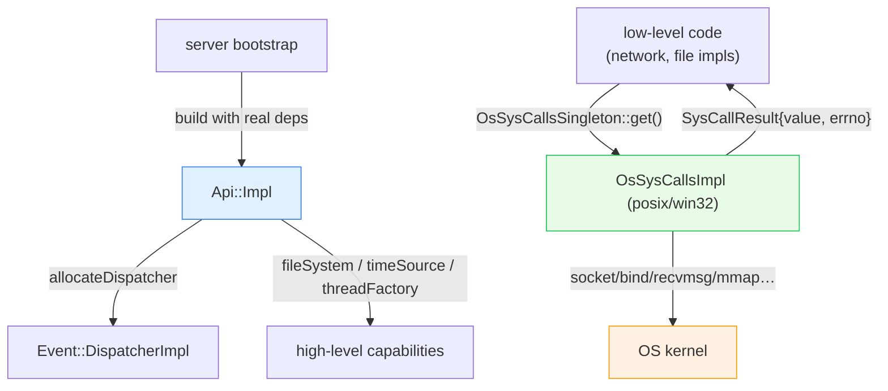

# `source/common/api/` — the system-abstraction surface (`Api::Api` + OS syscalls)

This folder is the **seam between Envoy and the operating system**. It has two layers:

1. **`Api::Api`** — the "give me a system capability" facade. Almost every component is constructed with an
   `Api::Api&` and uses it to get a `Dispatcher`, the `ThreadFactory`, the `Filesystem`, the `TimeSource`, the
   root stats scope, and the random generator. It's the single object you thread through the codebase instead of
   passing six separate dependencies.
2. **`OsSysCalls`** — a pure-virtual wrapper over **every raw OS system call** Envoy makes (`socket`, `bind`,
   `recvmsg`, `mmap`, `stat`, `setsockopt`, …), with per-platform implementations (posix / win32 / linux).
   Exposed as a `ThreadSafeSingleton`.

> **Why both?** `Api::Api` is about *injecting* high-level capabilities (testability: tests pass a fake `Api`).
> `OsSysCalls` is about *portability and interception* of the low-level calls (Linux vs Windows differences, and
> the ability to substitute syscalls in tests). Together they mean almost no Envoy code calls libc/winsock
> directly.

---

## The one-paragraph mental model

At startup the server builds one `Api::Impl` wired with the real thread factory, stats store, time system,
filesystem, random generator, and bootstrap config. Components receive `Api::Api&` and call `allocateDispatcher()`
to get their per-thread event loop, or `fileSystem()` / `timeSource()` / `threadFactory()` for those
capabilities. Separately, low-level code that must touch the OS calls
`Api::OsSysCallsSingleton::get().socket(...)` etc.; the singleton resolves to `OsSysCallsImpl` for the current
platform, and each call returns a `SysCall*Result` carrying both the return value **and** the captured `errno`.

---

## Folder map

```
source/common/api/
├── BUILD
├── api_impl.{h,cc}              # Api::Impl — the capability facade (allocateDispatcher, fileSystem, …)
├── posix/
│   ├── os_sys_calls_impl.{h,cc}            # OsSysCallsImpl — POSIX syscalls
│   ├── os_sys_calls_impl_linux.{h,cc}      # Linux-specific extras
│   └── os_sys_calls_impl_hot_restart.{h,cc}# hot-restart-specific syscalls
└── win32/
    └── os_sys_calls_impl.{h,cc}            # OsSysCallsImpl — Windows (winsock) syscalls
```

The **interfaces** live under `envoy/api/`:

```
envoy/api/
├── api.h                    # Api::Api
├── os_sys_calls.h           # OsSysCalls
├── os_sys_calls_common.h    # SysCallResult<T> + aliases
├── os_sys_calls_linux.h     # Linux extension interface
├── os_sys_calls_hot_restart.h
└── io_error.h               # IoError (shared with filesystem)
```

---

## What `Api::Api` hands you

| Method | Returns | Used for |
|---|---|---|
| `allocateDispatcher(name)` | `Event::DispatcherPtr` | a thread's event loop ([`../event/`](../event/README.md)) |
| `threadFactory()` | `Thread::ThreadFactory&` | spawning OS threads |
| `fileSystem()` | `Filesystem::Instance&` | file I/O ([`../filesystem/`](../filesystem/README.md)) |
| `timeSource()` | `TimeSource&` | clocks (real vs simulated) |
| `rootScope()` | `Stats::Scope&` | the stats tree root |
| `randomGenerator()` | `Random::RandomGenerator&` | randomness |
| `bootstrap()` | `const Bootstrap&` | the startup config |
| `processContext()` | `ProcessContextOptRef` | embedder-provided context |

---

## Per-topic table

| Topic | Document | Source |
|---|---|---|
| The facade, the syscall wrapper, the result type, platform selection | [`OVERVIEW.md`](OVERVIEW.md) | all files |
| Class hierarchy (UML) | [`CLASS_HIERARCHY.md`](CLASS_HIERARCHY.md) | interfaces + impls |

---

## Big picture



---

## Reading order

1. This `README.md` — the two layers and why they exist.
2. [`OVERVIEW.md`](OVERVIEW.md) — facade construction, the syscall result pattern, platform selection.
3. [`CLASS_HIERARCHY.md`](CLASS_HIERARCHY.md) — UML map.
