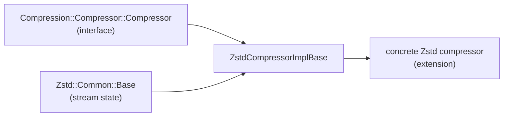

# Compression — Overview

> Source: `source/common/compression/zstd/...`. Interfaces:
> `envoy/compression/compressor/compressor.h`, `envoy/compression/decompressor/decompressor.h`.

This folder holds the **shared library code** for compression algorithms — the reusable base
classes that concrete compressor/decompressor extensions build on. The user-facing extensions
(the compressor/decompressor *factories*, and the HTTP compression filter) live under
`source/extensions/compression/`; what's here is the common machinery, currently the **Zstd**
streaming base.

> Note: gzip and brotli have their library code under `source/extensions/compression/`; only the
> Zstd common base currently lives in `source/common/compression/`.

## The compressor abstraction

Envoy models compression as streaming over a `Buffer::Instance`:

```cpp
// envoy/compression/compressor/compressor.h
class Compressor {
  virtual void compress(Buffer::Instance& buffer, State state) PURE;  // Flush or Finish
};
```

A compressor consumes the bytes in `buffer`, compresses them, and replaces the buffer contents
with the compressed output. `State` distinguishes a mid-stream flush from the final block.

## The Zstd common base

| Class | File | Role |
|-------|------|------|
| `Zstd::Common::Base` | `zstd/common/base.h` | Holds a Zstd stream's I/O state — the chunk buffer plus `ZSTD_inBuffer`/`ZSTD_outBuffer` — and the `setInput()` / `getOutput()` helpers that move bytes between Envoy `Buffer`s and Zstd. |
| `Zstd::Compressor::ZstdCompressorImplBase` | `zstd/compressor/zstd_compressor_impl_base.h` | Implements `Compressor::compress()` on top of a `ZSTD_CCtx`, with `compressPreprocess` / `compressProcess` / `compressPostprocess` hooks left abstract for subclasses. |



`ZstdCompressorImplBase::compress()` drives the Zstd context chunk by chunk via `process()`,
calling the three virtual hooks so a concrete implementation can customize pre/post handling
(e.g. dictionary setup, checksum, frame finalization). The base owns the `ZSTD_CCtx` (with the
proper `ZSTD_freeCCtx` deleter), compression level, checksum flag, and strategy.

## Mental model

`source/common/compression/` is the **toolkit layer**, not a feature: it provides the streaming
buffer plumbing and the `Compressor`-interface skeleton (currently for Zstd) so that the actual
compressor/decompressor extensions and the HTTP compression filter stay small. To follow a
real, configurable compressor end to end, start from `source/extensions/compression/` and the
compressor filter, which instantiate these bases.
