# Config Architecture - source/common/config

## Overview

The `source/common/config` directory contains the core configuration management infrastructure for Envoy. This module handles:

- **xDS (x Discovery Service) subscriptions** - Dynamic configuration updates
- **Config providers** - Static and dynamic configuration delivery
- **Resource management** - Configuration lifecycle and validation
- **Subscription factories** - Creating and managing config subscriptions

## Architecture Overview

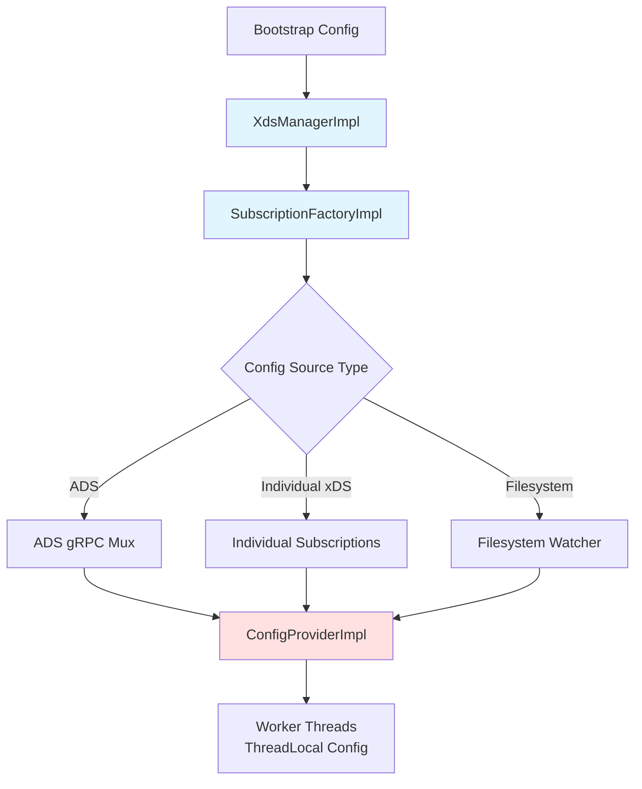
```mermaid
graph TD
    A[Bootstrap Config] --> B[XdsManagerImpl]
    B --> C[SubscriptionFactoryImpl]
    C --> D{Config Source Type}
    D -->|ADS| E[ADS gRPC Mux]
    D -->|Individual xDS| F[Individual Subscriptions]
    D -->|Filesystem| G[Filesystem Watcher]
    
    E --> H[ConfigProviderImpl]
    F --> H
    G --> H
    
    H --> I[Worker Threads<br/>ThreadLocal Config]
    
    style B fill:#e1f5ff
    style C fill:#e1f5ff
    style H fill:#ffe1e1
```

## Key Components

### 1. XdsManagerImpl (`xds_manager_impl.h/cc`)

**Purpose**: Central manager for all xDS configuration sources and subscriptions.

**Responsibilities**:
- Initialize ADS (Aggregated Discovery Service) connections
- Manage multiple xDS authorities
- Create and lifecycle subscriptions
- Pause/resume xDS updates

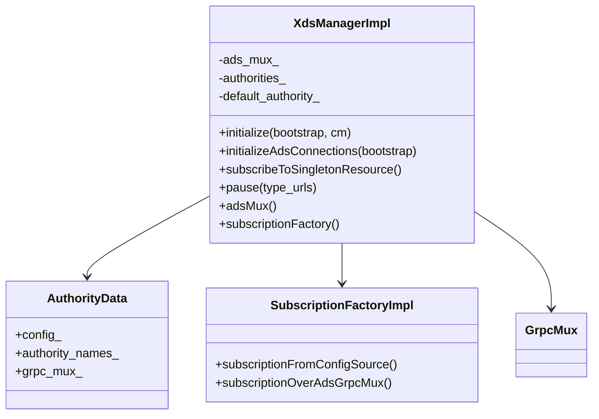
```mermaid
classDiagram
    class XdsManagerImpl {
        +initialize(bootstrap, cm)
        +initializeAdsConnections(bootstrap)
        +subscribeToSingletonResource()
        +pause(type_urls)
        +adsMux()
        +subscriptionFactory()
        -ads_mux_
        -authorities_
        -default_authority_
    }
    
    class AuthorityData {
        +config_
        +authority_names_
        +grpc_mux_
    }
    
    class SubscriptionFactoryImpl {
        +subscriptionFromConfigSource()
        +subscriptionOverAdsGrpcMux()
    }
    
    XdsManagerImpl --> AuthorityData
    XdsManagerImpl --> SubscriptionFactoryImpl
    XdsManagerImpl --> GrpcMux
```

**Key Concepts**:
- **Authority**: Represents an xDS server that provides configuration
- **ADS Mux**: Multiplexes multiple resource type subscriptions over a single gRPC connection
- **Default Authority**: Fallback authority when resource authority doesn't match

**Example Flow**:
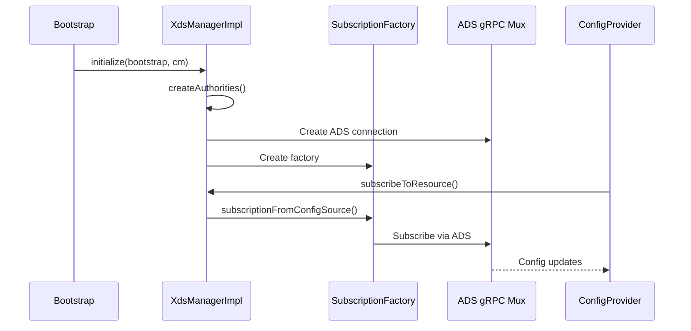
```mermaid
sequenceDiagram
    participant Boot as Bootstrap
    participant XdsMgr as XdsManagerImpl
    participant SubFactory as SubscriptionFactory
    participant AdsMux as ADS gRPC Mux
    participant Provider as ConfigProvider
    
    Boot->>XdsMgr: initialize(bootstrap, cm)
    XdsMgr->>XdsMgr: createAuthorities()
    XdsMgr->>AdsMux: Create ADS connection
    XdsMgr->>SubFactory: Create factory
    
    Provider->>XdsMgr: subscribeToResource()
    XdsMgr->>SubFactory: subscriptionFromConfigSource()
    SubFactory->>AdsMux: Subscribe via ADS
    AdsMux-->>Provider: Config updates
```

**File**: `source/common/config/xds_manager_impl.{h,cc}`

---

### 2. SubscriptionFactoryImpl (`subscription_factory_impl.h/cc`)

**Purpose**: Factory for creating xDS subscriptions based on config source type.

**Subscription Types**:
- **ADS (Aggregated Discovery Service)**: All resources over single gRPC stream
- **Individual xDS**: Separate subscriptions per resource type (LDS, CDS, RDS, EDS, SDS)
- **Filesystem**: Watch local files for config changes
- **REST**: Legacy REST-based xDS (deprecated)

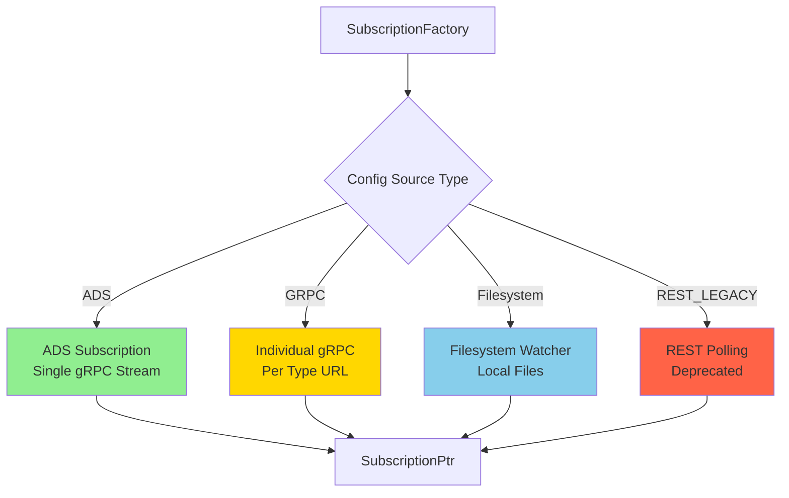
```mermaid
flowchart TD
    A[SubscriptionFactory] --> B{Config Source Type}
    B -->|ADS| C[ADS Subscription<br/>Single gRPC Stream]
    B -->|GRPC| D[Individual gRPC<br/>Per Type URL]
    B -->|Filesystem| E[Filesystem Watcher<br/>Local Files]
    B -->|REST_LEGACY| F[REST Polling<br/>Deprecated]
    
    C --> G[SubscriptionPtr]
    D --> G
    E --> G
    F --> G
    
    style C fill:#90EE90
    style D fill:#FFD700
    style E fill:#87CEEB
    style F fill:#FF6347
```

**Key Methods**:
- `subscriptionFromConfigSource()`: Create subscription from config
- `subscriptionOverAdsGrpcMux()`: Create subscription using existing ADS mux
- `collectionSubscriptionFromUrl()`: Create collection-based subscription

**Example Configuration**:
```yaml
# ADS Configuration
dynamic_resources:
  ads_config:
    api_type: GRPC
    transport_api_version: V3
    grpc_services:
      - envoy_grpc:
          cluster_name: xds_cluster

# Individual xDS
dynamic_resources:
  cds_config:
    api_config_source:
      api_type: GRPC
      grpc_services:
        - envoy_grpc:
            cluster_name: cds_cluster
```

**File**: `source/common/config/subscription_factory_impl.{h,cc}`

---

### 3. ConfigProviderImpl (`config_provider_impl.h/cc`)

**Purpose**: Provides configuration to components, managing both static and dynamic configs.

**Provider Types**:
1. **ImmutableConfigProviderBase**: Static configuration (from bootstrap)
2. **MutableConfigProviderCommonBase**: Dynamic configuration (via xDS)

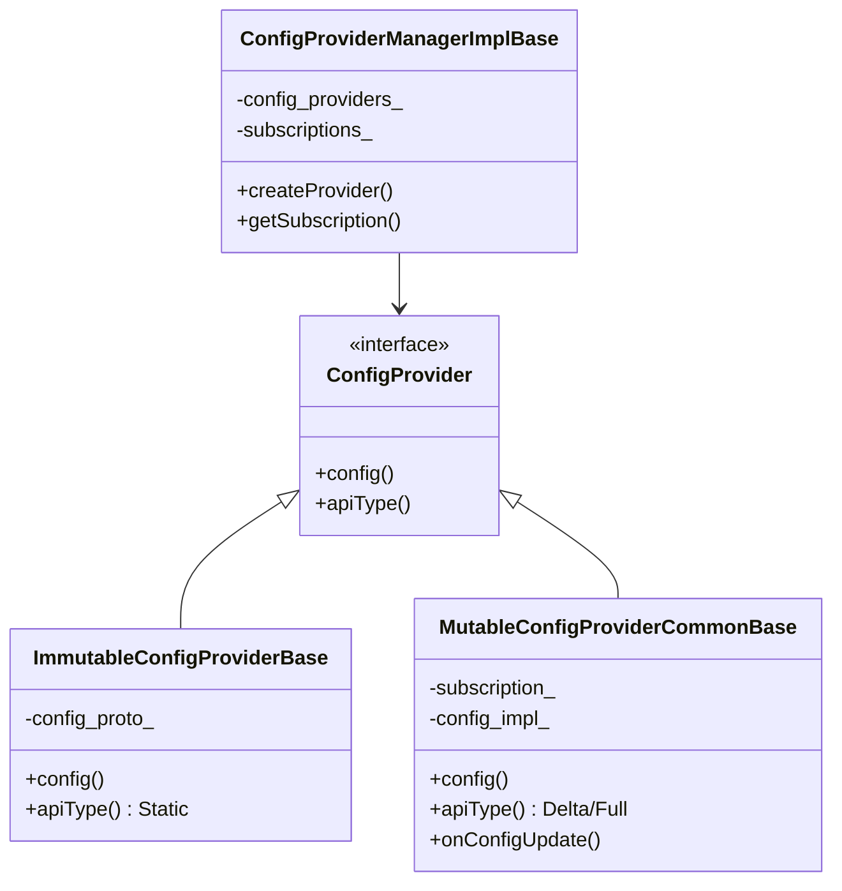
```mermaid
classDiagram
    class ConfigProvider {
        <<interface>>
        +config()
        +apiType()
    }
    
    class ImmutableConfigProviderBase {
        +config()
        +apiType() Static
        -config_proto_
    }
    
    class MutableConfigProviderCommonBase {
        +config()
        +apiType() Delta/Full
        +onConfigUpdate()
        -subscription_
        -config_impl_
    }
    
    class ConfigProviderManagerImplBase {
        +createProvider()
        +getSubscription()
        -config_providers_
        -subscriptions_
    }
    
    ConfigProvider <|-- ImmutableConfigProviderBase
    ConfigProvider <|-- MutableConfigProviderCommonBase
    ConfigProviderManagerImplBase --> ConfigProvider
```

**Config Update Flow**:
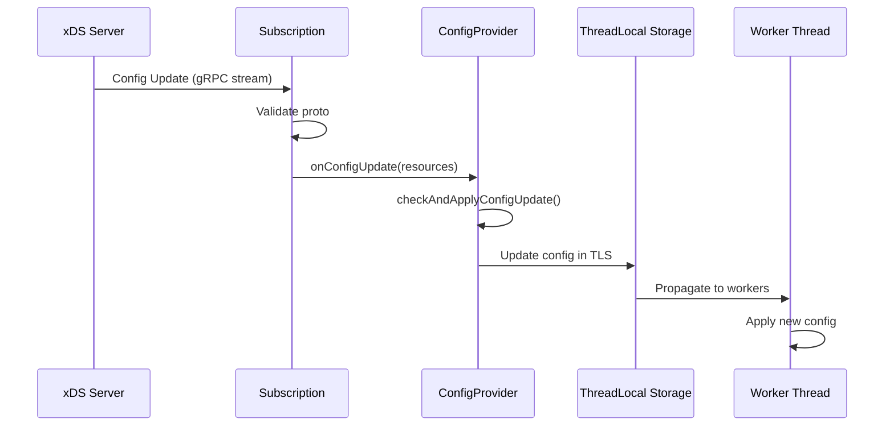
```mermaid
sequenceDiagram
    participant XDS as xDS Server
    participant Sub as Subscription
    participant Provider as ConfigProvider
    participant TLS as ThreadLocal Storage
    participant Worker as Worker Thread
    
    XDS->>Sub: Config Update (gRPC stream)
    Sub->>Sub: Validate proto
    Sub->>Provider: onConfigUpdate(resources)
    Provider->>Provider: checkAndApplyConfigUpdate()
    Provider->>TLS: Update config in TLS
    TLS->>Worker: Propagate to workers
    Worker->>Worker: Apply new config
```

**Config Provider Lifecycle**:
1. **Creation**: Created by ConfigProviderManager
2. **Initialization**: Subscribe to config source
3. **Updates**: Receive and apply config updates
4. **Sharing**: Multiple components share same provider (memory efficiency)
5. **Destruction**: Unsubscribe when no longer needed

**File**: `source/common/config/config_provider_impl.{h,cc}`

---

### 4. Utility Functions (`utility.h/cc`)

**Purpose**: Common configuration utilities and helper functions.

**Key Utilities**:
- **Hash computation**: Version hashing for configs
- **Cluster validation**: Check cluster existence and sanity
- **API type helpers**: Convert between API type strings
- **Config source helpers**: Extract timeouts, validate sources
- **Resource name parsing**: Parse and validate xDS resource names

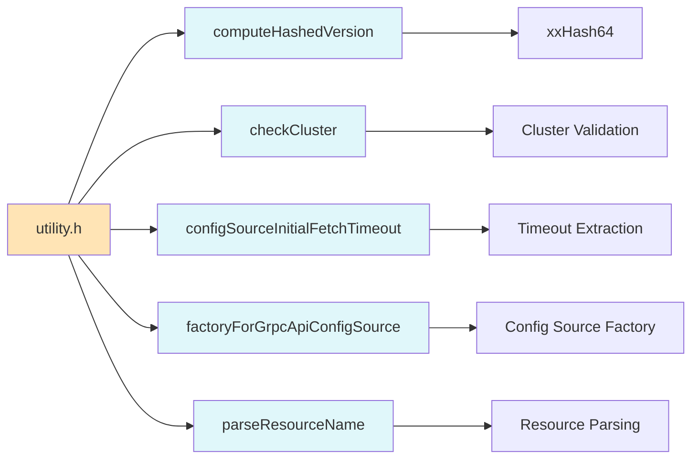
```mermaid
flowchart LR
    A[utility.h] --> B[computeHashedVersion]
    A --> C[checkCluster]
    A --> D[configSourceInitialFetchTimeout]
    A --> E[factoryForGrpcApiConfigSource]
    A --> F[parseResourceName]
    
    B --> B1[xxHash64]
    C --> C1[Cluster Validation]
    D --> D1[Timeout Extraction]
    E --> E1[Config Source Factory]
    F --> F1[Resource Parsing]
    
    style A fill:#FFE4B5
    style B fill:#E0F7FA
    style C fill:#E0F7FA
    style D fill:#E0F7FA
    style E fill:#E0F7FA
    style F fill:#E0F7FA
```

**Common Functions**:
```cpp
// Compute version hash
std::pair<std::string, uint64_t> computeHashedVersion(const std::string& input);

// Validate cluster exists
absl::StatusOr<Upstream::ClusterConstOptRef> 
checkCluster(absl::string_view error_prefix, 
             absl::string_view cluster_name,
             Upstream::ClusterManager& cm);

// Get initial fetch timeout
std::chrono::milliseconds 
configSourceInitialFetchTimeout(
    const envoy::config::core::v3::ConfigSource& config_source);
```

**File**: `source/common/config/utility.{h,cc}`

---

### 5. XdsResource (`xds_resource.h/cc`)

**Purpose**: Represents a single xDS resource with metadata and state tracking.

**Resource States**:
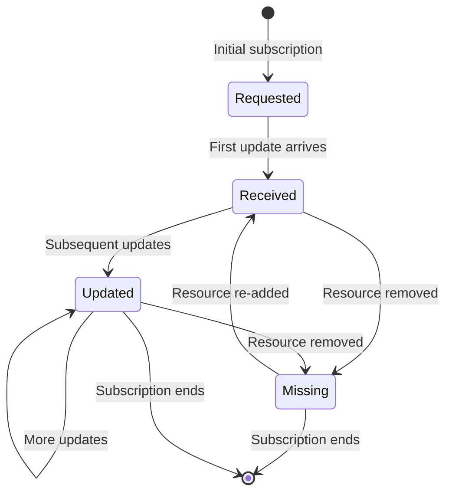
```mermaid
stateDiagram-v2
    [*] --> Requested: Initial subscription
    Requested --> Received: First update arrives
    Received --> Updated: Subsequent updates
    Updated --> Updated: More updates
    Received --> Missing: Resource removed
    Updated --> Missing: Resource removed
    Missing --> Received: Resource re-added
    Missing --> [*]: Subscription ends
    Updated --> [*]: Subscription ends
```

**XdsResource Components**:
- Resource name and type URL
- Version information
- TTL (Time To Live) for expiration
- Cached resource proto
- Resource-specific metadata

**File**: `source/common/config/xds_resource.{h,cc}`

---

### 6. DataSource (`datasource.h/cc`)

**Purpose**: Handles loading data from various sources (inline, file, environment, remote).

**Data Source Types**:
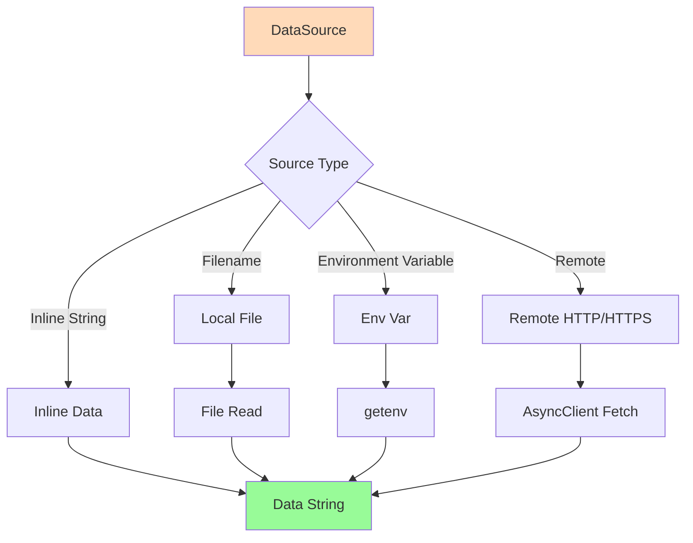
```mermaid
graph TD
    A[DataSource] --> B{Source Type}
    B -->|Inline String| C[Inline Data]
    B -->|Filename| D[Local File]
    B -->|Environment Variable| E[Env Var]
    B -->|Remote| F[Remote HTTP/HTTPS]
    
    C --> G[Data String]
    D --> H[File Read]
    E --> I[getenv]
    F --> J[AsyncClient Fetch]
    
    H --> G
    I --> G
    J --> G
    
    style A fill:#FFDAB9
    style G fill:#98FB98
```

**Use Cases**:
- TLS certificates (inline, file, or remote)
- Secret data (SDS - Secret Discovery Service)
- Configuration snippets
- WASM modules

**Example**:
```yaml
# Inline data source
inline_string: "certificate data here"

# File data source
filename: /etc/envoy/certs/server.crt

# Environment variable
environment_variable: TLS_CERT

# Remote data source
remote:
  http_uri:
    uri: https://cert-server.example.com/certs/server.crt
    cluster: cert_cluster
    timeout: 5s
```

**File**: `source/common/config/datasource.{h,cc}`

---

### 7. RemoteDataFetcher (`remote_data_fetcher.h/cc`)

**Purpose**: Fetches data asynchronously from remote HTTP/HTTPS sources.

**Fetch Flow**:
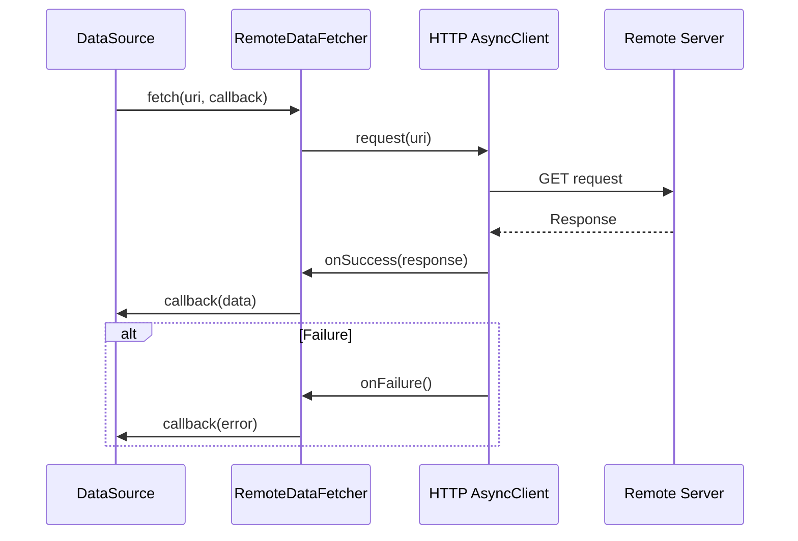
```mermaid
sequenceDiagram
    participant Client as DataSource
    participant Fetcher as RemoteDataFetcher
    participant HTTP as HTTP AsyncClient
    participant Remote as Remote Server
    
    Client->>Fetcher: fetch(uri, callback)
    Fetcher->>HTTP: request(uri)
    HTTP->>Remote: GET request
    Remote-->>HTTP: Response
    HTTP->>Fetcher: onSuccess(response)
    Fetcher->>Client: callback(data)
    
    alt Failure
        HTTP->>Fetcher: onFailure()
        Fetcher->>Client: callback(error)
    end
```

**Features**:
- Async HTTP/HTTPS fetching
- Configurable timeouts
- Retry logic
- TLS verification

**File**: `source/common/config/remote_data_fetcher.{h,cc}`

---

### 8. Metadata (`metadata.h/cc`)

**Purpose**: Utilities for working with resource metadata.

**Metadata Structure**:
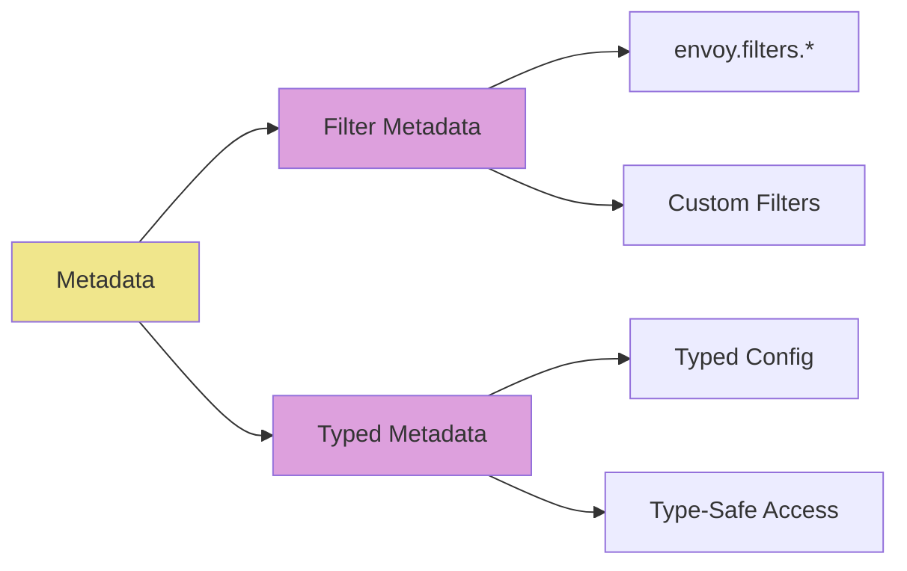
```mermaid
graph LR
    A[Metadata] --> B[Filter Metadata]
    A --> C[Typed Metadata]
    
    B --> D[envoy.filters.*]
    B --> E[Custom Filters]
    
    C --> F[Typed Config]
    C --> G[Type-Safe Access]
    
    style A fill:#F0E68C
    style B fill:#DDA0DD
    style C fill:#DDA0DD
```

**Common Operations**:
- Extract metadata by filter name
- Merge metadata from multiple sources
- Validate metadata structure
- Type-safe metadata access

**Usage Example**:
```cpp
// Get filter metadata
const auto& filter_metadata = 
    Metadata::metadataValue(metadata, "envoy.filters.http.router");

// Extract typed value
const auto& route_name = 
    Metadata::metadataValue(filter_metadata, "route_name").string_value();
```

**File**: `source/common/config/metadata.{h,cc}`

---

### 9. WellKnownNames (`well_known_names.h/cc`)

**Purpose**: Constants for well-known filter, extension, and metadata names.

**Categories**:
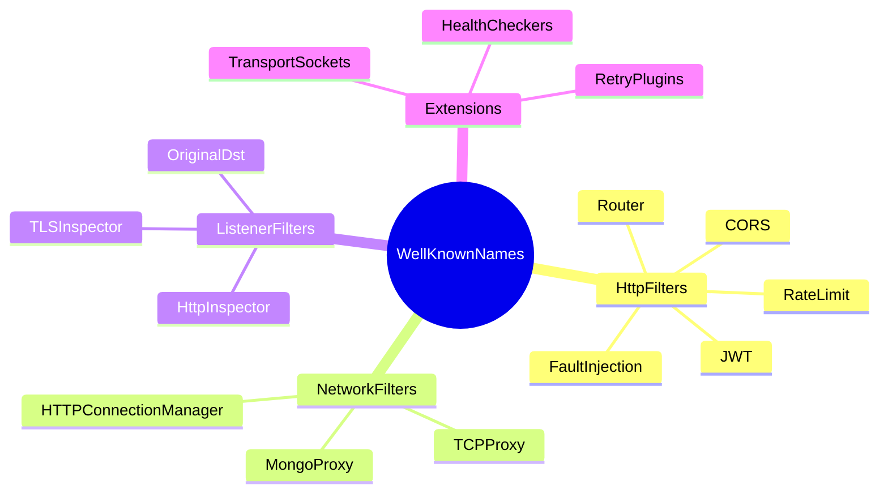
```mermaid
mindmap
    root((WellKnownNames))
        HttpFilters
            Router
            CORS
            FaultInjection
            RateLimit
            JWT
        NetworkFilters
            TCPProxy
            HTTPConnectionManager
            MongoProxy
        ListenerFilters
            TLSInspector
            HttpInspector
            OriginalDst
        Extensions
            TransportSockets
            HealthCheckers
            RetryPlugins
```

**Example Constants**:
```cpp
// HTTP filter names
constexpr absl::string_view Router = "envoy.filters.http.router";
constexpr absl::string_view Cors = "envoy.filters.http.cors";
constexpr absl::string_view RateLimit = "envoy.filters.http.ratelimit";

// Network filter names
constexpr absl::string_view TCPProxy = "envoy.filters.network.tcp_proxy";
constexpr absl::string_view HTTPConnectionManager = 
    "envoy.filters.network.http_connection_manager";

// Listener filter names
constexpr absl::string_view TLSInspector = 
    "envoy.filters.listener.tls_inspector";
```

**File**: `source/common/config/well_known_names.{h,cc}`

---

### 10. TTL Management (`ttl.h/cc`)

**Purpose**: Manages Time-To-Live for xDS resources.

**TTL Behavior**:
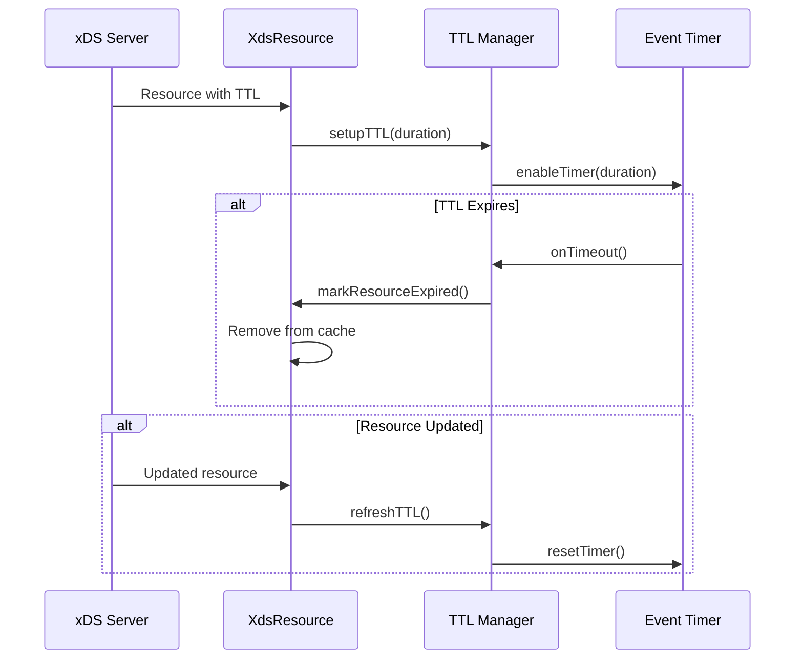
```mermaid
sequenceDiagram
    participant XDS as xDS Server
    participant Resource as XdsResource
    participant TTL as TTL Manager
    participant Timer as Event Timer
    
    XDS->>Resource: Resource with TTL
    Resource->>TTL: setupTTL(duration)
    TTL->>Timer: enableTimer(duration)
    
    alt TTL Expires
        Timer->>TTL: onTimeout()
        TTL->>Resource: markResourceExpired()
        Resource->>Resource: Remove from cache
    end
    
    alt Resource Updated
        XDS->>Resource: Updated resource
        Resource->>TTL: refreshTTL()
        TTL->>Timer: resetTimer()
    end
```

**Use Cases**:
- Automatic resource expiration
- Stale config cleanup
- Memory management
- Graceful degradation

**File**: `source/common/config/ttl.{h,cc}`

---

### 11. WatchedDirectory (`watched_directory.h/cc`)

**Purpose**: Monitors filesystem directories for changes.

**Watch Flow**:
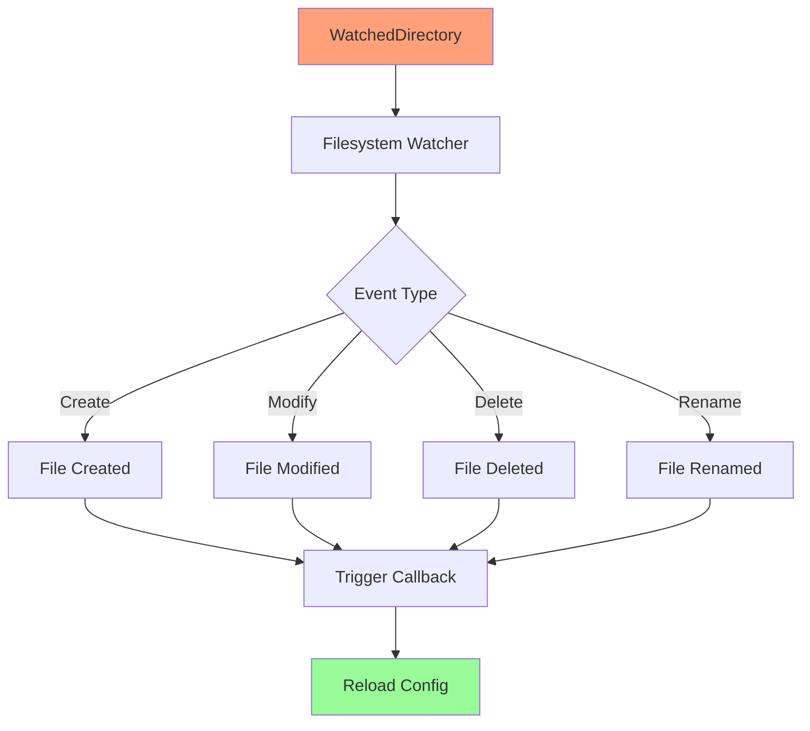
```mermaid
flowchart TD
    A[WatchedDirectory] --> B[Filesystem Watcher]
    B --> C{Event Type}
    C -->|Create| D[File Created]
    C -->|Modify| E[File Modified]
    C -->|Delete| F[File Deleted]
    C -->|Rename| G[File Renamed]
    
    D --> H[Trigger Callback]
    E --> H
    F --> H
    G --> H
    
    H --> I[Reload Config]
    
    style A fill:#FFA07A
    style I fill:#98FB98
```

**Features**:
- inotify-based watching (Linux)
- kqueue-based watching (macOS/BSD)
- Automatic symlink following
- Debouncing for rapid changes

**Use Case**: Filesystem-based config sources

**File**: `source/common/config/watched_directory.{h,cc}`

---

## Complete Request Flow

### xDS Configuration Update Flow

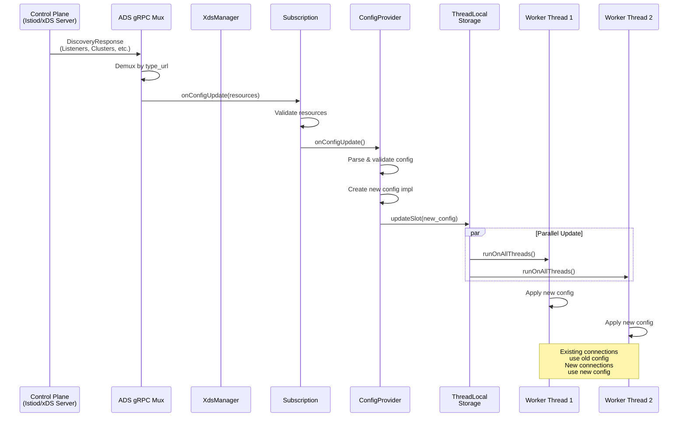
```mermaid
sequenceDiagram
    participant Istiod as Control Plane<br/>(Istiod/xDS Server)
    participant AdsMux as ADS gRPC Mux
    participant XdsMgr as XdsManager
    participant Sub as Subscription
    participant Provider as ConfigProvider
    participant TLS as ThreadLocal<br/>Storage
    participant Worker1 as Worker Thread 1
    participant Worker2 as Worker Thread 2
    
    Istiod->>AdsMux: DiscoveryResponse<br/>(Listeners, Clusters, etc.)
    AdsMux->>AdsMux: Demux by type_url
    AdsMux->>Sub: onConfigUpdate(resources)
    Sub->>Sub: Validate resources
    Sub->>Provider: onConfigUpdate()
    Provider->>Provider: Parse & validate config
    Provider->>Provider: Create new config impl
    Provider->>TLS: updateSlot(new_config)
    
    par Parallel Update
        TLS->>Worker1: runOnAllThreads()
        TLS->>Worker2: runOnAllThreads()
    end
    
    Worker1->>Worker1: Apply new config
    Worker2->>Worker2: Apply new config
    
    Note over Worker1,Worker2: Existing connections<br/>use old config<br/>New connections<br/>use new config
```

### Static Configuration Loading

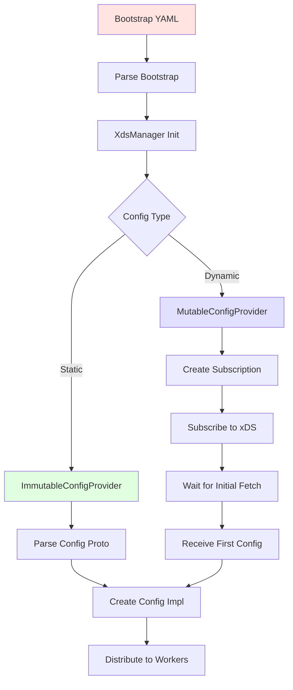
```mermaid
flowchart TD
    A[Bootstrap YAML] --> B[Parse Bootstrap]
    B --> C[XdsManager Init]
    C --> D{Config Type}
    
    D -->|Static| E[ImmutableConfigProvider]
    D -->|Dynamic| F[MutableConfigProvider]
    
    E --> G[Parse Config Proto]
    F --> H[Create Subscription]
    
    G --> I[Create Config Impl]
    H --> J[Subscribe to xDS]
    
    I --> K[Distribute to Workers]
    J --> L[Wait for Initial Fetch]
    L --> M[Receive First Config]
    M --> I
    
    style A fill:#FFE4E1
    style E fill:#E0FFE0
    style F fill:#E0E0FF
```

---

## Configuration Source Types

### 1. ADS (Aggregated Discovery Service)

**Advantages**:
- Single gRPC connection for all resource types
- Ordered updates (dependencies respected)
- Reduced connection overhead

```yaml
dynamic_resources:
  ads_config:
    api_type: GRPC
    transport_api_version: V3
    grpc_services:
      - envoy_grpc:
          cluster_name: xds_cluster
    set_node_on_first_message_only: true
  
  lds_config: { ads: {} }
  cds_config: { ads: {} }
  rds_config: { ads: {} }
```

### 2. Individual xDS

**Use Case**: Fine-grained control per resource type

```yaml
dynamic_resources:
  lds_config:
    api_config_source:
      api_type: GRPC
      grpc_services:
        - envoy_grpc:
            cluster_name: lds_cluster
  
  cds_config:
    api_config_source:
      api_type: GRPC
      grpc_services:
        - envoy_grpc:
            cluster_name: cds_cluster
```

### 3. Filesystem

**Use Case**: Local development, static deployments

```yaml
dynamic_resources:
  lds_config:
    path_config_source:
      path: /etc/envoy/lds.yaml
      watched_directory:
        path: /etc/envoy
```

---

## State Machines

### Non-Wildcard Resource State Machine

The config system includes sophisticated state tracking for individual resources:


**States**:
- **Requested**: Resource requested from server
- **Waiting**: Waiting for server response
- **Present**: Resource received and active
- **Missing**: Resource explicitly removed by server

### Wildcard Resource State Machine

For wildcard subscriptions (subscribe to all resources of a type):


**States**:
- **Waiting for Server Initialization**: Initial state
- **Ready**: Server has provided initial resource set
- **Updated**: Received resource updates

---

## Other Important Files

### xds_context_params.h/cc
**Purpose**: xDS context and node parameters
- Node identification
- Locality information
- Cluster/service naming

### type_to_endpoint.h/cc
**Purpose**: Maps xDS type URLs to endpoint names
- LDS → v3.Listener
- CDS → v3.Cluster
- RDS → v3.RouteConfiguration
- EDS → v3.ClusterLoadAssignment

### subscription_base.h
**Purpose**: Base class for subscription implementations
- Common subscription lifecycle
- Callback management
- Resource tracking

### decoded_resource_impl.h
**Purpose**: Decoded xDS resource wrapper
- Resource name
- Resource proto
- Version information
- Aliases and metadata

### opaque_resource_decoder_impl.h
**Purpose**: Generic resource decoder interface
- Protocol buffer decoding
- Version extraction
- Resource validation

### custom_config_validators_impl.h/cc
**Purpose**: Custom configuration validators
- Per-resource validation hooks
- Semantic validation beyond proto schema

### context_provider_impl.h
**Purpose**: Provides context information to config components
- Server context
- Factory context
- Validation context

### api_version.h
**Purpose**: API version constants
- V2 (deprecated)
- V3 (current)
- Auto-detection logic

### runtime_utility.h/cc
**Purpose**: Runtime configuration helpers
- Convert config to runtime keys
- Load runtime from config

### stats_utility.cc
**Purpose**: Statistics utilities for config subsystem
- Config update stats
- Subscription stats

### null_grpc_mux_impl.h
**Purpose**: Null implementation of gRPC mux (for testing)

### resource_name.h
**Purpose**: xDS resource name utilities
- Parse resource names
- Extract resource metadata from names

---

## Memory and Performance Considerations

### Shared Configuration Model

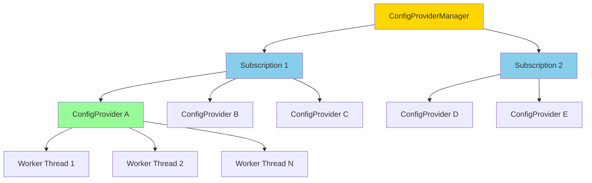
```mermaid
graph TD
    A[ConfigProviderManager] --> B[Subscription 1]
    A --> C[Subscription 2]
    
    B --> D[ConfigProvider A]
    B --> E[ConfigProvider B]
    B --> F[ConfigProvider C]
    
    C --> G[ConfigProvider D]
    C --> H[ConfigProvider E]
    
    D --> I[Worker Thread 1]
    D --> J[Worker Thread 2]
    D --> K[Worker Thread N]
    
    style A fill:#FFD700
    style B fill:#87CEEB
    style C fill:#87CEEB
    style D fill:#98FB98
```

**Memory Benefits**:
1. **Subscription Sharing**: Multiple providers share one subscription
2. **Config Sharing**: Same config proto shared across providers
3. **ThreadLocal Distribution**: Copy-on-write to workers
4. **Linear Scalability**: O(config_size) not O(config_size × workers)

### Performance Optimizations

1. **Lazy Subscription**: Only subscribe when needed
2. **Batched Updates**: Group multiple resource updates
3. **Incremental Updates**: Delta xDS for partial updates
4. **TTL Expiration**: Automatic cleanup of stale configs
5. **Version Hashing**: Fast config change detection

---

## Configuration Best Practices

### 1. Prefer ADS Over Individual xDS
- Reduces connection count
- Ensures update ordering
- Simpler configuration

### 2. Use Appropriate Timeouts
```yaml
initial_fetch_timeout: 15s  # Time to wait for first config
request_timeout: 5s          # Per-request timeout
```

### 3. Enable Config Dumps
```yaml
admin:
  address:
    socket_address:
      address: 127.0.0.1
      port_value: 9901
```
Then: `curl localhost:9901/config_dump`

### 4. Monitor Config Updates
Track these stats:
- `control_plane.connected_state`
- `update_success` / `update_failure`
- `update_rejected`
- `init_fetch_timeout`

### 5. Implement Health Checks for xDS Cluster
```yaml
clusters:
  - name: xds_cluster
    health_checks:
      - timeout: 1s
        interval: 5s
        unhealthy_threshold: 2
        healthy_threshold: 1
        grpc_health_check: {}
```

---

## Debugging Configuration Issues

### Check Config Dump
```bash
curl http://localhost:9901/config_dump?resource=listeners
curl http://localhost:9901/config_dump?resource=clusters
```

### Check Subscription Stats
```bash
curl http://localhost:9901/stats | grep control_plane
```

### Enable Debug Logging
```bash
curl -X POST "http://localhost:9901/logging?level=debug&paths=config:trace"
```

### Common Issues

#### 1. Initial Fetch Timeout
**Symptom**: Envoy fails to start
**Cause**: xDS server unreachable or slow
**Solution**: Increase `initial_fetch_timeout` or fix xDS connectivity

#### 2. Update Rejected
**Symptom**: Config updates fail to apply
**Cause**: Validation errors in new config
**Solution**: Check logs for validation errors, fix config

#### 3. Version Mismatch
**Symptom**: Resources not updating
**Cause**: Version string not changing
**Solution**: Ensure xDS server increments version on changes

#### 4. Resource Not Found
**Symptom**: 404 errors for specific resources
**Cause**: Resource name mismatch
**Solution**: Verify resource names match exactly

---

## Testing Configuration

### Unit Testing
```cpp
TEST(ConfigUtilityTest, CheckCluster) {
  NiceMock<Upstream::MockClusterManager> cm;
  EXPECT_CALL(cm, clusters()).WillOnce(Return(cluster_map));
  
  auto result = Utility::checkCluster("test", "my_cluster", cm);
  EXPECT_TRUE(result.ok());
}
```

### Integration Testing
```cpp
TEST_P(ConfigIntegrationTest, DynamicListenerUpdate) {
  initialize();
  
  // Send initial config
  sendDiscoveryResponse<envoy::config::listener::v3::Listener>(
      Config::TypeUrl::get().Listener, {listener1}, {listener1}, {}, "1");
  
  // Wait for update
  test_server_->waitForCounterGe("listener_manager.lds.update_success", 1);
  
  // Verify listener active
  EXPECT_EQ(1, test_server_->counter("listener_manager.total_listeners_active")->value());
}
```

---

## Related Documentation

- [xDS Protocol](../../docs/core-runtime-xds-istio/)
- [Subscription Management](../../docs/flows/)
- [Filter Chain Configuration](../../docs/filter-chain/)
- [Admin Interface](/docs/admin-operations/)

---

## Summary

The `source/common/config` directory provides:

1. **xDS Management** - Full xDS protocol implementation
2. **Config Providers** - Static and dynamic configuration delivery
3. **Subscription Factory** - Creating subscriptions for various sources
4. **Resource Management** - Lifecycle, validation, and caching
5. **Utilities** - Common configuration helpers and tools

This infrastructure enables Envoy's powerful dynamic configuration capabilities while maintaining memory efficiency through shared ownership and thread-local distribution.
