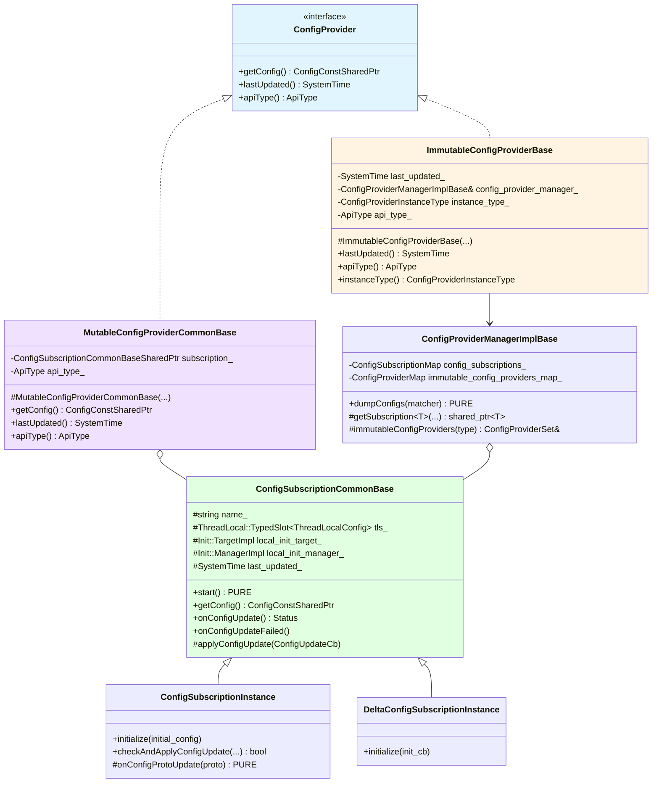
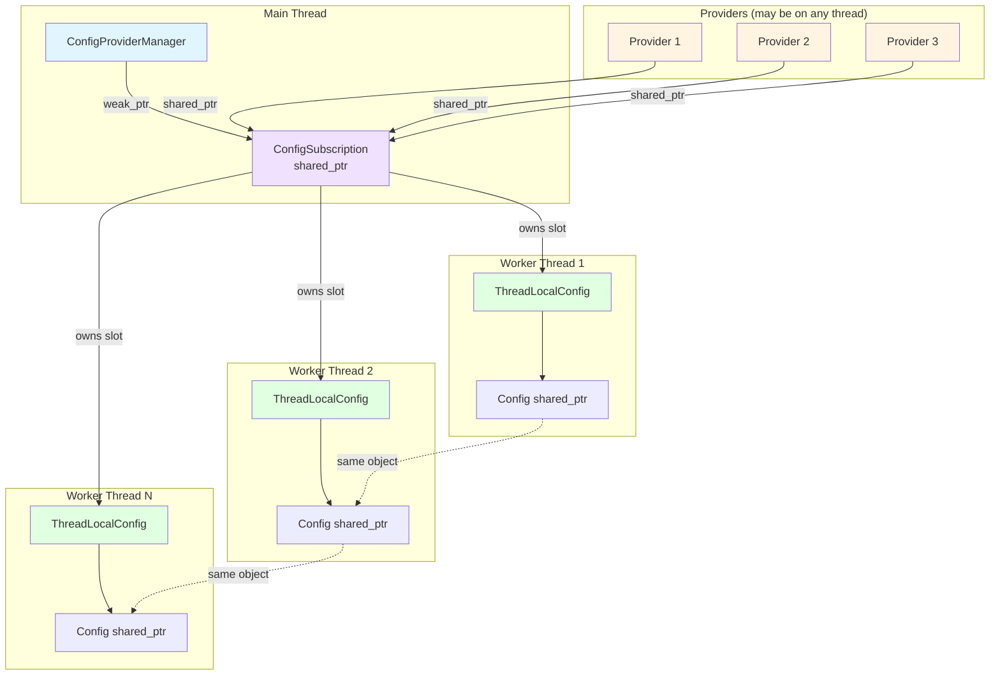
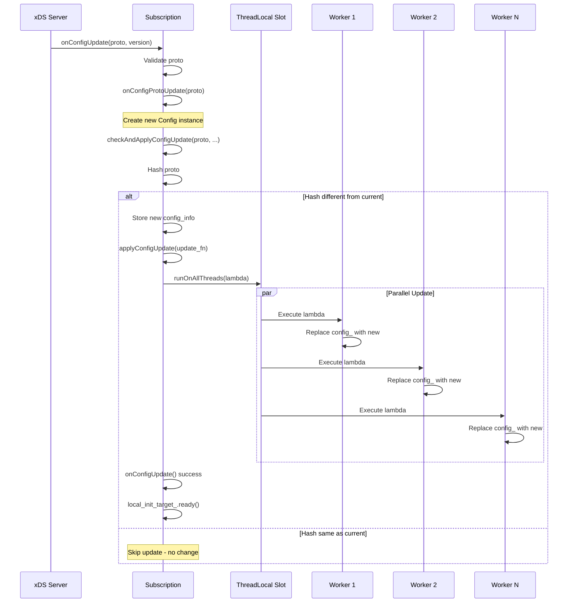
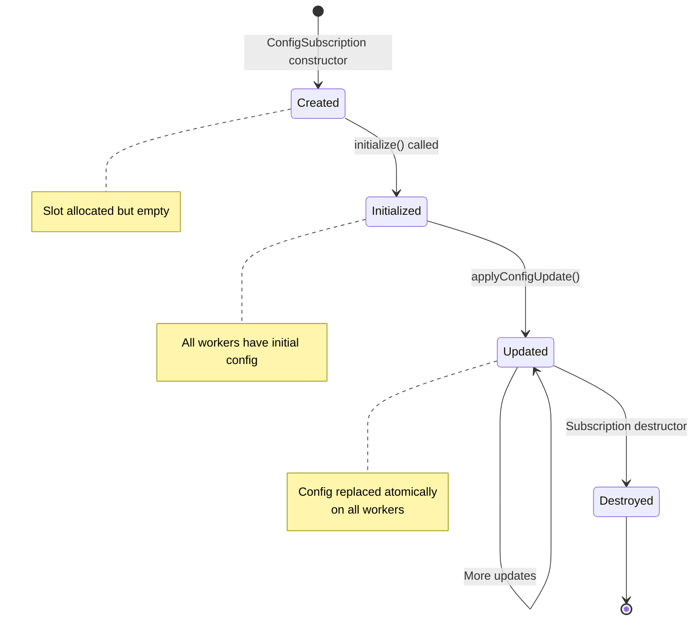
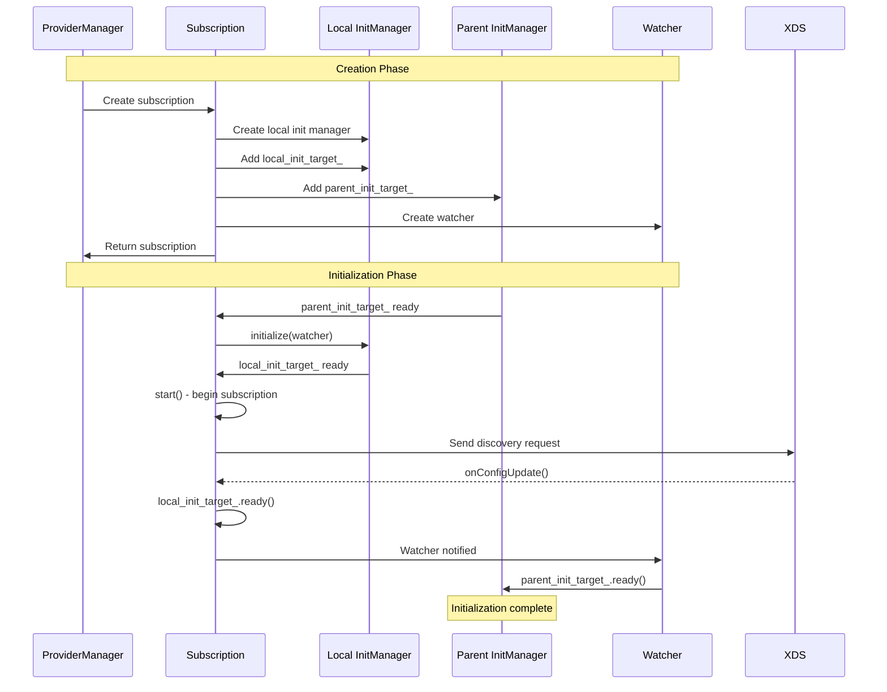
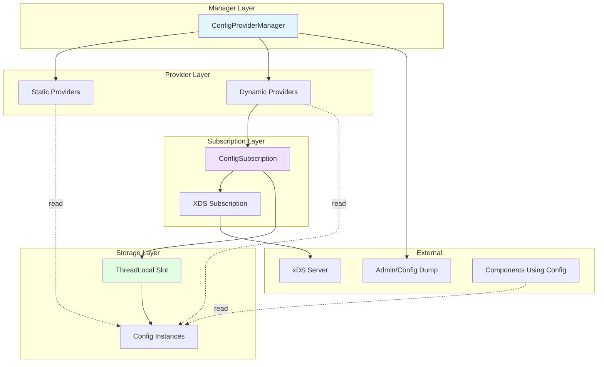

# Config Provider Implementation

**File:** `source/common/config/config_provider_impl.h` and `source/common/config/config_provider_impl.cc`

**Purpose:** The Config Provider framework enables sharing of configuration across multiple Envoy workers with support for both static (immutable) and dynamic (mutable via xDS) configurations. It provides a thread-safe model for distributing config updates to all worker threads.

## Table of Contents
1. [Overview](#overview)
2. [Class Hierarchy](#class-hierarchy)
3. [Static vs Dynamic Configs](#static-vs-dynamic-configs)
4. [Shared Ownership Model](#shared-ownership-model)
5. [Config Update Propagation](#config-update-propagation)
6. [ThreadLocal Integration](#threadlocal-integration)
7. [Lifecycle Management](#lifecycle-management)
8. [Usage Examples](#usage-examples)

## Overview

The config provider framework solves several key problems:
- **Memory Efficiency**: Share config across workers instead of duplicating
- **Consistency**: Atomic config updates across all threads
- **Lifecycle Management**: Proper cleanup when providers/subscriptions are destroyed
- **Mixed Mutability**: Support both static and dynamic configs uniformly

## Class Hierarchy



## Static vs Dynamic Configs

### ConfigProviderInstanceType

```cpp
enum class ConfigProviderInstanceType {
  // Configuration defined as static resource in bootstrap
  Static,
  // Configuration defined inline in a resource (may be from xDS or static)
  Inline,
  // Configuration obtained from xDS subscription
  Xds
};
```

### ImmutableConfigProviderBase

Used for static and inline configurations that never change:

```cpp
class ImmutableConfigProviderBase : public ConfigProvider {
public:
  ~ImmutableConfigProviderBase() override;

  // Envoy::Config::ConfigProvider
  SystemTime lastUpdated() const override { return last_updated_; }
  ApiType apiType() const override { return api_type_; }
  
  ConfigProviderInstanceType instanceType() const { 
    return instance_type_; 
  }

protected:
  ImmutableConfigProviderBase(
      Server::Configuration::ServerFactoryContext& factory_context,
      ConfigProviderManagerImplBase& config_provider_manager,
      ConfigProviderInstanceType instance_type, 
      ApiType api_type);

private:
  SystemTime last_updated_;
  ConfigProviderManagerImplBase& config_provider_manager_;
  ConfigProviderInstanceType instance_type_;
  ApiType api_type_;
};
```

**Key Characteristics:**
- No subscription - config is provided at construction
- Registered with manager for config dumps
- Minimal overhead - just timestamp and type tracking

### MutableConfigProviderCommonBase

Used for dynamic configurations from xDS:

```cpp
class MutableConfigProviderCommonBase : public ConfigProvider {
public:
  // Envoy::Config::ConfigProvider
  SystemTime lastUpdated() const override { 
    return subscription_->lastUpdated(); 
  }
  ApiType apiType() const override { return api_type_; }

protected:
  MutableConfigProviderCommonBase(
      ConfigSubscriptionCommonBaseSharedPtr&& subscription,
      ApiType api_type)
      : subscription_(subscription), api_type_(api_type) {}

  // Delegates to subscription
  ConfigConstSharedPtr getConfig() const override { 
    return subscription_->getConfig(); 
  }

  ConfigSubscriptionCommonBaseSharedPtr subscription_;

private:
  ApiType api_type_;
};
```

**Key Characteristics:**
- Wraps a shared subscription
- Multiple providers can share same subscription
- Config updates propagated via subscription

## Shared Ownership Model



### Ownership Relationships

1. **Manager → Subscription**: Weak pointer (doesn't extend lifetime)
2. **Provider → Subscription**: Shared pointer (keeps subscription alive)
3. **Subscription → ThreadLocal Slot**: Owns the slot
4. **ThreadLocal → Config**: Shared pointer to config instance
5. **All Workers → Same Config**: All threads share the same config object

### Benefits of This Model

- **Linear Memory**: Config size is O(config_size), not O(config_size × num_workers)
- **Atomic Updates**: All workers see new config at the same time
- **Automatic Cleanup**: Subscription destroyed when last provider is destroyed
- **Sharing**: Multiple providers with same config source share a subscription

## Config Update Propagation



### ConfigSubscriptionCommonBase Update Flow

```cpp
class ConfigSubscriptionCommonBase {
protected:
  // Called by derived class when new config arrives
  void applyConfigUpdate(const ConfigUpdateCb& update_fn) {
    tls_.runOnAllThreads(
        [update_fn](OptRef<ThreadLocalConfig> thread_local_config) {
      thread_local_config->config_ = update_fn(thread_local_config->config_);
    });
  }
  
  struct ThreadLocalConfig : public ThreadLocal::ThreadLocalObject {
    explicit ThreadLocalConfig(ConfigProvider::ConfigConstSharedPtr initial_config)
        : config_(std::move(initial_config)) {}
    
    ConfigProvider::ConfigConstSharedPtr config_;
  };
  
  ThreadLocal::TypedSlot<ThreadLocalConfig> tls_;
};
```

### ConfigSubscriptionInstance (Full xDS)

For full state-of-the-world xDS APIs:

```cpp
class ConfigSubscriptionInstance : public ConfigSubscriptionCommonBase {
public:
  // Initialize with a single shared config
  void initialize(const ConfigProvider::ConfigConstSharedPtr& initial_config) {
    tls_.set([initial_config](Event::Dispatcher&) {
      return std::make_shared<ThreadLocalConfig>(initial_config);
    });
  }

  // Check if config is new and apply update
  bool checkAndApplyConfigUpdate(const Protobuf::Message& config_proto,
                                 const std::string& config_name,
                                 const std::string& version_info) {
    const uint64_t new_hash = MessageUtil::hash(config_proto);
    
    // Skip if hash matches current
    if (config_info_) {
      ASSERT(config_info_.value().last_config_hash_.has_value());
      if (config_info_.value().last_config_hash_.value() == new_hash) {
        return false;  // No change
      }
    }

    // Store new config info
    config_info_ = {new_hash, version_info};
    
    ENVOY_LOG(debug, "{}: loading new configuration: config_name={} hash={}", 
              name_, config_name, new_hash);
    
    // Create new config implementation
    ConfigProvider::ConfigConstSharedPtr new_config_impl = 
        onConfigProtoUpdate(config_proto);
    
    // Propagate to all workers
    applyConfigUpdate([new_config_impl](ConfigProvider::ConfigConstSharedPtr)
                          -> ConfigProvider::ConfigConstSharedPtr { 
      return new_config_impl; 
    });
    
    return true;  // Config was updated
  }

protected:
  // Derived class implements this to create Config from proto
  virtual ConfigProvider::ConfigConstSharedPtr
  onConfigProtoUpdate(const Protobuf::Message& config_proto) PURE;
};
```

**Usage Pattern:**
1. xDS subscription calls `onConfigUpdate()`
2. Subscription validates proto
3. Calls `checkAndApplyConfigUpdate()`
4. Checks hash - returns false if no change
5. Calls virtual `onConfigProtoUpdate()` to create new Config
6. Propagates to all workers via `applyConfigUpdate()`
7. Returns true indicating update applied

### DeltaConfigSubscriptionInstance (Incremental xDS)

For incremental/delta xDS APIs:

```cpp
class DeltaConfigSubscriptionInstance : public ConfigSubscriptionCommonBase {
protected:
  // Initialize with per-worker config creation
  void initialize(const std::function<ConfigProvider::ConfigConstSharedPtr()>& init_cb) {
    tls_.set([init_cb](Event::Dispatcher&) { 
      return std::make_shared<ThreadLocalConfig>(init_cb()); 
    });
  }
};
```

**Key Difference:**
- Full xDS: All workers share single Config instance
- Delta xDS: Each worker may have different Config based on deltas

## ThreadLocal Integration

### ThreadLocal Slot Lifecycle



### Thread-Safe Access

```cpp
// Getting config on worker thread - thread-safe
ConfigProvider::ConfigConstSharedPtr config = provider->getConfig();

// Implementation
ConfigConstSharedPtr MutableConfigProviderCommonBase::getConfig() const {
  return subscription_->getConfig();
}

ConfigConstSharedPtr ConfigSubscriptionCommonBase::getConfig() {
  return tls_->config_;  // tls_ is ThreadLocal::TypedSlot
}
```

**Safety Guarantees:**
- `tls_` automatically returns correct thread-local data
- Shared pointer prevents use-after-free
- Config object is immutable once created
- Updates are atomic pointer swaps

## Lifecycle Management

### Initialization Coordination



### Subscription Initialization

```cpp
ConfigSubscriptionCommonBase::ConfigSubscriptionCommonBase(
    const std::string& name, 
    const uint64_t manager_identifier,
    ConfigProviderManagerImplBase& config_provider_manager,
    Server::Configuration::ServerFactoryContext& factory_context)
    : name_(name), 
      tls_(factory_context.threadLocal()),
      local_init_target_(
          fmt::format("ConfigSubscriptionCommonBase local init target '{}'", name_),
          [this]() { start(); }),
      parent_init_target_(
          fmt::format("ConfigSubscriptionCommonBase init target '{}'", name_),
          [this]() { local_init_manager_.initialize(local_init_watcher_); }),
      local_init_watcher_(
          fmt::format("ConfigSubscriptionCommonBase local watcher '{}'", name_),
          [this]() { parent_init_target_.ready(); }),
      local_init_manager_(
          fmt::format("ConfigSubscriptionCommonBase local init manager '{}'", name_)),
      manager_identifier_(manager_identifier), 
      config_provider_manager_(config_provider_manager),
      time_source_(factory_context.timeSource()),
      last_updated_(factory_context.timeSource().systemTime()) {
  
  THROW_IF_NOT_OK(Config::Utility::checkLocalInfo(name, factory_context.localInfo()));
  local_init_manager_.add(local_init_target_);
}
```

**Init Sequence:**
1. Parent init target added to server init manager
2. When ready, calls `local_init_manager_.initialize()`
3. Local init manager calls `local_init_target_.ready()`
4. Local init target calls `start()` - begins subscription
5. First `onConfigUpdate()` marks init complete
6. Watcher notifies parent init target

### Destruction and Cleanup

```cpp
ConfigSubscriptionCommonBase::~ConfigSubscriptionCommonBase() {
  local_init_target_.ready();  // Ensure init target is marked ready
  config_provider_manager_.unbindSubscription(manager_identifier_);
}

ImmutableConfigProviderBase::~ImmutableConfigProviderBase() {
  config_provider_manager_.unbindImmutableConfigProvider(this);
}
```

**Cleanup Order:**
1. Last provider destroyed → decrements subscription shared_ptr
2. When subscription shared_ptr reaches 0 → destructor called
3. Subscription unregisters from manager
4. ThreadLocal slot automatically destroyed
5. Each worker's ThreadLocalConfig destroyed
6. Config shared_ptr decremented per worker
7. When last Config reference gone → Config destroyed

## Usage Examples

### Example 1: Implementing an Immutable Provider

```cpp
class MyStaticConfigProviderImpl : public ImmutableConfigProviderBase {
public:
  MyStaticConfigProviderImpl(
      ConfigConstSharedPtr config,
      Server::Configuration::ServerFactoryContext& factory_context,
      ConfigProviderManagerImplBase& manager)
      : ImmutableConfigProviderBase(factory_context, manager,
                                    ConfigProviderInstanceType::Static,
                                    ConfigProvider::ApiType::Full),
        config_(std::move(config)) {}

  // Return the static config
  ConfigConstSharedPtr getConfig() const override {
    return config_;
  }

private:
  const ConfigConstSharedPtr config_;
};
```

### Example 2: Implementing a Mutable Provider with Full xDS

```cpp
// Subscription implementation
class MyConfigSubscriptionImpl : public ConfigSubscriptionInstance {
public:
  MyConfigSubscriptionImpl(
      const std::string& name,
      uint64_t manager_identifier,
      ConfigProviderManagerImplBase& manager,
      Server::Configuration::ServerFactoryContext& factory_context,
      SubscriptionPtr&& subscription)
      : ConfigSubscriptionInstance(name, manager_identifier, manager, 
                                   factory_context),
        subscription_(std::move(subscription)) {
    
    // Create initial empty config
    auto initial_config = std::make_shared<MyConfigImpl>();
    initialize(initial_config);
  }

  void start() override {
    subscription_->start({});  // Start with wildcard
  }

protected:
  // Called when new proto arrives
  ConfigProvider::ConfigConstSharedPtr
  onConfigProtoUpdate(const Protobuf::Message& config_proto) override {
    const auto& typed_config = 
        dynamic_cast<const envoy::config::v3::MyConfig&>(config_proto);
    
    // Validate and create new config implementation
    auto new_config = std::make_shared<MyConfigImpl>(typed_config);
    
    return new_config;
  }

private:
  SubscriptionPtr subscription_;
};

// Provider implementation
class MyMutableConfigProviderImpl : public MutableConfigProviderCommonBase {
public:
  MyMutableConfigProviderImpl(
      std::shared_ptr<MyConfigSubscriptionImpl> subscription)
      : MutableConfigProviderCommonBase(std::move(subscription),
                                        ConfigProvider::ApiType::Full) {}
};
```

### Example 3: Using ConfigProviderManager

```cpp
class MyConfigProviderManagerImpl : public ConfigProviderManagerImplBase {
public:
  MyConfigProviderManagerImpl(Server::Admin& admin)
      : ConfigProviderManagerImplBase(makeOptRef(admin), "my_configs") {}

  // Create static provider
  ConfigProviderPtr createStaticConfigProvider(
      ConfigConstSharedPtr config,
      Server::Configuration::ServerFactoryContext& factory_context) {
    return std::make_unique<MyStaticConfigProviderImpl>(
        std::move(config), factory_context, *this);
  }

  // Create dynamic provider
  ConfigProviderPtr createXdsConfigProvider(
      const ConfigSource& config_source,
      Server::Configuration::ServerFactoryContext& factory_context,
      Init::Manager& init_manager) {
    
    // Get or create shared subscription
    auto subscription = getSubscription<MyConfigSubscriptionImpl>(
        config_source, init_manager,
        [&](uint64_t manager_id, ConfigProviderManagerImplBase& mgr) {
          // Create subscription if not exists
          auto xds_subscription = ...; // Create xDS subscription
          return std::make_shared<MyConfigSubscriptionImpl>(
              "my-config-subscription", manager_id, mgr, 
              factory_context, std::move(xds_subscription));
        });
    
    return std::make_unique<MyMutableConfigProviderImpl>(
        std::move(subscription));
  }

  // For config dump
  ProtobufTypes::MessagePtr 
  dumpConfigs(const Matchers::StringMatcher& name_matcher) const override {
    // Implement config dump logic
    auto dump = std::make_unique<envoy::admin::v3::MyConfigsDump>();
    
    // Dump static configs
    for (auto* provider : immutableConfigProviders(ConfigProviderInstanceType::Static)) {
      // Add to dump
    }
    
    // Dump dynamic configs
    for (const auto& [id, weak_sub] : configSubscriptions()) {
      if (auto sub = weak_sub.lock()) {
        // Add subscription config to dump
      }
    }
    
    return dump;
  }
};
```

### Example 4: Subscription Sharing

```cpp
// Two providers with same config source share subscription
ConfigSource config_source;
config_source.mutable_ads();

// First provider creates subscription
auto provider1 = manager.createXdsConfigProvider(
    config_source, factory_context1, init_manager);

// Second provider reuses same subscription
auto provider2 = manager.createXdsConfigProvider(
    config_source, factory_context2, init_manager);

// Both providers share:
// - The same subscription object
// - The same config instances across all workers
// - Updates are propagated to both simultaneously
```

## Relationship with Other Components



## Threading Model

**Key Principles:**
1. **Manager on Main Thread**: All provider/subscription creation on main thread
2. **ThreadLocal Storage**: Each worker has its own TLS instance
3. **Shared Config**: Config objects shared across all workers (immutable)
4. **Atomic Updates**: Pointer swaps are atomic, no locking needed

## Performance Characteristics

- **Memory**: O(config_size + num_workers × pointer_size)
- **Update Latency**: O(num_workers) - linear in worker count
- **Access Latency**: O(1) - direct pointer access, no synchronization
- **Subscription Sharing**: O(1) hash lookup to find existing subscription

## Related Documentation

- [01-xds-manager-impl.md](01-xds-manager-impl.md) - Creates subscriptions for providers
- [02-subscription-factory-impl.md](02-subscription-factory-impl.md) - Factory for subscriptions
- [CONFIG_ARCHITECTURE.md](../CONFIG_ARCHITECTURE.md) - Overall architecture

## Key Takeaways

1. **Immutable vs Mutable**: Two base classes for static and dynamic configs
2. **Shared Ownership**: Multiple providers share subscriptions via shared_ptr
3. **ThreadLocal Storage**: Efficient per-worker storage with shared config
4. **Atomic Updates**: Lock-free updates via pointer swaps
5. **Init Coordination**: Proper initialization ordering via init targets
6. **Linear Memory**: Config size independent of worker count
7. **Manager Coordination**: Central tracking for config dumps and lifecycle
