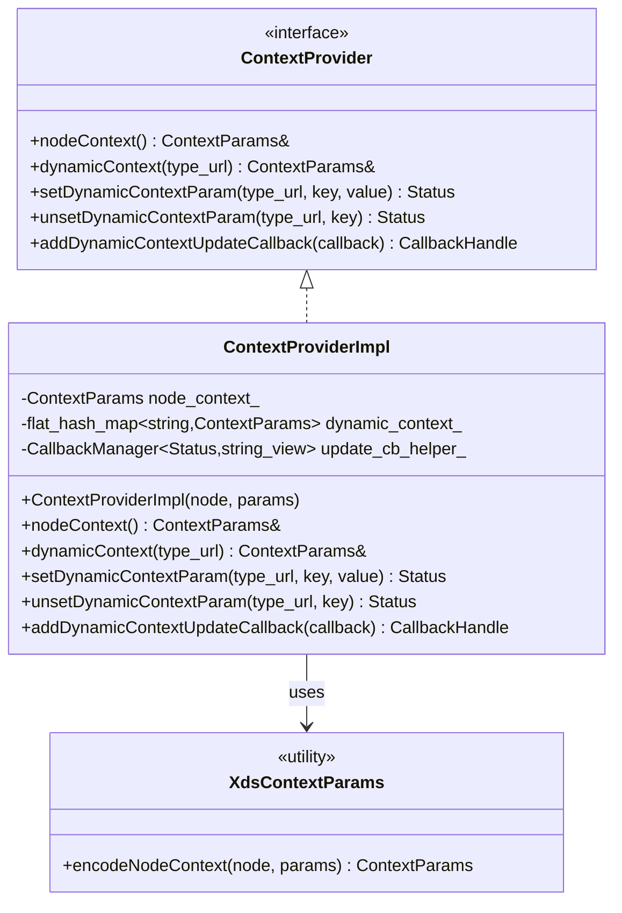
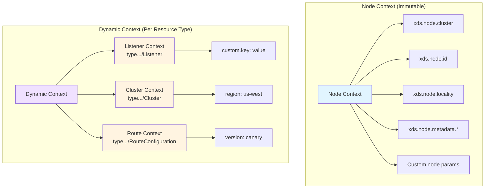
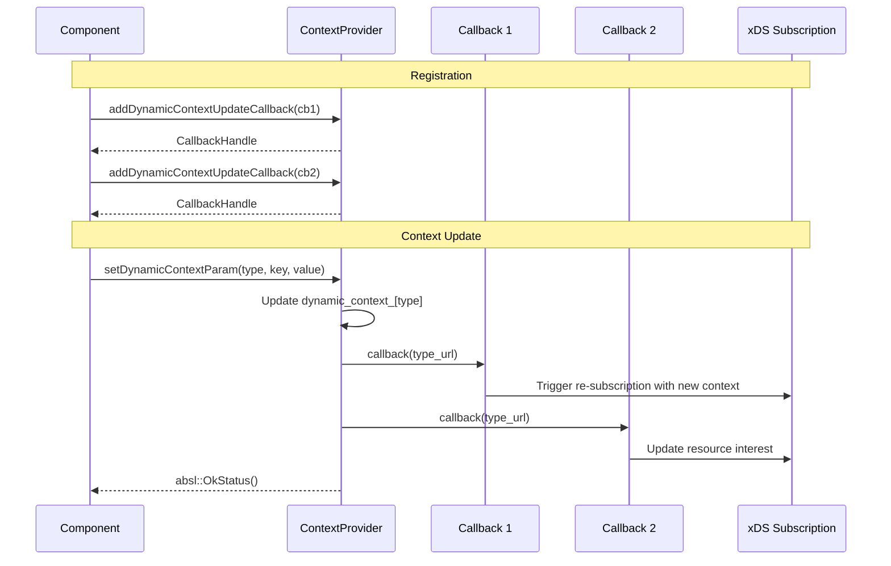
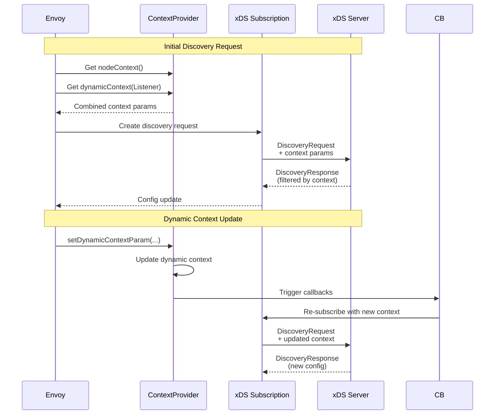
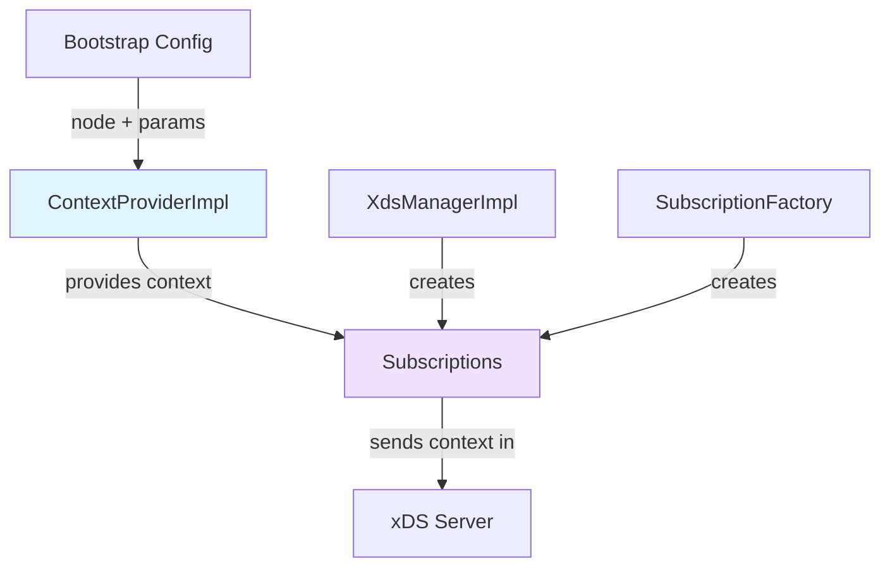

# Context Provider Implementation

**File:** `source/common/config/context_provider_impl.h`

**Purpose:** The Context Provider manages node context and dynamic context parameters for xDSTP (xDS Transport Protocol) resources. It provides a way to add metadata to xDS requests that can influence resource selection and configuration.

## Table of Contents
1. [Overview](#overview)
2. [Class Structure](#class-structure)
3. [Node vs Dynamic Context](#node-vs-dynamic-context)
4. [Context Parameters](#context-parameters)
5. [Update Callbacks](#update-callbacks)
6. [Usage Examples](#usage-examples)

## Overview

Context parameters allow Envoy to provide additional metadata to the xDS server:
- **Node Context**: Static parameters from bootstrap config (cluster, zone, etc.)
- **Dynamic Context**: Runtime-modifiable parameters per resource type
- **Resource Selection**: Help xDS server determine which resources to send
- **Conditional Config**: Enable server-side configuration customization

## Class Structure



### Complete Implementation

```cpp
class ContextProviderImpl : public ContextProvider {
public:
  ContextProviderImpl(
      const envoy::config::core::v3::Node& node,
      const Protobuf::RepeatedPtrField<std::string>& node_context_params)
      : node_context_(
            XdsContextParams::encodeNodeContext(node, node_context_params)) {}

  // Config::ContextProvider
  const xds::core::v3::ContextParams& nodeContext() const override { 
    return node_context_; 
  }
  
  const xds::core::v3::ContextParams&
  dynamicContext(absl::string_view resource_type_url) const override {
    ASSERT_IS_MAIN_OR_TEST_THREAD();
    auto it = dynamic_context_.find(resource_type_url);
    if (it != dynamic_context_.end()) {
      return it->second;
    }
    return xds::core::v3::ContextParams::default_instance();
  }
  
  absl::Status setDynamicContextParam(
      absl::string_view resource_type_url, 
      absl::string_view key,
      absl::string_view value) override {
    ASSERT_IS_MAIN_OR_TEST_THREAD();
    (*dynamic_context_[resource_type_url].mutable_params())[
        toStdStringView(key)] = toStdStringView(value);
    return update_cb_helper_.runCallbacks(resource_type_url);
  }
  
  absl::Status unsetDynamicContextParam(
      absl::string_view resource_type_url,
      absl::string_view key) override {
    ASSERT_IS_MAIN_OR_TEST_THREAD();
    dynamic_context_[resource_type_url].mutable_params()->erase(
        toStdStringView(key));
    return update_cb_helper_.runCallbacks(resource_type_url);
  }
  
  ABSL_MUST_USE_RESULT Common::CallbackHandlePtr
  addDynamicContextUpdateCallback(UpdateNotificationCb callback) const override {
    ASSERT_IS_MAIN_OR_TEST_THREAD();
    return update_cb_helper_.add(callback);
  }

private:
  const xds::core::v3::ContextParams node_context_;
  // Map from resource type URL to dynamic context parameters
  absl::flat_hash_map<std::string, xds::core::v3::ContextParams> dynamic_context_;
  mutable Common::CallbackManager<absl::Status, absl::string_view> update_cb_helper_;
};
```

## Node vs Dynamic Context



### Node Context

**Characteristics:**
- Set once at construction from bootstrap Node config
- Immutable for the lifetime of Envoy
- Encoded from standard Node fields (cluster, id, locality, metadata)
- Shared across all resource types

**Bootstrap Configuration:**
```yaml
node:
  cluster: my-cluster
  id: my-node-id
  locality:
    region: us-west-2
    zone: us-west-2a
  metadata:
    role: edge
    version: v1.0

# Specify which node fields to include in context
node_context_params:
- xds.node.cluster
- xds.node.id
- xds.node.locality
- xds.node.metadata.role
```

**Resulting Context Parameters:**
```protobuf
context_params {
  params {
    key: "xds.node.cluster"
    value: "my-cluster"
  }
  params {
    key: "xds.node.id"
    value: "my-node-id"
  }
  params {
    key: "xds.node.locality"
    value: "{\"region\":\"us-west-2\",\"zone\":\"us-west-2a\"}"
  }
  params {
    key: "xds.node.metadata.role"
    value: "edge"
  }
}
```

### Dynamic Context

**Characteristics:**
- Mutable at runtime
- Per resource type (separate context for Listener, Cluster, etc.)
- Can be updated via control plane or internal logic
- Triggers callbacks on update

## Context Parameters

### ContextParams Proto Structure

```protobuf
message ContextParams {
  map<string, string> params = 1;
}
```

Simple key-value pairs that can represent any metadata.

### Setting Dynamic Context

```cpp
// Set a parameter for Listener resources
absl::Status status = context_provider->setDynamicContextParam(
    "type.googleapis.com/envoy.config.listener.v3.Listener",
    "deployment.stage",
    "canary");

if (!status.ok()) {
  ENVOY_LOG(error, "Failed to set context: {}", status.message());
}
```

### Unsetting Dynamic Context

```cpp
// Remove a parameter
absl::Status status = context_provider->unsetDynamicContextParam(
    "type.googleapis.com/envoy.config.listener.v3.Listener",
    "deployment.stage");
```

### Reading Context

```cpp
// Get node context (immutable)
const auto& node_ctx = context_provider->nodeContext();
for (const auto& [key, value] : node_ctx.params()) {
  ENVOY_LOG(info, "Node param: {} = {}", key, value);
}

// Get dynamic context for specific resource type
const auto& listener_ctx = context_provider->dynamicContext(
    "type.googleapis.com/envoy.config.listener.v3.Listener");
for (const auto& [key, value] : listener_ctx.params()) {
  ENVOY_LOG(info, "Listener param: {} = {}", key, value);
}
```

## Update Callbacks



### Registering Callbacks

```cpp
class MyComponent {
public:
  void initialize(ContextProvider& context_provider) {
    // Register for context updates
    context_update_handle_ = 
        context_provider.addDynamicContextUpdateCallback(
            [this](absl::string_view resource_type_url) -> absl::Status {
      return onContextUpdate(resource_type_url);
    });
  }

private:
  absl::Status onContextUpdate(absl::string_view resource_type_url) {
    ENVOY_LOG(info, "Context updated for resource type: {}", 
              resource_type_url);
    
    // Re-subscribe with new context, update filters, etc.
    if (resource_type_url == 
        "type.googleapis.com/envoy.config.listener.v3.Listener") {
      return resubscribeToListeners();
    }
    
    return absl::OkStatus();
  }

  Common::CallbackHandlePtr context_update_handle_;
};
```

### Automatic Cleanup

The callback handle provides RAII cleanup:

```cpp
{
  auto handle = context_provider.addDynamicContextUpdateCallback(...);
  
  // Callback is active
  
  // When handle goes out of scope, callback is automatically unregistered
}
```

## Usage Examples

### Example 1: Bootstrap with Node Context

```yaml
node:
  cluster: production-edge
  id: edge-proxy-001
  locality:
    region: us-east-1
    zone: us-east-1a
  metadata:
    environment: production
    tier: edge
    version: "1.2.3"

node_context_params:
- xds.node.cluster
- xds.node.id
- xds.node.locality
- xds.node.metadata.environment
- xds.node.metadata.tier
```

**Resulting Node Context:**
```cpp
// Access in code
const auto& node_ctx = context_provider->nodeContext();
// node_ctx.params()["xds.node.cluster"] == "production-edge"
// node_ctx.params()["xds.node.id"] == "edge-proxy-001"
// node_ctx.params()["xds.node.metadata.environment"] == "production"
```

### Example 2: Dynamic Context for Canary Deployment

```cpp
class CanaryDeploymentManager {
public:
  void enableCanaryForListeners(ContextProvider& context_provider) {
    // Set canary flag for listener resources
    auto status = context_provider.setDynamicContextParam(
        "type.googleapis.com/envoy.config.listener.v3.Listener",
        "deployment.stage",
        "canary");
    
    if (!status.ok()) {
      ENVOY_LOG(error, "Failed to set canary context: {}", 
                status.message());
      return;
    }
    
    // xDS server can now send different listener configs for canary
    ENVOY_LOG(info, "Canary mode enabled for listeners");
  }

  void disableCanaryForListeners(ContextProvider& context_provider) {
    auto status = context_provider.unsetDynamicContextParam(
        "type.googleapis.com/envoy.config.listener.v3.Listener",
        "deployment.stage");
    
    if (!status.ok()) {
      ENVOY_LOG(error, "Failed to unset canary context: {}", 
                status.message());
      return;
    }
    
    ENVOY_LOG(info, "Canary mode disabled for listeners");
  }
};
```

### Example 3: Region-Specific Cluster Configuration

```cpp
class RegionAwareClusterManager {
public:
  void setPreferredRegion(ContextProvider& context_provider,
                         const std::string& region) {
    // Set preferred region for cluster discovery
    auto status = context_provider.setDynamicContextParam(
        "type.googleapis.com/envoy.config.cluster.v3.Cluster",
        "locality.preferred_region",
        region);
    
    if (!status.ok()) {
      ENVOY_LOG(error, "Failed to set preferred region: {}", 
                status.message());
      return;
    }
    
    // xDS server can prioritize clusters in this region
    ENVOY_LOG(info, "Set preferred region to: {}", region);
  }

  void initialize(ContextProvider& context_provider) {
    // Watch for context changes
    context_handle_ = 
        context_provider.addDynamicContextUpdateCallback(
            [this](absl::string_view type_url) -> absl::Status {
      if (type_url == 
          "type.googleapis.com/envoy.config.cluster.v3.Cluster") {
        return onClusterContextUpdate();
      }
      return absl::OkStatus();
    });
  }

private:
  absl::Status onClusterContextUpdate() {
    ENVOY_LOG(info, "Cluster context updated, rebalancing endpoints");
    return rebalanceEndpoints();
  }

  Common::CallbackHandlePtr context_handle_;
};
```

### Example 4: Multi-Tenant Context

```cpp
class TenantContextManager {
public:
  void setTenantForResourceType(
      ContextProvider& context_provider,
      const std::string& resource_type_url,
      const std::string& tenant_id) {
    
    // Set tenant ID in context
    auto status = context_provider.setDynamicContextParam(
        resource_type_url,
        "tenant.id",
        tenant_id);
    
    if (!status.ok()) {
      ENVOY_LOG(error, "Failed to set tenant context: {}", 
                status.message());
      return;
    }
    
    // Also set tenant metadata
    status = context_provider.setDynamicContextParam(
        resource_type_url,
        "tenant.isolation_level",
        "strict");
    
    ENVOY_LOG(info, "Set tenant {} for {}", tenant_id, resource_type_url);
  }

  void clearTenantContext(
      ContextProvider& context_provider,
      const std::string& resource_type_url) {
    
    context_provider.unsetDynamicContextParam(
        resource_type_url, "tenant.id");
    context_provider.unsetDynamicContextParam(
        resource_type_url, "tenant.isolation_level");
  }
};
```

## xDSTP Integration

When using xDSTP resource names, context parameters are encoded in URLs:

```
xdstp://authority.example.com/envoy.config.listener.v3.Listener/my-listener
  ?xds.node.cluster=production
  &xds.node.id=proxy-001
  &deployment.stage=canary
```



## Relationship with Other Components



## Threading Model

**Thread Safety:**
- All methods require main thread: `ASSERT_IS_MAIN_OR_TEST_THREAD()`
- Node context is const - thread-safe to read
- Dynamic context modifications must be on main thread
- Callbacks invoked synchronously on main thread

## Key Takeaways

1. **Two Context Types**: Immutable node context + mutable dynamic context
2. **Per Resource Type**: Dynamic context is specific to each resource type
3. **Runtime Updates**: Context can change during Envoy's lifetime
4. **Callback Mechanism**: Components notified of context changes
5. **xDSTP Integration**: Context params encoded in xDSTP URLs
6. **Server-Side Filtering**: xDS server uses context to customize responses
7. **Use Cases**: Canary deployments, multi-tenancy, region preferences

## Related Documentation

- [01-xds-manager-impl.md](01-xds-manager-impl.md) - Uses context provider
- [05-xds-resource.md](05-xds-resource.md) - xDSTP URL encoding
- [CONFIG_ARCHITECTURE.md](../CONFIG_ARCHITECTURE.md) - Overall architecture
