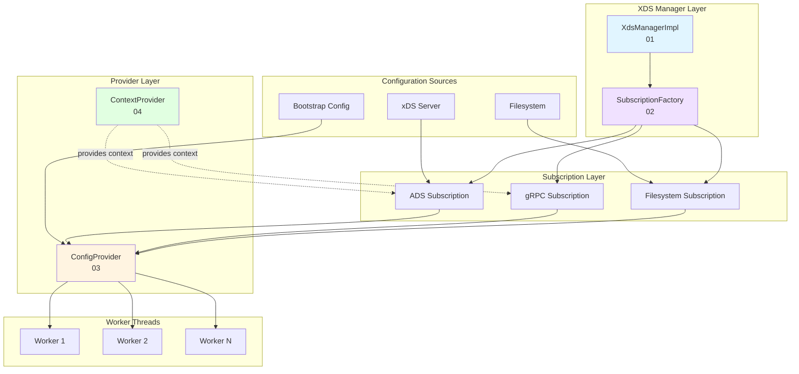

# Envoy Config Subsystem Documentation

**Location:** `source/common/config/`

This directory contains comprehensive documentation for Envoy's configuration subsystem, focusing on the dynamic configuration (xDS) implementation.

## Overview

The config subsystem is responsible for:
- Managing xDS (Discovery Service) subscriptions
- Handling dynamic configuration updates
- Supporting multiple configuration sources (ADS, gRPC, REST, filesystem)
- Implementing xDSTP (xDS Transport Protocol) for advanced routing
- Providing thread-safe configuration distribution across workers

## Documentation Index

### Core Components

1. **[01-xds-manager-impl.md](01-xds-manager-impl.md)** - XDS Manager Implementation
   - Central orchestrator for all xDS subscriptions
   - Authority management for xDSTP
   - ADS mux lifecycle and dynamic updates
   - Multi-authority routing
   - **Start here** for understanding the overall xDS architecture

2. **[02-subscription-factory-impl.md](02-subscription-factory-impl.md)** - Subscription Factory
   - Factory pattern for creating subscriptions
   - Support for ADS, gRPC, REST, and filesystem sources
   - Collection subscriptions for xDSTP
   - Configuration source decision flow
   - **Read this** to understand how subscriptions are created

3. **[03-config-provider-impl.md](03-config-provider-impl.md)** - Config Provider Framework
   - Static vs dynamic configuration
   - Shared ownership model across workers
   - ThreadLocal integration for efficient access
   - Config update propagation
   - **Essential** for implementing custom config providers

### Supporting Components

4. **[04-context-provider-impl.md](04-context-provider-impl.md)** - Context Provider
   - Node and dynamic context parameters
   - Runtime context modification
   - xDSTP context integration
   - Update callback mechanism
   - **Important** for xDSTP-based configurations

5. **[05-xds-resource.md](05-xds-resource.md)** - xDSTP Resource Identifiers
   - URN and URL encoding/decoding
   - Context parameter encoding
   - Resource locators and directives
   - **Reference** for xDSTP URL format

6. **[06-datasource.md](06-datasource.md)** - Data Source Loading
   - Loading from inline, file, environment, remote
   - File watching for dynamic updates
   - ThreadLocal storage
   - **Useful** for secrets, certificates, WASM modules

7. **[07-utility.md](07-utility.md)** - Config Utilities
   - Validation functions
   - Factory lookups
   - Stats generation
   - Common patterns
   - **Reference** for common config operations

8. **[08-decoded-resource-impl.md](08-decoded-resource-impl.md)** - Decoded Resources
   - Uniform resource interface
   - Version and TTL tracking
   - Resource metadata access
   - **Reference** for subscription callbacks

## Architecture Overview



## Reading Guide

### For New Developers

**Start with these in order:**
1. Read [CONFIG_ARCHITECTURE.md](../CONFIG_ARCHITECTURE.md) for high-level overview
2. Read [01-xds-manager-impl.md](01-xds-manager-impl.md) to understand the main orchestrator
3. Read [02-subscription-factory-impl.md](02-subscription-factory-impl.md) to see how subscriptions are created
4. Skim [03-config-provider-impl.md](03-config-provider-impl.md) for the provider pattern

### For Implementing New Config Types

**Focus on:**
1. [03-config-provider-impl.md](03-config-provider-impl.md) - Provider framework
2. [02-subscription-factory-impl.md](02-subscription-factory-impl.md) - Subscription creation
3. [08-decoded-resource-impl.md](08-decoded-resource-impl.md) - Resource handling
4. [07-utility.md](07-utility.md) - Utility functions

### For xDSTP Integration

**Read:**
1. [04-context-provider-impl.md](04-context-provider-impl.md) - Context parameters
2. [05-xds-resource.md](05-xds-resource.md) - xDSTP URLs
3. [01-xds-manager-impl.md](01-xds-manager-impl.md) - Authority routing

### For File-Based Configs

**Focus on:**
1. [06-datasource.md](06-datasource.md) - Data source loading
2. [02-subscription-factory-impl.md](02-subscription-factory-impl.md) - Filesystem subscriptions

## Key Concepts

### xDS (Discovery Service)

Dynamic configuration protocol where Envoy subscribes to resources from a management server:
- **ADS (Aggregated Discovery Service)**: Single connection for all resource types
- **Incremental/Delta**: Only send changes, not full state
- **State-of-the-World**: Send complete resource set on each update

### xDSTP (xDS Transport Protocol)

Advanced resource naming scheme that supports:
- **Authorities**: Multiple management servers with different responsibilities
- **Context Parameters**: Metadata for resource selection
- **Resource Collections**: Groups of related resources

### Config Provider Pattern

Framework for sharing config across workers:
- **Immutable Providers**: Static configs that never change
- **Mutable Providers**: Dynamic configs from xDS subscriptions
- **Shared Subscriptions**: Multiple providers share same subscription
- **ThreadLocal Storage**: Efficient per-worker config access

### Subscription Factory

Creates appropriate subscription type based on config source:
- Analyzes ConfigSource proto
- Selects factory from registry
- Creates and initializes subscription

## Common Workflows

### Creating a Dynamic Config Subscription

```cpp
// 1. Get XDS manager
XdsManager& xds_manager = server.xdsManager();

// 2. Define config source
envoy::config::core::v3::ConfigSource config;
config.mutable_ads();

// 3. Create subscription
auto subscription_or_error = xds_manager.subscribeToSingletonResource(
    "my-resource-name",
    makeOptRef(config),
    "type.googleapis.com/envoy.config.listener.v3.Listener",
    *scope,
    *callbacks,
    resource_decoder,
    options);

// 4. Handle errors
if (!subscription_or_error.ok()) {
  ENVOY_LOG(error, "Subscription failed: {}", 
            subscription_or_error.status().message());
  return;
}

// 5. Start subscription
subscription_ = std::move(*subscription_or_error);
subscription_->start({"resource-1", "resource-2"});
```

### Implementing a Config Provider

```cpp
// 1. Define subscription class
class MyConfigSubscription : public ConfigSubscriptionInstance {
  // Implement onConfigProtoUpdate() to transform proto to config
};

// 2. Define provider class
class MyConfigProvider : public MutableConfigProviderCommonBase {
  // Delegates to subscription
};

// 3. Define manager class
class MyConfigProviderManager : public ConfigProviderManagerImplBase {
  // Implements createStaticConfigProvider() and createXdsConfigProvider()
};

// 4. Use getSubscription<>() to share subscriptions
auto subscription = getSubscription<MyConfigSubscription>(
    config_source, init_manager, factory_fn);
```

### Setting Dynamic Context

```cpp
// Get context provider
ContextProvider& ctx = server.contextProvider();

// Set context for specific resource type
ctx.setDynamicContextParam(
    "type.googleapis.com/envoy.config.listener.v3.Listener",
    "deployment.stage",
    "canary");

// Register for updates
auto handle = ctx.addDynamicContextUpdateCallback(
    [](absl::string_view type_url) -> absl::Status {
  // Handle context update
  return absl::OkStatus();
});
```

## Testing

When testing config components:
1. Use `TestUtility` helpers for creating test configs
2. Mock `SubscriptionCallbacks` for subscription tests
3. Use `NiceMock<>` for factory mocks
4. Test both success and failure paths
5. Verify thread safety with worker thread tests

## Performance Considerations

1. **Memory**: Config size is O(config_size), not O(config_size × workers)
2. **Updates**: O(num_workers) to propagate updates
3. **Subscription Sharing**: Reduces memory and connection overhead
4. **ThreadLocal Access**: O(1) lock-free config access
5. **Lazy Initialization**: Subscriptions created on-demand

## Related Documentation

- **[CONFIG_ARCHITECTURE.md](../CONFIG_ARCHITECTURE.md)** - High-level architecture
- **[Envoy xDS Protocol](https://www.envoyproxy.io/docs/envoy/latest/api-docs/xds_protocol)** - Official xDS docs
- **[xDSTP Specification](https://github.com/cncf/xds/blob/main/proposals/TP1-xds-transport-next.md)** - xDSTP proposal

## Contributing

When adding new documentation:
1. Follow the existing structure and style
2. Include mermaid diagrams for complex flows
3. Provide code examples from actual source
4. Link to related documentation
5. Update this README index

## Questions?

For questions about the config subsystem:
1. Check the relevant documentation file
2. Review [CONFIG_ARCHITECTURE.md](../CONFIG_ARCHITECTURE.md)
3. Search for examples in the test files
4. Ask on Envoy Slack #xds channel

---

**Last Updated:** 2026-04-26  
**Version:** 1.0  
**Maintained by:** Envoy Community
