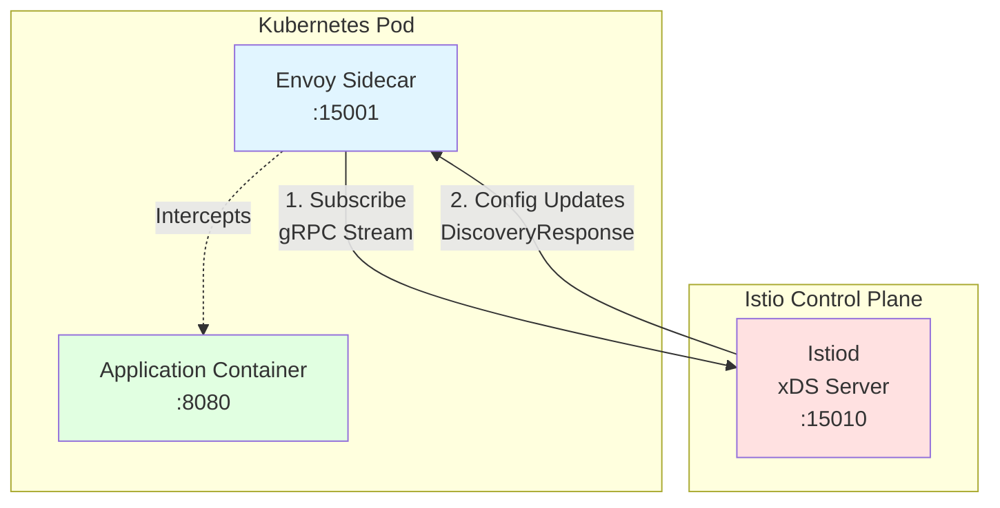
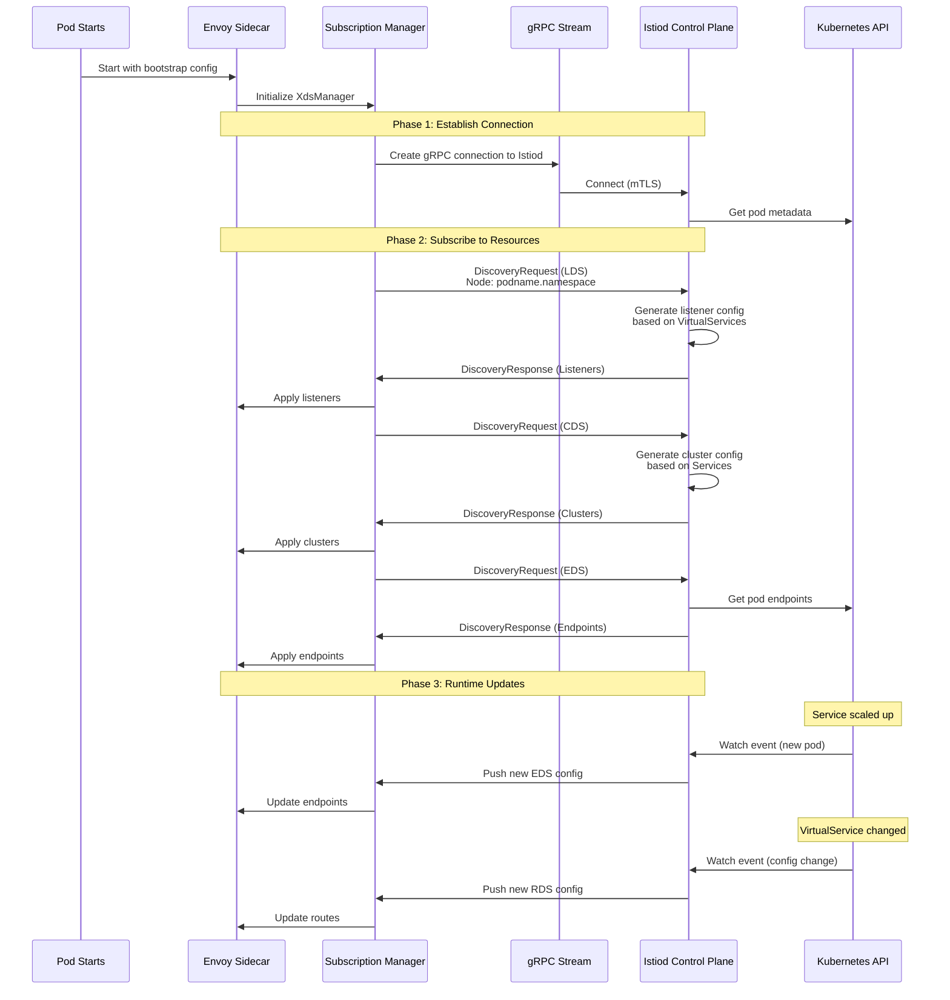
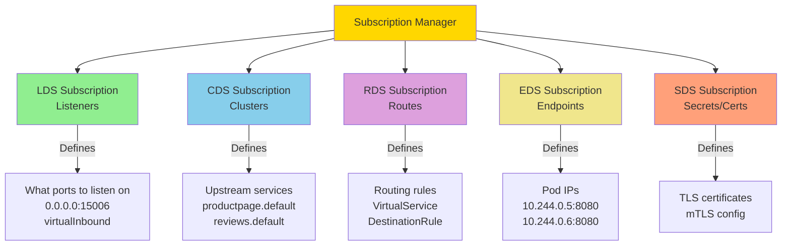
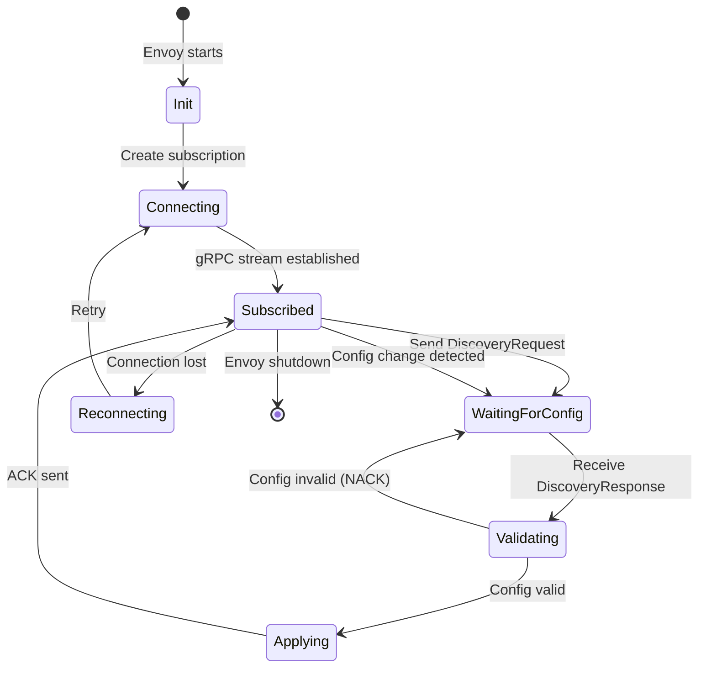
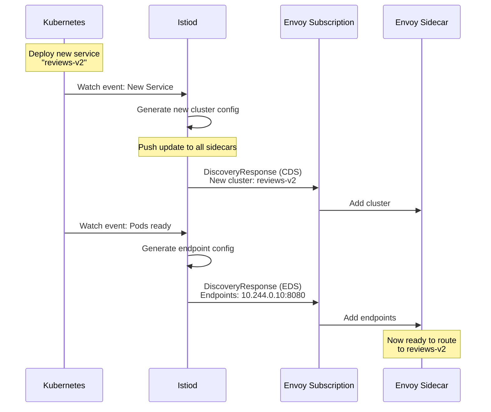

# Understanding Subscriptions in Envoy

## What is a Subscription?

A **subscription** is Envoy's mechanism for receiving **dynamic configuration updates** from a control plane server (like Istiod in Istio).

Think of it like:
- **Netflix subscription**: You subscribe, and new content appears automatically
- **Envoy subscription**: Envoy subscribes to config types, and Istiod pushes updates automatically

## Subscription with Istiod (Istio)

### Architecture



### Complete Flow with Istiod



## Subscription Types

### 1. ADS (Aggregated Discovery Service) - **Default in Istio**

**Single gRPC stream for all resource types**

```yaml
# Typical Istio sidecar config
dynamic_resources:
  ads_config:
    api_type: GRPC
    transport_api_version: V3
    grpc_services:
      - envoy_grpc:
          cluster_name: xds-grpc
    set_node_on_first_message_only: true
  
  # All resources use ADS
  lds_config: { ads: {} }
  cds_config: { ads: {} }
  rds_config: { ads: {} }
```

**Benefits:**
- Single connection (less overhead)
- Ordered updates (dependencies respected)
- Atomic updates across resource types

**Flow:**
```
┌─────────┐                    ┌─────────┐
│  Envoy  │◄──ADS gRPC Stream──┤ Istiod  │
│ Sidecar │    (multiplexed)   │ (xDS)   │
└─────────┘                    └─────────┘
     ▲                              │
     │     LDS, CDS, RDS, EDS      │
     └──────────────────────────────┘
```

### 2. Individual xDS

**Separate connection per resource type**

```yaml
dynamic_resources:
  lds_config:
    api_config_source:
      api_type: GRPC
      grpc_services:
        - envoy_grpc:
            cluster_name: lds-cluster
  
  cds_config:
    api_config_source:
      api_type: GRPC
      grpc_services:
        - envoy_grpc:
            cluster_name: cds-cluster
```

**Flow:**
```
┌─────────┐    LDS Stream    ┌─────────┐
│  Envoy  │◄─────────────────┤ Istiod  │
│         │    CDS Stream    │         │
│         │◄─────────────────┤         │
│         │    RDS Stream    │         │
│         │◄─────────────────┤         │
└─────────┘                  └─────────┘
```

### 3. Filesystem (Development/Testing)

**Watch local config files**

```yaml
dynamic_resources:
  lds_config:
    path_config_source:
      path: /etc/envoy/lds.yaml
      watched_directory:
        path: /etc/envoy
```

**Use Case:** Local development, static deployments

## What Gets Subscribed?

### Resource Types in Istio



### Mapping Istio Resources to Subscriptions

| Istio Resource | Subscription Type | What Envoy Receives |
|----------------|-------------------|---------------------|
| **Service** | CDS, EDS | Cluster config + endpoint IPs |
| **VirtualService** | RDS, LDS | Routes and listeners |
| **DestinationRule** | CDS | Load balancing, circuit breakers |
| **Gateway** | LDS, RDS | Gateway listeners and routes |
| **ServiceEntry** | CDS, EDS | External service definitions |
| **PeerAuthentication** | LDS, CDS | mTLS settings |
| **AuthorizationPolicy** | LDS | RBAC filters |

## Subscription Lifecycle



## Subscription in Code

### Creating a Subscription

```cpp
// From source/common/config/xds_manager_impl.cc
absl::StatusOr<SubscriptionPtr> XdsManagerImpl::subscribeToSingletonResource(
    absl::string_view resource_name,
    absl::string_view type_url,  // e.g., "Listener"
    Stats::Scope& scope,
    SubscriptionCallbacks& callbacks) {
  
  // Create subscription via factory
  return subscription_factory_->subscriptionFromConfigSource(
      ads_config_source_,  // Connection to Istiod
      type_url,            // What resource type
      scope,
      callbacks,           // Called when config arrives
      resource_decoder_,
      options);
}
```

### Receiving Updates

```cpp
// Subscription callback when Istiod pushes new config
void onConfigUpdate(
    const std::vector<DecodedResourceRef>& resources,
    const std::string& version_info) {
  
  // Process each resource from Istiod
  for (const auto& resource : resources) {
    // Validate
    if (!validateResource(resource)) {
      // Send NACK to Istiod
      sendNack(version_info);
      return;
    }
    
    // Apply configuration
    applyResource(resource);
  }
  
  // Send ACK to Istiod
  sendAck(version_info);
}
```

## Example: Service Deployment Flow

### Scenario: Deploy new microservice in Istio



## Debugging Subscriptions

### Check Subscription Status

```bash
# Check if subscriptions are connected
curl http://localhost:15000/stats | grep control_plane.connected_state

# Check subscription errors
curl http://localhost:15000/stats | grep update_failure

# Check last update time
curl http://localhost:15000/stats | grep update_success
```

### View Current Config from Istiod

```bash
# Dump all config received from Istiod
curl http://localhost:15000/config_dump

# Check specific resource type
curl http://localhost:15000/config_dump?resource=listeners
curl http://localhost:15000/config_dump?resource=clusters
```

### Enable Debug Logging

```bash
# Enable xDS subscription debugging
curl -X POST "http://localhost:15000/logging?level=debug&paths=config:trace"

# Check logs
kubectl logs -f pod-name -c istio-proxy | grep xds
```

## Common Subscription Issues

### 1. Initial Fetch Timeout

**Symptom**: Envoy fails to start
```
Initial fetch timeout
```

**Cause**: Can't reach Istiod or Istiod too slow

**Fix**:
```yaml
ads_config:
  initial_fetch_timeout: 30s  # Increase timeout
```

### 2. NACK (Negative Acknowledgment)

**Symptom**: Config not applying
```
update_rejected: 5
```

**Cause**: Invalid config from Istiod

**Debug**:
```bash
# Check what was rejected
curl localhost:15000/config_dump | jq '.configs[] | select(.["@type"] | contains("Listener")) | .error_state'
```

### 3. Subscription Disconnect

**Symptom**: No updates received
```
control_plane.connected_state: 0
```

**Cause**: Network issues, Istiod restart

**Check**:
```bash
# Verify connectivity to Istiod
kubectl exec -it pod-name -c istio-proxy -- curl -v istiod.istio-system:15010
```

## Summary

**Subscriptions in Envoy:**

1. **Definition**: Active connection to receive config updates from control plane
2. **With Istiod**: Yes! Subscriptions connect Envoy sidecars to Istiod
3. **Protocol**: gRPC streaming (bidirectional)
4. **Types**: ADS (all-in-one) or individual xDS
5. **Resources**: LDS, CDS, RDS, EDS, SDS
6. **Lifecycle**: Connect → Subscribe → Receive → Apply → Update

**Key Takeaway**: Without subscriptions, Envoy would only have static config. Subscriptions enable **dynamic service mesh** capabilities - services can scale, routes can change, and Envoy automatically adapts!
