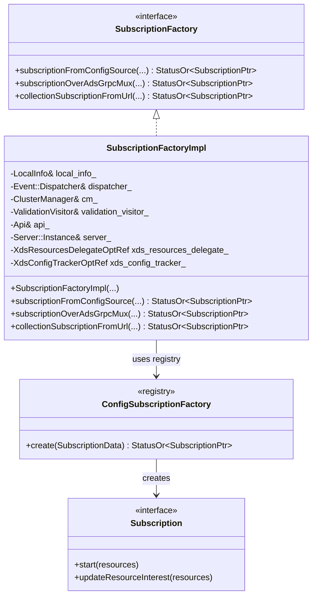
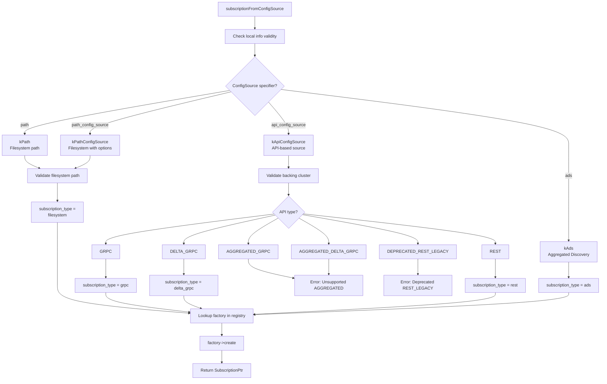
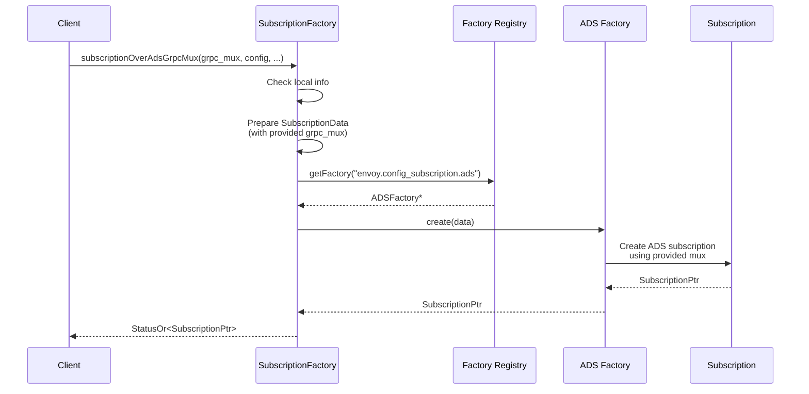
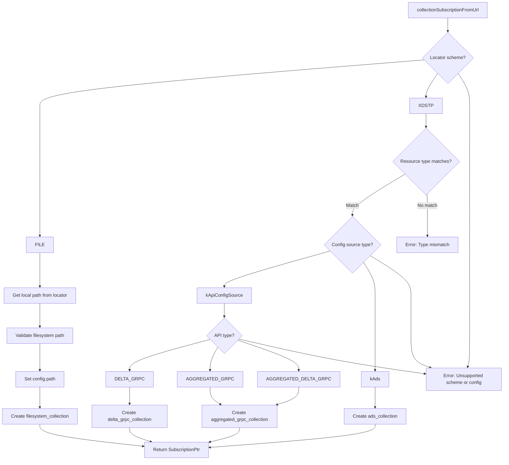
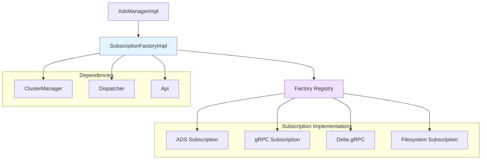

# Subscription Factory Implementation

**File:** `source/common/config/subscription_factory_impl.h` and `source/common/config/subscription_factory_impl.cc`

**Purpose:** The Subscription Factory creates and manages different types of xDS subscriptions (ADS, gRPC, REST, Filesystem) based on configuration source specifications. It implements the Factory pattern to abstract subscription creation logic.

## Table of Contents
1. [Overview](#overview)
2. [Class Structure](#class-structure)
3. [Subscription Types](#subscription-types)
4. [Factory Decision Flow](#factory-decision-flow)
5. [Key Methods](#key-methods)
6. [Configuration Examples](#configuration-examples)
7. [Usage Patterns](#usage-patterns)

## Overview

The SubscriptionFactoryImpl is responsible for:
- Analyzing ConfigSource specifications
- Selecting the appropriate subscription implementation
- Creating and initializing subscriptions
- Handling both singleton and collection-based resources
- Supporting xDSTP (xDS Transport Protocol) resource locators

## Class Structure



### SubscriptionFactoryImpl Members

```cpp
class SubscriptionFactoryImpl : public SubscriptionFactory {
public:
  SubscriptionFactoryImpl(
      const LocalInfo::LocalInfo& local_info, 
      Event::Dispatcher& dispatcher,
      Upstream::ClusterManager& cm,
      ProtobufMessage::ValidationVisitor& validation_visitor, 
      Api::Api& api,
      const Server::Instance& server,
      XdsResourcesDelegateOptRef xds_resources_delegate,
      XdsConfigTrackerOptRef xds_config_tracker);

private:
  const LocalInfo::LocalInfo& local_info_;
  Event::Dispatcher& dispatcher_;
  Upstream::ClusterManager& cm_;
  ProtobufMessage::ValidationVisitor& validation_visitor_;
  Api::Api& api_;
  const Server::Instance& server_;
  XdsResourcesDelegateOptRef xds_resources_delegate_;
  XdsConfigTrackerOptRef xds_config_tracker_;
};
```

## Subscription Types

The factory supports multiple subscription types through a plugin registry:

```mermaid
graph TD
    SF[SubscriptionFactoryImpl]
    
    SF --> ADS[envoy.config_subscription.ads<br/>ADS Subscription]
    SF --> GRPC[envoy.config_subscription.grpc<br/>gRPC Subscription]
    SF --> DGRPC[envoy.config_subscription.delta_grpc<br/>Delta gRPC Subscription]
    SF --> REST[envoy.config_subscription.rest<br/>REST Subscription]
    SF --> FS[envoy.config_subscription.filesystem<br/>Filesystem Subscription]
    SF --> ADSC[envoy.config_subscription.ads_collection<br/>ADS Collection]
    SF --> DGCOLL[envoy.config_subscription.delta_grpc_collection<br/>Delta gRPC Collection]
    SF --> AGCOLL[envoy.config_subscription.aggregated_grpc_collection<br/>Aggregated gRPC Collection]
    SF --> FSCOLL[envoy.config_subscription.filesystem_collection<br/>Filesystem Collection]
    
    style ADS fill:#e1f5ff
    style GRPC fill:#e1f5ff
    style DGRPC fill:#e1f5ff
    style REST fill:#e1f5ff
    style FS fill:#fff4e1
    style ADSC fill:#f0e1ff
    style DGCOLL fill:#f0e1ff
    style AGCOLL fill:#f0e1ff
    style FSCOLL fill:#f0e1ff
```



### Subscription Type Characteristics

| Type | Protocol | Use Case | Collection Support |
|------|----------|----------|-------------------|
| ADS | gRPC (SotW or Delta) | Aggregated discovery of all resource types | Yes |
| gRPC | gRPC (SotW) | Direct gRPC subscription to management server | No |
| Delta gRPC | gRPC (Delta) | Direct delta gRPC subscription | Yes |
| REST | HTTP REST | Polling-based discovery (deprecated) | No |
| Filesystem | File watching | Configuration from local filesystem | Yes |

## Factory Decision Flow

### subscriptionFromConfigSource()

This is the primary method for creating subscriptions from a ConfigSource:



**Implementation:**

```cpp
absl::StatusOr<SubscriptionPtr> 
SubscriptionFactoryImpl::subscriptionFromConfigSource(
    const envoy::config::core::v3::ConfigSource& config, 
    absl::string_view type_url,
    Stats::Scope& scope, 
    SubscriptionCallbacks& callbacks,
    OpaqueResourceDecoderSharedPtr resource_decoder, 
    const SubscriptionOptions& options) {
    
  // Validate local info
  RETURN_IF_NOT_OK(Config::Utility::checkLocalInfo(type_url, local_info_));

  std::string subscription_type = "";
  
  // Prepare subscription data
  ConfigSubscriptionFactory::SubscriptionData data{
      local_info_, dispatcher_, cm_, validation_visitor_, api_, server_,
      xds_resources_delegate_, xds_config_tracker_, config, type_url,
      scope, callbacks, resource_decoder, options, absl::nullopt,
      Utility::generateStats(scope), cm_.adsMux()};

  // Determine subscription type based on config source
  switch (config.config_source_specifier_case()) {
  case ConfigSource::kPath: {
    RETURN_IF_NOT_OK(
        Utility::checkFilesystemSubscriptionBackingPath(config.path(), api_));
    subscription_type = "envoy.config_subscription.filesystem";
    break;
  }
  case ConfigSource::kPathConfigSource: {
    RETURN_IF_NOT_OK(Utility::checkFilesystemSubscriptionBackingPath(
        config.path_config_source().path(), api_));
    subscription_type = "envoy.config_subscription.filesystem";
    break;
  }
  case ConfigSource::kApiConfigSource: {
    const auto& api_config_source = config.api_config_source();
    
    // Check cluster exists for non-secret types
    if (type_url != getTypeUrl<tls::v3::Secret>()) {
      RETURN_IF_NOT_OK(
          Utility::checkApiConfigSourceSubscriptionBackingCluster(
              cm_.primaryClusters(), api_config_source));
    }
    
    RETURN_IF_NOT_OK(Utility::checkTransportVersion(api_config_source));
    
    switch (api_config_source.api_type()) {
    case ApiConfigSource::AGGREGATED_GRPC:
    case ApiConfigSource::AGGREGATED_DELTA_GRPC:
      return absl::InvalidArgumentError(
          "Unsupported config source AGGREGATED_*");
    case ApiConfigSource::DEPRECATED_AND_UNAVAILABLE_DO_NOT_USE:
      return absl::InvalidArgumentError(
          "REST_LEGACY no longer supported");
    case ApiConfigSource::REST:
      subscription_type = "envoy.config_subscription.rest";
      break;
    case ApiConfigSource::GRPC:
      subscription_type = "envoy.config_subscription.grpc";
      break;
    case ApiConfigSource::DELTA_GRPC:
      subscription_type = "envoy.config_subscription.delta_grpc";
      break;
    }
    break;
  }
  case ConfigSource::kAds: {
    subscription_type = "envoy.config_subscription.ads";
    break;
  }
  default:
    return absl::InvalidArgumentError("Missing config source specifier");
  }
  
  // Look up factory and create subscription
  ConfigSubscriptionFactory* factory =
      Registry::FactoryRegistry<ConfigSubscriptionFactory>::getFactory(
          subscription_type);
  if (factory == nullptr) {
    return absl::InvalidArgumentError(
        fmt::format("No factory for subscription type: '{}'", 
                    subscription_type));
  }
  
  return factory->create(data);
}
```

### subscriptionOverAdsGrpcMux()

Creates a subscription that uses a specific GrpcMux (used for xDSTP authorities):



**Implementation:**

```cpp
absl::StatusOr<SubscriptionPtr> 
SubscriptionFactoryImpl::subscriptionOverAdsGrpcMux(
    GrpcMuxSharedPtr& ads_grpc_mux, 
    const envoy::config::core::v3::ConfigSource& config,
    absl::string_view type_url, 
    Stats::Scope& scope, 
    SubscriptionCallbacks& callbacks,
    OpaqueResourceDecoderSharedPtr resource_decoder, 
    const SubscriptionOptions& options) {
    
  RETURN_IF_NOT_OK(Config::Utility::checkLocalInfo(type_url, local_info_));

  ConfigSubscriptionFactory::SubscriptionData data{
      local_info_, dispatcher_, cm_, validation_visitor_, api_, server_,
      xds_resources_delegate_, xds_config_tracker_, config, type_url,
      scope, callbacks, resource_decoder, options, absl::nullopt,
      Utility::generateStats(scope), 
      ads_grpc_mux  // Use provided mux instead of cm_.adsMux()
  };
  
  static constexpr absl::string_view subscription_type = 
      "envoy.config_subscription.ads";
      
  ConfigSubscriptionFactory* factory =
      Registry::FactoryRegistry<ConfigSubscriptionFactory>::getFactory(
          subscription_type);
  if (factory == nullptr) {
    return absl::InvalidArgumentError(
        fmt::format("No factory for: '{}'", subscription_type));
  }
  
  return factory->create(data);
}
```

### collectionSubscriptionFromUrl()

Creates subscriptions for resource collections (xDSTP-based):



**Implementation:**

```cpp
absl::StatusOr<SubscriptionPtr> 
SubscriptionFactoryImpl::collectionSubscriptionFromUrl(
    const xds::core::v3::ResourceLocator& collection_locator,
    const envoy::config::core::v3::ConfigSource& config, 
    absl::string_view resource_type,
    Stats::Scope& scope, 
    SubscriptionCallbacks& callbacks,
    OpaqueResourceDecoderSharedPtr resource_decoder) {
    
  SubscriptionOptions options;
  envoy::config::core::v3::ConfigSource factory_config = config;
  
  ConfigSubscriptionFactory::SubscriptionData data{
      local_info_, dispatcher_, cm_, validation_visitor_, api_, server_,
      xds_resources_delegate_, xds_config_tracker_, factory_config, "",
      scope, callbacks, resource_decoder, options, 
      {collection_locator},  // Pass collection locator
      Utility::generateStats(scope), cm_.adsMux()};
  
  switch (collection_locator.scheme()) {
  case ResourceLocator::FILE: {
    // Extract local path
    const std::string path = 
        Http::Utility::localPathFromFilePath(collection_locator.id());
    RETURN_IF_NOT_OK(
        Utility::checkFilesystemSubscriptionBackingPath(path, api_));
    factory_config.set_path(path);
    
    return createFromFactory(data, 
        "envoy.config_subscription.filesystem_collection");
  }
  case ResourceLocator::XDSTP: {
    // Verify resource type matches
    if (resource_type != collection_locator.resource_type()) {
      return absl::InvalidArgumentError(
          fmt::format("xdstp:// type mismatch: {} vs {}", 
                      resource_type, collection_locator.resource_type()));
    }
    
    switch (config.config_source_specifier_case()) {
    case ConfigSource::kApiConfigSource: {
      const auto& api_config_source = config.api_config_source();
      RETURN_IF_NOT_OK(
          Utility::checkApiConfigSourceSubscriptionBackingCluster(
              cm_.primaryClusters(), api_config_source));
      
      // Collections are xDS resource graph roots - need node context
      options.add_xdstp_node_context_params_ = true;
      
      switch (api_config_source.api_type()) {
      case ApiConfigSource::DELTA_GRPC: {
        std::string type_url = 
            TypeUtil::descriptorFullNameToTypeUrl(resource_type);
        data.type_url_ = type_url;
        return createFromFactory(data,
            "envoy.config_subscription.delta_grpc_collection");
      }
      case ApiConfigSource::AGGREGATED_GRPC:
      case ApiConfigSource::AGGREGATED_DELTA_GRPC: {
        return createFromFactory(data,
            "envoy.config_subscription.aggregated_grpc_collection");
      }
      default:
        return absl::InvalidArgumentError(
            "Unknown xdstp:// transport API type");
      }
    }
    case ConfigSource::kAds: {
      options.add_xdstp_node_context_params_ = true;
      return createFromFactory(data, 
          "envoy.config_subscription.ads_collection");
    }
    default:
      return absl::InvalidArgumentError(
          "Unsupported config source for collection");
    }
  }
  default:
    return absl::InvalidArgumentError("Unsupported locator scheme");
  }
}
```

## Key Methods

### SubscriptionData Structure

All factory methods use a common `SubscriptionData` structure:

```cpp
struct SubscriptionData {
  const LocalInfo::LocalInfo& local_info_;
  Event::Dispatcher& dispatcher_;
  Upstream::ClusterManager& cm_;
  ProtobufMessage::ValidationVisitor& validation_visitor_;
  Api::Api& api_;
  const Server::Instance& server_;
  XdsResourcesDelegateOptRef xds_resources_delegate_;
  XdsConfigTrackerOptRef xds_config_tracker_;
  const envoy::config::core::v3::ConfigSource& config_;
  absl::string_view type_url_;
  Stats::Scope& scope_;
  SubscriptionCallbacks& callbacks_;
  OpaqueResourceDecoderSharedPtr resource_decoder_;
  const SubscriptionOptions& options_;
  absl::optional<xds::core::v3::ResourceLocator> collection_locator_;
  SubscriptionStats stats_;
  GrpcMuxSharedPtr ads_mux_;
};
```

## Configuration Examples

### Example 1: ADS Configuration

```yaml
# ConfigSource with ADS
config_source:
  ads: {}
  resource_api_version: V3
```

Creates an ADS subscription using the cluster manager's primary ADS mux.

### Example 2: Direct gRPC Subscription

```yaml
# ConfigSource with direct gRPC
config_source:
  api_config_source:
    api_type: GRPC
    transport_api_version: V3
    grpc_services:
    - envoy_grpc:
        cluster_name: xds_cluster
    set_node_on_first_message_only: true
  resource_api_version: V3
```

Creates a direct gRPC subscription to the specified cluster.

### Example 3: Delta gRPC Subscription

```yaml
# ConfigSource with delta gRPC
config_source:
  api_config_source:
    api_type: DELTA_GRPC
    transport_api_version: V3
    grpc_services:
    - envoy_grpc:
        cluster_name: xds_cluster
  resource_api_version: V3
```

Creates a delta (incremental) gRPC subscription.

### Example 4: Filesystem Subscription

```yaml
# ConfigSource with filesystem
config_source:
  path: /etc/envoy/listeners.yaml
  resource_api_version: V3
```

Creates a filesystem watcher subscription that reloads on file changes.

### Example 5: Filesystem with WatchedDirectory

```yaml
# ConfigSource with watched directory
config_source:
  path_config_source:
    path: /etc/envoy/listeners.yaml
    watched_directory:
      path: /etc/envoy
  resource_api_version: V3
```

Watches the entire directory for changes (more efficient for multiple files).

### Example 6: xDSTP Collection

```cpp
// Create collection subscription for xDSTP resource
xds::core::v3::ResourceLocator locator;
locator.set_scheme(xds::core::v3::ResourceLocator::XDSTP);
locator.set_authority("xds.example.com");
locator.set_resource_type("envoy.config.listener.v3.Listener");
locator.set_id("prod/listeners");

envoy::config::core::v3::ConfigSource config;
config.mutable_api_config_source()->set_api_type(
    envoy::config::core::v3::ApiConfigSource::AGGREGATED_DELTA_GRPC);
// ... configure grpc_services

auto subscription = factory->collectionSubscriptionFromUrl(
    locator, config, "envoy.config.listener.v3.Listener", 
    scope, callbacks, decoder);
```

## Usage Patterns

### Pattern 1: Creating Standard Subscriptions

```cpp
class MyConfigSubscriber {
public:
  void initialize(SubscriptionFactory& factory, 
                  const ConfigSource& config) {
    auto subscription_or_error = factory.subscriptionFromConfigSource(
        config,
        "type.googleapis.com/envoy.config.listener.v3.Listener",
        *scope_,
        *this,  // SubscriptionCallbacks
        decoder_,
        options_);
    
    if (!subscription_or_error.ok()) {
      throw EnvoyException(subscription_or_error.status().message());
    }
    
    subscription_ = std::move(*subscription_or_error);
    subscription_->start({"listener-1", "listener-2"});
  }
  
  // SubscriptionCallbacks implementation
  absl::Status onConfigUpdate(
      const std::vector<DecodedResourceRef>& resources,
      const std::string& version_info) override {
    // Handle config update
    return absl::OkStatus();
  }
  
private:
  SubscriptionPtr subscription_;
  Stats::ScopeSharedPtr scope_;
  OpaqueResourceDecoderSharedPtr decoder_;
  SubscriptionOptions options_;
};
```

### Pattern 2: Using Authority-Specific Mux

```cpp
class XdstpSubscriber {
public:
  void initialize(SubscriptionFactory& factory,
                  GrpcMuxSharedPtr& authority_mux,
                  const ConfigSource& config) {
    auto subscription_or_error = factory.subscriptionOverAdsGrpcMux(
        authority_mux,  // Use specific authority's mux
        config,
        "type.googleapis.com/envoy.config.cluster.v3.Cluster",
        *scope_,
        *this,
        decoder_,
        options_);
    
    if (!subscription_or_error.ok()) {
      ENVOY_LOG(error, "Failed to create xDSTP subscription: {}", 
                subscription_or_error.status().message());
      return;
    }
    
    subscription_ = std::move(*subscription_or_error);
    subscription_->start({});  // Start with wildcard
  }
  
private:
  SubscriptionPtr subscription_;
  Stats::ScopeSharedPtr scope_;
  OpaqueResourceDecoderSharedPtr decoder_;
  SubscriptionOptions options_;
};
```

### Pattern 3: Collection Subscription

```cpp
class CollectionSubscriber {
public:
  void initializeCollection(
      SubscriptionFactory& factory,
      const xds::core::v3::ResourceLocator& locator,
      const ConfigSource& config) {
    auto subscription_or_error = factory.collectionSubscriptionFromUrl(
        locator,
        config,
        "envoy.config.endpoint.v3.ClusterLoadAssignment",
        *scope_,
        *this,
        decoder_);
    
    if (!subscription_or_error.ok()) {
      throw EnvoyException(subscription_or_error.status().message());
    }
    
    subscription_ = std::move(*subscription_or_error);
    // Collections start automatically
  }
  
private:
  SubscriptionPtr subscription_;
  Stats::ScopeSharedPtr scope_;
  OpaqueResourceDecoderSharedPtr decoder_;
};
```

## Relationship with Other Components



## Error Handling

The factory performs extensive validation:

1. **Local Info Validation**: Ensures cluster/node info is set
2. **Cluster Validation**: Verifies backing clusters exist (except for secrets)
3. **Path Validation**: Checks filesystem paths exist and are accessible
4. **Transport Version**: Validates API version compatibility
5. **Type Matching**: Ensures resource types match for collections

**Example Error Handling:**

```cpp
auto subscription_or_error = factory.subscriptionFromConfigSource(...);
if (!subscription_or_error.ok()) {
  const auto& status = subscription_or_error.status();
  
  if (absl::IsInvalidArgument(status)) {
    // Configuration error - log and potentially fail fast
    ENVOY_LOG(critical, "Invalid config: {}", status.message());
    throw EnvoyException(status.message());
  } else if (absl::IsNotFound(status)) {
    // Resource not found - might be recoverable
    ENVOY_LOG(warn, "Resource not found: {}", status.message());
    // Use fallback or retry
  }
}
```

## Threading Model

**Thread Safety:**
- Factory methods must be called from the main thread
- Created subscriptions inherit the dispatcher and maintain thread safety
- Callbacks are invoked on the main thread

## Performance Considerations

1. **Factory Lookup**: O(1) hash map lookup in registry
2. **Validation Overhead**: Front-loaded during creation
3. **Shared Muxes**: Multiple subscriptions can share the same GrpcMux
4. **Lazy Initialization**: Subscriptions are created on-demand

## Related Documentation

- [01-xds-manager-impl.md](01-xds-manager-impl.md) - How XdsManager uses this factory
- [05-xds-resource.md](05-xds-resource.md) - xDSTP resource format details
- [CONFIG_ARCHITECTURE.md](../CONFIG_ARCHITECTURE.md) - Overall architecture

## Key Takeaways

1. **Factory Pattern**: Clean abstraction for subscription creation
2. **Type Safety**: Strong validation at creation time
3. **Plugin Architecture**: Extensible through factory registry
4. **Multiple Protocols**: Supports ADS, gRPC, REST, and filesystem
5. **Collection Support**: First-class support for xDSTP collections
6. **Error Propagation**: Uses StatusOr for clear error handling
