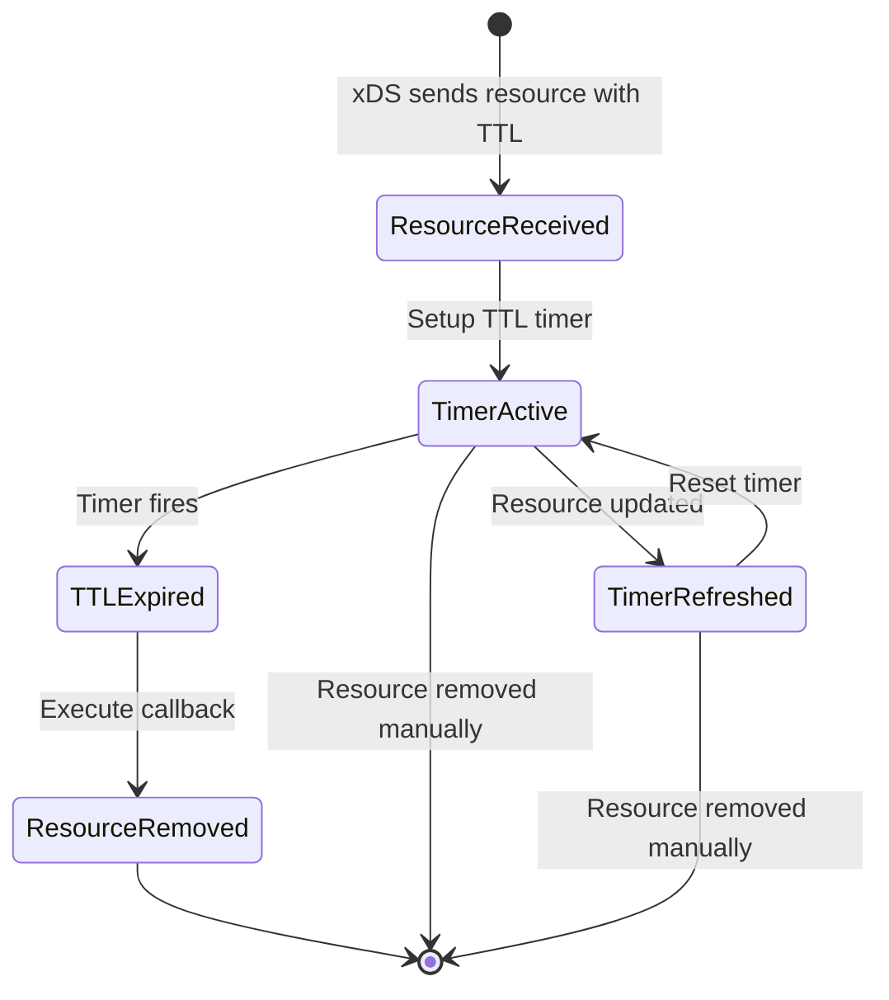
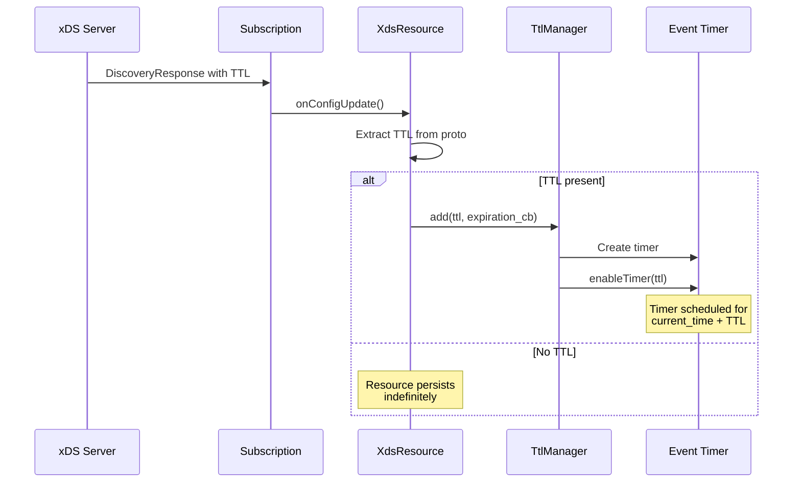
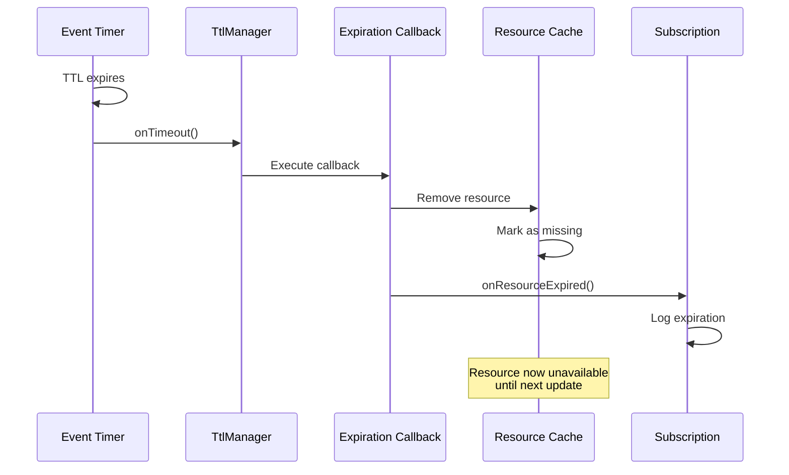
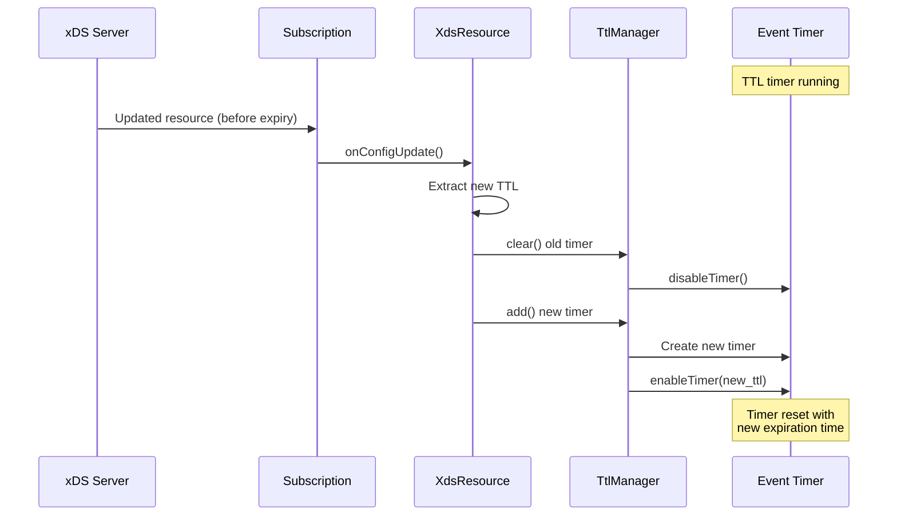
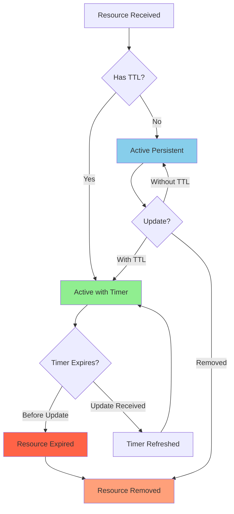

# TTL Management - Time-To-Live for xDS Resources

**Files**: `source/common/config/ttl.h`, `ttl.cc`

## Overview

The TTL (Time-To-Live) management module provides **automatic expiration** of xDS resources. When an xDS server specifies a TTL for a resource, Envoy will automatically remove that resource after the TTL expires if no update is received.

## Purpose

1. **Automatic Cleanup**: Remove stale resources without manual intervention
2. **Memory Management**: Prevent unbounded resource accumulation
3. **Graceful Degradation**: Handle temporary control plane outages
4. **SLA Compliance**: Respect server-specified resource lifetimes

## Architecture

```mermaid
classDiagram
    class TtlManager {
        +add(ttl_timer_cb, payload)
        +clear()
        -scope_tracked_object_stack_
        -tls_
    }
    
    class TtlTimer {
        +TtlTimer(ttl, timer, cb)
        -disableTimer()
        -timer_
        -callback_
        -ttl_
    }
    
    class ResourceTTL {
        +setupTTL(resource, callback)
        +refreshTTL()
        +onTTLExpired()
        -ttl_manager_
        -resource_name_
    }
    
    TtlManager --> TtlTimer : creates
    ResourceTTL --> TtlManager : uses
    TtlTimer --> Event::Timer : owns
```

## Core Components

### 1. TtlManager Class

**Purpose**: Manages TTL timers for multiple resources.

```cpp
class TtlManager : public Logger::Loggable<Logger::Id::config> {
public:
  using TtlTimerCb = std::function<void()>;
  
  TtlManager(Event::Dispatcher& dispatcher, 
             const ScopeTrackedObject& parent_scope);
  
  // Add a new TTL timer
  void add(std::chrono::milliseconds ttl, 
           const TtlTimerCb& callback,
           ScopeTrackedObjectSharedPtr payload);
  
  // Clear all TTL timers
  void clear();
  
private:
  Event::Dispatcher& dispatcher_;
  std::vector<std::unique_ptr<TtlTimer>> timers_;
  const ScopeTrackedObject& parent_scope_;
};
```

### 2. TtlTimer Class

**Purpose**: Individual TTL timer for a single resource.

```cpp
class TtlTimer : public Event::DeferredDeletable {
public:
  TtlTimer(std::chrono::milliseconds ttl,
           Event::Dispatcher& dispatcher,
           const TtlManager::TtlTimerCb& callback);
  
  ~TtlTimer() override { disableTimer(); }
  
private:
  void disableTimer();
  
  Event::TimerPtr timer_;
  TtlManager::TtlTimerCb callback_;
  std::chrono::milliseconds ttl_;
};
```

## TTL Lifecycle



## Flow Diagrams

### TTL Setup Flow



### TTL Expiration Flow



### TTL Refresh Flow



## Implementation Details

### Adding a TTL Timer

```cpp
void TtlManager::add(std::chrono::milliseconds ttl, 
                     const TtlTimerCb& callback,
                     ScopeTrackedObjectSharedPtr payload) {
  auto timer = std::make_unique<TtlTimer>(ttl, dispatcher_, callback);
  timers_.push_back(std::move(timer));
  
  // Track object for debugging
  if (payload) {
    scope_tracked_object_stack_.add(*payload);
  }
}
```

### TtlTimer Constructor

```cpp
TtlTimer::TtlTimer(std::chrono::milliseconds ttl,
                   Event::Dispatcher& dispatcher,
                   const TtlTimerCb& callback)
    : ttl_(ttl), callback_(callback) {
  
  timer_ = dispatcher.createTimer([this]() {
    // Timer fired - resource TTL expired
    callback_();
    // Timer will be deleted after callback
  });
  
  // Enable timer with TTL duration
  timer_->enableTimer(ttl_);
  
  ENVOY_LOG(debug, "TTL timer created for {} ms", ttl_.count());
}
```

### Clearing Timers

```cpp
void TtlManager::clear() {
  // Disable all timers
  for (auto& timer : timers_) {
    // Deferred deletion ensures timer callback won't run
    timer->disableTimer();
  }
  
  timers_.clear();
  scope_tracked_object_stack_.clear();
}
```

## Usage in xDS Resources

### Resource Proto with TTL

```protobuf
message Resource {
  string name = 1;
  google.protobuf.Any resource = 2;
  
  // TTL for the resource
  google.protobuf.Duration ttl = 3;
}
```

### Example: Listener with TTL

```yaml
# xDS response from control plane
resources:
  - "@type": type.googleapis.com/envoy.config.listener.v3.Listener
    name: listener_0
    address:
      socket_address:
        address: 0.0.0.0
        port_value: 10000
    # TTL: resource expires after 5 minutes
    ttl:
      seconds: 300
```

### Handling TTL in Subscription

```cpp
void Subscription::onConfigUpdate(
    const std::vector<DecodedResourceRef>& resources,
    const std::string& version_info) {
  
  for (const auto& resource : resources) {
    const auto& proto = resource.get().resource();
    const auto& name = resource.get().name();
    
    // Check if resource has TTL
    if (proto.has_ttl()) {
      auto ttl_ms = std::chrono::milliseconds(
          proto.ttl().seconds() * 1000 + 
          proto.ttl().nanos() / 1000000);
      
      // Setup TTL for this resource
      setupResourceTTL(name, ttl_ms);
    }
    
    // Apply resource
    applyResource(resource);
  }
}
```

### Setting up Resource TTL

```cpp
void Subscription::setupResourceTTL(
    const std::string& resource_name,
    std::chrono::milliseconds ttl) {
  
  // Create expiration callback
  auto expiration_cb = [this, resource_name]() {
    ENVOY_LOG(warn, "Resource {} expired (TTL exceeded)", resource_name);
    
    // Remove from cache
    resource_cache_.erase(resource_name);
    
    // Notify subscribers
    callbacks_.onResourceExpired(resource_name);
    
    // Update stats
    stats_.resource_expired_.inc();
  };
  
  // Add to TTL manager
  ttl_manager_.add(ttl, expiration_cb, nullptr);
  
  ENVOY_LOG(debug, "TTL set for resource {}: {} ms", 
            resource_name, ttl.count());
}
```

## Configuration Examples

### Example 1: Short-Lived Endpoints

```yaml
# EDS response with short TTL (30 seconds)
# Useful for rapidly changing endpoint sets
version_info: "v1"
resources:
  - "@type": type.googleapis.com/envoy.config.endpoint.v3.ClusterLoadAssignment
    cluster_name: backend_cluster
    endpoints:
      - locality:
          zone: us-west-2a
        lb_endpoints:
          - endpoint:
              address:
                socket_address:
                  address: 10.0.1.5
                  port_value: 8080
    # Expire after 30 seconds
    ttl:
      seconds: 30
```

### Example 2: Long-Lived Clusters

```yaml
# CDS response with long TTL (1 hour)
# Stable cluster configuration
version_info: "v2"
resources:
  - "@type": type.googleapis.com/envoy.config.cluster.v3.Cluster
    name: service_a
    type: STRICT_DNS
    dns_lookup_family: V4_ONLY
    load_assignment:
      cluster_name: service_a
      endpoints:
        - lb_endpoints:
            - endpoint:
                address:
                  socket_address:
                    address: service-a.default.svc.cluster.local
                    port_value: 8080
    # Expire after 1 hour
    ttl:
      seconds: 3600
```

### Example 3: No TTL (Persistent)

```yaml
# Route configuration without TTL
# Persists until explicitly replaced
version_info: "v3"
resources:
  - "@type": type.googleapis.com/envoy.config.route.v3.RouteConfiguration
    name: local_route
    virtual_hosts:
      - name: backend
        domains: ["*"]
        routes:
          - match: { prefix: "/" }
            route: { cluster: backend_cluster }
    # No TTL specified - persists indefinitely
```

## TTL and Resource States



## Best Practices

### 1. Choose Appropriate TTL Durations

```cpp
// Guidelines for TTL selection
std::chrono::milliseconds chooseTTL(ResourceType type) {
  using namespace std::chrono_literals;
  
  switch (type) {
    case ResourceType::Endpoint:
      return 30s;   // Endpoints change frequently
      
    case ResourceType::Cluster:
      return 5min;  // Clusters change occasionally
      
    case ResourceType::Listener:
      return 1h;    // Listeners rarely change
      
    case ResourceType::Route:
      return 10min; // Routes change moderately
      
    default:
      return 5min;  // Conservative default
  }
}
```

### 2. Handle TTL Expiration Gracefully

```cpp
void onResourceExpired(const std::string& resource_name) {
  // Log warning
  ENVOY_LOG(warn, "Resource {} expired, removing from cache", resource_name);
  
  // Check if resource is critical
  if (isCriticalResource(resource_name)) {
    // Keep using last known good config
    ENVOY_LOG(error, "Critical resource expired, using stale config");
    return;
  }
  
  // Remove non-critical resource
  removeResource(resource_name);
  
  // Update metrics
  stats_.expired_resources_.inc();
}
```

### 3. Monitor TTL Expiration

```cpp
// Stats to track
struct TtlStats {
  Stats::Counter& resources_with_ttl_;
  Stats::Counter& ttl_expirations_;
  Stats::Gauge& active_ttl_timers_;
  Stats::Histogram& ttl_duration_;
};

void recordTTL(std::chrono::milliseconds ttl) {
  stats_.resources_with_ttl_.inc();
  stats_.active_ttl_timers_.inc();
  stats_.ttl_duration_.recordValue(ttl.count());
}
```

### 4. Test TTL Behavior

```cpp
TEST(TtlTest, ResourceExpiresAfterTTL) {
  NiceMock<Event::MockDispatcher> dispatcher;
  Event::MockTimer* timer = new NiceMock<Event::MockTimer>();
  
  EXPECT_CALL(dispatcher, createTimer(_))
      .WillOnce(Invoke([&timer](Event::TimerCb cb) {
        timer->callback_ = cb;
        return timer;
      }));
  
  bool expired = false;
  TtlManager ttl_manager(dispatcher, parent_scope);
  
  // Add TTL timer
  ttl_manager.add(std::chrono::milliseconds(100), 
                  [&expired]() { expired = true; },
                  nullptr);
  
  // Verify timer enabled
  EXPECT_CALL(*timer, enableTimer(std::chrono::milliseconds(100)));
  
  // Simulate timer expiration
  timer->callback_();
  
  // Verify expiration callback fired
  EXPECT_TRUE(expired);
}
```

## Advanced Features

### 1. Dynamic TTL Adjustment

```cpp
class AdaptiveTtlManager {
public:
  std::chrono::milliseconds adjustTTL(
      std::chrono::milliseconds base_ttl,
      const ResourceMetrics& metrics) {
    
    // Shorten TTL if resources change frequently
    if (metrics.update_frequency > 0.5) {  // >50% change rate
      return base_ttl / 2;
    }
    
    // Lengthen TTL if resources are stable
    if (metrics.update_frequency < 0.1) {  // <10% change rate
      return base_ttl * 2;
    }
    
    return base_ttl;
  }
};
```

### 2. TTL with Grace Period

```cpp
void setupTTLWithGrace(std::chrono::milliseconds ttl) {
  // Main TTL
  ttl_manager_.add(ttl, [this]() {
    ENVOY_LOG(warn, "Resource TTL expired, entering grace period");
    
    // Setup grace period
    grace_ttl_manager_.add(grace_period_, [this]() {
      ENVOY_LOG(error, "Grace period expired, removing resource");
      removeResource();
    });
  }, nullptr);
}
```

### 3. TTL Refresh on Access

```cpp
class CachedResource {
public:
  void access() {
    // Refresh TTL on each access
    if (ttl_timer_) {
      ttl_timer_->refresh();
    }
    last_accessed_ = std::chrono::steady_clock::now();
  }
  
private:
  std::unique_ptr<TtlTimer> ttl_timer_;
  std::chrono::steady_clock::time_point last_accessed_;
};
```

## Debugging TTL Issues

### Check TTL Configuration

```bash
# Dump config to see TTL settings
curl http://localhost:9901/config_dump | jq '.configs[] | select(.["@type"] | contains("Listener")) | .dynamic_active_listeners[].listener.ttl'
```

### Monitor TTL Stats

```bash
# Check TTL-related stats
curl http://localhost:9901/stats | grep ttl

# Example output:
# config.ttl.expired: 5
# config.ttl.active_timers: 12
# config.ttl.refreshed: 45
```

### Enable TTL Debug Logging

```bash
curl -X POST "http://localhost:9901/logging?paths=config:trace"
```

## Related Components

- `xds_resource.h/cc` - Uses TTL for resource expiration
- `subscription_impl.h/cc` - Sets up TTL for received resources
- `config_provider_impl.h/cc` - Manages resources with TTL

## Summary

The TTL management module provides:

1. **Automatic Expiration**: Resources expire after specified duration
2. **Memory Efficiency**: Prevents resource accumulation
3. **Graceful Handling**: Smooth resource lifecycle management
4. **xDS Integration**: Seamless integration with xDS protocol
5. **Configurable**: Per-resource TTL configuration

TTL is essential for managing dynamic configurations in distributed systems, ensuring that stale resources are automatically cleaned up while providing flexibility for different resource lifecycles.
