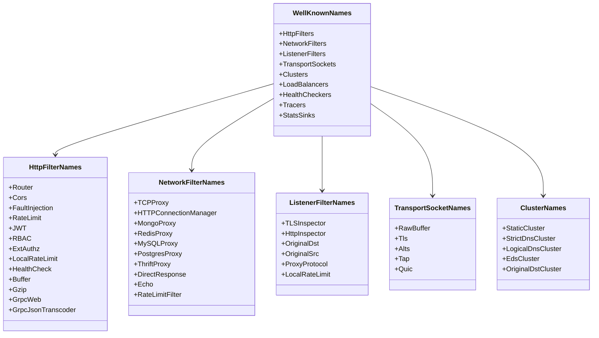
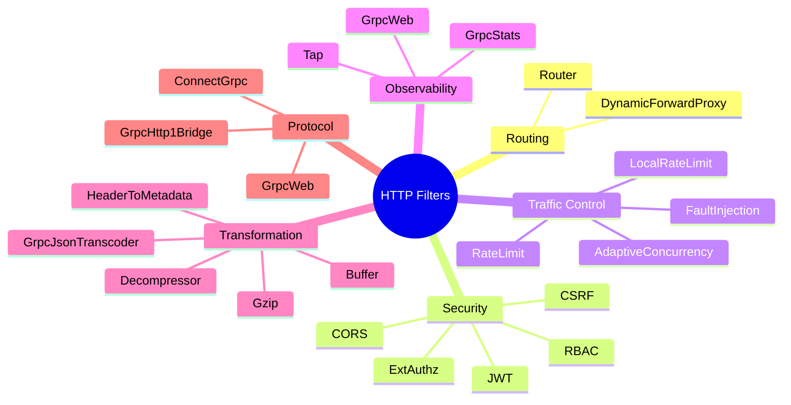
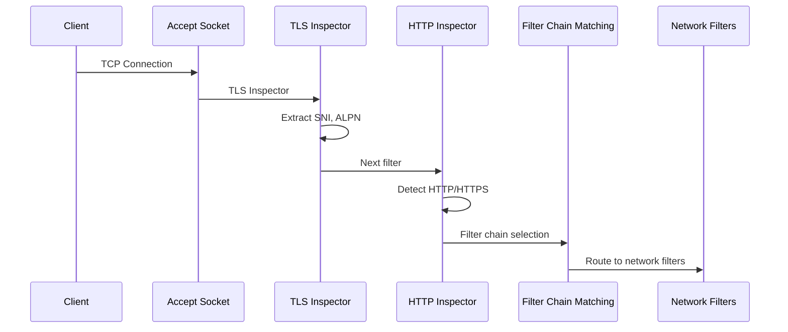
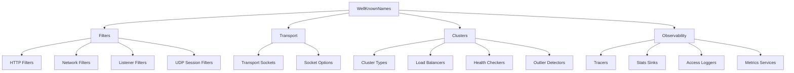

# WellKnownNames - Well-Known Filter and Extension Names

**File**: `source/common/config/well_known_names.h`, `well_known_names.cc`

## Overview

The `WellKnownNames` module provides **string constants** for all well-known filter names, extension names, and metadata keys used throughout Envoy. These constants ensure consistency and type safety when referring to built-in filters and extensions.

## Purpose

1. **Avoid String Literals**: Centralized constants instead of scattered string literals
2. **Type Safety**: Compile-time checking for filter/extension names
3. **Discoverability**: Single place to find all built-in names
4. **Documentation**: Self-documenting list of available filters

## Architecture



## HTTP Filter Names

### Core HTTP Filters

```cpp
namespace HttpFilterNames {
  // Router filter - terminal filter for request routing
  constexpr absl::string_view Router = "envoy.filters.http.router";
  
  // CORS filter - Cross-Origin Resource Sharing
  constexpr absl::string_view Cors = "envoy.filters.http.cors";
  
  // Fault injection filter - for chaos testing
  constexpr absl::string_view Fault = "envoy.filters.http.fault";
  
  // Rate limiting filter - external rate limit service
  constexpr absl::string_view RateLimit = "envoy.filters.http.ratelimit";
  
  // Local rate limiting - in-process rate limiting
  constexpr absl::string_view LocalRateLimit = "envoy.filters.http.local_ratelimit";
  
  // JWT authentication
  constexpr absl::string_view JwtAuthn = "envoy.filters.http.jwt_authn";
  
  // Role-Based Access Control
  constexpr absl::string_view Rbac = "envoy.filters.http.rbac";
  
  // External authorization
  constexpr absl::string_view ExtAuthz = "envoy.filters.http.ext_authz";
}
```

### Usage in Configuration

```yaml
http_filters:
  - name: envoy.filters.http.jwt_authn
    typed_config:
      "@type": type.googleapis.com/envoy.extensions.filters.http.jwt_authn.v3.JwtAuthentication
      # JWT config...
  
  - name: envoy.filters.http.rbac
    typed_config:
      "@type": type.googleapis.com/envoy.extensions.filters.http.rbac.v3.RBAC
      # RBAC config...
  
  - name: envoy.filters.http.router
    typed_config:
      "@type": type.googleapis.com/envoy.extensions.filters.http.router.v3.Router
```

### Usage in Code

```cpp
// Check if a filter is the router filter
if (filter_name == HttpFilterNames::Router) {
  // Handle router filter
}

// Get filter factory
auto* factory = Registry::FactoryRegistry<
    Server::Configuration::NamedHttpFilterConfigFactory>::getFactory(
        HttpFilterNames::JwtAuthn);
```

### Complete HTTP Filter List



## Network Filter Names

### Core Network Filters

```cpp
namespace NetworkFilterNames {
  // TCP proxy - terminal network filter
  constexpr absl::string_view TcpProxy = "envoy.filters.network.tcp_proxy";
  
  // HTTP connection manager - HTTP protocol handling
  constexpr absl::string_view HttpConnectionManager = 
      "envoy.filters.network.http_connection_manager";
  
  // MongoDB proxy
  constexpr absl::string_view MongoProxy = "envoy.filters.network.mongo_proxy";
  
  // Redis proxy
  constexpr absl::string_view RedisProxy = "envoy.filters.network.redis_proxy";
  
  // MySQL proxy
  constexpr absl::string_view MySqlProxy = "envoy.filters.network.mysql_proxy";
  
  // PostgreSQL proxy
  constexpr absl::string_view PostgresProxy = "envoy.filters.network.postgres_proxy";
  
  // Thrift proxy
  constexpr absl::string_view ThriftProxy = "envoy.filters.network.thrift_proxy";
  
  // Direct response - immediate response without upstream
  constexpr absl::string_view DirectResponse = "envoy.filters.network.direct_response";
  
  // Echo - echoes back received data (testing)
  constexpr absl::string_view Echo = "envoy.filters.network.echo";
  
  // RBAC network filter
  constexpr absl::string_view Rbac = "envoy.filters.network.rbac";
  
  // Rate limit network filter
  constexpr absl::string_view RateLimit = "envoy.filters.network.ratelimit";
}
```

### Network Filter Configuration

```yaml
filter_chains:
  - filters:
      # RBAC before HCM
      - name: envoy.filters.network.rbac
        typed_config:
          "@type": type.googleapis.com/envoy.extensions.filters.network.rbac.v3.RBAC
          # RBAC rules...
      
      # HTTP Connection Manager
      - name: envoy.filters.network.http_connection_manager
        typed_config:
          "@type": type.googleapis.com/envoy.extensions.filters.network.http_connection_manager.v3.HttpConnectionManager
          # HCM config...
```

## Listener Filter Names

### Core Listener Filters

```cpp
namespace ListenerFilterNames {
  // TLS Inspector - SNI extraction, ALPN detection
  constexpr absl::string_view TlsInspector = 
      "envoy.filters.listener.tls_inspector";
  
  // HTTP Inspector - HTTP protocol detection
  constexpr absl::string_view HttpInspector = 
      "envoy.filters.listener.http_inspector";
  
  // Original destination - SO_ORIGINAL_DST recovery
  constexpr absl::string_view OriginalDst = 
      "envoy.filters.listener.original_dst";
  
  // Original source - preserve client source address
  constexpr absl::string_view OriginalSrc = 
      "envoy.filters.listener.original_src";
  
  // Proxy protocol - HAProxy PROXY protocol parsing
  constexpr absl::string_view ProxyProtocol = 
      "envoy.filters.listener.proxy_protocol";
  
  // Local rate limit - connection-level rate limiting
  constexpr absl::string_view LocalRateLimit = 
      "envoy.filters.listener.local_ratelimit";
}
```

### Listener Filter Flow



## Transport Socket Names

```cpp
namespace TransportSocketNames {
  // Raw buffer (no TLS)
  constexpr absl::string_view RawBuffer = "envoy.transport_sockets.raw_buffer";
  
  // TLS transport socket
  constexpr absl::string_view Tls = "envoy.transport_sockets.tls";
  
  // ALTS (Application Layer Transport Security)
  constexpr absl::string_view Alts = "envoy.transport_sockets.alts";
  
  // Tap transport socket (for traffic capture)
  constexpr absl::string_view Tap = "envoy.transport_sockets.tap";
  
  // QUIC transport socket
  constexpr absl::string_view Quic = "envoy.transport_sockets.quic";
}
```

### Transport Socket Configuration

```yaml
transport_socket:
  name: envoy.transport_sockets.tls
  typed_config:
    "@type": type.googleapis.com/envoy.extensions.transport_sockets.tls.v3.DownstreamTlsContext
    common_tls_context:
      tls_certificates:
        - certificate_chain: { filename: "/etc/certs/server.crt" }
          private_key: { filename: "/etc/certs/server.key" }
```

## Cluster Type Names

```cpp
namespace ClusterTypeNames {
  // Static cluster - endpoints defined in config
  constexpr absl::string_view Static = "envoy.clusters.static";
  
  // Strict DNS - DNS resolution with health checking
  constexpr absl::string_view StrictDns = "envoy.clusters.strict_dns";
  
  // Logical DNS - single IP from DNS
  constexpr absl::string_view LogicalDns = "envoy.clusters.logical_dns";
  
  // EDS - Endpoint Discovery Service
  constexpr absl::string_view Eds = "envoy.clusters.eds";
  
  // Original destination - use connection's original dst
  constexpr absl::string_view OriginalDst = "envoy.clusters.original_dst";
}
```

## Load Balancer Names

```cpp
namespace LoadBalancerNames {
  // Round robin
  constexpr absl::string_view RoundRobin = "envoy.load_balancing_policies.round_robin";
  
  // Least request
  constexpr absl::string_view LeastRequest = "envoy.load_balancing_policies.least_request";
  
  // Random
  constexpr absl::string_view Random = "envoy.load_balancing_policies.random";
  
  // Ring hash (consistent hashing)
  constexpr absl::string_view RingHash = "envoy.load_balancing_policies.ring_hash";
  
  // Maglev (consistent hashing)
  constexpr absl::string_view Maglev = "envoy.load_balancing_policies.maglev";
}
```

## Health Checker Names

```cpp
namespace HealthCheckerNames {
  // HTTP health checker
  constexpr absl::string_view Http = "envoy.health_checkers.http";
  
  // TCP health checker
  constexpr absl::string_view Tcp = "envoy.health_checkers.tcp";
  
  // gRPC health checker
  constexpr absl::string_view Grpc = "envoy.health_checkers.grpc";
  
  // Redis health checker
  constexpr absl::string_view Redis = "envoy.health_checkers.redis";
}
```

## Tracer Names

```cpp
namespace TracerNames {
  // Zipkin tracer
  constexpr absl::string_view Zipkin = "envoy.tracers.zipkin";
  
  // Jaeger tracer
  constexpr absl::string_view Jaeger = "envoy.tracers.jaeger";
  
  // Datadog tracer
  constexpr absl::string_view Datadog = "envoy.tracers.datadog";
  
  // OpenTelemetry tracer
  constexpr absl::string_view OpenTelemetry = "envoy.tracers.opentelemetry";
  
  // Skywalking tracer
  constexpr absl::string_view Skywalking = "envoy.tracers.skywalking";
}
```

## Stats Sink Names

```cpp
namespace StatsSinkNames {
  // StatsD sink
  constexpr absl::string_view Statsd = "envoy.stat_sinks.statsd";
  
  // DogStatsD sink (Datadog)
  constexpr absl::string_view DogStatsd = "envoy.stat_sinks.dog_statsd";
  
  // Metrics service (gRPC)
  constexpr absl::string_view MetricsService = "envoy.stat_sinks.metrics_service";
  
  // Hystrix sink
  constexpr absl::string_view Hystrix = "envoy.stat_sinks.hystrix";
}
```

## Metadata Keys

### Well-Known Metadata Namespaces

```cpp
namespace MetadataFilters {
  // Router filter metadata
  constexpr absl::string_view Router = "envoy.filters.http.router";
  
  // Load balancer metadata
  constexpr absl::string_view LoadBalancer = "envoy.lb";
  
  // Transport socket match metadata
  constexpr absl::string_view TransportSocketMatch = "envoy.transport_socket_match";
}

namespace MetadataKeys {
  // Endpoint metadata for load balancing
  constexpr absl::string_view EndpointMetadata = "envoy.lb";
  
  // Cluster metadata
  constexpr absl::string_view ClusterMetadata = "envoy.lb";
}
```

### Metadata Usage

```yaml
clusters:
  - name: my_cluster
    metadata:
      filter_metadata:
        envoy.lb:
          version: "v2"
          region: "us-west"
```

```cpp
// Access metadata in code
const auto& metadata = cluster.metadata();
const auto& lb_metadata = 
    Metadata::metadataValue(metadata, MetadataFilters::LoadBalancer);
```

## Usage Patterns

### 1. Filter Registration

```cpp
// Register HTTP filter factory
REGISTER_FACTORY(RouterFilterConfig, 
                 Server::Configuration::NamedHttpFilterConfigFactory);

// In factory:
std::string name() const override { 
  return std::string(HttpFilterNames::Router); 
}
```

### 2. Filter Lookup

```cpp
// Find filter factory by name
auto* factory = Registry::FactoryRegistry<
    Server::Configuration::NamedHttpFilterConfigFactory
>::getFactory(HttpFilterNames::Router);

if (factory != nullptr) {
  // Create filter
}
```

### 3. Configuration Validation

```cpp
// Validate filter name
if (filter_name != HttpFilterNames::Router &&
    filter_name != HttpFilterNames::Cors) {
  throw EnvoyException(fmt::format("Unknown filter: {}", filter_name));
}
```

### 4. Dynamic Filter Selection

```cpp
// Select filter based on config
std::string getFilterName(const FilterType type) {
  switch (type) {
    case FilterType::Router:
      return std::string(HttpFilterNames::Router);
    case FilterType::Cors:
      return std::string(HttpFilterNames::Cors);
    default:
      return "";
  }
}
```

## Complete Extension Categories



## Best Practices

### 1. Always Use Constants

❌ **Bad**:
```cpp
if (filter_name == "envoy.filters.http.router") {  // Hard-coded string
  // ...
}
```

✅ **Good**:
```cpp
if (filter_name == HttpFilterNames::Router) {
  // ...
}
```

### 2. Include Namespace

```cpp
#include "source/common/config/well_known_names.h"

using namespace Envoy::Config;

// Use qualified names
std::string filter = std::string(HttpFilterNames::Router);
```

### 3. Compile-Time Validation

```cpp
// Type-safe at compile time
constexpr bool isValidFilter(absl::string_view name) {
  return name == HttpFilterNames::Router ||
         name == HttpFilterNames::Cors ||
         name == HttpFilterNames::RateLimit;
}
```

### 4. Configuration Templates

```cpp
// Template for common configs
const std::string corsFilterConfig = fmt::format(R"(
  name: {}
  typed_config:
    "@type": type.googleapis.com/envoy.extensions.filters.http.cors.v3.Cors
)", HttpFilterNames::Cors);
```

## Implementation Notes

### String Constants

All names are defined as `constexpr absl::string_view`:
- **Zero runtime cost**: Resolved at compile time
- **No allocations**: Points to string literals
- **Type safe**: Strong typing with string_view

### Namespace Organization

```cpp
namespace Envoy {
namespace Config {
  // Top-level namespace for all config utilities
  
  namespace HttpFilterNames {
    // HTTP filter names
  }
  
  namespace NetworkFilterNames {
    // Network filter names
  }
  
  namespace ListenerFilterNames {
    // Listener filter names
  }
  
  // ... other categories
}
}
```

### Registration Macros

```cpp
// Typical registration pattern
#define REGISTER_FACTORY(factory, category) \
  static Registry::RegisterFactory<factory, category> \
      registered_##factory##_;
```

## Testing

### Unit Tests

```cpp
TEST(WellKnownNamesTest, HttpFilterNames) {
  EXPECT_EQ(HttpFilterNames::Router, "envoy.filters.http.router");
  EXPECT_EQ(HttpFilterNames::Cors, "envoy.filters.http.cors");
}

TEST(WellKnownNamesTest, NetworkFilterNames) {
  EXPECT_EQ(NetworkFilterNames::TcpProxy, "envoy.filters.network.tcp_proxy");
  EXPECT_EQ(NetworkFilterNames::HttpConnectionManager, 
            "envoy.filters.network.http_connection_manager");
}
```

### Integration Tests

```cpp
TEST_F(ConfigIntegrationTest, LoadKnownFilters) {
  const std::string config = fmt::format(R"(
    http_filters:
      - name: {}
      - name: {}
  )", HttpFilterNames::Cors, HttpFilterNames::Router);
  
  initialize(config);
  // Verify filters loaded
}
```

## Related Files

- `source/common/config/utility.h` - Config utilities
- `source/common/registry/registry.h` - Factory registry
- `source/extensions/filters/http/` - HTTP filter implementations
- `source/extensions/filters/network/` - Network filter implementations

## Summary

The `WellKnownNames` module provides:
- **Centralized constants** for all built-in filter/extension names
- **Type safety** through compile-time constants
- **Discoverability** of available extensions
- **Consistency** across codebase
- **Zero runtime cost** with constexpr string_view

This ensures that filter and extension names are used consistently throughout Envoy, preventing typos and making refactoring easier.
