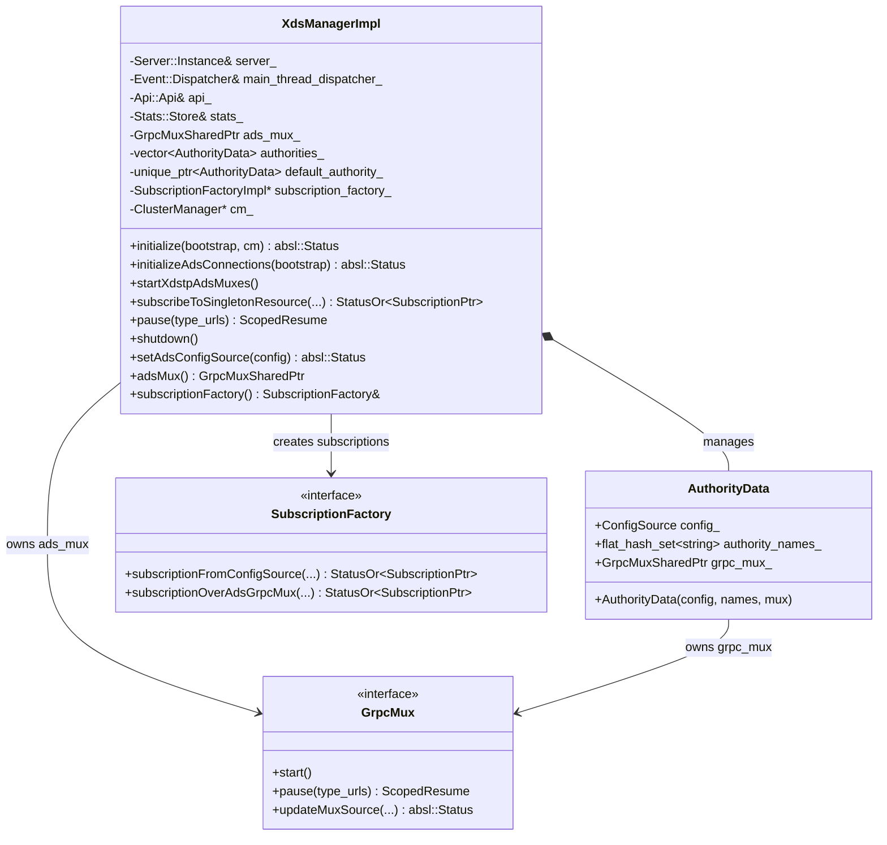
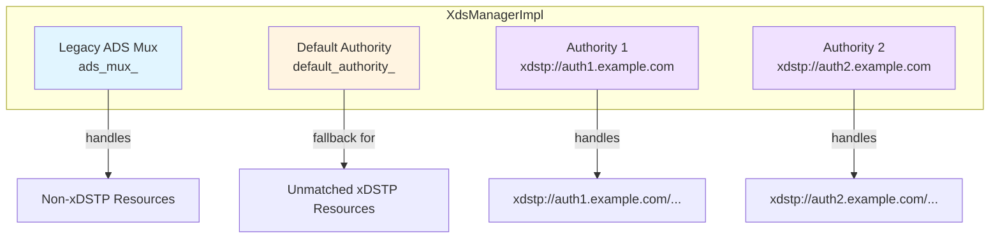
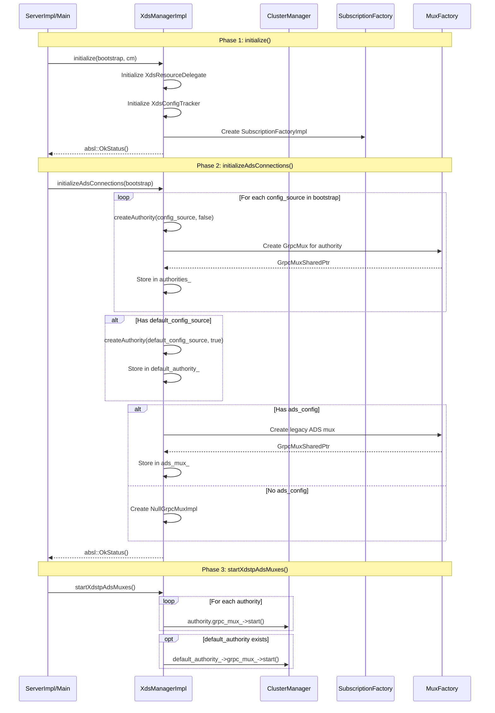
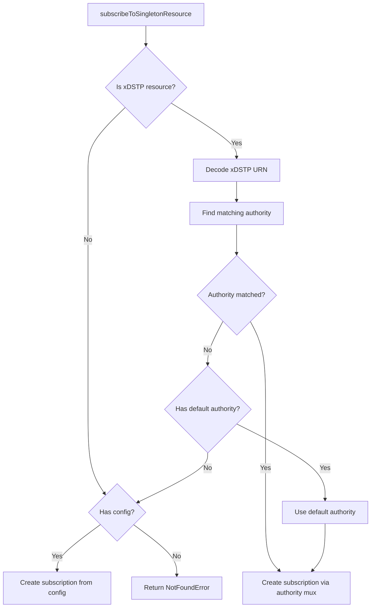
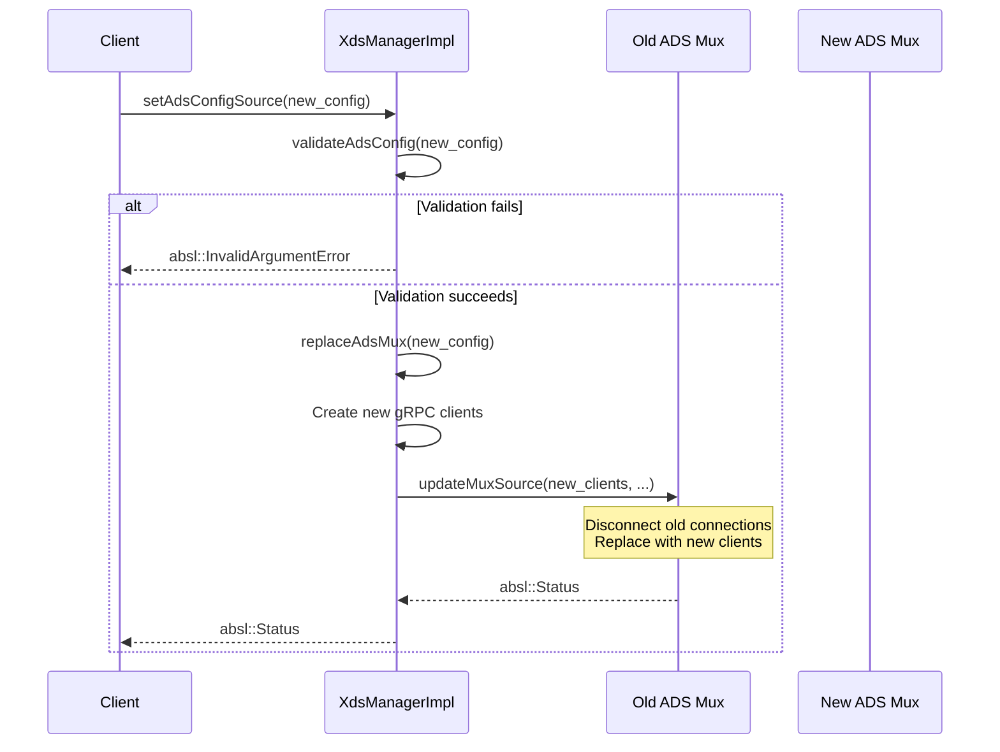
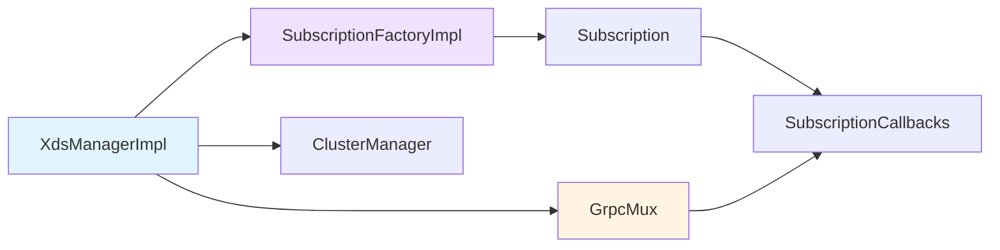

# XDS Manager Implementation

**File:** `source/common/config/xds_manager_impl.h` and `source/common/config/xds_manager_impl.cc`

**Purpose:** The XDS Manager is the central orchestrator for xDS (Discovery Service) subscriptions in Envoy. It manages multiple ADS (Aggregated Discovery Service) connections, handles xDSTP (xDS Transport Protocol) authorities, and creates subscriptions for dynamic configuration updates.

## Table of Contents
1. [Overview](#overview)
2. [Class Structure](#class-structure)
3. [Authority Management](#authority-management)
4. [Initialization Flow](#initialization-flow)
5. [Subscription Creation](#subscription-creation)
6. [ADS Mux Lifecycle](#ads-mux-lifecycle)
7. [Key Operations](#key-operations)
8. [Usage Examples](#usage-examples)

## Overview

The XdsManagerImpl is Envoy's primary interface for managing xDS subscriptions. It:
- Manages multiple ADS connections (legacy ADS and xDSTP-based authorities)
- Routes subscription requests to the appropriate authority
- Handles dynamic ADS configuration updates
- Coordinates initialization and shutdown of xDS resources

## Class Structure



### Core Components

#### XdsManagerImpl Class
The main class that implements the `XdsManager` interface.

**Key Members:**
```cpp
// The primary cluster manager (set after initialization)
Upstream::ClusterManager* cm_;

// The main ADS mux (legacy, non-xDSTP)
GrpcMuxSharedPtr ads_mux_;

// xDSTP-based authorities from bootstrap config
std::vector<AuthorityData> authorities_;

// Default authority for unmatched xDSTP resources
std::unique_ptr<AuthorityData> default_authority_;

// Factory for creating subscriptions
std::unique_ptr<SubscriptionFactoryImpl> subscription_factory_;
```

#### AuthorityData Inner Class
Represents an xDSTP authority with its own ADS connection.

```cpp
class AuthorityData {
public:
  AuthorityData(const envoy::config::core::v3::ConfigSource& config,
                absl::flat_hash_set<std::string>&& authority_names, 
                GrpcMuxSharedPtr&& grpc_mux)
      : config_(config), authority_names_(std::move(authority_names)),
        grpc_mux_(std::move(grpc_mux)) {}

  const envoy::config::core::v3::ConfigSource config_;
  // Set of authority names this config-source supports
  absl::flat_hash_set<std::string> authority_names_;
  // The ADS gRPC mux to the server
  Config::GrpcMuxSharedPtr grpc_mux_;
};
```

## Authority Management

The XdsManager supports multiple authorities for xDSTP-based resource discovery:



### Authority Selection Logic

When subscribing to a resource:

1. **Non-xDSTP Resource** → Use provided config source or legacy ADS
2. **xDSTP Resource** → Parse authority from URN
3. **Match Authority** → Search through `authorities_` for matching authority name
4. **No Match** → Use `default_authority_` if available
5. **Still No Match** → Fall back to provided config source or error

**Code Example:**
```cpp
absl::StatusOr<SubscriptionPtr> XdsManagerImpl::subscribeToSingletonResource(
    absl::string_view resource_name, OptRef<const ConfigSource> config,
    absl::string_view type_url, Stats::Scope& scope, 
    SubscriptionCallbacks& callbacks,
    OpaqueResourceDecoderSharedPtr resource_decoder, 
    const SubscriptionOptions& options) {
    
  // Check if resource is xDSTP-based
  if (!XdsResourceIdentifier::hasXdsTpScheme(resource_name)) {
    // Use legacy subscription
    return subscription_factory_->subscriptionFromConfigSource(
        *config, type_url, scope, callbacks, resource_decoder, options);
  }
  
  // Parse xDSTP URN
  auto resource_urn_or_error = XdsResourceIdentifier::decodeUrn(resource_name);
  RETURN_IF_NOT_OK(resource_urn_or_error.status());
  const xds::core::v3::ResourceName resource_urn = 
      std::move(resource_urn_or_error.value());
  
  // Find matching authority
  AuthorityData* matched_authority = nullptr;
  for (auto it = authorities_.begin(); it != authorities_.end(); ++it) {
    if (it->authority_names_.contains(resource_urn.authority())) {
      matched_authority = &(*it);
      break;
    }
  }
  
  // Fallback to default authority
  if ((matched_authority == nullptr) && (default_authority_ != nullptr)) {
    matched_authority = default_authority_.get();
  }
  
  // Create subscription
  if (matched_authority != nullptr) {
    return subscription_factory_->subscriptionOverAdsGrpcMux(
        matched_authority->grpc_mux_, matched_authority->config_, 
        type_url, scope, callbacks, resource_decoder, options);
  }
  
  return absl::NotFoundError("No valid authority found");
}
```

## Initialization Flow

The XDS Manager has a two-phase initialization process:



### Phase 1: initialize()

**Purpose:** Set up the subscription factory and extension points.

```cpp
absl::Status XdsManagerImpl::initialize(
    const envoy::config::bootstrap::v3::Bootstrap& bootstrap,
    Upstream::ClusterManager* cm) {
  ASSERT(cm != nullptr);
  cm_ = cm;

  // Initialize XdsResourceDelegate extension
  if (bootstrap.has_xds_delegate_extension()) {
    auto& factory = Config::Utility::getAndCheckFactory<XdsResourcesDelegateFactory>(
        bootstrap.xds_delegate_extension());
    xds_resources_delegate_ = factory.createXdsResourcesDelegate(...);
  }

  // Initialize XdsConfigTracker extension
  if (bootstrap.has_xds_config_tracker_extension()) {
    auto& tracker_factory = Config::Utility::getAndCheckFactory<XdsConfigTrackerFactory>(
        bootstrap.xds_config_tracker_extension());
    xds_config_tracker_ = tracker_factory.createXdsConfigTracker(...);
  }

  // Create subscription factory
  subscription_factory_ = std::make_unique<SubscriptionFactoryImpl>(
      local_info_, main_thread_dispatcher_, *cm_, 
      validation_context_.dynamicValidationVisitor(),
      api_, server_, xds_resources_delegate, xds_config_tracker);
      
  return absl::OkStatus();
}
```

### Phase 2: initializeAdsConnections()

**Purpose:** Create ADS muxes for all authorities and the legacy ADS.

Key steps:
1. Iterate through `bootstrap.config_sources()` and create authority data
2. Create default authority if `bootstrap.default_config_source()` is present
3. Create legacy ADS mux if `bootstrap.dynamic_resources().ads_config()` is present

### Phase 3: startXdstpAdsMuxes()

**Purpose:** Start all xDSTP authority muxes (but NOT the legacy ADS mux).

```cpp
void XdsManagerImpl::startXdstpAdsMuxes() {
  // Start authority muxes
  for (AuthorityData& authority : authorities_) {
    authority.grpc_mux_->start();
  }
  
  // Start default authority mux if present
  if (default_authority_ != nullptr) {
    default_authority_->grpc_mux_->start();
  }
  
  // Note: ads_mux_ is NOT started here - it's started elsewhere
}
```

## Subscription Creation

The XDS Manager creates subscriptions through its `subscriptionFactory()`:



## ADS Mux Lifecycle

The ADS mux can be dynamically replaced via `setAdsConfigSource()`:



### Dynamic ADS Replacement

**Constraints:**
- Can only replace if ADS was configured in bootstrap
- Cannot change API type (GRPC ↔ DELTA_GRPC)
- Cannot change config validators

```cpp
absl::Status XdsManagerImpl::replaceAdsMux(
    const envoy::config::core::v3::ApiConfigSource& ads_config) {
  ASSERT(cm_ != nullptr);
  
  const auto& bootstrap = server_.bootstrap();
  if (!bootstrap.has_dynamic_resources() || 
      !bootstrap.dynamic_resources().has_ads_config()) {
    return absl::InternalError(
        "Cannot replace ADS config when not configured in bootstrap");
  }
  
  const auto& bootstrap_ads_config = 
      bootstrap.dynamic_resources().ads_config();
  
  // Validate API type hasn't changed
  if (ads_config.api_type() != bootstrap_ads_config.api_type()) {
    return absl::InternalError(
        fmt::format("Cannot replace ADS with different api_type"));
  }
  
  // Create new gRPC clients
  Grpc::RawAsyncClientSharedPtr primary_client;
  Grpc::RawAsyncClientSharedPtr failover_client;
  RETURN_IF_NOT_OK(createGrpcClients(..., primary_client, failover_client));
  
  // Replace mux source
  return ads_mux_->updateMuxSource(
      std::move(primary_client), std::move(failover_client), 
      *stats_.rootScope(), std::move(backoff_strategy), ads_config);
}
```

## Key Operations

### Pausing Type URLs

Temporarily suspend updates for specific resource types across all muxes:

```cpp
ScopedResume XdsManagerImpl::pause(const std::vector<std::string>& type_urls) {
  auto scoped_resume_collection = 
      std::make_shared<std::vector<ScopedResume>>();
  
  // Pause legacy ADS
  if (ads_mux_ != nullptr) {
    scoped_resume_collection->emplace_back(ads_mux_->pause(type_urls));
  }
  
  // Pause all authority muxes
  for (auto& authority : authorities_) {
    scoped_resume_collection->emplace_back(
        authority.grpc_mux_->pause(type_urls));
  }
  
  // Pause default authority
  if (default_authority_ != nullptr) {
    scoped_resume_collection->emplace_back(
        default_authority_->grpc_mux_->pause(type_urls));
  }
  
  // Return RAII cleanup object
  return std::make_unique<Cleanup>([scoped_resume_collection]() {
    // Destructor resumes all paused muxes
  });
}
```

### Shutdown

```cpp
void XdsManagerImpl::shutdown() override { 
  ads_mux_.reset(); 
  // Note: authorities_ and default_authority_ are cleaned up automatically
}
```

## Usage Examples

### Example 1: Bootstrap Configuration

```yaml
# Bootstrap with xDSTP authorities
dynamic_resources:
  ads_config:
    api_type: DELTA_GRPC
    transport_api_version: V3
    grpc_services:
    - envoy_grpc:
        cluster_name: xds_cluster

# xDSTP-based authorities
config_sources:
- authorities:
  - name: "authority1.example.com"
  - name: "authority2.example.com"
  api_config_source:
    api_type: AGGREGATED_DELTA_GRPC
    transport_api_version: V3
    grpc_services:
    - envoy_grpc:
        cluster_name: xds_authority_cluster

# Default authority for unmatched resources
default_config_source:
  api_config_source:
    api_type: AGGREGATED_DELTA_GRPC
    transport_api_version: V3
    grpc_services:
    - envoy_grpc:
        cluster_name: xds_default_cluster
```

### Example 2: Creating a Subscription

```cpp
// In a component that needs dynamic config
auto subscription_or_error = xds_manager->subscribeToSingletonResource(
    "xdstp://authority1.example.com/envoy.config.listener.v3.Listener/my-listener",
    absl::nullopt,  // No explicit config needed for xDSTP
    "type.googleapis.com/envoy.config.listener.v3.Listener",
    *scope,
    *callbacks,
    resource_decoder,
    options);

if (!subscription_or_error.ok()) {
  ENVOY_LOG(error, "Failed to create subscription: {}", 
            subscription_or_error.status().message());
  return;
}

subscription_ = std::move(*subscription_or_error);
```

### Example 3: Pausing Updates During Maintenance

```cpp
// Pause cluster updates across all muxes
auto resume = xds_manager->pause(
    std::vector<std::string>{
        "type.googleapis.com/envoy.config.cluster.v3.Cluster"
    });

// Perform maintenance operations
performMaintenanceOperations();

// Updates automatically resume when 'resume' goes out of scope
```

## Relationship with Other Components



## Threading Model

**Thread Safety:**
- All operations must be called from the main thread
- Uses `ASSERT_IS_MAIN_OR_TEST_THREAD()` for validation
- Dispatcher operations are posted to the main thread

## Related Documentation

- [02-subscription-factory-impl.md](02-subscription-factory-impl.md) - Subscription creation details
- [05-xds-resource.md](05-xds-resource.md) - xDSTP resource URN/URL handling
- [CONFIG_ARCHITECTURE.md](../CONFIG_ARCHITECTURE.md) - Overall config architecture

## Key Takeaways

1. **Central Orchestrator**: XdsManagerImpl is the single entry point for xDS in Envoy
2. **Multi-Authority Support**: Handles legacy ADS + multiple xDSTP authorities
3. **Dynamic Authority Selection**: Routes subscriptions to the correct authority based on resource name
4. **Two-Phase Init**: Separates cluster manager setup from ADS connection creation
5. **Hot Reload**: Supports dynamic ADS configuration updates via `setAdsConfigSource()`
6. **Coordinated Pause**: Can pause updates across all authorities simultaneously
