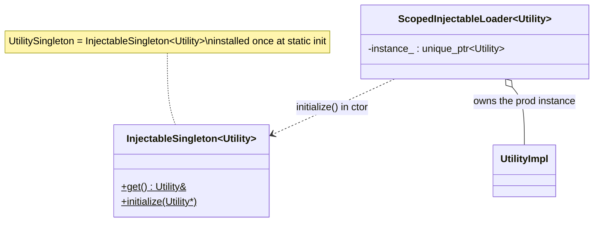

# Crypto utility — class hierarchy (UML)

UML-style Mermaid for the crypto utility and key objects. See [`OVERVIEW.md`](OVERVIEW.md) for behavior.

---

## Interfaces, implementation, and key object

```mermaid
classDiagram
    class CryptoObject {
        <<interface>>
        +~CryptoObject()
    }

    class PKeyObject {
        -pkey_ : bssl::UniquePtr~EVP_PKEY~
        +PKeyObject(EVP_PKEY*)
        +getEVP_PKEY() EVP_PKEY*
        +setEVP_PKEY(EVP_PKEY*)
    }

    class Utility {
        <<interface>>
        +getSha256Digest(buffer)* vector~uint8_t~
        +getSha256Hmac(key, message)* vector~uint8_t~
        +verifySignature(hash, key, sig, text)* Status
        +sign(hash, key, text)* StatusOr~vector~uint8_t~~
        +importPublicKeyPEM(key)* PKeyObjectPtr
        +importPublicKeyDER(key)* PKeyObjectPtr
        +importPrivateKeyPEM(key)* PKeyObjectPtr
        +importPrivateKeyDER(key)* PKeyObjectPtr
    }

    class UtilityImpl {
        -getHashFunction(name) EVP_MD*
        +... overrides ...
    }

    CryptoObject <|.. PKeyObject
    Utility <|.. UtilityImpl
    UtilityImpl ..> PKeyObject : creates / consumes
    PKeyObject ..> EVP_PKEY : owns (bssl::UniquePtr)
    UtilityImpl ..> BoringSSL : EVP_* / HMAC

    note for PKeyObject "RAII over EVP_PKEY\nfreed when PKeyObjectPtr drops"
    note for UtilityImpl "all crypto via BoringSSL EVP layer"
```

---

## Singleton access



---

## Type alias reference

| Alias | Underlying | Meaning |
|---|---|---|
| `CryptoObjectPtr` | `unique_ptr<CryptoObject>` | Owning handle to an opaque crypto object. |
| `PKeyObjectPtr` | `unique_ptr<PKeyObject>` | Owning handle to a parsed key. |
| `UtilitySingleton` | `InjectableSingleton<Utility>` | Global access point. |
| `ScopedUtilitySingleton` | `ScopedInjectableLoader<Utility>` | RAII installer (prod) / test injector. |
| `Access::getTyped<T>(obj)` | `dynamic_cast<T*>` | Recover concrete type from a `CryptoObject&`. |

---

## Relationship summary

| Relationship | Type | Meaning |
|---|---|---|
| `PKeyObject` → `CryptoObject` | inheritance | Concrete crypto object. |
| `PKeyObject` → `EVP_PKEY` | ownership (`bssl::UniquePtr`) | Auto-freed key. |
| `UtilityImpl` → `Utility` | inheritance | Production implementation. |
| `UtilityImpl` → BoringSSL | uses | All primitives via EVP/HMAC. |
| `ScopedUtilitySingleton` → `InjectableSingleton<Utility>` | RAII | Install/clear the global. |
