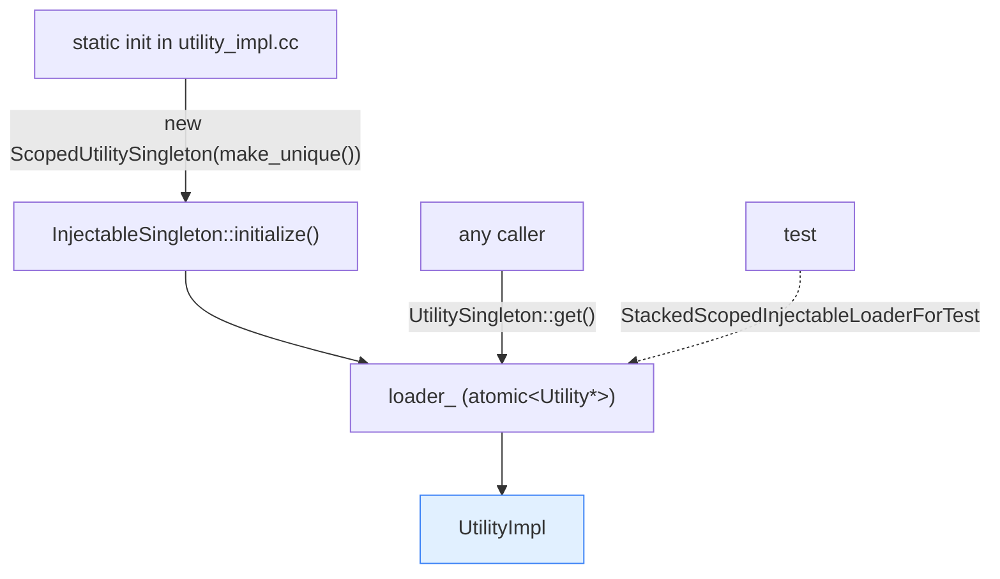
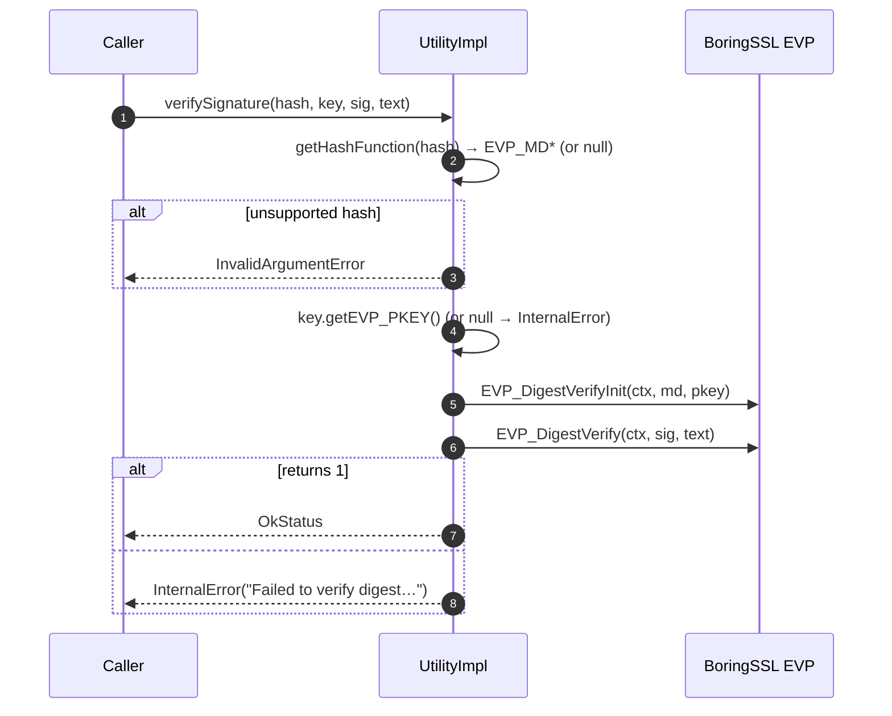

# Crypto utility — architecture & design

How `Common::Crypto::Utility` is structured, installed, and how each operation maps onto BoringSSL's EVP API.

Read [`README.md`](README.md) first.

---

## Roles

| Type | File | One-liner |
|---|---|---|
| `CryptoObject` | `envoy/common/crypto/crypto.h` | Opaque base for "a crypto thing" (here: a key). |
| `PKeyObject` | `crypto_impl.{h,cc}` | `CryptoObject` owning a `bssl::UniquePtr<EVP_PKEY>`. |
| `Utility` | `utility.h` | Pure-virtual interface: digest / HMAC / sign / verify / import. |
| `UtilityImpl` | `utility_impl.{h,cc}` | The BoringSSL-backed implementation. |
| `UtilitySingleton` | `utility.h` | `InjectableSingleton<Utility>` — global access point. |

### Why an opaque `CryptoObject` for keys?

Callers shouldn't see `EVP_PKEY*` directly — it's a raw BoringSSL handle with manual lifetime rules. Wrapping it
in `PKeyObject` (which holds a `bssl::UniquePtr<EVP_PKEY>`) means the key is freed automatically when the
`PKeyObjectPtr` drops, and the public API stays BoringSSL-agnostic. The `Access::getTyped<T>` helper does a
`dynamic_cast` to recover the concrete type when needed.

---

## How you get the utility: the injectable singleton

```cpp
using UtilitySingleton = InjectableSingleton<Utility>;
using ScopedUtilitySingleton = ScopedInjectableLoader<Utility>;
```

At static-init time, `utility_impl.cc` installs the production implementation:

```cpp
static Crypto::ScopedUtilitySingleton* utility_ =
    new Crypto::ScopedUtilitySingleton(std::make_unique<Crypto::UtilityImpl>());
```

So `UtilitySingleton::get()` returns the `UtilityImpl` everywhere. Tests can swap it via
`StackedScopedInjectableLoaderForTest<Utility>` (see [`../singleton/OVERVIEW.md`](../singleton/OVERVIEW.md)) — for
example to inject a fake that returns deterministic signatures.



---

## Operation walk-throughs

### SHA-256 digest — streaming over buffer slices

`getSha256Digest` initializes an `EVP_MD_CTX`, then **feeds each raw slice** of the `Buffer::Instance`
incrementally (no concatenation/copy of the whole buffer), then finalizes:

```cpp
bssl::ScopedEVP_MD_CTX ctx;
EVP_DigestInit(ctx.get(), EVP_sha256());
for (const auto& slice : buffer.getRawSlices()) {
  EVP_DigestUpdate(ctx.get(), slice.mem_, slice.len_);   // incremental
}
EVP_DigestFinal(ctx.get(), digest.data(), nullptr);
```

Every return code is checked with `RELEASE_ASSERT` — these calls only fail on programming errors (bad context),
not on attacker input, so a crash is the right response. `bssl::ScopedEVP_MD_CTX` frees the context on scope exit.

### SHA-256 HMAC — one-shot

`getSha256Hmac` is a single call to BoringSSL's `HMAC(EVP_sha256(), key, ..., message, ..., out)`.

### Verify / sign — the EVP "Digest{Verify,Sign}" pattern

Both follow the same shape, differing only in init/finalize calls:



`sign` is the mirror image: `EVP_DigestSignInit`, then a **two-pass `EVP_DigestSign`** — first pass with a null
output buffer to learn the signature length, second pass to actually write it, then `resize` to the exact length.
Results come back as `absl::StatusOr<std::vector<uint8_t>>` so callers handle failures explicitly.

### Hash-name resolution

`getHashFunction` lowercases the name and maps it to the matching `EVP_*` function (`sha1`, `sha224`, `sha256`,
`sha384`, `sha512`), returning `nullptr` for anything else — which the callers translate into an
`InvalidArgumentError`.

---

## Key import — PEM vs DER, public vs private

Four import methods are implemented via two small templates that capture the only real difference (the BoringSSL
parse function):

| Method | Format | BoringSSL parse fn |
|---|---|---|
| `importPublicKeyPEM` | PEM | `PEM_read_bio_PUBKEY` |
| `importPublicKeyDER` | DER | `EVP_parse_public_key` |
| `importPrivateKeyPEM` | PEM | `PEM_read_bio_PrivateKey` |
| `importPrivateKeyDER` | DER | `EVP_parse_private_key` |

- **PEM** path wraps the bytes in a `bssl::UniquePtr<BIO>` mem buffer and hands it to the PEM reader (which
  transparently handles PKCS#1 and PKCS#8).
- **DER** path wraps the bytes in a `CBS` (crypto byte string) and calls the DER parser.

Both always return a `PKeyObject` — even on parse failure they return a `PKeyObject(nullptr)`. The *caller* finds
out about the failure later, when `sign`/`verifySignature` see a null `EVP_PKEY` and return an error status.

---

## Error-handling philosophy

| Situation | Response | Why |
|---|---|---|
| Bad/unsupported hash name | `InvalidArgumentError` | user-controllable input |
| Null key / verify mismatch / sign failure | `absl::Status` error | recoverable, surfaced to caller |
| Digest/HMAC context op fails | `RELEASE_ASSERT` (crash) | only fails on programming errors |

The split is deliberate: anything an attacker or config can influence becomes a `Status`; anything that can only
fail due to an internal bug becomes an assert.

---

## What this folder does *not* do

- **No TLS, no certificates, no handshakes** — that's [`../tls/`](../tls/README.md).
- **No random number generation** — see `Random` utilities elsewhere.
- **No symmetric encryption (AES, etc.)** — only digests, HMAC, and asymmetric sign/verify are provided here.
- **No key generation** — keys must be imported from PEM/DER bytes.

---

## Cross-references

- [`CLASS_HIERARCHY.md`](CLASS_HIERARCHY.md) — UML.
- [`../singleton/OVERVIEW.md`](../singleton/OVERVIEW.md) — `InjectableSingleton` / `ScopedInjectableLoader`.
- [`../tls/`](../tls/) — the full TLS stack and deeper BoringSSL notes.
