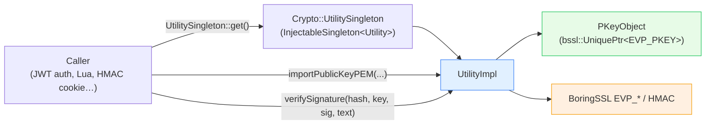

# `source/common/crypto/` — general-purpose crypto utility

This folder is a thin, **stateless utility wrapper over BoringSSL's EVP layer** for the handful of cryptographic
primitives Envoy's *non-TLS* code needs: SHA-256 digests, SHA-256 HMACs, signature signing/verification, and
public/private key import (PEM and DER). It is exposed as a globally-injectable singleton (`Crypto::Utility`) so
that any filter or extension can grab it without plumbing.

> **Don't confuse this with [`../tls/`](../tls/README.md).** That folder is the full TLS transport socket stack
> (handshakes, contexts, cert validation). *This* folder is a small grab-bag of crypto helpers used by things like
> JWT auth, HMAC-signed cookies, and the Lua `crypto` bindings. Both sit on BoringSSL, but they solve different
> problems.

---

## The one paragraph mental model

`Common::Crypto::Utility` is a pure-virtual interface with one production implementation, `UtilityImpl`, that
calls BoringSSL `EVP_*` functions. Keys are passed around opaquely as `CryptoObject`s — concretely `PKeyObject`,
which owns a `bssl::UniquePtr<EVP_PKEY>` so the key is freed automatically. You get the utility via the
`Crypto::UtilitySingleton` (an `InjectableSingleton<Utility>`), which is installed once at static-init time by a
`ScopedUtilitySingleton`. Callers import a key (`importPublicKeyPEM(...)`, etc.), then call
`verifySignature(...)` / `sign(...)` / `getSha256Digest(...)` / `getSha256Hmac(...)`.

---

## Folder map

```
source/common/crypto/
├── BUILD
├── crypto_impl.{h,cc}    # PKeyObject — a CryptoObject wrapping bssl::UniquePtr<EVP_PKEY>
├── utility.h             # Crypto::Utility interface + UtilitySingleton aliases
├── utility_impl.h        # UtilityImpl — the BoringSSL-backed implementation (declaration)
└── utility_impl.cc       # UtilityImpl — digests, HMAC, sign/verify, key import; singleton registration
```

The **interface** for the opaque key object lives under `envoy/common/crypto/`:

```
envoy/common/crypto/
└── crypto.h    # CryptoObject base + Access::getTyped<T> RTTI helper
```

---

## Capabilities at a glance

| Capability | Method | BoringSSL primitive |
|---|---|---|
| SHA-256 digest of a buffer | `getSha256Digest(buffer)` | `EVP_DigestInit/Update/Final`, `EVP_sha256` |
| SHA-256 HMAC | `getSha256Hmac(key, message)` | `HMAC`, `EVP_sha256` |
| Verify a signature | `verifySignature(hash, key, sig, text)` | `EVP_DigestVerifyInit/Verify` |
| Create a signature | `sign(hash, key, text)` | `EVP_DigestSignInit/Sign` |
| Import public key | `importPublicKeyPEM/DER(key)` | `PEM_read_bio_PUBKEY` / `EVP_parse_public_key` |
| Import private key | `importPrivateKeyPEM/DER(key)` | `PEM_read_bio_PrivateKey` / `EVP_parse_private_key` |

Supported hash functions for sign/verify: `sha1`, `sha224`, `sha256`, `sha384`, `sha512`.

---

## Per-topic table

| Topic | Document | Source |
|---|---|---|
| The interface, the singleton install, the EVP call patterns | [`OVERVIEW.md`](OVERVIEW.md) | `utility*.{h,cc}`, `crypto_impl.*` |
| Class hierarchy (UML) | [`CLASS_HIERARCHY.md`](CLASS_HIERARCHY.md) | interfaces + impls |

---

## Big picture



---

## Reading order

1. This `README.md` — what it does and how you reach it.
2. [`OVERVIEW.md`](OVERVIEW.md) — the EVP call sequences and the singleton install.
3. [`CLASS_HIERARCHY.md`](CLASS_HIERARCHY.md) — UML map.
4. For the deeper BoringSSL background, see [`../tls/`](../tls/) docs.
