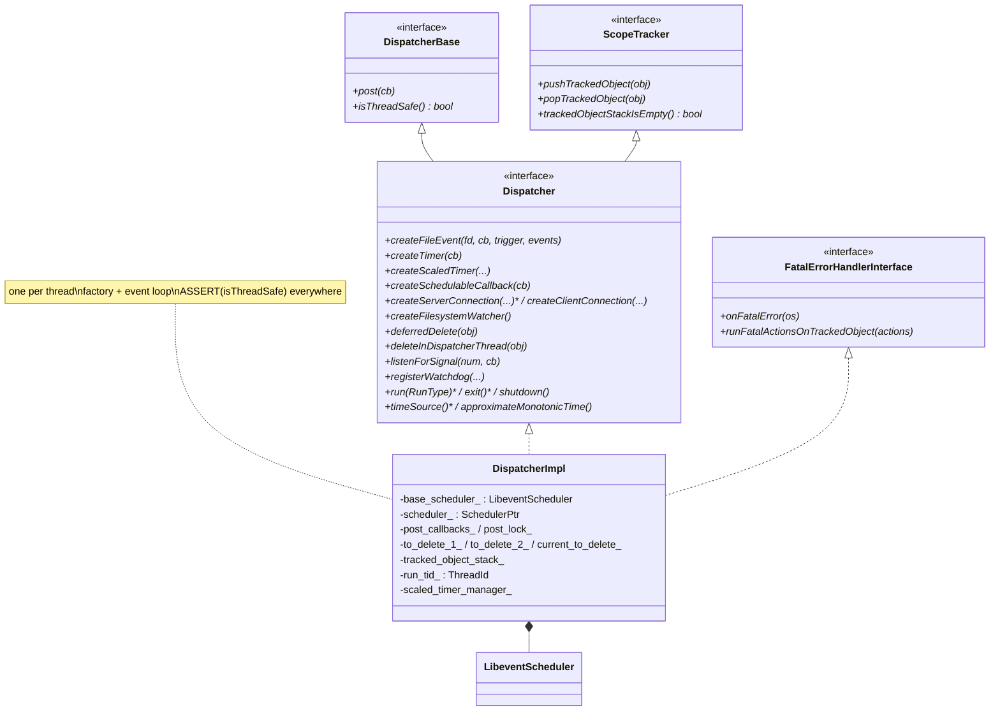
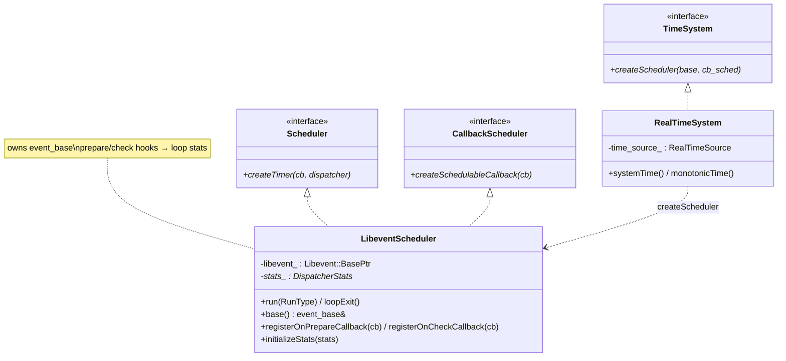
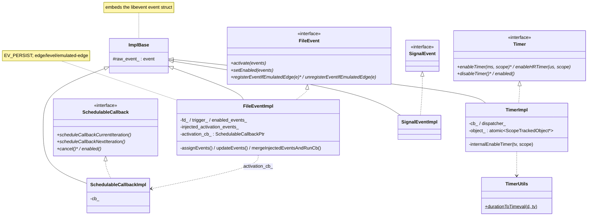
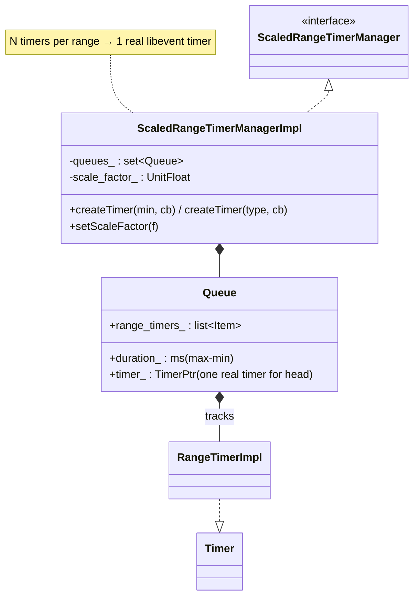
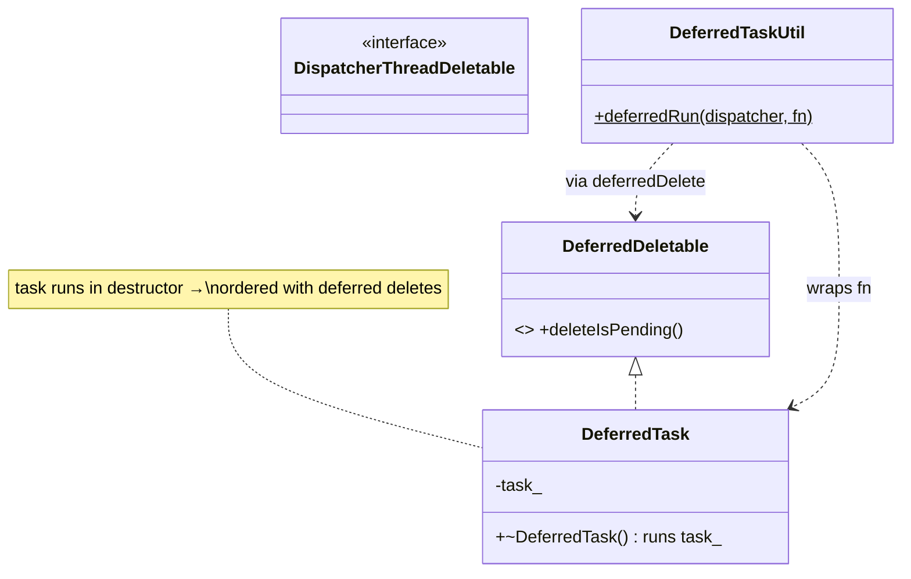

# Event — class hierarchy (UML)

UML-style Mermaid for the dispatcher, scheduler, and primitives. See [`OVERVIEW.md`](OVERVIEW.md),
[`primitives.md`](primitives.md), and [`lifecycle_and_threading.md`](lifecycle_and_threading.md) for behavior.

---

## Dispatcher & scheduler

---

## Event primitives

---

## Scaled timers

---

## Deferred deletion & cross-thread

---

## Type & alias reference

| Symbol | Meaning |
|---|---|
| `DispatcherPtr` | `unique_ptr<Dispatcher>` — one per thread. |
| `FileEventPtr` / `TimerPtr` / `SchedulableCallbackPtr` / `SignalEventPtr` | owning handles to primitives. |
| `PostCb` | `absl::AnyInvocable<void()>` — a posted callback. |
| `FileReadyCb` | `function<Status(uint32_t events)>` — fd-event callback. |
| `TimerCb` | `function<void()>` — timer callback. |
| `Libevent::BasePtr` | `CSmartPtr<event_base, event_base_free>` — RAII `event_base`. |
| `RunType` | `Block` / `NonBlock` / `RunUntilExit`. |

---

## Relationship summary

| Relationship | Type | Meaning |
|---|---|---|
| `DispatcherImpl` → `LibeventScheduler` | composition | Owns the `event_base` + loop. |
| `DispatcherImpl` → primitives | factory | Creates file events / timers / callbacks / connections. |
| `*Impl` → `ImplBase` | inheritance | Embeds the raw libevent `event`. |
| `FileEventImpl` → `SchedulableCallbackImpl` | composition | `activate()` uses a next-iteration callback. |
| `RealTimeSystem` → `LibeventScheduler` | factory | `createScheduler` (swap for SimulatedTime in tests). |
| `ScaledRangeTimerManagerImpl` → `Queue` → real `Timer` | composition | Load-scaled timers share one real timer per range. |
| `DeferredTaskUtil` → `deferredDelete` | reuse | Run a task after pending deletions. |
