# Event Loop & Dispatcher — Overview

A high-level guided tour of `source/common/event/`: the **event loop**, the **dispatcher**, and the primitives they expose. The companion document `EVENT_LOOP_ARCHITECTURE.md` covers internals in depth; this one stays at the conceptual level with mermaid diagrams.

For "who uses the dispatcher and how", see `DISPATCHER_USAGE.md`.

---

## 1. What Lives Here

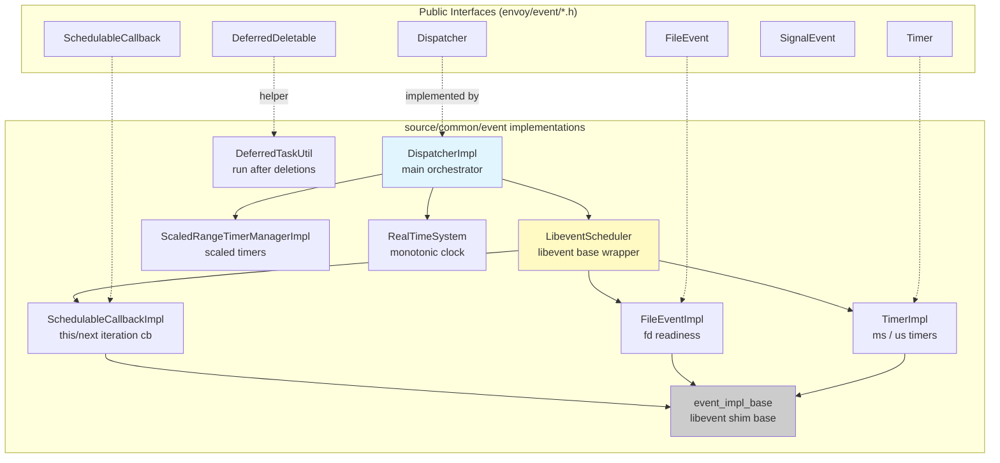

| File | Role |
|------|------|
| `dispatcher_impl.{h,cc}` | `DispatcherImpl` — the public per-thread event loop API |
| `libevent_scheduler.{h,cc}` | Wraps libevent `event_base`, exposes prepare/check hooks, run/exit |
| `libevent.{h,cc}` | Type-safe ownership wrappers for libevent C structs |
| `timer_impl.{h,cc}` | `TimerImpl` — duration → `timeval` clamping, scope tracking |
| `file_event_impl.{h,cc}` | `FileEventImpl` — fd read/write/closed monitoring, edge-trigger emulation |
| `schedulable_cb_impl.{h,cc}` | `SchedulableCallbackImpl` — current vs next iteration callbacks |
| `scaled_range_timer_manager_impl.{h,cc}` | Time-scaled timers driven by overload manager |
| `event_impl_base.{h,cc}` | RAII base class for libevent event registration |
| `deferred_task.h` | `DeferredTaskUtil::deferredRun` helper |
| `real_time_system.{h,cc}` | Default `TimeSystem` using real wall/monotonic clocks |
| `posix/`, `win32/` | Platform-specific signal handling |

---

## 2. Conceptual Model

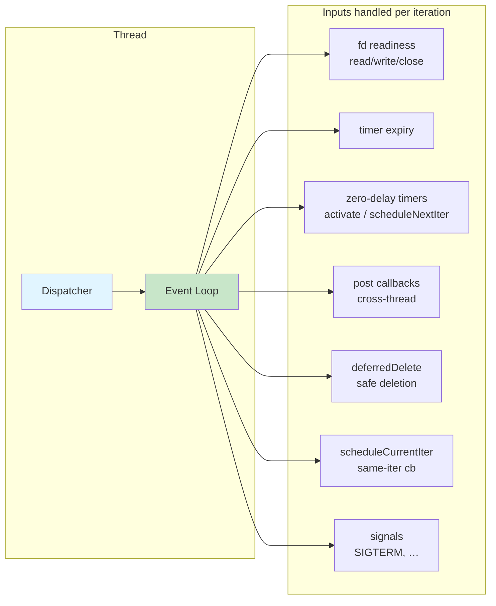

- **One dispatcher per thread.** Worker threads, the main thread, and admin all have their own.
- **Single-threaded execution model inside one dispatcher.** Almost every method assumes the caller is the run thread; `post()` is the lone exception.
- **Time, I/O, and scheduled work share the same loop.** No separate timer thread, no I/O thread pool.

---

## 3. The Event Loop Cycle

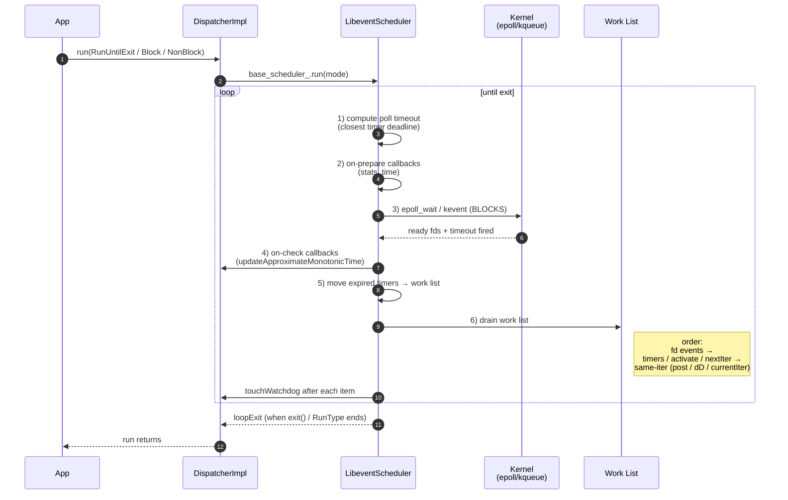

Highlights:
- **Step 3 is the only place the loop blocks.** Everything else is synchronous CPU work.
- **Step 6 can grow during execution** — same-iteration mechanisms (`post`, `deferredDelete`, `scheduleCallbackCurrentIteration`) add to the list while it is being drained.
- **No ordering guarantees** between `post`, `deferredDelete`, and `scheduleCallbackCurrentIteration`. Use `DeferredTaskUtil::deferredRun` if you must run after a deletion.

---

## 4. DispatcherImpl Construction

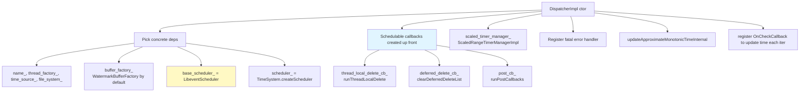

The three pre-built `SchedulableCallback`s — `deferred_delete_cb_`, `post_cb_`, `thread_local_delete_cb_` — are how the dispatcher *itself* gets work onto the loop.

---

## 5. Event Primitives (At a Glance)

```mermaid
graph TB
    subgraph "Timer"
        T1[createTimer cb]
        T2[enableTimer ms / enableHRTimer us]
        T3[disableTimer]
        T1 --> Tx[Timer fires once<br/>cb runs in event loop]
    end

    subgraph "FileEvent"
        F1[createFileEvent fd, cb, trigger, events]
        F2[setEnabled new mask]
        F3[activate manual trigger via 0-delay timer]
        F1 --> Fx[cb invoked when fd is read/write/closed]
    end

    subgraph "SchedulableCallback"
        S1[createSchedulableCallback cb]
        S2[scheduleCallbackCurrentIteration]
        S3[scheduleCallbackNextIteration]
        S1 --> Sx[cb runs in current or next loop pass]
    end

    subgraph "Deferred Deletion"
        D1[deferredDelete obj]
        D2[DeferredTaskUtil::deferredRun fn]
        D1 --> Dx[obj destroyed after current call stack unwinds]
        D2 --> Dx
    end

    subgraph "Cross-thread"
        P1[post cb]
        P2[deleteInDispatcherThread obj]
        P1 --> Px[cb runs on this dispatcher's thread]
        P2 --> Px
    end

    style Tx fill:#c8e6c9
    style Fx fill:#c8e6c9
    style Sx fill:#c8e6c9
    style Dx fill:#c8e6c9
    style Px fill:#c8e6c9
```

Selection guide:

| Need | Reach for |
|------|-----------|
| One-shot delay | `Timer` |
| Wait for fd to be ready | `FileEvent` |
| Run "soon, not now" without delay | `SchedulableCallback::scheduleCallbackCurrentIteration` |
| Yield to I/O before continuing | `SchedulableCallback::scheduleCallbackNextIteration` |
| Hand work to another thread's loop | `Dispatcher::post` |
| Delete `this` safely from a callback | `Dispatcher::deferredDelete` |
| Run code *after* deferred deletions | `DeferredTaskUtil::deferredRun` |
| Time-scaled timeouts under overload | `Dispatcher::createScaledTimer` |

---

## 6. Deferred Deletion (Double-Buffered)

```mermaid
graph LR
    A[Caller in event cb] -->|deferredDelete obj| B[current_to_delete_<br/>= to_delete_1_]
    B --> C[deferred_delete_cb_->scheduleCallbackCurrentIteration]
    C --> D[Loop reaches same-iter cb]
    D --> E[clearDeferredDeleteList]
    E --> F[Swap: current_to_delete_ → to_delete_2_]
    F --> G[Iterate to_delete_1 in FIFO,<br/>reset() each → destructors run]
    G --> H{New deferredDelete<br/>during destruction?}
    H -- yes --> I[Goes into to_delete_2_<br/>handled in next iteration]
    H -- no --> J[Done]

    style B fill:#fff9c4
    style F fill:#e1f5ff
    style I fill:#ffe1e1
```

Why double-buffer? A destructor may itself call `deferredDelete`. Without the swap, you would mutate the vector you are iterating.

---

## 7. Cross-Thread Post

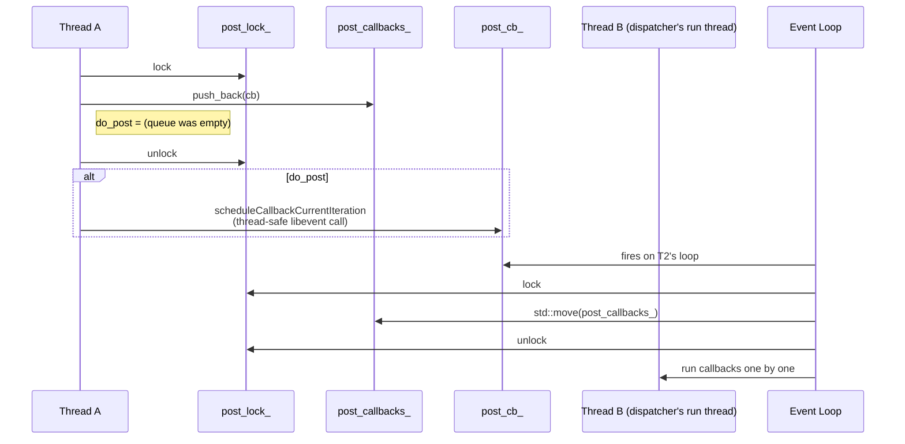

Properties:
- **Lock held only around the queue swap** — callbacks run lock-free.
- **First post wakes the loop** (`do_post = queue.empty()`); subsequent posts piggyback.
- **FIFO** within a single batch.
- **Cross-thread safe** because `scheduleCallbackCurrentIteration` is the only Dispatcher method documented as thread-safe.

---

## 8. Run Modes

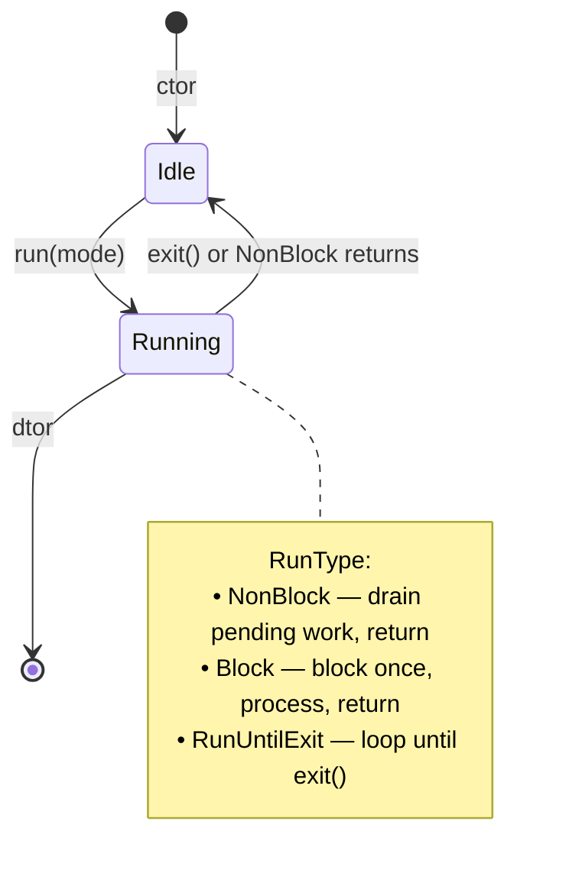

`RunType` maps onto libevent flags:
- `NonBlock` → `EVLOOP_NONBLOCK` (+ `EVLOOP_ONCE` on level-triggered platforms to avoid live-lock).
- `Block` → standard one-shot wait.
- `RunUntilExit` → continuous loop until `loopExit()`.

---

## 9. Time Management

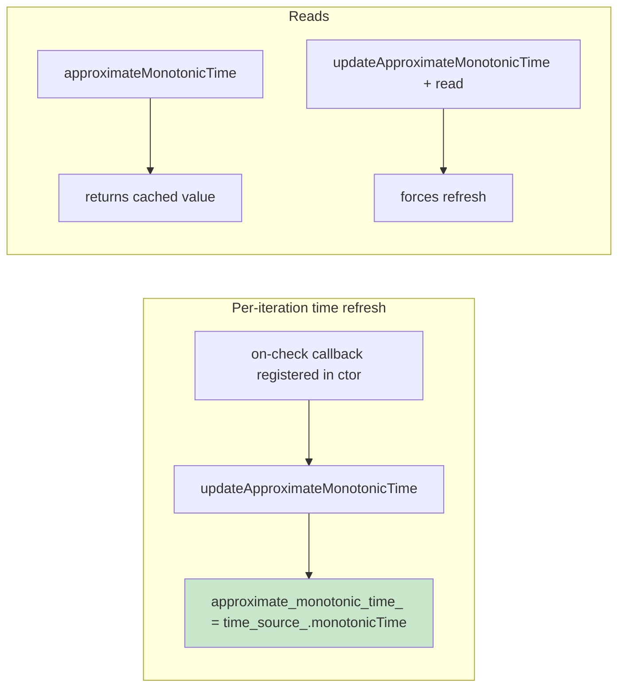

- All callbacks within one loop iteration see **the same** approximate time, because the on-check hook runs after `epoll_wait` and before work-list draining.
- Skips the `clock_gettime` syscall on every read — important for hot paths.
- For scenarios that need a fresh stamp (e.g. measuring CPU time), call `updateApproximateMonotonicTime()` explicitly.

---

## 10. Watchdog Integration

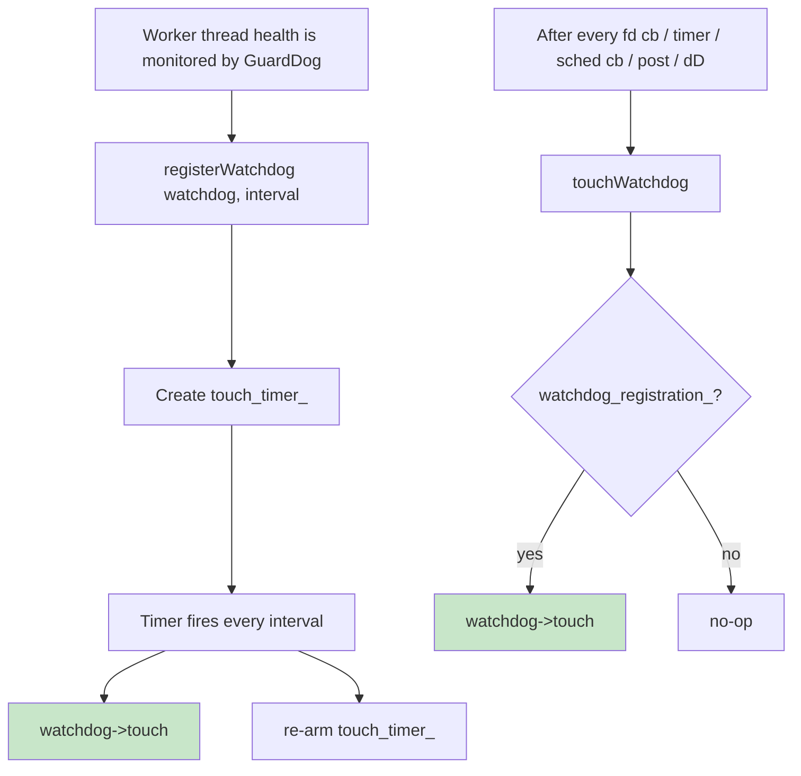

Two complementary mechanisms:
- **Periodic timer** (every `min_touch_interval`) covers the case where the loop is otherwise idle.
- **Per-callback `touchWatchdog`** keeps a busy loop visible as alive even if it never reaches its periodic timer.

---

## 11. Crash Diagnostics — Tracked Object Stack

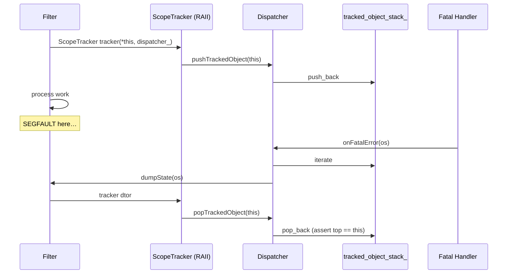

Why it matters: Envoy is single-threaded per worker, so a crash in any callback comes with a chain of "what was this thread doing" objects ready to dump structured state.

---

## 12. Lifecycle of a Single Worker

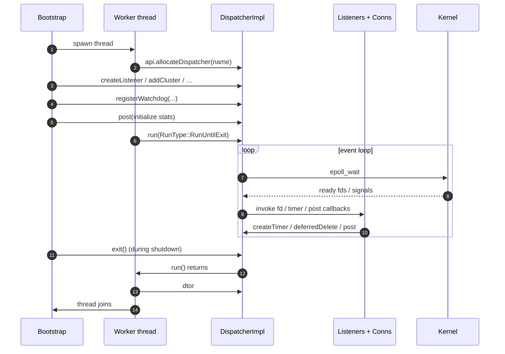

This pattern is replicated for every worker thread and (in a slightly trimmed form) for the main and admin threads.

---

## 13. Where to Go Next

- **`EVENT_LOOP_ARCHITECTURE.md`** — deep dive into ordering rules, edge-trigger emulation, deferred-delete double buffering, time clamping, and testing patterns.
- **`DISPATCHER_USAGE.md`** — how connections, conn pools, routers, cluster manager, TLS, and other modules use the dispatcher's primitives.
- **`include/envoy/event/dispatcher.h`** — the public interface.
- **`source/common/event/dispatcher_impl.cc`** — the canonical reference implementation.

