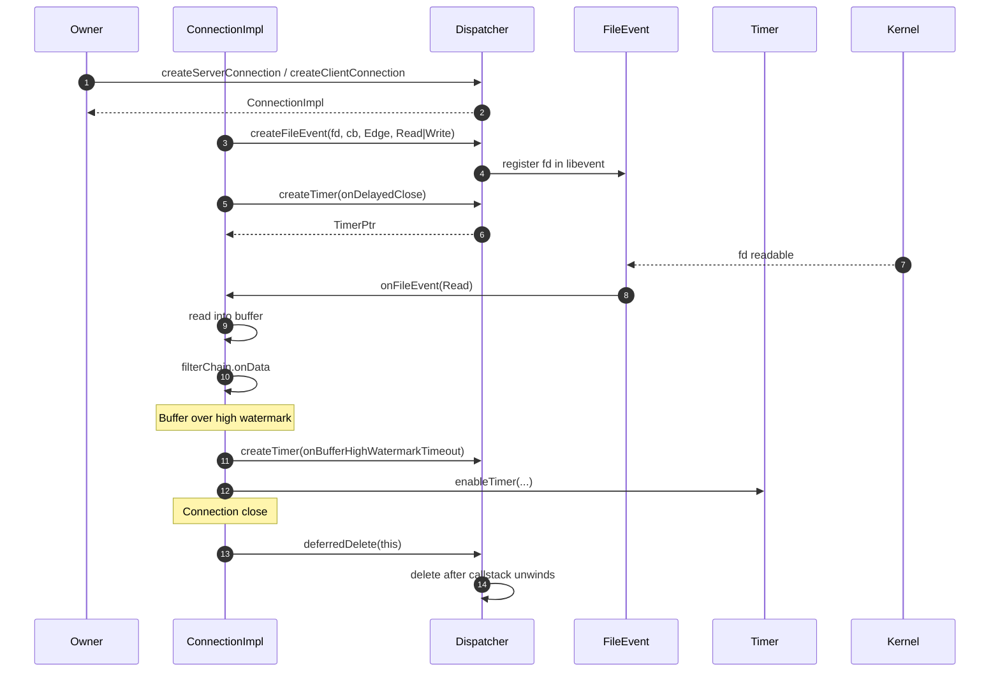
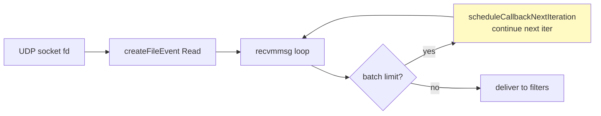
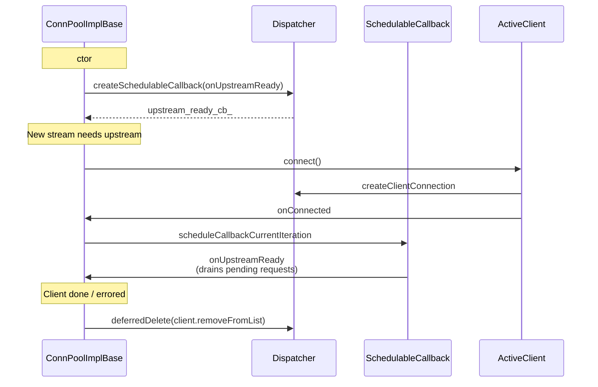
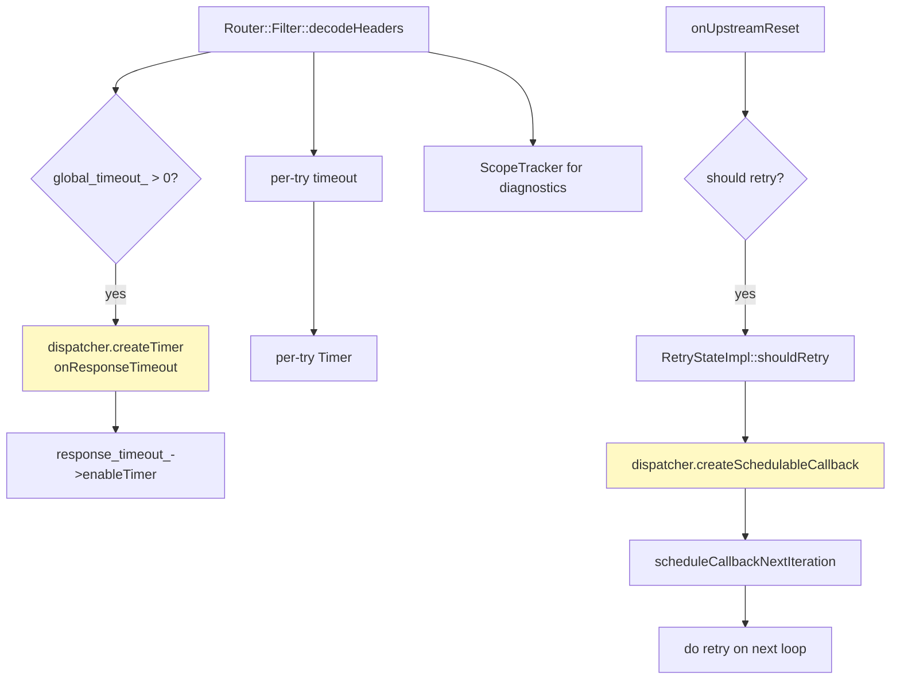
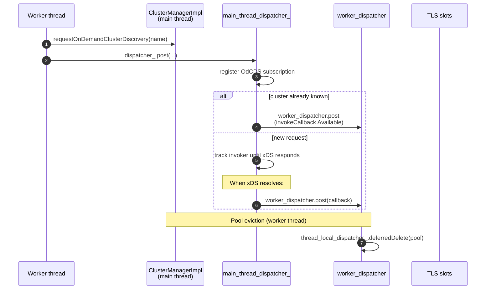
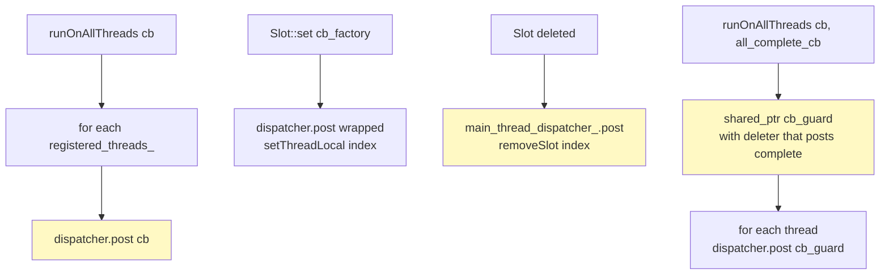
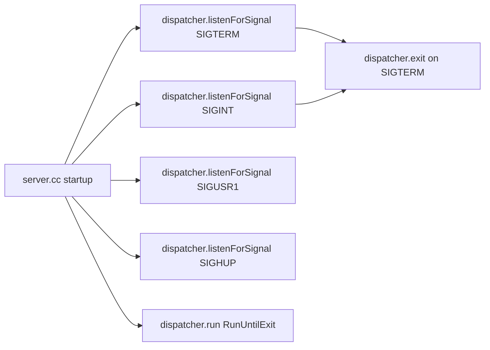
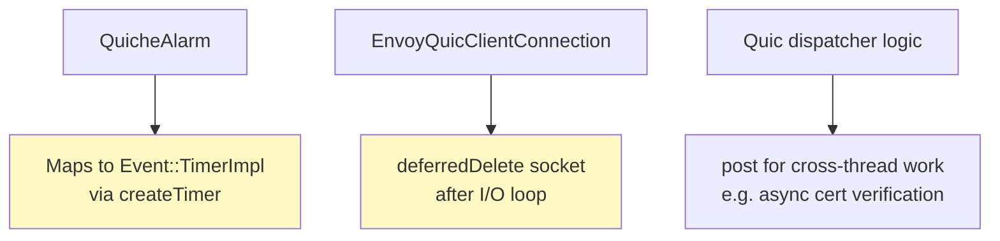

# How Other Modules Use the Dispatcher

Companion to `DISPATCHER_OVERVIEW.md`. This document is a *cookbook* of how each major area of Envoy uses `Event::Dispatcher`'s primitives, with mermaid diagrams showing the call patterns and bullets calling out the key contracts.

The dispatcher exposes a small surface area:

- `createTimer(cb)` / `createScaledTimer(...)`
- `createFileEvent(fd, cb, trigger, events)`
- `createSchedulableCallback(cb)`
- `createServerConnection(...)` / `createClientConnection(...)`
- `createFilesystemWatcher()`
- `listenForSignal(signal, cb)`
- `post(cb)` *(thread-safe)*
- `deferredDelete(obj)` / `DeferredTaskUtil::deferredRun(...)`
- `deleteInDispatcherThread(obj)`
- `pushTrackedObject` / `popTrackedObject` *(via `ScopeTracker` RAII)*
- `approximateMonotonicTime()`
- `run(...)` / `exit()` / `shutdown()`

Below, each module shows **which of these it uses** and **why**.

---

## 1. Map of Consumers

```mermaid
graph TB
    Disp((Dispatcher))

    subgraph "Network"
        Conn[Network::ConnectionImpl]
        UDP[UdpListenerImpl]
        Listener[ConnectionHandlerImpl]
    end

    subgraph "HTTP & Conn Pools"
        ConnPool[ConnPoolBase / ActiveClient]
        Grid[HttpConnPoolGrid]
        Mixed[MixedConnPool]
        AsyncTcp[AsyncTcpClient]
    end

    subgraph "Routing & Retry"
        Router[Router::Filter]
        Retry[RetryStateImpl]
        Rds[RdsImpl / ScopedRds]
    end

    subgraph "Upstream / Cluster"
        CM[ClusterManagerImpl]
        Outlier[OutlierDetectionImpl]
        HDS[HealthDiscoveryService]
        ConnPoolMap[ConnPoolMap]
    end

    subgraph "Threading & Lifecycle"
        TLS[ThreadLocalImpl]
        Server[ServerInstance]
        Watchdog[GuardDog]
    end

    subgraph "Storage / IO"
        IoUring[IoUringWorkerImpl]
        FsWatch[Filesystem::Watcher]
        Quic[Envoy QUIC]
    end

    subgraph "TLS & Crypto"
        TLSh[Tls::Handshaker]
    end

    subgraph "Misc"
        Ttl[Config::Ttl]
        SharedPool[SharedPool]
        GoogleGrpc[GoogleAsyncClient]
    end

    Disp --> Conn
    Disp --> UDP
    Disp --> Listener
    Disp --> ConnPool
    Disp --> Grid
    Disp --> Mixed
    Disp --> AsyncTcp
    Disp --> Router
    Disp --> Retry
    Disp --> Rds
    Disp --> CM
    Disp --> Outlier
    Disp --> HDS
    Disp --> ConnPoolMap
    Disp --> TLS
    Disp --> Server
    Disp --> Watchdog
    Disp --> IoUring
    Disp --> FsWatch
    Disp --> Quic
    Disp --> TLSh
    Disp --> Ttl
    Disp --> SharedPool
    Disp --> GoogleGrpc

    style Disp fill:#e1f5ff
```

---

## 2. Network Connections — `source/common/network/connection_impl.cc`

What it uses and why:

- **`createFileEvent`** — the heart of any connection: monitors the socket fd for `Read | Write | Closed` events. Edge-triggered on Linux, level-triggered fallback elsewhere.
- **`createTimer`** — multiple timers per connection: idle timeout, delayed-close timeout, transport-socket timeout, buffer-high-watermark timeout (`buffer_high_watermark_timer_`).
- **`deferredDelete`** — close paths always defer destruction so that callbacks higher in the stack (filters, codecs) finish before the connection vanishes.
- **`approximateMonotonicTime`** — time-stamps last activity for idle detection without syscalls.
- **`pushTrackedObject` / `popTrackedObject`** — `ScopeTracker tracker(*this, dispatcher_)` at the top of every public callback so a crash dumps connection state.

---

## 3. UDP Listener — `source/common/network/udp_listener_impl.cc`

- **`createFileEvent`** on the UDP socket fd to detect "readable".
- **`createSchedulableCallback`** for `scheduleCallbackNextIteration` — yields between batched packet reads so other connections aren't starved.
- **`createTimer`** for "post-process when packets accumulate within a single iteration" — limits the work done per cycle.

---

## 4. Connection Pools — `source/common/conn_pool/conn_pool_base.cc`

Used primitives:

- **`createSchedulableCallback`** — `upstream_ready_cb_` is built once per pool and reused. Each "client became ready" event re-arms it with `scheduleCallbackCurrentIteration` so all newly-ready clients are processed together.
- **`deferredDelete`** — every client teardown defers destruction; this is critical because the call sites are usually inside `Network::ConnectionImpl` callbacks where deleting `this` (or its parent client) directly would corrupt the call stack.

### Variants

- **`http/conn_pool_grid.cc`**: `dispatcher_.deferredDelete(attempt->removeFromList(connection_attempts_))` for HTTP/3 happy-eyeballs cleanup of failed pool attempts.
- **`tcp/async_tcp_client_impl.cc`**: `dispatcher_.deferredDelete(std::move(connection_))` on close.
- **`upstream/conn_pool_map_impl.h`**: `thread_local_dispatcher_.deferredDelete(std::move(pool_iter->second))` when entire pools are evicted.

---

## 5. Router — `source/common/router/router.cc` & `retry_state_impl.cc`

Used primitives:

- **`createTimer`** — global response timeout, per-try timeout, max stream duration. Each filter instance lazily creates them only when a non-zero deadline is configured.
- **`createSchedulableCallback`** + **`scheduleCallbackNextIteration`** (in `RetryStateImpl`) — schedules the actual retry "after the current packet cycle" so we don't recurse inside an upstream response callback.
- **`approximateMonotonicTime`** for stream timing accounting.
- **`ScopeTracker`** wraps every `decodeHeaders`, `decodeData`, `decodeTrailers`, etc.

---

## 6. RDS / Scoped RDS — `source/common/router/rds_impl.cc`, `scoped_rds.cc`

- **`post(cb)`** — config update callbacks come from xDS subscription threads; `post` ensures application of new RouteConfig happens on the worker thread that owns the route table.
- **`createTimer`** — scheduled re-fetches and TTL-based config expiration.

---

## 7. Cluster Manager — `source/common/upstream/cluster_manager_impl.cc`

Used primitives:

- **`post(cb)`** is the dominant pattern — cluster manager work is split between the main thread (config + xDS) and worker threads (LB + pools). All cross-thread state updates flow through `dispatcher.post`.
- **`deferredDelete`** for thread-local connection pool removal (`thread_local_dispatcher_.deferredDelete(std::move(pool))`).
- **`createTimer`** for cluster warmup deadlines, EDS update jitter, etc.

---

## 8. Outlier Detection — `source/common/upstream/outlier_detection_impl.cc`

- **`createTimer`** for periodic interval checks (success rate, ejection windows).
- **`approximateMonotonicTime`** to compute time spent in current ejection state without `clock_gettime` per host.

---

## 9. ThreadLocal — `source/common/thread_local/thread_local_impl.cc`

The single most concentrated `dispatcher.post` user in the code base.

Used primitives:

- **`post`** — every method that updates per-thread state (`set`, `runOnAllThreads`, `runOnAllThreads(cb, all_complete)`, slot removal).
- **`deleteInDispatcherThread`** — used for objects whose destruction must run on the dispatcher's thread (e.g., to avoid races on thread-affine state).

Pattern of "fan out + fan in":
- A `shared_ptr` wrapping the callback is captured by every per-thread post; its custom deleter posts a final completion callback to `main_thread_dispatcher_` after the last reference drops.

---

## 10. Server Lifecycle — `source/server/server.cc`

- **`listenForSignal`** for SIGTERM, SIGINT, SIGUSR1 (reopen access logs), SIGHUP (eaten — hot restart uses a different mechanism).
- **`run(RunUntilExit)`** — the main thread's "main loop".
- **`exit()`** — called from the SIGTERM handler to shut down cleanly.
- **`shutdown()`** — clears pending deferred deletes and stops accepting work.

---

## 11. TLS Handshake — `source/common/tls/handshaker.md` (and impls)

- **`post`** for asynchronous private-key operations whose completion arrives on a background pool.
- **`deferredDelete`** for handshake state cleanup post-completion (e.g., when async cert validation finishes after the connection has already moved on).

---

## 12. QUIC — `source/common/quic/*`

- **`createTimer`** is wired into Quiche's `Alarm` abstraction (`envoy_quic_alarm.cc`).
- **`deferredDelete`** is critical for IO handles released inside read loops; deferring the delete prevents tearing down the IO handle while it is still on the read call stack.
- **`post`** for signing key callbacks and similar async crypto.

---

## 13. Health Discovery / xDS — `source/common/upstream/health_discovery_service.cc`, `config/datasource.h`, `config/ttl.cc`

- **`createTimer`** for periodic poll, retry backoff, TTL expiration.
- **`post`** when async transport (gRPC) signals delivery on a different thread than the subscriber's worker.

---

## 14. AsyncTcp / Async gRPC — `source/common/tcp/async_tcp_client_impl.cc`, `source/common/grpc/google_async_client_impl.cc`

- **`createClientConnection`** — outbound connections.
- **`deferredDelete`** for connection teardown and pending RPC state.
- **`post`** for delivering events from the underlying gRPC C++ library's completion-queue thread back to the Envoy worker.

---

## 15. Filesystem Watcher — `source/common/filesystem/posix/filesystem_impl.cc`

- **`createFilesystemWatcher`** itself is on the dispatcher; the impl plugs into the dispatcher's libevent loop using `createFileEvent` on `inotify` (Linux) / `kqueue` (BSD/macOS) fds.

---

## 16. io_uring Worker — `source/common/io/io_uring_worker_impl.cc`

- **`createFileEvent`** on the io_uring completion fd to wake the dispatcher when SQEs complete.
- **`createSchedulableCallback`** for batched submission.
- **`deferredDelete`** for retiring socket handles whose completions still hold references in the kernel.

---

## 17. Misc Helpers

| Module | Primitives | Purpose |
|--------|------------|---------|
| `source/common/config/ttl.cc` | `createTimer` | Per-resource TTL expiry |
| `source/common/config/datasource.h` | `createTimer`, `post` | Dynamic data source watching |
| `source/common/shared_pool/shared_pool.h` | `post`, `deleteInDispatcherThread` | Thread-affine ref counting |
| `source/common/common/callback_impl.cc` | `post` | Thread-safe callback invocation |
| `source/common/grpc/buffered_message_ttl_manager.h` | `createTimer` | gRPC message TTL |
| `source/common/event/scaled_range_timer_manager_impl.cc` | `createTimer`, `post` | Overload-aware timer scaling |

---

## 18. Common Patterns Cheat-Sheet

```mermaid
graph TB
    P1[Need: timeout / retry / interval]
    P1 --> P1a[createTimer + enableTimer / enableHRTimer]

    P2[Need: react to fd ready]
    P2 --> P2a[createFileEvent + setEnabled]

    P3[Need: yield to other events]
    P3 --> P3a[createSchedulableCallback + scheduleCallbackNextIteration]

    P4[Need: defer destruction safely]
    P4 --> P4a[deferredDelete obj]

    P5[Need: run on this thread from another]
    P5 --> P5a[other_dispatcher.post cb]

    P6[Need: run AFTER a deferred delete]
    P6 --> P6a[DeferredTaskUtil::deferredRun]

    P7[Need: process signals]
    P7 --> P7a[listenForSignal SIGTERM]

    P8[Need: track state for crash dump]
    P8 --> P8a[ScopeTracker on dispatcher]

    P9[Need: scaled timer for overload]
    P9 --> P9a[createScaledTimer ScaledTimerType]

    P10[Need: free TLS-affine object]
    P10 --> P10a[deleteInDispatcherThread obj]

    style P1a fill:#c8e6c9
    style P2a fill:#c8e6c9
    style P3a fill:#fff9c4
    style P4a fill:#ffe1e1
    style P5a fill:#fff9c4
    style P6a fill:#ffe1e1
    style P7a fill:#c8e6c9
    style P8a fill:#e1f5ff
    style P9a fill:#fff9c4
    style P10a fill:#ffe1e1
```

### Anti-Patterns (Real Bugs Found in Reviews)

- ❌ Calling `delete this` inside a callback. ✅ `dispatcher_.deferredDelete(...)`.
- ❌ Calling a non-thread-safe Dispatcher method from another thread. ✅ Marshal via `post()`.
- ❌ Assuming `post()` runs before `deferredDelete()`. ✅ Use `DeferredTaskUtil::deferredRun()` to enforce order.
- ❌ Holding a raw `Dispatcher*` to a different worker. ✅ Hold a reference owned by your thread or use `ThreadLocal`.
- ❌ Calling `clock_gettime` in hot paths. ✅ `dispatcher.approximateMonotonicTime()`.
- ❌ Forgetting to read until `EAGAIN` with edge-triggered file events. ✅ Drain in a loop until the syscall returns it.

---

## 19. Cross-Reference Summary

| Primitive | Top consumers |
|-----------|---------------|
| `createTimer` | `Network::ConnectionImpl`, `Router::Filter`, `OutlierDetection`, `Config::Ttl`, every conn pool |
| `createFileEvent` | `Network::ConnectionImpl`, `UdpListenerImpl`, `IoUringWorker`, `Filesystem::Watcher` |
| `createSchedulableCallback` | `ConnPoolImplBase`, `RetryStateImpl`, `FileEventImpl::activate` (internal) |
| `post` | `ThreadLocalImpl`, `ClusterManagerImpl`, `RdsImpl`, `GoogleAsyncClient`, `TLS handshaker` |
| `deferredDelete` | All conn pools, `Network::ConnectionImpl` close paths, `Quic` IO handles |
| `listenForSignal` | `server.cc` only (process-level signals) |
| `createServerConnection` / `createClientConnection` | Listeners, conn pools, async TCP client |
| `createFilesystemWatcher` | DataSource watching, runtime override watching |
| `createScaledTimer` | Overload-aware idle / per-try timeouts |
| `deleteInDispatcherThread` | `ThreadLocalImpl`, `SharedPool` |

---

## 20. Reading List

If you want to learn dispatcher idioms by reading real code, these are good entry points:

1. `source/common/network/connection_impl.cc` — the canonical consumer; uses fd events, timers, deferredDelete, ScopeTracker.
2. `source/common/conn_pool/conn_pool_base.cc` — schedulable callbacks + deferredDelete.
3. `source/common/thread_local/thread_local_impl.cc` — masterclass on `post` for cross-thread fan-out / fan-in.
4. `source/common/router/retry_state_impl.cc` — `scheduleCallbackNextIteration` to break recursion.
5. `source/server/server.cc` — `listenForSignal` and `run(RunUntilExit)` lifecycle.

