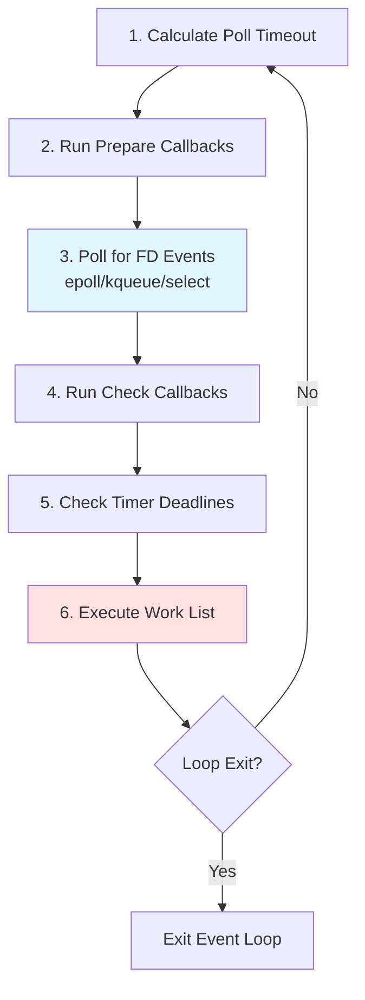
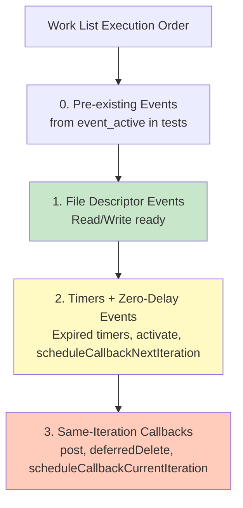
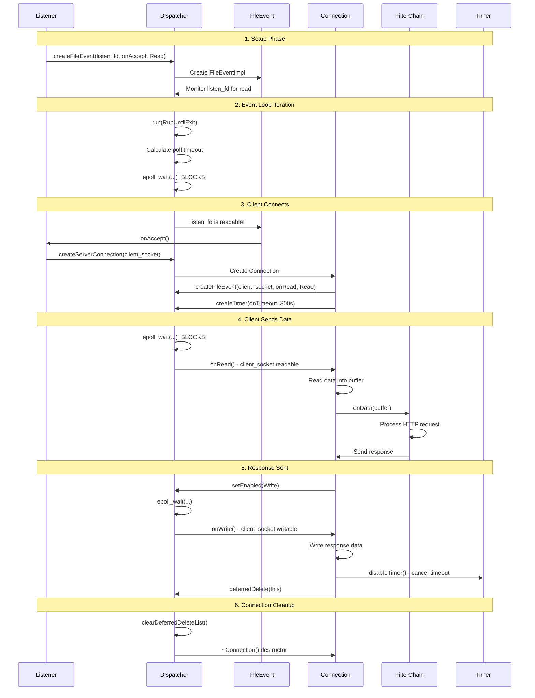
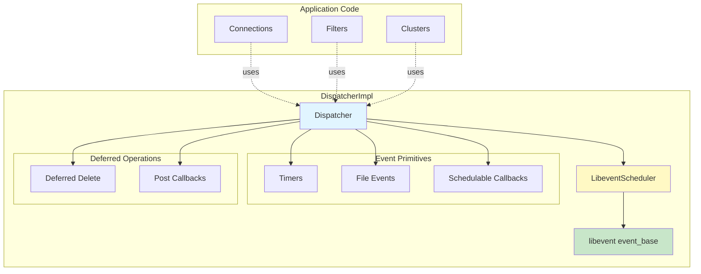
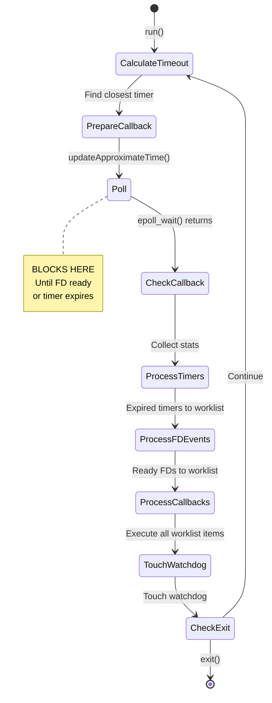
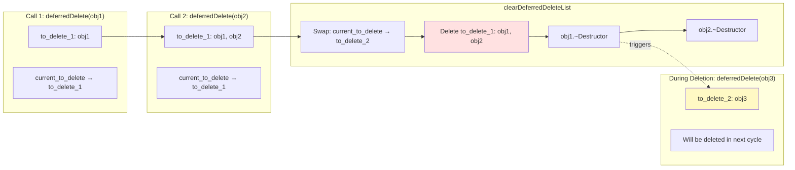
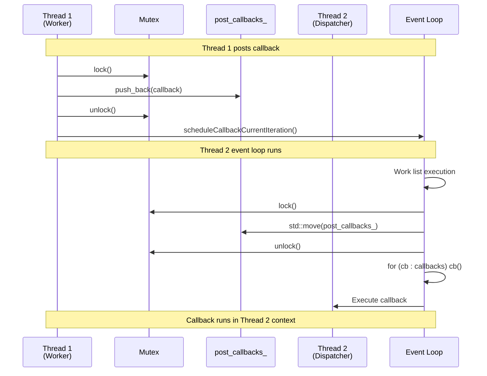
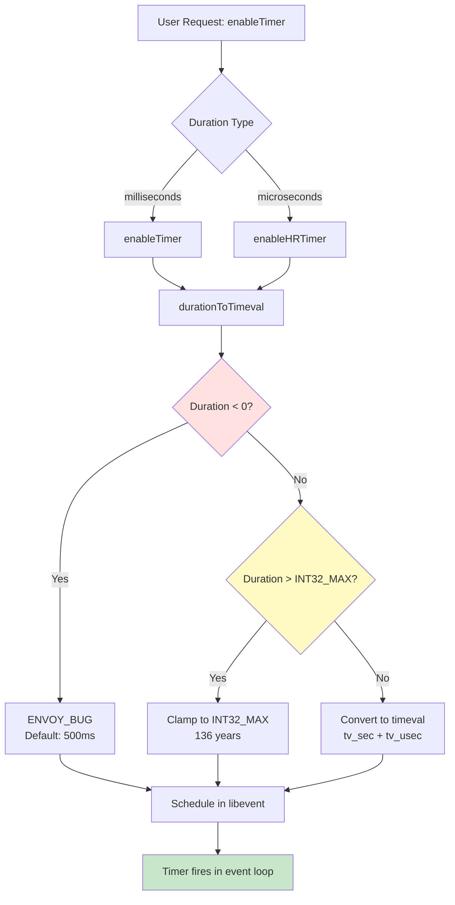

# Envoy Event Loop Architecture

## Executive Summary

The `source/common/event/` folder contains Envoy's event loop infrastructure, built on top of **libevent**. This is the heart of Envoy's asynchronous, non-blocking architecture. Every thread in Envoy has a `Dispatcher` that runs an event loop, processing I/O events, timers, and scheduled callbacks.

**Key Components:**
- **DispatcherImpl**: The main event loop orchestrator, wraps libevent and provides Envoy's async API
- **LibeventScheduler**: Manages the libevent event_base, implements event ordering guarantees
- **TimerImpl**: Timers with millisecond/microsecond precision
- **FileEventImpl**: File descriptor event monitoring (read/write readiness)
- **SchedulableCallbackImpl**: Callbacks that can be scheduled for current or next iteration
- **DeferredTaskUtil**: Defers execution until after object deletion

**Why Two Layers?**
- `Envoy::Event` interfaces (defined in `include/envoy/event/`) - abstract event API
- `source/common/event/` implementations - concrete libevent-based implementations

This separation allows testability (mock dispatchers) and potential future replacement of libevent.

---

## 1. Core Architecture

### 1.1 DispatcherImpl - The Event Loop Orchestrator

`DispatcherImpl` is the concrete implementation of the `Dispatcher` interface. Every worker thread in Envoy has one `DispatcherImpl` that runs its event loop.

```cpp
class DispatcherImpl : public Dispatcher, public FatalErrorHandlerInterface {
public:
  DispatcherImpl(const std::string& name, 
                 Api::Api& api, 
                 Event::TimeSystem& time_system);

  // Core event loop
  void run(RunType type) override;
  void exit() override;
  
  // Create event primitives
  TimerPtr createTimer(TimerCb cb) override;
  FileEventPtr createFileEvent(os_fd_t fd, FileReadyCb cb, 
                                FileTriggerType trigger, uint32_t events) override;
  SchedulableCallbackPtr createSchedulableCallback(std::function<void()> cb) override;
  
  // Create connections
  Network::ServerConnectionPtr createServerConnection(...) override;
  Network::ClientConnectionPtr createClientConnection(...) override;
  
  // Deferred operations
  void deferredDelete(DeferredDeletablePtr&& to_delete) override;
  void post(PostCb callback) override;
  
  // Thread safety
  bool isThreadSafe() const override;
  
  // Time tracking
  MonotonicTime approximateMonotonicTime() const override;
  void updateApproximateMonotonicTime() override;

private:
  const std::string name_;                    // Dispatcher name (e.g., "worker_0")
  Thread::ThreadId run_tid_;                  // Thread ID running the event loop
  LibeventScheduler base_scheduler_;          // Wraps libevent event_base
  SchedulerPtr scheduler_;                    // High-level scheduler interface
  
  // Deferred deletion (double buffering)
  std::vector<DeferredDeletablePtr> to_delete_1_;
  std::vector<DeferredDeletablePtr> to_delete_2_;
  std::vector<DeferredDeletablePtr>* current_to_delete_;
  SchedulableCallbackPtr deferred_delete_cb_;
  
  // Post callbacks (cross-thread communication)
  Thread::MutexBasicLockable post_lock_;
  std::list<PostCb> post_callbacks_ ABSL_GUARDED_BY(post_lock_);
  SchedulableCallbackPtr post_cb_;
  
  // Watchdog integration
  WatchdogRegistrationPtr watchdog_registration_;
  
  // Tracked objects (for crash diagnostics)
  absl::InlinedVector<const ScopeTrackedObject*, 10> tracked_object_stack_;
  
  // Approximate monotonic time (cached to avoid syscalls)
  MonotonicTime approximate_monotonic_time_;
};
```

**Key Responsibilities:**
1. **Event Loop Management**: Runs the libevent loop via `base_scheduler_.run()`
2. **Resource Factory**: Creates timers, file events, schedulable callbacks, connections
3. **Deferred Deletion**: Safely deletes objects in the current event loop iteration
4. **Cross-Thread Communication**: `post()` allows other threads to schedule callbacks
5. **Thread Safety**: Validates operations occur on the correct thread
6. **Watchdog Integration**: Periodically touches watchdog to prevent false positives
7. **Crash Diagnostics**: Maintains stack of tracked objects for error reporting

### 1.2 LibeventScheduler - Event Ordering and Libevent Integration

`LibeventScheduler` wraps the libevent `event_base` and provides event ordering guarantees.

```cpp
class LibeventScheduler : public Scheduler, public CallbackScheduler {
public:
  LibeventScheduler();
  
  // Create event primitives
  TimerPtr createTimer(const TimerCb& cb, Dispatcher& dispatcher) override;
  SchedulableCallbackPtr createSchedulableCallback(const std::function<void()>& cb) override;
  
  // Event loop control
  void run(Dispatcher::RunType mode);
  void loopExit();
  
  // Access to underlying libevent
  event_base& base() { return *libevent_; }
  
  // Hooks for custom logic
  void registerOnPrepareCallback(OnPrepareCallback&& callback);
  void registerOnCheckCallback(OnCheckCallback&& callback);
  
  void initializeStats(DispatcherStats* stats);

private:
  Libevent::BasePtr libevent_;          // The libevent event_base
  DispatcherStats* stats_;              // Event loop stats
  bool timeout_set_{};                  // Whether poll timeout is set
  timeval timeout_{};                   // Poll timeout duration
  timeval prepare_time_{};              // Timestamp before poll
  timeval check_time_{};                // Timestamp after poll
  OnPrepareCallback prepare_callback_;  // Called before poll
  OnCheckCallback check_callback_;      // Called after poll
};
```

---

## 2. Event Loop Iteration Order

Understanding event execution order is critical for debugging race conditions and timing issues.

### 2.1 Libevent Event Loop Cycle

Each iteration of the event loop performs these steps in order:



**Step-by-Step:**

1. **Calculate Poll Timeout**: Compare current time to the closest timer deadline
2. **Run Prepare Callbacks**: Execute registered "prepare" hooks (e.g., update approximate time)
3. **Poll for FD Events**: Block on `epoll_wait()` (Linux) or `kqueue()` (macOS) until:
   - A file descriptor becomes ready (read/write)
   - A timer expires
   - The poll timeout elapses
4. **Run Check Callbacks**: Execute registered "check" hooks (e.g., collect stats)
5. **Check Timer Deadlines**: Move expired timers from priority queue to work list
6. **Execute Work List**: Run all pending events (FDs, timers, callbacks) until list is empty
   - **Important**: More work can be added during execution (e.g., post callbacks, deferred deletes)
7. **Loop Continuation**: Go to step 1 unless exit was requested

### 2.2 Work List Execution Order

Events in the work list execute in this order:



**Event Types by Execution Order:**

| Order | Event Type | How Scheduled | Example Use Case |
|-------|-----------|---------------|------------------|
| 0 | Test events | `event_active()` before loop | Unit test setup |
| 1 | FD events | File descriptor becomes ready | Socket read/write |
| 2 | Timers | `enableTimer()` with expired deadline | Connection timeout |
| 2 | FileEvent::activate | `activate()` with zero-delay timer | Simulate FD ready |
| 2 | scheduleCallbackNextIteration | `scheduleCallbackNextIteration()` | Yield to other events |
| 3 | post callbacks | `post()` from any thread | Cross-thread notification |
| 3 | deferredDelete | `deferredDelete()` | Safe object deletion |
| 3 | deferredRun | `DeferredTaskUtil::deferredRun()` | Run after deletions |
| 3 | scheduleCallbackCurrentIteration | `scheduleCallbackCurrentIteration()` | Immediate callback |

### 2.3 Same-Iteration Callbacks

**WARNING**: No ordering guarantees exist between different same-iteration mechanisms!

```cpp
// BAD: This assumes post runs before deferredDelete - NOT GUARANTEED!
dispatcher.post([&]() { obj->prepareForDeletion(); });
dispatcher.deferredDelete(std::move(obj));  // May run FIRST, deleting obj!

// GOOD: Use deferredRun to run after deletion
dispatcher.deferredDelete(std::move(obj));
DeferredTaskUtil::deferredRun(dispatcher, [&]() { 
  // Runs after obj is deleted
  logDeletionComplete(); 
});
```

**Same-Iteration Mechanisms:**

1. **post()**: Adds callback to post_callbacks_ list, grouped execution
2. **deferredDelete()**: Adds object to to_delete_ vector, grouped execution via `deferred_delete_cb_`
3. **deferredRun()**: Wraps callback in `DeferredTask` (a `DeferredDeletable`), runs in destructor
4. **scheduleCallbackCurrentIteration()**: Each callback scheduled independently

**Grouping Behavior:**
- `post()` callbacks execute as a group when `post_cb_` fires
- `deferredDelete()` objects deleted as a group when `deferred_delete_cb_` fires
- `scheduleCallbackCurrentIteration()` callbacks execute independently

**Key Insight**: If `deferred_delete_cb_` is already pending when you call `post()`, the deferred deletion will execute before your post callback!

---

## 3. Event Primitives

### 3.1 Timers

`TimerImpl` wraps libevent timers with duration clamping and scope tracking.

```cpp
class TimerImpl : public Timer, ImplBase {
public:
  TimerImpl(Libevent::BasePtr& libevent, TimerCb cb, Event::Dispatcher& dispatcher);
  
  // Enable timer with millisecond precision
  void enableTimer(std::chrono::milliseconds d, const ScopeTrackedObject* scope) override;
  
  // Enable timer with microsecond precision
  void enableHRTimer(std::chrono::microseconds us, const ScopeTrackedObject* object) override;
  
  void disableTimer() override;
  bool enabled() override;

private:
  TimerCb cb_;
  Dispatcher& dispatcher_;
  std::atomic<const ScopeTrackedObject*> object_{};  // Atomic for thread-safety
};
```

**Duration Clamping:**

```cpp
class TimerUtils {
public:
  // Clamps duration to INT32_MAX seconds to prevent timeval overflow
  template <typename Duration>
  static void durationToTimeval(const Duration& d, timeval& tv) {
    if (d.count() < 0) {
      IS_ENVOY_BUG("Negative duration passed to durationToTimeval()");
      tv.tv_sec = 0;
      tv.tv_usec = 500000;  // Default to 500ms on error
      return;
    }
    
    constexpr int64_t clip_to = INT32_MAX;  // 136 years max
    auto secs = std::chrono::duration_cast<std::chrono::seconds>(d);
    if (secs.count() > clip_to) {
      tv.tv_sec = clip_to;
      tv.tv_usec = 0;
      return;
    }
    
    auto usecs = std::chrono::duration_cast<std::chrono::microseconds>(d - secs);
    tv.tv_sec = secs.count();
    tv.tv_usec = usecs.count();
  }
};
```

**Usage Example:**

```cpp
// Create connection timeout timer
auto timeout_timer = dispatcher.createTimer([this]() {
  onConnectionTimeout();
});

// Enable for 30 seconds
timeout_timer->enableTimer(std::chrono::seconds(30));

// Disable if connection succeeds
if (connected) {
  timeout_timer->disableTimer();
}
```

### 3.2 File Events

`FileEventImpl` monitors file descriptors for read/write readiness.

```cpp
class FileEventImpl : public FileEvent, ImplBase {
public:
  FileEventImpl(DispatcherImpl& dispatcher, 
                os_fd_t fd, 
                FileReadyCb cb, 
                FileTriggerType trigger,  // Edge or Level
                uint32_t events);         // Read | Write | Closed

  // Manually trigger event (adds to work list as zero-delay timer)
  void activate(uint32_t events) override;
  
  // Enable/disable monitoring for specific events
  void setEnabled(uint32_t events) override;
  
  // Edge-trigger emulation support
  void unregisterEventIfEmulatedEdge(uint32_t event) override;
  void registerEventIfEmulatedEdge(uint32_t event) override;

private:
  Dispatcher& dispatcher_;
  FileReadyCb cb_;
  os_fd_t fd_;
  FileTriggerType trigger_;       // Edge or Level
  uint32_t enabled_events_;       // Currently enabled events
  uint32_t injected_activation_events_{};  // Pending activations
  SchedulableCallbackPtr activation_cb_;   // For manual activate()
};
```

**File Event Types:**

```cpp
// Event flags (bitwise OR)
constexpr uint32_t FileReadyType::Read   = 0x1;  // FD readable
constexpr uint32_t FileReadyType::Write  = 0x2;  // FD writable
constexpr uint32_t FileReadyType::Closed = 0x4;  // FD closed (EOF/error)

// Trigger modes
enum class FileTriggerType {
  Edge,   // Notify once per state transition (efficient, complex)
  Level   // Notify while condition is true (simple, less efficient)
};
```

**Usage Example:**

```cpp
// Monitor socket for read readiness
auto read_event = dispatcher.createFileEvent(
  socket_fd,
  [this](uint32_t events) {
    if (events & FileReadyType::Read) {
      handleSocketRead();
    }
    if (events & FileReadyType::Closed) {
      handleSocketClosed();
    }
  },
  FileTriggerType::Edge,
  FileReadyType::Read | FileReadyType::Closed
);

// Later: enable write monitoring
read_event->setEnabled(FileReadyType::Read | FileReadyType::Write | FileReadyType::Closed);
```

### 3.3 Schedulable Callbacks

`SchedulableCallbackImpl` allows scheduling callbacks for current or next iteration.

```cpp
class SchedulableCallbackImpl : public SchedulableCallback, ImplBase {
public:
  SchedulableCallbackImpl(Libevent::BasePtr& libevent, std::function<void()> cb);
  
  // Schedule for current iteration (added to work list via event_active)
  void scheduleCallbackCurrentIteration() override;
  
  // Schedule for next iteration (added as zero-delay timer)
  void scheduleCallbackNextIteration() override;
  
  void cancel() override;
  bool enabled() override;

private:
  std::function<void()> cb_;
};
```

**Current vs Next Iteration:**

```cpp
auto callback = dispatcher.createSchedulableCallback([this]() { 
  processData(); 
});

// Current iteration: runs in step 3 of work list execution
// Use when you need to run "soon" but after FD events
callback->scheduleCallbackCurrentIteration();

// Next iteration: runs in step 2 of work list execution (next cycle)
// Use when you need to yield to other events first
callback->scheduleCallbackNextIteration();
```

**When to Use Each:**

| Method | Execution Time | Use Case |
|--------|---------------|----------|
| `scheduleCallbackCurrentIteration()` | Same event loop iteration, after FD events | Process data immediately |
| `scheduleCallbackNextIteration()` | Next event loop iteration, with timers | Yield to other events, break recursion |

### 3.4 Deferred Deletion

Deferred deletion solves the problem of safely deleting objects that may be in use by the current call stack.

```cpp
// Problem: Deleting 'this' in a callback is unsafe!
void Connection::onTimeout() {
  // BAD: 'this' is on the call stack!
  delete this;  // Crash when onTimeout returns!
}

// Solution: Deferred deletion
void Connection::onTimeout() {
  dispatcher_.deferredDelete(DeferredDeletablePtr(this));
  // Safe: 'this' will be deleted after call stack unwinds
}
```

**Double Buffering:**

```cpp
void DispatcherImpl::deferredDelete(DeferredDeletablePtr&& to_delete) {
  // Add to current deletion vector
  current_to_delete_->emplace_back(std::move(to_delete));
  
  // Schedule deletion callback
  deferred_delete_cb_->scheduleCallbackCurrentIteration();
}

void DispatcherImpl::clearDeferredDeleteList() {
  if (deferred_deleting_) return;  // Already deleting, skip
  
  // Swap vectors so deletions during deletion go to other vector
  std::vector<DeferredDeletablePtr>* to_delete = current_to_delete_;
  current_to_delete_ = (current_to_delete_ == &to_delete_1_) 
                        ? &to_delete_2_ : &to_delete_1_;
  
  deferred_deleting_ = true;
  
  // Delete in FIFO order
  for (size_t i = 0; i < to_delete->size(); i++) {
    (*to_delete)[i].reset();  // Destructor runs here
  }
  
  to_delete->clear();
  deferred_deleting_ = false;
}
```

**Deferred Task Utility:**

```cpp
class DeferredTaskUtil {
  // Run callback after deferred deletions complete
  static void deferredRun(Dispatcher& dispatcher, std::function<void()>&& func) {
    // Clever trick: Wrap callback in DeferredDeletable
    class DeferredTask : public DeferredDeletable {
    public:
      DeferredTask(std::function<void()>&& task) : task_(std::move(task)) {}
      ~DeferredTask() override { task_(); }  // Callback runs in destructor!
    private:
      std::function<void()> task_;
    };
    
    dispatcher.deferredDelete(std::make_unique<DeferredTask>(std::move(func)));
  }
};
```

**Usage Example:**

```cpp
// Delete connection after processing
dispatcher.deferredDelete(std::move(connection));

// Run callback after connection is deleted
DeferredTaskUtil::deferredRun(dispatcher, [&]() {
  stats_.connections_deleted_.inc();
  notifyConnectionClosed();
});
```

---

## 4. Cross-Thread Communication

Envoy is multi-threaded but each thread has its own event loop. The `post()` mechanism enables thread-safe communication.

```cpp
void DispatcherImpl::post(PostCb callback) {
  bool do_post;
  {
    Thread::LockGuard lock(post_lock_);
    do_post = post_callbacks_.empty();
    post_callbacks_.emplace_back(std::move(callback));
  }
  
  if (do_post) {
    post_cb_->scheduleCallbackCurrentIteration();
  }
}

void DispatcherImpl::runPostCallbacks() {
  // Move callbacks out of shared list under lock
  std::list<PostCb> callbacks;
  {
    Thread::LockGuard lock(post_lock_);
    callbacks = std::move(post_callbacks_);
  }
  
  // Run callbacks without holding lock
  for (const PostCb& cb : callbacks) {
    cb();
  }
}
```

**Usage Example:**

```cpp
// Thread A (worker thread)
class WorkerThread {
  void scheduleUpdate() {
    // Safe to call from any thread
    main_dispatcher_.post([this]() {
      updateMainThreadState();
    });
  }
};

// Thread B (main thread)
void updateMainThreadState() {
  // Runs in main thread's event loop
  config_.applyUpdate();
}
```

**Key Properties:**
- **Thread-Safe**: Mutex-protected callback queue
- **Async**: Returns immediately, callback runs later
- **FIFO**: Callbacks execute in the order posted
- **Grouped**: All pending callbacks run together

---

## 5. Event Loop Modes

```cpp
enum class Dispatcher::RunType {
  NonBlock,       // Process pending events, return immediately
  Block,          // Block until events arrive (normal mode)
  RunUntilExit    // Run until exit() is called
};

void DispatcherImpl::run(RunType type) {
  run_tid_ = thread_factory_.currentThreadId();
  
  // Map to libevent flags
  base_scheduler_.run(type);
}

void DispatcherImpl::exit() {
  base_scheduler_.loopExit();
}
```

**Run Modes:**

| Mode | Behavior | Use Case |
|------|----------|----------|
| `NonBlock` | Process pending events, return immediately | Tests, one-shot processing |
| `Block` | Block until event arrives, process, return | Incremental processing |
| `RunUntilExit` | Run indefinitely until `exit()` | Worker thread main loop |

**Libevent Mapping:**

```cpp
constexpr int flagsBasedOnEventType() {
  if constexpr (PlatformDefaultTriggerType == FileTriggerType::Level) {
    // Level-triggered: EVLOOP_ONCE prevents infinite loop
    return EVLOOP_NONBLOCK | EVLOOP_ONCE;
  }
  // Edge-triggered: EVLOOP_NONBLOCK alone is sufficient
  return EVLOOP_NONBLOCK;
}
```

---

## 6. Watchdog Integration

Envoy has a watchdog that detects stuck event loops. Dispatchers must periodically "touch" the watchdog.

```cpp
class DispatcherImpl::WatchdogRegistration {
public:
  WatchdogRegistration(const Server::WatchDogSharedPtr& watchdog,
                       Scheduler& scheduler,
                       std::chrono::milliseconds timer_interval,
                       Dispatcher& dispatcher)
    : watchdog_(watchdog), timer_interval_(timer_interval) {
    
    // Create timer that touches watchdog periodically
    touch_timer_ = scheduler.createTimer([this]() {
      watchdog_->touch();
      touch_timer_->enableTimer(timer_interval_);
    }, dispatcher);
    
    touch_timer_->enableTimer(timer_interval_);
  }
  
  void touchWatchdog() { watchdog_->touch(); }

private:
  Server::WatchDogSharedPtr watchdog_;
  std::chrono::milliseconds timer_interval_;
  TimerPtr touch_timer_;
};

void DispatcherImpl::registerWatchdog(
    const Server::WatchDogSharedPtr& watchdog,
    std::chrono::milliseconds min_touch_interval) {
  ASSERT(!watchdog_registration_, "Only one watchdog per dispatcher");
  watchdog_registration_ = std::make_unique<WatchdogRegistration>(
    watchdog, *scheduler_, min_touch_interval, *this);
}

void DispatcherImpl::touchWatchdog() {
  if (watchdog_registration_) {
    watchdog_registration_->touchWatchdog();
  }
}
```

**Touch Points:**
- After processing file events
- After running timers
- After executing schedulable callbacks
- After running post callbacks
- After clearing deferred delete list

---

## 7. Time Management

Envoy caches the current time to avoid expensive `gettimeofday()` syscalls.

```cpp
void DispatcherImpl::updateApproximateMonotonicTime() {
  updateApproximateMonotonicTimeInternal();
}

void DispatcherImpl::updateApproximateMonotonicTimeInternal() {
  approximate_monotonic_time_ = time_source_.monotonicTime();
}

MonotonicTime DispatcherImpl::approximateMonotonicTime() const {
  return approximate_monotonic_time_;
}
```

**Update Strategy:**
- Updated in "check" callback (after poll, before processing events)
- Accurate within one event loop iteration
- All events in same iteration see same timestamp

**Usage:**

```cpp
// Fast: uses cached time
auto now = dispatcher.approximateMonotonicTime();

// Accurate: syscall, updates cache
dispatcher.updateApproximateMonotonicTime();
auto now_accurate = dispatcher.approximateMonotonicTime();
```

---

## 8. Thread Safety

```cpp
bool DispatcherImpl::isThreadSafe() const {
  // Empty run_tid_ means run() hasn't been called (tests)
  return run_tid_.isEmpty() || run_tid_ == thread_factory_.currentThreadId();
}

// Used in assertions
void DispatcherImpl::clearDeferredDeleteList() {
  ASSERT(isThreadSafe());
  // ...
}
```

**Thread Safety Rules:**
1. **One thread per dispatcher**: Only the thread that called `run()` can call most methods
2. **Cross-thread safe**: `post()` is the only method safe from any thread
3. **Test exception**: If `run()` never called, all threads allowed (for unit tests)

---

## 9. Crash Diagnostics

```cpp
void DispatcherImpl::pushTrackedObject(const ScopeTrackedObject* object) {
  tracked_object_stack_.push_back(object);
}

void DispatcherImpl::popTrackedObject(const ScopeTrackedObject* expected_object) {
  ASSERT(!tracked_object_stack_.empty());
  ASSERT(tracked_object_stack_.back() == expected_object);
  tracked_object_stack_.pop_back();
}

void DispatcherImpl::onFatalError(std::ostream& os) const {
  os << "Dispatcher " << name_ << " fatal error:\n";
  for (const auto* obj : tracked_object_stack_) {
    obj->dumpState(os);
  }
}
```

**RAII Tracking:**

```cpp
void Connection::onRead() {
  // Push connection onto tracked object stack
  ScopeTracker tracker(*this, dispatcher_);
  
  // If crash occurs here, connection state is dumped
  processData();
  
  // Automatically popped when tracker destructs
}
```

---

## 10. Connection Creation

```cpp
Network::ServerConnectionPtr DispatcherImpl::createServerConnection(
    Network::ConnectionSocketPtr&& socket,
    Network::TransportSocketPtr&& transport_socket,
    StreamInfo::StreamInfo& stream_info) {
  ASSERT(isThreadSafe());
  return std::make_unique<Network::ServerConnectionImpl>(
    *this, std::move(socket), std::move(transport_socket), stream_info);
}

Network::ClientConnectionPtr DispatcherImpl::createClientConnection(
    Network::Address::InstanceConstSharedPtr address,
    Network::Address::InstanceConstSharedPtr source_address,
    Network::TransportSocketPtr&& transport_socket,
    const Network::ConnectionSocket::OptionsSharedPtr& options,
    const Network::TransportSocketOptionsConstSharedPtr& transport_options) {
  ASSERT(isThreadSafe());
  
  // Get factory based on address type (IPv4, IPv6, pipe)
  auto* factory = Config::Utility::getFactoryByName<Network::ClientConnectionFactory>(
    std::string(address->addressType()));
  
#if defined(__linux__)
  // Linux: Support network namespaces
  if (source_address && source_address->networkNamespace().has_value()) {
    auto f = [&]() {
      return factory->createClientConnection(*this, address, source_address,
        std::move(transport_socket), options, transport_options);
    };
    auto result = Network::Utility::execInNetworkNamespace(
      std::move(f), source_address->networkNamespace()->c_str());
    if (!result.ok()) {
      ENVOY_LOG(error, "Failed to create connection in namespace {}: {}",
        source_address->networkNamespace().value(), result.status().ToString());
      return nullptr;
    }
    return *std::move(result);
  }
#endif
  
  return factory->createClientConnection(*this, address, source_address,
    std::move(transport_socket), options, transport_options);
}
```

---

## 11. Complete Event Flow Example

Here's how a complete HTTP request flows through the event system:



---

## 12. Key Diagrams

### 12.1 Dispatcher Architecture



### 12.2 Event Loop Cycle



### 12.3 Deferred Deletion Double Buffering



### 12.4 Cross-Thread Post



### 12.5 Timer Precision



---

## 13. Performance Considerations

### 13.1 Approximate Time

**Problem**: `gettimeofday()` syscall is expensive (100-200 ns on modern Linux).

**Solution**: Cache timestamp at start of event loop iteration.

**Tradeoff**: 
- ✅ All events in same iteration see consistent time
- ✅ No syscalls during event processing
- ❌ Time can be stale by one iteration (~1-10ms typical)

**When Accuracy Matters**:
```cpp
// Before: stale time
auto stale = dispatcher.approximateMonotonicTime();

// Update cache
dispatcher.updateApproximateMonotonicTime();

// After: accurate time (with syscall cost)
auto accurate = dispatcher.approximateMonotonicTime();
```

### 13.2 File Event Trigger Modes

**Edge-Triggered** (default on Linux):
- ✅ More efficient (fewer wakeups)
- ✅ Better for high-throughput workloads
- ❌ More complex (must read until EAGAIN)
- ❌ Easy to miss events if not careful

**Level-Triggered**:
- ✅ Simpler programming model
- ✅ Harder to miss events
- ❌ More wakeups (can hurt performance)
- ❌ Requires `EVLOOP_ONCE` to prevent infinite loop

### 13.3 Deferred Deletion

**Cost**: Deletion delayed by one event loop iteration.

**Benefit**: Prevents use-after-free, no need for reference counting.

**Optimization**: Double buffering allows deletions during deletion without recursion.

---

## 14. Common Patterns

### 14.1 Connection Timeout

```cpp
class Connection {
  void startTimeout() {
    timeout_timer_ = dispatcher_.createTimer([this]() {
      onTimeout();
    });
    timeout_timer_->enableTimer(connection_timeout_);
  }
  
  void onTimeout() {
    ENVOY_LOG(debug, "Connection timed out");
    close(ConnectionCloseType::Timeout);
  }
  
  void disableTimeout() {
    if (timeout_timer_) {
      timeout_timer_->disableTimer();
    }
  }
  
  Dispatcher& dispatcher_;
  TimerPtr timeout_timer_;
  std::chrono::milliseconds connection_timeout_;
};
```

### 14.2 Retry with Backoff

```cpp
class RetryHandler {
  void scheduleRetry() {
    auto delay = backoff_strategy_.nextBackoffMs();
    
    retry_timer_ = dispatcher_.createTimer([this]() {
      attemptRequest();
    });
    
    retry_timer_->enableTimer(std::chrono::milliseconds(delay));
  }
  
  void attemptRequest() {
    if (makeRequest()) {
      // Success
      retry_timer_.reset();
    } else if (attempts_++ < max_retries_) {
      scheduleRetry();
    } else {
      onMaxRetriesExceeded();
    }
  }
  
  Dispatcher& dispatcher_;
  TimerPtr retry_timer_;
  BackoffStrategy backoff_strategy_;
  uint32_t attempts_{0};
  uint32_t max_retries_;
};
```

### 14.3 Periodic Task

```cpp
class PeriodicTask {
  void start() {
    timer_ = dispatcher_.createTimer([this]() {
      execute();
      timer_->enableTimer(interval_);  // Re-enable for next run
    });
    timer_->enableTimer(interval_);
  }
  
  void stop() {
    if (timer_) {
      timer_->disableTimer();
    }
  }
  
  void execute() {
    // Perform periodic work
    collectStats();
  }
  
  Dispatcher& dispatcher_;
  TimerPtr timer_;
  std::chrono::milliseconds interval_;
};
```

### 14.4 Safe Object Deletion

```cpp
class Filter {
  void onComplete() {
    // Problem: 'this' is on call stack
    // Solution: defer deletion
    connection_.dispatcher().deferredDelete(
      DeferredDeletablePtr(this));
    
    // Safe to continue executing, will be deleted after return
    logCompletion();
  }
};
```

### 14.5 Cross-Thread Notification

```cpp
class ConfigUpdater {
  // Thread A: Config loader thread
  void loadConfigAsync() {
    auto new_config = loadFromFile();
    
    // Post to worker threads
    for (auto& worker : workers_) {
      worker.dispatcher().post([new_config]() {
        applyConfig(new_config);
      });
    }
  }
  
  // Thread B: Worker thread
  static void applyConfig(const Config& config) {
    // Runs in worker thread's event loop
    current_config_ = config;
  }
};
```

---

## 15. Testing

### 15.1 Mock Dispatcher

```cpp
class MockDispatcher : public Dispatcher {
public:
  MOCK_METHOD(TimerPtr, createTimer, (TimerCb cb));
  MOCK_METHOD(void, post, (PostCb callback));
  MOCK_METHOD(void, deferredDelete, (DeferredDeletablePtr&& to_delete));
  // ...
};
```

### 15.2 Simulated Time

```cpp
class SimulatedTimeSystem : public TimeSystem {
public:
  void advanceTimeAsync(std::chrono::milliseconds duration) {
    current_time_ += duration;
    // Trigger expired timers
  }
};
```

### 15.3 Event Loop Testing

```cpp
TEST(DispatcherTest, TimerFires) {
  Api::ApiPtr api = Api::createApiForTest();
  DispatcherPtr dispatcher = api->allocateDispatcher("test");
  
  bool fired = false;
  auto timer = dispatcher->createTimer([&fired]() {
    fired = true;
  });
  
  timer->enableTimer(std::chrono::milliseconds(100));
  
  // Run event loop until timer fires
  dispatcher->run(Dispatcher::RunType::Block);
  
  EXPECT_TRUE(fired);
}
```

---

## 16. Summary

**Key Takeaways:**

1. **DispatcherImpl is the event loop orchestrator** - one per thread, wraps libevent
2. **Event ordering matters** - FD events → Timers → Same-iteration callbacks
3. **No ordering guarantees for same-iteration callbacks** - post, deferredDelete, scheduleCallbackCurrentIteration can interleave
4. **Deferred deletion prevents use-after-free** - objects deleted after call stack unwinds
5. **Cross-thread communication via post()** - only thread-safe Dispatcher method
6. **Approximate time avoids syscalls** - updated once per event loop iteration
7. **Thread safety is critical** - most methods only safe from event loop thread
8. **Edge-triggered events are more efficient** - but require reading until EAGAIN

**When to Use Each Primitive:**

| Primitive | Use Case |
|-----------|----------|
| `Timer` | Timeouts, retries, periodic tasks |
| `FileEvent` | Socket I/O, file descriptor monitoring |
| `SchedulableCallback` | Yield to other events, break recursion |
| `post()` | Cross-thread communication |
| `deferredDelete()` | Safe object deletion during callbacks |
| `deferredRun()` | Run callback after deletions complete |

**Common Pitfalls:**

1. Assuming post runs before deferredDelete (no guarantee!)
2. Forgetting to read until EAGAIN with edge-triggered events
3. Deleting 'this' directly instead of using deferredDelete
4. Calling non-thread-safe methods from wrong thread
5. Assuming approximateMonotonicTime is accurate (it's cached)

**Design Philosophy:**

Envoy's event system prioritizes:
- **Efficiency**: Edge-triggered events, cached time, minimal syscalls
- **Safety**: Deferred deletion, thread safety checks, crash diagnostics
- **Flexibility**: Pluggable scheduler, testable with mocks
- **Simplicity**: Clear event ordering, FIFO guarantees where possible
