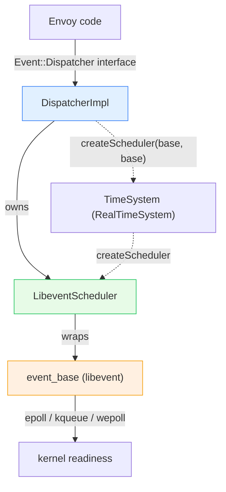
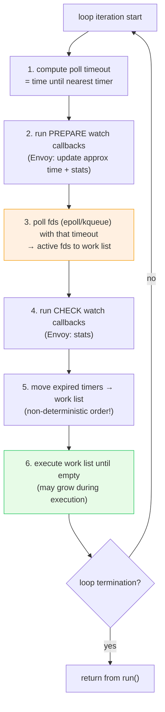
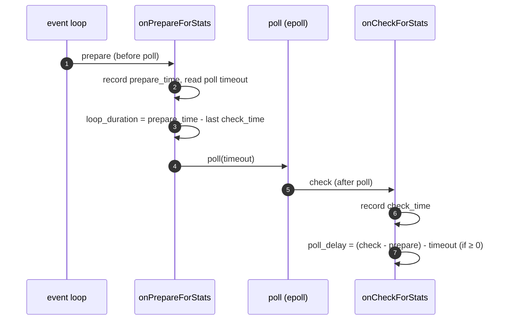

# Event — architecture & design

The loop anatomy, the threading model, the time abstraction, and the loop-timing stats. The primitives and the
lifecycle/threading patterns get their own deep dives ([`primitives.md`](primitives.md),
[`lifecycle_and_threading.md`](lifecycle_and_threading.md)).

Read [`README.md`](README.md) first.

---

## Part 1 — the layers



- **`DispatcherImpl`** — implements `Event::Dispatcher`. It's both the **event loop driver** and the **factory**
  for every event primitive, connection, and watcher. One per thread.
- **`LibeventScheduler`** — owns the libevent `event_base` and runs `event_base_loop`. Also computes loop-timing
  stats via libevent "prepare/check" watch hooks.
- **`TimeSystem` / `RealTimeSystem`** — abstracts "what is the clock and how do I make a scheduler". Production
  uses `RealTimeSystem`; tests inject a `SimulatedTimeSystem` so time can be fast-forwarded deterministically.
  This indirection (the dispatcher gets its `Scheduler` *from* the `TimeSystem`) is the reason Envoy's
  time-dependent code is testable without sleeping.
- **libevent** — the actual readiness multiplexer (`epoll` on Linux, `kqueue` on macOS, `wepoll` on Windows).
  The folder deliberately keeps libevent contained; only `libevent*.{h,cc}` and the `_impl` files include
  `event2/`.

---

## Part 2 — one iteration of the loop

The header comment in `libevent_scheduler.h` documents libevent's per-iteration sequence. Distilled:



### Execution order within the work list

Items run in the order they were added:

0. Events activated before the loop started (tests).
1. **Fd events.**
2. **Timers**, `FileEvent::activate`, and `SchedulableCallback::scheduleCallbackNextIteration` (these are
   implemented as zero-delay libevent timers, so they land here).
3. **Same-iteration work items**: `post()` callbacks (run as a group), `deferredDelete` / `DeferredTaskUtil`
   (run as a group), and `SchedulableCallback::scheduleCallbackCurrentIteration` (each independent).

> **The critical caveat (called out in the source):** *do not assume ordering when mixing these mechanisms.* For
> example, a `post()` immediately followed by a `deferredDelete()` does **not** guarantee the post runs first — if
> a deferred deletion was already pending, the delete group runs first. Code that needs ordering must express it
> explicitly, not rely on scheduling side effects.

### `RunType` — three ways to run

| `RunType` | libevent flag | Behavior |
|---|---|---|
| `Block` | (default) | Run until no pending events remain. |
| `NonBlock` | `EVLOOP_NONBLOCK` (+`EVLOOP_ONCE` on level-trigger platforms) | Activate & run ready events once, then return. |
| `RunUntilExit` | `EVLOOP_NO_EXIT_ON_EMPTY` | Run until `exit()`/`loopExit()`, blocking even when idle. |

`exit()` calls `event_base_loopexit`. Note `run()` first flushes all `post()` callbacks **before** entering the
loop, because some setup posts must run before the first events — and libevent guarantees no ordering otherwise.

---

## Part 3 — the threading model (the golden rule)

> **A dispatcher belongs to exactly one thread.** Nearly every method begins with `ASSERT(isThreadSafe())`.

```cpp
bool isThreadSafe() const override {
  return run_tid_.isEmpty() || run_tid_ == thread_factory_.currentThreadId();
}
```

`run_tid_` is captured the first time `run()` is called. Before that (e.g. construction, or tests that never run
the loop) everything is permitted; after that, only the owning thread may call factory/scheduling methods.

**The three explicitly cross-thread-safe escape hatches** (they take locks):

| Method | Purpose | Mechanism |
|---|---|---|
| `post(cb)` | Run `cb` on the dispatcher's thread | Locked queue + `SchedulableCallback` wakeup |
| `deleteInDispatcherThread(obj)` | Destroy `obj` on the dispatcher's thread | Locked list + `SchedulableCallback` |
| (`Timer` alarms posted from other threads) | — | `object_` is `atomic` to handle the race |

Everything else — `createFileEvent`, `createTimer`, `deferredDelete`, connection creation — is thread-confined.
This is what lets the hot path run **lock-free**: a worker reads its own fds, timers, and TLS slots with no
synchronization, because nothing else touches them.

### How `post` works

```cpp
void DispatcherImpl::post(PostCb callback) {
  bool do_post;
  { Thread::LockGuard lock(post_lock_);
    do_post = post_callbacks_.empty();          // only arm if queue was empty
    post_callbacks_.push_back(std::move(callback)); }
  if (do_post) { post_cb_->scheduleCallbackCurrentIteration(); }  // wake the loop
}
```

The lock is held only to touch the queue; the callbacks themselves run later in `runPostCallbacks()` **without**
the lock (so a callback may itself `post()` again). Arming the schedulable callback only when the queue was empty
avoids redundant wakeups. See [`lifecycle_and_threading.md`](lifecycle_and_threading.md) for the full treatment.

---

## Part 4 — time: approximate vs precise

Reading the clock on every operation is surprisingly expensive at Envoy's call rates. So the dispatcher caches a
**recent** monotonic time:

- `updateApproximateMonotonicTime()` is registered as an **on-check callback** — it refreshes the cached value
  once per loop iteration (right after polling).
- `approximateMonotonicTime()` returns that cached value with no syscall — used wherever "close enough" timing is
  acceptable (e.g. per-connection last-activity stamps).
- Code needing exact time still calls `timeSource().monotonicTime()`.

This is a deliberate throughput/precision trade-off, and the once-per-iteration refresh keeps the approximation
bounded by the loop duration.

---

## Part 5 — loop-timing stats

`LibeventScheduler` uses libevent's `evwatch` prepare/check hooks to emit two histograms (see
`ALL_DISPATCHER_STATS`):

| Stat | Meaning | How it's measured |
|---|---|---|
| `loop_duration_us` | time spent *between* polls (i.e. doing work) | prepare-time(N) − check-time(N−1) |
| `poll_delay_us` | how much longer polling took than its timeout | (check−prepare) − expected timeout |



These two numbers are the primary signal for **event-loop health**: a high `loop_duration` means a worker is
spending too long in callbacks (blocking the loop), and is exactly what the watchdog (Part 6) guards against.

---

## Part 6 — the watchdog hookup

A dispatcher can register a **watchdog** (`registerWatchdog`) that must be "touched" periodically to prove the
loop is alive. The dispatcher touches it:

- on a timer (`WatchdogRegistration` re-arms a `touch_timer_` every `min_touch_interval`), **and**
- defensively after most callbacks (`touchWatchdog()` is woven into the file-event, timer, schedulable-callback,
  post, and deferred-delete paths) to avoid *spurious* miss events when a single long callback list is being
  drained.

If a worker's loop stalls (e.g. a callback blocks), touches stop, the watchdog misses, and Envoy can take
action (log, kill, or run fatal actions). This is why a blocked event loop is a *detected* failure, not a silent
hang.

---

## Part 7 — fatal-error integration

`DispatcherImpl` implements `FatalErrorHandlerInterface` and registers itself on construction. On a crash:

- `onFatalError(os)` dumps the **tracked object stack** (`pushTrackedObject`/`popTrackedObject`) — the chain of
  scopes currently executing on this thread, but only if the crash is on this dispatcher's thread.
- `runFatalActionsOnTrackedObject(...)` runs registered fatal actions against that stack.

The tracked-object stack is maintained via `ScopeTrackerScopeState` RAII guards sprinkled through the
request/connection code, so a crash report can say "we were processing *this* request on *this* connection." See
[`../../signal/`](../signal/README.md) once that's documented.

---

## What this folder does *not* do

- **It is not the data sharding layer** — that's [`../thread_local/`](../thread_local/README.md). The two work
  together: TLS uses `post()` to publish to worker dispatchers.
- **It is not the network stack** — it *creates* connections (`createServerConnection` /
  `createClientConnection`) and drives them via `FileEvent`, but the connection logic lives in
  [`../network/`](../network/).
- **It does not expose libevent** — the `event_base&` accessor exists, but consumers are expected to use the
  interface; libevent could in principle be swapped (see the TODO in `libevent_scheduler.h`).

---

## Cross-references

- [`primitives.md`](primitives.md) — file events, timers, schedulable callbacks.
- [`lifecycle_and_threading.md`](lifecycle_and_threading.md) — post / deferredDelete / deleteInDispatcherThread.
- [`CLASS_HIERARCHY.md`](CLASS_HIERARCHY.md) — UML.
- [`../thread_local/OVERVIEW.md`](../thread_local/OVERVIEW.md) — the post-based update model that rides on `post()`.
