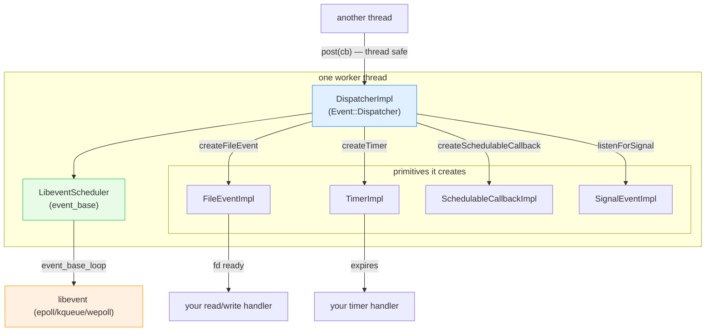

# `source/common/event/` — the event loop / dispatcher

This folder is **the beating heart of Envoy's concurrency model**. Every thread that does work — the main thread
and each worker thread — owns one `Dispatcher`, and the dispatcher *is* that thread's event loop. Sockets,
timers, signals, cross-thread posts, deferred deletion, and connection creation all flow through it. If
[`../thread_local/`](../thread_local/README.md) is how data is sharded per thread, **`event/` is how work is
scheduled per thread**.

Under the hood it's a wrapper over **libevent** (`event2/`), but that's an implementation detail the rest of
Envoy never sees — everyone codes against the `Event::Dispatcher` interface.

> **TL;DR** — this folder owns:
> - `DispatcherImpl` — the per-thread event loop + factory for everything below,
> - `FileEventImpl` — fd readability/writability events (the basis of all socket I/O),
> - `TimerImpl` / `SchedulableCallbackImpl` — timers and "run this soon" callbacks,
> - `LibeventScheduler` — the thin libevent `event_base` wrapper + loop-timing stats,
> - the **post / deferredDelete / deleteInDispatcherThread** machinery for safe cross-thread and
>   self-referential work,
> - `ScaledRangeTimerManagerImpl` — timers whose duration scales with load (overload control).

---

## The one-paragraph mental model

A thread calls `dispatcher.run(Block)` and blocks inside libevent's loop. The loop wakes when an fd becomes
ready, a timer expires, or something schedules a callback. Envoy code never touches libevent directly: it asks the
dispatcher to `createFileEvent`, `createTimer`, `createServerConnection`, etc., and gets back objects whose
callbacks fire **on the dispatcher's own thread**. Other threads can hand work in safely via `post()` (thread-safe
queue drained inside the loop). Objects that might still be referenced by an in-flight callback aren't deleted
immediately — they go on a `deferredDelete` list that's flushed at a safe point. Almost every method
`ASSERT(isThreadSafe())` to enforce the golden rule: **a dispatcher is touched only by its own thread** (except
the explicitly cross-thread-safe `post` / `deleteInDispatcherThread`).

---

## Folder map

```
source/common/event/
├── BUILD
├── dispatcher_impl.{h,cc}              # DispatcherImpl — the event loop + factory (the big one)
├── libevent.{h,cc}                     # Libevent::Global init + BasePtr (event_base RAII)
├── libevent_scheduler.{h,cc}           # LibeventScheduler — event_base wrapper + loop stats
├── event_impl_base.{h,cc}              # ImplBase — embeds the raw libevent `event` struct
├── file_event_impl.{h,cc}              # FileEventImpl — fd read/write/closed events
├── timer_impl.{h,cc}                   # TimerImpl + TimerUtils (duration→timeval)
├── schedulable_cb_impl.{h,cc}          # SchedulableCallbackImpl — current/next-iteration callbacks
├── signal_impl.{h,cc}                  # SignalEventImpl — wraps OS signals as events (posix/)
├── real_time_system.{h,cc}            # RealTimeSystem — the production TimeSystem/Scheduler
├── scaled_range_timer_manager_impl.{h,cc}  # load-scaled timers (overload control)
├── deferred_task.h                     # DeferredTaskUtil — run a task after deferred deletes
└── posix/                              # platform signal handling
```

The **interfaces** live under `envoy/event/`: `dispatcher.h`, `file_event.h`, `timer.h`, `scaled_timer.h`,
`schedulable_cb.h`, `signal.h`, `deferred_deletable.h`, `dispatcher_thread_deletable.h`.

---

## The primitives the dispatcher hands out

| Primitive | Interface | Impl | Fires when… |
|---|---|---|---|
| **File event** | `FileEvent` | `FileEventImpl` | an fd is readable / writable / closed |
| **Timer** | `Timer` | `TimerImpl` | a duration elapses |
| **Scaled timer** | `Timer` | via `ScaledRangeTimerManagerImpl` | a *load-adjusted* duration elapses |
| **Schedulable callback** | `SchedulableCallback` | `SchedulableCallbackImpl` | this or next loop iteration |
| **Signal event** | `SignalEvent` | `SignalEventImpl` | an OS signal arrives |
| **post** | — | queue + `SchedulableCallback` | drained inside the loop (cross-thread safe) |
| **deferredDelete** | `DeferredDeletable` | double-buffered vector | safe point after callbacks |

---

## Per-topic table

| Topic | Document | Source |
|---|---|---|
| The loop, threading model, post/deferred-delete, time, stats | [`OVERVIEW.md`](OVERVIEW.md) | `dispatcher_impl.*`, `libevent_scheduler.*` |
| File events & timers & schedulable callbacks in depth (libevent mapping) | [`primitives.md`](primitives.md) | `file_event_impl.*`, `timer_impl.*`, `schedulable_cb_impl.*` |
| Deferred deletion, post, and thread-local delete — the safety patterns | [`lifecycle_and_threading.md`](lifecycle_and_threading.md) | `dispatcher_impl.cc`, `deferred_task.h` |
| Class hierarchy (UML) | [`CLASS_HIERARCHY.md`](CLASS_HIERARCHY.md) | all interfaces + impls |

---

## Big picture



---

## Who uses it

**Everything.** A non-exhaustive list of documented consumers:

- [`../filesystem/`](../filesystem/README.md) watchers register their inotify/kqueue fd as a `FileEvent`.
- [`../thread_local/`](../thread_local/README.md) uses `post()` to push slot updates to worker dispatchers.
- [`../network/`](../network/) connections are created by the dispatcher and driven by `FileEvent`s.
- [`../tcp/`](../tcp/README.md) and connection pools schedule reconnect/idle timers here.

---

## Reading order

1. This `README.md` — the primitives and the golden threading rule.
2. [`OVERVIEW.md`](OVERVIEW.md) — the loop anatomy, time, and stats.
3. [`primitives.md`](primitives.md) — how file events / timers / callbacks map onto libevent.
4. [`lifecycle_and_threading.md`](lifecycle_and_threading.md) — post, deferred delete, deleteInDispatcherThread.
5. [`CLASS_HIERARCHY.md`](CLASS_HIERARCHY.md) — UML map.
