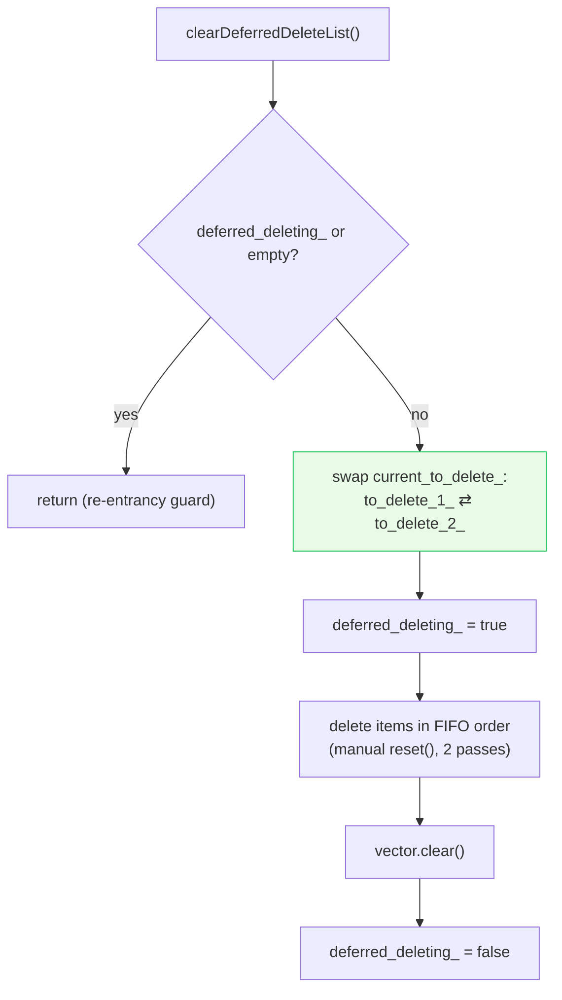
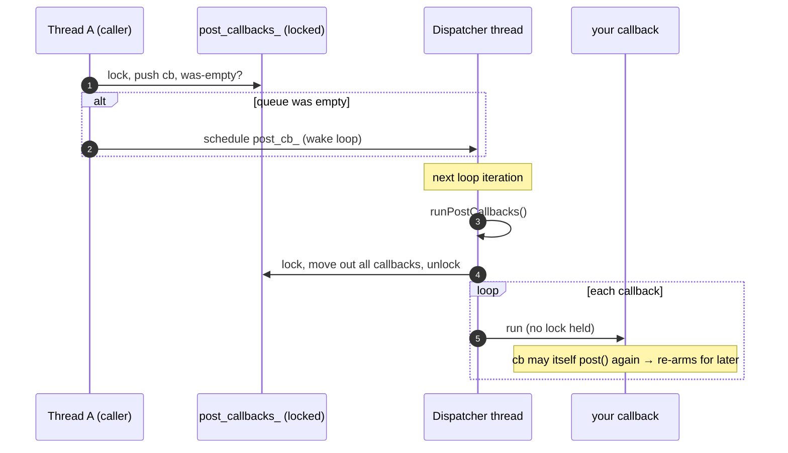
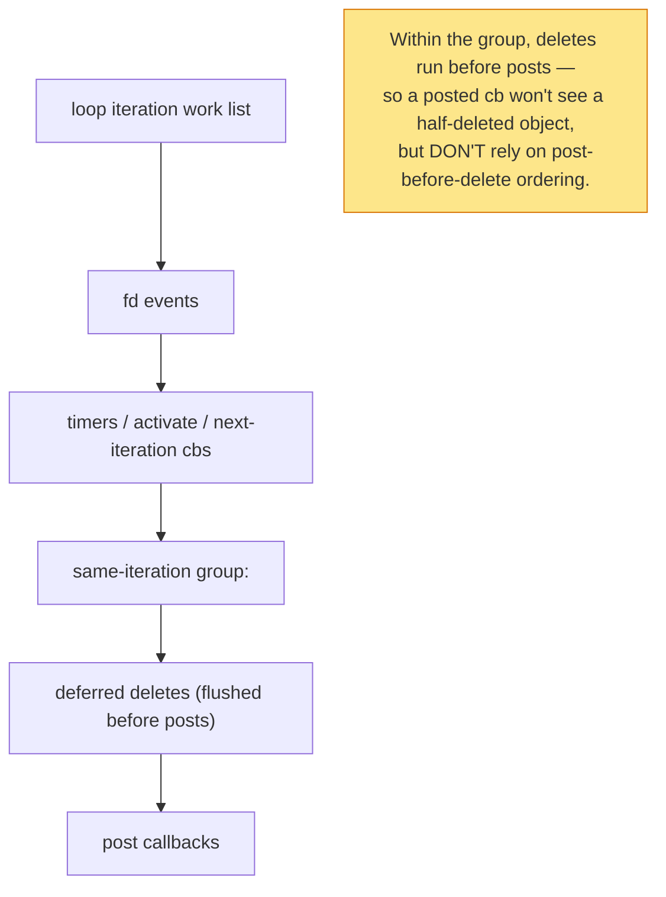

# Deep dive — post, deferred deletion & cross-thread lifecycle

The three patterns that make Envoy's lock-free hot path *safe* despite objects that delete themselves mid-callback
and threads that hand work to each other. These are subtle and bug-prone if misunderstood, so they get their own
doc.

Read [`OVERVIEW.md`](OVERVIEW.md) first.

---

## The problem each pattern solves

| Problem | Pattern | API |
|---|---|---|
| "I'm in a callback and need to destroy an object that's still on the call stack." | **Deferred deletion** | `deferredDelete(obj)` |
| "Another thread needs to run code on *this* dispatcher's thread." | **Post** | `post(cb)` |
| "An object created on a worker must be destroyed on that worker's thread, from elsewhere." | **Thread-local delete** | `deleteInDispatcherThread(obj)` |
| "Run a task *after* the current batch of deferred deletes completes." | **Deferred task** | `DeferredTaskUtil::deferredRun(...)` |

---

## Part 1 — deferred deletion

### Why it exists

Network code is full of self-referential teardown: a connection's read callback decides to close the connection,
which would delete the connection object — but we're still executing *inside* that object's method. Deleting it now
is use-after-free waiting to happen. So instead the object is **queued** and destroyed at a safe point, after the
stack unwinds back to the loop.

### The double-buffered vector

```cpp
std::vector<DeferredDeletablePtr> to_delete_1_;
std::vector<DeferredDeletablePtr> to_delete_2_;
std::vector<DeferredDeletablePtr>* current_to_delete_;   // points at one of them
```

```cpp
void deferredDelete(DeferredDeletablePtr&& to_delete) {
  ASSERT(isThreadSafe());
  to_delete->deleteIsPending();
  current_to_delete_->emplace_back(std::move(to_delete));
  if (current_to_delete_->size() == 1) {                 // first item → arm the flush
    deferred_delete_cb_->scheduleCallbackCurrentIteration();
  }
}
```

When the flush runs (`clearDeferredDeleteList`), it **swaps** the active vector before deleting:



Two subtleties the code is explicit about:

1. **Swap-before-delete.** If a destructor itself calls `deferredDelete`, the new item lands in the *other*
   vector, so we don't mutate the vector we're iterating. A *new* flush callback gets scheduled for it.
2. **FIFO order.** `std::vector::clear()` doesn't guarantee destruction order, so the code manually `reset()`s each
   element front-to-back to get deterministic FIFO teardown. (Two passes — a known, accepted minor inefficiency.)

The `deferred_deleting_` flag prevents recursive flushes from corrupting the iteration.

---

## Part 2 — post

`post` is the **cross-thread** workhorse: any thread can hand a callback to a dispatcher, and it runs on the
dispatcher's thread inside the loop.

### Enqueue side (any thread)

```cpp
void post(PostCb callback) {
  bool do_post;
  { Thread::LockGuard lock(post_lock_);
    do_post = post_callbacks_.empty();          // arm only on 0→1 transition
    post_callbacks_.push_back(std::move(callback)); }
  if (do_post) post_cb_->scheduleCallbackCurrentIteration();
}
```

### Drain side (dispatcher thread)

```cpp
void runPostCallbacks() {
  clearDeferredDeleteList();                     // flush deletes first (determinism)
  std::list<PostCb> callbacks;
  { Thread::LockGuard lock(post_lock_);
    callbacks = std::move(post_callbacks_); }    // take ownership, release lock
  while (!callbacks.empty()) {
    touchWatchdog();
    callbacks.front()();                         // run WITHOUT the lock
    callbacks.pop_front();                       // destroy callback before next runs
  }
}
```



Why these choices:

- **Lock held only around the queue**, never during callback execution — because a callback (or its destructor)
  may call `post()` again, which would deadlock if the lock were held.
- **Arm only on the empty→non-empty transition** — avoids scheduling N wakeups for N posts in the same batch.
- **Destroy each callback before the next runs** (`pop_front` immediately) — so a captured object's destructor
  side effects are ordered predictably.
- **`post` does not assert thread-safety** — that's the whole point; it's the sanctioned cross-thread entry.

---

## Part 3 — deleteInDispatcherThread

Some objects (notably thread-local slot data) are created on a worker and **must** be destroyed on that same
worker thread, but the *trigger* to destroy them comes from the main thread. `deleteInDispatcherThread` queues the
object onto a per-dispatcher list, drained by `runThreadLocalDelete()` on the dispatcher's thread:

```cpp
void deleteInDispatcherThread(DispatcherThreadDeletableConstPtr deletable) {
  { Thread::LockGuard lock(thread_local_deletable_lock_);
    need_schedule = deletables_in_dispatcher_thread_.empty();
    deletables_in_dispatcher_thread_.emplace_back(std::move(deletable)); }
  if (need_schedule) thread_local_delete_cb_->scheduleCallbackCurrentIteration();
}
```

Same shape as `post` (locked queue, arm-on-empty, FIFO drain off-lock), but dedicated to destruction. This is the
mechanism [`../thread_local/`](../thread_local/README.md) relies on to tear down per-worker slot contents safely.
On `shutdown()` the remaining deletables are drained explicitly.

---

## Part 4 — DeferredTaskUtil: "run after the deletes"

A tiny adapter that piggybacks on the deferred-delete queue to run an arbitrary task **after** currently-queued
deletions finish:

```cpp
class DeferredTask : public DeferredDeletable {
  ~DeferredTask() override { task_(); }   // the task runs in the destructor
};
static void deferredRun(Dispatcher& d, std::function<void()>&& f) {
  d.deferredDelete(std::make_unique<DeferredTask>(std::move(f)));
}
```

Because it goes through `deferredDelete`, it's processed **in order with** other deferred deletes — so it's the way
to say "once these objects are gone, then do this." Clever reuse: no separate queue needed.

---

## Putting it together: ordering within one iteration

`runPostCallbacks()` deliberately calls `clearDeferredDeleteList()` *first*. Combined with the work-list ordering
from [`OVERVIEW.md`](OVERVIEW.md), the practical guarantees are:



> **The recurring warning:** these mechanisms are **grouped**, and mixing them across `post`/`deferredDelete`/
> `activate` gives ordering that surprises people. If you need a strict order, encode it (e.g. chain the second
> action inside the first callback) rather than depending on scheduling.

---

## Cross-references

- [`OVERVIEW.md`](OVERVIEW.md) — the loop iteration and work-list ordering.
- [`primitives.md`](primitives.md) — the `SchedulableCallback` these patterns are built on.
- [`../thread_local/thread_local_impl.md`](../thread_local/thread_local_impl.md) — the biggest consumer of
  `post` and `deleteInDispatcherThread`.
