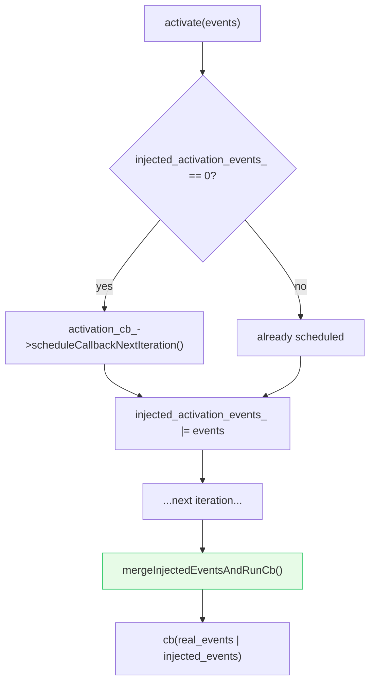
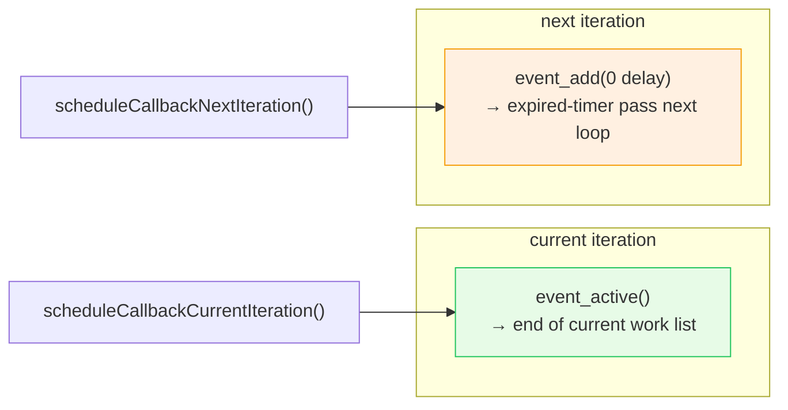
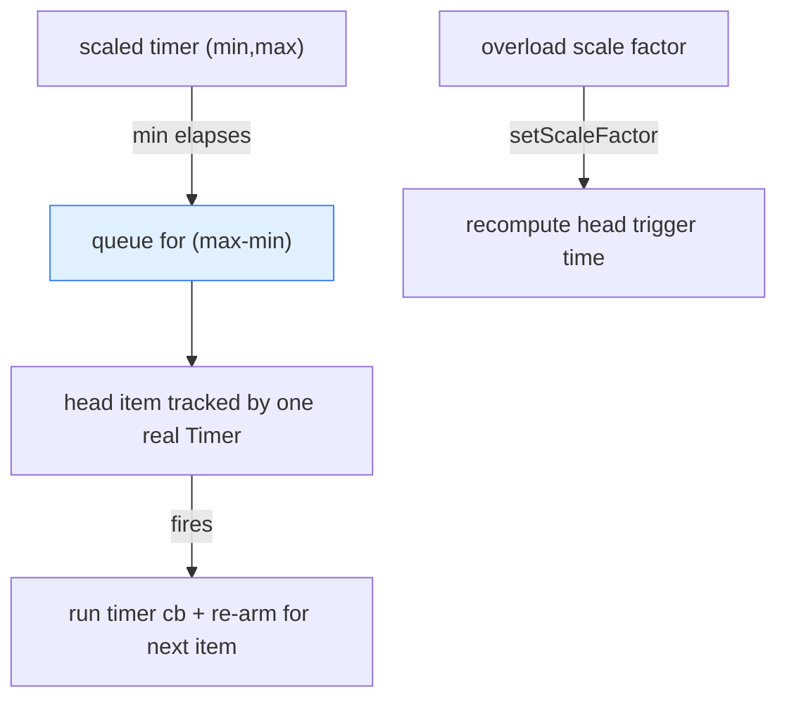

# Deep dive — file events, timers & schedulable callbacks

How the three core scheduling primitives map onto libevent. All three embed a raw libevent `event` struct (via
`ImplBase`) and are created by the dispatcher.

Read [`OVERVIEW.md`](OVERVIEW.md) first.

---

## The shared base: `ImplBase`

```cpp
class ImplBase {
protected:
  ~ImplBase();
  event raw_event_;   // the embedded libevent event struct
};
```

`TimerImpl`, `SchedulableCallbackImpl`, `FileEventImpl`, and `SignalEventImpl` all inherit `ImplBase` and call
`event_assign` / `evtimer_assign` in their constructor to wire `raw_event_` to a static C trampoline that casts
`arg` back to `this` and invokes the C++ callback. Embedding the struct (rather than heap-allocating it) keeps
each primitive a single allocation.

---

## Part 1 — `FileEventImpl`: fd readiness

This is the foundation of **all socket I/O** in Envoy. It watches an fd and fires when it's readable, writable, or
closed.

### Event types and trigger modes

```cpp
enum FileReadyType { Read = 0x1, Write = 0x2, Closed = 0x4 };
enum class FileTriggerType { Level, Edge, EmulatedEdge };
```

| Trigger | Platform | libevent flag | Semantics |
|---|---|---|---|
| `Edge` | Linux (epoll), macOS | `EV_ET` | Fires once on transition; read/write until `EAGAIN`. |
| `Level` | — | (none) | Fires whenever ready (can busy-loop on writable). |
| `EmulatedEdge` | Windows (wepoll) | (none) | Edge behavior faked by toggling registration. |

Envoy strongly prefers **edge** triggering (the impl assumes "the user will read/write until `EAGAIN`"). The
event is registered `EV_PERSIST` so it stays active across firings.

### Building the libevent flags

```cpp
event_assign(&raw_event_, base, fd_,
    EV_PERSIST
    | (trigger_ == Edge ? EV_ET : 0)
    | (events & Read   ? EV_READ   : 0)
    | (events & Write  ? EV_WRITE  : 0)
    | (events & Closed ? EV_CLOSED : 0),
    trampoline, this);
```

### `activate()` — injecting synthetic events

Sometimes Envoy needs to *pretend* an fd is ready without the kernel saying so — e.g. to re-process buffered data,
or to deliver a `Closed` event detected elsewhere. `activate(events)` does this **without busy-polling the fd**:



The injected events are stored in `injected_activation_events_` and merged with any real events when the callback
finally runs. `setEnabled()` **clears** pending injected events (an event-mask change makes stale injections
irrelevant, and edge state gets recomputed anyway).

### `setEnabled` / `updateEvents` — changing what you listen for

`setEnabled(events)` → `updateEvents(events)`:

- In **level/emulated-edge** mode, if the mask is unchanged, it's a no-op (cheap).
- In **edge** mode, it *always* re-registers (`event_del` + `event_assign` + `event_add`), because re-registering
  forces epoll to re-evaluate readiness — required for correctness even when the mask didn't change
  ([envoyproxy/envoy#16389](https://github.com/envoyproxy/envoy/pull/16389)).

### EmulatedEdge (Windows)

Real edge triggering doesn't exist on wepoll, so `EmulatedEdge` fakes it: after delivering a Read/Write event, the
impl **unregisters** that event (`unregisterEventIfEmulatedEdge`) so it won't refire until the consumer
re-registers it (`registerEventIfEmulatedEdge`) after draining. The `if constexpr (PlatformDefaultTriggerType ==
EmulatedEdge)` guards compile this away entirely on POSIX.

---

## Part 2 — `TimerImpl`: one-shot timers

A timer fires its callback once after a duration. It wraps a libevent `evtimer`.

### Duration conversion with clamping

`TimerUtils::durationToTimeval` converts any `std::chrono` duration to a `timeval`, with two guards:

- **Negative duration** → `IS_ENVOY_BUG` + fallback to 0.5 s (a bug, but don't crash release builds).
- **Overflow** → clamp to `INT32_MAX` seconds (~136 years) to avoid overflowing `timeval`.

```cpp
void enableTimer(ms d, scope)  → durationToTimeval(d, tv) → internalEnableTimer(tv)   // event_add
void enableHRTimer(us d, scope) → (same, microsecond precision)
void disableTimer()            → event_del
bool enabled()                 → evtimer_pending
```

### Scope tracking on fire

The timer's trampoline integrates with fatal-error scope tracking:

```cpp
[](..., void* arg) {
  TimerImpl* timer = static_cast<TimerImpl*>(arg);
  if (timer->object_ == nullptr) { timer->cb_(); return; }
  ScopeTrackerScopeState scope(timer->object_, timer->dispatcher_);  // push onto tracked stack
  timer->object_ = nullptr;
  timer->cb_();                                                       // pop on scope exit
};
```

If the timer was enabled with a `ScopeTrackedObject*`, that object is pushed onto the dispatcher's tracked-object
stack while the callback runs — so a crash inside the callback dumps that context. `object_` is **atomic** because
a timer can be (dis)armed from another thread via `post`, and two threads could race to clear it.

---

## Part 3 — `SchedulableCallbackImpl`: "run this soon"

A schedulable callback is a timer-with-zero-delay used for "run this callback as part of the event loop, very
soon." It's the mechanism behind `post`, deferred delete, and fd-event activation. Two flavors:

| Method | libevent call | Runs… | Why |
|---|---|---|---|
| `scheduleCallbackCurrentIteration()` | `event_active(..., EV_TIMEOUT, 0)` | **this** loop iteration (appended to work list) | for work that should run before the loop sleeps again |
| `scheduleCallbackNextIteration()` | `event_add(&ev, {0,0})` (zero-delay timer) | **next** loop iteration | for work that must run after the current work drains |



The distinction matters: `post()` uses **current iteration** (run the posted work before sleeping), while
`FileEvent::activate()` uses **next iteration** (let current work finish first, then deliver the synthetic event).
Both `cancel()` (`event_del`) and `enabled()` (`evtimer_pending`) are cheap.

---

## Part 4 — `ScaledRangeTimerManagerImpl`: load-scaled timers (briefly)

A normal timer has one duration. A **scaled** timer has a `[min, max]` range, and a global **scale factor**
(driven by the overload manager) decides where in that range it actually fires. Under load, Envoy shortens
idle/keepalive timeouts to shed connections faster.

The implementation is a clever bucketing scheme:

- Timers are grouped into **queues keyed by `(max − min)` duration**. The assumption (stated in the source) is
  that few distinct ranges are used, so the number of queues stays tiny.
- When a timer's `min` elapses it becomes "active" and joins its queue (in monotonic insertion order, so each
  queue is implicitly sorted).
- Each queue keeps **one real `Timer`** tracking the head item's scaled expiry. On fire, the head is dispatched
  and the queue timer re-armed for the next item. Changing the scale factor re-computes the head's trigger time.



So N scaled timers with the same range cost ~1 real libevent timer, not N — that's the whole point of the design.

---

## Cross-references

- [`OVERVIEW.md`](OVERVIEW.md) — where each primitive lands in the loop's work list.
- [`lifecycle_and_threading.md`](lifecycle_and_threading.md) — how `post`/deferred-delete build on schedulable
  callbacks.
- [`CLASS_HIERARCHY.md`](CLASS_HIERARCHY.md) — UML.
