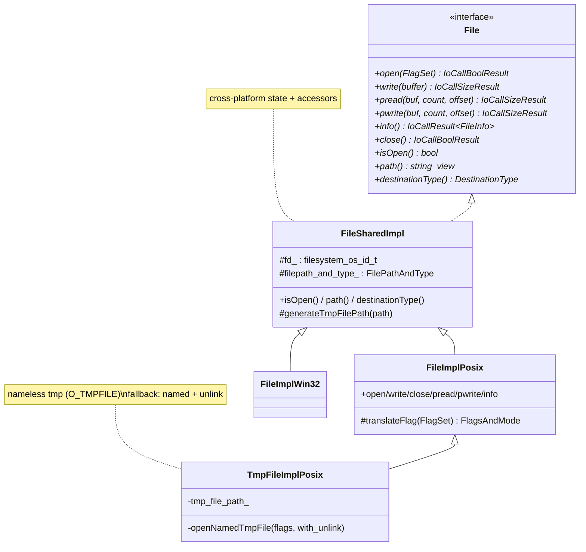
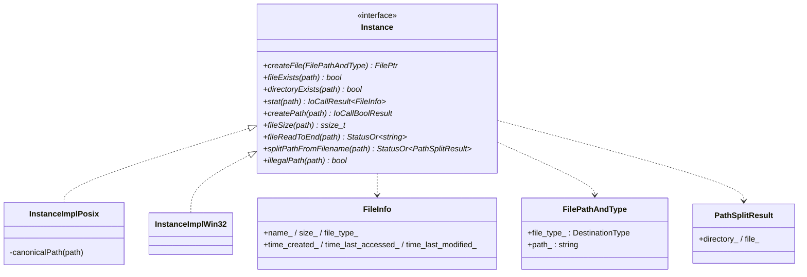
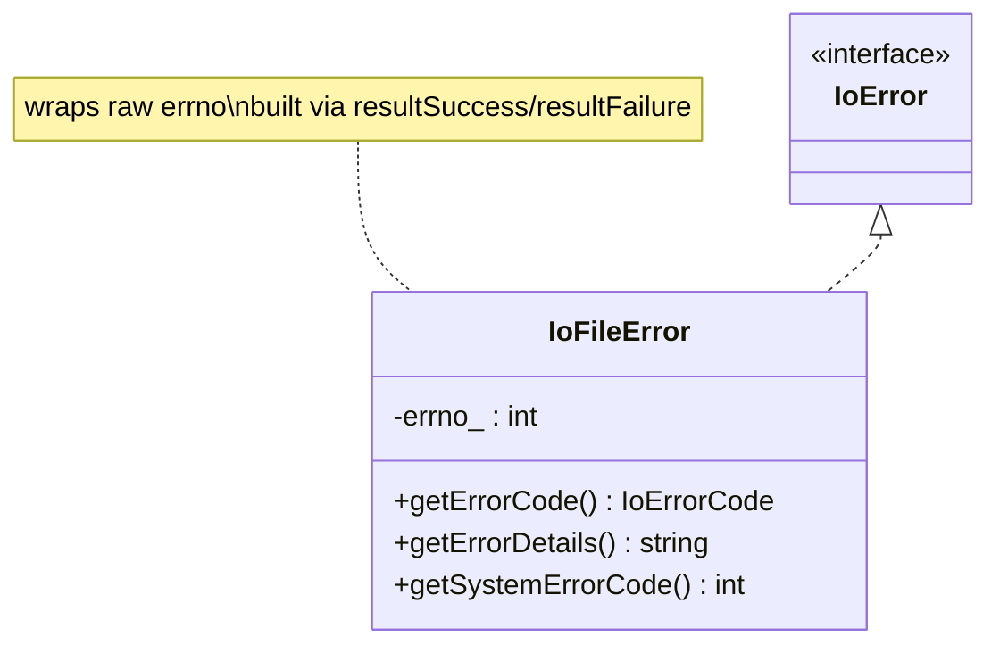
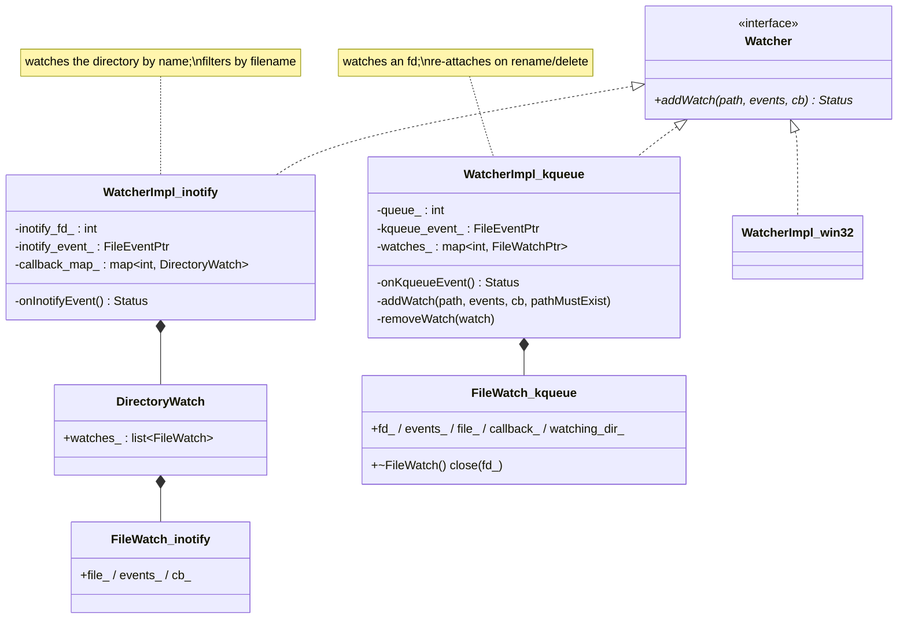
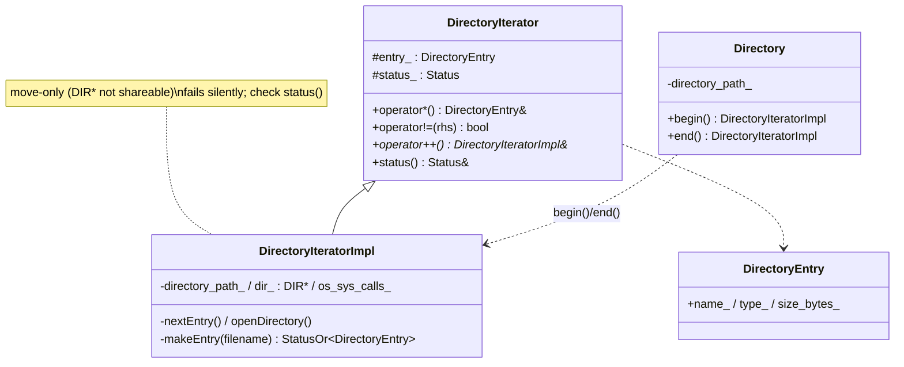

# Filesystem — class hierarchy (UML)

UML-style Mermaid for the file, instance, watcher, and directory types across platforms. See
[`OVERVIEW.md`](OVERVIEW.md) and [`watchers.md`](watchers.md) for behavior.

---

## `File` family

---

## `Instance` family + value types

---

## Error type

---

## `Watcher` family

---

## Directory iteration

---

## Type alias reference

| Alias | Underlying | Meaning |
|---|---|---|
| `FilePtr` | `unique_ptr<File>` | Owning file handle. |
| `InstancePtr` | `unique_ptr<Instance>` | Owning filesystem facade. |
| `WatcherPtr` | `unique_ptr<Watcher>` | Owning watcher. |
| `FlagSet` | `bitset<5>` | Open-operation flags. |
| `IoFileErrorPtr` | `unique_ptr<IoFileError, deleter>` | Error with custom deleter. |
| `FileImpl` / `InstanceImpl` | platform alias | `FileImplPosix` / `InstanceImplPosix` on POSIX. |
| `FileWatchPtr` (kqueue) | `shared_ptr<FileWatch>` | One watch entry; dtor closes fd. |

---

## Relationship summary

| Relationship | Type | Meaning |
|---|---|---|
| `FileImplPosix` → `FileSharedImpl` → `File` | inheritance | Cross-platform base + POSIX syscalls. |
| `TmpFileImplPosix` → `FileImplPosix` | inheritance | Temp-file specialization. |
| `WatcherImpl` → `Watcher` | inheritance | One per platform (inotify/kqueue/win32). |
| `WatcherImpl` → `FileEvent` | composition | Notification fd on the dispatcher. |
| `WatcherImpl` → `Filesystem::Instance` | uses | `splitPathFromFilename`. |
| `Directory` → `DirectoryIteratorImpl` | factory | `begin()`/`end()` for range-for. |
| `IoFileError` → `IoError` | inheritance | errno-carrying error. |
