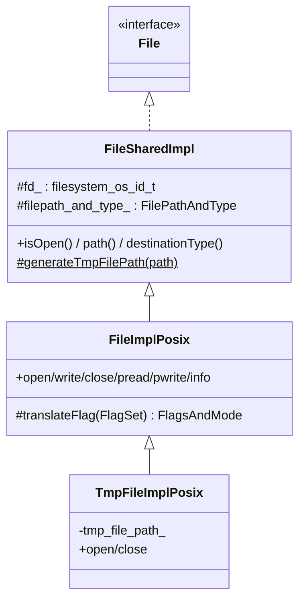
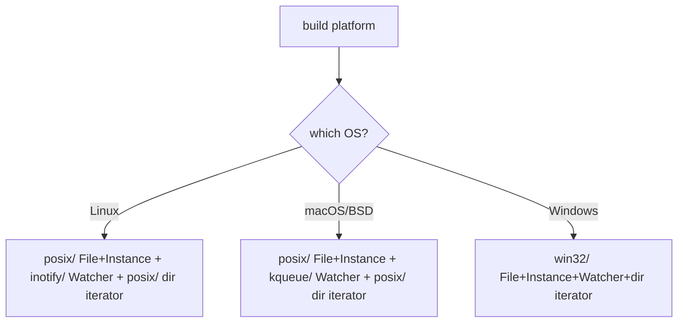
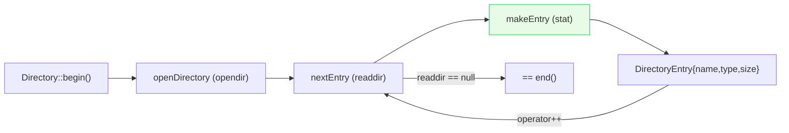

# Filesystem — architecture & design

The I/O model, the error type, platform selection, the file abstraction, and directory iteration. The watcher
gets its own deep dive in [`watchers.md`](watchers.md).

Read [`README.md`](README.md) first.

---

## Part 1 — the error model: `IoCallResult`, not exceptions

Every fallible filesystem call returns `Api::IoCallResult<T>` — a `{return_value, IoErrorPtr}` pair — rather than
throwing. The error half is `IoFileError`, which wraps a raw `errno`:

```cpp
class IoFileError : public Api::IoError {
  Api::IoError::IoErrorCode getErrorCode() const override;   // mapped enum
  std::string getErrorDetails() const override;              // strerror-style
  int getSystemErrorCode() const override { return errno_; } // raw errno
};
```

Two helpers build results consistently:

```cpp
resultSuccess(value);          // error half is a null IoFileErrorPtr
resultFailure(value, errno);   // error half carries the errno
```

> **Why `IoErrorPtr` is a `unique_ptr` with a custom deleter:** `Api::IoError` is a shared abstraction with
> different concrete types and deletion rules. The deleter (`Api::IoErrorDeleterType`) lets the success case use a
> no-op/null deleter and the failure case `delete` the heap error — without the caller caring which it got.

This pattern means callers must **check the error half** before trusting the value — there's no exception to
forget to catch, and the `errno` is always available for logging.

---

## Part 2 — `File`: the single-file abstraction

`File` (interface in `envoy/filesystem/filesystem.h`) models one open file. Operations are gated by a `FlagSet`
(a `std::bitset<5>`) built from `File::Operation` flags:

| Flag | Meaning |
|---|---|
| `Read` | open for reading |
| `Write` | open for writing (truncates unless `Append`/`KeepExistingData`) |
| `Create` | create if missing |
| `Append` | append instead of truncate |
| `KeepExistingData` | write without truncating (important for `pwrite`, esp. on Windows) |

### The class split



- **`FileSharedImpl`** holds the cross-platform state — the fd/handle (`fd_`, initialized to `INVALID_HANDLE`) and
  the path/type — and the platform-agnostic accessors (`isOpen`, `path`, `destinationType`).
- **`FileImplPosix`** implements the actual syscalls (`open`/`write`/`pread`/`pwrite`/`close`/`info`) and
  `translateFlag` (maps Envoy `FlagSet` → POSIX `O_*` flags + mode). The Win32 sibling does the same with Windows
  handles.
- **`TmpFileImplPosix`** specializes temp-file creation: ideally a **nameless** tmp file (Linux `O_TMPFILE`), with
  a fallback (`openNamedTmpFile`) that creates a named file and unlinks it while open when the kernel/filesystem
  doesn't support nameless tmp files.

### `pread`/`pwrite` vs `write`

`write` is positional-append style (writes at the file's current offset). `pread`/`pwrite` take an explicit
`offset`, enabling random access without a separate `seek` — used where Envoy reads/writes specific regions.

---

## Part 3 — `Instance`: filesystem-level operations

`Instance` is the broader filesystem facade (one per `Api::Api`). Highlights of `InstanceImplPosix`:

| Method | Notes |
|---|---|
| `createFile(FilePathAndType)` | Factory for a `File` (Regular vs TmpFile by `DestinationType`). Doesn't open it. |
| `fileExists` / `directoryExists` | Existence + openability checks. |
| `stat(path)` | Returns `FileInfo` (size, type, created/accessed/modified times). |
| `createPath(path)` | `mkdir -p` — recursively create directories. |
| `fileSize(path)` | Size in bytes, or -1. |
| `fileReadToEnd(path)` | Whole-file read into a string (the comment warns it's not the fastest path). |
| `splitPathFromFilename(path)` | Split into `{directory_, file_}` — used heavily by the watchers. |
| `illegalPath(path)` | Deny-list sanity check (blocks some clearly-bad paths like `/dev/...`). |
| `canonicalPath(path)` (private) | `realpath`-style canonicalization. |

`FileInfo` and `DirectoryEntry` carry a subtle but documented detail: for a **symlink**, `file_type_` is the type
of the *target* (so a symlink to a directory reports `Directory`); a broken symlink on POSIX reports `Regular`.

---

## Part 4 — platform selection

There is no runtime dispatch — the build picks one implementation per platform and aliases it:

```cpp
// posix/filesystem_impl.h
using FileImpl = FileImplPosix;
using InstanceImpl = InstanceImplPosix;
```



Note the **mix-and-match**: macOS and Linux *share* the POSIX `File`/`Instance`/dir-iterator, but each brings its
own `Watcher` (inotify vs kqueue) because file-change notification has no portable POSIX API.

---

## Part 5 — directory iteration

`Directory` is a thin range wrapper enabling `for (const auto& entry : Directory(path))`:

```cpp
Directory dir(path);
for (const DirectoryEntry& e : dir) { /* e.name_, e.type_, e.size_bytes_ */ }
```

`DirectoryIteratorImpl` (POSIX) wraps a `DIR*` from `opendir`/`readdir`:

- It is **move-only, not copyable** — a copy would close the shared `DIR*` on destruction and corrupt the
  original. The copy ctor is `= delete`d; move is defaulted.
- It **fails silently**: on `opendir` error it behaves like an empty iterator, and it skips entries that can't be
  `stat`ed. If you care about errors, check `status()` after construction and after each `++`.
- `makeEntry` `stat`s each filename to fill in `type_` and `size_bytes_`.



---

## Part 6 — the atomic-rename pattern (why `MovedTo` matters)

A recurring theme: Envoy config files (SDS certs, runtime values, Kubernetes `ConfigMap`/`Secret` mounts) are
updated **atomically by renaming** a new file over the old one, rather than editing in place. This is why the
watcher vocabulary centers on `MovedTo` (a rename landed) as much as `Modified` (in-place write). Kubernetes in
particular swaps a symlink, which is exactly the case the kqueue watcher works hard to handle (see
[`watchers.md`](watchers.md)). Writers that want this safety use the tmp-file + rename dance, and `TmpFileImpl`
exists to make the "write to tmp" half clean.

---

## What this folder does *not* do

- **No buffering/streaming layer** — that's `Buffer`. `File` is raw read/write.
- **No async I/O** — calls are synchronous; only the *watcher* is event-driven (via the dispatcher).
- **No path manipulation library** beyond `splitPathFromFilename` / `illegalPath` — heavier path logic lives in
  `common/common` utilities.

---

## Cross-references

- [`watchers.md`](watchers.md) — the inotify/kqueue deep dive.
- [`CLASS_HIERARCHY.md`](CLASS_HIERARCHY.md) — UML.
- [`../secret/`](../secret/README.md), [`../runtime/`](../runtime/README.md) — the big watcher consumers.
