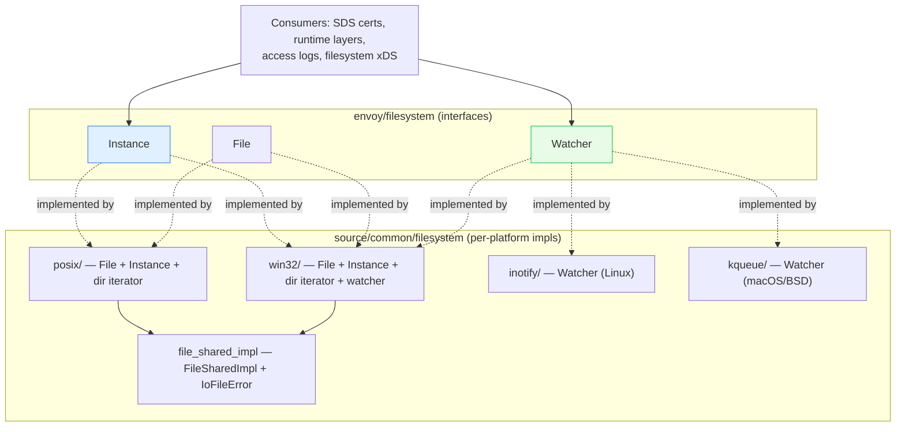

# `source/common/filesystem/` — file I/O, directory iteration & file watching

This folder is Envoy's **portable filesystem layer**. It abstracts three things behind interfaces so the rest of
the codebase never touches a raw `open()`/`read()`/`inotify` syscall directly:

1. **`File`** — open / read / write / pread / pwrite / stat / close on a single file.
2. **`Instance`** — filesystem-level operations: existence checks, `stat`, `createPath`, read-to-end, path
   splitting, illegal-path checks.
3. **`Watcher`** — get a callback when a watched file or directory changes (config hot-reload).

Plus `Directory` / `DirectoryIterator` for listing directory contents.

> **Why an abstraction?** Envoy runs on Linux, macOS, and Windows, and the primitives differ wildly — `inotify`
> vs `kqueue` vs `ReadDirectoryChangesW`, `pread` vs `ReadFile`, `/` vs `\`. Each interface has **per-platform
> implementations** selected at build time, so callers write one code path. The watcher in particular is the
> backbone of config hot-reload (SDS certs, runtime layers, filesystem-based xDS).

---

## The one paragraph mental model

`Instance` is the entry point — `Api::Api` hands you one (`api.fileSystem()`). From it you `createFile()` to get a
`File`, or call `stat`/`createPath`/`fileReadToEnd` directly. All I/O returns `Api::IoCallResult<T>` — a
`{value, IoError}` pair — instead of throwing, so errors are explicit and carry the OS `errno`. The `Watcher`,
created from a `Dispatcher`, registers a path + event mask + callback; under the hood each OS uses its native
file-notification API, but they all converge on the same `Events::{Modified, MovedTo}` vocabulary and fire the
callback **on the main thread** via the dispatcher's event loop.

---

## Folder map

```
source/common/filesystem/
├── BUILD
├── directory.h                       # Directory (range-for over a dir)
├── file_shared_impl.{h,cc}           # FileSharedImpl + IoFileError (cross-platform base)
├── inotify/   watcher_impl.{h,cc}    # Linux watcher (inotify)
├── kqueue/    watcher_impl.{h,cc}    # macOS/BSD watcher (kqueue)
├── posix/     filesystem_impl.{h,cc} # POSIX File + Instance (Linux/macOS)
│             directory_iterator_impl.{h,cc}  # POSIX dir iteration (dirent)
└── win32/     filesystem_impl.{h,cc} # Windows File + Instance
              directory_iterator_impl.{h,cc}  # Windows dir iteration
              watcher_impl.{h,cc}              # Windows watcher
```

The **interfaces** live under `envoy/filesystem/`:

```
envoy/filesystem/
├── filesystem.h   # File, Instance, FileInfo, DirectoryEntry, DirectoryIterator, FlagSet, enums
└── watcher.h      # Watcher + Events {Modified, MovedTo}
```

---

## The three interfaces

| Interface | Created from | Key methods | Implementations |
|---|---|---|---|
| `File` | `Instance::createFile()` | `open` `write` `pread` `pwrite` `info` `close` | `FileImplPosix`, `TmpFileImplPosix`, Win32 |
| `Instance` | `Api::Api::fileSystem()` | `fileExists` `stat` `createPath` `fileReadToEnd` `splitPathFromFilename` `illegalPath` | `InstanceImplPosix`, Win32 |
| `Watcher` | `Dispatcher::createFilesystemWatcher()` | `addWatch(path, events, cb)` | inotify, kqueue, Win32 |

---

## Per-topic table

| Topic | Document | Source |
|---|---|---|
| The I/O model, error handling, platform selection, directory iteration | [`OVERVIEW.md`](OVERVIEW.md) | `filesystem.h`, `file_shared_impl.*`, `posix/*` |
| The watcher implementations (inotify vs kqueue) in depth | [`watchers.md`](watchers.md) | `inotify/*`, `kqueue/*`, `watcher.h` |
| Class hierarchy (UML) | [`CLASS_HIERARCHY.md`](CLASS_HIERARCHY.md) | all interfaces + impls |

---

## Big picture



---

## Who uses it

- **Config hot-reload** — `Watcher` drives SDS secret reloads, runtime layer reloads, and filesystem-subscription
  xDS. See [`../secret/`](../secret/README.md) and [`../runtime/`](../runtime/README.md).
- **Access logs** — open/append files via `File`.
- **Startup** — read bootstrap/config files via `Instance::fileReadToEnd`.

---

## Reading order

1. This `README.md` — the three interfaces and platform layout.
2. [`OVERVIEW.md`](OVERVIEW.md) — I/O model, error type, directory iteration, atomic-rename pattern.
3. [`watchers.md`](watchers.md) — inotify vs kqueue mechanics, the "watch the directory" trick.
4. [`CLASS_HIERARCHY.md`](CLASS_HIERARCHY.md) — UML map.
