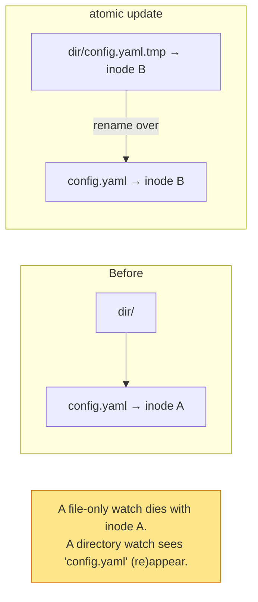
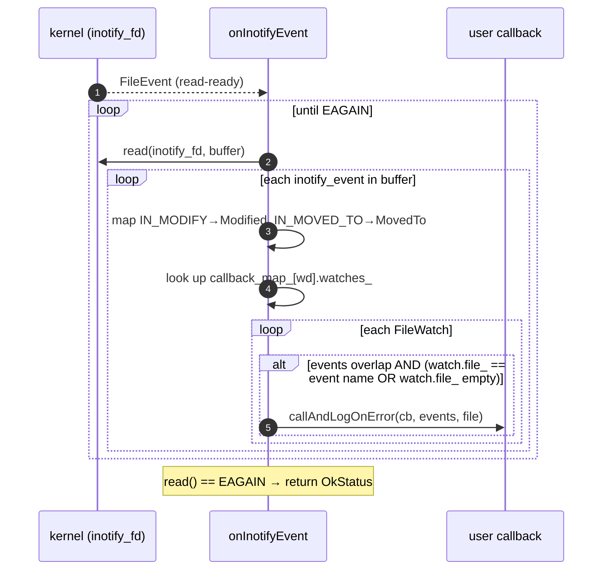

# Deep dive — the file watchers (inotify & kqueue)

The `Watcher` interface is small — `addWatch(path, events, cb)` — but the implementations are the trickiest code
in the folder, because OS file-change APIs are notoriously awkward and the thing Envoy actually wants to detect
(an **atomic rename landing a new config file**) is exactly the case those APIs handle worst.

This doc covers the Linux (`inotify/`) and macOS/BSD (`kqueue/`) implementations. Read
[`OVERVIEW.md`](OVERVIEW.md) first.

---

## The shared contract

```cpp
class Watcher {
  using OnChangedCb = std::function<absl::Status(uint32_t events)>;
  struct Events {
    static constexpr uint32_t MovedTo  = 0x1;   // a rename landed (the common config case)
    static constexpr uint32_t Modified = 0x2;   // in-place write
  };
  virtual absl::Status addWatch(absl::string_view path, uint32_t events, OnChangedCb cb) PURE;
};
```

Both implementations:

- are created with a `Dispatcher` and a `Filesystem::Instance`,
- register their OS notification fd as a **`FileEvent`** on the dispatcher (edge-triggered, read-ready), so the
  callback fires **on the main thread** inside the event loop,
- normalize OS-specific flags into `Events::{Modified, MovedTo}`,
- wrap the user callback in `callAndLogOnError`, which asserts main-thread, catches exceptions, and rate-limits
  error logs with `ENVOY_LOG_EVERY_POW_2` so a persistently-failing callback can't spam the log.

---

## The central trick: watch the *directory*, not the file

Both backends, for different reasons, end up watching the **parent directory** rather than the file itself. Why?
Because config updates replace the file via rename/move — the *original inode you'd watch is gone* after the
update. Watching the directory lets you see the new file appear.



---

## Linux: `inotify/watcher_impl.cc`

The header comment is blunt: *"inotify is an awful API."* The strategy is to **always watch the owning
directory** and synthesize per-file events by filtering.

### Setup

```cpp
inotify_fd_ = inotify_init1(IN_NONBLOCK);    // non-blocking fd
inotify_event_ = dispatcher.createFileEvent(inotify_fd_, onInotifyEvent, Edge, Read);
```

A `RELEASE_ASSERT` guards `inotify_init1` failure with a helpful hint to bump
`fs.inotify.max_user_watches` / `max_user_instances` — a real-world operational footgun when many watches exist.

### `addWatch`

```cpp
auto result = file_system_.splitPathFromFilename(path);   // {directory_, file_}
int watch_fd = inotify_add_watch(inotify_fd_, directory_, IN_MODIFY | IN_MOVED_TO);
callback_map_[watch_fd].watches_.push_back({file_, events, callback});
```

So the kernel watch is on the **directory**, and `callback_map_` maps each watch-descriptor to a list of
per-file `FileWatch`es (file name + event mask + callback). Multiple files in the same directory share one
directory watch but get separate list entries.

### `onInotifyEvent` — drain & dispatch

inotify delivers a packed buffer of variable-length `inotify_event` structs. The handler loops:



Key details:

- **Buffer alignment:** the read buffer is `alignas(inotify_event)` and sized `sizeof(inotify_event) + NAME_MAX +
  1`. The kernel guarantees subsequent structs in a multi-event read are aligned.
- **Filtering:** an event fires a watch only if (a) the event mask overlaps the watch's requested events, AND (b)
  the event's filename matches the watched file — *or* the watch has an empty `file_`, meaning it's a
  **directory-level** watch that wants all events in the directory.
- **Edge-triggered drain:** because the `FileEvent` is edge-triggered, the handler must read until `EAGAIN`,
  otherwise it would miss events that arrived between reads.

---

## macOS/BSD: `kqueue/watcher_impl.cc`

kqueue watches **file descriptors** via `EVFILT_VNODE`, with flags `NOTE_DELETE | NOTE_RENAME | NOTE_WRITE`. The
twist: you watch an fd, but the whole point is to detect the file being *replaced* — at which point your fd points
at the old, now-deleted inode. So kqueue's watcher is a small **state machine** that re-attaches as files come and
go.

### `FileWatch` is richer here

```cpp
struct FileWatch : LinkedObject<FileWatch> {
  ~FileWatch() { close(fd_); }   // RAII: closing the fd unregisters the kqueue event
  int fd_;
  uint32_t events_;
  std::string file_;
  OnChangedCb callback_;
  bool watching_dir_;            // are we currently watching the dir as a stand-in?
};
using FileWatchPtr = std::shared_ptr<FileWatch>;
```

`watches_` maps fd → `FileWatchPtr`. Removing the map entry destroys the `FileWatch`, whose destructor closes the
fd — which **automatically** unregisters the kevent. Clean.

### `addWatch` — try the file, fall back to the directory

```cpp
int watch_fd = open(path, O_SYMLINK);   // open the symlink itself, not its target
if (watch_fd == -1) {
  // file doesn't exist yet → watch the directory and wait for it to appear
  watch_fd = open(directory_, 0);
  watching_dir = true;
}
EV_SET(&event, watch_fd, EVFILT_VNODE, EV_ADD | EV_CLEAR, NOTE_DELETE|NOTE_RENAME|NOTE_WRITE, ...);
kevent(queue_, &event, 1, ...);
```

`O_SYMLINK` is deliberate — Kubernetes mounts swap a **symlink**, and Envoy wants to notice the symlink itself
changing, not follow it to the (also-changing) target.

### `onKqueueEvent` — the re-attach state machine

```mermaid
flowchart TD
    Ev["kevent fires for watch_fd"] --> Dir{watching_dir_?}

    Dir -->|yes| D1{NOTE_DELETE?}
    D1 -->|yes| Drm["removeWatch (dir gone)"]
    D1 -->|no| D2{NOTE_WRITE?}
    D2 -->|yes| Dadd["try addWatch(file, must_exist=true)"]
    Dadd -->|file now exists| Dswap["swap dir watch → file watch<br/>events |= MovedTo"]
    Dadd -->|still missing| Dskip["keep watching dir"]

    Dir -->|no| F1{file_ empty?<br/>(dir-level watch)}
    F1 -->|yes| F1w{NOTE_WRITE?}
    F1w -->|yes| Fmoved["events |= MovedTo"]
    F1 -->|no| F2{NOTE_DELETE?<br/>(treated as rename)}
    F2 -->|yes| Freattach["removeWatch + re-addWatch(must_exist)<br/>set NOTE_RENAME"]
    F2 -->|no/after| F3{flags}
    F3 -->|NOTE_RENAME| Fr["events |= MovedTo"]
    F3 -->|NOTE_WRITE| Fw["events |= Modified"]

    Dswap --> Fire
    Fmoved --> Fire
    Fr --> Fire
    Fw --> Fire
    Fire{"events & file->events_?"} -->|yes| CB["callAndLogOnError"]

    style Freattach fill:#fff0e1,stroke:#f59e0b
    style Dswap fill:#e7fbe7,stroke:#22c55e
```

The subtle parts the code calls out in comments:

- **`NOTE_DELETE` is treated as a rename.** kqueue "doesn't work well with `NOTE_RENAME` and `O_SYMLINK`", so when
  a watched file gets `NOTE_DELETE`, the watcher assumes a rename happened, removes the old watch, and tries to
  re-attach to a (presumably new) file of the same name — synthesizing a `MovedTo`.
- **Directory fallback promotion.** If the watch started on the directory (file didn't exist), a `NOTE_WRITE` on
  the dir triggers a re-check: if the awaited file now exists, the watcher swaps the directory watch for a real
  file watch and reports `MovedTo`.
- **Path-split failure is permanent** → the watch is removed (can't recover).

### Why kqueue is more complex than inotify

inotify watches a **directory by name** and reports which filename changed — so re-attachment is automatic (the
directory name never changes). kqueue watches an **fd**, and the fd dies with the file on rename — so the watcher
must explicitly notice the death, reopen, and re-register. That's the entire reason the kqueue path is a state
machine while inotify is a filter.

---

## Comparison table

| Aspect | inotify (Linux) | kqueue (macOS/BSD) |
|---|---|---|
| Watches | directory, by name | a file descriptor |
| Notification fd | single `inotify_fd_` | the kqueue `queue_` |
| Event source flags | `IN_MODIFY`, `IN_MOVED_TO` | `NOTE_WRITE`, `NOTE_RENAME`, `NOTE_DELETE` |
| Re-attach on rename | automatic (dir watched by name) | manual (reopen + re-register) |
| Per-watch state | `FileWatch` in a list per wd | `FileWatchPtr` per fd + `watching_dir_` flag |
| Failure hint | bump `fs.inotify.max_user_*` | — |
| Dispatch | `FileEvent` (edge, read), main thread | `FileEvent` (edge, read), main thread |

Both ultimately deliver the same `Events::{Modified, MovedTo}` to the user callback, so consumers
([`../secret/`](../secret/README.md), [`../runtime/`](../runtime/README.md)) are fully platform-agnostic.

---

## Cross-references

- [`OVERVIEW.md`](OVERVIEW.md) — the atomic-rename pattern this code exists to handle.
- [`CLASS_HIERARCHY.md`](CLASS_HIERARCHY.md) — UML for both watchers.
- `envoy/event/file_event.h` — the dispatcher `FileEvent` both watchers register on.
