# Envoy Formatter Architecture

## Overview

The `source/common/formatter/` directory implements Envoy's **substitution formatter** — the engine that powers access logs, header values, and any string template containing `%COMMAND(SUBCOMMAND):LENGTH%` tokens.

The formatter takes a **format string** (or a JSON struct) plus runtime data (`Context` + `StreamInfo`) and produces a rendered output string. It supports two output shapes (text and JSON), pluggable command parsers (extensions register new tokens), and per-token max-length truncation.

---

## 1. High-Level Architecture

```mermaid
graph TB
    subgraph "Configuration Time"
        Config[SubstitutionFormatString proto]
        TextFmt[text_format: 'string template']
        JsonFmt[json_format: Protobuf::Struct]
        TextSrc[text_format_source: DataSource]

        Config --> TextFmt
        Config --> JsonFmt
        Config --> TextSrc
    end

    subgraph "Parsing"
        Util[SubstitutionFormatStringUtils<br/>fromProtoConfig]
        ParseFmters[parseFormatters<br/>extension command parsers]
        FmtImpl[FormatterImpl::create]
        JsonImpl[createJsonFormatter]

        Util --> ParseFmters
        Util --> FmtImpl
        Util --> JsonImpl
    end

    subgraph "Format Engine"
        SubParser[SubstitutionFormatParser::parse<br/>tokenize % … %]
        Regex[commandWithArgsRegex<br/>%COMMAND(SUB):LEN%]
        UserParsers[User CommandParsers]
        BuiltIn[BuiltInCommandParsers<br/>HTTP / StreamInfo]

        SubParser --> Regex
        SubParser --> UserParsers
        SubParser --> BuiltIn
    end

    subgraph "Runtime"
        Formatter[Formatter<br/>FormatterImpl / JsonFormatterImpl]
        Providers[FormatterProviders<br/>Plain / Header / StreamInfo / …]
        Output[Rendered string]

        Formatter --> Providers
        Providers --> Output
    end

    Config --> Util
    Util --> Formatter
    SubParser -.produces.-> Providers
    FmtImpl --> SubParser
    JsonImpl --> SubParser

    style Config fill:#e1f5ff
    style Output fill:#c8e6c9
    style Regex fill:#fff9c4
```

---

## 2. The Two Pipelines: Text vs JSON

### 2.1 Text pipeline

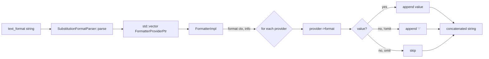

- The format string is split at `%…%` boundaries.
- Each non-`%` run becomes a `PlainStringFormatter`.
- Each `%COMMAND(...)%` becomes a typed `FormatterProvider` (header, stream-info, etc.).
- At runtime, every provider's `format(ctx, info)` is called and the strings are concatenated.

### 2.2 JSON pipeline

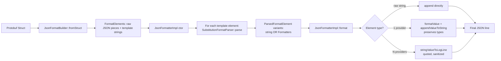

- A `Protobuf::Struct` is walked once at config time. Map keys are sorted for deterministic output.
- Pure data (numbers, booleans, strings without `%`) is serialized as **raw JSON pieces**.
- String values containing `%` are kept as **template strings** parsed into `Formatters`.
- At runtime, raw JSON is appended verbatim; templates render their `FormatterProvider`s and emit a quoted, sanitized JSON string. A single-provider template can use `formatValue` to keep numeric / bool / null typing.

---

## 3. Command Token Anatomy

Format: `%COMMAND(SUBCOMMAND):LENGTH%`

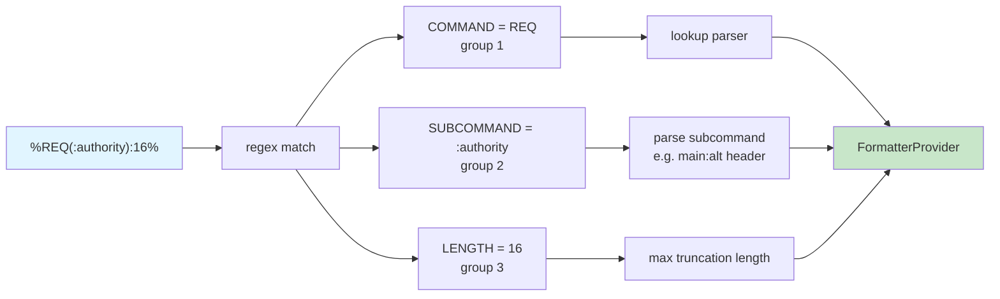

### 3.1 Regex (from `substitution_formatter.cc`)

```text
^%((?:[A-Z]|[0-9]|_)+)(?:\((.*?)\))?(?::([0-9]+))?%
   |__________________|     |___|        |______|
        COMMAND               SUB           LEN
```

- COMMAND: `[A-Z0-9_]+`, mandatory.
- SUBCOMMAND: any chars except `)`, optional, in parens.
- LENGTH: digits, optional, after a colon.

### 3.2 Syntax flags (`CommandSyntaxChecker::CommandSyntaxFlags`)

| Flag | Meaning |
|------|---------|
| `COMMAND_ONLY` | No params, no length (e.g. `%PROTOCOL%`) |
| `PARAMS_REQUIRED` | Subcommand must be present (e.g. `%REQ(...)%`) |
| `PARAMS_OPTIONAL` | Subcommand may be present (e.g. `%START_TIME%`, `%START_TIME(...)%`) |
| `LENGTH_ALLOWED` | `:N` truncation suffix is allowed |

`CommandSyntaxChecker::verifySyntax` is called by every command parser before constructing a provider.

### 3.3 Parsing loop in `SubstitutionFormatParser::parse`

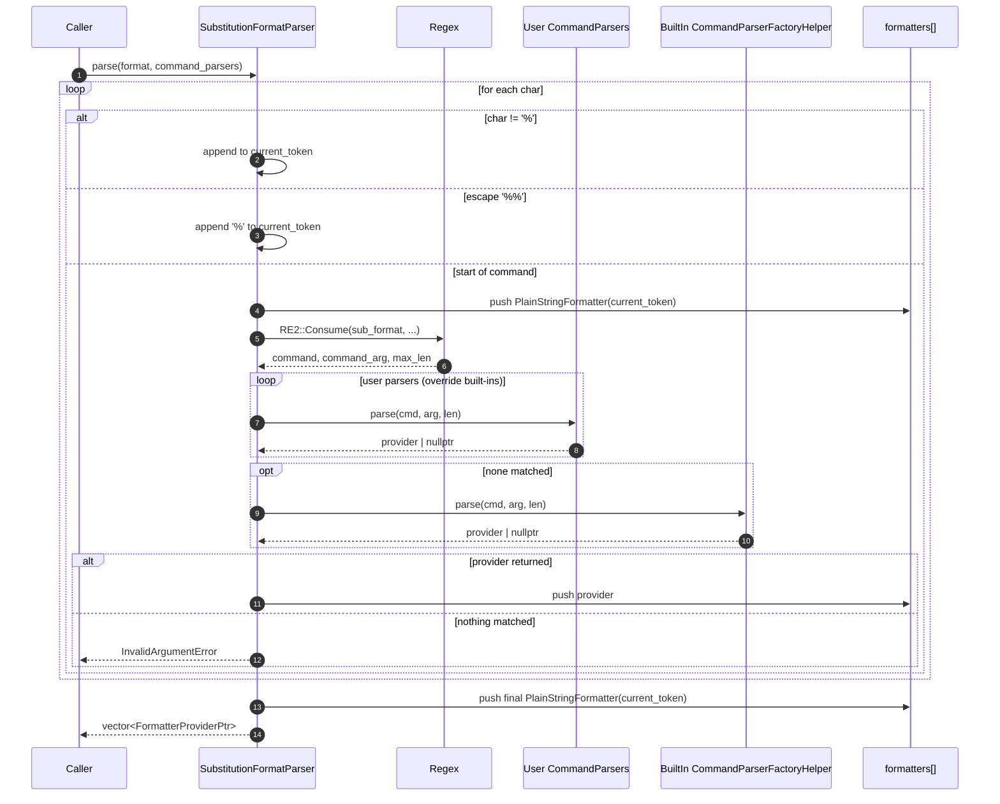

Important subtleties:
- **`%%` escaping** is handled before the regex.
- **User command parsers run first**, so extensions can override built-ins.
- An empty / trailing literal segment still produces a `PlainStringFormatter` (so the renderer can iterate uniformly).
- An unknown command is a hard parse error — discovered at config load, not at runtime.

---

## 4. Formatter Class Hierarchy

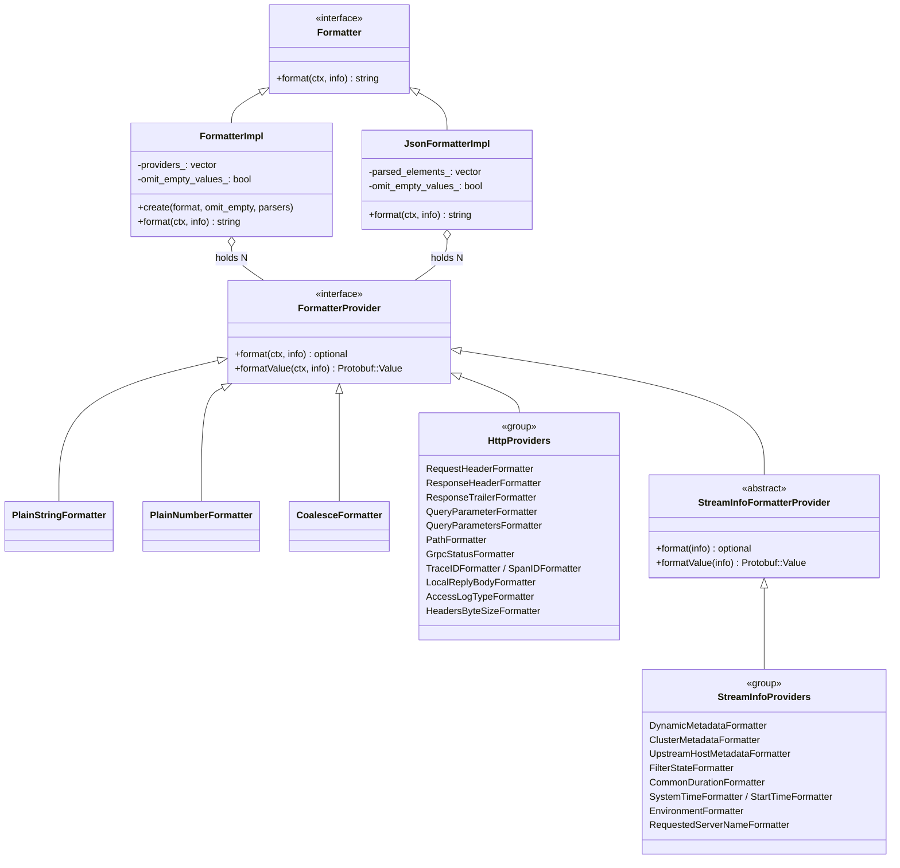

Key splits:
- `FormatterProvider` always sees the full `Context` (which carries headers + trailers + access-log type + local reply body) and `StreamInfo`.
- `StreamInfoFormatterProvider` is a convenience base for tokens that ignore the HTTP context — it forwards `format(ctx, info)` to a single-arg `format(info)` overload.

---

## 5. Built-In Command Parsers

Two factories register at static init via `REGISTER_FACTORY`:

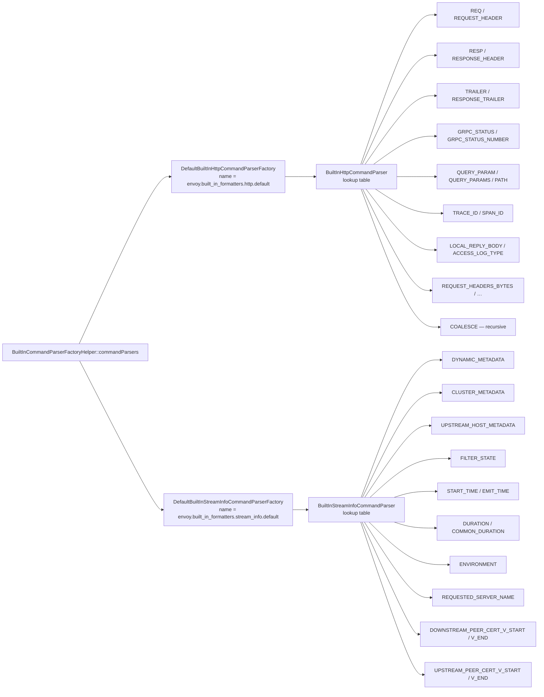

`BuiltIn{Http,StreamInfo}CommandParser::parse(command, sub, len)`:

1. Look up `command` in a static `CONSTRUCT_ON_FIRST_USE` table.
2. If absent, return `nullptr` (allows other parsers to try).
3. Verify syntax flags via `CommandSyntaxChecker::verifySyntax`.
4. Invoke the captured factory lambda with `(subcommand, max_length)` to construct the `FormatterProvider`.

---

## 6. Header & Length Helpers

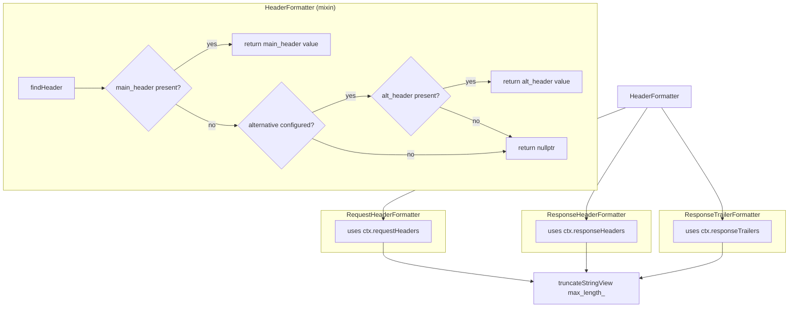

- `parseSubcommandHeaders("X?Y")` splits on `?` to populate `(main, alternative)`.
- `truncate / truncateStringView` are no-ops when `max_length` is unset.
- `parseSubcommand(sub, ':', tok1, tok2, ..., tail_vector)` is a variadic helper that scans `:`-separated subcommands and binds each token, dumping leftovers into an optional vector at the end.

---

## 7. CoalesceFormatter — first non-null wins

`CoalesceFormatter` is itself a `FormatterProvider`. Configured as a JSON object:

```json
{
  "operators": [
    "REQUESTED_SERVER_NAME",
    {"command": "REQ", "param": ":authority"},
    {"command": "REQ", "param": "host"}
  ]
}
```

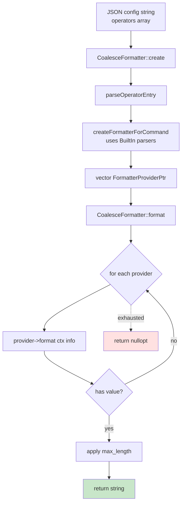

Caveats:
- Each operator entry can be either a bare string (command name only) or `{command, param, max_length}` object.
- The JSON `param` cannot contain literal `)` because the surrounding parser regex would close prematurely.
- `COALESCE` is itself registered as a built-in HTTP command, enabling nested fallback chains.

---

## 8. Configuration Entry Points

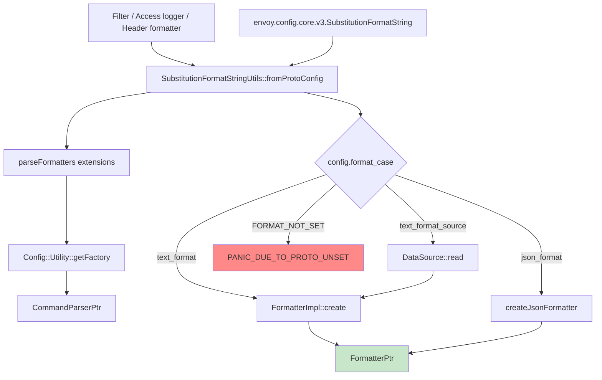

- **Extension resolution**: `parseFormatters` walks `config.formatters()` (a list of `TypedExtensionConfig`), looks up each via `Config::Utility::getFactory<CommandParserFactory>`, and produces a `CommandParserPtr` per entry. Errors are returned, not thrown.
- **Single source of truth**: any caller that wants to load a format from proto config must go through `fromProtoConfig` so that the three input modes (inline text, JSON, file source) are normalized.

---

## 9. JSON Format Builder Internals

`JsonFormatBuilder` walks a `Protobuf::Struct` once and produces an alternating sequence of *raw JSON pieces* and *format template strings*.

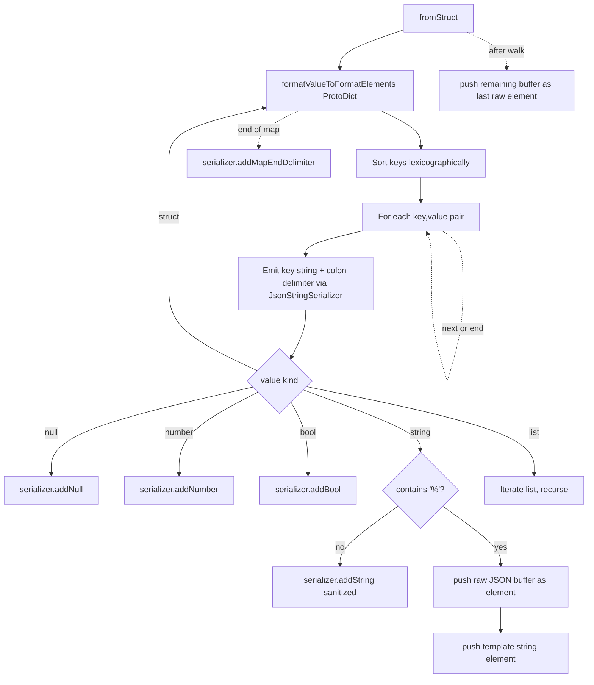

- Sorting keys makes the output deterministic across builds — important for snapshot tests.
- Strings without `%` are emitted as **pre-sanitized** JSON pieces (escaped + quoted at config time).
- Strings with `%` flush the current buffer then emit a `template` element; sanitization is deferred to runtime because the rendered values are unknown.
- `JsonStringSerializer` is a low-level helper that writes bytes via `Json::StringOutput` and uses `Json::sanitize` for escaping. It duplicates a small piece of `BufferStreamer` to allow finer control of delimiters.

---

## 10. Runtime: How `format(ctx, info)` Renders

### 10.1 Text (`FormatterImpl::format`)

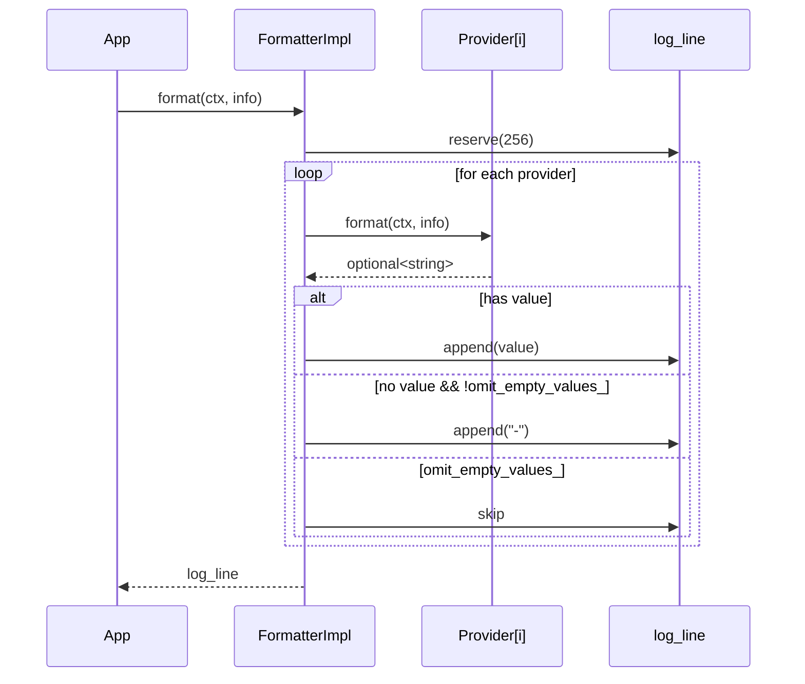

### 10.2 JSON (`JsonFormatterImpl::format`)

For each `ParsedFormatElement`:
- `string` variant → append raw JSON piece directly (already sanitized).
- `Formatters` with **exactly one** provider → call `formatValue(ctx, info)` and `Json::Utility::appendValueToString`. This preserves number / bool / null types in the output JSON.
- `Formatters` with **multiple** providers → call `stringValueToLogLine`:
  - Emit `"`.
  - Concatenate each provider's `format(ctx, info)` value (sanitized) or `"-"` / `""` for missing values.
  - Emit `"`.
- Append a trailing `\n` after the line is built.

The single-vs-many distinction is what lets `{"status": "%RESPONSE_CODE%"}` produce `{"status":200}` (number) instead of `{"status":"200"}` (string).

---

## 11. End-to-End Render Sequence (Text Example)

Format string: `"%PROTOCOL% %REQ(:authority)% %RESPONSE_CODE%\n"`

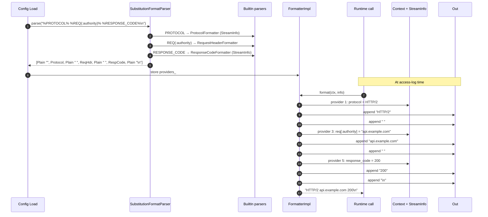

---

## 12. Extension Points

```mermaid
graph TB
    subgraph "User Extension"
        UF[Extension Factory<br/>CommandParserFactory]
        UP[Custom CommandParser]
        UV[Custom FormatterProvider]
    end

    subgraph "Config"
        TC[TypedExtensionConfig in formatters[] list]
    end

    subgraph "Engine"
        Util[parseFormatters]
        SP[SubstitutionFormatParser::parse]
    end

    TC --> Util
    Util -- getFactory + createCommandParserFromProto --> UF
    UF --> UP
    UP -- parse cmd, sub, len --> UV
    SP -- "tries user parsers first" --> UP

    style UF fill:#fff9c4
    style UV fill:#c8e6c9
```

- A user extension only needs to implement `CommandParserFactory` and `CommandParser`. The latter returns `nullptr` for commands it doesn't recognize.
- User parsers run **before** built-ins in `SubstitutionFormatParser::parse`, allowing extensions to override default behavior.
- The same parser list is threaded through `JsonFormatterImpl`, so JSON configs see the same extension surface.

---

## 13. Quick Reference

| Concept | Class / Function | File |
|---------|------------------|------|
| Top-level config conversion | `SubstitutionFormatStringUtils::fromProtoConfig` | `substitution_format_string.cc` |
| Tokenization | `SubstitutionFormatParser::parse` | `substitution_formatter.cc` |
| Text renderer | `FormatterImpl` | `substitution_formatter.{h,cc}` |
| JSON renderer | `JsonFormatterImpl` + `JsonFormatBuilder` | `substitution_formatter.cc` |
| Syntax flags | `CommandSyntaxChecker` | `substitution_format_utility.h` |
| Header / `?` parsing | `SubstitutionFormatUtils::parseSubcommandHeaders` | `substitution_format_utility.{h,cc}` |
| Generic `:`-split parser | `SubstitutionFormatUtils::parseSubcommand` | `substitution_format_utility.h` |
| Built-in HTTP commands | `BuiltInHttpCommandParser` | `http_specific_formatter.{h,cc}` |
| Built-in StreamInfo commands | `BuiltInStreamInfoCommandParser` | `stream_info_formatter.{h,cc}` |
| First-non-null operator | `CoalesceFormatter` | `coalesce_formatter.{h,cc}` |
| Default access-log format | `HttpSubstitutionFormatUtils::defaultSubstitutionFormatter` | `http_formatter_context.{h,cc}` |

