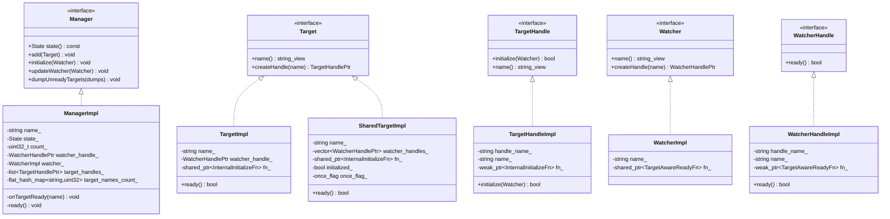
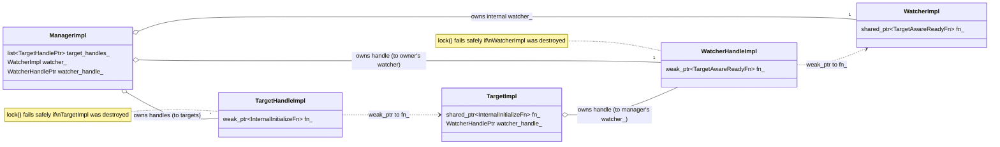

# Init framework — class hierarchy (UML)

UML-style class diagrams for every type in `envoy/init/` (interfaces) and `source/common/init/`
(implementations).

---

## Interfaces + implementations

---

## Ownership & reference relationships

Solid = owns (`shared_ptr`/value/`unique_ptr`); dashed = weak reference (`weak_ptr`) created via a handle.

---

## Callback type aliases

| Alias | Type | Where | Meaning |
|---|---|---|---|
| `InitializeFn` | `std::function<void()>` | `target_impl.h` | user-supplied "go initialize" body |
| `InternalInitializeFn` | `std::function<void(WatcherHandlePtr)>` | `target_impl.h` | internal wrapper that also captures the manager's watcher handle |
| `ReadyFn` | `std::function<void()>` | `watcher_impl.h` | user-supplied "all done" body |
| `TargetAwareReadyFn` | `std::function<void(absl::string_view)>` | `watcher_impl.h` | "all done" body that also receives the finishing target's name |

`ManagerImpl` always builds its internal `watcher_` with a `TargetAwareReadyFn` so it learns *which* target
finished (used to maintain `target_names_count_`). A plain `WatcherImpl(name, ReadyFn)` simply ignores the
name argument.

---

## Smart-pointer aliases

| Alias | Definition |
|---|---|
| `TargetHandlePtr` | `std::unique_ptr<TargetHandle>` |
| `WatcherHandlePtr` | `std::unique_ptr<WatcherHandle>` |

---

## Legend

- `<<interface>>` — pure-virtual type declared under `envoy/init/`.
- Solid arrow `<|..` — implements interface.
- `o--` — ownership.
- `..>` — weak reference (the "handle" safety mechanism).
