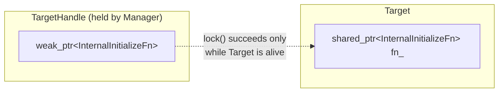
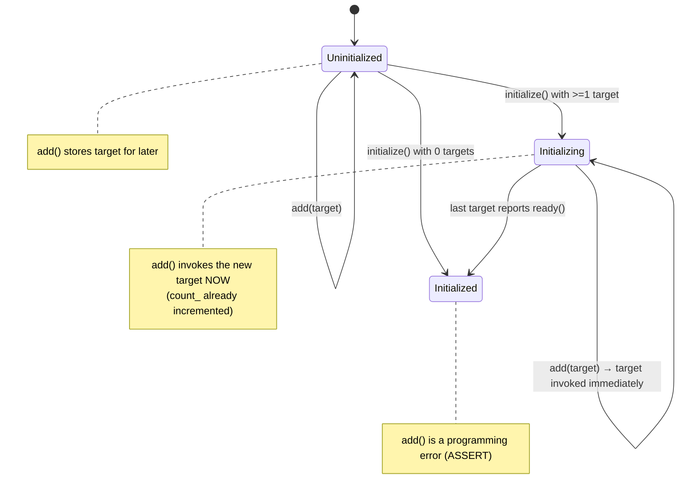
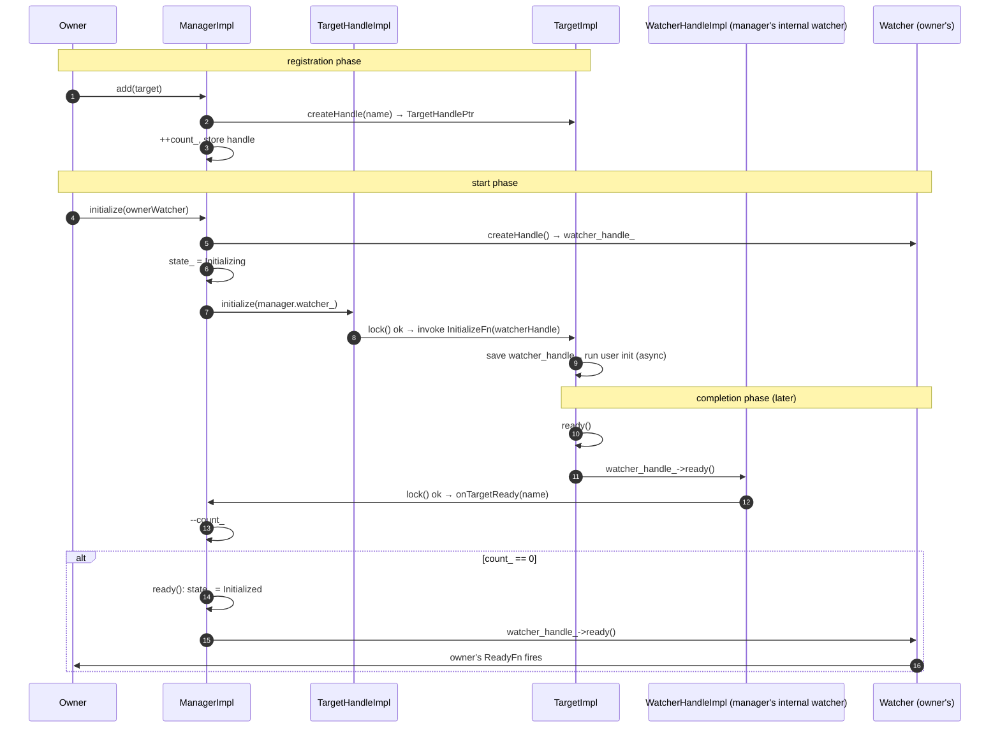
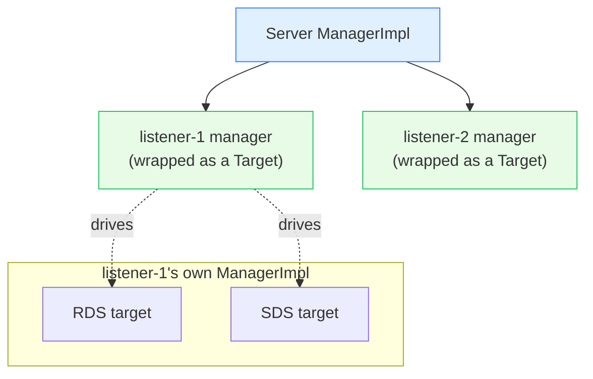

# Init framework — architecture & design

This document explains **how** the init framework works and, more importantly, **why** it is built the way it
is. The whole design is driven by one hard problem: **lifetime safety between three independently-owned
entities**.

---

## The three roles

| Role | Interface | Impl | One-liner |
|---|---|---|---|
| **Manager** | `Init::Manager` | `ManagerImpl` | Collects targets, counts how many are still un-ready, fires the watcher when the count hits zero. |
| **Target** | `Init::Target` | `TargetImpl`, `SharedTargetImpl` | A named "initialize yourself now" callback owned by a subsystem. |
| **Watcher** | `Init::Watcher` | `WatcherImpl` | A named "everything is ready now" callback owned by whoever started initialization. |

And the two **handles** that make it safe:

| Handle | Interface | Impl | Wraps |
|---|---|---|---|
| **TargetHandle** | `Init::TargetHandle` | `TargetHandleImpl` | a `weak_ptr` to a target's callback |
| **WatcherHandle** | `Init::WatcherHandle` | `WatcherHandleImpl` | a `weak_ptr` to a watcher's callback |

---

## The core problem: lifetimes don't line up

Three different objects, owned by three different parts of the system, must call each other **asynchronously**:

- The **owner** of the manager (a server, a listener) may be torn down mid-initialization (e.g. a listener
  that fails to start, or a config update that replaces it).
- A **target's** subsystem may be destroyed before it ever gets initialized, or before it reports ready.
- The **watcher's** owner may go away before the targets finish.

If any of these held raw pointers or strong references to the others, you'd get either use-after-free crashes or
reference cycles that leak. The init framework's answer is the **handle**.

### The handle trick (weak references as callbacks)

Every target and every watcher stores its callback in a `std::shared_ptr<std::function<...>>`. When it hands a
*handle* to another party, that handle holds only a `std::weak_ptr` to the callback:



When the manager invokes a target through its handle:

```cpp
bool TargetHandleImpl::initialize(const Watcher& watcher) const {
  auto locked_fn(fn_.lock());     // try to promote weak_ptr -> shared_ptr
  if (locked_fn) {
    (*locked_fn)(watcher.createHandle(name_));  // target alive: call it
    return true;
  }
  return false;                   // target already destroyed: no-op, no crash
}
```

`WatcherHandleImpl::ready()` does the exact same dance in the other direction. The boolean return value lets the
caller treat an "unavailable" (already-destroyed) party **as if it had completed immediately** — which is
exactly what the manager does (see below). This is the single most important idea in the folder.

---

## The state machine

`Init::Manager::State` has three values, and the manager enforces legal transitions with `ASSERT`s:



Key rules encoded in `manager_impl.cc`:

- **`add()` while `Uninitialized`** → store the target handle for later.
- **`add()` while `Initializing`** → initialize the new target *immediately* (count is incremented first, so a
  synchronous `ready()` callback is handled correctly).
- **`add()` while `Initialized`** → `ASSERT(false)` — adding to an already-finished manager is a bug.
- **`initialize()` twice** → `ASSERT` failure.
- **`initialize()` with zero targets** → completes immediately (calls `ready()` synchronously). This is normal
  and fine.

---

## The happy-path sequence



---

## `TargetImpl` vs `SharedTargetImpl`

| | `TargetImpl` | `SharedTargetImpl` |
|---|---|---|
| Registered with | exactly **one** manager | **multiple** managers |
| Holds | a single `watcher_handle_` | a `vector<WatcherHandlePtr>` |
| Runs init fn | every time it's initialized | **once** (guarded by `std::once_flag`) |
| Use case | the common case — one subsystem, one manager | a shared resource warmed once but gating several managers |

`SharedTargetImpl` also remembers if it has already `initialized_`; a manager that adds it *after* it's ready is
notified immediately rather than waiting forever.

---

## A subtle but critical detail: move-before-notify

Both `TargetImpl::ready()` and `SharedTargetImpl::ready()` move the watcher handle(s) into a **local** before
calling `ready()` on them:

```cpp
bool TargetImpl::ready() {
  if (watcher_handle_) {
    // Calling ready() may destroy THIS target (e.g. a listener torn down on
    // init failure). Move the handle out first so we don't touch a freed member.
    auto local_watcher_handle = std::move(watcher_handle_);
    return local_watcher_handle->ready();
  }
  fn_.reset();   // manager hasn't started yet: drop the fn so we don't hang it later
  return false;
}
```

This guards against re-entrant destruction: notifying the manager can synchronously trigger logic that deletes
the very target that's running `ready()`. By moving the handle to a stack local first, the member is never
dereferenced after the object might be gone.

---

## Nesting: managers as targets

The framework composes into a tree. A listener owns its own `Init::Manager`. That manager is exposed to the
*server's* manager as a single **target** — when the server initializes, it pokes the listener's manager-as-target,
which in turn initializes all the listener's own targets. The server's manager only sees "ready" once the
listener's manager has driven all of its children to ready.



This is why a single slow xDS subscription deep inside one listener can hold up the whole server's transition to
"serving."

---

## Admin / observability

`ManagerImpl` tracks an `absl::flat_hash_map<std::string, uint32_t> target_names_count_` of un-ready target
names. `dumpUnreadyTargets()` feeds this into `envoy.admin.v3.UnreadyTargetsDumps`, which is how the admin
`/init_dump` endpoint can tell you **exactly which targets are still blocking startup** — invaluable when Envoy
is stuck "not serving."

When the `init` logger is at `debug`/`trace`, every significant event (target added, initialized, ready,
destroyed, called-while-unavailable) is logged.

---

## What this folder does *not* do

- **It does not do any actual initialization work.** It only sequences callbacks. The work (fetching configs,
  warming clusters) lives in the subsystems that register targets.
- **It is not thread-safe by itself.** The init flow runs on the main thread; it is not designed for concurrent
  use across worker threads. (Contrast with `thread_local/`, which *is* the cross-thread mechanism.)
- **It has no timeouts.** A target that never calls `ready()` blocks forever. Timeouts (e.g. listener warm-up
  timeouts) are implemented by the *callers*, not here.

---

## Cross-references

- [`manager_target_watcher.md`](manager_target_watcher.md) — line-by-line implementation walk-through.
- [`CLASS_HIERARCHY.md`](CLASS_HIERARCHY.md) — UML of every class.
- Consumers: [`../rds/OVERVIEW.md`](../rds/OVERVIEW.md), [`../secret/OVERVIEW.md`](../secret/OVERVIEW.md),
  [`../runtime/OVERVIEW.md`](../runtime/OVERVIEW.md).
