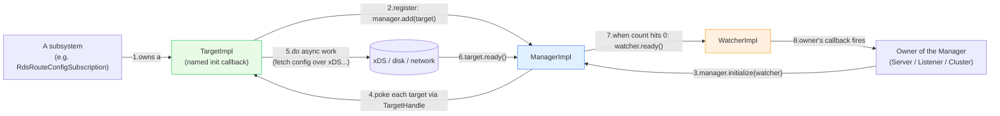

# `source/common/init/` — the two-phase initialization framework

This folder is the **engine that sequences "warm up before you serve traffic."** It is tiny (three pairs of
`.{h,cc}` files) but foundational: nearly every dynamically-configured subsystem in Envoy — RDS, SDS, CDS, LDS,
runtime/RTDS — registers an **init target** so that the server (or a listener) does not move to the "serving"
state until that subsystem has fetched its initial configuration.

The folder contains the **only implementations** of the `Init::Manager`, `Init::Target`, and `Init::Watcher`
interfaces declared under `envoy/init/`.

> **TL;DR** — this folder owns:
> - the **Manager** (`ManagerImpl`) that collects targets, kicks off initialization, and fires a single
>   "all done" callback when the last target reports ready,
> - the **Target** (`TargetImpl`, `SharedTargetImpl`) — a named, lazily-invoked "go initialize yourself now"
>   callback,
> - the **Watcher** (`WatcherImpl`) — a named "you're done" callback,
> - and a **weak-reference handle** for each of the above (`TargetHandleImpl`, `WatcherHandleImpl`) that makes
>   the whole thing safe against out-of-order destruction.

---

## The one paragraph mental model

A **Manager** owns a list of **Targets**. You `add()` targets, then call `initialize(watcher)`. The manager
pokes each target ("initialize yourself"). Each target does its async work (e.g. fetch a route table over xDS)
and calls `ready()` when finished. When the *last* target reports ready, the manager notifies the **Watcher**
it was given. Every cross-entity call goes through a **handle** that is really a `std::weak_ptr`, so if any
party has been destroyed in the meantime the call is silently and safely dropped instead of crashing.

---

## Folder map

```
source/common/init/
├── BUILD
├── manager_impl.{h,cc}   # ManagerImpl — collects targets, counts readiness, fires watcher
├── target_impl.{h,cc}    # TargetImpl + SharedTargetImpl + TargetHandleImpl (weak ref to a target)
└── watcher_impl.{h,cc}   # WatcherImpl + WatcherHandleImpl (weak ref to a watcher)
```

The **interfaces** live under `envoy/init/`:

```
envoy/init/
├── manager.h    # Init::Manager (State enum, add/initialize/updateWatcher/dumpUnreadyTargets)
├── target.h     # Init::Target + Init::TargetHandle
└── watcher.h    # Init::Watcher + Init::WatcherHandle
```

---

## Per-topic table

| Topic | Document | Source |
|---|---|---|
| Architecture, lifetimes, the handle trick | [`OVERVIEW.md`](OVERVIEW.md) | how & why it all fits together |
| Class hierarchy (UML) | [`CLASS_HIERARCHY.md`](CLASS_HIERARCHY.md) | every class in this folder + interfaces |
| Manager / Target / Watcher deep dive | [`manager_target_watcher.md`](manager_target_watcher.md) | all three `*_impl.{h,cc}` |

---

## Big picture



---

## Who uses this folder

| Caller | Target it registers | What "ready" means |
|---|---|---|
| `RdsRouteConfigSubscription` (`common/rds`) | a target per RDS subscription | first `RouteConfiguration` received |
| `SdsApi` (`common/secret`) | a target per SDS subscription | first secret received from SDS/disk |
| `ClusterManagerImpl` / CDS (`common/upstream`) | per-cluster + CDS targets | cluster warmed / CDS primed |
| `ListenerManagerImpl` (`common/listener_manager`) | per-listener init manager | all listener filters/sub-resources warmed |
| `LoaderImpl` / RTDS (`common/runtime`) | an RTDS target | first runtime layer received |

Because so many subsystems depend on it, the init framework is the natural place to understand **why Envoy
doesn't accept traffic the instant it boots** — it's waiting for every registered target to report ready.

---

## Nesting: managers can be targets

Init managers compose. A listener has its own `Init::Manager`; the server has a top-level one. The listener's
manager is wrapped so it looks like a single **target** to the server's manager. This builds a tree: the server
is "initialized" only when every listener's manager — and therefore every target inside each listener — is
ready. See [`OVERVIEW.md`](OVERVIEW.md#nesting-managers-as-targets) for the pattern.

---

## Reading order

1. This `README.md` — vocabulary and the big picture.
2. [`OVERVIEW.md`](OVERVIEW.md) — the handle/weak-ptr safety model, state machine, nesting.
3. [`manager_target_watcher.md`](manager_target_watcher.md) — line-by-line of the three implementations.
4. [`CLASS_HIERARCHY.md`](CLASS_HIERARCHY.md) — keep open as a map while reading the above.
