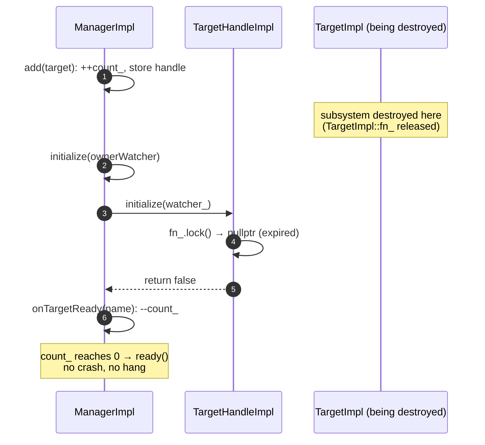

# Deep dive: Manager, Target & Watcher implementations

Line-by-line walk-through of the three implementation pairs:
`manager_impl.{h,cc}`, `target_impl.{h,cc}`, `watcher_impl.{h,cc}`.

Read [`OVERVIEW.md`](OVERVIEW.md) first for the big picture and the weak-pointer safety model.

---

## 1. `WatcherImpl` / `WatcherHandleImpl` — the "you're done" callback

Start here because it's the simplest of the three and the other two depend on it.

### Construction

A watcher is "just a glorified callback function." It stores its callback in a **shared_ptr** so that handles can
hold weak references:

```cpp
// Plain ReadyFn variant: ignore the target-name argument.
WatcherImpl::WatcherImpl(absl::string_view name, ReadyFn fn)
    : name_(name),
      fn_(std::make_shared<TargetAwareReadyFn>(
          [callback = std::move(fn)](absl::string_view) { callback(); })) {}

// Target-aware variant: keep the name (used by ManagerImpl).
WatcherImpl::WatcherImpl(absl::string_view name, TargetAwareReadyFn fn)
    : name_(name), fn_(std::make_shared<TargetAwareReadyFn>(std::move(fn))) {}
```

Both constructors normalize to a single internal type, `TargetAwareReadyFn = std::function<void(string_view)>`.
The plain `ReadyFn` overload just discards the name. `ManagerImpl` always uses the target-aware form so it can
track *which* target finished.

### `createHandle` — minting a weak reference

```cpp
WatcherHandlePtr WatcherImpl::createHandle(absl::string_view handle_name) const {
  return std::unique_ptr<WatcherHandle>(
      new WatcherHandleImpl(handle_name, name_, std::weak_ptr<TargetAwareReadyFn>(fn_)));
}
```

The handle gets a `weak_ptr` to `fn_`. As long as the `WatcherImpl` lives, `fn_` lives, and the weak pointer can
be locked.

### `ready` — the safe notification

```cpp
bool WatcherHandleImpl::ready() const {
  auto locked_fn(fn_.lock());
  if (locked_fn) {
    (*locked_fn)(handle_name_);   // watcher alive → fire callback (pass the notifier's name)
    return true;
  }
  return false;                   // watcher destroyed → safe no-op
}
```

The `handle_name_` passed back is the name of whoever is notifying (e.g. the target's name), which is how the
manager's target-aware watcher learns which target completed.

---

## 2. `TargetImpl` / `TargetHandleImpl` — the "go initialize" callback

### The two-layer callback

A user creates a target with a simple `InitializeFn = std::function<void()>`. Internally, the target wraps it in
an `InternalInitializeFn = std::function<void(WatcherHandlePtr)>` so the framework can hand it the manager's
watcher handle at the moment of initialization:

```cpp
TargetImpl::TargetImpl(absl::string_view name, InitializeFn fn)
    : name_(fmt::format("target {}", name)),
      fn_(std::make_shared<InternalInitializeFn>(
          [this, fn](WatcherHandlePtr watcher_handle) {
            watcher_handle_ = std::move(watcher_handle);  // remember who to notify
            fn();                                         // run the user's init body
          })) {}
```

Again `fn_` is a **shared_ptr** so handles can weak-reference it.

### `createHandle` and `initialize`

```cpp
TargetHandlePtr TargetImpl::createHandle(absl::string_view handle_name) const {
  return TargetHandlePtr(
      new TargetHandleImpl(handle_name, name_, std::weak_ptr<InternalInitializeFn>(fn_)));
}

bool TargetHandleImpl::initialize(const Watcher& watcher) const {
  auto locked_fn(fn_.lock());
  if (locked_fn) {
    (*locked_fn)(watcher.createHandle(name_));  // target alive: run init, give it a watcher handle
    return true;
  }
  return false;                                 // target destroyed: tell manager "treat as done"
}
```

Note the manager passes *its own* watcher; the target creates a handle to it and stores it as
`watcher_handle_`, to be fired later from `ready()`.

### `ready` — completion with re-entrancy safety

```cpp
bool TargetImpl::ready() {
  if (watcher_handle_) {
    auto local_watcher_handle = std::move(watcher_handle_);  // move out BEFORE notifying
    return local_watcher_handle->ready();
  }
  fn_.reset();   // not yet initialized: drop fn so a later initialize() won't hang
  return false;
}
```

Two cases:

1. **Already initialized** (`watcher_handle_` set): move the handle to a local, then notify. The move matters —
   notifying the manager can synchronously cause *this* target to be destroyed (e.g. a listener torn down on
   init failure); touching `watcher_handle_` afterward would be a use-after-free.
2. **Not yet initialized** (`watcher_handle_` null): the owner is signalling readiness *before* the manager
   started. Reset `fn_` so that when the manager finally calls `initialize()`, the weak-ptr lock fails and the
   manager counts this target as already-done instead of waiting forever.

### `SharedTargetImpl` — one init, many managers

```cpp
SharedTargetImpl::SharedTargetImpl(absl::string_view name, InitializeFn fn)
    : name_(fmt::format("shared target {}", name)),
      fn_(std::make_shared<InternalInitializeFn>(
          [this, fn](WatcherHandlePtr watcher_handle) {
            if (initialized_) {
              watcher_handle->ready();                 // already done: notify immediately
            } else {
              watcher_handles_.push_back(std::move(watcher_handle));  // queue this manager
              std::call_once(once_flag_, fn);          // run init exactly once
            }
          })) {}

bool SharedTargetImpl::ready() {
  initialized_ = true;
  auto local_watcher_handles = std::move(watcher_handles_);  // move-before-notify, same reason
  bool all_notified = !local_watcher_handles.empty();
  for (auto& watcher_handle : local_watcher_handles) {
    all_notified = watcher_handle->ready() && all_notified;
  }
  return all_notified;
}
```

The differences from `TargetImpl`:

- It accumulates a **vector** of watcher handles, one per manager that added it.
- `std::call_once` guarantees the expensive init body runs a single time no matter how many managers poke it.
- A manager that adds it *after* `initialized_` is true gets an immediate `ready()` — no hang.

---

## 3. `ManagerImpl` — the coordinator

### Construction

```cpp
ManagerImpl::ManagerImpl(absl::string_view name)
    : name_(fmt::format("init manager {}", name)),
      watcher_(name_, [this](absl::string_view target_name) { onTargetReady(target_name); }) {}
```

The manager owns one internal `watcher_` (target-aware). Every target it initializes is given a handle to this
`watcher_`, so all target completions funnel into `onTargetReady`.

### `add` — registration vs. immediate init

```cpp
void ManagerImpl::add(const Target& target) {
  ++count_;                                         // (A) increment BEFORE possibly invoking
  TargetHandlePtr target_handle(target.createHandle(name_));
  ++target_names_count_[target.name()];
  switch (state_) {
  case State::Uninitialized:
    target_handles_.push_back(std::move(target_handle));   // save for later
    return;
  case State::Initializing:
    target_handle->initialize(watcher_);            // (B) init now — may call back synchronously
    return;
  case State::Initialized:
    ASSERT(false, ...);                             // adding after done is a bug
  }
}
```

The ordering at `(A)` is deliberate: `count_` is incremented *before* `(B)` may synchronously invoke
`onTargetReady` (if the target calls `ready()` inline). Otherwise the count could underflow.

### `initialize` — kick everything off

```cpp
void ManagerImpl::initialize(const Watcher& watcher) {
  ASSERT(state_ == State::Uninitialized, ...);      // can't initialize twice
  watcher_handle_ = watcher.createHandle(name_);     // remember the owner's watcher

  if (count_ == 0) {
    ready();                                         // no targets → done immediately
  } else {
    state_ = State::Initializing;
    for (const auto& target_handle : target_handles_) {
      if (!target_handle->initialize(watcher_)) {    // unavailable target...
        onTargetReady(target_handle->name());        // ...counts as already-ready
      }
    }
  }
}
```

The `if (!initialize(...))` branch is the payoff of the weak-pointer design: a target that was destroyed between
`add()` and `initialize()` returns `false`, and the manager simply treats it as complete.

### `onTargetReady` and `ready`

```cpp
void ManagerImpl::onTargetReady(absl::string_view target_name) {
  ASSERT(count_ != 0, ...);                          // a callback after completion = "haunted"
  if (--target_names_count_[target_name] == 0) {
    target_names_count_.erase(target_name);          // maintain the unready-name set
  }
  if (--count_ == 0) {                               // last target?
    ready();
  }
}

void ManagerImpl::ready() {
  state_ = State::Initialized;
  watcher_handle_->ready();                          // notify the owner's watcher
}
```

### `updateWatcher` and `dumpUnreadyTargets`

```cpp
void ManagerImpl::updateWatcher(const Watcher& watcher) {
  ASSERT(state_ != State::Initialized, ...);
  watcher_handle_ = watcher.createHandle(name_);      // swap who gets notified
}
```

`updateWatcher` lets the owner change who receives the "all done" callback mid-flight (used when ownership of an
init flow is handed off, e.g. listener draining/replacement).

```cpp
void ManagerImpl::dumpUnreadyTargets(envoy::admin::v3::UnreadyTargetsDumps& dumps) {
  auto& message = *dumps.mutable_unready_targets_dumps()->Add();
  message.set_name(name_);
  for (const auto& [target_name, count] : target_names_count_) {
    message.add_target_names(target_name);            // feed admin /init_dump
  }
}
```

This is what makes "which targets are blocking startup?" answerable from the admin interface.

---

## End-to-end: a target destroyed mid-flight



---

## Gotchas

- **Never capture the `Slot`/target/owner in a way that outlives it.** The handle/weak-ptr design protects the
  *callback dispatch*, but if your `InitializeFn` body captures a raw `this` that gets destroyed, that's on you.
- **`add()` after `Initialized` is fatal in debug builds.** If you see this `ASSERT`, a subsystem is registering
  a target too late.
- **No timeouts here.** If startup hangs, check `/init_dump` for the un-ready target name, then look at *that*
  subsystem (e.g. an xDS stream that never delivered its first response).
- **Synchronous `ready()` is supported** thanks to the increment-before-invoke ordering in `add()` and
  `initialize()` — a target may call `ready()` from inside its own init body.

---

## Cross-references

- [`OVERVIEW.md`](OVERVIEW.md) — design rationale, state machine, nesting.
- [`CLASS_HIERARCHY.md`](CLASS_HIERARCHY.md) — UML.
- [`../rds/rds_route_config_subscription.md`](../rds/rds_route_config_subscription.md) — a real target in action.
